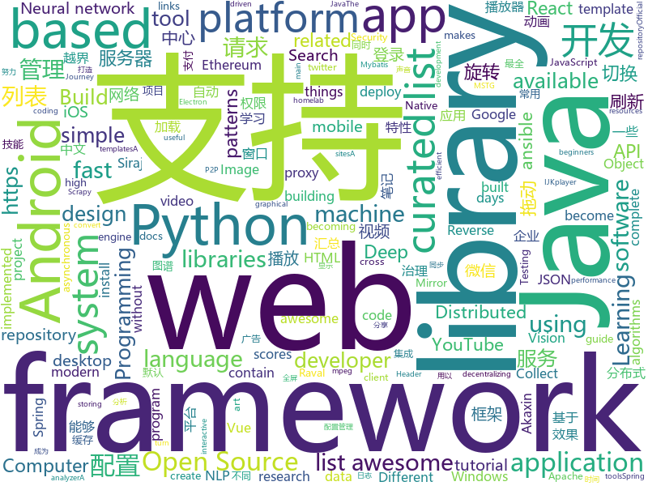

# 2018-07-07
See what the GitHub community is most excited about today.

## python
* [termtosvg](https://github.com/nbedos/termtosvg)(**553 stars today**): Record terminal sessions as SVG animations
* [cartoonify](https://github.com/danmacnish/cartoonify)(**276 stars today**): python app to turn a photograph into a cartoon
* [youtube-dl](https://github.com/rg3/youtube-dl)(**270 stars today**): Command-line program to download videos from YouTube.com and other video sites
* [tweets_analyzer](https://github.com/x0rz/tweets_analyzer)(**196 stars today**): Tweets metadata scraper & activity analyzer
* [awesome-machine-learning](https://github.com/josephmisiti/awesome-machine-learning)(**82 stars today**): A curated list of awesome Machine Learning frameworks, libraries and software.
* [models](https://github.com/tensorflow/models)(**57 stars today**): Models and examples built with TensorFlow
* [mps-youtube](https://github.com/mps-youtube/mps-youtube)(**67 stars today**): Terminal based YouTube player and downloader
* [EagleEye](https://github.com/ThoughtfulDev/EagleEye)(**58 stars today**): Stalk your Friends. Find their Instagram, FB and Twitter Profiles using Image Recognition and Reverse Image Search.
* [vibora](https://github.com/vibora-io/vibora)(**54 stars today**): Fast, asynchronous and elegant Python web framework.
* [awesome-python](https://github.com/vinta/awesome-python)(**49 stars today**): A curated list of awesome Python frameworks, libraries, software and resources
* [public-apis](https://github.com/toddmotto/public-apis)(**44 stars today**): A collective list of public JSON APIs for use in web development.
* [keras](https://github.com/keras-team/keras)(**32 stars today**): Deep Learning for humans
* [requests](https://github.com/requests/requests)(**36 stars today**): Python HTTP Requests for Humans™✨🍰✨
* [system-design-primer](https://github.com/donnemartin/system-design-primer)(**36 stars today**): Learn how to design large-scale systems. Prep for the system design interview. Includes Anki flashcards.
* [flask](https://github.com/pallets/flask)(**32 stars today**): The Python micro framework for building web applications.
* [ansible](https://github.com/ansible/ansible)(**26 stars today**): Ansible is a radically simple IT automation platform that makes your applications and systems easier to deploy. Avoid writing scripts or custom code to deploy and update your applications — automate in a language that approaches plain English, using SSH, with no agents to install on remote systems. https://docs.ansible.com/ansible/
* [scrapy](https://github.com/scrapy/scrapy)(**33 stars today**): Scrapy, a fast high-level web crawling & scraping framework for Python.
* [ImageAI](https://github.com/OlafenwaMoses/ImageAI)(**30 stars today**): A python library built to empower developers to build applications and systems with self-contained Computer Vision capabilities
* [robosat](https://github.com/mapbox/robosat)(**31 stars today**): Semantic segmentation on aerial and satellite imagery. Extracts features such as: buildings, parking lots, roads, water
* [django](https://github.com/django/django)(**23 stars today**): The Web framework for perfectionists with deadlines.
* [cheat.sh](https://github.com/chubin/cheat.sh)(**31 stars today**): the only cheat sheet you need
* [XX-Net](https://github.com/XX-net/XX-Net)(**27 stars today**): a web proxy tool
* [Detectron](https://github.com/facebookresearch/Detectron)(**27 stars today**): FAIR's research platform for object detection research, implementing popular algorithms like Mask R-CNN and RetinaNet.
* [mlflow](https://github.com/databricks/mlflow)(**25 stars today**): Open source platform for the complete machine learning lifecycle
* [plotly.py](https://github.com/plotly/plotly.py)(**28 stars today**): An interactive, browser-based graphing library for Python✨

## java
* [Java-Interview](https://github.com/crossoverJie/Java-Interview)(**235 stars today**): 👨‍🎓Java related : basic, concurrent, algorithm
* [java-design-patterns](https://github.com/iluwatar/java-design-patterns)(**71 stars today**): Design patterns implemented in Java
* [vjtools](https://github.com/vipshop/vjtools)(**75 stars today**): The vip.com's java coding standard, libraries and tools
* [spring-boot](https://github.com/spring-projects/spring-boot)(**59 stars today**): Spring Boot
* [weixin-java-tools](https://github.com/Wechat-Group/weixin-java-tools)(**63 stars today**): 可能是目前最好最全的微信Java开发工具包，支持包括微信支付、开放平台、小程序、企业号和公众号等的开发
* [elasticsearch](https://github.com/elastic/elasticsearch)(**51 stars today**): Open Source, Distributed, RESTful Search Engine
* [apollo](https://github.com/ctripcorp/apollo)(**40 stars today**): Apollo（阿波罗）是携程框架部门研发的分布式配置中心，能够集中化管理应用不同环境、不同集群的配置，配置修改后能够实时推送到应用端，并且具备规范的权限、流程治理等特性，适用于微服务配置管理场景。
* [incubator-dubbo](https://github.com/apache/incubator-dubbo)(**34 stars today**): Apache Dubbo (incubating) is a high-performance, java based, open source RPC framework.
* [SmartRefreshLayout](https://github.com/scwang90/SmartRefreshLayout)(**37 stars today**): 🔥下拉刷新、上拉加载、二级刷新、淘宝二楼、RefreshLayout、OverScroll，Android智能下拉刷新框架，支持越界回弹、越界拖动，具有极强的扩展性，集成了几十种炫酷的Header和 Footer。
* [tutorials](https://github.com/eugenp/tutorials)(**21 stars today**): The "REST With Spring" Course:
* [openzaly](https://github.com/akaxincom/openzaly)(**34 stars today**): openzaly 是 Akaxin 的服务器源代码，用以搭建私有聊天服务器。 服务器安装教程：https://www.akaxin.com/docs/install/index.html QQ群: 655249600
* [spring-framework](https://github.com/spring-projects/spring-framework)(**30 stars today**): Spring Framework
* [AndroidUtilCode](https://github.com/Blankj/AndroidUtilCode)(**32 stars today**): 🔥Android developers should collect the following utils(updating).
* [CommonDevKnowledge](https://github.com/AweiLoveAndroid/CommonDevKnowledge)(**32 stars today**): 🔥🌟⭐️⭐️⭐️⭐️史上最全的BAT大厂Android面试题汇集，以及常用的Android开发的一些技能点，冷门知识点汇总，开发中遇到的坑汇总等干货。
* [pandora](https://github.com/whataa/pandora)(**32 stars today**): an android library for debugging what we care about directly in app.
* [RxEasyHttp](https://github.com/zhou-you/RxEasyHttp)(**32 stars today**): 本库是一款基于RxJava2+Retrofit2实现简单易用的网络请求框架，结合android平台特性的网络封装库,采用api链式调用一点到底,集成cookie管理,多种缓存模式,极简https配置,上传下载进度显示,请求错误自动重试,请求携带token、时间戳、签名sign动态配置,自动登录成功后请求重发功能,3种层次的参数设置默认全局局部,默认标准ApiResult同时可以支持自定义的数据结构，已经能满足现在的大部分网络请求。
* [lottie-android](https://github.com/airbnb/lottie-android)(**28 stars today**): Render After Effects animations natively on Android and iOS, Web, and React Native
* [GSYVideoPlayer](https://github.com/CarGuo/GSYVideoPlayer)(**25 stars today**): 视频播放器（IJKplayer、ExoPlayer、MediaPlayer），HTTPS支持，支持弹幕，支持滤镜、水印、gif截图，片头广告、中间广告，多个同时播放，支持基本的拖动，声音、亮度调节，支持边播边缓存，支持视频本身自带rotation的旋转（90,270之类），重力旋转与手动旋转的同步支持，支持列表播放 ，直接添加控件为封面，列表全屏动画，视频加载速度，列表小窗口支持拖动，动画效果，调整比例，多分辨率切换，支持切换播放器，进度条小窗口预览，列表切换详情页面无缝播放，其他一些小动画效果，rtsp、concat、mpeg。项目解析：
* [zheng](https://github.com/shuzheng/zheng)(**21 stars today**): 基于Spring+SpringMVC+Mybatis分布式敏捷开发系统架构，提供整套公共微服务服务模块：集中权限管理（单点登录）、内容管理、支付中心、用户管理（支持第三方登录）、微信平台、存储系统、配置中心、日志分析、任务和通知等，支持服务治理、监控和追踪，努力为中小型企业打造全方位J2EE企业级开发解决方案。
* [ballerina-lang](https://github.com/ballerina-platform/ballerina-lang)(**25 stars today**): Ballerina is a compiled, transactional, statically and strongly typed programming language with textual and graphical syntaxes.
* [RxJava](https://github.com/ReactiveX/RxJava)(**24 stars today**): RxJava – Reactive Extensions for the JVM – a library for composing asynchronous and event-based programs using observable sequences for the Java VM.
* [Java](https://github.com/TheAlgorithms/Java)(**21 stars today**): All Algorithms implemented in Java
* [okhttp](https://github.com/square/okhttp)(**24 stars today**): An HTTP+HTTP/2 client for Android and Java applications.
* [Dragonfly](https://github.com/alibaba/Dragonfly)(**22 stars today**): Dragonfly is an intelligent P2P based file distribution system.
* [kafka](https://github.com/apache/kafka)(**18 stars today**): Mirror of Apache Kafka

## unknown
* [react-developer-roadmap](https://github.com/adam-golab/react-developer-roadmap)(**514 stars today**): Roadmap to becoming a React developer in 2018
* [vue-patterns](https://github.com/learn-vuejs/vue-patterns)(**302 stars today**): Useful Vue patterns, techniques, tips and tricks and helpful curated links.
* [100_Days_of_ML_Code](https://github.com/llSourcell/100_Days_of_ML_Code)(**138 stars today**): These are the instructions for "100 Days of ML Code" By Siraj Raval on Youtube
* [developer-roadmap](https://github.com/kamranahmedse/developer-roadmap)(**122 stars today**): Roadmap to becoming a web developer in 2018
* [build-your-own-x](https://github.com/danistefanovic/build-your-own-x)(**101 stars today**): 🤓Build your own (insert technology here)
* [homelab](https://github.com/bradfitz/homelab)(**90 stars today**): Brad's homelab setup
* [Interview-Notebook](https://github.com/CyC2018/Interview-Notebook)(**66 stars today**): 📆准备秋招学习笔记
* [NLP-progress](https://github.com/sebastianruder/NLP-progress)(**65 stars today**): Repository to track the progress in Natural Language Processing (NLP), including the datasets and the current state-of-the-art for the most common NLP tasks.
* [architect-awesome](https://github.com/xingshaocheng/architect-awesome)(**56 stars today**): 后端架构师技术图谱
* [project-based-learning](https://github.com/tuvtran/project-based-learning)(**58 stars today**): Curated list of project-based tutorials
* [awesome](https://github.com/sindresorhus/awesome)(**55 stars today**): 😎Curated list of awesome lists
* [gitignore](https://github.com/github/gitignore)(**37 stars today**): A collection of useful .gitignore templates
* [You-Dont-Know-JS](https://github.com/getify/You-Dont-Know-JS)(**50 stars today**): A book series on JavaScript. @YDKJS on twitter.
* [chinese-independent-developer](https://github.com/1c7/chinese-independent-developer)(**50 stars today**): 👩🏿‍💻👨🏾‍💻👩🏼‍💻👨🏽‍💻👩🏻‍💻中国独立开发者项目列表 -- 分享大家都在做什么
* [free-programming-books](https://github.com/EbookFoundation/free-programming-books)(**46 stars today**): 📚Freely available programming books
* [100-days-of-code](https://github.com/kallaway/100-days-of-code)(**37 stars today**): Fork this template for the 100 days journal - to keep yourself accountable (multiple languages available)
* [ethereum-developer-tools-list](https://github.com/ConsenSysLabs/ethereum-developer-tools-list)(**41 stars today**): A guide to available tools and platforms for developing on Ethereum.
* [awesome-vue](https://github.com/vuejs/awesome-vue)(**43 stars today**): 🎉A curated list of awesome things related to Vue.js
* [awesome-design-patterns](https://github.com/DovAmir/awesome-design-patterns)(**39 stars today**): A curated list of software and architecture related design patterns.
* [awesome-flutter](https://github.com/Solido/awesome-flutter)(**39 stars today**): An awesome list that curates the best Flutter libraries, tools, tutorials, articles and more.
* [coding-interview-university](https://github.com/jwasham/coding-interview-university)(**32 stars today**): A complete computer science study plan to become a software engineer.
* [Machine_Learning_Journey](https://github.com/llSourcell/Machine_Learning_Journey)(**27 stars today**): This is the Curriculum for "Machine Learning Journey" By Siraj Raval on Youtube
* [SSTab-Rule](https://github.com/FQrabbit/SSTab-Rule)(**26 stars today**): 支持更多游戏规则，让SSTap成为真正的“网游加速器”
* [package-json](https://github.com/pkg-json/package-json)(**28 stars today**): Spec for package.json
* [awesome-cpp](https://github.com/fffaraz/awesome-cpp)(**22 stars today**): A curated list of awesome C++ (or C) frameworks, libraries, resources, and shiny things. Inspired by awesome-... stuff.

## c++
* [tensorflow](https://github.com/tensorflow/tensorflow)(**104 stars today**): Computation using data flow graphs for scalable machine learning
* [apollo](https://github.com/ApolloAuto/apollo)(**82 stars today**): An open autonomous driving platform
* [electron](https://github.com/electron/electron)(**46 stars today**): Build cross platform desktop apps with JavaScript, HTML, and CSS
* [opencv](https://github.com/opencv/opencv)(**30 stars today**): Open Source Computer Vision Library
* [bitcoin](https://github.com/bitcoin/bitcoin)(**27 stars today**): Bitcoin Core integration/staging tree
* [protobuf](https://github.com/google/protobuf)(**29 stars today**): Protocol Buffers - Google's data interchange format
* [tesseract](https://github.com/tesseract-ocr/tesseract)(**27 stars today**): Tesseract Open Source OCR Engine (main repository)
* [pytorch](https://github.com/pytorch/pytorch)(**20 stars today**): Tensors and Dynamic neural networks in Python with strong GPU acceleration
* [swift](https://github.com/apple/swift)(**24 stars today**): The Swift Programming Language
* [aseprite](https://github.com/aseprite/aseprite)(**23 stars today**): Animated sprite editor & pixel art tool (Windows, macOS, Linux)
* [Ender-3](https://github.com/Creality3DPrinting/Ender-3)(**19 stars today**): The Creality3D Ender-3, a fully Open Source 3D printer perfect for new users on a budget.
* [fmt](https://github.com/fmtlib/fmt)(**18 stars today**): A modern formatting library
* [envoy](https://github.com/envoyproxy/envoy)(**17 stars today**): C++ front/service proxy
* [grpc](https://github.com/grpc/grpc)(**15 stars today**): The C based gRPC (C++, Python, Ruby, Objective-C, PHP, C#)
* [frisky](https://github.com/samyk/frisky)(**16 stars today**): Instruments to assist in binary application reversing and augmentation, geared towards walled gardens like iOS and macOS
* [Paddle](https://github.com/PaddlePaddle/Paddle)(**15 stars today**): PArallel Distributed Deep LEarning
* [tdesktop](https://github.com/telegramdesktop/tdesktop)(**15 stars today**): Telegram Desktop messaging app
* [xgboost](https://github.com/dmlc/xgboost)(**13 stars today**): Scalable, Portable and Distributed Gradient Boosting (GBDT, GBRT or GBM) Library, for Python, R, Java, Scala, C++ and more. Runs on single machine, Hadoop, Spark, Flink and DataFlow
* [solidity](https://github.com/ethereum/solidity)(**14 stars today**): Solidity, the Contract-Oriented Programming Language
* [mace](https://github.com/XiaoMi/mace)(**15 stars today**): MACE is a deep learning inference framework optimized for mobile heterogeneous computing platforms.
* [faiss](https://github.com/facebookresearch/faiss)(**14 stars today**): A library for efficient similarity search and clustering of dense vectors.
* [v8](https://github.com/v8/v8)(**14 stars today**): The official mirror of the V8 Git repository
* [fann](https://github.com/libfann/fann)(**15 stars today**): Official github repository for Fast Artificial Neural Network Library (FANN)
* [googletest](https://github.com/google/googletest)(**13 stars today**): Google Test
* [mongo](https://github.com/mongodb/mongo)(**13 stars today**): The MongoDB Database

## html
* [itty-bitty](https://github.com/alcor/itty-bitty)(**704 stars today**): Itty.bitty is a tool to create links that contain small sites
* [hacker-job-trends](https://github.com/timqian/hacker-job-trends)(**285 stars today**): 
* [react-from-zero](https://github.com/kay-is/react-from-zero)(**173 stars today**): A simple (99% ES2015 less) tutorial for React
* [Publii](https://github.com/GetPublii/Publii)(**38 stars today**): Publii is a desktop-based CMS for Windows and Mac that makes creating static websites fast and hassle-free, even for beginners.
* [awesome-mac](https://github.com/jaywcjlove/awesome-mac)(**23 stars today**):  Now we have become very big, Different from the original idea. Collect premium software in various categories.
* [solid](https://github.com/solid/solid)(**22 stars today**): Solid - Re-decentralizing the web (project directory)
* [skill-map](https://github.com/TeamStuQ/skill-map)(**19 stars today**): 程序员技能图谱
* [fastText](https://github.com/facebookresearch/fastText)(**14 stars today**): Library for fast text representation and classification.
* [EIPs](https://github.com/ethereum/EIPs)(**13 stars today**): The Ethereum Improvement Proposal repository
* [Spoon-Knife](https://github.com/octocat/Spoon-Knife)(****): This repo is for demonstration purposes only.
* [portainer](https://github.com/portainer/portainer)(**12 stars today**): Simple management UI for Docker
* [gson](https://github.com/google/gson)(**10 stars today**): A Java serialization/deserialization library to convert Java Objects into JSON and back
* [awesome-resume](https://github.com/resumejob/awesome-resume)(**10 stars today**): 包含简历常用例句
* [capacitor](https://github.com/ionic-team/capacitor)(**10 stars today**): Build cross-platform Native Progressive Web Apps for iOS, Android, and the web⚡️
* [Coursera-ML-AndrewNg-Notes](https://github.com/fengdu78/Coursera-ML-AndrewNg-Notes)(**8 stars today**): 吴恩达老师的机器学习课程个人笔记
* [electron-api-demos](https://github.com/electron/electron-api-demos)(**9 stars today**): Explore the Electron APIs
* [mkdocs-material](https://github.com/squidfunk/mkdocs-material)(**8 stars today**): A Material Design theme for MkDocs
* [brain.js](https://github.com/BrainJS/brain.js)(**8 stars today**): 🤖Neural networks in JavaScript
* [swagger-codegen](https://github.com/swagger-api/swagger-codegen)(**8 stars today**): swagger-codegen contains a template-driven engine to generate documentation, API clients and server stubs in different languages by parsing your OpenAPI / Swagger definition.
* [Winds](https://github.com/GetStream/Winds)(**8 stars today**): A Beautiful Open Source RSS & Podcast App
* [d3js_doc](https://github.com/xswei/d3js_doc)(**8 stars today**): D3js中文文档 D3中文📊📈🎉
* [owasp-mstg](https://github.com/OWASP/owasp-mstg)(**7 stars today**): The Mobile Security Testing Guide (MSTG) is a comprehensive manual for mobile app security testing and reverse engineering.
* [EarlyAP](https://github.com/jbman223/EarlyAP)(**7 stars today**): Proxy specifically available for AP scores to enable simple early access to your scores without any storing of your College Board account details or dealing with untrustable proxies.
* [polymer](https://github.com/Polymer/polymer)(**6 stars today**): Build modern apps using web components
* [react-app-rewired](https://github.com/timarney/react-app-rewired)(**6 stars today**): Override create-react-app webpack configs without ejecting

## WordCloud

