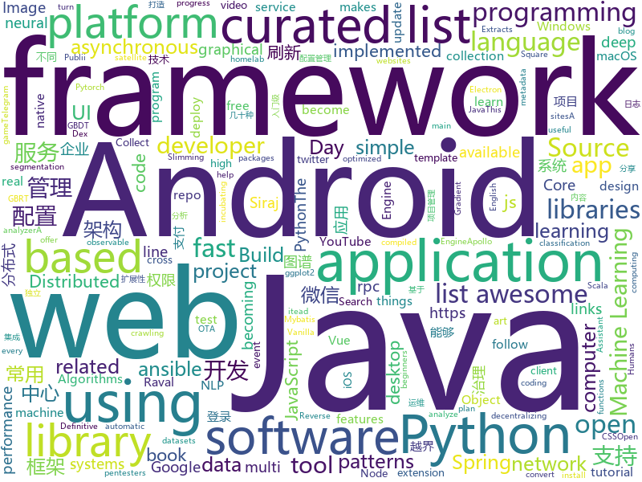

# 2018-07-08
See what the GitHub community is most excited about today.

## python
* [termtosvg](https://github.com/nbedos/termtosvg)(**159 stars today**): Record terminal sessions as SVG animations
* [erc20-ico-onchain-technical-analysis](https://github.com/DeuroIO/erc20-ico-onchain-technical-analysis)(**161 stars today**): An tool to analyze any company's ICO
* [cartoonify](https://github.com/danmacnish/cartoonify)(**110 stars today**): python app to turn a photograph into a cartoon
* [youtube-dl](https://github.com/rg3/youtube-dl)(**103 stars today**): Command-line program to download videos from YouTube.com and other video sites
* [GlobaLeaks](https://github.com/globaleaks/GlobaLeaks)(**95 stars today**): GlobaLeaks - The Open-Source Whistleblowing Software
* [models](https://github.com/tensorflow/models)(**34 stars today**): Models and examples built with TensorFlow
* [tweets_analyzer](https://github.com/x0rz/tweets_analyzer)(**45 stars today**): Tweets metadata scraper & activity analyzer
* [awesome-machine-learning](https://github.com/josephmisiti/awesome-machine-learning)(**36 stars today**): A curated list of awesome Machine Learning frameworks, libraries and software.
* [faceai](https://github.com/vipstone/faceai)(**35 stars today**): 一款入门级的人脸、视频、文字检测以及识别的项目.
* [awesome-python](https://github.com/vinta/awesome-python)(**35 stars today**): A curated list of awesome Python frameworks, libraries, software and resources
* [keras](https://github.com/keras-team/keras)(**30 stars today**): Deep Learning for humans
* [robosat](https://github.com/mapbox/robosat)(**35 stars today**): Semantic segmentation on aerial and satellite imagery. Extracts features such as: buildings, parking lots, roads, water
* [requests](https://github.com/requests/requests)(**29 stars today**): Python HTTP Requests for Humans™✨🍰✨
* [vibora](https://github.com/vibora-io/vibora)(**29 stars today**): Fast, asynchronous and elegant Python web framework.
* [scikit-learn](https://github.com/scikit-learn/scikit-learn)(**22 stars today**): scikit-learn: machine learning in Python
* [django](https://github.com/django/django)(**23 stars today**): The Web framework for perfectionists with deadlines.
* [Python](https://github.com/TheAlgorithms/Python)(**21 stars today**): All Algorithms implemented in Python
* [cpython](https://github.com/python/cpython)(**18 stars today**): The Python programming language
* [Apfell](https://github.com/its-a-feature/Apfell)(**24 stars today**): A macOS, post-exploit, red teaming framework
* [network-slimming](https://github.com/Eric-mingjie/network-slimming)(**24 stars today**): Network Slimming (Pytorch)
* [bips](https://github.com/sipa/bips)(**23 stars today**): Bitcoin Improvement Proposals
* [scrapy](https://github.com/scrapy/scrapy)(**21 stars today**): Scrapy, a fast high-level web crawling & scraping framework for Python.
* [ansible](https://github.com/ansible/ansible)(**17 stars today**): Ansible is a radically simple IT automation platform that makes your applications and systems easier to deploy. Avoid writing scripts or custom code to deploy and update your applications — automate in a language that approaches plain English, using SSH, with no agents to install on remote systems. https://docs.ansible.com/ansible/
* [msfenum](https://github.com/wez3/msfenum)(**22 stars today**): A Metasploit auto auxiliary script
* [EagleEye](https://github.com/ThoughtfulDev/EagleEye)(**21 stars today**): Stalk your Friends. Find their Instagram, FB and Twitter Profiles using Image Recognition and Reverse Image Search.

## java
* [Java-Interview](https://github.com/crossoverJie/Java-Interview)(**78 stars today**): 👨‍🎓Java related : basic, concurrent, algorithm
* [BurpSuiteHTTPSmuggler](https://github.com/nccgroup/BurpSuiteHTTPSmuggler)(**45 stars today**): A Burp Suite extension to help pentesters to bypass WAFs or test their effectiveness using a number of techniques
* [java-design-patterns](https://github.com/iluwatar/java-design-patterns)(**30 stars today**): Design patterns implemented in Java
* [LazyDatePicker](https://github.com/lopspower/LazyDatePicker)(**30 stars today**): This is an Android project to offer an alternative to the native Android Date Picker.
* [spring-boot](https://github.com/spring-projects/spring-boot)(**25 stars today**): Spring Boot
* [elasticsearch](https://github.com/elastic/elasticsearch)(**24 stars today**): Open Source, Distributed, RESTful Search Engine
* [apollo](https://github.com/ctripcorp/apollo)(**20 stars today**): Apollo（阿波罗）是携程框架部门研发的分布式配置中心，能够集中化管理应用不同环境、不同集群的配置，配置修改后能够实时推送到应用端，并且具备规范的权限、流程治理等特性，适用于微服务配置管理场景。
* [Java](https://github.com/TheAlgorithms/Java)(**20 stars today**): All Algorithms implemented in Java
* [spring-framework](https://github.com/spring-projects/spring-framework)(**16 stars today**): Spring Framework
* [tutorials](https://github.com/eugenp/tutorials)(**13 stars today**): The "REST With Spring" Course:
* [weixin-java-tools](https://github.com/Wechat-Group/weixin-java-tools)(**17 stars today**): 可能是目前最好最全的微信Java开发工具包，支持包括微信支付、开放平台、小程序、企业号和公众号等的开发
* [vjtools](https://github.com/vipshop/vjtools)(**18 stars today**): The vip.com's java coding standard, libraries and tools
* [incubator-dubbo](https://github.com/apache/incubator-dubbo)(**16 stars today**): Apache Dubbo (incubating) is a high-performance, java based, open source RPC framework.
* [guava](https://github.com/google/guava)(**17 stars today**): Google core libraries for Java
* [zheng](https://github.com/shuzheng/zheng)(**14 stars today**): 基于Spring+SpringMVC+Mybatis分布式敏捷开发系统架构，提供整套公共微服务服务模块：集中权限管理（单点登录）、内容管理、支付中心、用户管理（支持第三方登录）、微信平台、存储系统、配置中心、日志分析、任务和通知等，支持服务治理、监控和追踪，努力为中小型企业打造全方位J2EE企业级开发解决方案。
* [AndroidUtilCode](https://github.com/Blankj/AndroidUtilCode)(**13 stars today**): 🔥Android developers should collect the following utils(updating).
* [okhttp](https://github.com/square/okhttp)(**14 stars today**): An HTTP+HTTP/2 client for Android and Java applications.
* [netty](https://github.com/netty/netty)(**13 stars today**): Netty project - an event-driven asynchronous network application framework
* [ballerina-lang](https://github.com/ballerina-platform/ballerina-lang)(**14 stars today**): Ballerina is a compiled, transactional, statically and strongly typed programming language with textual and graphical syntaxes.
* [retrofit](https://github.com/square/retrofit)(**14 stars today**): Type-safe HTTP client for Android and Java by Square, Inc.
* [SmartRefreshLayout](https://github.com/scwang90/SmartRefreshLayout)(**10 stars today**): 🔥下拉刷新、上拉加载、二级刷新、淘宝二楼、RefreshLayout、OverScroll，Android智能下拉刷新框架，支持越界回弹、越界拖动，具有极强的扩展性，集成了几十种炫酷的Header和 Footer。
* [pandora](https://github.com/whataa/pandora)(**13 stars today**): an android library for debugging what we care about directly in app.
* [material-components-android](https://github.com/material-components/material-components-android)(**11 stars today**): Modular and customizable Material Design UI components for Android
* [RxJava](https://github.com/ReactiveX/RxJava)(**12 stars today**): RxJava – Reactive Extensions for the JVM – a library for composing asynchronous and event-based programs using observable sequences for the Java VM.
* [jadx](https://github.com/skylot/jadx)(**10 stars today**): Dex to Java decompiler

## unknown
* [react-developer-roadmap](https://github.com/adam-golab/react-developer-roadmap)(**816 stars today**): Roadmap to becoming a React developer in 2018
* [vue-patterns](https://github.com/learn-vuejs/vue-patterns)(**125 stars today**): Useful Vue patterns, techniques, tips and tricks and helpful curated links.
* [100_Days_of_ML_Code](https://github.com/llSourcell/100_Days_of_ML_Code)(**84 stars today**): These are the instructions for "100 Days of ML Code" By Siraj Raval on Youtube
* [developer-roadmap](https://github.com/kamranahmedse/developer-roadmap)(**63 stars today**): Roadmap to becoming a web developer in 2018
* [gitignore](https://github.com/github/gitignore)(**39 stars today**): A collection of useful .gitignore templates
* [build-your-own-x](https://github.com/danistefanovic/build-your-own-x)(**45 stars today**): 🤓Build your own (insert technology here)
* [coding-interview-university](https://github.com/jwasham/coding-interview-university)(**38 stars today**): A complete computer science study plan to become a software engineer.
* [Interview-Notebook](https://github.com/CyC2018/Interview-Notebook)(**36 stars today**): 📆准备秋招学习笔记
* [awesome](https://github.com/sindresorhus/awesome)(**36 stars today**): 😎Curated list of awesome lists
* [free-programming-books](https://github.com/EbookFoundation/free-programming-books)(**32 stars today**): 📚Freely available programming books
* [architect-awesome](https://github.com/xingshaocheng/architect-awesome)(**29 stars today**): 后端架构师技术图谱
* [awesome-vue](https://github.com/vuejs/awesome-vue)(**31 stars today**): 🎉A curated list of awesome things related to Vue.js
* [NLP-progress](https://github.com/sebastianruder/NLP-progress)(**31 stars today**): Repository to track the progress in Natural Language Processing (NLP), including the datasets and the current state-of-the-art for the most common NLP tasks.
* [You-Dont-Know-JS](https://github.com/getify/You-Dont-Know-JS)(**24 stars today**): A book series on JavaScript. @YDKJS on twitter.
* [awesome-design-patterns](https://github.com/DovAmir/awesome-design-patterns)(**26 stars today**): A curated list of software and architecture related design patterns.
* [awesome-flutter](https://github.com/Solido/awesome-flutter)(**23 stars today**): An awesome list that curates the best Flutter libraries, tools, tutorials, articles and more.
* [The-complete-guide-to-modern-JavaScript-from-es2015-to-es2018](https://github.com/AlbertoMontalesi/The-complete-guide-to-modern-JavaScript-from-es2015-to-es2018)(**21 stars today**): A short, easy-to-follow ebook to learn about all the new features introduced from 2015 to 2018. Read more on my blog https://www.inspiredwebdev.com
* [100-days-of-code](https://github.com/kallaway/100-days-of-code)(**16 stars today**): Fork this template for the 100 days journal - to keep yourself accountable (multiple languages available)
* [homelab](https://github.com/bradfitz/homelab)(**20 stars today**): Brad's homelab setup
* [chinese-independent-developer](https://github.com/1c7/chinese-independent-developer)(**19 stars today**): 👩🏿‍💻👨🏾‍💻👩🏼‍💻👨🏽‍💻👩🏻‍💻中国独立开发者项目列表 -- 分享大家都在做什么
* [every-programmer-should-know](https://github.com/mtdvio/every-programmer-should-know)(**16 stars today**): A collection of (mostly) technical things every software developer should know
* [awesome-nodejs](https://github.com/sindresorhus/awesome-nodejs)(**15 stars today**): ⚡️Delightful Node.js packages and resources
* [Machine_Learning_Journey](https://github.com/llSourcell/Machine_Learning_Journey)(**13 stars today**): This is the Curriculum for "Machine Learning Journey" By Siraj Raval on Youtube
* [technology-talk](https://github.com/aalansehaiyang/technology-talk)(**12 stars today**): 汇总java生态圈常用技术框架、开源中间件，系统架构、项目管理、经典架构案例、数据库、常用三方库、线上运维等知识
* [awesome-android-ui](https://github.com/wasabeef/awesome-android-ui)(**11 stars today**): A curated list of awesome Android UI/UX libraries

## c++
* [tensorflow](https://github.com/tensorflow/tensorflow)(**73 stars today**): Computation using data flow graphs for scalable machine learning
* [pytorch](https://github.com/pytorch/pytorch)(**24 stars today**): Tensors and Dynamic neural networks in Python with strong GPU acceleration
* [electron](https://github.com/electron/electron)(**25 stars today**): Build cross platform desktop apps with JavaScript, HTML, and CSS
* [opencv](https://github.com/opencv/opencv)(**20 stars today**): Open Source Computer Vision Library
* [apollo](https://github.com/ApolloAuto/apollo)(**22 stars today**): An open autonomous driving platform
* [bitcoin](https://github.com/bitcoin/bitcoin)(**18 stars today**): Bitcoin Core integration/staging tree
* [protobuf](https://github.com/google/protobuf)(**20 stars today**): Protocol Buffers - Google's data interchange format
* [swift](https://github.com/apple/swift)(**15 stars today**): The Swift Programming Language
* [godot](https://github.com/godotengine/godot)(**15 stars today**): Godot Engine – Multi-platform 2D and 3D game engine
* [caffe](https://github.com/BVLC/caffe)(**14 stars today**): Caffe: a fast open framework for deep learning.
* [aseprite](https://github.com/aseprite/aseprite)(**15 stars today**): Animated sprite editor & pixel art tool (Windows, macOS, Linux)
* [tesseract](https://github.com/tesseract-ocr/tesseract)(**13 stars today**): Tesseract Open Source OCR Engine (main repository)
* [imgui](https://github.com/ocornut/imgui)(**12 stars today**): Dear ImGui: Bloat-free Immediate Mode Graphical User interface for C++ with minimal dependencies
* [frisky](https://github.com/samyk/frisky)(**12 stars today**): Instruments to assist in binary application reversing and augmentation, geared towards walled gardens like iOS and macOS
* [devilution](https://github.com/diasurgical/devilution)(**11 stars today**): Diablo devolved - magic behind the 1996 computer game
* [tdesktop](https://github.com/telegramdesktop/tdesktop)(**11 stars today**): Telegram Desktop messaging app
* [xgboost](https://github.com/dmlc/xgboost)(**8 stars today**): Scalable, Portable and Distributed Gradient Boosting (GBDT, GBRT or GBM) Library, for Python, R, Java, Scala, C++ and more. Runs on single machine, Hadoop, Spark, Flink and DataFlow
* [Tars](https://github.com/Tencent/Tars)(**9 stars today**): Tars is a highly performance rpc framework based on naming service using tars protocol and provides a semi-automatic operation platform.
* [envoy](https://github.com/envoyproxy/envoy)(**9 stars today**): C++ front/service proxy
* [openpose](https://github.com/CMU-Perceptual-Computing-Lab/openpose)(**9 stars today**): OpenPose: Real-time multi-person keypoint detection library for body, face, and hands estimation
* [Sonoff-Tasmota](https://github.com/arendst/Sonoff-Tasmota)(**8 stars today**): Provide ESP8266 based itead Sonoff with Web, MQTT and OTA firmware using Arduino IDE or PlatformIO
* [dlib](https://github.com/davisking/dlib)(**7 stars today**): A toolkit for making real world machine learning and data analysis applications in C++
* [grpc](https://github.com/grpc/grpc)(**6 stars today**): The C based gRPC (C++, Python, Ruby, Objective-C, PHP, C#)
* [mace](https://github.com/XiaoMi/mace)(**7 stars today**): MACE is a deep learning inference framework optimized for mobile heterogeneous computing platforms.
* [ceph](https://github.com/ceph/ceph)(**8 stars today**): Ceph is a distributed object, block, and file storage platform

## html
* [itty-bitty](https://github.com/alcor/itty-bitty)(**473 stars today**): Itty.bitty is a tool to create links that contain small sites
* [hacker-job-trends](https://github.com/timqian/hacker-job-trends)(**171 stars today**): 
* [react-from-zero](https://github.com/kay-is/react-from-zero)(**142 stars today**): A simple (99% ES2015 less) tutorial for React
* [BuildYourOwnLisp](https://github.com/orangeduck/BuildYourOwnLisp)(**17 stars today**): Learn C and build your own programming language in under 1000 lines of code!
* [awesome-mac](https://github.com/jaywcjlove/awesome-mac)(**17 stars today**):  Now we have become very big, Different from the original idea. Collect premium software in various categories.
* [Publii](https://github.com/GetPublii/Publii)(**14 stars today**): Publii is a desktop-based CMS for Windows and Mac that makes creating static websites fast and hassle-free, even for beginners.
* [fastText](https://github.com/facebookresearch/fastText)(**13 stars today**): Library for fast text representation and classification.
* [capacitor](https://github.com/ionic-team/capacitor)(**11 stars today**): Build cross-platform Native Progressive Web Apps for iOS, Android, and the web⚡️
* [Spoon-Knife](https://github.com/octocat/Spoon-Knife)(****): This repo is for demonstration purposes only.
* [JavaScript30](https://github.com/wesbos/JavaScript30)(**5 stars today**): 30 Day Vanilla JS Challenge
* [awesome-resume](https://github.com/resumejob/awesome-resume)(**10 stars today**): 包含简历常用例句
* [brain.js](https://github.com/BrainJS/brain.js)(**9 stars today**): 🤖Neural networks in JavaScript
* [homeassistant-config](https://github.com/arsaboo/homeassistant-config)(**9 stars today**): 🏡My Home Assistant Configs. Be sure to🌟my repo to follow the updates!
* [gson](https://github.com/google/gson)(**9 stars today**): A Java serialization/deserialization library to convert Java Objects into JSON and back
* [skill-map](https://github.com/TeamStuQ/skill-map)(**9 stars today**): 程序员技能图谱
* [solid](https://github.com/solid/solid)(**9 stars today**): Solid - Re-decentralizing the web (project directory)
* [portainer](https://github.com/portainer/portainer)(**5 stars today**): Simple management UI for Docker
* [zju-icicles](https://github.com/QSCTech/zju-icicles)(**5 stars today**): 浙江大学课程攻略共享计划
* [electron-api-demos](https://github.com/electron/electron-api-demos)(**6 stars today**): Explore the Electron APIs
* [ggstatsplot](https://github.com/IndrajeetPatil/ggstatsplot)(**5 stars today**): Collection of functions to enhance ggplot2 plots with results from statistical tests.
* [patchwork](https://github.com/jlord/patchwork)(****): All the Git-it Workshop completers!
* [first-pr](https://github.com/github-book/first-pr)(****): 
* [nodejs-ex](https://github.com/sclorg/nodejs-ex)(****): node.js example
* [fend-project-memory-game](https://github.com/udacity/fend-project-memory-game)(****): 
* [game-of-life](https://github.com/wakaleo/game-of-life)(****): Demo application for the 'Jenkins: The Definitive Guide' book

## WordCloud

