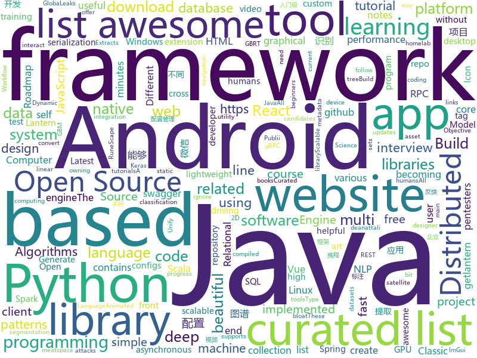

# 2018-07-09
See what the GitHub community is most excited about today.

## python
* [termtosvg](https://github.com/nbedos/termtosvg)(**147 stars today**): Record terminal sessions as SVG animations
* [robosat](https://github.com/mapbox/robosat)(**131 stars today**): Semantic segmentation on aerial and satellite imagery. Extracts features such as: buildings, parking lots, roads, water
* [Switchable-Normalization](https://github.com/switchablenorms/Switchable-Normalization)(**117 stars today**): 
* [PythonRobotics](https://github.com/AtsushiSakai/PythonRobotics)(**101 stars today**): Python sample codes for robotics algorithms.
* [DeepLearning.ai-Summary](https://github.com/mbadry1/DeepLearning.ai-Summary)(**65 stars today**): This repository contains my personal notes and summaries on DeepLearning.ai specialization courses. I've enjoyed every little bit of the course hope you enjoy my notes too.
* [GlobaLeaks](https://github.com/globaleaks/GlobaLeaks)(**63 stars today**): GlobaLeaks - The Open-Source Whistleblowing Software
* [youtube-dl](https://github.com/rg3/youtube-dl)(**53 stars today**): Command-line program to download videos from YouTube.com and other video sites
* [cartoonify](https://github.com/danmacnish/cartoonify)(**50 stars today**): python app to turn a photograph into a cartoon
* [faceai](https://github.com/vipstone/faceai)(**46 stars today**): 一款入门级的人脸、视频、文字检测以及识别的项目.
* [models](https://github.com/tensorflow/models)(**35 stars today**): Models and examples built with TensorFlow
* [tweets_analyzer](https://github.com/x0rz/tweets_analyzer)(**44 stars today**): Tweets metadata scraper & activity analyzer
* [modin](https://github.com/modin-project/modin)(**44 stars today**): Modin: Unify the way you interact with your data
* [vibora](https://github.com/vibora-io/vibora)(**39 stars today**): Fast, asynchronous and elegant Python web framework.
* [awesome-python](https://github.com/vinta/awesome-python)(**37 stars today**): A curated list of awesome Python frameworks, libraries, software and resources
* [scriptsAndExploits](https://github.com/quentinhardy/scriptsAndExploits)(**35 stars today**): Some scripts and exploits
* [keras](https://github.com/keras-team/keras)(**30 stars today**): Deep Learning for humans
* [Python](https://github.com/TheAlgorithms/Python)(**29 stars today**): All Algorithms implemented in Python
* [GAN_stability](https://github.com/LMescheder/GAN_stability)(**31 stars today**): Code for paper "Which Training Methods for GANs do actually Converge? (ICML 2018)"
* [erc20-ico-onchain-technical-analysis](https://github.com/DeuroIO/erc20-ico-onchain-technical-analysis)(**30 stars today**): An tool to analyze any company's ICO
* [awesome-machine-learning](https://github.com/josephmisiti/awesome-machine-learning)(**24 stars today**): A curated list of awesome Machine Learning frameworks, libraries and software.
* [pipenv](https://github.com/pypa/pipenv)(**27 stars today**): Python Development Workflow for Humans.
* [ray](https://github.com/ray-project/ray)(**26 stars today**): A high-performance distributed execution engine
* [cpython](https://github.com/python/cpython)(**21 stars today**): The Python programming language
* [system-design-primer](https://github.com/donnemartin/system-design-primer)(**24 stars today**): Learn how to design large-scale systems. Prep for the system design interview. Includes Anki flashcards.
* [Autopilot](https://github.com/akshaybahadur21/Autopilot)(**21 stars today**): A self driving car model for humans.

## java
* [Java-Interview](https://github.com/crossoverJie/Java-Interview)(**63 stars today**): 👨‍🎓Java related : basic, concurrent, algorithm
* [BurpSuiteHTTPSmuggler](https://github.com/nccgroup/BurpSuiteHTTPSmuggler)(**36 stars today**): A Burp Suite extension to help pentesters to bypass WAFs or test their effectiveness using a number of techniques
* [java-design-patterns](https://github.com/iluwatar/java-design-patterns)(**29 stars today**): Design patterns implemented in Java
* [Java](https://github.com/TheAlgorithms/Java)(**28 stars today**): All Algorithms implemented in Java
* [interviews](https://github.com/kdn251/interviews)(**27 stars today**): Everything you need to know to get the job.
* [spring-boot](https://github.com/spring-projects/spring-boot)(**23 stars today**): Spring Boot
* [spring-framework](https://github.com/spring-projects/spring-framework)(**22 stars today**): Spring Framework
* [LazyDatePicker](https://github.com/lopspower/LazyDatePicker)(**23 stars today**): This is an Android project to offer an alternative to the native Android Date Picker.
* [vjtools](https://github.com/vipshop/vjtools)(**18 stars today**): The vip.com's java coding standard, libraries and tools
* [retrofit](https://github.com/square/retrofit)(**17 stars today**): Type-safe HTTP client for Android and Java by Square, Inc.
* [apollo](https://github.com/ctripcorp/apollo)(**16 stars today**): Apollo（阿波罗）是携程框架部门研发的分布式配置中心，能够集中化管理应用不同环境、不同集群的配置，配置修改后能够实时推送到应用端，并且具备规范的权限、流程治理等特性，适用于微服务配置管理场景。
* [elasticsearch](https://github.com/elastic/elasticsearch)(**12 stars today**): Open Source, Distributed, RESTful Search Engine
* [react-native-navigation](https://github.com/wix/react-native-navigation)(**14 stars today**): A complete native navigation solution for React Native
* [weixin-java-tools](https://github.com/Wechat-Group/weixin-java-tools)(**13 stars today**): 可能是目前最好最全的微信Java开发工具包，支持包括微信支付、开放平台、小程序、企业号和公众号等的开发
* [deeplearning4j](https://github.com/deeplearning4j/deeplearning4j)(**11 stars today**): Deeplearning4j, ND4J, DataVec and more - deep learning & linear algebra for Java/Scala with GPUs + Spark - From Skymind
* [RxJava](https://github.com/ReactiveX/RxJava)(**11 stars today**): RxJava – Reactive Extensions for the JVM – a library for composing asynchronous and event-based programs using observable sequences for the Java VM.
* [tutorials](https://github.com/eugenp/tutorials)(**7 stars today**): The "REST With Spring" Course:
* [ballerina-lang](https://github.com/ballerina-platform/ballerina-lang)(**11 stars today**): Ballerina is a compiled, transactional, statically and strongly typed programming language with textual and graphical syntaxes.
* [Jailer](https://github.com/Wisser/Jailer)(**11 stars today**): Database Subsetting and Relational Data Browsing Tool. Navigate bidirectionally through the database by following foreign-key-based or user-defined relationships. Exports consistent, referentially intact row-sets from relational databases. Removes data w/o violating integrity. Generates topologically sorted SQL-DML, hierarchically structured XML…
* [lottie-android](https://github.com/airbnb/lottie-android)(**10 stars today**): Render After Effects animations natively on Android and iOS, Web, and React Native
* [HanLP](https://github.com/hankcs/HanLP)(**10 stars today**): 自然语言处理 中文分词 词性标注 命名实体识别 依存句法分析 关键词提取 新词发现 短语提取 自动摘要 文本分类 拼音简繁
* [mybatis-3](https://github.com/mybatis/mybatis-3)(**8 stars today**): MyBatis SQL mapper framework for Java
* [runelite](https://github.com/runelite/runelite)(**5 stars today**): Open source Old School RuneScape client
* [incubator-dubbo](https://github.com/apache/incubator-dubbo)(**7 stars today**): Apache Dubbo (incubating) is a high-performance, java based, open source RPC framework.
* [okhttp](https://github.com/square/okhttp)(**9 stars today**): An HTTP+HTTP/2 client for Android and Java applications.

## unknown
* [react-developer-roadmap](https://github.com/adam-golab/react-developer-roadmap)(**388 stars today**): Roadmap to becoming a React developer in 2018
* [Compatibility](https://github.com/android-in-china/Compatibility)(**95 stars today**): 用于反馈和跟踪国内 Android 设备/ROM 兼容性问题的公益项目
* [vue-patterns](https://github.com/learn-vuejs/vue-patterns)(**70 stars today**): Useful Vue patterns, techniques, tips and tricks and helpful curated links.
* [You-Dont-Know-JS](https://github.com/getify/You-Dont-Know-JS)(**45 stars today**): A book series on JavaScript. @YDKJS on twitter.
* [developer-roadmap](https://github.com/kamranahmedse/developer-roadmap)(**44 stars today**): Roadmap to becoming a web developer in 2018
* [build-your-own-x](https://github.com/danistefanovic/build-your-own-x)(**43 stars today**): 🤓Build your own (insert technology here)
* [awesome](https://github.com/sindresorhus/awesome)(**39 stars today**): 😎Curated list of awesome lists
* [Interview-Notebook](https://github.com/CyC2018/Interview-Notebook)(**35 stars today**): 📆准备秋招学习笔记
* [free-programming-books](https://github.com/EbookFoundation/free-programming-books)(**31 stars today**): 📚Freely available programming books
* [project-based-learning](https://github.com/tuvtran/project-based-learning)(**35 stars today**): Curated list of project-based tutorials
* [gitignore](https://github.com/github/gitignore)(**25 stars today**): A collection of useful .gitignore templates
* [NLP-progress](https://github.com/sebastianruder/NLP-progress)(**27 stars today**): Repository to track the progress in Natural Language Processing (NLP), including the datasets and the current state-of-the-art for the most common NLP tasks.
* [architect-awesome](https://github.com/xingshaocheng/architect-awesome)(**26 stars today**): 后端架构师技术图谱
* [awesome-vue](https://github.com/vuejs/awesome-vue)(**26 stars today**): 🎉A curated list of awesome things related to Vue.js
* [awesome-lite-websites](https://github.com/mdibaiee/awesome-lite-websites)(**28 stars today**): A list awesome lite websites without all the bloat
* [100_Days_of_ML_Code](https://github.com/llSourcell/100_Days_of_ML_Code)(**25 stars today**): These are the instructions for "100 Days of ML Code" By Siraj Raval on Youtube
* [physical-bitcoin-attacks](https://github.com/jlopp/physical-bitcoin-attacks)(**25 stars today**): A list of known attacks against Bitcoin / crypto asset owning entities that occurred in meatspace.
* [Java-Guide](https://github.com/Snailclimb/Java-Guide)(**20 stars today**): 📖Java面试通关手册（Java学习指南）Java Interview Customs Manual (Java Study Guide)
* [awesome-design-patterns](https://github.com/DovAmir/awesome-design-patterns)(**23 stars today**): A curated list of software and architecture related design patterns.
* [Front-end-Developer-Interview-Questions](https://github.com/h5bp/Front-end-Developer-Interview-Questions)(**20 stars today**): A list of helpful front-end related questions you can use to interview potential candidates, test yourself or completely ignore.
* [computer-science](https://github.com/ossu/computer-science)(**20 stars today**): 🎓Path to a free self-taught education in Computer Science!
* [awesome-flutter](https://github.com/Solido/awesome-flutter)(**18 stars today**): An awesome list that curates the best Flutter libraries, tools, tutorials, articles and more.
* [download](https://github.com/getlantern/download)(**16 stars today**): 🔴蓝灯最新版本下载 https://github.com/getlantern/download🔴Lantern Latest Download https://github.com/getlantern/lantern/releases/tag/latest🔴
* [Awesome-Hacking](https://github.com/Hack-with-Github/Awesome-Hacking)(**13 stars today**): A collection of various awesome lists for hackers, pentesters and security researchers
* [homelab](https://github.com/bradfitz/homelab)(**13 stars today**): Brad's homelab setup

## c++
* [tensorflow](https://github.com/tensorflow/tensorflow)(**66 stars today**): Computation using data flow graphs for scalable machine learning
* [bitcoin](https://github.com/bitcoin/bitcoin)(**30 stars today**): Bitcoin Core integration/staging tree
* [electron](https://github.com/electron/electron)(**26 stars today**): Build cross platform desktop apps with JavaScript, HTML, and CSS
* [opencv](https://github.com/opencv/opencv)(**19 stars today**): Open Source Computer Vision Library
* [openpose](https://github.com/CMU-Perceptual-Computing-Lab/openpose)(**19 stars today**): OpenPose: Real-time multi-person keypoint detection library for body, face, and hands estimation
* [protobuf](https://github.com/google/protobuf)(**19 stars today**): Protocol Buffers - Google's data interchange format
* [apollo](https://github.com/ApolloAuto/apollo)(**15 stars today**): An open autonomous driving platform
* [swift](https://github.com/apple/swift)(**16 stars today**): The Swift Programming Language
* [aseprite](https://github.com/aseprite/aseprite)(**18 stars today**): Animated sprite editor & pixel art tool (Windows, macOS, Linux)
* [Classic-Start](https://github.com/passionate-coder/Classic-Start)(**17 stars today**): Reborn of Classic Shell (Ivo Beltchev) - Classic Start (passionate-coder)
* [pytorch](https://github.com/pytorch/pytorch)(**15 stars today**): Tensors and Dynamic neural networks in Python with strong GPU acceleration
* [mace](https://github.com/XiaoMi/mace)(**14 stars today**): MACE is a deep learning inference framework optimized for mobile heterogeneous computing platforms.
* [imgui](https://github.com/ocornut/imgui)(**12 stars today**): Dear ImGui: Bloat-free Immediate Mode Graphical User interface for C++ with minimal dependencies
* [capnproto](https://github.com/capnproto/capnproto)(**15 stars today**): Cap'n Proto serialization/RPC system - core tools and C++ library
* [xgboost](https://github.com/dmlc/xgboost)(**12 stars today**): Scalable, Portable and Distributed Gradient Boosting (GBDT, GBRT or GBM) Library, for Python, R, Java, Scala, C++ and more. Runs on single machine, Hadoop, Spark, Flink and DataFlow
* [aria2](https://github.com/aria2/aria2)(**12 stars today**): aria2 is a lightweight multi-protocol & multi-source, cross platform download utility operated in command-line. It supports HTTP/HTTPS, FTP, SFTP, BitTorrent and Metalink.
* [tesseract](https://github.com/tesseract-ocr/tesseract)(**12 stars today**): Tesseract Open Source OCR Engine (main repository)
* [horovod](https://github.com/uber/horovod)(**10 stars today**): Distributed training framework for TensorFlow, Keras, and PyTorch.
* [Paddle](https://github.com/PaddlePaddle/Paddle)(**10 stars today**): PArallel Distributed Deep LEarning
* [godot](https://github.com/godotengine/godot)(**9 stars today**): Godot Engine – Multi-platform 2D and 3D game engine
* [grpc](https://github.com/grpc/grpc)(**10 stars today**): The C based gRPC (C++, Python, Ruby, Objective-C, PHP, C#)
* [v8](https://github.com/v8/v8)(**10 stars today**): The official mirror of the V8 Git repository
* [cmder](https://github.com/cmderdev/cmder)(**10 stars today**): Lovely console emulator package for Windows
* [anbox](https://github.com/anbox/anbox)(**10 stars today**): Anbox is a container-based approach to boot a full Android system on a regular GNU/Linux system
* [caffe](https://github.com/BVLC/caffe)(**8 stars today**): Caffe: a fast open framework for deep learning.

## html
* [react-from-zero](https://github.com/kay-is/react-from-zero)(**77 stars today**): A simple (99% ES2015 less) tutorial for React
* [hacker-job-trends](https://github.com/timqian/hacker-job-trends)(**59 stars today**): 
* [BuildYourOwnLisp](https://github.com/orangeduck/BuildYourOwnLisp)(**35 stars today**): Learn C and build your own programming language in under 1000 lines of code!
* [awesome-mac](https://github.com/jaywcjlove/awesome-mac)(**22 stars today**):  Now we have become very big, Different from the original idea. Collect premium software in various categories.
* [feathericon](https://github.com/feathericon/feathericon)(**20 stars today**): [ Icons ] Simple, scalable vector icon font for websites, apps.
* [solid](https://github.com/solid/solid)(**16 stars today**): Solid - Re-decentralizing the web (project directory)
* [Publii](https://github.com/GetPublii/Publii)(**13 stars today**): Publii is a desktop-based CMS for Windows and Mac that makes creating static websites fast and hassle-free, even for beginners.
* [intercooler-js](https://github.com/LeadDyno/intercooler-js)(**12 stars today**): Making AJAX as easy as anchor tags
* [homeassistant-config](https://github.com/arsaboo/homeassistant-config)(**11 stars today**): 🏡My Home Assistant Configs. Be sure to🌟my repo to follow the updates!
* [Spoon-Knife](https://github.com/octocat/Spoon-Knife)(****): This repo is for demonstration purposes only.
* [fastText](https://github.com/facebookresearch/fastText)(**8 stars today**): Library for fast text representation and classification.
* [ecma262](https://github.com/tc39/ecma262)(**9 stars today**): Status, process, and documents for ECMA262
* [Winds](https://github.com/GetStream/Winds)(**9 stars today**): A Beautiful Open Source RSS & Podcast App
* [skill-map](https://github.com/TeamStuQ/skill-map)(**6 stars today**): 程序员技能图谱
* [fakescroll](https://github.com/yairEO/fakescroll)(**8 stars today**): vanilla-js lightweight custom HTML scrollbar
* [zju-icicles](https://github.com/QSCTech/zju-icicles)(**7 stars today**): 浙江大学课程攻略共享计划
* [swagger-codegen](https://github.com/swagger-api/swagger-codegen)(**7 stars today**): swagger-codegen contains a template-driven engine to generate documentation, API clients and server stubs in different languages by parsing your OpenAPI / Swagger definition.
* [electron-api-demos](https://github.com/electron/electron-api-demos)(**6 stars today**): Explore the Electron APIs
* [javascript-tutorial-en](https://github.com/iliakan/javascript-tutorial-en)(**5 stars today**): Modern JavaScript Tutorial
* [awesome-resume](https://github.com/resumejob/awesome-resume)(**5 stars today**): 包含简历常用例句
* [hugo-academic](https://github.com/gcushen/hugo-academic)(**5 stars today**): The website designer for Hugo. Build and deploy a beautiful website in minutes🚀
* [foundation-sites](https://github.com/zurb/foundation-sites)(**5 stars today**): The most advanced responsive front-end framework in the world. Quickly create prototypes and production code for sites that work on any kind of device.
* [gson](https://github.com/google/gson)(**5 stars today**): A Java serialization/deserialization library to convert Java Objects into JSON and back
* [beautiful-jekyll](https://github.com/daattali/beautiful-jekyll)(****): ✨Build a beautiful and simple website in literally minutes. Demo at http://deanattali.com/beautiful-jekyll
* [react-app-rewired](https://github.com/timarney/react-app-rewired)(**5 stars today**): Override create-react-app webpack configs without ejecting

## WordCloud

