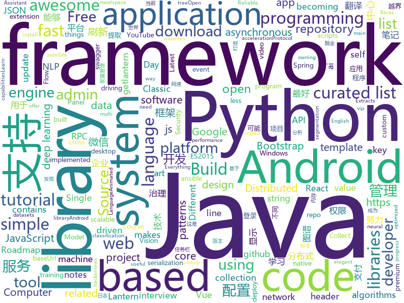

# 2018-07-10
See what the GitHub community is most excited about today.

## python
* [PythonRobotics](https://github.com/AtsushiSakai/PythonRobotics)(**737 stars today**): Python sample codes for robotics algorithms.
* [erc20-ico-onchain-technical-analysis](https://github.com/DeuroIO/erc20-ico-onchain-technical-analysis)(**228 stars today**): An tool to analyze any company's ICO
* [termtosvg](https://github.com/nbedos/termtosvg)(**212 stars today**): Record terminal sessions as SVG animations
* [robosat](https://github.com/mapbox/robosat)(**154 stars today**): Semantic segmentation on aerial and satellite imagery. Extracts features such as: buildings, parking lots, roads, water
* [word-mesh](https://github.com/mukund109/word-mesh)(**124 stars today**): A context-preserving word cloud generator
* [vibora](https://github.com/vibora-io/vibora)(**118 stars today**): Fast, asynchronous and elegant Python web framework.
* [models](https://github.com/tensorflow/models)(**76 stars today**): Models and examples built with TensorFlow
* [cartoonify](https://github.com/danmacnish/cartoonify)(**95 stars today**): python app to turn a photograph into a cartoon
* [youtube-dl](https://github.com/rg3/youtube-dl)(**85 stars today**): Command-line program to download videos from YouTube.com and other video sites
* [wttr.in](https://github.com/chubin/wttr.in)(**74 stars today**): ⛅️The right way to check the weather
* [glow](https://github.com/openai/glow)(**65 stars today**): Code for reproducing results in "Glow: Generative Flow with Invertible 1x1 Convolutions"
* [DeepLearning.ai-Summary](https://github.com/mbadry1/DeepLearning.ai-Summary)(**64 stars today**): This repository contains my personal notes and summaries on DeepLearning.ai specialization courses. I've enjoyed every little bit of the course hope you enjoy my notes too.
* [awesome-python](https://github.com/vinta/awesome-python)(**57 stars today**): A curated list of awesome Python frameworks, libraries, software and resources
* [Autopilot](https://github.com/akshaybahadur21/Autopilot)(**54 stars today**): A self driving car model for humans.
* [GAN_stability](https://github.com/LMescheder/GAN_stability)(**55 stars today**): Code for paper "Which Training Methods for GANs do actually Converge? (ICML 2018)"
* [keras](https://github.com/keras-team/keras)(**47 stars today**): Deep Learning for humans
* [Fuxi-Scanner](https://github.com/jeffzh3ng/Fuxi-Scanner)(**45 stars today**): Network Security Vulnerability Scanner
* [Python-100-Days](https://github.com/jackfrued/Python-100-Days)(**47 stars today**): Python - 100天从新手到大师
* [public-apis](https://github.com/toddmotto/public-apis)(**43 stars today**): A collective list of public JSON APIs for use in web development.
* [teen](https://github.com/shobrook/teen)(**47 stars today**): Like man pages, but for HTTP status codes
* [ansible](https://github.com/ansible/ansible)(**37 stars today**): Ansible is a radically simple IT automation platform that makes your applications and systems easier to deploy. Avoid writing scripts or custom code to deploy and update your applications — automate in a language that approaches plain English, using SSH, with no agents to install on remote systems. https://docs.ansible.com/ansible/
* [ImageAI](https://github.com/OlafenwaMoses/ImageAI)(**39 stars today**): A python library built to empower developers to build applications and systems with self-contained Computer Vision capabilities
* [system-design-primer](https://github.com/donnemartin/system-design-primer)(**36 stars today**): Learn how to design large-scale systems. Prep for the system design interview. Includes Anki flashcards.
* [scriptsAndExploits](https://github.com/quentinhardy/scriptsAndExploits)(**35 stars today**): Some scripts and exploits
* [cpython](https://github.com/python/cpython)(**31 stars today**): The Python programming language

## java
* [Java-Interview](https://github.com/crossoverJie/Java-Interview)(**134 stars today**): 👨‍🎓Java related : basic, concurrent, algorithm
* [okdownload](https://github.com/lingochamp/okdownload)(**70 stars today**): A Reliable, Flexible, Fast and Powerful download engine.
* [LazyDatePicker](https://github.com/lopspower/LazyDatePicker)(**56 stars today**): This is an Android project to offer an alternative to the native Android Date Picker.
* [RetrofitUrlManager](https://github.com/JessYanCoding/RetrofitUrlManager)(**51 stars today**): Let Retrofit support multiple baseUrl and can be change the baseUrl at runtime
* [spring-boot](https://github.com/spring-projects/spring-boot)(**39 stars today**): Spring Boot
* [elasticsearch](https://github.com/elastic/elasticsearch)(**45 stars today**): Open Source, Distributed, RESTful Search Engine
* [weixin-java-tools](https://github.com/Wechat-Group/weixin-java-tools)(**44 stars today**): 可能是目前最好最全的微信Java开发工具包，支持包括微信支付、开放平台、小程序、企业号和公众号等的开发
* [interviews](https://github.com/kdn251/interviews)(**45 stars today**): Everything you need to know to get the job.
* [vjtools](https://github.com/vipshop/vjtools)(**41 stars today**): The vip.com's java coding standard, libraries and tools
* [BurpSuiteHTTPSmuggler](https://github.com/nccgroup/BurpSuiteHTTPSmuggler)(**44 stars today**): A Burp Suite extension to help pentesters to bypass WAFs or test their effectiveness using a number of techniques
* [java-design-patterns](https://github.com/iluwatar/java-design-patterns)(**39 stars today**): Design patterns implemented in Java
* [incubator-dubbo](https://github.com/apache/incubator-dubbo)(**33 stars today**): Apache Dubbo (incubating) is a high-performance, java based, open source RPC framework.
* [jib](https://github.com/GoogleContainerTools/jib)(**41 stars today**): ⛵️Build container images for your Java applications.
* [HanLP](https://github.com/hankcs/HanLP)(**39 stars today**): 自然语言处理 中文分词 词性标注 命名实体识别 依存句法分析 关键词提取 新词发现 短语提取 自动摘要 文本分类 拼音简繁
* [spring-framework](https://github.com/spring-projects/spring-framework)(**30 stars today**): Spring Framework
* [apollo](https://github.com/ctripcorp/apollo)(**30 stars today**): Apollo（阿波罗）是携程框架部门研发的分布式配置中心，能够集中化管理应用不同环境、不同集群的配置，配置修改后能够实时推送到应用端，并且具备规范的权限、流程治理等特性，适用于微服务配置管理场景。
* [guava](https://github.com/google/guava)(**32 stars today**): Google core libraries for Java
* [ure](https://github.com/gilmore606/ure)(**33 stars today**): the UnRogueEngine
* [SmartRefreshLayout](https://github.com/scwang90/SmartRefreshLayout)(**29 stars today**): 🔥下拉刷新、上拉加载、二级刷新、淘宝二楼、RefreshLayout、OverScroll，Android智能下拉刷新框架，支持越界回弹、越界拖动，具有极强的扩展性，集成了几十种炫酷的Header和 Footer。
* [Java](https://github.com/TheAlgorithms/Java)(**29 stars today**): All Algorithms implemented in Java
* [netty](https://github.com/netty/netty)(**24 stars today**): Netty project - an event-driven asynchronous network application framework
* [AndroidUtilCode](https://github.com/Blankj/AndroidUtilCode)(**23 stars today**): 🔥Android developers should collect the following utils(updating).
* [vector-analog-clock](https://github.com/TurkiTAK/vector-analog-clock)(**27 stars today**): A Simple Customizable VectorAnalogClock Android View
* [RxJava](https://github.com/ReactiveX/RxJava)(**25 stars today**): RxJava – Reactive Extensions for the JVM – a library for composing asynchronous and event-based programs using observable sequences for the Java VM.
* [zheng](https://github.com/shuzheng/zheng)(**19 stars today**): 基于Spring+SpringMVC+Mybatis分布式敏捷开发系统架构，提供整套公共微服务服务模块：集中权限管理（单点登录）、内容管理、支付中心、用户管理（支持第三方登录）、微信平台、存储系统、配置中心、日志分析、任务和通知等，支持服务治理、监控和追踪，努力为中小型企业打造全方位J2EE企业级开发解决方案。

## unknown
* [react-developer-roadmap](https://github.com/adam-golab/react-developer-roadmap)(**1,366 stars today**): Roadmap to becoming a React developer in 2018
* [Compatibility](https://github.com/android-in-china/Compatibility)(**194 stars today**): 用于反馈和跟踪国内 Android 设备/ROM 兼容性问题的公益项目
* [Interview-Notebook](https://github.com/CyC2018/Interview-Notebook)(**158 stars today**): 📆准备秋招学习笔记
* [NLP-progress](https://github.com/sebastianruder/NLP-progress)(**91 stars today**): Repository to track the progress in Natural Language Processing (NLP), including the datasets and the current state-of-the-art for the most common NLP tasks.
* [developer-roadmap](https://github.com/kamranahmedse/developer-roadmap)(**82 stars today**): Roadmap to becoming a web developer in 2018
* [vue-patterns](https://github.com/learn-vuejs/vue-patterns)(**87 stars today**): Useful Vue patterns, techniques, tips and tricks and helpful curated links.
* [You-Dont-Know-JS](https://github.com/getify/You-Dont-Know-JS)(**70 stars today**): A book series on JavaScript. @YDKJS on twitter.
* [gitignore](https://github.com/github/gitignore)(**47 stars today**): A collection of useful .gitignore templates
* [build-your-own-x](https://github.com/danistefanovic/build-your-own-x)(**62 stars today**): 🤓Build your own (insert technology here)
* [awesome-design-patterns](https://github.com/DovAmir/awesome-design-patterns)(**63 stars today**): A curated list of software and architecture related design patterns.
* [awesome](https://github.com/sindresorhus/awesome)(**52 stars today**): 😎Curated list of awesome lists
* [architect-awesome](https://github.com/xingshaocheng/architect-awesome)(**51 stars today**): 后端架构师技术图谱
* [project-based-learning](https://github.com/tuvtran/project-based-learning)(**48 stars today**): Curated list of project-based tutorials
* [awesome-vue](https://github.com/vuejs/awesome-vue)(**44 stars today**): 🎉A curated list of awesome things related to Vue.js
* [ddia](https://github.com/Vonng/ddia)(**35 stars today**): 《Designing Data-Intensive Application》DDIA中文翻译
* [free-programming-books](https://github.com/EbookFoundation/free-programming-books)(**33 stars today**): 📚Freely available programming books
* [homelab](https://github.com/bradfitz/homelab)(**34 stars today**): Brad's homelab setup
* [awesome-flutter](https://github.com/Solido/awesome-flutter)(**30 stars today**): An awesome list that curates the best Flutter libraries, tools, tutorials, articles and more.
* [Java-Guide](https://github.com/Snailclimb/Java-Guide)(**24 stars today**): 📖Java面试通关手册（Java学习指南）Java Interview Customs Manual (Java Study Guide)
* [100_Days_of_ML_Code](https://github.com/llSourcell/100_Days_of_ML_Code)(**25 stars today**): These are the instructions for "100 Days of ML Code" By Siraj Raval on Youtube
* [download](https://github.com/getlantern/download)(**24 stars today**): 🔴蓝灯最新版本下载 https://github.com/getlantern/download🔴Lantern Latest Download https://github.com/getlantern/lantern/releases/tag/latest🔴
* [gold-miner](https://github.com/xitu/gold-miner)(**23 stars today**): 🥇掘金翻译计划，可能是世界最大最好的英译中技术社区，最懂读者和译者的翻译平台：
* [awesome-react](https://github.com/enaqx/awesome-react)(**21 stars today**): A collection of awesome things regarding React ecosystem.
* [physical-bitcoin-attacks](https://github.com/jlopp/physical-bitcoin-attacks)(**22 stars today**): A list of known attacks against Bitcoin / crypto asset owning entities that occurred in meatspace.
* [awesome-nodejs](https://github.com/sindresorhus/awesome-nodejs)(**21 stars today**): ⚡️Delightful Node.js packages and resources

## c++
* [tensorflow](https://github.com/tensorflow/tensorflow)(**118 stars today**): Computation using data flow graphs for scalable machine learning
* [electron](https://github.com/electron/electron)(**47 stars today**): Build cross platform desktop apps with JavaScript, HTML, and CSS
* [bitcoin](https://github.com/bitcoin/bitcoin)(**35 stars today**): Bitcoin Core integration/staging tree
* [opencv](https://github.com/opencv/opencv)(**35 stars today**): Open Source Computer Vision Library
* [pytorch](https://github.com/pytorch/pytorch)(**34 stars today**): Tensors and Dynamic neural networks in Python with strong GPU acceleration
* [protobuf](https://github.com/google/protobuf)(**31 stars today**): Protocol Buffers - Google's data interchange format
* [apollo](https://github.com/ApolloAuto/apollo)(**30 stars today**): An open autonomous driving platform
* [openpose](https://github.com/CMU-Perceptual-Computing-Lab/openpose)(**30 stars today**): OpenPose: Real-time multi-person keypoint detection library for body, face, and hands estimation
* [mace](https://github.com/XiaoMi/mace)(**29 stars today**): MACE is a deep learning inference framework optimized for mobile heterogeneous computing platforms.
* [tesseract](https://github.com/tesseract-ocr/tesseract)(**27 stars today**): Tesseract Open Source OCR Engine (main repository)
* [horovod](https://github.com/uber/horovod)(**24 stars today**): Distributed training framework for TensorFlow, Keras, and PyTorch.
* [caffe](https://github.com/BVLC/caffe)(**18 stars today**): Caffe: a fast open framework for deep learning.
* [TrafficMonitor](https://github.com/zhongyang219/TrafficMonitor)(**22 stars today**): 这是一个用于显示当前网速、CPU及内存利用率的桌面悬浮窗软件，并支持任务栏显示，支持更换皮肤。
* [grpc](https://github.com/grpc/grpc)(**20 stars today**): The C based gRPC (C++, Python, Ruby, Objective-C, PHP, C#)
* [swift](https://github.com/apple/swift)(**18 stars today**): The Swift Programming Language
* [aseprite](https://github.com/aseprite/aseprite)(**19 stars today**): Animated sprite editor & pixel art tool (Windows, macOS, Linux)
* [leveldb](https://github.com/google/leveldb)(**19 stars today**): LevelDB is a fast key-value storage library written at Google that provides an ordered mapping from string keys to string values.
* [xgboost](https://github.com/dmlc/xgboost)(**17 stars today**): Scalable, Portable and Distributed Gradient Boosting (GBDT, GBRT or GBM) Library, for Python, R, Java, Scala, C++ and more. Runs on single machine, Hadoop, Spark, Flink and DataFlow
* [devilution](https://github.com/diasurgical/devilution)(**18 stars today**): Diablo devolved - magic behind the 1996 computer game
* [Classic-Start](https://github.com/passionate-coder/Classic-Start)(**18 stars today**): Reborn of Classic Shell (Ivo Beltchev) - Classic Start (passionate-coder)
* [Algorithmic_Template](https://github.com/LzyRapx/Algorithmic_Template)(**14 stars today**): 🍭LzyRapx 's code Library for competitive-programming.
* [PAT](https://github.com/liuchuo/PAT)(**17 stars today**): 🍭浙江大学PAT题解(C/C++/Java) - 努力成为萌萌的程序媛～
* [capnproto](https://github.com/capnproto/capnproto)(**16 stars today**): Cap'n Proto serialization/RPC system - core tools and C++ library
* [frameDemoMo2](https://github.com/tome34/frameDemoMo2)(**15 stars today**): Android组件化项目框架
* [px](https://github.com/pplux/px)(**15 stars today**): Single header C++ Libraries for Thread Scheduling, Rendering, and so on...

## html
* [react-from-zero](https://github.com/kay-is/react-from-zero)(**146 stars today**): A simple (99% ES2015 less) tutorial for React
* [Switchable-Normalization](https://github.com/switchablenorms/Switchable-Normalization)(**114 stars today**): 
* [hacker-job-trends](https://github.com/timqian/hacker-job-trends)(**71 stars today**): Play with hackernews' "who is hiring"
* [intercooler-js](https://github.com/LeadDyno/intercooler-js)(**44 stars today**): Making AJAX as easy as anchor tags
* [Publii](https://github.com/GetPublii/Publii)(**34 stars today**): Publii is a desktop-based CMS for Windows and Mac that makes creating static websites fast and hassle-free, even for beginners.
* [AdminLTE](https://github.com/almasaeed2010/AdminLTE)(**22 stars today**): AdminLTE - Free Premium Admin control Panel Theme Based On Bootstrap 3.x
* [BuildYourOwnLisp](https://github.com/orangeduck/BuildYourOwnLisp)(**24 stars today**): Learn C and build your own programming language in under 1000 lines of code!
* [coreui-free-bootstrap-admin-template](https://github.com/coreui/coreui-free-bootstrap-admin-template)(**20 stars today**): CoreUI is free bootstrap admin template
* [awesome-mac](https://github.com/jaywcjlove/awesome-mac)(**19 stars today**):  Now we have become very big, Different from the original idea. Collect premium software in various categories.
* [portainer](https://github.com/portainer/portainer)(**18 stars today**): Simple management UI for Docker
* [Spoon-Knife](https://github.com/octocat/Spoon-Knife)(****): This repo is for demonstration purposes only.
* [iot-security-wiki](https://github.com/yaseng/iot-security-wiki)(**16 stars today**): IOT security wiki
* [JavaScript30](https://github.com/wesbos/JavaScript30)(**9 stars today**): 30 Day Vanilla JS Challenge
* [fastText](https://github.com/facebookresearch/fastText)(**11 stars today**): Library for fast text representation and classification.
* [capacitor](https://github.com/ionic-team/capacitor)(**13 stars today**): Build cross-platform Native Progressive Web Apps for iOS, Android, and the web⚡️
* [react-from-zero](https://github.com/andre-motta/react-from-zero)(**13 stars today**): A simple (99% ES2015 less) tutorial for React
* [deeplearning_ai_books](https://github.com/fengdu78/deeplearning_ai_books)(**12 stars today**): deeplearning.ai（吴恩达老师的深度学习课程笔记及资源）
* [gson](https://github.com/google/gson)(**11 stars today**): A Java serialization/deserialization library to convert Java Objects into JSON and back
* [EIPs](https://github.com/ethereum/EIPs)(**11 stars today**): The Ethereum Improvement Proposal repository
* [skill-map](https://github.com/TeamStuQ/skill-map)(**10 stars today**): 程序员技能图谱
* [gentelella](https://github.com/puikinsh/gentelella)(**10 stars today**): Free Bootstrap 3 Admin Template
* [javascript-tutorial-en](https://github.com/iliakan/javascript-tutorial-en)(**7 stars today**): Modern JavaScript Tutorial
* [homeassistant-config](https://github.com/arsaboo/homeassistant-config)(**9 stars today**): 🏡My Home Assistant Configs. Be sure to🌟my repo to follow the updates!
* [swagger-codegen](https://github.com/swagger-api/swagger-codegen)(**8 stars today**): swagger-codegen contains a template-driven engine to generate documentation, API clients and server stubs in different languages by parsing your OpenAPI / Swagger definition.
* [ng-alain](https://github.com/cipchk/ng-alain)(**8 stars today**): ng-zorro-antd admin panel front-end framework

## WordCloud

