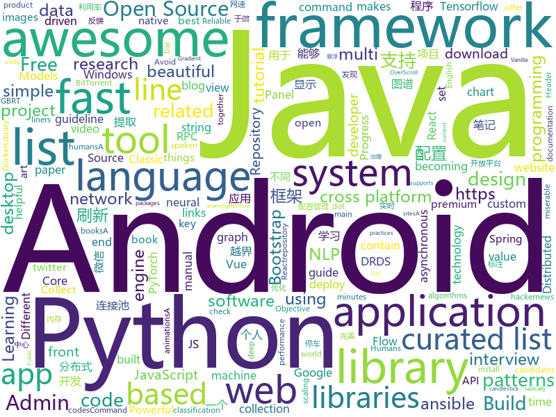

# 2018-07-11
See what the GitHub community is most excited about today.

## python
* [glow](https://github.com/openai/glow)(**672 stars today**): Code for reproducing results in "Glow: Generative Flow with Invertible 1x1 Convolutions"
* [PythonRobotics](https://github.com/AtsushiSakai/PythonRobotics)(**340 stars today**): Python sample codes for robotics algorithms.
* [cheat.sh](https://github.com/chubin/cheat.sh)(**158 stars today**): the only cheat sheet you need
* [termtosvg](https://github.com/nbedos/termtosvg)(**156 stars today**): Record terminal sessions as SVG animations
* [word-mesh](https://github.com/mukund109/word-mesh)(**131 stars today**): A context-preserving word cloud generator
* [system-design-primer](https://github.com/donnemartin/system-design-primer)(**89 stars today**): Learn how to design large-scale systems. Prep for the system design interview. Includes Anki flashcards.
* [models](https://github.com/tensorflow/models)(**65 stars today**): Models and examples built with TensorFlow
* [statcode](https://github.com/shobrook/statcode)(**84 stars today**): Like man pages, but for HTTP status codes
* [youtube-dl](https://github.com/rg3/youtube-dl)(**55 stars today**): Command-line program to download videos from YouTube.com and other video sites
* [keras](https://github.com/keras-team/keras)(**47 stars today**): Deep Learning for humans
* [awesome-python](https://github.com/vinta/awesome-python)(**50 stars today**): A curated list of awesome Python frameworks, libraries, software and resources
* [vibora](https://github.com/vibora-io/vibora)(**52 stars today**): Fast, asynchronous and elegant Python web framework.
* [Seq2seqChatbots](https://github.com/ricsinaruto/Seq2seqChatbots)(**48 stars today**): Seq2seq chatbot models, check paper link
* [nlp-tensorflow](https://github.com/Bricoler/nlp-tensorflow)(**44 stars today**): NLP Tensorflow Tutorials
* [help-why-cant-i-hold-all-these-mutuals](https://github.com/ejmg/help-why-cant-i-hold-all-these-mutuals)(**50 stars today**): find all your mutuals and throw them on a list so you can all be miserable together on twitter dot com
* [face_recognition](https://github.com/ageitgey/face_recognition)(**45 stars today**): The world's simplest facial recognition api for Python and the command line
* [distroless](https://github.com/GoogleContainerTools/distroless)(**47 stars today**): 🥑Language focused docker images, minus the operating system.
* [ansible](https://github.com/ansible/ansible)(**38 stars today**): Ansible is a radically simple IT automation platform that makes your applications and systems easier to deploy. Avoid writing scripts or custom code to deploy and update your applications — automate in a language that approaches plain English, using SSH, with no agents to install on remote systems. https://docs.ansible.com/ansible/
* [allennlp](https://github.com/allenai/allennlp)(**44 stars today**): An open-source NLP research library, built on PyTorch.
* [pipenv](https://github.com/pypa/pipenv)(**40 stars today**): Python Development Workflow for Humans.
* [lemur](https://github.com/Netflix/lemur)(**45 stars today**): Repository for the Lemur Certificate Manager
* [flask](https://github.com/pallets/flask)(**40 stars today**): The Python micro framework for building web applications.
* [cartoonify](https://github.com/danmacnish/cartoonify)(**39 stars today**): python app to turn a photograph into a cartoon
* [spoken_language_identification](https://github.com/tomasz-oponowicz/spoken_language_identification)(**36 stars today**): Identify a spoken language using artificial intelligence (LID).
* [Python-100-Days](https://github.com/jackfrued/Python-100-Days)(**31 stars today**): Python - 100天从新手到大师

## java
* [jib](https://github.com/GoogleContainerTools/jib)(**855 stars today**): ⛵️Build container images for your Java applications.
* [hmily](https://github.com/yu199195/hmily)(**122 stars today**): TCC分布式事务框架(try,confirm,cancel)
* [Java-Interview](https://github.com/crossoverJie/Java-Interview)(**107 stars today**): 👨‍🎓Java related : basic, concurrent, algorithm
* [spring-boot](https://github.com/spring-projects/spring-boot)(**46 stars today**): Spring Boot
* [elasticsearch](https://github.com/elastic/elasticsearch)(**40 stars today**): Open Source, Distributed, RESTful Search Engine
* [okdownload](https://github.com/lingochamp/okdownload)(**48 stars today**): A Reliable, Flexible, Fast and Powerful download engine.
* [HanLP](https://github.com/hankcs/HanLP)(**42 stars today**): 自然语言处理 中文分词 词性标注 命名实体识别 依存句法分析 关键词提取 新词发现 短语提取 自动摘要 文本分类 拼音简繁
* [apollo](https://github.com/ctripcorp/apollo)(**39 stars today**): Apollo（阿波罗）是携程框架部门研发的分布式配置中心，能够集中化管理应用不同环境、不同集群的配置，配置修改后能够实时推送到应用端，并且具备规范的权限、流程治理等特性，适用于微服务配置管理场景。
* [weixin-java-tools](https://github.com/Wechat-Group/weixin-java-tools)(**32 stars today**): 可能是目前最好最全的微信Java开发工具包，支持包括微信支付、开放平台、小程序、企业号和公众号等的开发
* [java-design-patterns](https://github.com/iluwatar/java-design-patterns)(**33 stars today**): Design patterns implemented in Java
* [interviews](https://github.com/kdn251/interviews)(**34 stars today**): Everything you need to know to get the job.
* [tutorials](https://github.com/eugenp/tutorials)(**20 stars today**): The "REST With Spring" Course:
* [incubator-dubbo](https://github.com/apache/incubator-dubbo)(**27 stars today**): Apache Dubbo (incubating) is a high-performance, java based, open source RPC framework.
* [pandora](https://github.com/whataa/pandora)(**34 stars today**): an android library for debugging what we care about directly in app.
* [LazyDatePicker](https://github.com/lopspower/LazyDatePicker)(**34 stars today**): This is an Android project to offer an alternative to the native Android Date Picker.
* [spring-framework](https://github.com/spring-projects/spring-framework)(**23 stars today**): Spring Framework
* [guava](https://github.com/google/guava)(**30 stars today**): Google core libraries for Java
* [vehicle-keyboard-android](https://github.com/parkingwang/vehicle-keyboard-android)(**29 stars today**): 停车王车牌键盘-Android
* [SmartRefreshLayout](https://github.com/scwang90/SmartRefreshLayout)(**26 stars today**): 🔥下拉刷新、上拉加载、二级刷新、淘宝二楼、RefreshLayout、OverScroll，Android智能下拉刷新框架，支持越界回弹、越界拖动，具有极强的扩展性，集成了几十种炫酷的Header和 Footer。
* [vjtools](https://github.com/vipshop/vjtools)(**28 stars today**): The vip.com's java coding standard, libraries and tools
* [netty](https://github.com/netty/netty)(**25 stars today**): Netty project - an event-driven asynchronous network application framework
* [AndroidUtilCode](https://github.com/Blankj/AndroidUtilCode)(**24 stars today**): 🔥Android developers should collect the following utils(updating).
* [TimetableView](https://github.com/zfman/TimetableView)(**27 stars today**): 一个开源的、完善的、简洁的课程表控件
* [MPAndroidChart](https://github.com/PhilJay/MPAndroidChart)(**25 stars today**): A powerful🚀Android chart view / graph view library, supporting line- bar- pie- radar- bubble- and candlestick charts as well as scaling, dragging and animations.
* [druid](https://github.com/alibaba/druid)(**23 stars today**): ♨️为监控而生的数据库连接池！阿里云DRDS(https://www.aliyun.com/product/drds )、阿里巴巴TDDL 连接池powered by Druid

## unknown
* [react-developer-roadmap](https://github.com/adam-golab/react-developer-roadmap)(**1,003 stars today**): Roadmap to becoming a React developer in 2018
* [Interview-Notebook](https://github.com/CyC2018/Interview-Notebook)(**480 stars today**): 📆准备秋招学习笔记
* [React-Redux-Styleguide](https://github.com/iraycd/React-Redux-Styleguide)(**118 stars today**): This is a working set of guidelines for developing React applications. We say "guideline" because there are no hard-and-fast rules; best practices, patterns and technology change over time, so we consider this a living set of style guides.
* [blog_backups](https://github.com/crazyandcoder/blog_backups)(**105 stars today**): Android 项目优化、面试题集，包含Android、Java、数据结构、算法、个人blog备份等。
* [developer-roadmap](https://github.com/kamranahmedse/developer-roadmap)(**101 stars today**): Roadmap to becoming a web developer in 2018
* [awesome-ninja-admins](https://github.com/trimstray/awesome-ninja-admins)(**91 stars today**): 💫A collection of awesome lists, manuals, blogs, hacks, one-liners and tools for Awesome Ninja Admins.
* [build-your-own-x](https://github.com/danistefanovic/build-your-own-x)(**84 stars today**): 🤓Build your own (insert technology here)
* [You-Dont-Know-JS](https://github.com/getify/You-Dont-Know-JS)(**77 stars today**): A book series on JavaScript. @YDKJS on twitter.
* [Compatibility](https://github.com/android-in-china/Compatibility)(**82 stars today**): 用于反馈和跟踪国内 Android 设备/ROM 兼容性问题的公益项目
* [NLP-progress](https://github.com/sebastianruder/NLP-progress)(**81 stars today**): Repository to track the progress in Natural Language Processing (NLP), including the datasets and the current state-of-the-art for the most common NLP tasks.
* [awesome](https://github.com/sindresorhus/awesome)(**73 stars today**): 😎Curated list of awesome lists
* [project-based-learning](https://github.com/tuvtran/project-based-learning)(**61 stars today**): Curated list of project-based tutorials
* [architect-awesome](https://github.com/xingshaocheng/architect-awesome)(**58 stars today**): 后端架构师技术图谱
* [gitignore](https://github.com/github/gitignore)(**47 stars today**): A collection of useful .gitignore templates
* [vue-patterns](https://github.com/learn-vuejs/vue-patterns)(**64 stars today**): Useful Vue patterns, techniques, tips and tricks and helpful curated links.
* [awesome-vue](https://github.com/vuejs/awesome-vue)(**53 stars today**): 🎉A curated list of awesome things related to Vue.js
* [awesome-pesquisa](https://github.com/anabastos/awesome-pesquisa)(**55 stars today**): Curated list of research content in portuguese🚧In Progress🚧
* [free-programming-books](https://github.com/EbookFoundation/free-programming-books)(**43 stars today**): 📚Freely available programming books
* [awesome-design-patterns](https://github.com/DovAmir/awesome-design-patterns)(**47 stars today**): A curated list of software and architecture related design patterns.
* [awesome-flutter](https://github.com/Solido/awesome-flutter)(**38 stars today**): An awesome list that curates the best Flutter libraries, tools, tutorials, articles and more.
* [Java-Guide](https://github.com/Snailclimb/Java-Guide)(**32 stars today**): 📖Java面试通关手册（Java学习指南）Java Interview Customs Manual (Java Study Guide)
* [awesome-cpp](https://github.com/fffaraz/awesome-cpp)(**28 stars today**): A curated list of awesome C++ (or C) frameworks, libraries, resources, and shiny things. Inspired by awesome-... stuff.
* [awesome-visualization-research](https://github.com/mathisonian/awesome-visualization-research)(**29 stars today**): A list of recommended research papers and other readings on data visualization
* [awesome-nodejs](https://github.com/sindresorhus/awesome-nodejs)(**29 stars today**): ⚡️Delightful Node.js packages and resources
* [Front-end-Developer-Interview-Questions](https://github.com/h5bp/Front-end-Developer-Interview-Questions)(**25 stars today**): A list of helpful front-end related questions you can use to interview potential candidates, test yourself or completely ignore.

## c++
* [tensorflow](https://github.com/tensorflow/tensorflow)(**108 stars today**): Computation using data flow graphs for scalable machine learning
* [aspia](https://github.com/dchapyshev/aspia)(**80 stars today**): Remote desktop and file transfer tool.
* [envoy](https://github.com/envoyproxy/envoy)(**66 stars today**): C++ front/service proxy
* [electron](https://github.com/electron/electron)(**62 stars today**): Build cross platform desktop apps with JavaScript, HTML, and CSS
* [horovod](https://github.com/uber/horovod)(**52 stars today**): Distributed training framework for TensorFlow, Keras, and PyTorch.
* [opencv](https://github.com/opencv/opencv)(**38 stars today**): Open Source Computer Vision Library
* [apollo](https://github.com/ApolloAuto/apollo)(**34 stars today**): An open autonomous driving platform
* [pytorch](https://github.com/pytorch/pytorch)(**28 stars today**): Tensors and Dynamic neural networks in Python with strong GPU acceleration
* [protobuf](https://github.com/google/protobuf)(**28 stars today**): Protocol Buffers - Google's data interchange format
* [smf](https://github.com/senior7515/smf)(**34 stars today**): Fastest RPC in the west
* [bitcoin](https://github.com/bitcoin/bitcoin)(**27 stars today**): Bitcoin Core integration/staging tree
* [xgboost](https://github.com/dmlc/xgboost)(**23 stars today**): Scalable, Portable and Distributed Gradient Boosting (GBDT, GBRT or GBM) Library, for Python, R, Java, Scala, C++ and more. Runs on single machine, Hadoop, Spark, Flink and DataFlow
* [caffe](https://github.com/BVLC/caffe)(**19 stars today**): Caffe: a fast open framework for deep learning.
* [openpose](https://github.com/CMU-Perceptual-Computing-Lab/openpose)(**21 stars today**): OpenPose: Real-time multi-person keypoint detection library for body, face, and hands estimation
* [grpc](https://github.com/grpc/grpc)(**19 stars today**): The C based gRPC (C++, Python, Ruby, Objective-C, PHP, C#)
* [PAT](https://github.com/liuchuo/PAT)(**18 stars today**): 🍭浙江大学PAT题解(C/C++/Java) - 努力成为萌萌的程序媛～
* [uWebSockets](https://github.com/uNetworking/uWebSockets)(**19 stars today**): Tiny WebSockets
* [aseprite](https://github.com/aseprite/aseprite)(**17 stars today**): Animated sprite editor & pixel art tool (Windows, macOS, Linux)
* [TrafficMonitor](https://github.com/zhongyang219/TrafficMonitor)(**18 stars today**): 这是一个用于显示当前网速、CPU及内存利用率的桌面悬浮窗软件，并支持任务栏显示，支持更换皮肤。
* [tesseract](https://github.com/tesseract-ocr/tesseract)(**14 stars today**): Tesseract Open Source OCR Engine (main repository)
* [aria2](https://github.com/aria2/aria2)(**16 stars today**): aria2 is a lightweight multi-protocol & multi-source, cross platform download utility operated in command-line. It supports HTTP/HTTPS, FTP, SFTP, BitTorrent and Metalink.
* [leveldb](https://github.com/google/leveldb)(**15 stars today**): LevelDB is a fast key-value storage library written at Google that provides an ordered mapping from string keys to string values.
* [json](https://github.com/nlohmann/json)(**14 stars today**): JSON for Modern C++
* [swift](https://github.com/apple/swift)(**13 stars today**): The Swift Programming Language
* [Classic-Start](https://github.com/passionate-coder/Classic-Start)(**15 stars today**): Reborn of Classic Shell (Ivo Beltchev) - Classic Start (passionate-coder)

## html
* [itty-bitty](https://github.com/alcor/itty-bitty)(**202 stars today**): Itty.bitty is a tool to create links that contain small sites
* [react-from-zero](https://github.com/kay-is/react-from-zero)(**96 stars today**): A simple (99% ES2015 less) tutorial for React
* [Switchable-Normalization](https://github.com/switchablenorms/Switchable-Normalization)(**48 stars today**): 
* [angular-ja](https://github.com/angular/angular-ja)(**39 stars today**): repository for Japanese localization of angular.io
* [hacker-job-trends](https://github.com/timqian/hacker-job-trends)(**36 stars today**): Play with hackernews' "who is hiring"
* [awesome-mac](https://github.com/jaywcjlove/awesome-mac)(**31 stars today**):  Now we have become very big, Different from the original idea. Collect premium software in various categories.
* [Coursera-ML-AndrewNg-Notes](https://github.com/fengdu78/Coursera-ML-AndrewNg-Notes)(**24 stars today**): 吴恩达老师的机器学习课程个人笔记
* [AdminLTE](https://github.com/almasaeed2010/AdminLTE)(**22 stars today**): AdminLTE - Free Premium Admin control Panel Theme Based On Bootstrap 3.x
* [portainer](https://github.com/portainer/portainer)(**26 stars today**): Simple management UI for Docker
* [fastText](https://github.com/facebookresearch/fastText)(**16 stars today**): Library for fast text representation and classification.
* [Publii](https://github.com/GetPublii/Publii)(**18 stars today**): Publii is a desktop-based CMS for Windows and Mac that makes creating static websites fast and hassle-free, even for beginners.
* [skill-map](https://github.com/TeamStuQ/skill-map)(**14 stars today**): 程序员技能图谱
* [coreui-free-bootstrap-admin-template](https://github.com/coreui/coreui-free-bootstrap-admin-template)(**14 stars today**): CoreUI is free bootstrap admin template
* [swagger-codegen](https://github.com/swagger-api/swagger-codegen)(**12 stars today**): swagger-codegen contains a template-driven engine to generate documentation, API clients and server stubs in different languages by parsing your OpenAPI / Swagger definition.
* [gentelella](https://github.com/puikinsh/gentelella)(**13 stars today**): Free Bootstrap 3 Admin Template
* [craftinginterpreters](https://github.com/munificent/craftinginterpreters)(**13 stars today**): Repository for the book "Crafting Interpreters"
* [BuildYourOwnLisp](https://github.com/orangeduck/BuildYourOwnLisp)(**13 stars today**): Learn C and build your own programming language in under 1000 lines of code!
* [JavaScript30](https://github.com/wesbos/JavaScript30)(**9 stars today**): 30 Day Vanilla JS Challenge
* [capacitor](https://github.com/ionic-team/capacitor)(**12 stars today**): Build cross-platform Native Progressive Web Apps for iOS, Android, and the web⚡️
* [ng-alain](https://github.com/cipchk/ng-alain)(**11 stars today**): ng-zorro-antd admin panel front-end framework
* [beautiful-jekyll](https://github.com/daattali/beautiful-jekyll)(**5 stars today**): ✨Build a beautiful and simple website in literally minutes. Demo at http://deanattali.com/beautiful-jekyll
* [EIPs](https://github.com/ethereum/EIPs)(**9 stars today**): The Ethereum Improvement Proposal repository
* [learning-area](https://github.com/mdn/learning-area)(**7 stars today**): Github repo for the MDN Learning Area.
* [Winds](https://github.com/GetStream/Winds)(**11 stars today**): A Beautiful Open Source RSS & Podcast App
* [brain.js](https://github.com/BrainJS/brain.js)(**10 stars today**): 🤖Neural networks in JavaScript

## WordCloud

