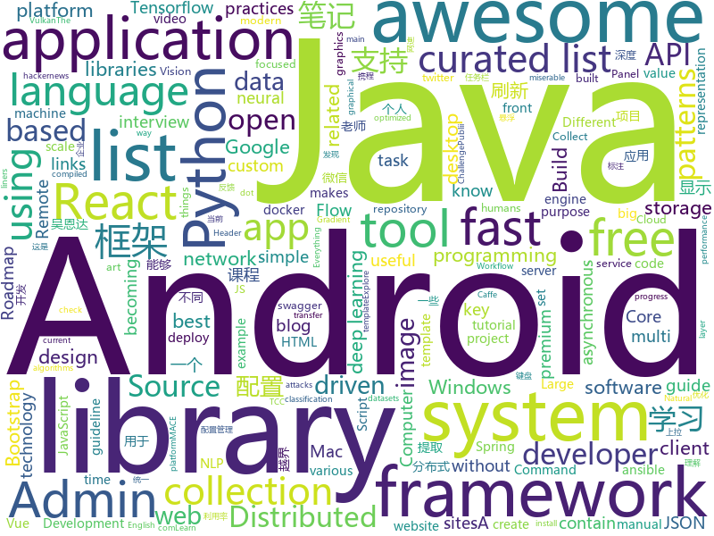

# 2018-07-12
See what the GitHub community is most excited about today.

## python
* [cheat.sh](https://github.com/chubin/cheat.sh)(**2,684 stars today**): the only cheat sheet you need
* [glow](https://github.com/openai/glow)(**275 stars today**): Code for reproducing results in "Glow: Generative Flow with Invertible 1x1 Convolutions"
* [PythonRobotics](https://github.com/AtsushiSakai/PythonRobotics)(**161 stars today**): Python sample codes for robotics algorithms.
* [termtosvg](https://github.com/nbedos/termtosvg)(**97 stars today**): Record terminal sessions as SVG animations
* [gensen](https://github.com/Maluuba/gensen)(**86 stars today**): Learning General Purpose Distributed Sentence Representations via Large Scale Multi-task Learning
* [models](https://github.com/tensorflow/models)(**59 stars today**): Models and examples built with TensorFlow
* [sniff-paste](https://github.com/needmorecowbell/sniff-paste)(**67 stars today**): Pastebin OSINT Harvester
* [distroless](https://github.com/GoogleContainerTools/distroless)(**70 stars today**): 🥑Language focused docker images, minus the operating system.
* [help-why-cant-i-hold-all-these-mutuals](https://github.com/ejmg/help-why-cant-i-hold-all-these-mutuals)(**66 stars today**): find all your mutuals and throw them on a list so you can all be miserable together on twitter dot com
* [system-design-primer](https://github.com/donnemartin/system-design-primer)(**60 stars today**): Learn how to design large-scale systems. Prep for the system design interview. Includes Anki flashcards.
* [youtube-dl](https://github.com/rg3/youtube-dl)(**54 stars today**): Command-line program to download videos from YouTube.com and other video sites
* [awesome-python](https://github.com/vinta/awesome-python)(**50 stars today**): A curated list of awesome Python frameworks, libraries, software and resources
* [vibora](https://github.com/vibora-io/vibora)(**47 stars today**): Fast, asynchronous and elegant Python web framework.
* [keras](https://github.com/keras-team/keras)(**40 stars today**): Deep Learning for humans
* [tldr](https://github.com/tldr-pages/tldr)(**44 stars today**): 📚Simplified and community-driven man pages
* [word-mesh](https://github.com/mukund109/word-mesh)(**42 stars today**): A context-preserving word cloud generator
* [ansible](https://github.com/ansible/ansible)(**36 stars today**): Ansible is a radically simple IT automation platform that makes your applications and systems easier to deploy. Avoid writing scripts or custom code to deploy and update your applications — automate in a language that approaches plain English, using SSH, with no agents to install on remote systems. https://docs.ansible.com/ansible/
* [Cr3dOv3r](https://github.com/D4Vinci/Cr3dOv3r)(**37 stars today**): Know the dangers of credential reuse attacks.
* [wttr.in](https://github.com/chubin/wttr.in)(**38 stars today**): ⛅️The right way to check the weather
* [pipenv](https://github.com/pypa/pipenv)(**37 stars today**): Python Development Workflow for Humans.
* [public-apis](https://github.com/toddmotto/public-apis)(**37 stars today**): A collective list of public JSON APIs for use in web development.
* [ImageAI](https://github.com/OlafenwaMoses/ImageAI)(**33 stars today**): A python library built to empower developers to build applications and systems with self-contained Computer Vision capabilities
* [face_recognition](https://github.com/ageitgey/face_recognition)(**33 stars today**): The world's simplest facial recognition api for Python and the command line
* [nlp-tensorflow](https://github.com/Bricoler/nlp-tensorflow)(**32 stars today**): NLP Tensorflow Tutorials
* [cartoonify](https://github.com/danmacnish/cartoonify)(**34 stars today**): python app to turn a photograph into a cartoon

## java
* [jib](https://github.com/GoogleContainerTools/jib)(**962 stars today**): ⛵️Build container images for your Java applications.
* [Java-Interview](https://github.com/crossoverJie/Java-Interview)(**103 stars today**): 👨‍🎓Java related : basic, concurrent, algorithm
* [ballerina-lang](https://github.com/ballerina-platform/ballerina-lang)(**104 stars today**): Ballerina is a compiled, transactional, statically and strongly typed programming language with textual and graphical syntaxes.
* [spring-boot](https://github.com/spring-projects/spring-boot)(**63 stars today**): Spring Boot
* [elasticsearch](https://github.com/elastic/elasticsearch)(**51 stars today**): Open Source, Distributed, RESTful Search Engine
* [java-design-patterns](https://github.com/iluwatar/java-design-patterns)(**38 stars today**): Design patterns implemented in Java
* [incubator-dubbo](https://github.com/apache/incubator-dubbo)(**33 stars today**): Apache Dubbo (incubating) is a high-performance, java based, open source RPC framework.
* [HanLP](https://github.com/hankcs/HanLP)(**42 stars today**): 自然语言处理 中文分词 词性标注 命名实体识别 依存句法分析 关键词提取 新词发现 短语提取 自动摘要 文本分类 拼音简繁
* [hmily](https://github.com/yu199195/hmily)(**40 stars today**): TCC分布式事务框架(try,confirm,cancel)
* [tutorials](https://github.com/eugenp/tutorials)(**23 stars today**): The "REST With Spring" Course:
* [apollo](https://github.com/ctripcorp/apollo)(**31 stars today**): Apollo（阿波罗）是携程框架部门研发的分布式配置中心，能够集中化管理应用不同环境、不同集群的配置，配置修改后能够实时推送到应用端，并且具备规范的权限、流程治理等特性，适用于微服务配置管理场景。
* [weixin-java-tools](https://github.com/Wechat-Group/weixin-java-tools)(**36 stars today**): 可能是目前最好最全的微信Java开发工具包，支持包括微信支付、开放平台、小程序、企业号和公众号等的开发
* [retrofit](https://github.com/square/retrofit)(**35 stars today**): Type-safe HTTP client for Android and Java by Square, Inc.
* [guava](https://github.com/google/guava)(**30 stars today**): Google core libraries for Java
* [spring-framework](https://github.com/spring-projects/spring-framework)(**29 stars today**): Spring Framework
* [AndroidUtilCode](https://github.com/Blankj/AndroidUtilCode)(**24 stars today**): 🔥Android developers should collect the following utils(updating).
* [interviews](https://github.com/kdn251/interviews)(**29 stars today**): Everything you need to know to get the job.
* [TimetableView](https://github.com/zfman/TimetableView)(**31 stars today**): 一个开源的、完善的、简洁的课程表控件
* [eureka](https://github.com/Netflix/eureka)(**23 stars today**): AWS Service registry for resilient mid-tier load balancing and failover.
* [zxing](https://github.com/zxing/zxing)(**25 stars today**): ZXing ("Zebra Crossing") barcode scanning library for Java, Android
* [vehicle-keyboard-android](https://github.com/parkingwang/vehicle-keyboard-android)(**25 stars today**): 停车王车牌键盘-Android
* [glide](https://github.com/bumptech/glide)(**24 stars today**): An image loading and caching library for Android focused on smooth scrolling
* [SmartRefreshLayout](https://github.com/scwang90/SmartRefreshLayout)(**24 stars today**): 🔥下拉刷新、上拉加载、二级刷新、淘宝二楼、RefreshLayout、OverScroll，Android智能下拉刷新框架，支持越界回弹、越界拖动，具有极强的扩展性，集成了几十种炫酷的Header和 Footer。
* [netty](https://github.com/netty/netty)(**20 stars today**): Netty project - an event-driven asynchronous network application framework
* [okhttp](https://github.com/square/okhttp)(**23 stars today**): An HTTP+HTTP/2 client for Android and Java applications.

## unknown
* [react-developer-roadmap](https://github.com/adam-golab/react-developer-roadmap)(**584 stars today**): Roadmap to becoming a React developer in 2018
* [Interview-Notebook](https://github.com/CyC2018/Interview-Notebook)(**474 stars today**): 📆准备秋招学习笔记
* [developer-roadmap](https://github.com/kamranahmedse/developer-roadmap)(**89 stars today**): Roadmap to becoming a web developer in 2018
* [gitignore](https://github.com/github/gitignore)(**53 stars today**): A collection of useful .gitignore templates
* [awesome](https://github.com/sindresorhus/awesome)(**63 stars today**): 😎Curated list of awesome lists
* [You-Dont-Know-JS](https://github.com/getify/You-Dont-Know-JS)(**59 stars today**): A book series on JavaScript. @YDKJS on twitter.
* [vue-patterns](https://github.com/learn-vuejs/vue-patterns)(**62 stars today**): Useful Vue patterns, techniques, tips and tricks and helpful curated links.
* [blog](https://github.com/forthealllight/blog)(**60 stars today**): 📖我的博客，记录学习的一些笔记，如有喜欢，欢迎star
* [architect-awesome](https://github.com/xingshaocheng/architect-awesome)(**54 stars today**): 后端架构师技术图谱
* [build-your-own-x](https://github.com/danistefanovic/build-your-own-x)(**59 stars today**): 🤓Build your own (insert technology here)
* [awesome-vue](https://github.com/vuejs/awesome-vue)(**55 stars today**): 🎉A curated list of awesome things related to Vue.js
* [blog_backups](https://github.com/crazyandcoder/blog_backups)(**49 stars today**): Android 项目优化、面试题集，包含Android、Java、数据结构、算法、个人blog备份等。
* [NLP-progress](https://github.com/sebastianruder/NLP-progress)(**51 stars today**): Repository to track the progress in Natural Language Processing (NLP), including the datasets and the current state-of-the-art for the most common NLP tasks.
* [free-programming-books](https://github.com/EbookFoundation/free-programming-books)(**47 stars today**): 📚Freely available programming books
* [project-based-learning](https://github.com/tuvtran/project-based-learning)(**45 stars today**): Curated list of project-based tutorials
* [awesome-design-patterns](https://github.com/DovAmir/awesome-design-patterns)(**47 stars today**): A curated list of software and architecture related design patterns.
* [React-Redux-Styleguide](https://github.com/iraycd/React-Redux-Styleguide)(**43 stars today**): This is a working set of guidelines for developing React applications. We say "guideline" because there are no hard-and-fast rules; best practices, patterns and technology change over time, so we consider this a living set of style guides.
* [awesome-flutter](https://github.com/Solido/awesome-flutter)(**37 stars today**): An awesome list that curates the best Flutter libraries, tools, tutorials, articles and more.
* [awesome-ninja-admins](https://github.com/trimstray/awesome-ninja-admins)(**34 stars today**): 💫A collection of awesome lists, manuals, blogs, hacks, one-liners and tools for Awesome Ninja Admins.
* [Compatibility](https://github.com/android-in-china/Compatibility)(**34 stars today**): 用于反馈和跟踪国内 Android 设备/ROM 兼容性问题的公益项目
* [awesome-react](https://github.com/enaqx/awesome-react)(**30 stars today**): A collection of awesome things regarding React ecosystem.
* [AlphaTree-graphic-deep-neural-network](https://github.com/weslynn/AlphaTree-graphic-deep-neural-network)(**29 stars today**): 将深度神经网络中的一些模型 进行统一的图示，便于大家对模型的理解
* [nodebestpractices](https://github.com/i0natan/nodebestpractices)(**27 stars today**): The largest Node.JS best practices list (June 2018)
* [Awesome-Hacking](https://github.com/Hack-with-Github/Awesome-Hacking)(**28 stars today**): A collection of various awesome lists for hackers, pentesters and security researchers
* [Java-Guide](https://github.com/Snailclimb/Java-Guide)(**25 stars today**): 📖Java面试通关手册（Java学习指南）Java Interview Customs Manual (Java Study Guide)

## c++
* [aspia](https://github.com/dchapyshev/aspia)(**163 stars today**): Remote desktop and file transfer tool.
* [tensorflow](https://github.com/tensorflow/tensorflow)(**111 stars today**): Computation using data flow graphs for scalable machine learning
* [electron](https://github.com/electron/electron)(**61 stars today**): Build cross platform desktop apps with JavaScript, HTML, and CSS
* [TrafficMonitor](https://github.com/zhongyang219/TrafficMonitor)(**42 stars today**): 这是一个用于显示当前网速、CPU及内存利用率的桌面悬浮窗软件，并支持任务栏显示，支持更换皮肤。
* [pytorch](https://github.com/pytorch/pytorch)(**40 stars today**): Tensors and Dynamic neural networks in Python with strong GPU acceleration
* [opencv](https://github.com/opencv/opencv)(**25 stars today**): Open Source Computer Vision Library
* [bitcoin](https://github.com/bitcoin/bitcoin)(**31 stars today**): Bitcoin Core integration/staging tree
* [horovod](https://github.com/uber/horovod)(**36 stars today**): Distributed training framework for TensorFlow, Keras, and PyTorch.
* [apollo](https://github.com/ApolloAuto/apollo)(**31 stars today**): An open autonomous driving platform
* [mace](https://github.com/XiaoMi/mace)(**33 stars today**): MACE is a deep learning inference framework optimized for mobile heterogeneous computing platforms.
* [aseprite](https://github.com/aseprite/aseprite)(**32 stars today**): Animated sprite editor & pixel art tool (Windows, macOS, Linux)
* [protobuf](https://github.com/google/protobuf)(**29 stars today**): Protocol Buffers - Google's data interchange format
* [envoy](https://github.com/envoyproxy/envoy)(**27 stars today**): C++ front/service proxy
* [tesseract](https://github.com/tesseract-ocr/tesseract)(**22 stars today**): Tesseract Open Source OCR Engine (main repository)
* [LLGL](https://github.com/LukasBanana/LLGL)(**23 stars today**): Low Level Graphics Library (LLGL) is a thin abstraction layer for modern graphics APIs such as OpenGL, Direct3D, and Vulkan
* [swift](https://github.com/apple/swift)(**18 stars today**): The Swift Programming Language
* [pegasus](https://github.com/XiaoMi/pegasus)(**20 stars today**): A distributed key-value storage system developed and maintained by Xiaomi Cloud Storage Team.
* [caffe](https://github.com/BVLC/caffe)(**17 stars today**): Caffe: a fast open framework for deep learning.
* [openpose](https://github.com/CMU-Perceptual-Computing-Lab/openpose)(**17 stars today**): OpenPose: Real-time multi-person keypoint detection library for body, face, and hands estimation
* [xgboost](https://github.com/dmlc/xgboost)(**17 stars today**): Scalable, Portable and Distributed Gradient Boosting (GBDT, GBRT or GBM) Library, for Python, R, Java, Scala, C++ and more. Runs on single machine, Hadoop, Spark, Flink and DataFlow
* [v8](https://github.com/v8/v8)(**16 stars today**): The official mirror of the V8 Git repository
* [ClickHouse](https://github.com/yandex/ClickHouse)(**17 stars today**): ClickHouse is a free analytic DBMS for big data.
* [rocksdb](https://github.com/facebook/rocksdb)(**15 stars today**): A library that provides an embeddable, persistent key-value store for fast storage.
* [json](https://github.com/nlohmann/json)(**15 stars today**): JSON for Modern C++
* [cmder](https://github.com/cmderdev/cmder)(**16 stars today**): Lovely console emulator package for Windows

## html
* [itty-bitty](https://github.com/alcor/itty-bitty)(**97 stars today**): Itty.bitty is a tool to create links that contain small sites
* [react-from-zero](https://github.com/kay-is/react-from-zero)(**49 stars today**): A simple (99% ES2015 less) tutorial for React
* [douyin](https://github.com/lujqme/douyin)(**22 stars today**): 抖音 桌面版(WIndows/Mac OS)
* [fastText](https://github.com/facebookresearch/fastText)(**20 stars today**): Library for fast text representation and classification.
* [AdminLTE](https://github.com/almasaeed2010/AdminLTE)(**16 stars today**): AdminLTE - Free Premium Admin control Panel Theme Based On Bootstrap 3.x
* [Spoon-Knife](https://github.com/octocat/Spoon-Knife)(****): This repo is for demonstration purposes only.
* [Switchable-Normalization](https://github.com/switchablenorms/Switchable-Normalization)(**15 stars today**): 
* [deeplearning_ai_books](https://github.com/fengdu78/deeplearning_ai_books)(**13 stars today**): deeplearning.ai（吴恩达老师的深度学习课程笔记及资源）
* [EIPs](https://github.com/ethereum/EIPs)(**13 stars today**): The Ethereum Improvement Proposal repository
* [portainer](https://github.com/portainer/portainer)(**14 stars today**): Simple management UI for Docker
* [Coursera-ML-AndrewNg-Notes](https://github.com/fengdu78/Coursera-ML-AndrewNg-Notes)(**12 stars today**): 吴恩达老师的机器学习课程个人笔记
* [JavaScript30](https://github.com/wesbos/JavaScript30)(**6 stars today**): 30 Day Vanilla JS Challenge
* [Publii](https://github.com/GetPublii/Publii)(**14 stars today**): Publii is a desktop-based CMS for Windows and Mac that makes creating static websites fast and hassle-free, even for beginners.
* [hacker-job-trends](https://github.com/timqian/hacker-job-trends)(**13 stars today**): Play with hackernews' "who is hiring"
* [awesome-mac](https://github.com/jaywcjlove/awesome-mac)(**12 stars today**):  Now we have become very big, Different from the original idea. Collect premium software in various categories.
* [gentelella](https://github.com/puikinsh/gentelella)(**8 stars today**): Free Bootstrap 3 Admin Template
* [notes](https://github.com/mozilla/notes)(**10 stars today**): A notepad for Firefox
* [brain.js](https://github.com/BrainJS/brain.js)(**9 stars today**): 🤖Neural networks in JavaScript
* [coreui-free-bootstrap-admin-template](https://github.com/coreui/coreui-free-bootstrap-admin-template)(**8 stars today**): CoreUI is free bootstrap admin template
* [electron-api-demos](https://github.com/electron/electron-api-demos)(**8 stars today**): Explore the Electron APIs
* [react-app-rewired](https://github.com/timarney/react-app-rewired)(**9 stars today**): Override create-react-app webpack configs without ejecting
* [learn-to-send-email-via-google-script-html-no-server](https://github.com/dwyl/learn-to-send-email-via-google-script-html-no-server)(**7 stars today**): ✉️An Example of using an HTML form (e.g: "Contact Us" on a website) to send Email without a Backend Server (using a Google Script)
* [swagger-codegen](https://github.com/swagger-api/swagger-codegen)(**6 stars today**): swagger-codegen contains a template-driven engine to generate documentation, API clients and server stubs in different languages by parsing your OpenAPI / Swagger definition.
* [ng-alain](https://github.com/cipchk/ng-alain)(**8 stars today**): ng-zorro-antd admin panel front-end framework
* [DroidTelescope](https://github.com/zkwlx/DroidTelescope)(**8 stars today**): DroidTelescope（DT），Android端App性能监控框架

## WordCloud

