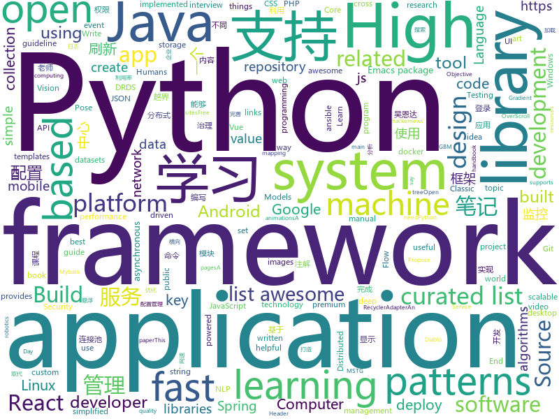

# 2018-07-13
See what the GitHub community is most excited about today.

## python
* [cheat.sh](https://github.com/chubin/cheat.sh)(**2,364 stars today**): the only cheat sheet you need
* [PythonRobotics](https://github.com/AtsushiSakai/PythonRobotics)(**106 stars today**): Python sample codes for robotics algorithms.
* [glow](https://github.com/openai/glow)(**104 stars today**): Code for reproducing results in "Glow: Generative Flow with Invertible 1x1 Convolutions"
* [system-design-primer](https://github.com/donnemartin/system-design-primer)(**70 stars today**): Learn how to design large-scale systems. Prep for the system design interview. Includes Anki flashcards.
* [models](https://github.com/tensorflow/models)(**53 stars today**): Models and examples built with TensorFlow
* [contrib](https://github.com/pytorch/contrib)(**69 stars today**): Implementations of ideas from recent papers
* [termtosvg](https://github.com/nbedos/termtosvg)(**57 stars today**): Record terminal sessions as SVG animations
* [awesome-python](https://github.com/vinta/awesome-python)(**49 stars today**): A curated list of awesome Python frameworks, libraries, software and resources
* [distroless](https://github.com/GoogleContainerTools/distroless)(**52 stars today**): 🥑Language focused docker images, minus the operating system.
* [vibora](https://github.com/vibora-io/vibora)(**52 stars today**): Fast, asynchronous and elegant Python web framework.
* [pipenv](https://github.com/pypa/pipenv)(**50 stars today**): Python Development Workflow for Humans.
* [face_recognition](https://github.com/ageitgey/face_recognition)(**42 stars today**): The world's simplest facial recognition api for Python and the command line
* [keras](https://github.com/keras-team/keras)(**36 stars today**): Deep Learning for humans
* [public-apis](https://github.com/toddmotto/public-apis)(**43 stars today**): A collective list of public JSON APIs for use in web development.
* [wttr.in](https://github.com/chubin/wttr.in)(**47 stars today**): ⛅️The right way to check the weather
* [youtube-dl](https://github.com/rg3/youtube-dl)(**43 stars today**): Command-line program to download videos from YouTube.com and other video sites
* [saleor](https://github.com/mirumee/saleor)(**33 stars today**): An e-commerce storefront for Python and Django
* [ansible](https://github.com/ansible/ansible)(**30 stars today**): Ansible is a radically simple IT automation platform that makes your applications and systems easier to deploy. Avoid writing scripts or custom code to deploy and update your applications — automate in a language that approaches plain English, using SSH, with no agents to install on remote systems. https://docs.ansible.com/ansible/
* [tldr](https://github.com/tldr-pages/tldr)(**34 stars today**): 📚Simplified and community-driven man pages
* [awesome-machine-learning](https://github.com/josephmisiti/awesome-machine-learning)(**30 stars today**): A curated list of awesome Machine Learning frameworks, libraries and software.
* [Detectron](https://github.com/facebookresearch/Detectron)(**28 stars today**): FAIR's research platform for object detection research, implementing popular algorithms like Mask R-CNN and RetinaNet.
* [cpython](https://github.com/python/cpython)(**25 stars today**): The Python programming language
* [scikit-learn](https://github.com/scikit-learn/scikit-learn)(**24 stars today**): scikit-learn: machine learning in Python
* [sniff-paste](https://github.com/needmorecowbell/sniff-paste)(**28 stars today**): Pastebin OSINT Harvester
* [ImageAI](https://github.com/OlafenwaMoses/ImageAI)(**26 stars today**): A python library built to empower developers to build applications and systems with self-contained Computer Vision capabilities

## java
* [jib](https://github.com/GoogleContainerTools/jib)(**428 stars today**): ⛵️Build container images for your Java applications.
* [S-MVP](https://github.com/UCodeUStory/S-MVP)(**106 stars today**): 🔥🔥优化版MVP,使用注解泛型简化代码编写，使用模块化协议方便维护，APT过程使用注解解析器利用JavaPoet🌝完成重复模块的编写，利用ASpect+GradlePlugin 完成横向AOP编程+Javassist动态字节码注入+Tinker实现热修复+Retrofit实现优雅网络操作+RxJava轻松玩转数据处理
* [Java-Interview](https://github.com/crossoverJie/Java-Interview)(**83 stars today**): 👨‍🎓Java related : basic, concurrent, algorithm
* [spring-boot](https://github.com/spring-projects/spring-boot)(**61 stars today**): Spring Boot
* [java-design-patterns](https://github.com/iluwatar/java-design-patterns)(**58 stars today**): Design patterns implemented in Java
* [interviews](https://github.com/kdn251/interviews)(**41 stars today**): Everything you need to know to get the job.
* [proxyee-down](https://github.com/proxyee-down-org/proxyee-down)(**40 stars today**): http下载工具，基于http代理，支持多连接分块下载
* [spring-framework](https://github.com/spring-projects/spring-framework)(**33 stars today**): Spring Framework
* [tutorials](https://github.com/eugenp/tutorials)(**30 stars today**): The "REST With Spring" Course:
* [guava](https://github.com/google/guava)(**39 stars today**): Google core libraries for Java
* [eureka](https://github.com/Netflix/eureka)(**39 stars today**): AWS Service registry for resilient mid-tier load balancing and failover.
* [SmartRefreshLayout](https://github.com/scwang90/SmartRefreshLayout)(**39 stars today**): 🔥下拉刷新、上拉加载、二级刷新、淘宝二楼、RefreshLayout、OverScroll，Android智能下拉刷新框架，支持越界回弹、越界拖动，具有极强的扩展性，集成了几十种炫酷的Header和 Footer。
* [elasticsearch](https://github.com/elastic/elasticsearch)(**35 stars today**): Open Source, Distributed, RESTful Search Engine
* [apollo](https://github.com/ctripcorp/apollo)(**30 stars today**): Apollo（阿波罗）是携程框架部门研发的分布式配置中心，能够集中化管理应用不同环境、不同集群的配置，配置修改后能够实时推送到应用端，并且具备规范的权限、流程治理等特性，适用于微服务配置管理场景。
* [simple-vlc-player](https://github.com/masterwok/simple-vlc-player)(**36 stars today**): An Android media player library powered by LibVLC.
* [incubator-dubbo](https://github.com/apache/incubator-dubbo)(**23 stars today**): Apache Dubbo (incubating) is a high-performance, java based, open source RPC framework.
* [Java](https://github.com/TheAlgorithms/Java)(**27 stars today**): All Algorithms implemented in Java
* [RxJava](https://github.com/ReactiveX/RxJava)(**30 stars today**): RxJava – Reactive Extensions for the JVM – a library for composing asynchronous and event-based programs using observable sequences for the Java VM.
* [druid](https://github.com/alibaba/druid)(**29 stars today**): ♨️为监控而生的数据库连接池！阿里云DRDS(https://www.aliyun.com/product/drds )、阿里巴巴TDDL 连接池powered by Druid
* [zheng](https://github.com/shuzheng/zheng)(**25 stars today**): 基于Spring+SpringMVC+Mybatis分布式敏捷开发系统架构，提供整套公共微服务服务模块：集中权限管理（单点登录）、内容管理、支付中心、用户管理（支持第三方登录）、微信平台、存储系统、配置中心、日志分析、任务和通知等，支持服务治理、监控和追踪，努力为中小型企业打造全方位J2EE企业级开发解决方案。
* [netty](https://github.com/netty/netty)(**25 stars today**): Netty project - an event-driven asynchronous network application framework
* [TimetableView](https://github.com/zfman/TimetableView)(**26 stars today**): 一个开源的、完善的、简洁的课程表控件
* [vehicle-keyboard-android](https://github.com/parkingwang/vehicle-keyboard-android)(**25 stars today**): 停车王车牌键盘-Android
* [BaseRecyclerViewAdapterHelper](https://github.com/CymChad/BaseRecyclerViewAdapterHelper)(**23 stars today**): BRVAH:Powerful and flexible RecyclerAdapter
* [okhttp](https://github.com/square/okhttp)(**22 stars today**): An HTTP+HTTP/2 client for Android and Java applications.

## unknown
* [react-developer-roadmap](https://github.com/adam-golab/react-developer-roadmap)(**410 stars today**): Roadmap to becoming a React developer in 2018
* [Interview-Notebook](https://github.com/CyC2018/Interview-Notebook)(**278 stars today**): 📆准备秋招学习笔记
* [PHP-Interview-Best-Practices-in-China](https://github.com/eaglewu/PHP-Interview-Best-Practices-in-China)(**83 stars today**): 📙PHP 面试知识点汇总
* [awesome](https://github.com/sindresorhus/awesome)(**70 stars today**): 😎Curated list of awesome lists
* [gitignore](https://github.com/github/gitignore)(**57 stars today**): A collection of useful .gitignore templates
* [architect-awesome](https://github.com/xingshaocheng/architect-awesome)(**63 stars today**): 后端架构师技术图谱
* [You-Dont-Know-JS](https://github.com/getify/You-Dont-Know-JS)(**52 stars today**): A book series on JavaScript. @YDKJS on twitter.
* [vue-patterns](https://github.com/learn-vuejs/vue-patterns)(**61 stars today**): Useful Vue patterns, techniques, tips and tricks and helpful curated links.
* [free-programming-books](https://github.com/EbookFoundation/free-programming-books)(**50 stars today**): 📚Freely available programming books
* [build-your-own-x](https://github.com/danistefanovic/build-your-own-x)(**54 stars today**): 🤓Build your own (insert technology here)
* [awesome-vue](https://github.com/vuejs/awesome-vue)(**53 stars today**): 🎉A curated list of awesome things related to Vue.js
* [blog](https://github.com/forthealllight/blog)(**48 stars today**): 📖我的博客，记录学习的一些笔记，如有喜欢，欢迎star
* [project-based-learning](https://github.com/tuvtran/project-based-learning)(**42 stars today**): Curated list of project-based tutorials
* [pose-residual-network](https://github.com/mkocabas/pose-residual-network)(**37 stars today**): Code for 'MultiPoseNet: Fast Multi-Person Pose Estimation using Pose Residual Network' paper
* [React-Redux-Styleguide](https://github.com/iraycd/React-Redux-Styleguide)(**37 stars today**): This is a working set of guidelines for developing React applications. We say "guideline" because there are no hard-and-fast rules; best practices, patterns and technology change over time, so we consider this a living set of style guides.
* [NLP-progress](https://github.com/sebastianruder/NLP-progress)(**36 stars today**): Repository to track the progress in Natural Language Processing (NLP), including the datasets and the current state-of-the-art for the most common NLP tasks.
* [nocode](https://github.com/kelseyhightower/nocode)(**33 stars today**): The best way to write secure and reliable applications. Write nothing; deploy nowhere.
* [Front-end-Developer-Interview-Questions](https://github.com/h5bp/Front-end-Developer-Interview-Questions)(**32 stars today**): A list of helpful front-end related questions you can use to interview potential candidates, test yourself or completely ignore.
* [awesome-public-datasets](https://github.com/awesomedata/awesome-public-datasets)(**28 stars today**): A topic-centric list of high-quality open datasets in public domains. Propose NEW data ☛☛☛PR☛☛☛
* [design-patterns-for-humans](https://github.com/kamranahmedse/design-patterns-for-humans)(**27 stars today**): Design Patterns for Humans™ - An ultra-simplified explanation
* [d2-ribbons](https://github.com/d2-projects/d2-ribbons)(**27 stars today**): A ribbons library for github gite and gitlab
* [awesome-react](https://github.com/enaqx/awesome-react)(**26 stars today**): A collection of awesome things regarding React ecosystem.
* [awesome-scalability](https://github.com/binhnguyennus/awesome-scalability)(**24 stars today**): High Scalability, High Availability, High Stability, High Performance, and High Intelligence Back-End Design Patterns
* [awesome-nodejs](https://github.com/sindresorhus/awesome-nodejs)(**26 stars today**): ⚡️Delightful Node.js packages and resources
* [awesome-design-patterns](https://github.com/DovAmir/awesome-design-patterns)(**26 stars today**): A curated list of software and architecture related design patterns.

## c++
* [tensorflow](https://github.com/tensorflow/tensorflow)(**101 stars today**): Computation using data flow graphs for scalable machine learning
* [aspia](https://github.com/dchapyshev/aspia)(**62 stars today**): Remote desktop and file transfer tool.
* [electron](https://github.com/electron/electron)(**52 stars today**): Build cross platform desktop apps with JavaScript, HTML, and CSS
* [TrafficMonitor](https://github.com/zhongyang219/TrafficMonitor)(**47 stars today**): 这是一个用于显示当前网速、CPU及内存利用率的桌面悬浮窗软件，并支持任务栏显示，支持更换皮肤。
* [bitcoin](https://github.com/bitcoin/bitcoin)(**40 stars today**): Bitcoin Core integration/staging tree
* [opencv](https://github.com/opencv/opencv)(**31 stars today**): Open Source Computer Vision Library
* [pytorch](https://github.com/pytorch/pytorch)(**32 stars today**): Tensors and Dynamic neural networks in Python with strong GPU acceleration
* [miniblink49](https://github.com/weolar/miniblink49)(**35 stars today**): 一个小巧、轻量的浏览器内核，用来取代wke和libcef
* [protobuf](https://github.com/google/protobuf)(**28 stars today**): Protocol Buffers - Google's data interchange format
* [horovod](https://github.com/uber/horovod)(**32 stars today**): Distributed training framework for TensorFlow, Keras, and PyTorch.
* [tesseract](https://github.com/tesseract-ocr/tesseract)(**28 stars today**): Tesseract Open Source OCR Engine (main repository)
* [apollo](https://github.com/ApolloAuto/apollo)(**26 stars today**): An open autonomous driving platform
* [Classic-Start](https://github.com/passionate-coder/Classic-Start)(**30 stars today**): Reborn of Classic Shell (Ivo Beltchev) - Classic Start (passionate-coder)
* [grpc](https://github.com/grpc/grpc)(**23 stars today**): The C based gRPC (C++, Python, Ruby, Objective-C, PHP, C#)
* [caffe](https://github.com/BVLC/caffe)(**18 stars today**): Caffe: a fast open framework for deep learning.
* [aseprite](https://github.com/aseprite/aseprite)(**25 stars today**): Animated sprite editor & pixel art tool (Windows, macOS, Linux)
* [xgboost](https://github.com/dmlc/xgboost)(**18 stars today**): Scalable, Portable and Distributed Gradient Boosting (GBDT, GBRT or GBM) Library, for Python, R, Java, Scala, C++ and more. Runs on single machine, Hadoop, Spark, Flink and DataFlow
* [v8](https://github.com/v8/v8)(**19 stars today**): The official mirror of the V8 Git repository
* [RedisDesktopManager](https://github.com/uglide/RedisDesktopManager)(**18 stars today**): 🔧Cross-platform GUI management tool for Redis
* [leveldb](https://github.com/google/leveldb)(**16 stars today**): LevelDB is a fast key-value storage library written at Google that provides an ordered mapping from string keys to string values.
* [mace](https://github.com/XiaoMi/mace)(**17 stars today**): MACE is a deep learning inference framework optimized for mobile heterogeneous computing platforms.
* [devilution](https://github.com/diasurgical/devilution)(**16 stars today**): Diablo devolved - magic behind the 1996 computer game
* [turicreate](https://github.com/apple/turicreate)(**17 stars today**): Turi Create simplifies the development of custom machine learning models.
* [json](https://github.com/nlohmann/json)(**14 stars today**): JSON for Modern C++
* [rocksdb](https://github.com/facebook/rocksdb)(**14 stars today**): A library that provides an embeddable, persistent key-value store for fast storage.

## html
* [react-from-zero](https://github.com/kay-is/react-from-zero)(**96 stars today**): A simple (99% ES2015 less) tutorial for React
* [itty-bitty](https://github.com/alcor/itty-bitty)(**94 stars today**): Itty.bitty is a tool to create links that contain small sites
* [awesome-bulma-templates](https://github.com/aldi/awesome-bulma-templates)(**28 stars today**): Free real-world templates built with Bulma
* [foml](https://github.com/bloomberg/foml)(**35 stars today**): Foundations of Machine Learning
* [bulma-social](https://github.com/aldi/bulma-social)(**25 stars today**): Social Sign-In Buttons made in pure CSS based on Bulma and Font Awesome!
* [AdminLTE](https://github.com/almasaeed2010/AdminLTE)(**19 stars today**): AdminLTE - Free Premium Admin control Panel Theme Based On Bootstrap 3.x
* [DroidTelescope](https://github.com/zkwlx/DroidTelescope)(**21 stars today**): DroidTelescope（DT），Android端App性能监控框架
* [portainer](https://github.com/portainer/portainer)(**18 stars today**): Simple management UI for Docker
* [Coursera-ML-AndrewNg-Notes](https://github.com/fengdu78/Coursera-ML-AndrewNg-Notes)(**15 stars today**): 吴恩达老师的机器学习课程个人笔记
* [linux-command](https://github.com/jaywcjlove/linux-command)(**18 stars today**): Linux命令大全搜索工具，内容包含Linux命令手册、详解、学习、搜集。https://git.io/linux
* [pdfs](https://github.com/tpn/pdfs)(**17 stars today**): Technically-oriented PDF Collection (Papers, Specs, Decks, Manuals, etc)
* [Spoon-Knife](https://github.com/octocat/Spoon-Knife)(****): This repo is for demonstration purposes only.
* [awesome-mac](https://github.com/jaywcjlove/awesome-mac)(**14 stars today**):  Now we have become very big, Different from the original idea. Collect premium software in various categories.
* [Python-crawler](https://github.com/Ehco1996/Python-crawler)(**13 stars today**): 从头开始 系统化的 学习如何写Python爬虫。 Python版本 3.6
* [deeplearning_ai_books](https://github.com/fengdu78/deeplearning_ai_books)(**14 stars today**): deeplearning.ai（吴恩达老师的深度学习课程笔记及资源）
* [presenter-terms](https://github.com/codepo8/presenter-terms)(**14 stars today**): A no-nonsense explainer for conference organisers about my presenting terms and topics
* [douyin](https://github.com/lujqme/douyin)(**12 stars today**): 抖音 桌面版(WIndows/Mac OS)
* [CredSniper](https://github.com/ustayready/CredSniper)(**13 stars today**): CredSniper is a phishing framework written with the Python micro-framework Flask and Jinja2 templating which supports capturing 2FA tokens.
* [Switchable-Normalization](https://github.com/switchablenorms/Switchable-Normalization)(**10 stars today**): 
* [react-app-rewired](https://github.com/timarney/react-app-rewired)(**12 stars today**): Override create-react-app webpack configs without ejecting
* [owasp-mstg](https://github.com/OWASP/owasp-mstg)(**11 stars today**): The Mobile Security Testing Guide (MSTG) is a comprehensive manual for mobile app security testing and reverse engineering.
* [hacker-job-trends](https://github.com/timqian/hacker-job-trends)(**11 stars today**): Play with hackernews' "who is hiring"
* [primeng](https://github.com/primefaces/primeng)(**9 stars today**): UI Components for Angular
* [JavaScript30](https://github.com/wesbos/JavaScript30)(**6 stars today**): 30 Day Vanilla JS Challenge
* [emacs-package-dev-handbook](https://github.com/alphapapa/emacs-package-dev-handbook)(**10 stars today**): An Emacs package development handbook. Built with Emacs, by Emacs package developers, for Emacs package developers.

## WordCloud

