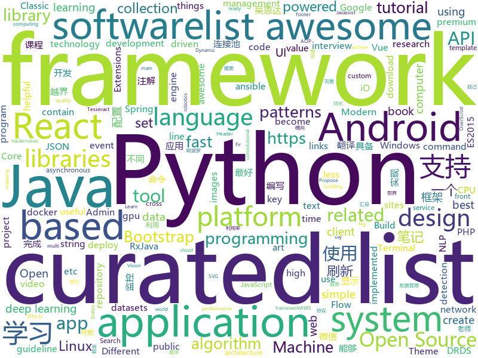

# 2018-07-14
See what the GitHub community is most excited about today.

## python
* [system-design-primer](https://github.com/donnemartin/system-design-primer)(**2,904 stars today**): Learn how to design large-scale systems. Prep for the system design interview. Includes Anki flashcards.
* [cheat.sh](https://github.com/chubin/cheat.sh)(**1,123 stars today**): the only cheat sheet you need
* [termtosvg](https://github.com/nbedos/termtosvg)(**238 stars today**): Record terminal sessions as SVG animations
* [xar](https://github.com/facebookincubator/xar)(**107 stars today**): executable archive format
* [models](https://github.com/tensorflow/models)(**63 stars today**): Models and examples built with TensorFlow
* [glow](https://github.com/openai/glow)(**75 stars today**): Code for reproducing results in "Glow: Generative Flow with Invertible 1x1 Convolutions"
* [darts](https://github.com/quark0/darts)(**72 stars today**): Differentiable architecture search for convolutional and recurrent networks
* [PythonRobotics](https://github.com/AtsushiSakai/PythonRobotics)(**66 stars today**): Python sample codes for robotics algorithms.
* [Terminus](https://github.com/randy3k/Terminus)(**70 stars today**): Best Terminal Emulator of Sublime Text.
* [awesome-python](https://github.com/vinta/awesome-python)(**54 stars today**): A curated list of awesome Python frameworks, libraries, software and resources
* [public-apis](https://github.com/toddmotto/public-apis)(**50 stars today**): A collective list of public JSON APIs for use in web development.
* [cpython](https://github.com/python/cpython)(**40 stars today**): The Python programming language
* [keras](https://github.com/keras-team/keras)(**44 stars today**): Deep Learning for humans
* [pipenv](https://github.com/pypa/pipenv)(**46 stars today**): Python Development Workflow for Humans.
* [distroless](https://github.com/GoogleContainerTools/distroless)(**48 stars today**): 🥑Language focused docker images, minus the operating system.
* [face_recognition](https://github.com/ageitgey/face_recognition)(**39 stars today**): The world's simplest facial recognition api for Python and the command line
* [youtube-dl](https://github.com/rg3/youtube-dl)(**38 stars today**): Command-line program to download videos from YouTube.com and other video sites
* [wttr.in](https://github.com/chubin/wttr.in)(**37 stars today**): ⛅️The right way to check the weather
* [awesome-machine-learning](https://github.com/josephmisiti/awesome-machine-learning)(**37 stars today**): A curated list of awesome Machine Learning frameworks, libraries and software.
* [word-mesh](https://github.com/mukund109/word-mesh)(**35 stars today**): A context-preserving word cloud generator
* [ansible](https://github.com/ansible/ansible)(**25 stars today**): Ansible is a radically simple IT automation platform that makes your applications and systems easier to deploy. Avoid writing scripts or custom code to deploy and update your applications — automate in a language that approaches plain English, using SSH, with no agents to install on remote systems. https://docs.ansible.com/ansible/
* [statcode](https://github.com/shobrook/statcode)(**32 stars today**): Like man pages, but for HTTP status codes
* [flask](https://github.com/pallets/flask)(**29 stars today**): The Python micro framework for building web applications.
* [Detectron](https://github.com/facebookresearch/Detectron)(**26 stars today**): FAIR's research platform for object detection research, implementing popular algorithms like Mask R-CNN and RetinaNet.
* [httpie](https://github.com/jakubroztocil/httpie)(****): Modern command line HTTP client – user-friendly curl alternative with intuitive UI, JSON support, syntax highlighting, wget-like downloads, extensions, etc. https://httpie.org

## java
* [jib](https://github.com/GoogleContainerTools/jib)(**260 stars today**): ⛵️Build container images for your Java applications.
* [S-MVP](https://github.com/UCodeUStory/S-MVP)(**112 stars today**): 🔥🔥优化版MVP,使用注解泛型简化代码编写，使用模块化协议方便维护，APT过程使用注解解析器利用JavaPoet🌝完成重复模块的编写，利用ASpect+GradlePlugin 完成横向AOP编程+Javassist动态字节码注入+Tinker实现热修复+Retrofit实现优雅网络操作+RxJava轻松玩转数据处理
* [Java-Interview](https://github.com/crossoverJie/Java-Interview)(**83 stars today**): 👨‍🎓Java related : basic, concurrent, algorithm
* [SmartRefreshLayout](https://github.com/scwang90/SmartRefreshLayout)(**53 stars today**): 🔥下拉刷新、上拉加载、二级刷新、淘宝二楼、RefreshLayout、OverScroll，Android智能下拉刷新框架，支持越界回弹、越界拖动，具有极强的扩展性，集成了几十种炫酷的Header和 Footer。
* [java-design-patterns](https://github.com/iluwatar/java-design-patterns)(**43 stars today**): Design patterns implemented in Java
* [proxyee-down](https://github.com/proxyee-down-org/proxyee-down)(**44 stars today**): http下载工具，基于http代理，支持多连接分块下载
* [elasticsearch](https://github.com/elastic/elasticsearch)(**41 stars today**): Open Source, Distributed, RESTful Search Engine
* [spring-boot](https://github.com/spring-projects/spring-boot)(**36 stars today**): Spring Boot
* [interviews](https://github.com/kdn251/interviews)(**29 stars today**): Everything you need to know to get the job.
* [tutorials](https://github.com/eugenp/tutorials)(**23 stars today**): The "REST With Spring" Course:
* [spring-framework](https://github.com/spring-projects/spring-framework)(**25 stars today**): Spring Framework
* [TimetableView](https://github.com/zfman/TimetableView)(**33 stars today**): 一个开源的、完善的、简洁的课程表控件
* [apollo](https://github.com/ctripcorp/apollo)(**30 stars today**): Apollo（阿波罗）是携程框架部门研发的分布式配置中心，能够集中化管理应用不同环境、不同集群的配置，配置修改后能够实时推送到应用端，并且具备规范的权限、流程治理等特性，适用于微服务配置管理场景。
* [druid](https://github.com/alibaba/druid)(**27 stars today**): ♨️为监控而生的数据库连接池！阿里云DRDS(https://www.aliyun.com/product/drds )、阿里巴巴TDDL 连接池powered by Druid
* [guava](https://github.com/google/guava)(**26 stars today**): Google core libraries for Java
* [incubator-dubbo](https://github.com/apache/incubator-dubbo)(**24 stars today**): Apache Dubbo (incubating) is a high-performance, java based, open source RPC framework.
* [FirUpdater](https://github.com/sfsheng0322/FirUpdater)(**26 stars today**): Fir.im通道APK更新器，使用简单，让自己的demo快速具备升级功能
* [okhttp](https://github.com/square/okhttp)(**24 stars today**): An HTTP+HTTP/2 client for Android and Java applications.
* [weixin-java-tools](https://github.com/Wechat-Group/weixin-java-tools)(**20 stars today**): 可能是目前最好最全的微信Java开发工具包，支持包括微信支付、开放平台、小程序、企业号和公众号等的开发
* [simple-vlc-player](https://github.com/masterwok/simple-vlc-player)(**23 stars today**): An Android media player library powered by LibVLC.
* [RxJava](https://github.com/ReactiveX/RxJava)(**22 stars today**): RxJava – Reactive Extensions for the JVM – a library for composing asynchronous and event-based programs using observable sequences for the Java VM.
* [lottie-android](https://github.com/airbnb/lottie-android)(**20 stars today**): Render After Effects animations natively on Android and iOS, Web, and React Native
* [Java](https://github.com/TheAlgorithms/Java)(**21 stars today**): All Algorithms implemented in Java
* [netty](https://github.com/netty/netty)(**16 stars today**): Netty project - an event-driven asynchronous network application framework
* [eureka](https://github.com/Netflix/eureka)(**20 stars today**): AWS Service registry for resilient mid-tier load balancing and failover.

## unknown
* [react-developer-roadmap](https://github.com/adam-golab/react-developer-roadmap)(**501 stars today**): Roadmap to becoming a React developer in 2018
* [free-programming-books](https://github.com/EbookFoundation/free-programming-books)(**197 stars today**): 📚Freely available programming books
* [Interview-Notebook](https://github.com/CyC2018/Interview-Notebook)(**179 stars today**): 📆准备秋招学习笔记
* [toml](https://github.com/toml-lang/toml)(**123 stars today**): Tom's Obvious, Minimal Language
* [React-Redux-Styleguide](https://github.com/iraycd/React-Redux-Styleguide)(**88 stars today**): This is a working set of guidelines for developing React applications. We say "guideline" because there are no hard-and-fast rules; best practices, patterns and technology change over time, so we consider this a living set of style guides.
* [vue-patterns](https://github.com/learn-vuejs/vue-patterns)(**86 stars today**): Useful Vue patterns, techniques, tips and tricks and helpful curated links.
* [awesome](https://github.com/sindresorhus/awesome)(**79 stars today**): 😎Curated list of awesome lists
* [gitignore](https://github.com/github/gitignore)(**54 stars today**): A collection of useful .gitignore templates
* [build-your-own-x](https://github.com/danistefanovic/build-your-own-x)(**65 stars today**): 🤓Build your own (insert technology here)
* [You-Dont-Know-JS](https://github.com/getify/You-Dont-Know-JS)(**53 stars today**): A book series on JavaScript. @YDKJS on twitter.
* [NLP-progress](https://github.com/sebastianruder/NLP-progress)(**50 stars today**): Repository to track the progress in Natural Language Processing (NLP), including the datasets and the current state-of-the-art for the most common NLP tasks.
* [project-based-learning](https://github.com/tuvtran/project-based-learning)(**49 stars today**): Curated list of project-based tutorials
* [awesome-vue](https://github.com/vuejs/awesome-vue)(**48 stars today**): 🎉A curated list of awesome things related to Vue.js
* [coding-interview-university](https://github.com/jwasham/coding-interview-university)(**47 stars today**): A complete computer science study plan to become a software engineer.
* [Machine-Learning-Yearning-Korean-Translation](https://github.com/deep-diver/Machine-Learning-Yearning-Korean-Translation)(**39 stars today**): Korean translation of machine learning yearning book by Andrew Ng.
* [awesome-java](https://github.com/akullpp/awesome-java)(**35 stars today**): A curated list of awesome frameworks, libraries and software for the Java programming language.
* [awesome-design-patterns](https://github.com/DovAmir/awesome-design-patterns)(**31 stars today**): A curated list of software and architecture related design patterns.
* [PHP-Interview-Best-Practices-in-China](https://github.com/eaglewu/PHP-Interview-Best-Practices-in-China)(**29 stars today**): 📙PHP 面试知识点汇总
* [gold-miner](https://github.com/xitu/gold-miner)(**28 stars today**): 🥇掘金翻译计划，可能是世界最大最好的英译中技术社区，最懂读者和译者的翻译平台：
* [proposals](https://github.com/tc39/proposals)(**28 stars today**): Tracking ECMAScript Proposals
* [Front-end-Developer-Interview-Questions](https://github.com/h5bp/Front-end-Developer-Interview-Questions)(**25 stars today**): A list of helpful front-end related questions you can use to interview potential candidates, test yourself or completely ignore.
* [awesome-flutter](https://github.com/Solido/awesome-flutter)(**26 stars today**): An awesome list that curates the best Flutter libraries, tools, tutorials, articles and more.
* [awesome-android-ui](https://github.com/wasabeef/awesome-android-ui)(**26 stars today**): A curated list of awesome Android UI/UX libraries
* [awesome-react](https://github.com/enaqx/awesome-react)(**25 stars today**): A collection of awesome things regarding React ecosystem.
* [awesome-public-datasets](https://github.com/awesomedata/awesome-public-datasets)(**24 stars today**): A topic-centric list of high-quality open datasets in public domains. Propose NEW data ☛☛☛PR☛☛☛

## c++
* [tensorflow](https://github.com/tensorflow/tensorflow)(**99 stars today**): Computation using data flow graphs for scalable machine learning
* [electron](https://github.com/electron/electron)(**60 stars today**): Build cross platform desktop apps with JavaScript, HTML, and CSS
* [tvm](https://github.com/dmlc/tvm)(**39 stars today**): Open deep learning compiler stack for cpu, gpu and specialized accelerators
* [miniblink49](https://github.com/weolar/miniblink49)(**40 stars today**): 一个小巧、轻量的浏览器内核，用来取代wke和libcef
* [protobuf](https://github.com/google/protobuf)(**36 stars today**): Protocol Buffers - Google's data interchange format
* [apollo](https://github.com/ApolloAuto/apollo)(**26 stars today**): An open autonomous driving platform
* [pytorch](https://github.com/pytorch/pytorch)(**27 stars today**): Tensors and Dynamic neural networks in Python with strong GPU acceleration
* [bitcoin](https://github.com/bitcoin/bitcoin)(**26 stars today**): Bitcoin Core integration/staging tree
* [mace](https://github.com/XiaoMi/mace)(**27 stars today**): MACE is a deep learning inference framework optimized for mobile heterogeneous computing platforms.
* [tesseract](https://github.com/tesseract-ocr/tesseract)(**28 stars today**): Tesseract Open Source OCR Engine (main repository)
* [opencv](https://github.com/opencv/opencv)(**20 stars today**): Open Source Computer Vision Library
* [Classic-Start](https://github.com/passionate-coder/Classic-Start)(**28 stars today**): Reborn of Classic Shell (Ivo Beltchev) - Classic Start (passionate-coder)
* [swift](https://github.com/apple/swift)(**22 stars today**): The Swift Programming Language
* [openpose](https://github.com/CMU-Perceptual-Computing-Lab/openpose)(**19 stars today**): OpenPose: Real-time multi-person keypoint detection library for body, face, and hands estimation
* [TrafficMonitor](https://github.com/zhongyang219/TrafficMonitor)(**22 stars today**): 这是一个用于显示当前网速、CPU及内存利用率的桌面悬浮窗软件，并支持任务栏显示，支持更换皮肤。
* [aseprite](https://github.com/aseprite/aseprite)(**21 stars today**): Animated sprite editor & pixel art tool (Windows, macOS, Linux)
* [leveldb](https://github.com/google/leveldb)(**19 stars today**): LevelDB is a fast key-value storage library written at Google that provides an ordered mapping from string keys to string values.
* [devilution](https://github.com/diasurgical/devilution)(**17 stars today**): Diablo devolved - magic behind the 1996 computer game
* [grpc](https://github.com/grpc/grpc)(**14 stars today**): The C based gRPC (C++, Python, Ruby, Objective-C, PHP, C#)
* [envoy](https://github.com/envoyproxy/envoy)(**16 stars today**): C++ front/service proxy
* [caffe](https://github.com/BVLC/caffe)(**13 stars today**): Caffe: a fast open framework for deep learning.
* [RedisDesktopManager](https://github.com/uglide/RedisDesktopManager)(**15 stars today**): 🔧Cross-platform GUI management tool for Redis
* [flatbuffers](https://github.com/google/flatbuffers)(**14 stars today**): Memory Efficient Serialization Library
* [semaphore](https://github.com/barryWhiteHat/semaphore)(**15 stars today**): 
* [googletest](https://github.com/google/googletest)(**11 stars today**): Google Test

## html
* [pdfs](https://github.com/tpn/pdfs)(**423 stars today**): Technically-oriented PDF Collection (Papers, Specs, Decks, Manuals, etc)
* [foml](https://github.com/bloomberg/foml)(**53 stars today**): Foundations of Machine Learning
* [react-from-zero](https://github.com/kay-is/react-from-zero)(**47 stars today**): A simple (99% ES2015 less) tutorial for React
* [itty-bitty](https://github.com/alcor/itty-bitty)(**34 stars today**): Itty.bitty is a tool to create links that contain small sites
* [awesome-mac](https://github.com/jaywcjlove/awesome-mac)(**22 stars today**):  Now we have become very big, Different from the original idea. Collect premium software in various categories.
* [AdminLTE](https://github.com/almasaeed2010/AdminLTE)(**18 stars today**): AdminLTE - Free Premium Admin control Panel Theme Based On Bootstrap 3.x
* [portainer](https://github.com/portainer/portainer)(**18 stars today**): Simple management UI for Docker
* [Switchable-Normalization](https://github.com/switchablenorms/Switchable-Normalization)(**16 stars today**): 
* [Python-crawler](https://github.com/Ehco1996/Python-crawler)(**15 stars today**): 从头开始 系统化的 学习如何写Python爬虫。 Python版本 3.6
* [deeplearning_ai_books](https://github.com/fengdu78/deeplearning_ai_books)(**13 stars today**): deeplearning.ai（吴恩达老师的深度学习课程笔记及资源）
* [Spoon-Knife](https://github.com/octocat/Spoon-Knife)(****): This repo is for demonstration purposes only.
* [react-app-rewired](https://github.com/timarney/react-app-rewired)(**14 stars today**): Override create-react-app webpack configs without ejecting
* [gentelella](https://github.com/puikinsh/gentelella)(**9 stars today**): Free Bootstrap 3 Admin Template
* [swagger-codegen](https://github.com/swagger-api/swagger-codegen)(**8 stars today**): swagger-codegen contains a template-driven engine to generate documentation, API clients and server stubs in different languages by parsing your OpenAPI / Swagger definition.
* [Coursera-ML-AndrewNg-Notes](https://github.com/fengdu78/Coursera-ML-AndrewNg-Notes)(**8 stars today**): 吴恩达老师的机器学习课程个人笔记
* [top-hat](https://github.com/ThemesGuide/top-hat)(**11 stars today**): Tophat Themes - Give Bootstrap a custom, stylish look🎩
* [react-from-zero](https://github.com/lex111/react-from-zero)(**9 stars today**): A simple (99% ES2015 less) tutorial for React
* [fastText](https://github.com/facebookresearch/fastText)(**9 stars today**): Library for fast text representation and classification.
* [linux-command](https://github.com/jaywcjlove/linux-command)(**10 stars today**): Linux命令大全搜索工具，内容包含Linux命令手册、详解、学习、搜集。https://git.io/linux
* [DroidTelescope](https://github.com/zkwlx/DroidTelescope)(**9 stars today**): DroidTelescope（DT），Android端App性能监控框架
* [hacker-job-trends](https://github.com/timqian/hacker-job-trends)(**9 stars today**): Play with hackernews' "who is hiring"
* [Winds](https://github.com/GetStream/Winds)(**9 stars today**): A Beautiful Open Source RSS & Podcast App Powered by Getstream.Io
* [design-blocks](https://github.com/froala/design-blocks)(**8 stars today**): A set of 170+ Bootstrap based design blocks ready to be used to create clean modern websites.
* [douyin](https://github.com/lujqme/douyin)(**8 stars today**): 抖音 桌面版(WIndows/Mac OS)
* [electron-api-demos](https://github.com/electron/electron-api-demos)(**8 stars today**): Explore the Electron APIs

## WordCloud

