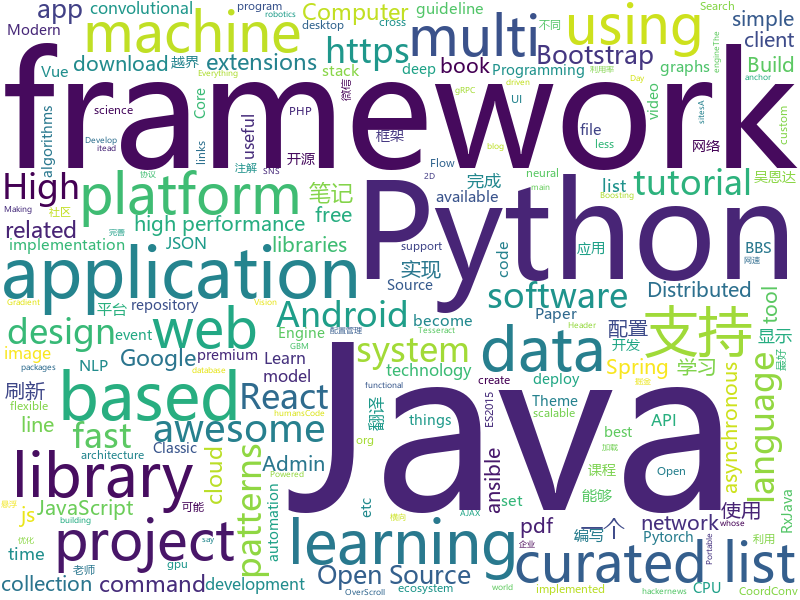

# 2018-07-15
See what the GitHub community is most excited about today.

## python
* [system-design-primer](https://github.com/donnemartin/system-design-primer)(**1,965 stars today**): Learn how to design large-scale systems. Prep for the system design interview. Includes Anki flashcards.
* [cheat.sh](https://github.com/chubin/cheat.sh)(**471 stars today**): the only cheat sheet you need
* [xar](https://github.com/facebookincubator/xar)(**304 stars today**): executable archive format
* [termtosvg](https://github.com/nbedos/termtosvg)(**57 stars today**): Record terminal sessions as SVG animations
* [models](https://github.com/tensorflow/models)(**42 stars today**): Models and examples built with TensorFlow
* [compare_gan](https://github.com/google/compare_gan)(**49 stars today**): 
* [PythonRobotics](https://github.com/AtsushiSakai/PythonRobotics)(**34 stars today**): Python sample codes for robotics algorithms.
* [CoordConv-pytorch](https://github.com/mkocabas/CoordConv-pytorch)(**34 stars today**): Pytorch implementation of CoordConv introduced in 'An intriguing failing of convolutional neural networks and the CoordConv solution' paper. (https://arxiv.org/pdf/1807.03247.pdf)
* [flask](https://github.com/pallets/flask)(**30 stars today**): The Python micro framework for building web applications.
* [awesome-python](https://github.com/vinta/awesome-python)(**29 stars today**): A curated list of awesome Python frameworks, libraries, software and resources
* [learn-python3](https://github.com/jerry-git/learn-python3)(**30 stars today**): Jupyter notebooks for teaching/learning Python 3
* [keras](https://github.com/keras-team/keras)(**25 stars today**): Deep Learning for humans
* [glow](https://github.com/openai/glow)(**28 stars today**): Code for reproducing results in "Glow: Generative Flow with Invertible 1x1 Convolutions"
* [public-apis](https://github.com/toddmotto/public-apis)(**25 stars today**): A collective list of public JSON APIs for use in web development.
* [pandas](https://github.com/pandas-dev/pandas)(**21 stars today**): Flexible and powerful data analysis / manipulation library for Python, providing labeled data structures similar to R data.frame objects, statistical functions, and much more
* [youtube-dl](https://github.com/rg3/youtube-dl)(**24 stars today**): Command-line program to download videos from YouTube.com and other video sites
* [scikit-learn](https://github.com/scikit-learn/scikit-learn)(**16 stars today**): scikit-learn: machine learning in Python
* [face_recognition](https://github.com/ageitgey/face_recognition)(**21 stars today**): The world's simplest facial recognition api for Python and the command line
* [django](https://github.com/django/django)(**19 stars today**): The Web framework for perfectionists with deadlines.
* [ansible](https://github.com/ansible/ansible)(**15 stars today**): Ansible is a radically simple IT automation platform that makes your applications and systems easier to deploy. Avoid writing scripts or custom code to deploy and update your applications — automate in a language that approaches plain English, using SSH, with no agents to install on remote systems. https://docs.ansible.com/ansible/
* [darts](https://github.com/quark0/darts)(**20 stars today**): Differentiable architecture search for convolutional and recurrent networks
* [pipenv](https://github.com/pypa/pipenv)(**20 stars today**): Python Development Workflow for Humans.
* [localstack](https://github.com/localstack/localstack)(**20 stars today**): 💻A fully functional local AWS cloud stack. Develop and test your cloud apps offline!
* [vibora](https://github.com/vibora-io/vibora)(**19 stars today**): Fast, asynchronous and elegant Python web framework.
* [httpie](https://github.com/jakubroztocil/httpie)(****): Modern command line HTTP client – user-friendly curl alternative with intuitive UI, JSON support, syntax highlighting, wget-like downloads, extensions, etc. https://httpie.org

## java
* [jib](https://github.com/GoogleContainerTools/jib)(**80 stars today**): ⛵️Build container images for your Java applications.
* [Java-Interview](https://github.com/crossoverJie/Java-Interview)(**43 stars today**): 👨‍🎓Java related : basic, concurrent, algorithm
* [java-design-patterns](https://github.com/iluwatar/java-design-patterns)(**35 stars today**): Design patterns implemented in Java
* [proxyee-down](https://github.com/proxyee-down-org/proxyee-down)(**33 stars today**): http下载工具，基于http代理，支持多连接分块下载
* [elasticsearch](https://github.com/elastic/elasticsearch)(**25 stars today**): Open Source, Distributed, RESTful Search Engine
* [spring-boot](https://github.com/spring-projects/spring-boot)(**20 stars today**): Spring Boot
* [Java](https://github.com/TheAlgorithms/Java)(**16 stars today**): All Algorithms implemented in Java
* [okhttp](https://github.com/square/okhttp)(**19 stars today**): An HTTP+HTTP/2 client for Android and Java applications.
* [interviews](https://github.com/kdn251/interviews)(**17 stars today**): Everything you need to know to get the job.
* [guava](https://github.com/google/guava)(**19 stars today**): Google core libraries for Java
* [weixin-java-tools](https://github.com/Wechat-Group/weixin-java-tools)(**17 stars today**): 可能是目前最好最全的微信Java开发工具包，支持包括微信支付、开放平台、小程序、企业号和公众号等的开发
* [RxJava](https://github.com/ReactiveX/RxJava)(**17 stars today**): RxJava – Reactive Extensions for the JVM – a library for composing asynchronous and event-based programs using observable sequences for the Java VM.
* [spring-framework](https://github.com/spring-projects/spring-framework)(**12 stars today**): Spring Framework
* [retrofit](https://github.com/square/retrofit)(**14 stars today**): Type-safe HTTP client for Android and Java by Square, Inc.
* [incubator-dubbo](https://github.com/apache/incubator-dubbo)(**12 stars today**): Apache Dubbo (incubating) is a high-performance, java based, open source RPC framework.
* [tutorials](https://github.com/eugenp/tutorials)(**10 stars today**): The "REST With Spring" Course:
* [glide](https://github.com/bumptech/glide)(**14 stars today**): An image loading and caching library for Android focused on smooth scrolling
* [apollo](https://github.com/ctripcorp/apollo)(**13 stars today**): Apollo（阿波罗）是携程框架部门研发的分布式配置中心，能够集中化管理应用不同环境、不同集群的配置，配置修改后能够实时推送到应用端，并且具备规范的权限、流程治理等特性，适用于微服务配置管理场景。
* [SmartRefreshLayout](https://github.com/scwang90/SmartRefreshLayout)(**12 stars today**): 🔥下拉刷新、上拉加载、二级刷新、淘宝二楼、RefreshLayout、OverScroll，Android智能下拉刷新框架，支持越界回弹、越界拖动，具有极强的扩展性，集成了几十种炫酷的Header和 Footer。
* [coco](https://github.com/Confidence-coin/coco)(**10 stars today**): The fastest crypto online
* [TimetableView](https://github.com/zfman/TimetableView)(**12 stars today**): 一个开源的、完善的、简洁的课程表控件
* [symphony](https://github.com/b3log/symphony)(**12 stars today**): 🎶A modern community (forum/BBS/SNS/blog) platform written in Java. 一个用 Java 实现的现代化社区（论坛/BBS/社交网络/博客）平台。
* [netty](https://github.com/netty/netty)(**10 stars today**): Netty project - an event-driven asynchronous network application framework
* [S-MVP](https://github.com/UCodeUStory/S-MVP)(**10 stars today**): 🔥🔥优化版MVP,使用注解泛型简化代码编写，使用模块化协议方便维护，APT过程使用注解解析器利用JavaPoet🌝完成重复模块的编写，利用ASpect+GradlePlugin 完成横向AOP编程+Javassist动态字节码注入+Tinker实现热修复+Retrofit实现优雅网络操作+RxJava轻松玩转数据处理
* [selenium](https://github.com/SeleniumHQ/selenium)(**10 stars today**): A browser automation framework and ecosystem.

## unknown
* [react-developer-roadmap](https://github.com/adam-golab/react-developer-roadmap)(**229 stars today**): Roadmap to becoming a React developer in 2018
* [toml](https://github.com/toml-lang/toml)(**136 stars today**): Tom's Obvious, Minimal Language
* [free-programming-books](https://github.com/EbookFoundation/free-programming-books)(**84 stars today**): 📚Freely available programming books
* [Interview-Notebook](https://github.com/CyC2018/Interview-Notebook)(**65 stars today**): 📆准备秋招学习笔记
* [vue-patterns](https://github.com/learn-vuejs/vue-patterns)(**60 stars today**): Useful Vue patterns, techniques, tips and tricks and helpful curated links.
* [awesome](https://github.com/sindresorhus/awesome)(**47 stars today**): 😎Curated list of awesome lists
* [You-Dont-Know-JS](https://github.com/getify/You-Dont-Know-JS)(**43 stars today**): A book series on JavaScript. @YDKJS on twitter.
* [gitignore](https://github.com/github/gitignore)(**34 stars today**): A collection of useful .gitignore templates
* [build-your-own-x](https://github.com/danistefanovic/build-your-own-x)(**42 stars today**): 🤓Build your own (insert technology here)
* [iBooks](https://github.com/woooowen/iBooks)(**42 stars today**): 计算机图书,java,mysql,架构类,web
* [React-Redux-Styleguide](https://github.com/iraycd/React-Redux-Styleguide)(**40 stars today**): This is a working set of guidelines for developing React applications. We say "guideline" because there are no hard-and-fast rules; best practices, patterns and technology change over time, so we consider this a living set of style guides.
* [coding-interview-university](https://github.com/jwasham/coding-interview-university)(**31 stars today**): A complete computer science study plan to become a software engineer.
* [project-based-learning](https://github.com/tuvtran/project-based-learning)(**28 stars today**): Curated list of project-based tutorials
* [computer-science](https://github.com/ossu/computer-science)(**28 stars today**): 🎓Path to a free self-taught education in Computer Science!
* [NLP-progress](https://github.com/sebastianruder/NLP-progress)(**25 stars today**): Repository to track the progress in Natural Language Processing (NLP), including the datasets and the current state-of-the-art for the most common NLP tasks.
* [awesome-vue](https://github.com/vuejs/awesome-vue)(**23 stars today**): 🎉A curated list of awesome things related to Vue.js
* [PHP-Interview-Best-Practices-in-China](https://github.com/eaglewu/PHP-Interview-Best-Practices-in-China)(**23 stars today**): 📙PHP 面试知识点汇总
* [awesome-design-patterns](https://github.com/DovAmir/awesome-design-patterns)(**22 stars today**): A curated list of software and architecture related design patterns.
* [MCW](https://github.com/Microsoft/MCW)(**20 stars today**): Microsoft Cloud Workshop Project
* [awesome-nodejs](https://github.com/sindresorhus/awesome-nodejs)(**16 stars today**): ⚡️Delightful Node.js packages and resources
* [awesome-flutter](https://github.com/Solido/awesome-flutter)(**14 stars today**): An awesome list that curates the best Flutter libraries, tools, tutorials, articles and more.
* [Machine-Learning-Yearning-Korean-Translation](https://github.com/deep-diver/Machine-Learning-Yearning-Korean-Translation)(**16 stars today**): Korean translation of machine learning yearning book by Andrew Ng.
* [gold-miner](https://github.com/xitu/gold-miner)(**15 stars today**): 🥇掘金翻译计划，可能是世界最大最好的英译中技术社区，最懂读者和译者的翻译平台：
* [awesome-scalability](https://github.com/binhnguyennus/awesome-scalability)(**14 stars today**): High Scalability, High Availability, High Stability, High Performance, and High Intelligence Back-End Design Patterns
* [awesome-react](https://github.com/enaqx/awesome-react)(**14 stars today**): A collection of awesome things regarding React ecosystem.

## c++
* [tensorflow](https://github.com/tensorflow/tensorflow)(**70 stars today**): Computation using data flow graphs for scalable machine learning
* [electron](https://github.com/electron/electron)(**28 stars today**): Build cross platform desktop apps with JavaScript, HTML, and CSS
* [opencv](https://github.com/opencv/opencv)(**19 stars today**): Open Source Computer Vision Library
* [TrafficMonitor](https://github.com/zhongyang219/TrafficMonitor)(**22 stars today**): 这是一个用于显示当前网速、CPU及内存利用率的桌面悬浮窗软件，并支持任务栏显示，支持更换皮肤。
* [tesseract](https://github.com/tesseract-ocr/tesseract)(**23 stars today**): Tesseract Open Source OCR Engine (main repository)
* [bitcoin](https://github.com/bitcoin/bitcoin)(**15 stars today**): Bitcoin Core integration/staging tree
* [pytorch](https://github.com/pytorch/pytorch)(**16 stars today**): Tensors and Dynamic neural networks in Python with strong GPU acceleration
* [protobuf](https://github.com/google/protobuf)(**15 stars today**): Protocol Buffers - Google's data interchange format
* [apollo](https://github.com/ApolloAuto/apollo)(**15 stars today**): An open autonomous driving platform
* [tvm](https://github.com/dmlc/tvm)(**13 stars today**): Open deep learning compiler stack for cpu, gpu and specialized accelerators
* [openpose](https://github.com/CMU-Perceptual-Computing-Lab/openpose)(**14 stars today**): OpenPose: Real-time multi-person keypoint detection library for body, face, and hands estimation
* [dxvk](https://github.com/doitsujin/dxvk)(**13 stars today**): Vulkan-based D3D11 implementation for Linux / Wine
* [grpc](https://github.com/grpc/grpc)(**12 stars today**): The C based gRPC (C++, Python, Ruby, Objective-C, PHP, C#)
* [aria2](https://github.com/aria2/aria2)(**12 stars today**): aria2 is a lightweight multi-protocol & multi-source, cross platform download utility operated in command-line. It supports HTTP/HTTPS, FTP, SFTP, BitTorrent and Metalink.
* [xgboost](https://github.com/dmlc/xgboost)(**10 stars today**): Scalable, Portable and Distributed Gradient Boosting (GBDT, GBRT or GBM) Library, for Python, R, Java, Scala, C++ and more. Runs on single machine, Hadoop, Spark, Flink and DataFlow
* [swift](https://github.com/apple/swift)(**12 stars today**): The Swift Programming Language
* [caffe](https://github.com/BVLC/caffe)(**9 stars today**): Caffe: a fast open framework for deep learning.
* [godot](https://github.com/godotengine/godot)(**10 stars today**): Godot Engine – Multi-platform 2D and 3D game engine
* [v8](https://github.com/v8/v8)(**9 stars today**): The official mirror of the V8 Git repository
* [aspia](https://github.com/dchapyshev/aspia)(**10 stars today**): Remote desktop and file transfer tool.
* [horovod](https://github.com/uber/horovod)(**9 stars today**): Distributed training framework for TensorFlow, Keras, and PyTorch.
* [Sonoff-Tasmota](https://github.com/arendst/Sonoff-Tasmota)(**9 stars today**): Provide ESP8266 based itead Sonoff with Web, MQTT and OTA firmware using Arduino IDE or PlatformIO
* [Classic-Start](https://github.com/passionate-coder/Classic-Start)(**9 stars today**): Reborn of Classic Shell (Ivo Beltchev) - Classic Start (passionate-coder)
* [slambook](https://github.com/gaoxiang12/slambook)(**7 stars today**): 
* [arangodb](https://github.com/arangodb/arangodb)(**8 stars today**): 🥑ArangoDB is a native multi-model database with flexible data models for documents, graphs, and key-values. Build high performance applications using a convenient SQL-like query language or JavaScript extensions.

## html
* [pdfs](https://github.com/tpn/pdfs)(**194 stars today**): Technically-oriented PDF Collection (Papers, Specs, Decks, Manuals, etc)
* [Coursera-ML-AndrewNg-Notes](https://github.com/fengdu78/Coursera-ML-AndrewNg-Notes)(**17 stars today**): 吴恩达老师的机器学习课程个人笔记
* [itty-bitty](https://github.com/alcor/itty-bitty)(**20 stars today**): Itty.bitty is a tool to create links that contain small sites
* [react-from-zero](https://github.com/kay-is/react-from-zero)(**17 stars today**): A simple (99% ES2015 less) tutorial for React
* [Winds](https://github.com/GetStream/Winds)(**15 stars today**): A Beautiful Open Source RSS & Podcast App Powered by Getstream.Io
* [top-hat](https://github.com/ThemesGuide/top-hat)(**14 stars today**): Tophat Themes - Give Bootstrap a custom, stylish look🎩
* [foml](https://github.com/bloomberg/foml)(**12 stars today**): Foundations of Machine Learning
* [JavaScript30](https://github.com/wesbos/JavaScript30)(**8 stars today**): 30 Day Vanilla JS Challenge
* [AdminLTE](https://github.com/almasaeed2010/AdminLTE)(**9 stars today**): AdminLTE - Free Premium Admin control Panel Theme Based On Bootstrap 3.x
* [react-from-zero](https://github.com/lex111/react-from-zero)(**11 stars today**): A simple (99% ES2015 less) tutorial for React
* [gentelella](https://github.com/puikinsh/gentelella)(**10 stars today**): Free Bootstrap 3 Admin Template
* [hoverboard](https://github.com/gdg-x/hoverboard)(**9 stars today**): GDG DevFest website template
* [portainer](https://github.com/portainer/portainer)(**10 stars today**): Simple management UI for Docker
* [hacker-job-trends](https://github.com/timqian/hacker-job-trends)(**9 stars today**): Play with hackernews' "who is hiring"
* [awesome-mac](https://github.com/jaywcjlove/awesome-mac)(**9 stars today**):  Now we have become very big, Different from the original idea. Collect premium software in various categories.
* [deeplearning_ai_books](https://github.com/fengdu78/deeplearning_ai_books)(**8 stars today**): deeplearning.ai（吴恩达老师的深度学习课程笔记及资源）
* [Spoon-Knife](https://github.com/octocat/Spoon-Knife)(****): This repo is for demonstration purposes only.
* [react-app-rewired](https://github.com/timarney/react-app-rewired)(**8 stars today**): Override create-react-app webpack configs without ejecting
* [coreui-free-bootstrap-admin-template](https://github.com/coreui/coreui-free-bootstrap-admin-template)(**8 stars today**): CoreUI is free bootstrap admin template
* [fastText](https://github.com/facebookresearch/fastText)(**7 stars today**): Library for fast text representation and classification.
* [fonts](https://github.com/google/fonts)(**6 stars today**): Font files available from Google Fonts
* [now-github-starter](https://github.com/zeit/now-github-starter)(****): Starter project to demonstrate a project whose pull requests get automatically deployed
* [favorites-web](https://github.com/cloudfavorites/favorites-web)(**5 stars today**): 云收藏 Spring Boot 2.0 开源项目
* [intercooler-js](https://github.com/LeadDyno/intercooler-js)(**5 stars today**): Making AJAX as easy as anchor tags
* [sass-loader](https://github.com/webpack-contrib/sass-loader)(**5 stars today**): Compiles Sass to CSS

## WordCloud

