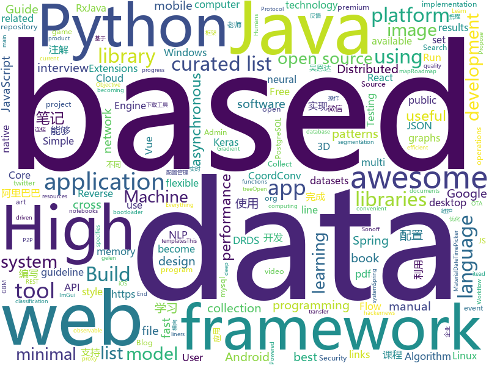

# 2018-07-16
See what the GitHub community is most excited about today.

## python
* [system-design-primer](https://github.com/donnemartin/system-design-primer)(**870 stars today**): Learn how to design large-scale systems. Prep for the system design interview. Includes Anki flashcards.
* [cheat.sh](https://github.com/chubin/cheat.sh)(**373 stars today**): the only cheat sheet you need
* [learn-python3](https://github.com/jerry-git/learn-python3)(**166 stars today**): Jupyter notebooks for teaching/learning Python 3
* [xar](https://github.com/facebookincubator/xar)(**146 stars today**): executable archive format
* [compare_gan](https://github.com/google/compare_gan)(**90 stars today**): 
* [CoordConv-pytorch](https://github.com/mkocabas/CoordConv-pytorch)(**66 stars today**): Pytorch implementation of CoordConv introduced in 'An intriguing failing of convolutional neural networks and the CoordConv solution' paper. (https://arxiv.org/pdf/1807.03247.pdf)
* [models](https://github.com/tensorflow/models)(**43 stars today**): Models and examples built with TensorFlow
* [Hamburglar](https://github.com/needmorecowbell/Hamburglar)(**49 stars today**): Hamburglar -- collect useful information from directories and files
* [public-apis](https://github.com/toddmotto/public-apis)(**39 stars today**): A collective list of public JSON APIs for use in web development.
* [pointSIFT](https://github.com/MVIG-SJTU/pointSIFT)(**34 stars today**): a module for 3D semantic segmentation in point clouds.
* [glow](https://github.com/openai/glow)(**34 stars today**): Code for reproducing results in "Glow: Generative Flow with Invertible 1x1 Convolutions"
* [cc.py](https://github.com/si9int/cc.py)(**35 stars today**): Extracting URLs of a specific target based on the results of "commoncrawl.org"
* [EagleEye](https://github.com/ThoughtfulDev/EagleEye)(**30 stars today**): Stalk your Friends. Find their Instagram, FB and Twitter Profiles using Image Recognition and Reverse Image Search.
* [termtosvg](https://github.com/nbedos/termtosvg)(**31 stars today**): Record terminal sessions as SVG animations
* [umap](https://github.com/lmcinnes/umap)(**30 stars today**): Uniform Manifold Approximation and Projection
* [keras](https://github.com/keras-team/keras)(**24 stars today**): Deep Learning for humans
* [youtube-dl](https://github.com/rg3/youtube-dl)(**27 stars today**): Command-line program to download videos from YouTube.com and other video sites
* [cpython](https://github.com/python/cpython)(**19 stars today**): The Python programming language
* [django](https://github.com/django/django)(**23 stars today**): The Web framework for perfectionists with deadlines.
* [flask](https://github.com/pallets/flask)(**22 stars today**): The Python micro framework for building web applications.
* [XX-Net](https://github.com/XX-net/XX-Net)(**22 stars today**): a web proxy tool
* [awesome-machine-learning](https://github.com/josephmisiti/awesome-machine-learning)(**20 stars today**): A curated list of awesome Machine Learning frameworks, libraries and software.
* [vibora](https://github.com/vibora-io/vibora)(**20 stars today**): Fast, asynchronous and elegant Python web framework.
* [pandas](https://github.com/pandas-dev/pandas)(**16 stars today**): Flexible and powerful data analysis / manipulation library for Python, providing labeled data structures similar to R data.frame objects, statistical functions, and much more
* [pipenv](https://github.com/pypa/pipenv)(**19 stars today**): Python Development Workflow for Humans.

## java
* [jib](https://github.com/GoogleContainerTools/jib)(**102 stars today**): ⛵️Build container images for your Java applications.
* [Java-Interview](https://github.com/crossoverJie/Java-Interview)(**64 stars today**): 👨‍🎓Java related : basic, concurrent, algorithm
* [S-MVP](https://github.com/UCodeUStory/S-MVP)(**56 stars today**): 🔥🔥优化版MVP,使用注解泛型简化代码编写，使用模块化协议方便维护，APT过程使用注解解析器利用JavaPoet🌝完成重复模块的编写，利用ASpect+GradlePlugin 完成横向AOP编程+Javassist动态字节码注入+Tinker实现热修复+Retrofit实现优雅网络操作+RxJava轻松玩转数据处理
* [proxyee-down](https://github.com/proxyee-down-org/proxyee-down)(**37 stars today**): http下载工具，基于http代理，支持多连接分块下载
* [spring-boot](https://github.com/spring-projects/spring-boot)(**26 stars today**): Spring Boot
* [zipkin](https://github.com/openzipkin/zipkin)(**27 stars today**): Zipkin is a distributed tracing system
* [spring-framework](https://github.com/spring-projects/spring-framework)(**19 stars today**): Spring Framework
* [elasticsearch](https://github.com/elastic/elasticsearch)(**20 stars today**): Open Source, Distributed, RESTful Search Engine
* [tutorials](https://github.com/eugenp/tutorials)(**13 stars today**): The "REST With Spring" Course:
* [interviews](https://github.com/kdn251/interviews)(**19 stars today**): Everything you need to know to get the job.
* [MaterialDateRangePicker](https://github.com/borax12/MaterialDateRangePicker)(**18 stars today**): A material Date Range Picker based on wdullaers MaterialDateTimePicker
* [weixin-java-tools](https://github.com/Wechat-Group/weixin-java-tools)(**16 stars today**): 可能是目前最好最全的微信Java开发工具包，支持包括微信支付、开放平台、小程序、企业号和公众号等的开发
* [incubator-dubbo](https://github.com/apache/incubator-dubbo)(**12 stars today**): Apache Dubbo (incubating) is a high-performance, java based, open source RPC framework.
* [guava](https://github.com/google/guava)(**14 stars today**): Google core libraries for Java
* [apollo](https://github.com/ctripcorp/apollo)(**13 stars today**): Apollo（阿波罗）是携程框架部门研发的分布式配置中心，能够集中化管理应用不同环境、不同集群的配置，配置修改后能够实时推送到应用端，并且具备规范的权限、流程治理等特性，适用于微服务配置管理场景。
* [RxJava](https://github.com/ReactiveX/RxJava)(**13 stars today**): RxJava – Reactive Extensions for the JVM – a library for composing asynchronous and event-based programs using observable sequences for the Java VM.
* [Java](https://github.com/TheAlgorithms/Java)(**12 stars today**): All Algorithms implemented in Java
* [elide](https://github.com/yahoo/elide)(**11 stars today**): Elide is a Java library that lets you stand up a GraphQL/JSON-API web service with minimal effort
* [VirtualXposed](https://github.com/android-hacker/VirtualXposed)(**12 stars today**): A simple app to use Xposed without root, unlock the bootloader or modify system image, etc.
* [selenium](https://github.com/SeleniumHQ/selenium)(**11 stars today**): A browser automation framework and ecosystem.
* [okhttp](https://github.com/square/okhttp)(**11 stars today**): An HTTP+HTTP/2 client for Android and Java applications.
* [SpringCloudLearning](https://github.com/forezp/SpringCloudLearning)(**9 stars today**): 《史上最简单的Spring Cloud教程源码》
* [canal](https://github.com/alibaba/canal)(**10 stars today**): 阿里巴巴mysql数据库binlog的增量订阅&消费组件 。阿里云DRDS( https://www.aliyun.com/product/drds )、阿里巴巴TDDL 二级索引、小表复制powerd by canal.
* [netty](https://github.com/netty/netty)(**9 stars today**): Netty project - an event-driven asynchronous network application framework
* [Dragonfly](https://github.com/alibaba/Dragonfly)(**10 stars today**): Dragonfly is an intelligent P2P based file distribution system.

## unknown
* [InterviewMap](https://github.com/KieSun/InterviewMap)(**390 stars today**): Build the best interview map
* [react-developer-roadmap](https://github.com/adam-golab/react-developer-roadmap)(**169 stars today**): Roadmap to becoming a React developer in 2018
* [Interview-Notebook](https://github.com/CyC2018/Interview-Notebook)(**75 stars today**): 📆准备秋招学习笔记
* [Command-line-guide](https://github.com/harrinp/Command-line-guide)(**61 stars today**): Guide to making your first command line app/game
* [free-programming-books](https://github.com/EbookFoundation/free-programming-books)(**49 stars today**): 📚Freely available programming books
* [awesome](https://github.com/sindresorhus/awesome)(**47 stars today**): 😎Curated list of awesome lists
* [coding-interview-university](https://github.com/jwasham/coding-interview-university)(**36 stars today**): A complete computer science study plan to become a software engineer.
* [gitignore](https://github.com/github/gitignore)(**29 stars today**): A collection of useful .gitignore templates
* [React-Redux-Styleguide](https://github.com/iraycd/React-Redux-Styleguide)(**40 stars today**): This is a working set of guidelines for developing React applications. We say "guideline" because there are no hard-and-fast rules; best practices, patterns and technology change over time, so we consider this a living set of style guides.
* [You-Dont-Know-JS](https://github.com/getify/You-Dont-Know-JS)(**38 stars today**): A book series on JavaScript. @YDKJS on twitter.
* [toml](https://github.com/toml-lang/toml)(**38 stars today**): Tom's Obvious, Minimal Language
* [build-your-own-x](https://github.com/danistefanovic/build-your-own-x)(**35 stars today**): 🤓Build your own (insert technology here)
* [awesome-ninja-admins](https://github.com/trimstray/awesome-ninja-admins)(**34 stars today**): 💫A collection of awesome lists, manuals, blogs, hacks, one-liners and tools for Awesome Ninja Admins.
* [project-based-learning](https://github.com/tuvtran/project-based-learning)(**28 stars today**): Curated list of project-based tutorials
* [NLP-progress](https://github.com/sebastianruder/NLP-progress)(**26 stars today**): Repository to track the progress in Natural Language Processing (NLP), including the datasets and the current state-of-the-art for the most common NLP tasks.
* [vue-patterns](https://github.com/learn-vuejs/vue-patterns)(**23 stars today**): Useful Vue patterns, techniques, tips and tricks and helpful curated links.
* [awesome-vue](https://github.com/vuejs/awesome-vue)(**22 stars today**): 🎉A curated list of awesome things related to Vue.js
* [awesome-public-datasets](https://github.com/awesomedata/awesome-public-datasets)(**17 stars today**): A topic-centric list of high-quality open datasets in public domains. Propose NEW data ☛☛☛PR☛☛☛
* [architect-awesome](https://github.com/xingshaocheng/architect-awesome)(**16 stars today**): 后端架构师技术图谱
* [awesome-scalability](https://github.com/binhnguyennus/awesome-scalability)(**15 stars today**): High Scalability, High Availability, High Stability, High Performance, and High Intelligence Back-End Design Patterns
* [iBooks](https://github.com/woooowen/iBooks)(**15 stars today**): 计算机图书,java,mysql,架构类,web
* [elasticsearch-sorular](https://github.com/hkulekci/elasticsearch-sorular)(**14 stars today**): Elasticsearch konusunda gelen sorular ve cevapları
* [awesome-flutter](https://github.com/Solido/awesome-flutter)(**12 stars today**): An awesome list that curates the best Flutter libraries, tools, tutorials, articles and more.
* [Compatibility](https://github.com/android-in-china/Compatibility)(**12 stars today**): 用于反馈和跟踪国内 Android 设备/ROM 兼容性问题的公益项目
* [Red-Teaming-Toolkit](https://github.com/infosecn1nja/Red-Teaming-Toolkit)(**10 stars today**): A collection of open source and commercial tools that aid in red team operations.

## c++
* [tensorflow](https://github.com/tensorflow/tensorflow)(**46 stars today**): Computation using data flow graphs for scalable machine learning
* [dll_to_exe](https://github.com/hasherezade/dll_to_exe)(**52 stars today**): Converts a DLL into EXE
* [bitcoin](https://github.com/bitcoin/bitcoin)(**24 stars today**): Bitcoin Core integration/staging tree
* [opencv](https://github.com/opencv/opencv)(**20 stars today**): Open Source Computer Vision Library
* [apollo](https://github.com/ApolloAuto/apollo)(**18 stars today**): An open autonomous driving platform
* [aseprite](https://github.com/aseprite/aseprite)(**20 stars today**): Animated sprite editor & pixel art tool (Windows, macOS, Linux)
* [tesseract](https://github.com/tesseract-ocr/tesseract)(**18 stars today**): Tesseract Open Source OCR Engine (main repository)
* [pytorch](https://github.com/pytorch/pytorch)(**13 stars today**): Tensors and Dynamic neural networks in Python with strong GPU acceleration
* [electron](https://github.com/electron/electron)(**14 stars today**): Build cross platform desktop apps with JavaScript, HTML, and CSS
* [horovod](https://github.com/uber/horovod)(**15 stars today**): Distributed training framework for TensorFlow, Keras, and PyTorch.
* [grpc](https://github.com/grpc/grpc)(**13 stars today**): The C based gRPC (C++, Python, Ruby, Objective-C, PHP, C#)
* [protobuf](https://github.com/google/protobuf)(**12 stars today**): Protocol Buffers - Google's data interchange format
* [googletest](https://github.com/google/googletest)(**12 stars today**): Google Test
* [arangodb](https://github.com/arangodb/arangodb)(**11 stars today**): 🥑ArangoDB is a native multi-model database with flexible data models for documents, graphs, and key-values. Build high performance applications using a convenient SQL-like query language or JavaScript extensions.
* [godot](https://github.com/godotengine/godot)(**11 stars today**): Godot Engine – Multi-platform 2D and 3D game engine
* [yuzu](https://github.com/yuzu-emu/yuzu)(**10 stars today**): Nintendo Switch Emulator
* [xgboost](https://github.com/dmlc/xgboost)(**9 stars today**): Scalable, Portable and Distributed Gradient Boosting (GBDT, GBRT or GBM) Library, for Python, R, Java, Scala, C++ and more. Runs on single machine, Hadoop, Spark, Flink and DataFlow
* [solidity](https://github.com/ethereum/solidity)(**9 stars today**): Solidity, the Contract-Oriented Programming Language
* [imgui](https://github.com/ocornut/imgui)(**9 stars today**): Dear ImGui: Bloat-free Immediate Mode Graphical User interface for C++ with minimal dependencies
* [Sonoff-Tasmota](https://github.com/arendst/Sonoff-Tasmota)(**8 stars today**): Provide ESP8266 based itead Sonoff with Web, MQTT and OTA firmware using Arduino IDE or PlatformIO
* [mace](https://github.com/XiaoMi/mace)(**9 stars today**): MACE is a deep learning inference framework optimized for mobile heterogeneous computing platforms.
* [dxvk](https://github.com/doitsujin/dxvk)(**9 stars today**): Vulkan-based D3D11 implementation for Linux / Wine
* [aspia](https://github.com/dchapyshev/aspia)(**9 stars today**): Remote desktop and file transfer tool.
* [pocket-tensor](https://github.com/GValiente/pocket-tensor)(**9 stars today**): Run Keras models from a C++ application on embedded devices
* [arrow](https://github.com/apache/arrow)(**8 stars today**): Apache Arrow is a cross-language development platform for in-memory data. It specifies a standardized language-independent columnar memory format for flat and hierarchical data, organized for efficient analytic operations on modern hardware. It also provides computational libraries and zero-copy streaming messaging and interprocess communication…

## html
* [aozorabunko](https://github.com/aozorabunko/aozorabunko)(**109 stars today**): 
* [Winds](https://github.com/GetStream/Winds)(**21 stars today**): A Beautiful Open Source RSS & Podcast App Powered by Getstream.Io
* [itty-bitty](https://github.com/alcor/itty-bitty)(**16 stars today**): Itty.bitty is a tool to create links that contain small sites
* [AdminLTE](https://github.com/almasaeed2010/AdminLTE)(**14 stars today**): AdminLTE - Free Premium Admin control Panel Theme Based On Bootstrap 3.x
* [Coursera-ML-AndrewNg-Notes](https://github.com/fengdu78/Coursera-ML-AndrewNg-Notes)(**13 stars today**): 吴恩达老师的机器学习课程个人笔记
* [pgdoc-cn](https://github.com/postgres-cn/pgdoc-cn)(**15 stars today**): PostgreSQL manual Chinese translation by China PostgreSQL Users Group
* [awesome-mac](https://github.com/jaywcjlove/awesome-mac)(**14 stars today**):  Now we have become very big, Different from the original idea. Collect premium software in various categories.
* [foml](https://github.com/bloomberg/foml)(**13 stars today**): Foundations of Machine Learning
* [JavaScript30](https://github.com/wesbos/JavaScript30)(**6 stars today**): 30 Day Vanilla JS Challenge
* [douyin](https://github.com/lujqme/douyin)(**10 stars today**): 抖音 桌面版(WIndows/Mac OS)
* [fastText](https://github.com/facebookresearch/fastText)(**9 stars today**): Library for fast text representation and classification.
* [capacitor](https://github.com/ionic-team/capacitor)(**8 stars today**): Build cross-platform Native Progressive Web Apps for iOS, Android, and the web⚡️
* [Spoon-Knife](https://github.com/octocat/Spoon-Knife)(****): This repo is for demonstration purposes only.
* [deeplearning_ai_books](https://github.com/fengdu78/deeplearning_ai_books)(**6 stars today**): deeplearning.ai（吴恩达老师的深度学习课程笔记及资源）
* [awesome-webpack](https://github.com/webpack-contrib/awesome-webpack)(**7 stars today**): A curated list of awesome Webpack resources, libraries and tools
* [node-interview](https://github.com/ElemeFE/node-interview)(**6 stars today**): How to pass the Node.js interview of ElemeFE.
* [fonts](https://github.com/google/fonts)(**6 stars today**): Font files available from Google Fonts
* [owasp-mstg](https://github.com/OWASP/owasp-mstg)(**5 stars today**): The Mobile Security Testing Guide (MSTG) is a comprehensive manual for mobile app security testing and reverse engineering.
* [hacker-job-trends](https://github.com/timqian/hacker-job-trends)(**5 stars today**): Play with hackernews' "who is hiring"
* [Switchable-Normalization](https://github.com/switchablenorms/Switchable-Normalization)(**5 stars today**): 
* [portainer](https://github.com/portainer/portainer)(**5 stars today**): Simple management UI for Docker
* [craftinginterpreters](https://github.com/munificent/craftinginterpreters)(**5 stars today**): Repository for the book "Crafting Interpreters"
* [github-markdown-css](https://github.com/sindresorhus/github-markdown-css)(****): The minimal amount of CSS to replicate the GitHub Markdown style
* [mzlogin.github.io](https://github.com/mzlogin/mzlogin.github.io)(****): 🙊My Blog / Jekyll Themes
* [mycroft-skills](https://github.com/MycroftAI/mycroft-skills)(****): A repository for sharing and collaboration for third-party Mycroft skills development.

## WordCloud

