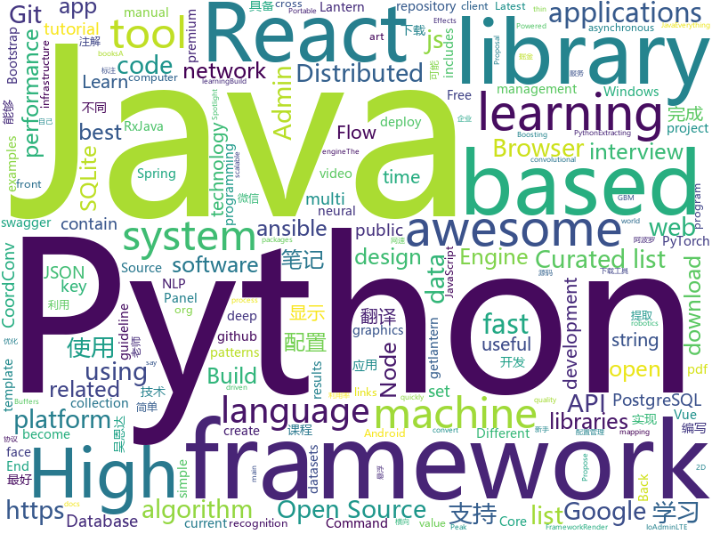

# 2018-07-17
See what the GitHub community is most excited about today.

## python
* [system-design-primer](https://github.com/donnemartin/system-design-primer)(**1,110 stars today**): Learn how to design large-scale systems. Prep for the system design interview. Includes Anki flashcards.
* [cheat.sh](https://github.com/chubin/cheat.sh)(**560 stars today**): the only cheat sheet you need
* [learn-python3](https://github.com/jerry-git/learn-python3)(**174 stars today**): Jupyter notebooks for teaching/learning Python 3
* [xar](https://github.com/facebookincubator/xar)(**144 stars today**): executable archive format
* [public-apis](https://github.com/toddmotto/public-apis)(**117 stars today**): A collective list of public JSON APIs for use in web development.
* [models](https://github.com/tensorflow/models)(**69 stars today**): Models and examples built with TensorFlow
* [compare_gan](https://github.com/google/compare_gan)(**83 stars today**): 
* [Python-100-Days](https://github.com/jackfrued/Python-100-Days)(**64 stars today**): Python - 100天从新手到大师
* [repo2docker](https://github.com/jupyter/repo2docker)(**59 stars today**): Turn git repositories into Jupyter enabled Docker Images
* [termtosvg](https://github.com/nbedos/termtosvg)(**61 stars today**): Record terminal sessions as SVG animations
* [face_recognition](https://github.com/ageitgey/face_recognition)(**53 stars today**): The world's simplest facial recognition api for Python and the command line
* [lagom](https://github.com/zuoxingdong/lagom)(**45 stars today**): lagom: A light PyTorch infrastructure to quickly prototype reinforcement learning algorithms.
* [nagini](https://github.com/marcoeilers/nagini)(**45 stars today**): Nagini is a static verifier for Python 3, based on the Viper verification infrastructure.
* [glow](https://github.com/openai/glow)(**42 stars today**): Code for reproducing results in "Glow: Generative Flow with Invertible 1x1 Convolutions"
* [vibora](https://github.com/vibora-io/vibora)(**39 stars today**): Fast, asynchronous and elegant Python web framework.
* [pipenv](https://github.com/pypa/pipenv)(**37 stars today**): Python Development Workflow for Humans.
* [keras](https://github.com/keras-team/keras)(**33 stars today**): Deep Learning for humans
* [CoordConv-pytorch](https://github.com/mkocabas/CoordConv-pytorch)(**39 stars today**): Pytorch implementation of CoordConv introduced in 'An intriguing failing of convolutional neural networks and the CoordConv solution' paper. (https://arxiv.org/pdf/1807.03247.pdf)
* [youtube-dl](https://github.com/rg3/youtube-dl)(**39 stars today**): Command-line program to download videos from YouTube.com and other video sites
* [django](https://github.com/django/django)(**29 stars today**): The Web framework for perfectionists with deadlines.
* [ansible](https://github.com/ansible/ansible)(**26 stars today**): Ansible is a radically simple IT automation platform that makes your applications and systems easier to deploy. Avoid writing scripts or custom code to deploy and update your applications — automate in a language that approaches plain English, using SSH, with no agents to install on remote systems. https://docs.ansible.com/ansible/
* [scikit-learn](https://github.com/scikit-learn/scikit-learn)(**29 stars today**): scikit-learn: machine learning in Python
* [cc.py](https://github.com/si9int/cc.py)(**33 stars today**): Extracting URLs of a specific target based on the results of "commoncrawl.org"
* [awesome-machine-learning](https://github.com/josephmisiti/awesome-machine-learning)(**28 stars today**): A curated list of awesome Machine Learning frameworks, libraries and software.
* [PythonRobotics](https://github.com/AtsushiSakai/PythonRobotics)(**29 stars today**): Python sample codes for robotics algorithms.

## java
* [jib](https://github.com/GoogleContainerTools/jib)(**220 stars today**): ⛵️Build container images for your Java applications.
* [S-MVP](https://github.com/UCodeUStory/S-MVP)(**138 stars today**): 🔥🔥优化版MVP,使用注解泛型简化代码编写，使用模块化协议方便维护，APT过程使用注解解析器利用JavaPoet🌝完成重复模块的编写，利用ASpect+GradlePlugin 完成横向AOP编程+Javassist动态字节码注入+Tinker实现热修复+Retrofit实现优雅网络操作+RxJava轻松玩转数据处理
* [Java-Interview](https://github.com/crossoverJie/Java-Interview)(**115 stars today**): 👨‍🎓Java related : basic, concurrent, algorithm
* [hmily](https://github.com/yu199195/hmily)(**59 stars today**): Distributed Transaction Middleware(try,confirm,cancel)
* [librec](https://github.com/guoguibing/librec)(**58 stars today**): LibRec: A Leading Java Library for Recommender Systems, see
* [spring-boot](https://github.com/spring-projects/spring-boot)(**37 stars today**): Spring Boot
* [SpringCloudLearning](https://github.com/forezp/SpringCloudLearning)(**39 stars today**): 《史上最简单的Spring Cloud教程源码》
* [weixin-java-tools](https://github.com/Wechat-Group/weixin-java-tools)(**37 stars today**): 可能是目前最好最全的微信Java开发工具包，支持包括微信支付、开放平台、小程序、企业号和公众号等的开发
* [ballerina-lang](https://github.com/ballerina-platform/ballerina-lang)(**43 stars today**): Ballerina is a compiled, transactional, statically and strongly typed programming language with textual and graphical syntaxes.
* [elasticsearch](https://github.com/elastic/elasticsearch)(**39 stars today**): Open Source, Distributed, RESTful Search Engine
* [proxyee-down](https://github.com/proxyee-down-org/proxyee-down)(**38 stars today**): http下载工具，基于http代理，支持多连接分块下载
* [tutorials](https://github.com/eugenp/tutorials)(**25 stars today**): The "REST With Spring" Course:
* [incubator-dubbo](https://github.com/apache/incubator-dubbo)(**27 stars today**): Apache Dubbo (incubating) is a high-performance, java based, open source RPC framework.
* [guava](https://github.com/google/guava)(**31 stars today**): Google core libraries for Java
* [interviews](https://github.com/kdn251/interviews)(**32 stars today**): Everything you need to know to get the job.
* [apollo](https://github.com/ctripcorp/apollo)(**25 stars today**): Apollo（阿波罗）是携程框架部门研发的分布式配置中心，能够集中化管理应用不同环境、不同集群的配置，配置修改后能够实时推送到应用端，并且具备规范的权限、流程治理等特性，适用于微服务配置管理场景。
* [Java](https://github.com/TheAlgorithms/Java)(**25 stars today**): All Algorithms implemented in Java
* [zipkin](https://github.com/openzipkin/zipkin)(**26 stars today**): Zipkin is a distributed tracing system
* [MaterialDateRangePicker](https://github.com/borax12/MaterialDateRangePicker)(**27 stars today**): A material Date Range Picker based on wdullaers MaterialDateTimePicker
* [spring-framework](https://github.com/spring-projects/spring-framework)(**17 stars today**): Spring Framework
* [lottie-android](https://github.com/airbnb/lottie-android)(**22 stars today**): Render After Effects animations natively on Android and iOS, Web, and React Native
* [FirUpdater](https://github.com/sfsheng0322/FirUpdater)(**26 stars today**): Fir.im通道APK更新器，使用简单，让自己的demo快速具备升级功能
* [RxJava](https://github.com/ReactiveX/RxJava)(**25 stars today**): RxJava – Reactive Extensions for the JVM – a library for composing asynchronous and event-based programs using observable sequences for the Java VM.
* [okhttp](https://github.com/square/okhttp)(**22 stars today**): An HTTP+HTTP/2 client for Android and Java applications.
* [HanLP](https://github.com/hankcs/HanLP)(**19 stars today**): 自然语言处理 中文分词 词性标注 命名实体识别 依存句法分析 关键词提取 新词发现 短语提取 自动摘要 文本分类 拼音简繁

## unknown
* [InterviewMap](https://github.com/KieSun/InterviewMap)(**1,387 stars today**): Build the best interview map. The current content includes JS, network, browser related, performance optimization, security, framework, Git, data structure, algorithm, etc.
* [react-developer-roadmap](https://github.com/adam-golab/react-developer-roadmap)(**270 stars today**): Roadmap to becoming a React developer in 2018
* [Interview-Notebook](https://github.com/CyC2018/Interview-Notebook)(**196 stars today**): 📆准备秋招学习笔记
* [awesome](https://github.com/sindresorhus/awesome)(**69 stars today**): 😎Curated list of awesome lists
* [You-Dont-Know-JS](https://github.com/getify/You-Dont-Know-JS)(**65 stars today**): A book series on JavaScript. @YDKJS on twitter.
* [architect-awesome](https://github.com/xingshaocheng/architect-awesome)(**48 stars today**): 后端架构师技术图谱
* [React-Redux-Styleguide](https://github.com/iraycd/React-Redux-Styleguide)(**61 stars today**): This is a working set of guidelines for developing React applications. We say "guideline" because there are no hard-and-fast rules; best practices, patterns and technology change over time, so we consider this a living set of style guides.
* [free-programming-books](https://github.com/EbookFoundation/free-programming-books)(**53 stars today**): 📚Freely available programming books
* [gitignore](https://github.com/github/gitignore)(**39 stars today**): A collection of useful .gitignore templates
* [awesome-vue](https://github.com/vuejs/awesome-vue)(**46 stars today**): 🎉A curated list of awesome things related to Vue.js
* [build-your-own-x](https://github.com/danistefanovic/build-your-own-x)(**45 stars today**): 🤓Build your own (insert technology here)
* [NLP-progress](https://github.com/sebastianruder/NLP-progress)(**42 stars today**): Repository to track the progress in Natural Language Processing (NLP), including the datasets and the current state-of-the-art for the most common NLP tasks.
* [project-based-learning](https://github.com/tuvtran/project-based-learning)(**38 stars today**): Curated list of project-based tutorials
* [awesome-scalability](https://github.com/binhnguyennus/awesome-scalability)(**42 stars today**): High Scalability, High Availability, High Stability, High Performance, and High Intelligence Back-End Design Patterns
* [coding-interview-university](https://github.com/jwasham/coding-interview-university)(**31 stars today**): A complete computer science study plan to become a software engineer.
* [vue-patterns](https://github.com/learn-vuejs/vue-patterns)(**30 stars today**): Useful Vue patterns, techniques, tips and tricks and helpful curated links.
* [gold-miner](https://github.com/xitu/gold-miner)(**25 stars today**): 🥇掘金翻译计划，可能是世界最大最好的英译中技术社区，最懂读者和译者的翻译平台：
* [react-roadmap](https://github.com/SangKa/react-roadmap)(**25 stars today**): React 学习路线图 - 2018 版
* [awesome-flutter](https://github.com/Solido/awesome-flutter)(**24 stars today**): An awesome list that curates the best Flutter libraries, tools, tutorials, articles and more.
* [PRM](https://github.com/ZhouYanzhao/PRM)(**25 stars today**): Weakly Supervised Instance Segmentation using Class Peak Response, in CVPR 2018 (Spotlight)
* [awesome-ninja-admins](https://github.com/trimstray/awesome-ninja-admins)(**22 stars today**): 💫A collection of awesome lists, manuals, blogs, hacks, one-liners and tools for Awesome Ninja Admins.
* [toml](https://github.com/toml-lang/toml)(**22 stars today**): Tom's Obvious, Minimal Language
* [download](https://github.com/getlantern/download)(**22 stars today**): 🔴蓝灯最新版本下载 https://github.com/getlantern/download🔴Lantern Latest Download https://github.com/getlantern/lantern/releases/tag/latest🔴
* [awesome-nodejs](https://github.com/sindresorhus/awesome-nodejs)(**20 stars today**): ⚡️Delightful Node.js packages and resources
* [awesome-public-datasets](https://github.com/awesomedata/awesome-public-datasets)(**18 stars today**): A topic-centric list of high-quality open datasets in public domains. Propose NEW data ☛☛☛PR☛☛☛

## c++
* [tensorflow](https://github.com/tensorflow/tensorflow)(**97 stars today**): Computation using data flow graphs for scalable machine learning
* [electron](https://github.com/electron/electron)(**47 stars today**): Build cross platform desktop apps with JavaScript, HTML, and CSS
* [bitcoin](https://github.com/bitcoin/bitcoin)(**36 stars today**): Bitcoin Core integration/staging tree
* [dll_to_exe](https://github.com/hasherezade/dll_to_exe)(**38 stars today**): Converts a DLL into EXE
* [opencv](https://github.com/opencv/opencv)(**29 stars today**): Open Source Computer Vision Library
* [protobuf](https://github.com/google/protobuf)(**34 stars today**): Protocol Buffers - Google's data interchange format
* [aseprite](https://github.com/aseprite/aseprite)(**33 stars today**): Animated sprite editor & pixel art tool (Windows, macOS, Linux)
* [pytorch](https://github.com/pytorch/pytorch)(**31 stars today**): Tensors and Dynamic neural networks in Python with strong GPU acceleration
* [tesseract](https://github.com/tesseract-ocr/tesseract)(**30 stars today**): Tesseract Open Source OCR Engine (main repository)
* [apollo](https://github.com/ApolloAuto/apollo)(**22 stars today**): An open autonomous driving platform
* [openpose](https://github.com/CMU-Perceptual-Computing-Lab/openpose)(**24 stars today**): OpenPose: Real-time multi-person keypoint detection library for body, face, and hands estimation
* [TrafficMonitor](https://github.com/zhongyang219/TrafficMonitor)(**27 stars today**): 这是一个用于显示当前网速、CPU及内存利用率的桌面悬浮窗软件，并支持任务栏显示，支持更换皮肤。
* [yuzu](https://github.com/yuzu-emu/yuzu)(**26 stars today**): Nintendo Switch Emulator
* [LLGL](https://github.com/LukasBanana/LLGL)(**25 stars today**): Low Level Graphics Library (LLGL) is a thin abstraction layer for the modern graphics APIs OpenGL, Direct3D, Vulkan, and Metal
* [xgboost](https://github.com/dmlc/xgboost)(**19 stars today**): Scalable, Portable and Distributed Gradient Boosting (GBDT, GBRT or GBM) Library, for Python, R, Java, Scala, C++ and more. Runs on single machine, Hadoop, Spark, Flink and DataFlow
* [godot](https://github.com/godotengine/godot)(**22 stars today**): Godot Engine – Multi-platform 2D and 3D game engine
* [v8](https://github.com/v8/v8)(**18 stars today**): The official mirror of the V8 Git repository
* [caffe](https://github.com/BVLC/caffe)(**13 stars today**): Caffe: a fast open framework for deep learning.
* [rpcs3](https://github.com/RPCS3/rpcs3)(**16 stars today**): PS3 emulator/debugger
* [sqlitebrowser](https://github.com/sqlitebrowser/sqlitebrowser)(**14 stars today**): Official home of the DB Browser for SQLite (DB4S) project. Previously known as "SQLite Database Browser" and "Database Browser for SQLite". Website at:
* [horovod](https://github.com/uber/horovod)(**14 stars today**): Distributed training framework for TensorFlow, Keras, and PyTorch.
* [RedisDesktopManager](https://github.com/uglide/RedisDesktopManager)(**14 stars today**): 🔧Cross-platform GUI management tool for Redis
* [envoy](https://github.com/envoyproxy/envoy)(**13 stars today**): C++ front/service proxy
* [leveldb](https://github.com/google/leveldb)(**12 stars today**): LevelDB is a fast key-value storage library written at Google that provides an ordered mapping from string keys to string values.
* [googletest](https://github.com/google/googletest)(**12 stars today**): Google Test

## html
* [Winds](https://github.com/GetStream/Winds)(**101 stars today**): A Beautiful Open Source RSS & Podcast App Powered by Getstream.Io
* [aozorabunko](https://github.com/aozorabunko/aozorabunko)(**34 stars today**): 
* [AdminLTE](https://github.com/almasaeed2010/AdminLTE)(**22 stars today**): AdminLTE - Free Premium Admin control Panel Theme Based On Bootstrap 3.x
* [itty-bitty](https://github.com/alcor/itty-bitty)(**25 stars today**): Itty.bitty is a tool to create links that contain small sites
* [Coursera-ML-AndrewNg-Notes](https://github.com/fengdu78/Coursera-ML-AndrewNg-Notes)(**20 stars today**): 吴恩达老师的机器学习课程个人笔记
* [foml](https://github.com/bloomberg/foml)(**21 stars today**): Foundations of Machine Learning
* [Spoon-Knife](https://github.com/octocat/Spoon-Knife)(****): This repo is for demonstration purposes only.
* [react-from-zero](https://github.com/kay-is/react-from-zero)(**19 stars today**): A simple (99% ES2015 less) tutorial for React
* [awesome-mac](https://github.com/jaywcjlove/awesome-mac)(**17 stars today**):  Now we have become very big, Different from the original idea. Collect premium software in various categories.
* [face-recognition-demo](https://github.com/bella-silveira/face-recognition-demo)(**17 stars today**): Source code for a face recognition demo
* [fastText](https://github.com/facebookresearch/fastText)(**14 stars today**): Library for fast text representation and classification.
* [gentelella](https://github.com/puikinsh/gentelella)(**13 stars today**): Free Bootstrap 3 Admin Template
* [react-app-rewired](https://github.com/timarney/react-app-rewired)(**14 stars today**): Override create-react-app webpack configs without ejecting
* [speedtest](https://github.com/adolfintel/speedtest)(**13 stars today**): Self-hosted HTML5 Speedtest. Easy setup, examples, configurable, responsive and mobile friendly. Supports PHP, Node, and more.
* [ng-alain](https://github.com/cipchk/ng-alain)(**12 stars today**): ng-zorro-antd admin panel front-end framework
* [deeplearning_ai_books](https://github.com/fengdu78/deeplearning_ai_books)(**11 stars today**): deeplearning.ai（吴恩达老师的深度学习课程笔记及资源）
* [swagger-codegen](https://github.com/swagger-api/swagger-codegen)(**11 stars today**): swagger-codegen contains a template-driven engine to generate documentation, API clients and server stubs in different languages by parsing your OpenAPI / Swagger definition.
* [gson](https://github.com/google/gson)(**9 stars today**): A Java serialization/deserialization library to convert Java Objects into JSON and back
* [douyin](https://github.com/lujqme/douyin)(**10 stars today**): 抖音 桌面版(WIndows/Mac OS)
* [node-interview](https://github.com/ElemeFE/node-interview)(**10 stars today**): How to pass the Node.js interview of ElemeFE.
* [pgdoc-cn](https://github.com/postgres-cn/pgdoc-cn)(**10 stars today**): PostgreSQL manual Chinese translation by China PostgreSQL Users Group
* [EIPs](https://github.com/ethereum/EIPs)(**7 stars today**): The Ethereum Improvement Proposal repository
* [portainer](https://github.com/portainer/portainer)(**8 stars today**): Simple management UI for Docker
* [patchwork](https://github.com/jlord/patchwork)(****): All the Git-it Workshop completers!
* [ecma262](https://github.com/tc39/ecma262)(**8 stars today**): Status, process, and documents for ECMA262

## WordCloud

