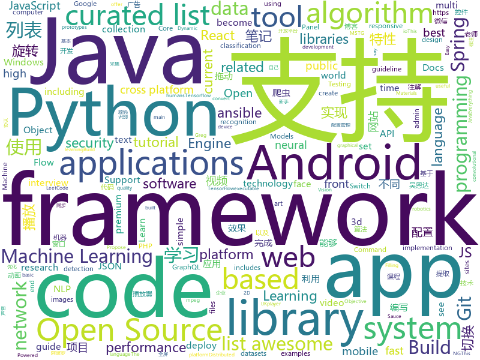

# 2018-07-18
See what the GitHub community is most excited about today.

## python
* [system-design-primer](https://github.com/donnemartin/system-design-primer)(**767 stars today**): Learn how to design large-scale systems. Prep for the system design interview. Includes Anki flashcards.
* [cheat.sh](https://github.com/chubin/cheat.sh)(**583 stars today**): the only cheat sheet you need
* [public-apis](https://github.com/toddmotto/public-apis)(**174 stars today**): A collective list of public JSON APIs for use in web development.
* [models](https://github.com/tensorflow/models)(**62 stars today**): Models and examples built with TensorFlow
* [xar](https://github.com/facebookincubator/xar)(**75 stars today**): executable archive format
* [termtosvg](https://github.com/nbedos/termtosvg)(**70 stars today**): Record terminal sessions as SVG animations
* [Lenia](https://github.com/Chakazul/Lenia)(**62 stars today**): Lenia - Mathematical Life Forms
* [learn-python3](https://github.com/jerry-git/learn-python3)(**57 stars today**): Jupyter notebooks for teaching/learning Python 3
* [keras](https://github.com/keras-team/keras)(**50 stars today**): Deep Learning for humans
* [text-classification-models-tf](https://github.com/dongjun-Lee/text-classification-models-tf)(**53 stars today**): Tensorflow implementations of Text Classification Models.
* [Python-100-Days](https://github.com/jackfrued/Python-100-Days)(**47 stars today**): Python - 100天从新手到大师
* [ffn](https://github.com/google/ffn)(**49 stars today**): Flood-Filling Networks for instance segmentation in 3d volumes.
* [glow](https://github.com/openai/glow)(**42 stars today**): Code for reproducing results in "Glow: Generative Flow with Invertible 1x1 Convolutions"
* [odoo](https://github.com/odoo/odoo)(**34 stars today**): Odoo. Open Source Apps To Grow Your Business.
* [youtube-dl](https://github.com/rg3/youtube-dl)(**37 stars today**): Command-line program to download videos from YouTube.com and other video sites
* [django](https://github.com/django/django)(**31 stars today**): The Web framework for perfectionists with deadlines.
* [ansible](https://github.com/ansible/ansible)(**29 stars today**): Ansible is a radically simple IT automation platform that makes your applications and systems easier to deploy. Avoid writing scripts or custom code to deploy and update your applications — automate in a language that approaches plain English, using SSH, with no agents to install on remote systems. https://docs.ansible.com/ansible/
* [MachineLearning](https://github.com/apachecn/MachineLearning)(**33 stars today**): Machine Learning in Action（机器学习实战）
* [scikit-learn](https://github.com/scikit-learn/scikit-learn)(**30 stars today**): scikit-learn: machine learning in Python
* [cpython](https://github.com/python/cpython)(**26 stars today**): The Python programming language
* [face_recognition](https://github.com/ageitgey/face_recognition)(**32 stars today**): The world's simplest facial recognition api for Python and the command line
* [PythonRobotics](https://github.com/AtsushiSakai/PythonRobotics)(**34 stars today**): Python sample codes for robotics algorithms.
* [Detectron](https://github.com/facebookresearch/Detectron)(**30 stars today**): FAIR's research platform for object detection research, implementing popular algorithms like Mask R-CNN and RetinaNet.
* [awesome-machine-learning](https://github.com/josephmisiti/awesome-machine-learning)(**32 stars today**): A curated list of awesome Machine Learning frameworks, libraries and software.
* [repo2docker](https://github.com/jupyter/repo2docker)(**31 stars today**): Turn git repositories into Jupyter enabled Docker Images

## java
* [Java-Interview](https://github.com/crossoverJie/Java-Interview)(**183 stars today**): 👨‍🎓Java related : basic, concurrent, algorithm
* [jib](https://github.com/GoogleContainerTools/jib)(**153 stars today**): ⛵️Build container images for your Java applications.
* [pandora](https://github.com/whataa/pandora)(**119 stars today**): an android library for debugging what we care about directly in app.
* [librec](https://github.com/guoguibing/librec)(**82 stars today**): LibRec: A Leading Java Library for Recommender Systems, see
* [MeiWidgetView](https://github.com/HpWens/MeiWidgetView)(**74 stars today**): 一款汇总了郭霖，鸿洋，以及自己平时收集的自定义控件集合库
* [spring-boot](https://github.com/spring-projects/spring-boot)(**52 stars today**): Spring Boot
* [SpringCloudLearning](https://github.com/forezp/SpringCloudLearning)(**55 stars today**): 《史上最简单的Spring Cloud教程源码》
* [proxyee-down](https://github.com/proxyee-down-org/proxyee-down)(**40 stars today**): http下载工具，基于http代理，支持多连接分块下载
* [S-MVP](https://github.com/UCodeUStory/S-MVP)(**46 stars today**): 🔥🔥优化版MVP,使用注解泛型简化代码编写，使用模块化协议方便维护，APT过程使用注解解析器利用JavaPoet🌝完成重复模块的编写，利用ASpect+GradlePlugin 完成横向AOP编程+Javassist动态字节码注入+Tinker实现热修复+Retrofit实现优雅网络操作+RxJava轻松玩转数据处理
* [elasticsearch](https://github.com/elastic/elasticsearch)(**39 stars today**): Open Source, Distributed, RESTful Search Engine
* [guava](https://github.com/google/guava)(**39 stars today**): Google core libraries for Java
* [incubator-dubbo](https://github.com/apache/incubator-dubbo)(**29 stars today**): Apache Dubbo (incubating) is a high-performance, java based, open source RPC framework.
* [WanAndroid](https://github.com/jenly1314/WanAndroid)(**37 stars today**): 基于Architecture Components dependencies（Lifecycles，LiveData，ViewModel，Room）的WanAndroid开源项目
* [XXPermissions](https://github.com/getActivity/XXPermissions)(**34 stars today**): 
* [tutorials](https://github.com/eugenp/tutorials)(**18 stars today**): The "REST With Spring" Course:
* [Java](https://github.com/TheAlgorithms/Java)(**31 stars today**): All Algorithms implemented in Java
* [interviews](https://github.com/kdn251/interviews)(**31 stars today**): Everything you need to know to get the job.
* [GSYVideoPlayer](https://github.com/CarGuo/GSYVideoPlayer)(**27 stars today**): 视频播放器（IJKplayer、ExoPlayer、MediaPlayer），HTTPS支持，支持弹幕，支持滤镜、水印、gif截图，片头广告、中间广告，多个同时播放，支持基本的拖动，声音、亮度调节，支持边播边缓存，支持视频本身自带rotation的旋转（90,270之类），重力旋转与手动旋转的同步支持，支持列表播放 ，直接添加控件为封面，列表全屏动画，视频加载速度，列表小窗口支持拖动，动画效果，调整比例，多分辨率切换，支持切换播放器，进度条小窗口预览，列表切换详情页面无缝播放，其他一些小动画效果，rtsp、concat、mpeg。项目解析：
* [apollo](https://github.com/ctripcorp/apollo)(**26 stars today**): Apollo（阿波罗）是携程框架部门研发的分布式配置中心，能够集中化管理应用不同环境、不同集群的配置，配置修改后能够实时推送到应用端，并且具备规范的权限、流程治理等特性，适用于微服务配置管理场景。
* [weixin-java-tools](https://github.com/Wechat-Group/weixin-java-tools)(**24 stars today**): 可能是目前最好最全的微信Java开发工具包，支持包括微信支付、开放平台、小程序、企业号和公众号等的开发
* [spring-framework](https://github.com/spring-projects/spring-framework)(**25 stars today**): Spring Framework
* [ARouter](https://github.com/alibaba/ARouter)(**26 stars today**): 💪A framework for assisting in the renovation of Android componentization
* [okhttp](https://github.com/square/okhttp)(**22 stars today**): An HTTP+HTTP/2 client for Android and Java applications.
* [HanLP](https://github.com/hankcs/HanLP)(**24 stars today**): 自然语言处理 中文分词 词性标注 命名实体识别 依存句法分析 关键词提取 新词发现 短语提取 自动摘要 文本分类 拼音简繁
* [ballerina-lang](https://github.com/ballerina-platform/ballerina-lang)(**24 stars today**): Ballerina is a compiled, transactional, statically and strongly typed programming language with textual and graphical syntaxes.

## unknown
* [InterviewMap](https://github.com/KieSun/InterviewMap)(**1,207 stars today**): Build the best interview map. The current content includes JS, network, browser related, performance optimization, security, framework, Git, data structure, algorithm, etc.
* [recipe-el_fuego_viviente](https://github.com/aweijnitz/recipe-el_fuego_viviente)(**442 stars today**): Fermented Chili Sauce
* [Interview-Notebook](https://github.com/CyC2018/Interview-Notebook)(**215 stars today**): 📆准备秋招学习笔记
* [react-developer-roadmap](https://github.com/adam-golab/react-developer-roadmap)(**203 stars today**): Roadmap to becoming a React developer in 2018
* [machine-learning-yearning](https://github.com/xiaqunfeng/machine-learning-yearning)(**181 stars today**): Translation of <Machine Learning Yearning> by Andrew NG
* [React-Redux-Styleguide](https://github.com/iraycd/React-Redux-Styleguide)(**108 stars today**): This is a working set of guidelines for developing React applications. We say "guideline" because there are no hard-and-fast rules; best practices, patterns and technology change over time, so we consider this a living set of style guides.
* [architect-awesome](https://github.com/xingshaocheng/architect-awesome)(**62 stars today**): 后端架构师技术图谱
* [free-programming-books](https://github.com/EbookFoundation/free-programming-books)(**60 stars today**): 📚Freely available programming books
* [gitignore](https://github.com/github/gitignore)(**48 stars today**): A collection of useful .gitignore templates
* [You-Dont-Know-JS](https://github.com/getify/You-Dont-Know-JS)(**59 stars today**): A book series on JavaScript. @YDKJS on twitter.
* [build-your-own-x](https://github.com/danistefanovic/build-your-own-x)(**61 stars today**): 🤓Build your own (insert technology here)
* [awesome](https://github.com/sindresorhus/awesome)(**58 stars today**): 😎Curated list of awesome lists
* [awesome-vue](https://github.com/vuejs/awesome-vue)(**53 stars today**): 🎉A curated list of awesome things related to Vue.js
* [keyfinder](https://github.com/CERTCC/keyfinder)(**53 stars today**): A tool for finding and analyzing private (and public) key files, including support for Android APK files.
* [coding-interview-university](https://github.com/jwasham/coding-interview-university)(**36 stars today**): A complete computer science study plan to become a software engineer.
* [project-based-learning](https://github.com/tuvtran/project-based-learning)(**41 stars today**): Curated list of project-based tutorials
* [NLP-progress](https://github.com/sebastianruder/NLP-progress)(**32 stars today**): Repository to track the progress in Natural Language Processing (NLP), including the datasets and the current state-of-the-art for the most common NLP tasks.
* [awesome-flutter](https://github.com/Solido/awesome-flutter)(**28 stars today**): An awesome list that curates the best Flutter libraries, tools, tutorials, articles and more.
* [toml](https://github.com/toml-lang/toml)(**28 stars today**): Tom's Obvious, Minimal Language
* [Exploit-Writeups](https://github.com/Cryptogenic/Exploit-Writeups)(**28 stars today**): A collection where my current and future writeups for exploits/CTF will go
* [myblog](https://github.com/lihongxun945/myblog)(**28 stars today**): 言川的博客-前端精华博客
* [acl2018-semantic-parsing-tutorial](https://github.com/allenai/acl2018-semantic-parsing-tutorial)(**26 stars today**): Materials from the ACL 2018 tutorial on neural semantic parsing
* [awesome-public-datasets](https://github.com/awesomedata/awesome-public-datasets)(**24 stars today**): A topic-centric list of high-quality open datasets in public domains. Propose NEW data ☛☛☛PR☛☛☛
* [awesome-android-ui](https://github.com/wasabeef/awesome-android-ui)(**22 stars today**): A curated list of awesome Android UI/UX libraries
* [awesome-graphql](https://github.com/chentsulin/awesome-graphql)(**21 stars today**): Awesome list of GraphQL & Relay

## c++
* [tensorflow](https://github.com/tensorflow/tensorflow)(**91 stars today**): Computation using data flow graphs for scalable machine learning
* [electron](https://github.com/electron/electron)(**45 stars today**): Build cross platform desktop apps with JavaScript, HTML, and CSS
* [opencv](https://github.com/opencv/opencv)(**32 stars today**): Open Source Computer Vision Library
* [nsemu](https://github.com/RKX1209/nsemu)(**39 stars today**): Experimental Nintendo Switch emulator
* [pbrt-v3](https://github.com/mmp/pbrt-v3)(**37 stars today**): Source code for pbrt, the renderer described in the third edition of "Physically Based Rendering: From Theory To Implementation", by Matt Pharr, Wenzel Jakob, and Greg Humphreys.
* [awesome-algorithm-question-solution](https://github.com/knightsj/awesome-algorithm-question-solution)(**32 stars today**): LeetCode，《剑指offer》中的算法题的题目和解法以及常见算法的实现
* [bitcoin](https://github.com/bitcoin/bitcoin)(**28 stars today**): Bitcoin Core integration/staging tree
* [protobuf](https://github.com/google/protobuf)(**28 stars today**): Protocol Buffers - Google's data interchange format
* [caffe](https://github.com/BVLC/caffe)(**24 stars today**): Caffe: a fast open framework for deep learning.
* [pytorch](https://github.com/pytorch/pytorch)(**23 stars today**): Tensors and Dynamic neural networks in Python with strong GPU acceleration
* [tesseract](https://github.com/tesseract-ocr/tesseract)(**23 stars today**): Tesseract Open Source OCR Engine (main repository)
* [godot](https://github.com/godotengine/godot)(**21 stars today**): Godot Engine – Multi-platform 2D and 3D game engine
* [apollo](https://github.com/ApolloAuto/apollo)(**19 stars today**): An open autonomous driving platform
* [horovod](https://github.com/uber/horovod)(**24 stars today**): Distributed training framework for TensorFlow, Keras, and PyTorch.
* [aseprite](https://github.com/aseprite/aseprite)(**21 stars today**): Animated sprite editor & pixel art tool (Windows, macOS, Linux)
* [FeatherCNN](https://github.com/Tencent/FeatherCNN)(**21 stars today**): FeatherCNN is a high performance inference engine for convolutional neural networks.
* [envoy](https://github.com/envoyproxy/envoy)(**20 stars today**): C++ front/service proxy
* [dll_to_exe](https://github.com/hasherezade/dll_to_exe)(**17 stars today**): Converts a DLL into EXE
* [swift](https://github.com/apple/swift)(**18 stars today**): The Swift Programming Language
* [openpose](https://github.com/CMU-Perceptual-Computing-Lab/openpose)(**17 stars today**): OpenPose: Real-time multi-person keypoint detection library for body, face, and hands estimation
* [grpc](https://github.com/grpc/grpc)(**16 stars today**): The C based gRPC (C++, Python, Ruby, Objective-C, PHP, C#)
* [googletest](https://github.com/google/googletest)(**15 stars today**): Google Test
* [v8](https://github.com/v8/v8)(**17 stars today**): The official mirror of the V8 Git repository
* [yuzu](https://github.com/yuzu-emu/yuzu)(**17 stars today**): Nintendo Switch Emulator
* [RedisDesktopManager](https://github.com/uglide/RedisDesktopManager)(**14 stars today**): 🔧Cross-platform GUI management tool for Redis

## html
* [react-from-zero](https://github.com/kay-is/react-from-zero)(**27 stars today**): A simple (99% ES2015 less) tutorial for React
* [Coursera-ML-AndrewNg-Notes](https://github.com/fengdu78/Coursera-ML-AndrewNg-Notes)(**25 stars today**): 吴恩达老师的机器学习课程个人笔记
* [foml](https://github.com/bloomberg/foml)(**22 stars today**): Foundations of Machine Learning
* [AdminLTE](https://github.com/almasaeed2010/AdminLTE)(**17 stars today**): AdminLTE - Free Premium Admin control Panel Theme Based On Bootstrap 3.x
* [Winds](https://github.com/GetStream/Winds)(**22 stars today**): A Beautiful Open Source RSS & Podcast App Powered by Getstream.io
* [Spoon-Knife](https://github.com/octocat/Spoon-Knife)(****): This repo is for demonstration purposes only.
* [owasp-mstg](https://github.com/OWASP/owasp-mstg)(**18 stars today**): The Mobile Security Testing Guide (MSTG) is a comprehensive manual for mobile app security testing and reverse engineering.
* [itty-bitty](https://github.com/alcor/itty-bitty)(**17 stars today**): Itty.bitty is a tool to create links that contain small sites
* [awesome-mac](https://github.com/jaywcjlove/awesome-mac)(**14 stars today**):  Now we have become very big, Different from the original idea. Collect premium software in various categories.
* [fastText](https://github.com/facebookresearch/fastText)(**14 stars today**): Library for fast text representation and classification.
* [JavaScript30](https://github.com/wesbos/JavaScript30)(**9 stars today**): 30 Day Vanilla JS Challenge
* [babel-blade](https://github.com/sw-yx/babel-blade)(**15 stars today**): a Babel plugin/macro that solves the Double Declaration problem in GraphQL. Please see Docs at:
* [gson](https://github.com/google/gson)(**13 stars today**): A Java serialization/deserialization library to convert Java Objects into JSON and back
* [deeplearning_ai_books](https://github.com/fengdu78/deeplearning_ai_books)(**11 stars today**): deeplearning.ai（吴恩达老师的深度学习课程笔记及资源）
* [douyin](https://github.com/lujqme/douyin)(**13 stars today**): 抖音 桌面版(WIndows/Mac OS)
* [patchwork](https://github.com/jlord/patchwork)(****): All the Git-it Workshop completers!
* [aozorabunko](https://github.com/aozorabunko/aozorabunko)(**10 stars today**): 
* [capacitor](https://github.com/ionic-team/capacitor)(**10 stars today**): Build cross-platform Native Progressive Web Apps for iOS, Android, and the web⚡️
* [ramd.js](https://github.com/vladocar/ramd.js)(**10 stars today**): ramd.js JavaScript library for making web applications.
* [Anti-Anti-Spider](https://github.com/luyishisi/Anti-Anti-Spider)(**7 stars today**): 越来越多的网站具有反爬虫特性，有的用图片隐藏关键数据，有的使用反人类的验证码，建立反反爬虫的代码仓库，通过与不同特性的网站做斗争（无恶意）提高技术。（欢迎提交难以采集的网站）（因工作原因，项目暂停）
* [foundation-sites](https://github.com/zurb/foundation-sites)(**9 stars today**): The most advanced responsive front-end framework in the world. Quickly create prototypes and production code for sites that work on any kind of device.
* [speedtest](https://github.com/adolfintel/speedtest)(**9 stars today**): Self-hosted HTML5 Speedtest. Easy setup, examples, configurable, responsive and mobile friendly. Supports PHP, Node, and more.
* [electron-api-demos](https://github.com/electron/electron-api-demos)(**9 stars today**): Explore the Electron APIs
* [ng-alain](https://github.com/cipchk/ng-alain)(**9 stars today**): ng-zorro-antd admin panel front-end framework
* [face-recognition-demo](https://github.com/bella-silveira/face-recognition-demo)(**9 stars today**): Source code for a face recognition demo

## WordCloud

