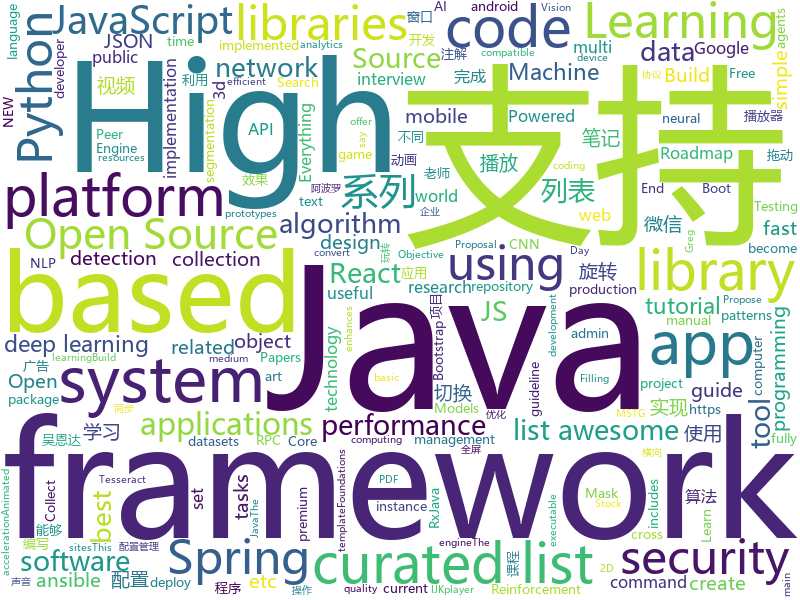

# 2018-07-19
See what the GitHub community is most excited about today.

## python
* [system-design-primer](https://github.com/donnemartin/system-design-primer)(**538 stars today**): Learn how to design large-scale systems. Prep for the system design interview. Includes Anki flashcards.
* [coinai](https://github.com/techbanca/coinai)(**86 stars today**): Seed applications based on AI for digital currency quantitative analysis, medium-term forecast and asset allocation for the secondary market of the BANCA community
* [cheat.sh](https://github.com/chubin/cheat.sh)(**395 stars today**): the only cheat sheet you need
* [public-apis](https://github.com/toddmotto/public-apis)(**165 stars today**): A collective list of public JSON APIs for use in web development.
* [models](https://github.com/tensorflow/models)(**75 stars today**): Models and examples built with TensorFlow
* [ansible-jupyter-kernel](https://github.com/ansible/ansible-jupyter-kernel)(**88 stars today**): Jupyter Notebook Kernel for running Ansible Tasks and Playbooks
* [Lenia](https://github.com/Chakazul/Lenia)(**76 stars today**): Lenia - Mathematical Life Forms
* [awesome-python](https://github.com/vinta/awesome-python)(**63 stars today**): A curated list of awesome Python frameworks, libraries, software and resources
* [cpython](https://github.com/python/cpython)(**39 stars today**): The Python programming language
* [TextWorld](https://github.com/Microsoft/TextWorld)(**42 stars today**): TextWorld is a sandbox learning environment for the training and evaluation of reinforcement learning (RL) agents on text-based games.
* [keras](https://github.com/keras-team/keras)(**35 stars today**): Deep Learning for humans
* [awesome-machine-learning](https://github.com/josephmisiti/awesome-machine-learning)(**36 stars today**): A curated list of awesome Machine Learning frameworks, libraries and software.
* [face_recognition](https://github.com/ageitgey/face_recognition)(**39 stars today**): The world's simplest facial recognition api for Python and the command line
* [text-classification-models-tf](https://github.com/dongjun-Lee/text-classification-models-tf)(**36 stars today**): Tensorflow implementations of Text Classification Models.
* [termtosvg](https://github.com/nbedos/termtosvg)(**39 stars today**): Record terminal sessions as SVG animations
* [odoo](https://github.com/odoo/odoo)(**33 stars today**): Odoo. Open Source Apps To Grow Your Business.
* [Mask_RCNN](https://github.com/matterport/Mask_RCNN)(**31 stars today**): Mask R-CNN for object detection and instance segmentation on Keras and TensorFlow
* [ansible](https://github.com/ansible/ansible)(**30 stars today**): Ansible is a radically simple IT automation platform that makes your applications and systems easier to deploy. Avoid writing scripts or custom code to deploy and update your applications — automate in a language that approaches plain English, using SSH, with no agents to install on remote systems. https://docs.ansible.com/ansible/
* [Detectron](https://github.com/facebookresearch/Detectron)(**30 stars today**): FAIR's research platform for object detection research, implementing popular algorithms like Mask R-CNN and RetinaNet.
* [Reinforcement_Learning_for_Stock_Prediction](https://github.com/llSourcell/Reinforcement_Learning_for_Stock_Prediction)(**32 stars today**): This is the code for "Reinforcement Learning for Stock Prediction" By Siraj Raval on Youtube
* [ffn](https://github.com/google/ffn)(**31 stars today**): Flood-Filling Networks for instance segmentation in 3d volumes.
* [django](https://github.com/django/django)(**24 stars today**): The Web framework for perfectionists with deadlines.
* [ph0neutria](https://github.com/phage-nz/ph0neutria)(**29 stars today**): ph0neutria is a malware zoo builder that sources samples straight from the wild. Everything is stored in Viper for ease of access and manageability.
* [Deep-Learning-Papers-Reading-Roadmap](https://github.com/floodsung/Deep-Learning-Papers-Reading-Roadmap)(**29 stars today**): Deep Learning papers reading roadmap for anyone who are eager to learn this amazing tech!
* [xar](https://github.com/facebookincubator/xar)(**31 stars today**): executable archive format

## java
* [Java-Interview](https://github.com/crossoverJie/Java-Interview)(**131 stars today**): 👨‍🎓Java related : basic, concurrent, algorithm
* [SpringCloudLearning](https://github.com/forezp/SpringCloudLearning)(**72 stars today**): 《史上最简单的Spring Cloud教程源码》
* [S-MVP](https://github.com/UCodeUStory/S-MVP)(**77 stars today**): 🔥🔥优化版MVP,使用注解泛型简化代码编写，使用模块化协议方便维护，APT过程使用注解解析器利用JavaPoet🌝完成重复模块的编写，利用ASpect+GradlePlugin 完成横向AOP编程+Javassist动态字节码注入+Tinker实现热修复+Retrofit实现优雅网络操作+RxJava轻松玩转数据处理
* [spring-boot](https://github.com/spring-projects/spring-boot)(**55 stars today**): Spring Boot
* [jib](https://github.com/GoogleContainerTools/jib)(**56 stars today**): ⛵️Build container images for your Java applications.
* [librec](https://github.com/guoguibing/librec)(**51 stars today**): LibRec: A Leading Java Library for Recommender Systems, see
* [java-design-patterns](https://github.com/iluwatar/java-design-patterns)(**42 stars today**): Design patterns implemented in Java
* [tutorials](https://github.com/eugenp/tutorials)(**28 stars today**): The "REST With Spring" Course:
* [proxyee-down](https://github.com/proxyee-down-org/proxyee-down)(**41 stars today**): http下载工具，基于http代理，支持多连接分块下载
* [interviews](https://github.com/kdn251/interviews)(**43 stars today**): Everything you need to know to get the job.
* [elasticsearch](https://github.com/elastic/elasticsearch)(**39 stars today**): Open Source, Distributed, RESTful Search Engine
* [guava](https://github.com/google/guava)(**39 stars today**): Google core libraries for Java
* [apollo](https://github.com/ctripcorp/apollo)(**38 stars today**): Apollo（阿波罗）是携程框架部门研发的分布式配置中心，能够集中化管理应用不同环境、不同集群的配置，配置修改后能够实时推送到应用端，并且具备规范的权限、流程治理等特性，适用于微服务配置管理场景。
* [spring-framework](https://github.com/spring-projects/spring-framework)(**30 stars today**): Spring Framework
* [incubator-dubbo](https://github.com/apache/incubator-dubbo)(**29 stars today**): Apache Dubbo (incubating) is a high-performance, java based, open source RPC framework.
* [vjtools](https://github.com/vipshop/vjtools)(**35 stars today**): The vip.com's java coding standard, libraries and tools
* [sofa-rpc](https://github.com/alipay/sofa-rpc)(**31 stars today**): SOFARPC is a high-performance, high-extensibility, production-level Java RPC framework.
* [pandora](https://github.com/whataa/pandora)(**33 stars today**): an android library for debugging what we care about directly in app.
* [GSYVideoPlayer](https://github.com/CarGuo/GSYVideoPlayer)(**31 stars today**): 视频播放器（IJKplayer、ExoPlayer、MediaPlayer），HTTPS支持，支持弹幕，支持滤镜、水印、gif截图，片头广告、中间广告，多个同时播放，支持基本的拖动，声音、亮度调节，支持边播边缓存，支持视频本身自带rotation的旋转（90,270之类），重力旋转与手动旋转的同步支持，支持列表播放 ，直接添加控件为封面，列表全屏动画，视频加载速度，列表小窗口支持拖动，动画效果，调整比例，多分辨率切换，支持切换播放器，进度条小窗口预览，列表切换详情页面无缝播放，其他一些小动画效果，rtsp、concat、mpeg。项目解析：
* [Java](https://github.com/TheAlgorithms/Java)(**25 stars today**): All Algorithms implemented in Java
* [AndroidUtilCode](https://github.com/Blankj/AndroidUtilCode)(**25 stars today**): 🔥Android developers should collect the following utils(updating).
* [fastjson](https://github.com/alibaba/fastjson)(**27 stars today**): 🚄A fast JSON parser/generator for Java
* [weixin-java-tools](https://github.com/Wechat-Group/weixin-java-tools)(**28 stars today**): 可能是目前最好最全的微信Java开发工具包，支持包括微信支付、开放平台、小程序、企业号和公众号等的开发
* [sofa-boot](https://github.com/alipay/sofa-boot)(**25 stars today**): SOFABoot is a framework that enhances Spring Boot and fully compatible with it, provides readiness check, class isolation, etc.
* [RxJava](https://github.com/ReactiveX/RxJava)(**25 stars today**): RxJava – Reactive Extensions for the JVM – a library for composing asynchronous and event-based programs using observable sequences for the Java VM.

## unknown
* [InterviewMap](https://github.com/InterviewMap/InterviewMap)(**605 stars today**): Build the best interview map. The current content includes JS, network, browser related, performance optimization, security, framework, Git, data structure, algorithm, etc.
* [react-developer-roadmap](https://github.com/adam-golab/react-developer-roadmap)(**170 stars today**): Roadmap to becoming a React developer in 2018
* [Interview-Notebook](https://github.com/CyC2018/Interview-Notebook)(**128 stars today**): 📆准备秋招学习笔记
* [recipe-el_fuego_viviente](https://github.com/aweijnitz/recipe-el_fuego_viviente)(**143 stars today**): Fermented Chili Sauce
* [You-Dont-Know-JS](https://github.com/getify/You-Dont-Know-JS)(**76 stars today**): A book series on JavaScript. @YDKJS on twitter.
* [gitignore](https://github.com/github/gitignore)(**63 stars today**): A collection of useful .gitignore templates
* [coding-interview-university](https://github.com/jwasham/coding-interview-university)(**70 stars today**): A complete computer science study plan to become a software engineer.
* [awesome](https://github.com/sindresorhus/awesome)(**69 stars today**): 😎Curated list of awesome lists
* [architect-awesome](https://github.com/xingshaocheng/architect-awesome)(**57 stars today**): 后端架构师技术图谱
* [awesome-github-wechat-weapp](https://github.com/opendigg/awesome-github-wechat-weapp)(**59 stars today**): 微信小程序开源项目库汇总
* [awesome-public-datasets](https://github.com/awesomedata/awesome-public-datasets)(**59 stars today**): A topic-centric list of high-quality open datasets in public domains. Propose NEW data ☛☛☛PR☛☛☛
* [free-programming-books](https://github.com/EbookFoundation/free-programming-books)(**55 stars today**): 📚Freely available programming books
* [project-based-learning](https://github.com/tuvtran/project-based-learning)(**54 stars today**): Curated list of project-based tutorials
* [build-your-own-x](https://github.com/danistefanovic/build-your-own-x)(**51 stars today**): 🤓Build your own (insert technology here)
* [awesome-vue](https://github.com/vuejs/awesome-vue)(**46 stars today**): 🎉A curated list of awesome things related to Vue.js
* [awesome-vscode](https://github.com/viatsko/awesome-vscode)(**47 stars today**): 🎨A curated list of delightful VS Code packages and resources.
* [ru-web-developer-security-checklist](https://github.com/minotaura/ru-web-developer-security-checklist)(**43 stars today**): 
* [machine-learning-yearning](https://github.com/xiaqunfeng/machine-learning-yearning)(**37 stars today**): Translation of <Machine Learning Yearning> by Andrew NG
* [awesome-flutter](https://github.com/Solido/awesome-flutter)(**35 stars today**): An awesome list that curates the best Flutter libraries, tools, tutorials, articles and more.
* [React-Redux-Styleguide](https://github.com/iraycd/React-Redux-Styleguide)(**33 stars today**): This is a working set of guidelines for developing React applications. We say "guideline" because there are no hard-and-fast rules; best practices, patterns and technology change over time, so we consider this a living set of style guides.
* [NLP-progress](https://github.com/sebastianruder/NLP-progress)(**31 stars today**): Repository to track the progress in Natural Language Processing (NLP), including the datasets and the current state-of-the-art for the most common NLP tasks.
* [Blog](https://github.com/mqyqingfeng/Blog)(**27 stars today**): 冴羽写博客的地方，预计写四个系列：JavaScript深入系列、JavaScript专题系列、ES6系列、React系列。
* [awesome-scalability](https://github.com/binhnguyennus/awesome-scalability)(**28 stars today**): High Scalability, High Availability, High Stability, High Performance, and High Intelligence Back-End Design Patterns
* [acl2018-semantic-parsing-tutorial](https://github.com/allenai/acl2018-semantic-parsing-tutorial)(**29 stars today**): Materials from the ACL 2018 tutorial on neural semantic parsing
* [toml](https://github.com/toml-lang/toml)(**28 stars today**): Tom's Obvious, Minimal Language

## c++
* [tensorflow](https://github.com/tensorflow/tensorflow)(**121 stars today**): Computation using data flow graphs for scalable machine learning
* [electron](https://github.com/electron/electron)(**42 stars today**): Build cross platform desktop apps with JavaScript, HTML, and CSS
* [bitcoin](https://github.com/bitcoin/bitcoin)(**40 stars today**): Bitcoin Core integration/staging tree
* [protobuf](https://github.com/google/protobuf)(**42 stars today**): Protocol Buffers - Google's data interchange format
* [opencv](https://github.com/opencv/opencv)(**26 stars today**): Open Source Computer Vision Library
* [apollo](https://github.com/ApolloAuto/apollo)(**26 stars today**): An open autonomous driving platform
* [nsemu](https://github.com/RKX1209/nsemu)(**29 stars today**): Experimental Nintendo Switch emulator
* [pytorch](https://github.com/pytorch/pytorch)(**23 stars today**): Tensors and Dynamic neural networks in Python with strong GPU acceleration
* [aseprite](https://github.com/aseprite/aseprite)(**26 stars today**): Animated sprite editor & pixel art tool (Windows, macOS, Linux)
* [tesseract](https://github.com/tesseract-ocr/tesseract)(**23 stars today**): Tesseract Open Source OCR Engine (main repository)
* [caffe](https://github.com/BVLC/caffe)(**18 stars today**): Caffe: a fast open framework for deep learning.
* [openpose](https://github.com/CMU-Perceptual-Computing-Lab/openpose)(**20 stars today**): OpenPose: Real-time multi-person keypoint detection library for body, face, and hands estimation
* [awesome-algorithm-question-solution](https://github.com/knightsj/awesome-algorithm-question-solution)(**20 stars today**): LeetCode，《剑指offer》中的算法题的题目和解法以及常见算法的实现
* [osquery](https://github.com/facebook/osquery)(**20 stars today**): SQL powered operating system instrumentation, monitoring, and analytics.
* [godot](https://github.com/godotengine/godot)(**16 stars today**): Godot Engine – Multi-platform 2D and 3D game engine
* [grpc](https://github.com/grpc/grpc)(**15 stars today**): The C based gRPC (C++, Python, Ruby, Objective-C, PHP, C#)
* [pbrt-v3](https://github.com/mmp/pbrt-v3)(**18 stars today**): Source code for pbrt, the renderer described in the third edition of "Physically Based Rendering: From Theory To Implementation", by Matt Pharr, Wenzel Jakob, and Greg Humphreys.
* [RedisDesktopManager](https://github.com/uglide/RedisDesktopManager)(**15 stars today**): 🔧Cross-platform GUI management tool for Redis
* [cmder](https://github.com/cmderdev/cmder)(**15 stars today**): Lovely console emulator package for Windows
* [swift](https://github.com/apple/swift)(**15 stars today**): The Swift Programming Language
* [icu](https://github.com/unicode-org/icu)(**15 stars today**): The new home of the ICU project source code.
* [faiss](https://github.com/facebookresearch/faiss)(**14 stars today**): A library for efficient similarity search and clustering of dense vectors.
* [googletest](https://github.com/google/googletest)(**13 stars today**): Google Test
* [conntrack_exporter](https://github.com/hiveco/conntrack_exporter)(**15 stars today**): Prometheus exporter for network connections
* [mace](https://github.com/XiaoMi/mace)(**14 stars today**): MACE is a deep learning inference framework optimized for mobile heterogeneous computing platforms.

## html
* [GTFOBins.github.io](https://github.com/GTFOBins/GTFOBins.github.io)(**35 stars today**): Curated list of Unix binaries that can be exploited to bypass system security restrictions
* [intern-coding-tasks](https://github.com/pfnet/intern-coding-tasks)(**28 stars today**): Coding tasks for PFN internship
* [AdminLTE](https://github.com/almasaeed2010/AdminLTE)(**20 stars today**): AdminLTE - Free Premium Admin control Panel Theme Based On Bootstrap 3.x
* [JavaScript30](https://github.com/wesbos/JavaScript30)(**18 stars today**): 30 Day Vanilla JS Challenge
* [deeplearning_ai_books](https://github.com/fengdu78/deeplearning_ai_books)(**20 stars today**): deeplearning.ai（吴恩达老师的深度学习课程笔记及资源）
* [Coursera-ML-AndrewNg-Notes](https://github.com/fengdu78/Coursera-ML-AndrewNg-Notes)(**18 stars today**): 吴恩达老师的机器学习课程个人笔记
* [Winds](https://github.com/GetStream/Winds)(**21 stars today**): A Beautiful Open Source RSS & Podcast App Powered by Getstream.io
* [awesome-mac](https://github.com/jaywcjlove/awesome-mac)(**21 stars today**):  Now we have become very big, Different from the original idea. Collect premium software in various categories.
* [pdfs](https://github.com/tpn/pdfs)(**19 stars today**): Technically-oriented PDF Collection (Papers, Specs, Decks, Manuals, etc)
* [itty-bitty](https://github.com/alcor/itty-bitty)(**18 stars today**): Itty.bitty is a tool to create links that contain small sites
* [Spoon-Knife](https://github.com/octocat/Spoon-Knife)(****): This repo is for demonstration purposes only.
* [owasp-mstg](https://github.com/OWASP/owasp-mstg)(**17 stars today**): The Mobile Security Testing Guide (MSTG) is a comprehensive manual for mobile app security testing and reverse engineering.
* [gson](https://github.com/google/gson)(**11 stars today**): A Java serialization/deserialization library to convert Java Objects into JSON and back
* [hello](https://github.com/vasanthv/hello)(**13 stars today**): Hello - 100% Peer to Peer video chat using webrtc.
* [react-from-zero](https://github.com/kay-is/react-from-zero)(**12 stars today**): A simple (99% ES2015 less) tutorial for React
* [mxgraph](https://github.com/jgraph/mxgraph)(**11 stars today**): mxGraph is a fully client side JavaScript diagramming library
* [react-app-rewired](https://github.com/timarney/react-app-rewired)(**9 stars today**): Override create-react-app webpack configs without ejecting
* [coreui-free-bootstrap-admin-template](https://github.com/coreui/coreui-free-bootstrap-admin-template)(**9 stars today**): CoreUI is free bootstrap admin template
* [foml](https://github.com/bloomberg/foml)(**10 stars today**): Foundations of Machine Learning
* [smart-contract-best-practices](https://github.com/ConsenSys/smart-contract-best-practices)(**9 stars today**): A guide to smart contract security best practices
* [zenbot](https://github.com/DeviaVir/zenbot)(**8 stars today**): Zenbot is a command-line cryptocurrency trading bot using Node.js and MongoDB.
* [30-seconds-of-css](https://github.com/atomiks/30-seconds-of-css)(**9 stars today**): A curated collection of useful CSS snippets.
* [portainer](https://github.com/portainer/portainer)(**9 stars today**): Simple management UI for Docker
* [EIPs](https://github.com/ethereum/EIPs)(**8 stars today**): The Ethereum Improvement Proposal repository
* [foundation-sites](https://github.com/zurb/foundation-sites)(**7 stars today**): The most advanced responsive front-end framework in the world. Quickly create prototypes and production code for sites that work on any kind of device.

## WordCloud

