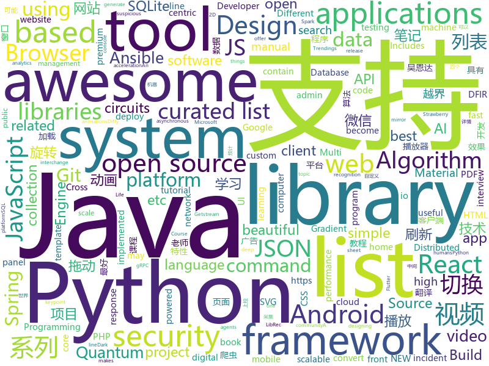

# 2018-07-20
See what the GitHub community is most excited about today.

## python
* [system-design-primer](https://github.com/donnemartin/system-design-primer)(**436 stars today**): Learn how to design large-scale systems. Prep for the system design interview. Includes Anki flashcards.
* [Cirq](https://github.com/quantumlib/Cirq)(**441 stars today**): A python framework for creating, editing, and invoking Noisy Intermediate Scale Quantum (NISQ) circuits.
* [cheat.sh](https://github.com/chubin/cheat.sh)(**331 stars today**): the only cheat sheet you need
* [coinai](https://github.com/techbanca/coinai)(**154 stars today**): Seed applications based on AI for digital currency quantitative analysis, medium-term forecast and asset allocation for the secondary market of the BANCA community
* [public-apis](https://github.com/toddmotto/public-apis)(**174 stars today**): A collective list of public JSON APIs for use in web development.
* [models](https://github.com/tensorflow/models)(**99 stars today**): Models and examples built with TensorFlow
* [ansible-jupyter-kernel](https://github.com/ansible/ansible-jupyter-kernel)(**97 stars today**): Jupyter Notebook Kernel for running Ansible Tasks and Playbooks
* [MatrixAIPoC_PY](https://github.com/MatrixAINetwork/MatrixAIPoC_PY)(**44 stars today**): This is a POC release (Python Version) for Election Algorithm of Consensus Mechanism, with AI function
* [awesome-python](https://github.com/vinta/awesome-python)(**50 stars today**): A curated list of awesome Python frameworks, libraries, software and resources
* [WeasyPrint](https://github.com/Kozea/WeasyPrint)(**54 stars today**): WeasyPrint converts web documents (HTML with CSS, SVG, …) to PDF.
* [xar](https://github.com/facebookincubator/xar)(**53 stars today**): executable archive format
* [Lenia](https://github.com/Chakazul/Lenia)(**52 stars today**): Lenia - Mathematical Life Forms
* [keras](https://github.com/keras-team/keras)(**40 stars today**): Deep Learning for humans
* [Python-100-Days](https://github.com/jackfrued/Python-100-Days)(**43 stars today**): Python - 100天从新手到大师
* [tinygbt](https://github.com/lancifollia/tinygbt)(**44 stars today**): A Tiny, Pure Python implementation of Gradient Boosted Trees.
* [youtube-dl](https://github.com/rg3/youtube-dl)(**36 stars today**): Command-line program to download videos from YouTube.com and other video sites
* [face_recognition](https://github.com/ageitgey/face_recognition)(**32 stars today**): The world's simplest facial recognition api for Python and the command line
* [sorcery](https://github.com/alexmojaki/sorcery)(**37 stars today**): Dark magic delights in Python
* [GdbShellPipe](https://github.com/hq6/GdbShellPipe)(**37 stars today**): Enable piping of internal command output to external commands
* [django](https://github.com/django/django)(**29 stars today**): The Web framework for perfectionists with deadlines.
* [termtosvg](https://github.com/nbedos/termtosvg)(**36 stars today**): Record terminal sessions as SVG animations
* [diffy](https://github.com/Netflix-Skunkworks/diffy)(**34 stars today**): Diffy is a triage tool used during cloud-centric security incidents, to help digital forensics and incident response (DFIR) teams quickly identify suspicious hosts on which to focus their response.
* [OpenFermion-Cirq](https://github.com/quantumlib/OpenFermion-Cirq)(**33 stars today**): Quantum circuits for simulations of quantum chemistry and materials.
* [strawberryfields](https://github.com/XanaduAI/strawberryfields)(**32 stars today**): Strawberry Fields is a full-stack Python library for designing, simulating, and optimizing continuous variable (CV) quantum optical circuits.
* [ansible](https://github.com/ansible/ansible)(**22 stars today**): Ansible is a radically simple IT automation platform that makes your applications and systems easier to deploy. Avoid writing scripts or custom code to deploy and update your applications — automate in a language that approaches plain English, using SSH, with no agents to install on remote systems. https://docs.ansible.com/ansible/

## java
* [Java-Interview](https://github.com/crossoverJie/Java-Interview)(**107 stars today**): 👨‍🎓Java related : basic, concurrent, algorithm
* [SpringCloudLearning](https://github.com/forezp/SpringCloudLearning)(**73 stars today**): 《史上最简单的Spring Cloud教程源码》
* [java-design-patterns](https://github.com/iluwatar/java-design-patterns)(**53 stars today**): Design patterns implemented in Java
* [jib](https://github.com/GoogleContainerTools/jib)(**59 stars today**): ⛵️Build container images for your Java applications.
* [librec](https://github.com/guoguibing/librec)(**47 stars today**): LibRec: A Leading Java Library for Recommender Systems, see
* [tutorials](https://github.com/eugenp/tutorials)(**32 stars today**): The "REST With Spring" Course:
* [proxyee-down](https://github.com/proxyee-down-org/proxyee-down)(**43 stars today**): http下载工具，基于http代理，支持多连接分块下载
* [spring-boot](https://github.com/spring-projects/spring-boot)(**32 stars today**): Spring Boot
* [Java](https://github.com/TheAlgorithms/Java)(**36 stars today**): All Algorithms implemented in Java
* [elasticsearch](https://github.com/elastic/elasticsearch)(**31 stars today**): Open Source, Distributed, RESTful Search Engine
* [RxJava](https://github.com/ReactiveX/RxJava)(**35 stars today**): RxJava – Reactive Extensions for the JVM – a library for composing asynchronous and event-based programs using observable sequences for the Java VM.
* [MTransition](https://github.com/HJ-Money/MTransition)(**39 stars today**): Android：自定义页面切换动画，Custom page Transition
* [APIJSON](https://github.com/TommyLemon/APIJSON)(**38 stars today**): 🚀后端接口和文档自动化，前端(客户端) 定制返回JSON的数据和结构！
* [spring-framework](https://github.com/spring-projects/spring-framework)(**33 stars today**): Spring Framework
* [fvip](https://github.com/CrazyDudo/fvip)(**33 stars today**): 【Android版】一个可以观看国内主流视频平台所有视频的客户端（Mac、Windows、Linux） A client that can watch video of domestic(China) mainstream video platform
* [incubator-dubbo](https://github.com/apache/incubator-dubbo)(**25 stars today**): Apache Dubbo (incubating) is a high-performance, java based, open source RPC framework.
* [guava](https://github.com/google/guava)(**31 stars today**): Google core libraries for Java
* [vjtools](https://github.com/vipshop/vjtools)(**30 stars today**): The vip.com's java coding standard, libraries and tools
* [SmartRefreshLayout](https://github.com/scwang90/SmartRefreshLayout)(**30 stars today**): 🔥下拉刷新、上拉加载、二级刷新、淘宝二楼、RefreshLayout、OverScroll，Android智能下拉刷新框架，支持越界回弹、越界拖动，具有极强的扩展性，集成了几十种炫酷的Header和 Footer。
* [weixin-java-tools](https://github.com/Wechat-Group/weixin-java-tools)(**26 stars today**): 可能是目前最好最全的微信Java开发工具包，支持包括微信支付、开放平台、小程序、企业号和公众号等的开发
* [GSYVideoPlayer](https://github.com/CarGuo/GSYVideoPlayer)(**27 stars today**): 视频播放器（IJKplayer、ExoPlayer、MediaPlayer），HTTPS支持，支持弹幕，支持滤镜、水印、gif截图，片头广告、中间广告，多个同时播放，支持基本的拖动，声音、亮度调节，支持边播边缓存，支持视频本身自带rotation的旋转（90,270之类），重力旋转与手动旋转的同步支持，支持列表播放 ，直接添加控件为封面，列表全屏动画，视频加载速度，列表小窗口支持拖动，动画效果，调整比例，多分辨率切换，支持切换播放器，进度条小窗口预览，列表切换详情页面无缝播放，其他一些小动画效果，rtsp、concat、mpeg。项目解析：
* [okhttp](https://github.com/square/okhttp)(**25 stars today**): An HTTP+HTTP/2 client for Android and Java applications.
* [material-components-android](https://github.com/material-components/material-components-android)(**26 stars today**): Modular and customizable Material Design UI components for Android
* [lottie-android](https://github.com/airbnb/lottie-android)(**23 stars today**): Render After Effects animations natively on Android and iOS, Web, and React Native
* [fastjson](https://github.com/alibaba/fastjson)(**24 stars today**): 🚄A fast JSON parser/generator for Java

## unknown
* [InterviewMap](https://github.com/InterviewMap/InterviewMap)(**774 stars today**): Build the best interview map. The current content includes JS, network, browser related, performance optimization, security, framework, Git, data structure, algorithm, etc.
* [react-developer-roadmap](https://github.com/adam-golab/react-developer-roadmap)(**163 stars today**): Roadmap to becoming a React developer in 2018
* [Interview-Notebook](https://github.com/CyC2018/Interview-Notebook)(**141 stars today**): 📆准备秋招学习笔记
* [gitignore](https://github.com/github/gitignore)(**64 stars today**): A collection of useful .gitignore templates
* [awesome](https://github.com/sindresorhus/awesome)(**68 stars today**): 😎Curated list of awesome lists
* [free-programming-books](https://github.com/EbookFoundation/free-programming-books)(**57 stars today**): 📚Freely available programming books
* [build-your-own-x](https://github.com/danistefanovic/build-your-own-x)(**61 stars today**): 🤓Build your own (insert technology here)
* [architect-awesome](https://github.com/xingshaocheng/architect-awesome)(**48 stars today**): 后端架构师技术图谱
* [coding-interview-university](https://github.com/jwasham/coding-interview-university)(**49 stars today**): A complete computer science study plan to become a software engineer.
* [awesome-sysadmin](https://github.com/kahun/awesome-sysadmin)(**57 stars today**): A curated list of amazingly awesome open source sysadmin resources inspired by Awesome PHP.
* [awesome-vue](https://github.com/vuejs/awesome-vue)(**48 stars today**): 🎉A curated list of awesome things related to Vue.js
* [project-based-learning](https://github.com/tuvtran/project-based-learning)(**45 stars today**): Curated list of project-based tutorials
* [join-dev-design](https://github.com/Microsoft/join-dev-design)(**32 stars today**): Join Microsoft Developer Design
* [awesome-github-wechat-weapp](https://github.com/opendigg/awesome-github-wechat-weapp)(**46 stars today**): 微信小程序开源项目库汇总
* [Diary](https://github.com/MatrixAINetwork/Diary)(**25 stars today**): Matrix Trendings as well as Digests
* [awesome-flutter](https://github.com/Solido/awesome-flutter)(**32 stars today**): An awesome list that curates the best Flutter libraries, tools, tutorials, articles and more.
* [awesome-public-datasets](https://github.com/awesomedata/awesome-public-datasets)(**31 stars today**): A topic-centric list of high-quality open datasets in public domains. Propose NEW data ☛☛☛PR☛☛☛
* [golang-open-source-projects](https://github.com/hackstoic/golang-open-source-projects)(**27 stars today**): 为互联网IT人打造的中文版awesome-go
* [nodebestpractices](https://github.com/i0natan/nodebestpractices)(**28 stars today**): The largest Node.JS best practices list (June 2018)
* [my-arsenal-of-aws-security-tools](https://github.com/toniblyx/my-arsenal-of-aws-security-tools)(**26 stars today**): List of open source tools for AWS security: defensive, offensive, auditing, DFIR, etc.
* [Blog](https://github.com/mqyqingfeng/Blog)(**26 stars today**): 冴羽写博客的地方，预计写四个系列：JavaScript深入系列、JavaScript专题系列、ES6系列、React系列。
* [gold-miner](https://github.com/xitu/gold-miner)(**24 stars today**): 🥇掘金翻译计划，可能是世界最大最好的英译中技术社区，最懂读者和译者的翻译平台：
* [git-recipes](https://github.com/geeeeeeeeek/git-recipes)(**23 stars today**): 🥡 Git recipes in Chinese by Zhongyi Tong. 高质量的Git中文教程.
* [react-typescript-cheatsheet](https://github.com/sw-yx/react-typescript-cheatsheet)(**24 stars today**): a cheatsheet for react users using typescript with react for the first (or nth!) time
* [the-art-of-command-line](https://github.com/jlevy/the-art-of-command-line)(**23 stars today**): Master the command line, in one page

## c++
* [tensorflow](https://github.com/tensorflow/tensorflow)(**137 stars today**): Computation using data flow graphs for scalable machine learning
* [electron](https://github.com/electron/electron)(**57 stars today**): Build cross platform desktop apps with JavaScript, HTML, and CSS
* [opencv](https://github.com/opencv/opencv)(**30 stars today**): Open Source Computer Vision Library
* [tesseract](https://github.com/tesseract-ocr/tesseract)(**36 stars today**): Tesseract Open Source OCR Engine (main repository)
* [bitcoin](https://github.com/bitcoin/bitcoin)(**30 stars today**): Bitcoin Core integration/staging tree
* [pytorch](https://github.com/pytorch/pytorch)(**30 stars today**): Tensors and Dynamic neural networks in Python with strong GPU acceleration
* [apollo](https://github.com/ApolloAuto/apollo)(**30 stars today**): An open autonomous driving platform
* [osquery](https://github.com/facebook/osquery)(**31 stars today**): SQL powered operating system instrumentation, monitoring, and analytics.
* [xgboost](https://github.com/dmlc/xgboost)(**23 stars today**): Scalable, Portable and Distributed Gradient Boosting (GBDT, GBRT or GBM) Library, for Python, R, Java, Scala, C++ and more. Runs on single machine, Hadoop, Spark, Flink and DataFlow
* [awesome-algorithm-question-solution](https://github.com/knightsj/awesome-algorithm-question-solution)(**24 stars today**): LeetCode，《剑指offer》中的算法题的题目和解法以及常见算法的实现
* [protobuf](https://github.com/google/protobuf)(**21 stars today**): Protocol Buffers - Google's data interchange format
* [envoy](https://github.com/envoyproxy/envoy)(**20 stars today**): C++ front/service proxy
* [icu](https://github.com/unicode-org/icu)(**21 stars today**): The new home of the ICU project source code.
* [caffe](https://github.com/BVLC/caffe)(**17 stars today**): Caffe: a fast open framework for deep learning.
* [oomd](https://github.com/facebookincubator/oomd)(**21 stars today**): A userspace out-of-memory killer
* [godot](https://github.com/godotengine/godot)(**18 stars today**): Godot Engine – Multi-platform 2D and 3D game engine
* [openpose](https://github.com/CMU-Perceptual-Computing-Lab/openpose)(**16 stars today**): OpenPose: Real-time multi-person keypoint detection library for body, face, and hands estimation
* [swift](https://github.com/apple/swift)(**18 stars today**): The Swift Programming Language
* [RedisDesktopManager](https://github.com/uglide/RedisDesktopManager)(**17 stars today**): 🔧Cross-platform GUI management tool for Redis
* [googletest](https://github.com/google/googletest)(**15 stars today**): Google Test
* [v8](https://github.com/v8/v8)(**16 stars today**): The official mirror of the V8 Git repository
* [faiss](https://github.com/facebookresearch/faiss)(**14 stars today**): A library for efficient similarity search and clustering of dense vectors.
* [grpc](https://github.com/grpc/grpc)(**16 stars today**): The C based gRPC (C++, Python, Ruby, Objective-C, PHP, C#)
* [cmder](https://github.com/cmderdev/cmder)(**17 stars today**): Lovely console emulator package for Windows
* [sqlitebrowser](https://github.com/sqlitebrowser/sqlitebrowser)(**16 stars today**): Official home of the DB Browser for SQLite (DB4S) project. Previously known as "SQLite Database Browser" and "Database Browser for SQLite". Website at:

## html
* [pdfs](https://github.com/tpn/pdfs)(**26 stars today**): Technically-oriented PDF Collection (Papers, Specs, Decks, Manuals, etc)
* [AdminLTE](https://github.com/almasaeed2010/AdminLTE)(**22 stars today**): AdminLTE - Free Premium Admin control Panel Theme Based On Bootstrap 3.x
* [awesome-mac](https://github.com/jaywcjlove/awesome-mac)(**23 stars today**):  Now we have become very big, Different from the original idea. Collect premium software in various categories.
* [Coursera-ML-AndrewNg-Notes](https://github.com/fengdu78/Coursera-ML-AndrewNg-Notes)(**18 stars today**): 吴恩达老师的机器学习课程个人笔记
* [Spoon-Knife](https://github.com/octocat/Spoon-Knife)(****): This repo is for demonstration purposes only.
* [JavaScript30](https://github.com/wesbos/JavaScript30)(**9 stars today**): 30 Day Vanilla JS Challenge
* [electron-api-demos](https://github.com/electron/electron-api-demos)(**12 stars today**): Explore the Electron APIs
* [GTFOBins.github.io](https://github.com/GTFOBins/GTFOBins.github.io)(**14 stars today**): Curated list of Unix binaries that can be exploited to bypass system security restrictions
* [30-seconds-of-css](https://github.com/atomiks/30-seconds-of-css)(**13 stars today**): A curated collection of useful CSS snippets.
* [ng-alain](https://github.com/cipchk/ng-alain)(**11 stars today**): ng-zorro-antd admin panel front-end framework
* [EIPs](https://github.com/ethereum/EIPs)(**11 stars today**): The Ethereum Improvement Proposal repository
* [deeplearning_ai_books](https://github.com/fengdu78/deeplearning_ai_books)(**10 stars today**): deeplearning.ai（吴恩达老师的深度学习课程笔记及资源）
* [react-from-zero](https://github.com/kay-is/react-from-zero)(**11 stars today**): A simple (99% ES2015 less) tutorial for React
* [portainer](https://github.com/portainer/portainer)(**11 stars today**): Simple management UI for Docker
* [Winds](https://github.com/GetStream/Winds)(**11 stars today**): A Beautiful Open Source RSS & Podcast App Powered by Getstream.io
* [beautiful-jekyll](https://github.com/daattali/beautiful-jekyll)(**6 stars today**): ✨Build a beautiful and simple website in literally minutes. Demo at http://deanattali.com/beautiful-jekyll
* [itty-bitty](https://github.com/alcor/itty-bitty)(**10 stars today**): Itty.bitty is a tool to create links that contain small sites
* [gson](https://github.com/google/gson)(**9 stars today**): A Java serialization/deserialization library to convert Java Objects into JSON and back
* [quickstart-js](https://github.com/firebase/quickstart-js)(**8 stars today**): Firebase Quickstart Samples for Web
* [swagger-codegen](https://github.com/swagger-api/swagger-codegen)(**8 stars today**): swagger-codegen contains a template-driven engine to generate documentation, API clients and server stubs in different languages by parsing your OpenAPI / Swagger definition.
* [owasp-mstg](https://github.com/OWASP/owasp-mstg)(**8 stars today**): The Mobile Security Testing Guide (MSTG) is a comprehensive manual for mobile app security testing and reverse engineering.
* [ramd.js](https://github.com/vladocar/ramd.js)(**8 stars today**): ramd.js JavaScript library for making web applications.
* [insider-akka](https://github.com/ktoso/insider-akka)(**8 stars today**): A book which may or may not materialize
* [SocialFish](https://github.com/UndeadSec/SocialFish)(**7 stars today**): Ultimate phishing tool. Socialize with the credentials.
* [Anti-Anti-Spider](https://github.com/luyishisi/Anti-Anti-Spider)(**7 stars today**): 越来越多的网站具有反爬虫特性，有的用图片隐藏关键数据，有的使用反人类的验证码，建立反反爬虫的代码仓库，通过与不同特性的网站做斗争（无恶意）提高技术。（欢迎提交难以采集的网站）（因工作原因，项目暂停）

## WordCloud

