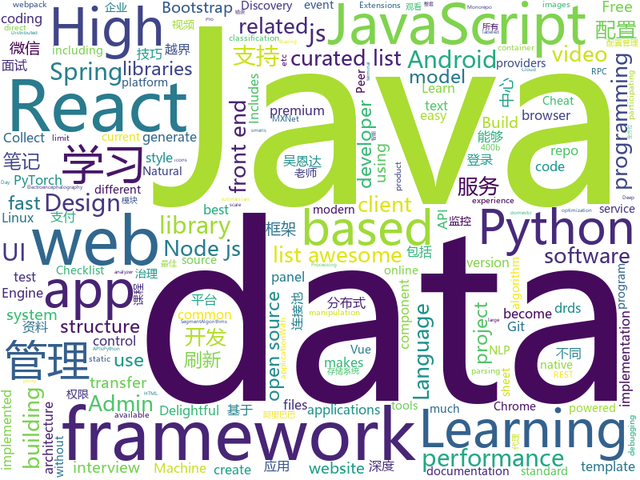

# 2018-07-26
See what the GitHub community is most excited about today.

## python
* [Photon](https://github.com/s0md3v/Photon)(**475 stars today**): Incredibly fast crawler which extracts urls, emails, files, website accounts and much more.
* [system-design-primer](https://github.com/donnemartin/system-design-primer)(**192 stars today**): Learn how to design large-scale systems. Prep for the system design interview. Includes Anki flashcards.
* [NeuralTuringMachine](https://github.com/MarkPKCollier/NeuralTuringMachine)(**154 stars today**): Tensorflow implementation of a Neural Turing Machine
* [cheat.sh](https://github.com/chubin/cheat.sh)(**144 stars today**): the only cheat sheet you need
* [lore](https://github.com/instacart/lore)(**135 stars today**): Lore makes machine learning approachable for Software Engineers and maintainable for Machine Learning Researchers
* [models](https://github.com/tensorflow/models)(**85 stars today**): Models and examples built with TensorFlow
* [dirhunt](https://github.com/Nekmo/dirhunt)(**97 stars today**): Find web directories without bruteforce
* [pytorch-maml-rl](https://github.com/tristandeleu/pytorch-maml-rl)(**96 stars today**): Reinforcement Learning with Model-Agnostic Meta-Learning in Pytorch
* [dvc](https://github.com/iterative/dvc)(**92 stars today**): Data Science Version Control - Git for data scientists
* [finetune](https://github.com/IndicoDataSolutions/finetune)(**77 stars today**): Scikit-learn style model finetuning for NLP
* [pylint](https://github.com/PyCQA/pylint)(**51 stars today**): A Python source code analyzer which looks for programming errors, helps enforcing a coding standard and sniffs for some code smells
* [gluon-tutorials-zh](https://github.com/mli/gluon-tutorials-zh)(**43 stars today**): 通过 MXNet / Gluon 来动手学习深度学习
* [keras](https://github.com/keras-team/keras)(**39 stars today**): Deep Learning for humans
* [public-apis](https://github.com/toddmotto/public-apis)(**47 stars today**): A collective list of public JSON APIs for use in web development.
* [awesome-python](https://github.com/vinta/awesome-python)(**40 stars today**): A curated list of awesome Python frameworks, libraries, software and resources
* [youtube-dl](https://github.com/rg3/youtube-dl)(**43 stars today**): Command-line program to download videos from YouTube.com and other video sites
* [learn-python3](https://github.com/jerry-git/learn-python3)(**41 stars today**): Jupyter notebooks for teaching/learning Python 3
* [flask](https://github.com/pallets/flask)(**39 stars today**): The Python micro framework for building web applications.
* [XX-Net](https://github.com/XX-net/XX-Net)(**40 stars today**): a web proxy tool
* [requests](https://github.com/requests/requests)(**35 stars today**): Python HTTP Requests for Humans™✨🍰✨
* [Mask-RCNN](https://github.com/wannabeOG/Mask-RCNN)(**38 stars today**): A PyTorch implementation of the architecture of Mask RCNN, serves as an introduction to working with PyTorch
* [decaNLP](https://github.com/salesforce/decaNLP)(**36 stars today**): The Natural Language Decathlon: A Multitask Challenge for NLP
* [cpython](https://github.com/python/cpython)(**27 stars today**): The Python programming language
* [mne-python](https://github.com/mne-tools/mne-python)(**38 stars today**): MNE : Magnetoencephalography (MEG) and Electroencephalography (EEG) in Python
* [pandas](https://github.com/pandas-dev/pandas)(**34 stars today**): Flexible and powerful data analysis / manipulation library for Python, providing labeled data structures similar to R data.frame objects, statistical functions, and much more

## java
* [Java-Interview](https://github.com/crossoverJie/Java-Interview)(**122 stars today**): 👨‍🎓Java related : basic, concurrent, algorithm
* [data-transfer-project](https://github.com/google/data-transfer-project)(**99 stars today**): The Data Transfer Project makes it easy for people to transfer their data between online service providers. We are establishing a common framework, including data models and protocols, to enable direct transfer of data both into and out of participating online service providers.
* [Sentinel](https://github.com/alibaba/Sentinel)(**74 stars today**): 高可用防护的流量管理框架
* [vjtools](https://github.com/vipshop/vjtools)(**61 stars today**): The vip.com's java coding standard, libraries and tools
* [elasticsearch](https://github.com/elastic/elasticsearch)(**59 stars today**): Open Source, Distributed, RESTful Search Engine
* [GradientDrawableTuner](https://github.com/duanhong169/GradientDrawableTuner)(**55 stars today**): 🕹️See how the properties of `GradientDrawable` affect the Drawable's appearance, intuitively.
* [proxyee-down](https://github.com/proxyee-down-org/proxyee-down)(**45 stars today**): http下载工具，基于http代理，支持多连接分块下载
* [spring-boot](https://github.com/spring-projects/spring-boot)(**36 stars today**): Spring Boot
* [apollo](https://github.com/ctripcorp/apollo)(**38 stars today**): Apollo（阿波罗）是携程框架部门研发的分布式配置中心，能够集中化管理应用不同环境、不同集群的配置，配置修改后能够实时推送到应用端，并且具备规范的权限、流程治理等特性，适用于微服务配置管理场景。
* [spring-framework](https://github.com/spring-projects/spring-framework)(**31 stars today**): Spring Framework
* [tutorials](https://github.com/eugenp/tutorials)(**23 stars today**): The "REST With Spring" Course:
* [Java](https://github.com/TheAlgorithms/Java)(**30 stars today**): All Algorithms implemented in Java
* [SmartRefreshLayout](https://github.com/scwang90/SmartRefreshLayout)(**31 stars today**): 🔥下拉刷新、上拉加载、二级刷新、淘宝二楼、RefreshLayout、OverScroll，Android智能下拉刷新框架，支持越界回弹、越界拖动，具有极强的扩展性，集成了几十种炫酷的Header和 Footer。
* [druid](https://github.com/alibaba/druid)(**30 stars today**): ♨️为监控而生的数据库连接池！阿里云DRDS(https://www.aliyun.com/product/drds )、阿里巴巴TDDL 连接池powered by Druid
* [incubator-dubbo](https://github.com/apache/incubator-dubbo)(**24 stars today**): Apache Dubbo (incubating) is a high-performance, java based, open source RPC framework.
* [jib](https://github.com/GoogleContainerTools/jib)(**30 stars today**): ⛵️Build container images for your Java applications.
* [RxJava](https://github.com/ReactiveX/RxJava)(**30 stars today**): RxJava – Reactive Extensions for the JVM – a library for composing asynchronous and event-based programs using observable sequences for the Java VM.
* [AndroidUtilCode](https://github.com/Blankj/AndroidUtilCode)(**28 stars today**): 🔥Android developers should collect the following utils(updating).
* [zheng](https://github.com/shuzheng/zheng)(**25 stars today**): 基于Spring+SpringMVC+Mybatis分布式敏捷开发系统架构，提供整套公共微服务服务模块：集中权限管理（单点登录）、内容管理、支付中心、用户管理（支持第三方登录）、微信平台、存储系统、配置中心、日志分析、任务和通知等，支持服务治理、监控和追踪，努力为中小型企业打造全方位J2EE企业级开发解决方案。
* [java-tips](https://github.com/biezhi/java-tips)(**29 stars today**): Java 语言编程技巧、最佳实践
* [Android-Cheat-sheet](https://github.com/anitaa1990/Android-Cheat-sheet)(**26 stars today**): Cheat Sheet for Android Interviews
* [Discovery](https://github.com/Nepxion/Discovery)(**24 stars today**): Nepxion Discovery is an enhancement for Spring Cloud Discovery on Eureka + Consul + Zookeeper, support count limit, ip address filter, gray multi-versions control
* [retrofit](https://github.com/square/retrofit)(**25 stars today**): Type-safe HTTP client for Android and Java by Square, Inc.
* [leakcanary](https://github.com/square/leakcanary)(**26 stars today**): A memory leak detection library for Android and Java.
* [weixin-java-tools](https://github.com/Wechat-Group/weixin-java-tools)(**22 stars today**): 全能微信Java开发工具包，支持包括微信支付、开放平台、小程序、企业号和公众号等的开发

## unknown
* [Front-End-Performance-Checklist](https://github.com/thedaviddias/Front-End-Performance-Checklist)(**655 stars today**): 🎮The only Front-End Performance Checklist that runs faster than the others
* [rockstar](https://github.com/dylanbeattie/rockstar)(**371 stars today**): The Rockstar programming language specification
* [InterviewMap](https://github.com/InterviewMap/InterviewMap)(**243 stars today**): Build the best interview map. The current content includes JS, network, browser related, performance optimization, security, framework, Git, data structure, algorithm, etc.
* [Interview-Notebook](https://github.com/CyC2018/Interview-Notebook)(**128 stars today**): 📝准备秋招学习笔记
* [get-out](https://github.com/gnijuohz/get-out)(**97 stars today**): A guide
* [gitignore](https://github.com/github/gitignore)(**54 stars today**): A collection of useful .gitignore templates
* [react-developer-roadmap](https://github.com/adam-golab/react-developer-roadmap)(**70 stars today**): Roadmap to becoming a React developer in 2018
* [awesome](https://github.com/sindresorhus/awesome)(**69 stars today**): 😎Curated list of awesome lists
* [architect-awesome](https://github.com/xingshaocheng/architect-awesome)(**54 stars today**): 后端架构师技术图谱
* [NLP-progress](https://github.com/sebastianruder/NLP-progress)(**57 stars today**): Repository to track the progress in Natural Language Processing (NLP), including the datasets and the current state-of-the-art for the most common NLP tasks.
* [grokking-pytorch](https://github.com/Kaixhin/grokking-pytorch)(**61 stars today**): How to think about PyTorch
* [free-programming-books](https://github.com/EbookFoundation/free-programming-books)(**48 stars today**): 📚Freely available programming books
* [build-your-own-x](https://github.com/danistefanovic/build-your-own-x)(**55 stars today**): 🤓Build your own (insert technology here)
* [awesome-vue](https://github.com/vuejs/awesome-vue)(**47 stars today**): 🎉A curated list of awesome things related to Vue.js
* [project-based-learning](https://github.com/tuvtran/project-based-learning)(**47 stars today**): Curated list of project-based tutorials
* [Tars.js](https://github.com/tars-node/Tars.js)(**32 stars today**): Tars.js Menu&Doc
* [awesome-scalability](https://github.com/binhnguyennus/awesome-scalability)(**29 stars today**): High Scalability, High Availability, High Stability, High Performance, and High Intelligence System Design Patterns
* [nodelover-maps](https://github.com/MiYogurt/nodelover-maps)(**28 stars today**): 📅how to become fullstack developer?
* [awesome-monorepo](https://github.com/korfuri/awesome-monorepo)(**28 stars today**): A curated list of awesome Monorepo tools, software and architectures.
* [ipfs](https://github.com/ipfs/ipfs)(**26 stars today**): Peer-to-peer hypermedia protocol
* [Front-end-Developer-Interview-Questions](https://github.com/h5bp/Front-end-Developer-Interview-Questions)(**22 stars today**): A list of helpful front-end related questions you can use to interview potential candidates, test yourself or completely ignore.
* [awesome-nodejs](https://github.com/sindresorhus/awesome-nodejs)(**22 stars today**): ⚡️Delightful Node.js packages and resources
* [awesome-flutter](https://github.com/Solido/awesome-flutter)(**22 stars today**): An awesome list that curates the best Flutter libraries, tools, tutorials, articles and more.
* [java_interview_manual](https://github.com/guanzhenxing/java_interview_manual)(**20 stars today**): Java面试手册
* [Best-App](https://github.com/hzlzh/Best-App)(**20 stars today**): 收集&推荐优秀的 Apps/硬件/技巧/周边等

## javascript
* [ndb](https://github.com/GoogleChromeLabs/ndb)(**424 stars today**): ndb is an improved debugging experience for Node.js, enabled by Chrome DevTools
* [evergreen](https://github.com/segmentio/evergreen)(**232 stars today**): 🌲Evergreen React UI Framework by Segment
* [javascript-algorithms](https://github.com/trekhleb/javascript-algorithms)(**201 stars today**): Algorithms and data structures implemented in JavaScript with explanations and links to further readings
* [ivideo](https://github.com/phobal/ivideo)(**171 stars today**): 一个可以观看国内主流视频平台所有视频的客户端（Mac、Windows、Linux） A client that can watch video of domestic(China) mainstream video platform
* [vue](https://github.com/vuejs/vue)(**163 stars today**): 🖖A progressive, incrementally-adoptable JavaScript framework for building UI on the web.
* [vialer-js](https://github.com/vialer/vialer-js)(**149 stars today**): Pluggable WebRTC communication platform.
* [Front-End-Checklist](https://github.com/thedaviddias/Front-End-Checklist)(**138 stars today**): 🗂The perfect Front-End Checklist for modern websites and meticulous developers
* [react](https://github.com/facebook/react)(**98 stars today**): A declarative, efficient, and flexible JavaScript library for building user interfaces.
* [trends](https://github.com/hanford/trends)(**103 stars today**): ultra high performance github trending application
* [ContosoUniversityDotNetCore-Pages](https://github.com/jbogard/ContosoUniversityDotNetCore-Pages)(**98 stars today**): With Razor Pages
* [little-big-city](https://github.com/pissang/little-big-city)(**96 stars today**): 
* [create-react-app](https://github.com/facebook/create-react-app)(**70 stars today**): Create React apps with no build configuration.
* [puppeteer](https://github.com/GoogleChrome/puppeteer)(**78 stars today**): Headless Chrome Node API
* [axios](https://github.com/axios/axios)(**77 stars today**): Promise based HTTP client for the browser and node.js
* [react-pdf](https://github.com/diegomura/react-pdf)(**78 stars today**): 📄Create PDF files using React
* [gatsby](https://github.com/gatsbyjs/gatsby)(**71 stars today**): ⚛️📄🚀Blazing fast static site generator for React
* [terminalizer](https://github.com/faressoft/terminalizer)(**73 stars today**): Record your terminal and generate animated gif images
* [react-native](https://github.com/facebook/react-native)(**60 stars today**): A framework for building native apps with React.
* [storybook](https://github.com/storybooks/storybook)(**56 stars today**): Interactive UI component dev & test: React, React Native, Vue, Angular
* [node](https://github.com/nodejs/node)(**56 stars today**): Node.js JavaScript runtime✨🐢🚀✨
* [unswitch](https://github.com/vaneenige/unswitch)(**57 stars today**): 🕹A tiny (400b) event handler for Switch controllers on the web!
* [v8n](https://github.com/imbrn/v8n)(**55 stars today**): ☑️JavaScript fluent validation library.
* [jest](https://github.com/facebook/jest)(**50 stars today**): 🃏Delightful JavaScript Testing.
* [react-text-selection-popover](https://github.com/juliankrispel/react-text-selection-popover)(**51 stars today**): Selection based Text UI made easy
* [ant-design-pro](https://github.com/ant-design/ant-design-pro)(**45 stars today**): 👨🏻‍💻👩🏻‍💻 Use Ant Design like a Pro!

## html
* [website](https://github.com/kubernetes/website)(**60 stars today**): Kubernetes website and documentation repo:
* [awesome-mac](https://github.com/jaywcjlove/awesome-mac)(**42 stars today**):  Now we have become very big, Different from the original idea. Collect premium software in various categories.
* [styleguide](https://github.com/google/styleguide)(**37 stars today**): Style guides for Google-originated open-source projects
* [AdminLTE](https://github.com/almasaeed2010/AdminLTE)(**30 stars today**): AdminLTE - Free Premium Admin control Panel Theme Based On Bootstrap 3.x
* [portainer](https://github.com/portainer/portainer)(**21 stars today**): Simple management UI for Docker
* [fastText](https://github.com/facebookresearch/fastText)(**16 stars today**): Library for fast text representation and classification.
* [Spoon-Knife](https://github.com/octocat/Spoon-Knife)(****): This repo is for demonstration purposes only.
* [JavaScript30](https://github.com/wesbos/JavaScript30)(**7 stars today**): 30 Day Vanilla JS Challenge
* [swagger-codegen](https://github.com/swagger-api/swagger-codegen)(**12 stars today**): swagger-codegen contains a template-driven engine to generate documentation, API clients and server stubs in different languages by parsing your OpenAPI / Swagger definition.
* [gentelella](https://github.com/puikinsh/gentelella)(**12 stars today**): Free Bootstrap 3 Admin Template
* [Coursera-ML-AndrewNg-Notes](https://github.com/fengdu78/Coursera-ML-AndrewNg-Notes)(**10 stars today**): 吴恩达老师的机器学习课程个人笔记
* [electron-api-demos](https://github.com/electron/electron-api-demos)(**9 stars today**): Explore the Electron APIs
* [aozorabunko](https://github.com/aozorabunko/aozorabunko)(**10 stars today**): 
* [DA_projects](https://github.com/Ctipsy/DA_projects)(**6 stars today**): Python projects for Data Analysis
* [deeplearning_ai_books](https://github.com/fengdu78/deeplearning_ai_books)(**7 stars today**): deeplearning.ai（吴恩达老师的深度学习课程笔记及资源）
* [ng-alain](https://github.com/cipchk/ng-alain)(**7 stars today**): ng-zorro-antd admin panel front-end framework
* [react-app-rewired](https://github.com/timarney/react-app-rewired)(**8 stars today**): Override create-react-app webpack configs without ejecting
* [coreui-free-bootstrap-admin-template](https://github.com/coreui/coreui-free-bootstrap-admin-template)(**8 stars today**): CoreUI is free bootstrap admin template
* [PHP-Interview](https://github.com/xianyunyh/PHP-Interview)(**7 stars today**): PHP面试整理的资料。包括PHP、MySQL、Linux、计算机网络等资料,欢迎提交pr，如果错误，请指出，谢谢
* [nodejs-ex](https://github.com/sclorg/nodejs-ex)(****): node.js example
* [javascript-tutorial-en](https://github.com/iliakan/javascript-tutorial-en)(**7 stars today**): Modern JavaScript Tutorial
* [simple-icons](https://github.com/simple-icons/simple-icons)(**6 stars today**): SVG icons for popular brands
* [Winds](https://github.com/GetStream/Winds)(**7 stars today**): A Beautiful Open Source RSS & Podcast App Powered by Getstream.io
* [polymer](https://github.com/Polymer/polymer)(**7 stars today**): Build modern apps using web components
* [material-design-lite](https://github.com/google/material-design-lite)(****): Material Design Components in HTML/CSS/JS

## WordCloud

