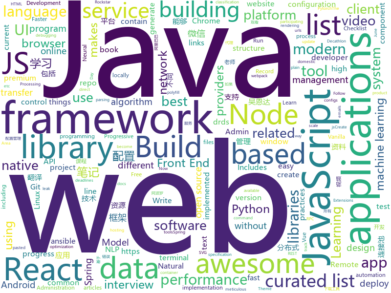

# 2018-07-27
See what the GitHub community is most excited about today.

## python
* [Photon](https://github.com/s0md3v/Photon)(**372 stars today**): Incredibly fast crawler which extracts urls, emails, files, website accounts and much more.
* [system-design-primer](https://github.com/donnemartin/system-design-primer)(**151 stars today**): Learn how to design large-scale systems. Prep for the system design interview. Includes Anki flashcards.
* [cheat.sh](https://github.com/chubin/cheat.sh)(**159 stars today**): the only cheat sheet you need
* [lore](https://github.com/instacart/lore)(**127 stars today**): Lore makes machine learning approachable for Software Engineers and maintainable for Machine Learning Researchers
* [NeuralTuringMachine](https://github.com/MarkPKCollier/NeuralTuringMachine)(**110 stars today**): Tensorflow implementation of a Neural Turing Machine
* [models](https://github.com/tensorflow/models)(**65 stars today**): Models and examples built with TensorFlow
* [attrs](https://github.com/python-attrs/attrs)(**60 stars today**): Python Classes Without Boilerplate
* [supervisely](https://github.com/supervisely/supervisely)(**58 stars today**): AI for everyone!🎉Neural networks, tools and a library we use in Supervisely
* [InstaPy](https://github.com/timgrossmann/InstaPy)(**54 stars today**): 📷Instagram Bot - Like/Comment/Follow Automation Script
* [youtube-dl](https://github.com/rg3/youtube-dl)(**46 stars today**): Command-line program to download videos from YouTube.com and other video sites
* [dirhunt](https://github.com/Nekmo/dirhunt)(**44 stars today**): Find web directories without bruteforce
* [awesome-python](https://github.com/vinta/awesome-python)(**40 stars today**): A curated list of awesome Python frameworks, libraries, software and resources
* [keras](https://github.com/keras-team/keras)(**35 stars today**): Deep Learning for humans
* [dvc](https://github.com/iterative/dvc)(**41 stars today**): Data Science Version Control - Git for data scientists
* [byob](https://github.com/colental/byob)(**37 stars today**): BYOB (Build Your Own Botnet)
* [decaNLP](https://github.com/salesforce/decaNLP)(**38 stars today**): The Natural Language Decathlon: A Multitask Challenge for NLP
* [ansible](https://github.com/ansible/ansible)(**33 stars today**): Ansible is a radically simple IT automation platform that makes your applications and systems easier to deploy. Avoid writing scripts or custom code to deploy and update your applications — automate in a language that approaches plain English, using SSH, with no agents to install on remote systems. https://docs.ansible.com/ansible/
* [pipenv](https://github.com/pypa/pipenv)(**38 stars today**): Python Development Workflow for Humans.
* [scikit-learn](https://github.com/scikit-learn/scikit-learn)(**30 stars today**): scikit-learn: machine learning in Python
* [public-apis](https://github.com/toddmotto/public-apis)(**35 stars today**): A collective list of public JSON APIs for use in web development.
* [pytorch-maml-rl](https://github.com/tristandeleu/pytorch-maml-rl)(**36 stars today**): Reinforcement Learning with Model-Agnostic Meta-Learning in Pytorch
* [flask](https://github.com/pallets/flask)(**30 stars today**): The Python micro framework for building web applications.
* [django](https://github.com/django/django)(**29 stars today**): The Web framework for perfectionists with deadlines.
* [EvilOSX](https://github.com/Marten4n6/EvilOSX)(**31 stars today**): An evil RAT (Remote Administration Tool) for macOS / OS X.
* [termtosvg](https://github.com/nbedos/termtosvg)(**31 stars today**): Record terminal sessions as SVG animations

## java
* [Java-Interview](https://github.com/crossoverJie/Java-Interview)(**130 stars today**): 👨‍🎓Java related : basic, concurrent, algorithm
* [Sentinel](https://github.com/alibaba/Sentinel)(**113 stars today**): 高可用防护的流量管理框架
* [vjtools](https://github.com/vipshop/vjtools)(**71 stars today**): The vip.com's java coding standard, libraries and tools
* [spring-boot](https://github.com/spring-projects/spring-boot)(**44 stars today**): Spring Boot
* [data-transfer-project](https://github.com/google/data-transfer-project)(**48 stars today**): The Data Transfer Project makes it easy for people to transfer their data between online service providers. We are establishing a common framework, including data models and protocols, to enable direct transfer of data both into and out of participating online service providers.
* [graal](https://github.com/oracle/graal)(**47 stars today**): GraalVM: Run Programs Faster Anywhere🚀
* [elasticsearch](https://github.com/elastic/elasticsearch)(**44 stars today**): Open Source, Distributed, RESTful Search Engine
* [tutorials](https://github.com/eugenp/tutorials)(**28 stars today**): The "REST With Spring" Course:
* [weixin-java-tools](https://github.com/Wechat-Group/weixin-java-tools)(**40 stars today**): 全能微信Java开发工具包，支持包括微信支付、开放平台、小程序、企业号和公众号等的开发
* [proxyee-down](https://github.com/proxyee-down-org/proxyee-down)(**41 stars today**): http下载工具，基于http代理，支持多连接分块下载
* [incubator-dubbo](https://github.com/apache/incubator-dubbo)(**35 stars today**): Apache Dubbo (incubating) is a high-performance, java based, open source RPC framework.
* [Java](https://github.com/TheAlgorithms/Java)(**34 stars today**): All Algorithms implemented in Java
* [guava](https://github.com/google/guava)(**37 stars today**): Google core libraries for Java
* [jib](https://github.com/GoogleContainerTools/jib)(**36 stars today**): ⛵️Build container images for your Java applications.
* [spring-framework](https://github.com/spring-projects/spring-framework)(**29 stars today**): Spring Framework
* [leakcanary](https://github.com/square/leakcanary)(**30 stars today**): A memory leak detection library for Android and Java.
* [apollo](https://github.com/ctripcorp/apollo)(**24 stars today**): Apollo（阿波罗）是携程框架部门研发的分布式配置中心，能够集中化管理应用不同环境、不同集群的配置，配置修改后能够实时推送到应用端，并且具备规范的权限、流程治理等特性，适用于微服务配置管理场景。
* [spring-boot-admin](https://github.com/codecentric/spring-boot-admin)(**27 stars today**): Admin UI for administration of spring boot applications
* [hmily](https://github.com/yu199195/hmily)(**27 stars today**): TCC分布式事务框架(try,confirm,cancel)
* [druid](https://github.com/alibaba/druid)(**24 stars today**): ♨️为监控而生的数据库连接池！阿里云DRDS(https://www.aliyun.com/product/drds )、阿里巴巴TDDL 连接池powered by Druid
* [java-tron](https://github.com/tronprotocol/java-tron)(**27 stars today**): Java implementation of the Tron whitepaper
* [nacos](https://github.com/alibaba/nacos)(**25 stars today**): an easy-to-use dynamic service discovery, configuration and service management platform for building cloud native applications
* [RxJava](https://github.com/ReactiveX/RxJava)(**24 stars today**): RxJava – Reactive Extensions for the JVM – a library for composing asynchronous and event-based programs using observable sequences for the Java VM.
* [zxing](https://github.com/zxing/zxing)(**25 stars today**): ZXing ("Zebra Crossing") barcode scanning library for Java, Android
* [okhttp](https://github.com/square/okhttp)(**21 stars today**): An HTTP+HTTP/2 client for Android and Java applications.

## unknown
* [Front-End-Performance-Checklist](https://github.com/thedaviddias/Front-End-Performance-Checklist)(**455 stars today**): 🎮The only Front-End Performance Checklist that runs faster than the others
* [rockstar](https://github.com/dylanbeattie/rockstar)(**230 stars today**): The Rockstar programming language specification
* [Interview-Notebook](https://github.com/CyC2018/Interview-Notebook)(**158 stars today**): 📝准备秋招学习笔记
* [InterviewMap](https://github.com/InterviewMap/InterviewMap)(**164 stars today**): Build the best interview map. The current content includes JS, network, browser related, performance optimization, security, framework, Git, data structure, algorithm, etc.
* [gitignore](https://github.com/github/gitignore)(**60 stars today**): A collection of useful .gitignore templates
* [You-Dont-Know-JS](https://github.com/getify/You-Dont-Know-JS)(**59 stars today**): A book series on JavaScript. @YDKJS on twitter.
* [awesome](https://github.com/sindresorhus/awesome)(**61 stars today**): 😎Curated list of awesome lists
* [architect-awesome](https://github.com/xingshaocheng/architect-awesome)(**53 stars today**): 后端架构师技术图谱
* [free-programming-books](https://github.com/EbookFoundation/free-programming-books)(**46 stars today**): 📚Freely available programming books
* [react-developer-roadmap](https://github.com/adam-golab/react-developer-roadmap)(**53 stars today**): Roadmap to becoming a React developer in 2018
* [build-your-own-x](https://github.com/danistefanovic/build-your-own-x)(**51 stars today**): 🤓Build your own (insert technology here)
* [project-based-learning](https://github.com/tuvtran/project-based-learning)(**39 stars today**): Curated list of project-based tutorials
* [awesome-flutter](https://github.com/Solido/awesome-flutter)(**39 stars today**): An awesome list that curates the best Flutter libraries, tools, tutorials, articles and more.
* [NLP-progress](https://github.com/sebastianruder/NLP-progress)(**32 stars today**): Repository to track the progress in Natural Language Processing (NLP), including the datasets and the current state-of-the-art for the most common NLP tasks.
* [articles-zh-Hans](https://github.com/NSHipster/articles-zh-Hans)(**35 stars today**): Articles for NSHipster.cn
* [awesome-vue](https://github.com/vuejs/awesome-vue)(**31 stars today**): 🎉A curated list of awesome things related to Vue.js
* [nocode](https://github.com/kelseyhightower/nocode)(**30 stars today**): The best way to write secure and reliable applications. Write nothing; deploy nowhere.
* [nodebestpractices](https://github.com/i0natan/nodebestpractices)(**29 stars today**): The largest Node.JS best practices list (June 2018)
* [play_with_llvm](https://github.com/tuoxie007/play_with_llvm)(**29 stars today**): Book of《玩转LLVM》
* [fast-p](https://github.com/bellecp/fast-p)(**27 stars today**): 
* [gold-miner](https://github.com/xitu/gold-miner)(**25 stars today**): 🥇掘金翻译计划，可能是世界最大最好的英译中技术社区，最懂读者和译者的翻译平台：
* [awesome-cpp](https://github.com/fffaraz/awesome-cpp)(**24 stars today**): A curated list of awesome C++ (or C) frameworks, libraries, resources, and shiny things. Inspired by awesome-... stuff.
* [Front-end-Developer-Interview-Questions](https://github.com/h5bp/Front-end-Developer-Interview-Questions)(**24 stars today**): A list of helpful front-end related questions you can use to interview potential candidates, test yourself or completely ignore.
* [the-art-of-command-line](https://github.com/jlevy/the-art-of-command-line)(**25 stars today**): Master the command line, in one page
* [awesome-nodejs](https://github.com/sindresorhus/awesome-nodejs)(**24 stars today**): ⚡️Delightful Node.js packages and resources

## javascript
* [ndb](https://github.com/GoogleChromeLabs/ndb)(**372 stars today**): ndb is an improved debugging experience for Node.js, enabled by Chrome DevTools
* [javascript-algorithms](https://github.com/trekhleb/javascript-algorithms)(**203 stars today**): Algorithms and data structures implemented in JavaScript with explanations and links to further readings
* [Front-End-Checklist](https://github.com/thedaviddias/Front-End-Checklist)(**196 stars today**): 🗂The perfect Front-End Checklist for modern websites and meticulous developers
* [evergreen](https://github.com/segmentio/evergreen)(**183 stars today**): 🌲Evergreen React UI Framework by Segment
* [vue](https://github.com/vuejs/vue)(**149 stars today**): 🖖A progressive, incrementally-adoptable JavaScript framework for building UI on the web.
* [ivideo](https://github.com/phobal/ivideo)(**134 stars today**): 一个可以观看国内主流视频平台所有视频的客户端（Mac、Windows、Linux） A client that can watch video of domestic(China) mainstream video platform
* [terminalizer](https://github.com/faressoft/terminalizer)(**146 stars today**): 🦄Record your terminal and generate animated gif images
* [jsinspect](https://github.com/danielstjules/jsinspect)(**141 stars today**): Detect copy-pasted and structurally similar code
* [react](https://github.com/facebook/react)(**111 stars today**): A declarative, efficient, and flexible JavaScript library for building user interfaces.
* [fetch](https://github.com/github/fetch)(**89 stars today**): A window.fetch JavaScript polyfill.
* [trends](https://github.com/hanford/trends)(**86 stars today**): ultra high performance github trending application
* [axios](https://github.com/axios/axios)(**80 stars today**): Promise based HTTP client for the browser and node.js
* [create-react-app](https://github.com/facebook/create-react-app)(**68 stars today**): Create React apps with no build configuration.
* [awesome-selfhosted](https://github.com/Kickball/awesome-selfhosted)(**74 stars today**): This is a list of Free Software network services and web applications which can be hosted locally. Selfhosting is the process of locally hosting and managing applications instead of renting from SaaS providers.
* [prepack](https://github.com/facebook/prepack)(**73 stars today**): A JavaScript bundle optimizer.
* [storybook](https://github.com/storybooks/storybook)(**68 stars today**): Interactive UI component dev & test: React, React Native, Vue, Angular
* [node](https://github.com/nodejs/node)(**54 stars today**): Node.js JavaScript runtime✨🐢🚀✨
* [puppeteer](https://github.com/GoogleChrome/puppeteer)(**60 stars today**): Headless Chrome Node API
* [three.js](https://github.com/mrdoob/three.js)(**47 stars today**): JavaScript 3D library.
* [react-native](https://github.com/facebook/react-native)(**48 stars today**): A framework for building native apps with React.
* [lodash](https://github.com/lodash/lodash)(**51 stars today**): A modern JavaScript utility library delivering modularity, performance, & extras.
* [awesome-wechat-weapp](https://github.com/justjavac/awesome-wechat-weapp)(**46 stars today**): 微信小程序开发资源汇总💯
* [little-big-city](https://github.com/pissang/little-big-city)(**48 stars today**): 
* [node-inline-cpp](https://github.com/vshymanskyy/node-inline-cpp)(**49 stars today**): Inline C++ with Node.js
* [browsh](https://github.com/browsh-org/browsh)(**48 stars today**): A fully-modern text-based browser, rendering to TTY and browsers

## html
* [Reddit-Job-Search](https://github.com/anis-coding/Reddit-Job-Search)(**40 stars today**): An online tool to find jobs on Reddit
* [awesome-mac](https://github.com/jaywcjlove/awesome-mac)(**38 stars today**):  Now we have become very big, Different from the original idea. Collect premium software in various categories.
* [styleguide](https://github.com/google/styleguide)(**23 stars today**): Style guides for Google-originated open-source projects
* [portainer](https://github.com/portainer/portainer)(**26 stars today**): Simple management UI for Docker
* [deeplearning_ai_books](https://github.com/fengdu78/deeplearning_ai_books)(**20 stars today**): deeplearning.ai（吴恩达老师的深度学习课程笔记及资源）
* [small](https://github.com/mathiasbynens/small)(**20 stars today**): Smallest possible syntactically valid files of different types
* [Coursera-ML-AndrewNg-Notes](https://github.com/fengdu78/Coursera-ML-AndrewNg-Notes)(**15 stars today**): 吴恩达老师的机器学习课程个人笔记
* [AdminLTE](https://github.com/almasaeed2010/AdminLTE)(**17 stars today**): AdminLTE - Free Premium Admin control Panel Theme Based On Bootstrap 3.x
* [PHP-Interview](https://github.com/xianyunyh/PHP-Interview)(**14 stars today**): PHP面试整理的资料。包括PHP、MySQL、Linux、计算机网络等资料,欢迎提交pr，如果错误，请指出，谢谢
* [fastText](https://github.com/facebookresearch/fastText)(**13 stars today**): Library for fast text representation and classification.
* [polymer](https://github.com/Polymer/polymer)(**15 stars today**): Build modern apps using web components
* [Spoon-Knife](https://github.com/octocat/Spoon-Knife)(****): This repo is for demonstration purposes only.
* [JavaScript30](https://github.com/wesbos/JavaScript30)(**8 stars today**): 30 Day Vanilla JS Challenge
* [mixed_model_workshop](https://github.com/singmann/mixed_model_workshop)(**15 stars today**): Materials for my Mixed Model Workshop
* [electron-api-demos](https://github.com/electron/electron-api-demos)(**12 stars today**): Explore the Electron APIs
* [learning-area](https://github.com/mdn/learning-area)(**6 stars today**): Github repo for the MDN Learning Area.
* [itty-bitty](https://github.com/alcor/itty-bitty)(**11 stars today**): Itty.bitty is a tool to create links that contain small sites
* [swagger-codegen](https://github.com/swagger-api/swagger-codegen)(**10 stars today**): swagger-codegen contains a template-driven engine to generate documentation, API clients and server stubs in different languages by parsing your OpenAPI / Swagger definition.
* [capacitor](https://github.com/ionic-team/capacitor)(**11 stars today**): Build cross-platform Native Progressive Web Apps for iOS, Android, and the web⚡️
* [react-app-rewired](https://github.com/timarney/react-app-rewired)(**10 stars today**): Override create-react-app webpack configs without ejecting
* [dom-wait](https://github.com/f/dom-wait)(**10 stars today**): Complex Loader and Progress Management for Vanilla JS
* [ecma262](https://github.com/tc39/ecma262)(**9 stars today**): Status, process, and documents for ECMA262
* [WebFundamentals](https://github.com/google/WebFundamentals)(**8 stars today**): Best practices for modern web development
* [component](https://github.com/reactions/component)(**8 stars today**): Declarative version of React.Component
* [material-design-lite](https://github.com/google/material-design-lite)(****): Material Design Components in HTML/CSS/JS

## WordCloud

