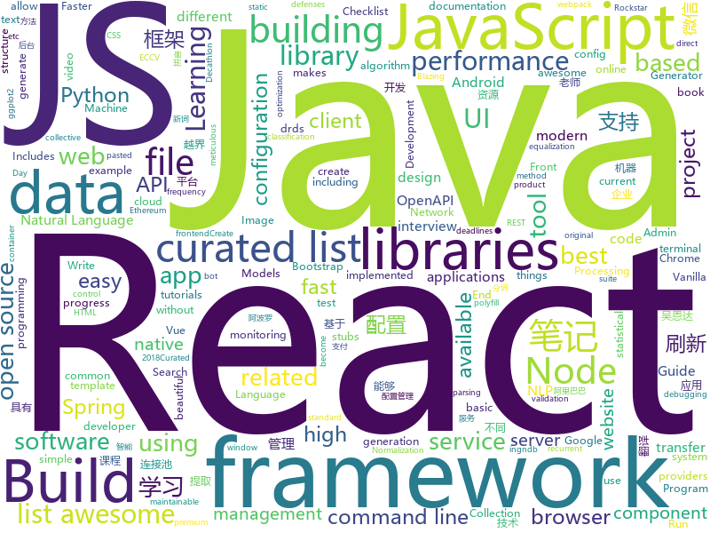

# 2018-07-28
See what the GitHub community is most excited about today.

## python
* [termgraph](https://github.com/mkaz/termgraph)(**464 stars today**): a python command-line tool which draws basic graphs in the terminal
* [system-design-primer](https://github.com/donnemartin/system-design-primer)(**221 stars today**): Learn how to design large-scale systems. Prep for the system design interview. Includes Anki flashcards.
* [Photon](https://github.com/s0md3v/Photon)(**221 stars today**): Incredibly fast crawler which extracts urls, emails, files, website accounts and much more.
* [byob](https://github.com/colental/byob)(**179 stars today**): BYOB (Build Your Own Botnet)
* [zulip](https://github.com/zulip/zulip)(**140 stars today**): Zulip server - powerful open source team chat
* [cheat.sh](https://github.com/chubin/cheat.sh)(**115 stars today**): the only cheat sheet you need
* [IBN-Net](https://github.com/XingangPan/IBN-Net)(**89 stars today**): Instance-Batch Normalization Networks (ECCV2018)
* [models](https://github.com/tensorflow/models)(**55 stars today**): Models and examples built with TensorFlow
* [lore](https://github.com/instacart/lore)(**71 stars today**): Lore makes machine learning approachable for Software Engineers and maintainable for Machine Learning Researchers
* [decaNLP](https://github.com/salesforce/decaNLP)(**57 stars today**): The Natural Language Decathlon: A Multitask Challenge for NLP
* [GANimation](https://github.com/albertpumarola/GANimation)(**55 stars today**): GANimation: Anatomically-aware Facial Animation from a Single Image (ECCV'18 Oral)
* [awesome-python](https://github.com/vinta/awesome-python)(**47 stars today**): A curated list of awesome Python frameworks, libraries, software and resources
* [attrs](https://github.com/python-attrs/attrs)(**52 stars today**): Python Classes Without Boilerplate
* [cleverhans](https://github.com/tensorflow/cleverhans)(**47 stars today**): An adversarial example library for constructing attacks, building defenses, and benchmarking both
* [spaCy](https://github.com/explosion/spaCy)(**47 stars today**): 💫Industrial-strength Natural Language Processing (NLP) with Python and Cython
* [AutoEq](https://github.com/jaakkopasanen/AutoEq)(**47 stars today**): Automatic headphone equalization from frequency responses
* [django](https://github.com/django/django)(**30 stars today**): The Web framework for perfectionists with deadlines.
* [youtube-dl](https://github.com/rg3/youtube-dl)(**40 stars today**): Command-line program to download videos from YouTube.com and other video sites
* [keras](https://github.com/keras-team/keras)(**30 stars today**): Deep Learning for humans
* [pythia](https://github.com/facebookresearch/pythia)(**40 stars today**): A software suite for Visual Question Answering
* [pipenv](https://github.com/pypa/pipenv)(**36 stars today**): Python Development Workflow for Humans.
* [public-apis](https://github.com/toddmotto/public-apis)(**31 stars today**): A collective list of public JSON APIs for use in web development.
* [darts](https://github.com/quark0/darts)(**27 stars today**): Differentiable architecture search for convolutional and recurrent networks
* [termtosvg](https://github.com/nbedos/termtosvg)(**26 stars today**): Record terminal sessions as SVG animations
* [MachineLearning](https://github.com/apachecn/MachineLearning)(**21 stars today**): Machine Learning in Action（机器学习实战-笔记）

## java
* [nacos](https://github.com/alibaba/nacos)(**223 stars today**): an easy-to-use dynamic service discovery, configuration and service management platform for building cloud native applications
* [Java-Interview](https://github.com/crossoverJie/Java-Interview)(**184 stars today**): 👨‍🎓Java related : basic, concurrent, algorithm
* [Sentinel](https://github.com/alibaba/Sentinel)(**144 stars today**): A lightweight flow-control library providing high-available protection and monitoring (高可用防护的流量管理框架)
* [weixin-java-tools](https://github.com/Wechat-Group/weixin-java-tools)(**68 stars today**): 全能微信Java开发工具包，支持包括微信支付、开放平台、小程序、企业号和公众号等的开发
* [spring-boot](https://github.com/spring-projects/spring-boot)(**56 stars today**): Spring Boot
* [proxyee-down](https://github.com/proxyee-down-org/proxyee-down)(**61 stars today**): http下载工具，基于http代理，支持多连接分块下载
* [elasticsearch](https://github.com/elastic/elasticsearch)(**52 stars today**): Open Source, Distributed, RESTful Search Engine
* [vjtools](https://github.com/vipshop/vjtools)(**54 stars today**): The vip.com's java coding standard, libraries and tools
* [jib](https://github.com/GoogleContainerTools/jib)(**51 stars today**): ⛵️Build container images for your Java applications.
* [MyPerf4J](https://github.com/ThinkpadNC5/MyPerf4J)(**49 stars today**): A high performance and non-intrusive real-time Java method performance monitoring and statistical tool.
* [incubator-dubbo](https://github.com/apache/incubator-dubbo)(**42 stars today**): Apache Dubbo (incubating) is a high-performance, java based, open source RPC framework.
* [HanLP](https://github.com/hankcs/HanLP)(**41 stars today**): 自然语言处理 中文分词 词性标注 命名实体识别 依存句法分析 关键词提取 新词发现 短语提取 自动摘要 文本分类 拼音简繁
* [WebSocketDemo](https://github.com/0xZhangKe/WebSocketDemo)(**40 stars today**): 用于简化 WebSocket 在 Android 平台使用的封装方法
* [data-transfer-project](https://github.com/google/data-transfer-project)(**39 stars today**): The Data Transfer Project makes it easy for people to transfer their data between online service providers. We are establishing a common framework, including data models and protocols, to enable direct transfer of data both into and out of participating online service providers.
* [apollo](https://github.com/ctripcorp/apollo)(**34 stars today**): Apollo（阿波罗）是携程框架部门研发的分布式配置中心，能够集中化管理应用不同环境、不同集群的配置，配置修改后能够实时推送到应用端，并且具备规范的权限、流程治理等特性，适用于微服务配置管理场景。
* [ratelimiter4j](https://github.com/wangzheng0822/ratelimiter4j)(**34 stars today**): Java rate limiting library/framework
* [LiveDataBus](https://github.com/JeremyLiao/LiveDataBus)(**35 stars today**): Android消息总线，基于LiveData，具有生命周期感知能力
* [Java](https://github.com/TheAlgorithms/Java)(**30 stars today**): All Algorithms implemented in Java
* [spring-framework](https://github.com/spring-projects/spring-framework)(**27 stars today**): Spring Framework
* [tutorials](https://github.com/eugenp/tutorials)(**17 stars today**): The "REST With Spring" Course:
* [druid](https://github.com/alibaba/druid)(**26 stars today**): ♨️为监控而生的数据库连接池！阿里云DRDS(https://www.aliyun.com/product/drds )、阿里巴巴TDDL 连接池powered by Druid
* [java-tron](https://github.com/tronprotocol/java-tron)(**25 stars today**): Java implementation of the Tron whitepaper
* [SmartRefreshLayout](https://github.com/scwang90/SmartRefreshLayout)(**21 stars today**): 🔥下拉刷新、上拉加载、二级刷新、淘宝二楼、RefreshLayout、OverScroll，Android智能下拉刷新框架，支持越界回弹、越界拖动，具有极强的扩展性，集成了几十种炫酷的Header和 Footer。
* [spring-cloud-config-admin](https://github.com/dyc87112/spring-cloud-config-admin)(**21 stars today**): Spring Cloud Config的综合管理后台（简称：SCCA）
* [graal](https://github.com/oracle/graal)(**21 stars today**): GraalVM: Run Programs Faster Anywhere🚀

## unknown
* [Front-End-Performance-Checklist](https://github.com/thedaviddias/Front-End-Performance-Checklist)(**344 stars today**): 🎮The only Front-End Performance Checklist that runs faster than the others
* [Interview-Notebook](https://github.com/CyC2018/Interview-Notebook)(**209 stars today**): 📝准备秋招学习笔记
* [rockstar](https://github.com/dylanbeattie/rockstar)(**147 stars today**): The Rockstar programming language specification
* [InterviewMap](https://github.com/InterviewMap/InterviewMap)(**96 stars today**): Build the best interview map. The current content includes JS, network, browser related, performance optimization, security, framework, Git, data structure, algorithm, etc.
* [gitignore](https://github.com/github/gitignore)(**71 stars today**): A collection of useful .gitignore templates
* [free-programming-books](https://github.com/EbookFoundation/free-programming-books)(**64 stars today**): 📚Freely available programming books
* [awesome](https://github.com/sindresorhus/awesome)(**65 stars today**): 😎Curated list of awesome lists
* [You-Dont-Know-JS](https://github.com/getify/You-Dont-Know-JS)(**55 stars today**): A book series on JavaScript. @YDKJS on twitter.
* [architect-awesome](https://github.com/xingshaocheng/architect-awesome)(**52 stars today**): 后端架构师技术图谱
* [NLP-progress](https://github.com/sebastianruder/NLP-progress)(**56 stars today**): Repository to track the progress in Natural Language Processing (NLP), including the datasets and the current state-of-the-art for the most common NLP tasks.
* [Java-Guide](https://github.com/Snailclimb/Java-Guide)(**40 stars today**): 📖Java面试通关手册（Java学习指南）Java Interview Customs Manual (Java Study Guide)
* [react-developer-roadmap](https://github.com/adam-golab/react-developer-roadmap)(**43 stars today**): Roadmap to becoming a React developer in 2018
* [project-based-learning](https://github.com/tuvtran/project-based-learning)(**41 stars today**): Curated list of project-based tutorials
* [awesome-vue](https://github.com/vuejs/awesome-vue)(**38 stars today**): 🎉A curated list of awesome things related to Vue.js
* [awesome-flutter](https://github.com/Solido/awesome-flutter)(**38 stars today**): An awesome list that curates the best Flutter libraries, tools, tutorials, articles and more.
* [awesome-android-ui](https://github.com/wasabeef/awesome-android-ui)(**37 stars today**): A curated list of awesome Android UI/UX libraries
* [build-your-own-x](https://github.com/danistefanovic/build-your-own-x)(**36 stars today**): 🤓Build your own (insert technology here)
* [disentangled-representation-papers](https://github.com/sootlasten/disentangled-representation-papers)(**34 stars today**): A curated list of research papers related to learning disentangled representations
* [nodebestpractices](https://github.com/i0natan/nodebestpractices)(**32 stars today**): The largest Node.JS best practices list (July 2018)
* [awesome-cpp](https://github.com/fffaraz/awesome-cpp)(**25 stars today**): A curated list of awesome C++ (or C) frameworks, libraries, resources, and shiny things. Inspired by awesome-... stuff.
* [gold-miner](https://github.com/xitu/gold-miner)(**25 stars today**): 🥇掘金翻译计划，可能是世界最大最好的英译中技术社区，最懂读者和译者的翻译平台：
* [grokking-pytorch](https://github.com/Kaixhin/grokking-pytorch)(**26 stars today**): The Hitchiker's Guide to PyTorch
* [huaji](https://github.com/LCsion/huaji)(**23 stars today**): just huaji
* [nocode](https://github.com/kelseyhightower/nocode)(**22 stars today**): The best way to write secure and reliable applications. Write nothing; deploy nowhere.
* [resources](https://github.com/BestDingSheng/resources)(**21 stars today**): 知名互联网企业内推资料整理 持续更新ing

## javascript
* [ndb](https://github.com/GoogleChromeLabs/ndb)(**469 stars today**): ndb is an improved debugging experience for Node.js, enabled by Chrome DevTools
* [terminalizer](https://github.com/faressoft/terminalizer)(**398 stars today**): 🦄Record your terminal and generate animated gif images
* [javascript-algorithms](https://github.com/trekhleb/javascript-algorithms)(**313 stars today**): Algorithms and data structures implemented in JavaScript with explanations and links to further readings
* [Front-End-Checklist](https://github.com/thedaviddias/Front-End-Checklist)(**180 stars today**): 🗂The perfect Front-End Checklist for modern websites and meticulous developers
* [vue](https://github.com/vuejs/vue)(**143 stars today**): 🖖A progressive, incrementally-adoptable JavaScript framework for building UI on the web.
* [jsinspect](https://github.com/danielstjules/jsinspect)(**135 stars today**): Detect copy-pasted and structurally similar code
* [evergreen](https://github.com/segmentio/evergreen)(**134 stars today**): 🌲Evergreen React UI Framework by Segment
* [css-suspense](https://github.com/threepointone/css-suspense)(**119 stars today**): css loading for react
* [excel4node](https://github.com/natergj/excel4node)(**112 stars today**): Node module to allow for easy Excel file creation
* [fetch](https://github.com/github/fetch)(**99 stars today**): A window.fetch JavaScript polyfill.
* [storybook](https://github.com/storybooks/storybook)(**103 stars today**): Interactive UI component dev & test: React, React Native, Vue, Angular
* [react](https://github.com/facebook/react)(**85 stars today**): A declarative, efficient, and flexible JavaScript library for building user interfaces.
* [puppeteer](https://github.com/GoogleChrome/puppeteer)(**73 stars today**): Headless Chrome Node API
* [axios](https://github.com/axios/axios)(**71 stars today**): Promise based HTTP client for the browser and node.js
* [react-express-boilerplate](https://github.com/obiwankenoobi/react-express-boilerplate)(**70 stars today**): fullstack boilerplater using Express.js as the backend and React.js as the frontend
* [create-react-app](https://github.com/facebook/create-react-app)(**57 stars today**): Create React apps with no build configuration.
* [react-pdf](https://github.com/diegomura/react-pdf)(**63 stars today**): 📄Create PDF files using React
* [v8n](https://github.com/imbrn/v8n)(**61 stars today**): ☑️JavaScript fluent validation library.
* [browsh](https://github.com/browsh-org/browsh)(**58 stars today**): A fully-modern text-based browser, rendering to TTY and browsers
* [node](https://github.com/nodejs/node)(**45 stars today**): Node.js JavaScript runtime✨🐢🚀✨
* [gatsby](https://github.com/gatsbyjs/gatsby)(**48 stars today**): ⚛️📄🚀Blazing fast static site generator for React
* [react-beautiful-dnd](https://github.com/atlassian/react-beautiful-dnd)(**47 stars today**): Beautiful, accessible drag and drop for lists with React.js
* [react-select](https://github.com/JedWatson/react-select)(**47 stars today**): The Select for React.js
* [react-native](https://github.com/facebook/react-native)(**40 stars today**): A framework for building native apps with React.
* [awesome-wechat-weapp](https://github.com/justjavac/awesome-wechat-weapp)(**41 stars today**): 微信小程序开发资源汇总💯

## html
* [styleguide](https://github.com/google/styleguide)(**36 stars today**): Style guides for Google-originated open-source projects
* [blog](https://github.com/MuYunyun/blog)(**34 stars today**): 前端笔记📔
* [expressjs.com](https://github.com/expressjs/expressjs.com)(**24 stars today**): 
* [portainer](https://github.com/portainer/portainer)(**20 stars today**): Simple management UI for Docker
* [awesome-mac](https://github.com/jaywcjlove/awesome-mac)(**17 stars today**):  Now we have become very big, Different from the original idea. Collect premium software in various categories.
* [dom-wait](https://github.com/f/dom-wait)(**17 stars today**): Complex Loader and Progress Management for Vanilla JS
* [Coursera-ML-AndrewNg-Notes](https://github.com/fengdu78/Coursera-ML-AndrewNg-Notes)(**15 stars today**): 吴恩达老师的机器学习课程个人笔记
* [small](https://github.com/mathiasbynens/small)(**16 stars today**): Smallest possible syntactically valid files of different types
* [fastText](https://github.com/facebookresearch/fastText)(**13 stars today**): Library for fast text representation and classification.
* [ggstatsplot](https://github.com/IndrajeetPatil/ggstatsplot)(**15 stars today**): Collection of functions to enhance ggplot2 plots with results from statistical tests.
* [Spoon-Knife](https://github.com/octocat/Spoon-Knife)(****): This repo is for demonstration purposes only.
* [deeplearning_ai_books](https://github.com/fengdu78/deeplearning_ai_books)(**11 stars today**): deeplearning.ai（吴恩达老师的深度学习课程笔记及资源）
* [JavaScript30](https://github.com/wesbos/JavaScript30)(**7 stars today**): 30 Day Vanilla JS Challenge
* [EIPs](https://github.com/ethereum/EIPs)(**10 stars today**): The Ethereum Improvement Proposal repository
* [zenbot](https://github.com/DeviaVir/zenbot)(**11 stars today**): Zenbot is a command-line cryptocurrency trading bot using Node.js and MongoDB.
* [react-app-rewired](https://github.com/timarney/react-app-rewired)(**11 stars today**): Override create-react-app webpack configs without ejecting
* [Iosevka](https://github.com/be5invis/Iosevka)(**10 stars today**): Slender typeface for code, from code.
* [openapi-generator](https://github.com/OpenAPITools/openapi-generator)(**8 stars today**): OpenAPI Generator allows generation of API client libraries (SDK generation), server stubs, documentation and configuration automatically given an OpenAPI Spec (v2, v3)
* [polymer](https://github.com/Polymer/polymer)(**9 stars today**): Build modern apps using web components
* [beautiful-jekyll](https://github.com/daattali/beautiful-jekyll)(**6 stars today**): ✨Build a beautiful and simple website in literally minutes. Demo at http://deanattali.com/beautiful-jekyll
* [swagger-codegen](https://github.com/swagger-api/swagger-codegen)(**8 stars today**): swagger-codegen contains a template-driven engine to generate documentation, API clients and server stubs in different languages by parsing your OpenAPI / Swagger definition.
* [coreui-free-bootstrap-admin-template](https://github.com/coreui/coreui-free-bootstrap-admin-template)(**8 stars today**): CoreUI is free bootstrap admin template
* [gentelella](https://github.com/puikinsh/gentelella)(**7 stars today**): Free Bootstrap 3 Admin Template
* [fonts](https://github.com/google/fonts)(**8 stars today**): Font files available from Google Fonts
* [material-design-lite](https://github.com/google/material-design-lite)(****): Material Design Components in HTML/CSS/JS

## WordCloud

