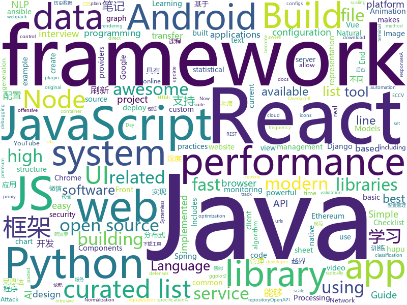

# 2018-07-29
See what the GitHub community is most excited about today.

## python
* [termgraph](https://github.com/mkaz/termgraph)(**294 stars today**): a python command-line tool which draws basic graphs in the terminal
* [byob](https://github.com/colental/byob)(**223 stars today**): BYOB (Build Your Own Botnet)
* [Photon](https://github.com/s0md3v/Photon)(**102 stars today**): Incredibly fast crawler which extracts urls, emails, files, website accounts and much more.
* [system-design-primer](https://github.com/donnemartin/system-design-primer)(**98 stars today**): Learn how to design large-scale systems. Prep for the system design interview. Includes Anki flashcards.
* [pythia](https://github.com/facebookresearch/pythia)(**86 stars today**): A software suite for Visual Question Answering
* [cheat.sh](https://github.com/chubin/cheat.sh)(**81 stars today**): the only cheat sheet you need
* [zulip](https://github.com/zulip/zulip)(**57 stars today**): Zulip server - powerful open source team chat
* [glances](https://github.com/nicolargo/glances)(**55 stars today**): Glances an Eye on your system. A top/htop alternative.
* [models](https://github.com/tensorflow/models)(**43 stars today**): Models and examples built with TensorFlow
* [cleverhans](https://github.com/tensorflow/cleverhans)(**52 stars today**): An adversarial example library for constructing attacks, building defenses, and benchmarking both
* [AutoEq](https://github.com/jaakkopasanen/AutoEq)(**41 stars today**): Automatic headphone equalization from frequency responses
* [awesome-python](https://github.com/vinta/awesome-python)(**34 stars today**): A curated list of awesome Python frameworks, libraries, software and resources
* [youtube-dl](https://github.com/rg3/youtube-dl)(**32 stars today**): Command-line program to download videos from YouTube.com and other video sites
* [cpython](https://github.com/python/cpython)(**18 stars today**): The Python programming language
* [GANimation](https://github.com/albertpumarola/GANimation)(**32 stars today**): GANimation: Anatomically-aware Facial Animation from a Single Image (ECCV'18 Oral)
* [spaCy](https://github.com/explosion/spaCy)(**31 stars today**): 💫Industrial-strength Natural Language Processing (NLP) with Python and Cython
* [IBN-Net](https://github.com/XingangPan/IBN-Net)(**30 stars today**): Instance-Batch Normalization Networks (ECCV2018)
* [vibora](https://github.com/vibora-io/vibora)(**28 stars today**): Fast, asynchronous and elegant Python web framework.
* [Raccoon](https://github.com/evyatarmeged/Raccoon)(**23 stars today**): A high performance offensive security tool for reconnaissance and vulnerability scanning
* [warehouse](https://github.com/pypa/warehouse)(**9 stars today**): The Python Package Repository
* [keras](https://github.com/keras-team/keras)(**20 stars today**): Deep Learning for humans
* [public-apis](https://github.com/toddmotto/public-apis)(**22 stars today**): A collective list of public JSON APIs for use in web development.
* [XX-Net](https://github.com/XX-net/XX-Net)(**19 stars today**): a web proxy tool
* [erpnext](https://github.com/frappe/erpnext)(**19 stars today**): Open Source ERP built for the web
* [ansible](https://github.com/ansible/ansible)(**15 stars today**): Ansible is a radically simple IT automation platform that makes your applications and systems easier to deploy. Avoid writing scripts or custom code to deploy and update your applications — automate in a language that approaches plain English, using SSH, with no agents to install on remote systems. https://docs.ansible.com/ansible/

## java
* [Java-Interview](https://github.com/crossoverJie/Java-Interview)(**71 stars today**): 👨‍🎓Java related : basic, concurrent, algorithm
* [Android-Cheat-sheet](https://github.com/anitaa1990/Android-Cheat-sheet)(**77 stars today**): Cheat Sheet for Android Interviews
* [ryu](https://github.com/ulfjack/ryu)(**66 stars today**): Converts floating point numbers to decimal strings
* [nacos](https://github.com/alibaba/nacos)(**53 stars today**): an easy-to-use dynamic service discovery, configuration and service management platform for building cloud native applications
* [proxyee-down](https://github.com/proxyee-down-org/proxyee-down)(**40 stars today**): http下载工具，基于http代理，支持多连接分块下载
* [spring-boot](https://github.com/spring-projects/spring-boot)(**33 stars today**): Spring Boot
* [weixin-java-tools](https://github.com/Wechat-Group/weixin-java-tools)(**34 stars today**): 全能微信Java开发工具包，支持包括微信支付、开放平台、小程序、企业号和公众号等的开发
* [java-tron](https://github.com/tronprotocol/java-tron)(**36 stars today**): Java implementation of the Tron whitepaper
* [OCEMall](https://github.com/OCEChain/OCEMall)(**28 stars today**): Online shopping mall
* [elasticsearch](https://github.com/elastic/elasticsearch)(**28 stars today**): Open Source, Distributed, RESTful Search Engine
* [MyPerf4J](https://github.com/ThinkpadNC5/MyPerf4J)(**31 stars today**): A high performance and non-intrusive real-time Java method performance monitoring and statistical tool.
* [data-transfer-project](https://github.com/google/data-transfer-project)(**32 stars today**): The Data Transfer Project makes it easy for people to transfer their data between online service providers. We are establishing a common framework, including data models and protocols, to enable direct transfer of data both into and out of participating online service providers.
* [Sentinel](https://github.com/alibaba/Sentinel)(**31 stars today**): A lightweight flow-control library providing high-available protection and monitoring (高可用防护的流量管理框架)
* [incubator-dubbo](https://github.com/apache/incubator-dubbo)(**22 stars today**): Apache Dubbo (incubating) is a high-performance, java based, open source RPC framework.
* [Java](https://github.com/TheAlgorithms/Java)(**21 stars today**): All Algorithms implemented in Java
* [spring-framework](https://github.com/spring-projects/spring-framework)(**18 stars today**): Spring Framework
* [jib](https://github.com/GoogleContainerTools/jib)(**21 stars today**): ⛵️Build container images for your Java applications.
* [SmartRefreshLayout](https://github.com/scwang90/SmartRefreshLayout)(**15 stars today**): 🔥下拉刷新、上拉加载、二级刷新、淘宝二楼、RefreshLayout、OverScroll，Android智能下拉刷新框架，支持越界回弹、越界拖动，具有极强的扩展性，集成了几十种炫酷的Header和 Footer。
* [tutorials](https://github.com/eugenp/tutorials)(**10 stars today**): The "REST With Spring" Course:
* [apollo](https://github.com/ctripcorp/apollo)(**15 stars today**): Apollo（阿波罗）是携程框架部门研发的分布式配置中心，能够集中化管理应用不同环境、不同集群的配置，配置修改后能够实时推送到应用端，并且具备规范的权限、流程治理等特性，适用于微服务配置管理场景。
* [ps](https://github.com/wudikua/ps)(**14 stars today**): 自己实现的深度学习训练框架，纯java实现，没有过多的第三方依赖，可分布式训练
* [vjtools](https://github.com/vipshop/vjtools)(**13 stars today**): The vip.com's java coding standard, libraries and tools
* [Magisk](https://github.com/topjohnwu/Magisk)(**14 stars today**): A Magic Mask to Alter Android System Systemless-ly
* [MPAndroidChart](https://github.com/PhilJay/MPAndroidChart)(**13 stars today**): A powerful🚀Android chart view / graph view library, supporting line- bar- pie- radar- bubble- and candlestick charts as well as scaling, dragging and animations.
* [LiveDataBus](https://github.com/JeremyLiao/LiveDataBus)(**12 stars today**): Android消息总线，基于LiveData，具有生命周期感知能力

## unknown
* [Front-End-Performance-Checklist](https://github.com/thedaviddias/Front-End-Performance-Checklist)(**336 stars today**): 🎮The only Front-End Performance Checklist that runs faster than the others
* [grokking-pytorch](https://github.com/Kaixhin/grokking-pytorch)(**115 stars today**): The Hitchiker's Guide to PyTorch
* [notation](https://github.com/hypotext/notation)(**100 stars today**): Collection of quotes on interesting notations & how they affect thought.
* [Interview-Notebook](https://github.com/CyC2018/Interview-Notebook)(**85 stars today**): 📝准备秋招学习笔记
* [You-Dont-Know-JS](https://github.com/getify/You-Dont-Know-JS)(**44 stars today**): A book series on JavaScript. @YDKJS on twitter.
* [awesome](https://github.com/sindresorhus/awesome)(**47 stars today**): 😎Curated list of awesome lists
* [rockstar](https://github.com/dylanbeattie/rockstar)(**48 stars today**): The Rockstar programming language specification
* [gitignore](https://github.com/github/gitignore)(**32 stars today**): A collection of useful .gitignore templates
* [InterviewMap](https://github.com/InterviewMap/InterviewMap)(**39 stars today**): Build the best interview map. The current content includes JS, network, browser related, performance optimization, security, framework, Git, data structure, algorithm, etc.
* [nova-docs](https://github.com/laravel/nova-docs)(**38 stars today**): 
* [NLP-progress](https://github.com/sebastianruder/NLP-progress)(**33 stars today**): Repository to track the progress in Natural Language Processing (NLP), including the datasets and the current state-of-the-art for the most common NLP tasks.
* [OCEChain](https://github.com/OCEChain/OCEChain)(**28 stars today**): AI (BlockChain + IoT)
* [free-programming-books](https://github.com/EbookFoundation/free-programming-books)(**29 stars today**): 📚Freely available programming books
* [OCEtokenContract](https://github.com/OCEChain/OCEtokenContract)(**26 stars today**): OCEChain erc20 token on Ethereum network
* [awesome-flutter](https://github.com/Solido/awesome-flutter)(**31 stars today**): An awesome list that curates the best Flutter libraries, tools, tutorials, articles and more.
* [project-based-learning](https://github.com/tuvtran/project-based-learning)(**27 stars today**): Curated list of project-based tutorials
* [react-developer-roadmap](https://github.com/adam-golab/react-developer-roadmap)(**27 stars today**): Roadmap to becoming a React developer in 2018
* [nodebestpractices](https://github.com/i0natan/nodebestpractices)(**26 stars today**): The largest Node.JS best practices list (July 2018)
* [softs](https://github.com/ldqk/softs)(**18 stars today**): 
* [build-your-own-x](https://github.com/danistefanovic/build-your-own-x)(**23 stars today**): 🤓Build your own (insert technology here)
* [awesome-vue](https://github.com/vuejs/awesome-vue)(**21 stars today**): 🎉A curated list of awesome things related to Vue.js
* [Java-Guide](https://github.com/Snailclimb/Java-Guide)(**19 stars today**): 📖Java面试通关手册（Java学习指南）Java Interview Customs Manual (Java Study Guide)
* [auditd-attack](https://github.com/bfuzzy/auditd-attack)(**23 stars today**): A Linux Auditd rule set mapped to MITRE's Attack Framework
* [disentangled-representation-papers](https://github.com/sootlasten/disentangled-representation-papers)(**19 stars today**): A curated list of research papers related to learning disentangled representations
* [architect-awesome](https://github.com/xingshaocheng/architect-awesome)(**17 stars today**): 后端架构师技术图谱

## javascript
* [terminalizer](https://github.com/faressoft/terminalizer)(**506 stars today**): 🦄Record your terminal and generate animated gif images
* [javascript-algorithms](https://github.com/trekhleb/javascript-algorithms)(**265 stars today**): Algorithms and data structures implemented in JavaScript with explanations and links to further readings
* [ndb](https://github.com/GoogleChromeLabs/ndb)(**231 stars today**): ndb is an improved debugging experience for Node.js, enabled by Chrome DevTools
* [vue](https://github.com/vuejs/vue)(**70 stars today**): 🖖A progressive, incrementally-adoptable JavaScript framework for building UI on the web.
* [jsinspect](https://github.com/danielstjules/jsinspect)(**69 stars today**): Detect copy-pasted and structurally similar code
* [canvas-sketch](https://github.com/mattdesl/canvas-sketch)(**70 stars today**): [beta] A framework for making generative artwork in JavaScript and the browser.
* [realworld](https://github.com/gothinkster/realworld)(**64 stars today**): "The mother of all demo apps" — Exemplary fullstack Medium.com clone powered by React, Angular, Node, Django, and many more🏅
* [react](https://github.com/facebook/react)(**47 stars today**): A declarative, efficient, and flexible JavaScript library for building user interfaces.
* [Ghost](https://github.com/TryGhost/Ghost)(**57 stars today**): The platform for professional publishers
* [Front-End-Checklist](https://github.com/thedaviddias/Front-End-Checklist)(**50 stars today**): 🗂The perfect Front-End Checklist for modern websites and meticulous developers
* [ReactNative-HupuJRS](https://github.com/MelonRice/ReactNative-HupuJRS)(**55 stars today**): A Third-party Hupu App (http://bbs.hupu.com/) client implemented using React Native (Android and iOS).
* [evergreen](https://github.com/segmentio/evergreen)(**53 stars today**): 🌲Evergreen React UI Framework by Segment
* [react-draggable](https://github.com/mzabriskie/react-draggable)(**53 stars today**): React draggable component
* [react-beautiful-dnd](https://github.com/atlassian/react-beautiful-dnd)(**46 stars today**): Beautiful, accessible drag and drop for lists with React.js
* [create-react-app](https://github.com/facebook/create-react-app)(**41 stars today**): Create React apps with no build configuration.
* [moon](https://github.com/kbrsh/moon)(**41 stars today**): 🌙The minimal & fast UI library
* [FreeTube](https://github.com/FreeTubeApp/FreeTube)(**38 stars today**): An Open Source YouTube app for privacy
* [excel4node](https://github.com/natergj/excel4node)(**36 stars today**): Node module to allow for easy Excel file creation
* [browsh](https://github.com/browsh-org/browsh)(**35 stars today**): A fully-modern text-based browser, rendering to TTY and browsers
* [puppeteer](https://github.com/GoogleChrome/puppeteer)(**32 stars today**): Headless Chrome Node API
* [react-pdf](https://github.com/diegomura/react-pdf)(**35 stars today**): 📄Create PDF files using React
* [vue-cli-plugin-ssr](https://github.com/Akryum/vue-cli-plugin-ssr)(**34 stars today**): ✨Simple SSR plugin for Vue CLI
* [Historical-ranking-data-visualization-based-on-d3.js](https://github.com/Jannchie/Historical-ranking-data-visualization-based-on-d3.js)(**31 stars today**): 这是一个数据可视化项目，能够将历史数据排名转化为动态柱状图图表
* [node](https://github.com/nodejs/node)(**28 stars today**): Node.js JavaScript runtime✨🐢🚀✨
* [v8n](https://github.com/imbrn/v8n)(**31 stars today**): ☑️JavaScript fluent validation library.

## html
* [zhuye_kim](https://github.com/wenguonideshou/zhuye_kim)(**31 stars today**): Django框架开发的仿zhuye.kim的简单个人主页/导航程序，带后台
* [keep-a-changelog](https://github.com/olivierlacan/keep-a-changelog)(**29 stars today**): If you build software, keep a changelog.
* [styleguide](https://github.com/google/styleguide)(**23 stars today**): Style guides for Google-originated open-source projects
* [awesome-mac](https://github.com/jaywcjlove/awesome-mac)(**19 stars today**):  Now we have become very big, Different from the original idea. Collect premium software in various categories.
* [fastText](https://github.com/facebookresearch/fastText)(**12 stars today**): Library for fast text representation and classification.
* [JavaScript30](https://github.com/wesbos/JavaScript30)(**10 stars today**): 30 Day Vanilla JS Challenge
* [Coursera-ML-AndrewNg-Notes](https://github.com/fengdu78/Coursera-ML-AndrewNg-Notes)(**10 stars today**): 吴恩达老师的机器学习课程个人笔记
* [Spoon-Knife](https://github.com/octocat/Spoon-Knife)(****): This repo is for demonstration purposes only.
* [portainer](https://github.com/portainer/portainer)(**9 stars today**): Simple management UI for Docker
* [electron-api-demos](https://github.com/electron/electron-api-demos)(**9 stars today**): Explore the Electron APIs
* [react-app-rewired](https://github.com/timarney/react-app-rewired)(**9 stars today**): Override create-react-app webpack configs without ejecting
* [pipeline](https://github.com/PipelineAI/pipeline)(**9 stars today**): PipelineAI: Real-Time Enterprise AI Platform
* [deeplearning_ai_books](https://github.com/fengdu78/deeplearning_ai_books)(**7 stars today**): deeplearning.ai（吴恩达老师的深度学习课程笔记及资源）
* [primeng](https://github.com/primefaces/primeng)(**8 stars today**): UI Components for Angular
* [ggstatsplot](https://github.com/IndrajeetPatil/ggstatsplot)(**7 stars today**): Collection of functions to enhance ggplot2 plots with results from statistical tests.
* [aozorabunko](https://github.com/aozorabunko/aozorabunko)(**6 stars today**): 
* [fonts](https://github.com/google/fonts)(**6 stars today**): Font files available from Google Fonts
* [simple-icons](https://github.com/simple-icons/simple-icons)(**6 stars today**): SVG icons for popular brands
* [EIPs](https://github.com/ethereum/EIPs)(**6 stars today**): The Ethereum Improvement Proposal repository
* [openapi-generator](https://github.com/OpenAPITools/openapi-generator)(**6 stars today**): OpenAPI Generator allows generation of API client libraries (SDK generation), server stubs, documentation and configuration automatically given an OpenAPI Spec (v2, v3)
* [polymer](https://github.com/Polymer/polymer)(**5 stars today**): Build modern apps using web components
* [WebFundamentals](https://github.com/google/WebFundamentals)(**5 stars today**): Best practices for modern web development
* [crowds](https://github.com/ncase/crowds)(**5 stars today**): The Wisdom and/or Madness of the Crowds
* [ecma262](https://github.com/tc39/ecma262)(**5 stars today**): Status, process, and documents for ECMA262
* [material-design-lite](https://github.com/google/material-design-lite)(****): Material Design Components in HTML/CSS/JS

## WordCloud

