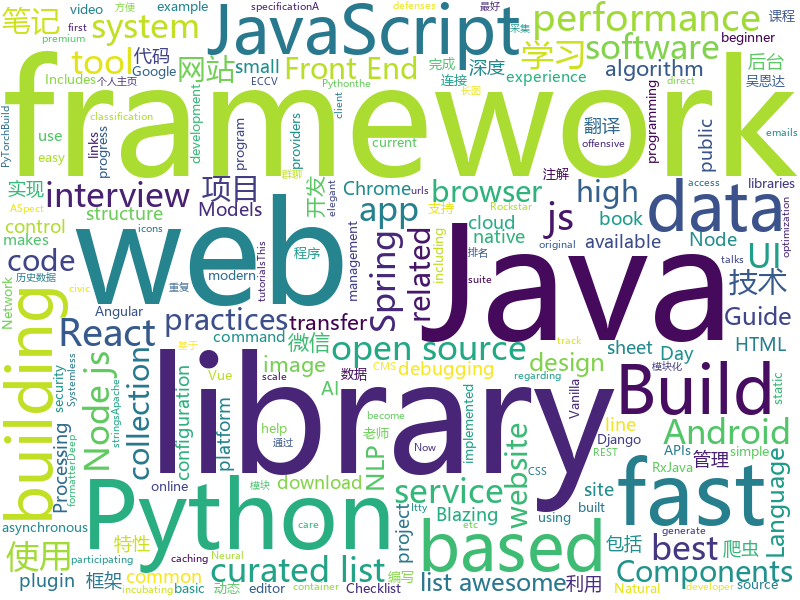

# 2018-07-30
See what the GitHub community is most excited about today.

## python
* [byob](https://github.com/colental/byob)(**256 stars today**): BYOB (Build Your Own Botnet)
* [glances](https://github.com/nicolargo/glances)(**188 stars today**): Glances an Eye on your system. A top/htop alternative.
* [termgraph](https://github.com/mkaz/termgraph)(**121 stars today**): a python command-line tool which draws basic graphs in the terminal
* [Raccoon](https://github.com/evyatarmeged/Raccoon)(**101 stars today**): A high performance offensive security tool for reconnaissance and vulnerability scanning
* [Photon](https://github.com/s0md3v/Photon)(**91 stars today**): Incredibly fast crawler which extracts urls, emails, files, website accounts and much more.
* [system-design-primer](https://github.com/donnemartin/system-design-primer)(**84 stars today**): Learn how to design large-scale systems. Prep for the system design interview. Includes Anki flashcards.
* [pythia](https://github.com/facebookresearch/pythia)(**69 stars today**): A software suite for Visual Question Answering
* [cleverhans](https://github.com/tensorflow/cleverhans)(**58 stars today**): An adversarial example library for constructing attacks, building defenses, and benchmarking both
* [pyxel](https://github.com/kitao/pyxel)(**55 stars today**): A retro game development environment in Python
* [cheat.sh](https://github.com/chubin/cheat.sh)(**53 stars today**): the only cheat sheet you need
* [GANimation](https://github.com/albertpumarola/GANimation)(**44 stars today**): GANimation: Anatomically-aware Facial Animation from a Single Image (ECCV'18 Oral)
* [models](https://github.com/tensorflow/models)(**36 stars today**): Models and examples built with TensorFlow
* [black](https://github.com/ambv/black)(**44 stars today**): The uncompromising Python code formatter
* [keras](https://github.com/keras-team/keras)(**42 stars today**): Deep Learning for humans
* [public-apis](https://github.com/toddmotto/public-apis)(**35 stars today**): A collective list of public JSON APIs for use in web development.
* [WxConn](https://github.com/Bravest-Ptt/WxConn)(**34 stars today**): 统计你的微信连接多少人，包括好友、群聊人数，并提供去重后的长图结果
* [awesome-python](https://github.com/vinta/awesome-python)(**31 stars today**): A curated list of awesome Python frameworks, libraries, software and resources
* [erpnext](https://github.com/frappe/erpnext)(**29 stars today**): Open Source ERP built for the web
* [vibora](https://github.com/vibora-io/vibora)(**29 stars today**): Fast, asynchronous and elegant Python web framework.
* [mu](https://github.com/mu-editor/mu)(**25 stars today**): A small, simple editor for beginner Python programmers. Written in Python and Qt5.
* [youtube-dl](https://github.com/rg3/youtube-dl)(**24 stars today**): Command-line program to download videos from YouTube.com and other video sites
* [thredo](https://github.com/dabeaz/thredo)(**25 stars today**): 
* [spaCy](https://github.com/explosion/spaCy)(**24 stars today**): 💫Industrial-strength Natural Language Processing (NLP) with Python and Cython
* [xDownload_public](https://github.com/jrdutra/xDownload_public)(**19 stars today**): Simple tool to help lots of vídeo download.
* [zulip](https://github.com/zulip/zulip)(**21 stars today**): Zulip server - powerful open source team chat

## java
* [Android-Cheat-sheet](https://github.com/anitaa1990/Android-Cheat-sheet)(**121 stars today**): Cheat Sheet for Android Interviews
* [Java-Interview](https://github.com/crossoverJie/Java-Interview)(**82 stars today**): 👨‍🎓Java related : basic, concurrent, algorithm
* [S-MVP](https://github.com/UCodeUStory/S-MVP)(**55 stars today**): 🔥🔥优化版MVP,使用注解泛型简化代码编写，使用模块化协议方便维护，APT过程使用注解解析器利用JavaPoet🌝完成重复模块的编写，利用ASpect+GradlePlugin 完成横向AOP编程+Javassist动态字节码注入+Tinker实现热修复+Retrofit实现优雅网络操作+RxJava轻松玩转数据处理
* [proxyee-down](https://github.com/proxyee-down-org/proxyee-down)(**41 stars today**): http下载工具，基于http代理，支持多连接分块下载
* [Sentinel](https://github.com/alibaba/Sentinel)(**43 stars today**): A lightweight flow-control library providing high-available protection and monitoring (高可用防护的流量管理框架)
* [nacos](https://github.com/alibaba/nacos)(**39 stars today**): an easy-to-use dynamic service discovery, configuration and service management platform for building cloud native applications
* [java-tron](https://github.com/tronprotocol/java-tron)(**38 stars today**): Java implementation of the Tron whitepaper
* [ryu](https://github.com/ulfjack/ryu)(**34 stars today**): Converts floating point numbers to decimal strings
* [incubator-dubbo](https://github.com/apache/incubator-dubbo)(**29 stars today**): Apache Dubbo (incubating) is a high-performance, java based, open source RPC framework.
* [Java](https://github.com/TheAlgorithms/Java)(**28 stars today**): All Algorithms implemented in Java
* [data-transfer-project](https://github.com/google/data-transfer-project)(**26 stars today**): The Data Transfer Project makes it easy for people to transfer their data between online service providers. We are establishing a common framework, including data models and protocols, to enable direct transfer of data both into and out of participating online service providers.
* [spring-boot](https://github.com/spring-projects/spring-boot)(**22 stars today**): Spring Boot
* [weixin-java-tools](https://github.com/Wechat-Group/weixin-java-tools)(**20 stars today**): 全能微信Java开发工具包，支持包括微信支付、开放平台、小程序、企业号和公众号等的开发
* [guava](https://github.com/google/guava)(**19 stars today**): Google core libraries for Java
* [elasticsearch](https://github.com/elastic/elasticsearch)(**18 stars today**): Open Source, Distributed, RESTful Search Engine
* [tutorials](https://github.com/eugenp/tutorials)(**12 stars today**): The "REST With Spring" Course:
* [spring-framework](https://github.com/spring-projects/spring-framework)(**13 stars today**): Spring Framework
* [Magisk](https://github.com/topjohnwu/Magisk)(**14 stars today**): A Magic Mask to Alter Android System Systemless-ly
* [jib](https://github.com/GoogleContainerTools/jib)(**14 stars today**): ⛵️Build container images for your Java applications.
* [RxJava](https://github.com/ReactiveX/RxJava)(**12 stars today**): RxJava – Reactive Extensions for the JVM – a library for composing asynchronous and event-based programs using observable sequences for the Java VM.
* [selenium](https://github.com/SeleniumHQ/selenium)(**13 stars today**): A browser automation framework and ecosystem.
* [spring-cloud-config-admin](https://github.com/dyc87112/spring-cloud-config-admin)(**11 stars today**): Spring Cloud Config的综合管理后台（简称：SCCA）
* [glide](https://github.com/bumptech/glide)(**12 stars today**): An image loading and caching library for Android focused on smooth scrolling
* [kafka](https://github.com/apache/kafka)(**9 stars today**): Mirror of Apache Kafka
* [pandora](https://github.com/whataa/pandora)(**12 stars today**): an android library for debugging what we care about directly in app.

## unknown
* [Front-End-Performance-Checklist](https://github.com/thedaviddias/Front-End-Performance-Checklist)(**411 stars today**): 🎮The only Front-End Performance Checklist that runs faster than the others
* [100-Days-Of-ML-Code](https://github.com/Avik-Jain/100-Days-Of-ML-Code)(**107 stars today**): 100 Days of ML Coding
* [Interview-Notebook](https://github.com/CyC2018/Interview-Notebook)(**94 stars today**): 📝准备秋招学习笔记
* [notation](https://github.com/hypotext/notation)(**84 stars today**): Collection of quotes on interesting notations & how they affect thought.
* [grokking-pytorch](https://github.com/Kaixhin/grokking-pytorch)(**61 stars today**): The Hitchiker's Guide to PyTorch
* [InterviewMap](https://github.com/InterviewMap/InterviewMap)(**55 stars today**): Build the best interview map. The current content includes JS, network, browser related, performance optimization, security, framework, Git, data structure, algorithm, etc.
* [awesome](https://github.com/sindresorhus/awesome)(**47 stars today**): 😎Curated list of awesome lists
* [You-Dont-Know-JS](https://github.com/getify/You-Dont-Know-JS)(**45 stars today**): A book series on JavaScript. @YDKJS on twitter.
* [rockstar](https://github.com/dylanbeattie/rockstar)(**49 stars today**): The Rockstar programming language specification
* [gitignore](https://github.com/github/gitignore)(**37 stars today**): A collection of useful .gitignore templates
* [free-programming-books](https://github.com/EbookFoundation/free-programming-books)(**36 stars today**): 📚Freely available programming books
* [chinese-ai-developer](https://github.com/aichinateam/chinese-ai-developer)(**38 stars today**): 👩🏿‍💻👨🏾‍💻👩🏼‍💻👨🏽‍💻👩🏻‍💻中国 AI 开发者项目列表 -- 分享大家都在做什么
* [bugbountywiki](https://github.com/EdOverflow/bugbountywiki)(**34 stars today**): The Bug Bounty Wiki
* [build-your-own-x](https://github.com/danistefanovic/build-your-own-x)(**33 stars today**): 🤓Build your own (insert technology here)
* [NLP-progress](https://github.com/sebastianruder/NLP-progress)(**31 stars today**): Repository to track the progress in Natural Language Processing (NLP), including the datasets and the current state-of-the-art for the most common NLP tasks.
* [project-based-learning](https://github.com/tuvtran/project-based-learning)(**30 stars today**): Curated list of project-based tutorials
* [Resilience-Engineering-Resources](https://github.com/adaptivecapacitylabs/Resilience-Engineering-Resources)(**26 stars today**): This is a collection of readings, talks, and other bits regarding the field of Resilience Engineering
* [architect-awesome](https://github.com/xingshaocheng/architect-awesome)(**22 stars today**): 后端架构师技术图谱
* [gold-miner](https://github.com/xitu/gold-miner)(**25 stars today**): 🥇掘金翻译计划，可能是世界最大最好的英译中技术社区，最懂读者和译者的翻译平台：
* [softs](https://github.com/ldqk/softs)(**16 stars today**): 
* [awesome-vue](https://github.com/vuejs/awesome-vue)(**19 stars today**): 🎉A curated list of awesome things related to Vue.js
* [Java-Guide](https://github.com/Snailclimb/Java-Guide)(**17 stars today**): 📖Java面试通关手册（Java学习指南）Java Interview Customs Manual (Java Study Guide)
* [nodebestpractices](https://github.com/i0natan/nodebestpractices)(**18 stars today**): The largest Node.JS best practices list (July 2018)
* [awesome-nodejs](https://github.com/sindresorhus/awesome-nodejs)(**15 stars today**): ⚡️Delightful Node.js packages and resources
* [awesome-web-editor](https://github.com/xjh22222228/awesome-web-editor)(**15 stars today**): 🔨Open source WEB editor summary / 开源WEB编辑器汇总

## javascript
* [terminalizer](https://github.com/faressoft/terminalizer)(**485 stars today**): 🦄Record your terminal and generate animated gif images
* [javascript-algorithms](https://github.com/trekhleb/javascript-algorithms)(**185 stars today**): Algorithms and data structures implemented in JavaScript with explanations and links to further readings
* [ndb](https://github.com/GoogleChromeLabs/ndb)(**183 stars today**): ndb is an improved debugging experience for Node.js, enabled by Chrome DevTools
* [mdx-deck](https://github.com/jxnblk/mdx-deck)(**158 stars today**): MDX-based presentation decks
* [jsinspect](https://github.com/danielstjules/jsinspect)(**146 stars today**): Detect copy-pasted and structurally similar code
* [apexcharts.js](https://github.com/apexcharts/apexcharts.js)(**90 stars today**): A JavaScript Chart Library
* [vue](https://github.com/vuejs/vue)(**76 stars today**): 🖖A progressive, incrementally-adoptable JavaScript framework for building UI on the web.
* [react-boilerplate](https://github.com/react-boilerplate/react-boilerplate)(**61 stars today**): 🔥A highly scalable, offline-first foundation with the best developer experience and a focus on performance and best practices.
* [Ghost](https://github.com/TryGhost/Ghost)(**55 stars today**): The platform for professional publishers
* [evergreen](https://github.com/segmentio/evergreen)(**50 stars today**): 🌲Evergreen React UI Framework by Segment
* [Front-End-Checklist](https://github.com/thedaviddias/Front-End-Checklist)(**48 stars today**): 🗂The perfect Front-End Checklist for modern websites and meticulous developers
* [react](https://github.com/facebook/react)(**42 stars today**): A declarative, efficient, and flexible JavaScript library for building user interfaces.
* [graphql-engine](https://github.com/hasura/graphql-engine)(**44 stars today**): Blazing fast, instant GraphQL APIs on Postgres with fine grained access control
* [Historical-ranking-data-visualization-based-on-d3.js](https://github.com/Jannchie/Historical-ranking-data-visualization-based-on-d3.js)(**37 stars today**): 这是一个数据可视化项目，能够将历史数据排名转化为动态柱状图图表
* [moon](https://github.com/kbrsh/moon)(**41 stars today**): 🌙The minimal & fast UI library
* [Malvid](https://github.com/Malvid/Malvid)(**39 stars today**): UI to help you build and document web components.
* [axios](https://github.com/axios/axios)(**37 stars today**): Promise based HTTP client for the browser and node.js
* [vue-cli-plugin-ssr](https://github.com/Akryum/vue-cli-plugin-ssr)(**37 stars today**): ✨Simple SSR plugin for Vue CLI
* [create-react-app](https://github.com/facebook/create-react-app)(**30 stars today**): Create React apps with no build configuration.
* [gatsby](https://github.com/gatsbyjs/gatsby)(**33 stars today**): ⚛️📄🚀Blazing fast static site generator for React
* [puppeteer](https://github.com/GoogleChrome/puppeteer)(**33 stars today**): Headless Chrome Node API
* [react-native](https://github.com/facebook/react-native)(**33 stars today**): A framework for building native apps with React.
* [realworld](https://github.com/gothinkster/realworld)(**34 stars today**): "The mother of all demo apps" — Exemplary fullstack Medium.com clone powered by React, Angular, Node, Django, and many more🏅
* [v8n](https://github.com/imbrn/v8n)(**34 stars today**): ☑️JavaScript fluent validation library.
* [react-beautiful-dnd](https://github.com/atlassian/react-beautiful-dnd)(**32 stars today**): Beautiful, accessible drag and drop for lists with React.js

## html
* [styleguide](https://github.com/google/styleguide)(**15 stars today**): Style guides for Google-originated open-source projects
* [Spoon-Knife](https://github.com/octocat/Spoon-Knife)(****): This repo is for demonstration purposes only.
* [Coursera-ML-AndrewNg-Notes](https://github.com/fengdu78/Coursera-ML-AndrewNg-Notes)(**9 stars today**): 吴恩达老师的机器学习课程个人笔记
* [fastText](https://github.com/facebookresearch/fastText)(**10 stars today**): Library for fast text representation and classification.
* [itty-bitty](https://github.com/alcor/itty-bitty)(**10 stars today**): Itty.bitty is a tool to create links that contain small sites
* [keep-a-changelog](https://github.com/olivierlacan/keep-a-changelog)(**8 stars today**): If you build software, keep a changelog.
* [awesome-mac](https://github.com/jaywcjlove/awesome-mac)(**8 stars today**):  Now we have become very big, Different from the original idea. Collect premium software in various categories.
* [JavaScript30](https://github.com/wesbos/JavaScript30)(**5 stars today**): 30 Day Vanilla JS Challenge
* [Iosevka](https://github.com/be5invis/Iosevka)(**8 stars today**): Slender typeface for code, from code.
* [EIPs](https://github.com/ethereum/EIPs)(**8 stars today**): The Ethereum Improvement Proposal repository
* [InteractiveHtmlBom](https://github.com/openscopeproject/InteractiveHtmlBom)(**8 stars today**): Interactive HTML BOM generation plugin for KiCad
* [Publii](https://github.com/GetPublii/Publii)(**7 stars today**): Publii is a desktop-based CMS for Windows and Mac that makes creating static websites fast and hassle-free, even for beginners.
* [primeng](https://github.com/primefaces/primeng)(**6 stars today**): UI Components for Angular
* [nndl.github.io](https://github.com/nndl/nndl.github.io)(**6 stars today**): 《神经网络与深度学习》 Neural Network and Deep Learning
* [simple-icons](https://github.com/simple-icons/simple-icons)(**6 stars today**): SVG icons for popular brands
* [Anti-Anti-Spider](https://github.com/luyishisi/Anti-Anti-Spider)(**6 stars today**): 越来越多的网站具有反爬虫特性，有的用图片隐藏关键数据，有的使用反人类的验证码，建立反反爬虫的代码仓库，通过与不同特性的网站做斗争（无恶意）提高技术。（欢迎提交难以采集的网站）（因工作原因，项目暂停）
* [dom-wait](https://github.com/f/dom-wait)(**6 stars today**): Complex Loader and Progress Management for Vanilla JS
* [nodejs-ex](https://github.com/sclorg/nodejs-ex)(****): node.js example
* [deeplearning_ai_books](https://github.com/fengdu78/deeplearning_ai_books)(**5 stars today**): deeplearning.ai（吴恩达老师的深度学习课程笔记及资源）
* [zhuye_kim](https://github.com/wenguonideshou/zhuye_kim)(**5 stars today**): Django框架开发的仿zhuye.kim的简单个人主页/导航程序，带后台
* [government.github.com](https://github.com/github/government.github.com)(**5 stars today**): Gather, curate, and feature stories of public servants and civic hackers using GitHub as part of their open government innovations
* [electron-api-demos](https://github.com/electron/electron-api-demos)(**5 stars today**): Explore the Electron APIs
* [WebFundamentals](https://github.com/google/WebFundamentals)(**5 stars today**): Best practices for modern web development
* [ng-alain](https://github.com/cipchk/ng-alain)(**5 stars today**): ng-zorro-antd admin panel front-end framework
* [material-design-lite](https://github.com/google/material-design-lite)(****): Material Design Components in HTML/CSS/JS

## WordCloud

