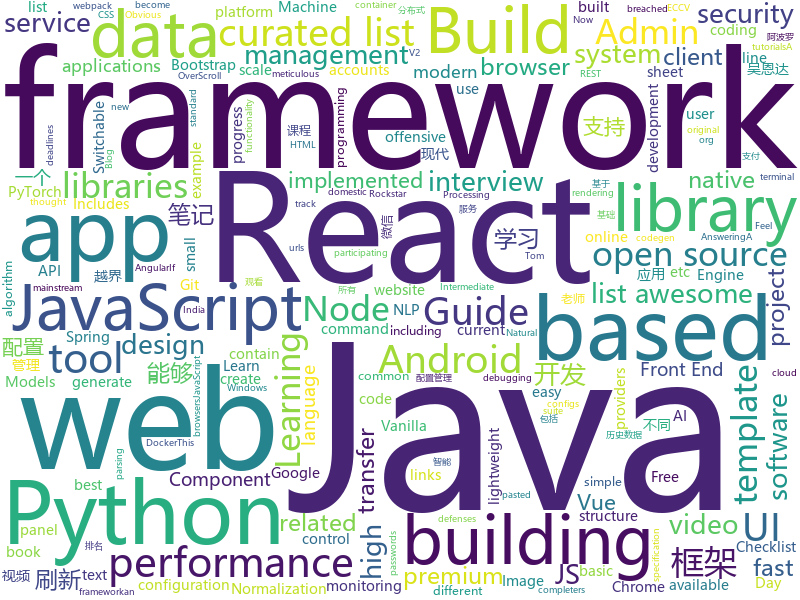

# 2018-07-31
See what the GitHub community is most excited about today.

## python
* [Raccoon](https://github.com/evyatarmeged/Raccoon)(**283 stars today**): A high performance offensive security tool for reconnaissance and vulnerability scanning
* [glances](https://github.com/nicolargo/glances)(**283 stars today**): Glances an Eye on your system. A top/htop alternative.
* [byob](https://github.com/colental/byob)(**225 stars today**): BYOB (Build Your Own Botnet)
* [termgraph](https://github.com/mkaz/termgraph)(**190 stars today**): a python command-line tool which draws basic graphs in the terminal
* [pyxel](https://github.com/kitao/pyxel)(**186 stars today**): A retro game development environment in Python
* [Photon](https://github.com/s0md3v/Photon)(**179 stars today**): Incredibly fast crawler which extracts urls, emails, files, website accounts and much more.
* [system-design-primer](https://github.com/donnemartin/system-design-primer)(**145 stars today**): Learn how to design large-scale systems. Prep for the system design interview. Includes Anki flashcards.
* [models](https://github.com/tensorflow/models)(**65 stars today**): Models and examples built with TensorFlow
* [cheat.sh](https://github.com/chubin/cheat.sh)(**66 stars today**): the only cheat sheet you need
* [Cirq](https://github.com/quantumlib/Cirq)(**56 stars today**): A python framework for creating, editing, and invoking Noisy Intermediate Scale Quantum (NISQ) circuits.
* [cleverhans](https://github.com/tensorflow/cleverhans)(**53 stars today**): An adversarial example library for constructing attacks, building defenses, and benchmarking both
* [keras](https://github.com/keras-team/keras)(**48 stars today**): Deep Learning for humans
* [awesome-python](https://github.com/vinta/awesome-python)(**44 stars today**): A curated list of awesome Python frameworks, libraries, software and resources
* [pythia](https://github.com/facebookresearch/pythia)(**44 stars today**): A software suite for Visual Question Answering
* [mu](https://github.com/mu-editor/mu)(**42 stars today**): A small, simple editor for beginner Python programmers. Written in Python and Qt5.
* [youtube-dl](https://github.com/rg3/youtube-dl)(**39 stars today**): Command-line program to download videos from YouTube.com and other video sites
* [public-apis](https://github.com/toddmotto/public-apis)(**39 stars today**): A collective list of public JSON APIs for use in web development.
* [flask](https://github.com/pallets/flask)(**36 stars today**): The Python micro framework for building web applications.
* [scikit-learn](https://github.com/scikit-learn/scikit-learn)(**31 stars today**): scikit-learn: machine learning in Python
* [thredo](https://github.com/dabeaz/thredo)(**39 stars today**): 
* [linqit](https://github.com/avilum/linqit)(**39 stars today**): Extends python lists with LINQ functionality for clean, fast coding
* [django](https://github.com/django/django)(**27 stars today**): The Web framework for perfectionists with deadlines.
* [erpnext](https://github.com/frappe/erpnext)(**32 stars today**): Open Source ERP built for the web
* [GANimation](https://github.com/albertpumarola/GANimation)(**31 stars today**): GANimation: Anatomically-aware Facial Animation from a Single Image (ECCV'18 Oral)
* [ShuffleNet_V2_pytorch_caffe](https://github.com/miaow1988/ShuffleNet_V2_pytorch_caffe)(**28 stars today**): ShuffleNet-V2 for both PyTorch and Caffe.

## java
* [Java-Interview](https://github.com/crossoverJie/Java-Interview)(**179 stars today**): 👨‍🎓Java related : basic, concurrent, algorithm
* [Android-Cheat-sheet](https://github.com/anitaa1990/Android-Cheat-sheet)(**145 stars today**): Cheat Sheet for Android Interviews
* [MyPerf4J](https://github.com/ThinkpadNC5/MyPerf4J)(**102 stars today**): A high performance and non-intrusive real-time Java method performance monitoring and statistical tool.
* [java-design-patterns](https://github.com/iluwatar/java-design-patterns)(**79 stars today**): Design patterns implemented in Java
* [Sentinel](https://github.com/alibaba/Sentinel)(**86 stars today**): A lightweight flow-control library providing high-available protection and monitoring (高可用防护的流量管理框架)
* [ratelimiter4j](https://github.com/wangzheng0822/ratelimiter4j)(**65 stars today**): Java rate limiting library/framework
* [nacos](https://github.com/alibaba/nacos)(**65 stars today**): an easy-to-use dynamic service discovery, configuration and service management platform for building cloud native applications
* [weixin-java-tools](https://github.com/Wechat-Group/weixin-java-tools)(**62 stars today**): 全能微信Java开发工具包，支持包括微信支付、开放平台、小程序、企业号和公众号等的开发
* [spring-boot](https://github.com/spring-projects/spring-boot)(**55 stars today**): Spring Boot
* [incubator-dubbo](https://github.com/apache/incubator-dubbo)(**53 stars today**): Apache Dubbo (incubating) is a high-performance, java based, open source RPC framework.
* [proxyee-down](https://github.com/proxyee-down-org/proxyee-down)(**56 stars today**): http下载工具，基于http代理，支持多连接分块下载
* [fvip](https://github.com/CrazyDudo/fvip)(**48 stars today**): 【Android版】一个可以观看国内主流视频平台所有视频的客户端（Mac、Windows、Linux） A client that can watch video of domestic(China) mainstream video platform
* [apollo](https://github.com/ctripcorp/apollo)(**48 stars today**): Apollo（阿波罗）是携程框架部门研发的分布式配置中心，能够集中化管理应用不同环境、不同集群的配置，配置修改后能够实时推送到应用端，并且具备规范的权限、流程治理等特性，适用于微服务配置管理场景。
* [guava](https://github.com/google/guava)(**43 stars today**): Google core libraries for Java
* [WanAndroid](https://github.com/CoderLengary/WanAndroid)(**41 stars today**): An Android app for www.wanandroid.com
* [elasticsearch](https://github.com/elastic/elasticsearch)(**34 stars today**): Open Source, Distributed, RESTful Search Engine
* [jib](https://github.com/GoogleContainerTools/jib)(**37 stars today**): ⛵️Build container images for your Java applications.
* [java-tron](https://github.com/tronprotocol/java-tron)(**37 stars today**): Java implementation of the Tron whitepaper
* [Java](https://github.com/TheAlgorithms/Java)(**33 stars today**): All Algorithms implemented in Java
* [EasyMvp](https://github.com/lizixian18/EasyMvp)(**34 stars today**): 一个简单强大且灵活的MVP框架。
* [SmartRefreshLayout](https://github.com/scwang90/SmartRefreshLayout)(**29 stars today**): 🔥下拉刷新、上拉加载、二级刷新、淘宝二楼、RefreshLayout、OverScroll，Android智能下拉刷新框架，支持越界回弹、越界拖动，具有极强的扩展性，集成了几十种炫酷的Header和 Footer。
* [data-transfer-project](https://github.com/google/data-transfer-project)(**32 stars today**): The Data Transfer Project makes it easy for people to transfer their data between online service providers. We are establishing a common framework, including data models and protocols, to enable direct transfer of data both into and out of participating online service providers.
* [CyberBiology](https://github.com/CyberBiology/CyberBiology)(**28 stars today**): 
* [tutorials](https://github.com/eugenp/tutorials)(**15 stars today**): The "REST With Spring" Course:
* [vjtools](https://github.com/vipshop/vjtools)(**25 stars today**): The vip.com's java coding standard, libraries and tools

## unknown
* [Front-End-Performance-Checklist](https://github.com/thedaviddias/Front-End-Performance-Checklist)(**512 stars today**): 🎮The only Front-End Performance Checklist that runs faster than the others
* [100-Days-Of-ML-Code](https://github.com/Avik-Jain/100-Days-Of-ML-Code)(**413 stars today**): 100 Days of ML Coding
* [Interview-Notebook](https://github.com/CyC2018/Interview-Notebook)(**164 stars today**): 📝准备秋招学习笔记
* [You-Dont-Know-JS](https://github.com/getify/You-Dont-Know-JS)(**81 stars today**): A book series on JavaScript. @YDKJS on twitter.
* [Best-App](https://github.com/hzlzh/Best-App)(**78 stars today**): 收集&推荐优秀的 Apps/硬件/技巧/周边等
* [gitignore](https://github.com/github/gitignore)(**53 stars today**): A collection of useful .gitignore templates
* [awesome](https://github.com/sindresorhus/awesome)(**65 stars today**): 😎Curated list of awesome lists
* [Front-End-Performance-Checklist](https://github.com/JohnsenZhou/Front-End-Performance-Checklist)(**66 stars today**): 🎮前端性能清单，让你的网站跑的更快
* [InterviewMap](https://github.com/InterviewMap/InterviewMap)(**66 stars today**): Build the best interview map. The current content includes JS, network, browser related, performance optimization, security, framework, Git, data structure, algorithm, etc.
* [my-arsenal-of-aws-security-tools](https://github.com/toniblyx/my-arsenal-of-aws-security-tools)(**61 stars today**): List of open source tools for AWS security: defensive, offensive, auditing, DFIR, etc.
* [rockstar](https://github.com/dylanbeattie/rockstar)(**62 stars today**): The Rockstar programming language specification
* [build-your-own-x](https://github.com/danistefanovic/build-your-own-x)(**56 stars today**): 🤓Build your own (insert technology here)
* [awesome-vue](https://github.com/vuejs/awesome-vue)(**51 stars today**): 🎉A curated list of awesome things related to Vue.js
* [notation](https://github.com/hypotext/notation)(**55 stars today**): Collection of quotes on interesting notations & how they affect thought.
* [grokking-pytorch](https://github.com/Kaixhin/grokking-pytorch)(**51 stars today**): The Hitchiker's Guide to PyTorch
* [architect-awesome](https://github.com/xingshaocheng/architect-awesome)(**46 stars today**): 后端架构师技术图谱
* [project-based-learning](https://github.com/tuvtran/project-based-learning)(**44 stars today**): Curated list of project-based tutorials
* [MLInterview](https://github.com/theainerd/MLInterview)(**45 stars today**): A curated awesome list of AI Startups in India & Machine Learning Interview Guide. Feel free to contribute!
* [free-programming-books](https://github.com/EbookFoundation/free-programming-books)(**43 stars today**): 📚Freely available programming books
* [Java-Guide](https://github.com/Snailclimb/Java-Guide)(**38 stars today**): 📖Java面试通关手册（Java学习指南）Java Interview Customs Manual (Java Study Guide)
* [toml](https://github.com/toml-lang/toml)(**38 stars today**): Tom's Obvious, Minimal Language
* [NLP-progress](https://github.com/sebastianruder/NLP-progress)(**34 stars today**): Repository to track the progress in Natural Language Processing (NLP), including the datasets and the current state-of-the-art for the most common NLP tasks.
* [awesome-android-ui](https://github.com/wasabeef/awesome-android-ui)(**31 stars today**): A curated list of awesome Android UI/UX libraries
* [Front-End-Performance-Checklist](https://github.com/lex111/Front-End-Performance-Checklist)(**31 stars today**): 🎮Единственный чек-лист производительности фронтенда, который справляется лучше других
* [Web-Series](https://github.com/wxyyxc1992/Web-Series)(**28 stars today**): 📚现代 Web 开发，现代 Web 开发导论 | 基础篇 | 进阶篇 | 架构优化篇 | React 篇 | Vue 篇

## javascript
* [mdx-deck](https://github.com/jxnblk/mdx-deck)(**1,189 stars today**): MDX-based presentation decks
* [terminalizer](https://github.com/faressoft/terminalizer)(**878 stars today**): 🦄Record your terminal and generate animated gif images
* [javascript-algorithms](https://github.com/trekhleb/javascript-algorithms)(**477 stars today**): Algorithms and data structures implemented in JavaScript with explanations and links to further readings
* [apexcharts.js](https://github.com/apexcharts/apexcharts.js)(**479 stars today**): A JavaScript Chart Library
* [ndb](https://github.com/GoogleChromeLabs/ndb)(**241 stars today**): ndb is an improved debugging experience for Node.js, enabled by Chrome DevTools
* [jsinspect](https://github.com/danielstjules/jsinspect)(**156 stars today**): Detect copy-pasted and structurally similar code
* [vue](https://github.com/vuejs/vue)(**126 stars today**): 🖖A progressive, incrementally-adoptable JavaScript framework for building UI on the web.
* [Front-End-Checklist](https://github.com/thedaviddias/Front-End-Checklist)(**106 stars today**): 🗂The perfect Front-End Checklist for modern websites and meticulous developers
* [react](https://github.com/facebook/react)(**95 stars today**): A declarative, efficient, and flexible JavaScript library for building user interfaces.
* [mdx](https://github.com/mdx-js/mdx)(**103 stars today**): JSX in Markdown for ambitious projects
* [realworld](https://github.com/gothinkster/realworld)(**78 stars today**): "The mother of all demo apps" — Exemplary fullstack Medium.com clone powered by React, Angular, Node, Django, and many more🏅
* [Historical-ranking-data-visualization-based-on-d3.js](https://github.com/Jannchie/Historical-ranking-data-visualization-based-on-d3.js)(**67 stars today**): 这是一个数据可视化项目，能够将历史数据排名转化为动态柱状图图表
* [axios](https://github.com/axios/axios)(**71 stars today**): Promise based HTTP client for the browser and node.js
* [puppeteer](https://github.com/GoogleChrome/puppeteer)(**63 stars today**): Headless Chrome Node API
* [iview-admin](https://github.com/iview/iview-admin)(**60 stars today**): Vue 2.0 admin management system template based on iView
* [create-react-app](https://github.com/facebook/create-react-app)(**58 stars today**): Create React apps with no build configuration.
* [between.js](https://github.com/sasha240100/between.js)(**61 stars today**): Lightweight JavaScript (ES6) tweening engine
* [Ghost](https://github.com/TryGhost/Ghost)(**58 stars today**): The platform for professional publishers
* [evergreen](https://github.com/segmentio/evergreen)(**60 stars today**): 🌲Evergreen React UI Framework by Segment
* [storybook](https://github.com/storybooks/storybook)(**57 stars today**): Interactive UI component dev & test: React, React Native, Vue, Angular
* [react-native](https://github.com/facebook/react-native)(**51 stars today**): A framework for building native apps with React.
* [browsh](https://github.com/browsh-org/browsh)(**55 stars today**): A fully-modern text-based browser, rendering to TTY and browsers
* [three.js](https://github.com/mrdoob/three.js)(**43 stars today**): JavaScript 3D library.
* [react-beautiful-dnd](https://github.com/atlassian/react-beautiful-dnd)(**52 stars today**): Beautiful, accessible drag and drop for lists with React.js
* [pw-pwnage-cfworker](https://github.com/detroitenglish/pw-pwnage-cfworker)(**49 stars today**): Deploy a Cloudflare Worker to sanely score users' new passwords with zxcvbn AND check for matches against haveibeenpwned's +5.1 billion breached accounts

## html
* [awesome-mac](https://github.com/jaywcjlove/awesome-mac)(**47 stars today**):  Now we have become very big, Different from the original idea. Collect premium software in various categories.
* [styleguide](https://github.com/google/styleguide)(**28 stars today**): Style guides for Google-originated open-source projects
* [AdminLTE](https://github.com/almasaeed2010/AdminLTE)(**25 stars today**): AdminLTE - Free Premium Admin control Panel Theme Based On Bootstrap 3.x
* [dom-wait](https://github.com/f/dom-wait)(**21 stars today**): Complex Loader and Progress Management for Vanilla JS
* [gentelella](https://github.com/puikinsh/gentelella)(**15 stars today**): Free Bootstrap 3 Admin Template
* [Coursera-ML-AndrewNg-Notes](https://github.com/fengdu78/Coursera-ML-AndrewNg-Notes)(**12 stars today**): 吴恩达老师的机器学习课程个人笔记
* [fastText](https://github.com/facebookresearch/fastText)(**12 stars today**): Library for fast text representation and classification.
* [ionicons](https://github.com/ionic-team/ionicons)(**13 stars today**): The premium icon font for Ionic
* [JavaScript30](https://github.com/wesbos/JavaScript30)(**9 stars today**): 30 Day Vanilla JS Challenge
* [portainer](https://github.com/portainer/portainer)(**14 stars today**): Simple management UI for Docker
* [Spoon-Knife](https://github.com/octocat/Spoon-Knife)(****): This repo is for demonstration purposes only.
* [react-app-rewired](https://github.com/timarney/react-app-rewired)(**13 stars today**): Override create-react-app webpack configs without ejecting
* [deeplearning_ai_books](https://github.com/fengdu78/deeplearning_ai_books)(**11 stars today**): deeplearning.ai（吴恩达老师的深度学习课程笔记及资源）
* [patchwork](https://github.com/jlord/patchwork)(****): All the Git-it Workshop completers!
* [Switchable-Normalization](https://github.com/switchablenorms/Switchable-Normalization)(**12 stars today**): Code for Switchable Normalization from "Differentiable Learning-to-Normalize via Switchable Normalization", https://arxiv.org/abs/1806.10779
* [qiubaiying.github.io](https://github.com/qiubaiying/qiubaiying.github.io)(**6 stars today**): BY Blog ->
* [react-from-zero](https://github.com/kay-is/react-from-zero)(**11 stars today**): A simple (99% ES2015 less) tutorial for React
* [itty-bitty](https://github.com/alcor/itty-bitty)(**11 stars today**): Itty.bitty is a tool to create links that contain small sites
* [ng-alain](https://github.com/cipchk/ng-alain)(**9 stars today**): ng-zorro-antd admin panel front-end framework
* [polymer](https://github.com/Polymer/polymer)(**10 stars today**): Build modern apps using web components
* [primeng](https://github.com/primefaces/primeng)(**8 stars today**): UI Components for Angular
* [keep-a-changelog](https://github.com/olivierlacan/keep-a-changelog)(**8 stars today**): If you build software, keep a changelog.
* [smart-contract-best-practices](https://github.com/ConsenSys/smart-contract-best-practices)(**10 stars today**): A guide to smart contract security best practices
* [swagger-codegen](https://github.com/swagger-api/swagger-codegen)(**8 stars today**): swagger-codegen contains a template-driven engine to generate documentation, API clients and server stubs in different languages by parsing your OpenAPI / Swagger definition.
* [material-design-lite](https://github.com/google/material-design-lite)(****): Material Design Components in HTML/CSS/JS

## WordCloud

