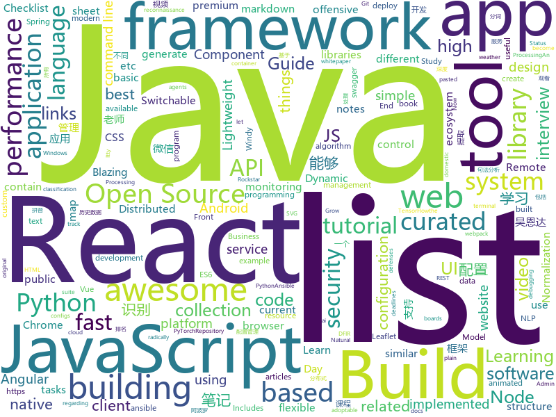

# 2018-08-01
See what the GitHub community is most excited about today.

## python
* [glances](https://github.com/nicolargo/glances)(**191 stars today**): Glances an Eye on your system. A top/htop alternative.
* [system-design-primer](https://github.com/donnemartin/system-design-primer)(**160 stars today**): Learn how to design large-scale systems. Prep for the system design interview. Includes Anki flashcards.
* [pyxel](https://github.com/kitao/pyxel)(**163 stars today**): A retro game development environment in Python
* [Raccoon](https://github.com/evyatarmeged/Raccoon)(**145 stars today**): A high performance offensive security tool for reconnaissance and vulnerability scanning
* [Photon](https://github.com/s0md3v/Photon)(**144 stars today**): Incredibly fast crawler which extracts urls, emails, files, website accounts and much more.
* [termgraph](https://github.com/mkaz/termgraph)(**136 stars today**): a python command-line tool which draws basic graphs in the terminal
* [byob](https://github.com/colental/byob)(**128 stars today**): BYOB (Build Your Own Botnet)
* [faust](https://github.com/robinhood/faust)(**111 stars today**): Python Stream Processing
* [EvilOSX](https://github.com/Marten4n6/EvilOSX)(**99 stars today**): An evil RAT (Remote Administration Tool) for macOS / OS X.
* [models](https://github.com/tensorflow/models)(**68 stars today**): Models and examples built with TensorFlow
* [cheat.sh](https://github.com/chubin/cheat.sh)(**74 stars today**): the only cheat sheet you need
* [cleverhans](https://github.com/tensorflow/cleverhans)(**70 stars today**): An adversarial example library for constructing attacks, building defenses, and benchmarking both
* [pythia](https://github.com/facebookresearch/pythia)(**57 stars today**): A software suite for Visual Question Answering
* [ShuffleNet_V2_pytorch_caffe](https://github.com/miaow1988/ShuffleNet_V2_pytorch_caffe)(**51 stars today**): ShuffleNet-V2 for both PyTorch and Caffe.
* [awesome-python](https://github.com/vinta/awesome-python)(**46 stars today**): A curated list of awesome Python frameworks, libraries, software and resources
* [django](https://github.com/django/django)(**36 stars today**): The Web framework for perfectionists with deadlines.
* [public-apis](https://github.com/toddmotto/public-apis)(**40 stars today**): A collective list of public JSON APIs for use in web development.
* [erpnext](https://github.com/frappe/erpnext)(**41 stars today**): Open Source ERP built for the web
* [odoo](https://github.com/odoo/odoo)(**36 stars today**): Odoo. Open Source Apps To Grow Your Business.
* [scikit-learn](https://github.com/scikit-learn/scikit-learn)(**29 stars today**): scikit-learn: machine learning in Python
* [ansible](https://github.com/ansible/ansible)(**27 stars today**): Ansible is a radically simple IT automation platform that makes your applications and systems easier to deploy. Avoid writing scripts or custom code to deploy and update your applications — automate in a language that approaches plain English, using SSH, with no agents to install on remote systems. https://docs.ansible.com/ansible/
* [youtube-dl](https://github.com/rg3/youtube-dl)(**35 stars today**): Command-line program to download videos from YouTube.com and other video sites
* [keras](https://github.com/keras-team/keras)(**27 stars today**): Deep Learning for humans
* [flask](https://github.com/pallets/flask)(**30 stars today**): The Python micro framework for building web applications.
* [incubator-mxnet](https://github.com/apache/incubator-mxnet)(**32 stars today**): Lightweight, Portable, Flexible Distributed/Mobile Deep Learning with Dynamic, Mutation-aware Dataflow Dep Scheduler; for Python, R, Julia, Scala, Go, Javascript and more

## java
* [Java-Interview](https://github.com/crossoverJie/Java-Interview)(**166 stars today**): 👨‍🎓Java related : basic, concurrent, algorithm
* [java-design-patterns](https://github.com/iluwatar/java-design-patterns)(**79 stars today**): Design patterns implemented in Java
* [Android-Cheat-sheet](https://github.com/anitaa1990/Android-Cheat-sheet)(**60 stars today**): Cheat Sheet for Android Interviews
* [Java-Guide](https://github.com/Snailclimb/Java-Guide)(**54 stars today**): 📖Java面试通关手册（Java学习指南）Java Interview Customs Manual (Java Study Guide)
* [Sentinel](https://github.com/alibaba/Sentinel)(**49 stars today**): A lightweight flow-control library providing high-available protection and monitoring (高可用防护的流量管理框架)
* [weixin-java-tools](https://github.com/Wechat-Group/weixin-java-tools)(**48 stars today**): 全能微信Java开发工具包，支持包括微信支付、开放平台、小程序、企业号和公众号等的开发
* [spring-boot](https://github.com/spring-projects/spring-boot)(**42 stars today**): Spring Boot
* [fvip](https://github.com/CrazyDudo/fvip)(**45 stars today**): 【Android版】一个可以观看国内主流视频平台所有视频的客户端（Mac、Windows、Linux） A client that can watch video of domestic(China) mainstream video platform
* [incubator-dubbo](https://github.com/apache/incubator-dubbo)(**38 stars today**): Apache Dubbo (incubating) is a high-performance, java based, open source RPC framework.
* [MyPerf4J](https://github.com/ThinkpadNC5/MyPerf4J)(**44 stars today**): A high performance and non-intrusive real-time Java method performance monitoring and statistical tool.
* [proxyee-down](https://github.com/proxyee-down-org/proxyee-down)(**40 stars today**): http下载工具，基于http代理，支持多连接分块下载
* [LockDemo](https://github.com/wzx54321/LockDemo)(**40 stars today**): 指纹识别、图形识别、aliOCR识别
* [elasticsearch](https://github.com/elastic/elasticsearch)(**30 stars today**): Open Source, Distributed, RESTful Search Engine
* [java-tron](https://github.com/tronprotocol/java-tron)(**32 stars today**): Java implementation of the Tron whitepaper
* [jib](https://github.com/GoogleContainerTools/jib)(**33 stars today**): ⛵️Build container images for your Java applications.
* [nacos](https://github.com/alibaba/nacos)(**31 stars today**): an easy-to-use dynamic service discovery, configuration and service management platform for building cloud native applications
* [Tumbleweed](https://github.com/noties/Tumbleweed)(**33 stars today**): Easy interpolations for Java & Android projects
* [ComponentDemo](https://github.com/renxuelong/ComponentDemo)(**28 stars today**): Android 组件化架构 Demo
* [kafka](https://github.com/apache/kafka)(**28 stars today**): Mirror of Apache Kafka
* [spring-framework](https://github.com/spring-projects/spring-framework)(**23 stars today**): Spring Framework
* [tutorials](https://github.com/eugenp/tutorials)(**11 stars today**): The "REST With Spring" Course:
* [Java](https://github.com/TheAlgorithms/Java)(**25 stars today**): All Algorithms implemented in Java
* [apollo](https://github.com/ctripcorp/apollo)(**25 stars today**): Apollo（阿波罗）是携程框架部门研发的分布式配置中心，能够集中化管理应用不同环境、不同集群的配置，配置修改后能够实时推送到应用端，并且具备规范的权限、流程治理等特性，适用于微服务配置管理场景。
* [HanLP](https://github.com/hankcs/HanLP)(**25 stars today**): 自然语言处理 中文分词 词性标注 命名实体识别 依存句法分析 关键词提取 新词发现 短语提取 自动摘要 文本分类 拼音简繁
* [RxJava](https://github.com/ReactiveX/RxJava)(**24 stars today**): RxJava – Reactive Extensions for the JVM – a library for composing asynchronous and event-based programs using observable sequences for the Java VM.

## unknown
* [100-Days-Of-ML-Code](https://github.com/Avik-Jain/100-Days-Of-ML-Code)(**636 stars today**): 100 Days of ML Coding
* [Front-End-Performance-Checklist](https://github.com/thedaviddias/Front-End-Performance-Checklist)(**448 stars today**): 🎮The only Front-End Performance Checklist that runs faster than the others
* [Interview-Notebook](https://github.com/CyC2018/Interview-Notebook)(**181 stars today**): 📝准备秋招学习笔记
* [rockstar](https://github.com/dylanbeattie/rockstar)(**153 stars today**): The Rockstar programming language specification
* [russian-troll-tweets](https://github.com/fivethirtyeight/russian-troll-tweets)(**132 stars today**): 
* [build-your-own-x](https://github.com/danistefanovic/build-your-own-x)(**95 stars today**): 🤓Build your own (insert technology here)
* [InterviewMap](https://github.com/InterviewMap/InterviewMap)(**86 stars today**): Build the best interview map. The current content includes JS, network, browser related, performance optimization, security, framework, Git, data structure, algorithm, etc.
* [You-Dont-Know-JS](https://github.com/getify/You-Dont-Know-JS)(**78 stars today**): A book series on JavaScript. @YDKJS on twitter.
* [architect-awesome](https://github.com/xingshaocheng/architect-awesome)(**57 stars today**): 后端架构师技术图谱
* [awesome](https://github.com/sindresorhus/awesome)(**61 stars today**): 😎Curated list of awesome lists
* [awesome-vue](https://github.com/vuejs/awesome-vue)(**56 stars today**): 🎉A curated list of awesome things related to Vue.js
* [gitignore](https://github.com/github/gitignore)(**44 stars today**): A collection of useful .gitignore templates
* [project-based-learning](https://github.com/tuvtran/project-based-learning)(**49 stars today**): Curated list of project-based tutorials
* [free-programming-books](https://github.com/EbookFoundation/free-programming-books)(**41 stars today**): 📚Freely available programming books
* [Front-End-Performance-Checklist](https://github.com/lex111/Front-End-Performance-Checklist)(**47 stars today**): 🎮Единственный чек-лист производительности фронтенда, который справляется лучше других
* [my-arsenal-of-aws-security-tools](https://github.com/toniblyx/my-arsenal-of-aws-security-tools)(**43 stars today**): List of open source tools for AWS security: defensive, offensive, auditing, DFIR, etc.
* [trackerslist](https://github.com/ngosang/trackerslist)(**36 stars today**): An updated list of public BitTorrent trackers
* [awesome-flutter](https://github.com/Solido/awesome-flutter)(**36 stars today**): An awesome list that curates the best Flutter libraries, tools, tutorials, articles and more.
* [awesome](https://github.com/statamic/awesome)(**36 stars today**): A collection of awesome Statamic articles, links, resources and other rad things.
* [grokking-pytorch](https://github.com/Kaixhin/grokking-pytorch)(**35 stars today**): The Hitchiker's Guide to PyTorch
* [NLP-progress](https://github.com/sebastianruder/NLP-progress)(**28 stars today**): Repository to track the progress in Natural Language Processing (NLP), including the datasets and the current state-of-the-art for the most common NLP tasks.
* [Front-End-Performance-Checklist](https://github.com/JohnsenZhou/Front-End-Performance-Checklist)(**27 stars today**): 🎮前端性能清单，让你的网站跑的更快
* [react-redux-links](https://github.com/markerikson/react-redux-links)(**28 stars today**): Curated tutorial and resource links I've collected on React, Redux, ES6, and more
* [AndroidNote](https://github.com/CharonChui/AndroidNote)(**25 stars today**): Android study notes.
* [awesome-react](https://github.com/enaqx/awesome-react)(**24 stars today**): A collection of awesome things regarding React ecosystem.

## javascript
* [mdx-deck](https://github.com/jxnblk/mdx-deck)(**744 stars today**): MDX-based presentation decks
* [terminalizer](https://github.com/faressoft/terminalizer)(**687 stars today**): 🦄Record your terminal and generate animated gif images
* [javascript-algorithms](https://github.com/trekhleb/javascript-algorithms)(**617 stars today**): Algorithms and data structures implemented in JavaScript with explanations and links to further readings
* [apexcharts.js](https://github.com/apexcharts/apexcharts.js)(**478 stars today**): A JavaScript Chart Library
* [ndb](https://github.com/GoogleChromeLabs/ndb)(**193 stars today**): ndb is an improved debugging experience for Node.js, enabled by Chrome DevTools
* [taskbook](https://github.com/klauscfhq/taskbook)(**177 stars today**): 📓Tasks, boards & notes for the command-line habitat
* [vue](https://github.com/vuejs/vue)(**155 stars today**): 🖖A progressive, incrementally-adoptable JavaScript framework for building UI on the web.
* [canvas-sketch](https://github.com/sbussard/canvas-sketch)(**107 stars today**): App to sketch out a business model canvas
* [react](https://github.com/facebook/react)(**90 stars today**): A declarative, efficient, and flexible JavaScript library for building user interfaces.
* [axios](https://github.com/axios/axios)(**83 stars today**): Promise based HTTP client for the browser and node.js
* [jsinspect](https://github.com/danielstjules/jsinspect)(**84 stars today**): Detect copy-pasted and structurally similar code
* [create-react-app](https://github.com/facebook/create-react-app)(**67 stars today**): Create React apps with no build configuration.
* [mdx](https://github.com/mdx-js/mdx)(**77 stars today**): JSX in Markdown for ambitious projects
* [Ghost](https://github.com/TryGhost/Ghost)(**66 stars today**): The platform for professional publishers
* [serviceworker-cookbook](https://github.com/mozilla/serviceworker-cookbook)(**68 stars today**): It's online. It's offline. It's a Service Worker!
* [Front-End-Checklist](https://github.com/thedaviddias/Front-End-Checklist)(**66 stars today**): 🗂The perfect Front-End Checklist for modern websites and meticulous developers
* [puppeteer](https://github.com/GoogleChrome/puppeteer)(**56 stars today**): Headless Chrome Node API
* [gatsby](https://github.com/gatsbyjs/gatsby)(**52 stars today**): ⚛️📄🚀Blazing fast site generator for React
* [mermaid](https://github.com/knsv/mermaid)(**60 stars today**): Generation of diagram and flowchart from text in a similar manner as markdown
* [parcel](https://github.com/parcel-bundler/parcel)(**54 stars today**): 📦🚀Blazing fast, zero configuration web application bundler
* [Historical-ranking-data-visualization-based-on-d3.js](https://github.com/Jannchie/Historical-ranking-data-visualization-based-on-d3.js)(**51 stars today**): 这是一个数据可视化项目，能够将历史数据排名转化为动态柱状图图表
* [realworld](https://github.com/gothinkster/realworld)(**51 stars today**): "The mother of all demo apps" — Exemplary fullstack Medium.com clone powered by React, Angular, Node, Django, and many more🏅
* [between.js](https://github.com/sasha240100/between.js)(**52 stars today**): Lightweight JavaScript (ES6) tweening engine
* [react-native](https://github.com/facebook/react-native)(**45 stars today**): A framework for building native apps with React.
* [storybook](https://github.com/storybooks/storybook)(**48 stars today**): Interactive UI component dev & test: React, React Native, Vue, Angular

## html
* [awesome-mac](https://github.com/jaywcjlove/awesome-mac)(**65 stars today**):  Now we have become very big, Different from the original idea. Collect premium software in various categories.
* [styleguide](https://github.com/google/styleguide)(**24 stars today**): Style guides for Google-originated open-source projects
* [AdminLTE](https://github.com/almasaeed2010/AdminLTE)(**20 stars today**): AdminLTE - Free Premium Admin control Panel Theme Based On Bootstrap 3.x
* [fastText](https://github.com/facebookresearch/fastText)(**15 stars today**): Library for fast text representation and classification.
* [Spoon-Knife](https://github.com/octocat/Spoon-Knife)(****): This repo is for demonstration purposes only.
* [react-app-rewired](https://github.com/timarney/react-app-rewired)(**16 stars today**): Override create-react-app webpack configs without ejecting
* [deeplearning_ai_books](https://github.com/fengdu78/deeplearning_ai_books)(**11 stars today**): deeplearning.ai（吴恩达老师的深度学习课程笔记及资源）
* [portainer](https://github.com/portainer/portainer)(**14 stars today**): Simple management UI for Docker
* [JavaScript30](https://github.com/wesbos/JavaScript30)(**9 stars today**): 30 Day Vanilla JS Challenge
* [Coursera-ML-AndrewNg-Notes](https://github.com/fengdu78/Coursera-ML-AndrewNg-Notes)(**11 stars today**): 吴恩达老师的机器学习课程个人笔记
* [Switchable-Normalization](https://github.com/switchablenorms/Switchable-Normalization)(**12 stars today**): Code for Switchable Normalization from "Differentiable Learning-to-Normalize via Switchable Normalization", https://arxiv.org/abs/1806.10779
* [swagger-codegen](https://github.com/swagger-api/swagger-codegen)(**9 stars today**): swagger-codegen contains a template-driven engine to generate documentation, API clients and server stubs in different languages by parsing your OpenAPI / Swagger definition.
* [ecma262](https://github.com/tc39/ecma262)(**11 stars today**): Status, process, and documents for ECMA262
* [Iosevka](https://github.com/be5invis/Iosevka)(**11 stars today**): Slender typeface for code, from code.
* [polymer](https://github.com/Polymer/polymer)(**10 stars today**): Build modern apps using web components
* [30-seconds-of-css](https://github.com/atomiks/30-seconds-of-css)(**10 stars today**): A curated collection of useful CSS snippets.
* [itty-bitty](https://github.com/alcor/itty-bitty)(**10 stars today**): Itty.bitty is a tool to create links that contain small sites
* [react-from-zero](https://github.com/kay-is/react-from-zero)(**9 stars today**): A simple (99% ES2015 less) tutorial for React
* [smart-contract-best-practices](https://github.com/ConsenSys/smart-contract-best-practices)(**8 stars today**): A guide to smart contract security best practices
* [keep-a-changelog](https://github.com/olivierlacan/keep-a-changelog)(**7 stars today**): If you build software, keep a changelog.
* [primeng](https://github.com/primefaces/primeng)(**6 stars today**): UI Components for Angular
* [API](https://github.com/windycom/API)(**8 stars today**): 🏄Windy API, or Windy Leaflet Plugin, let you put animated weather map into your website and enjoy rich ecosystem of Leaflet library.
* [simple-icons](https://github.com/simple-icons/simple-icons)(**7 stars today**): SVG icons for popular brands
* [proposal-optional-chaining](https://github.com/tc39/proposal-optional-chaining)(**8 stars today**): 
* [material-design-lite](https://github.com/google/material-design-lite)(****): Material Design Components in HTML/CSS/JS

## WordCloud

