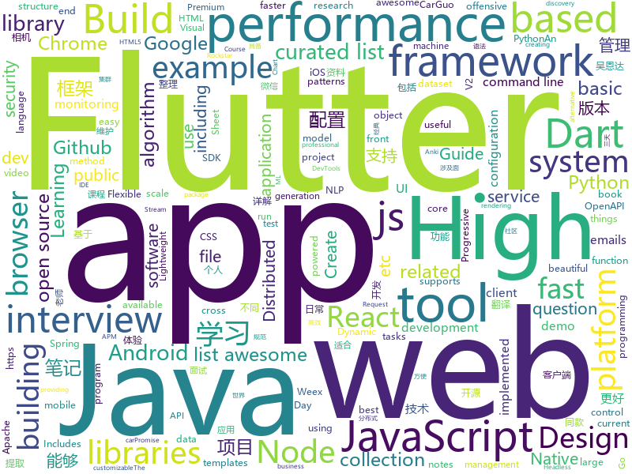

# 2018-08-02
See what the GitHub community is most excited about today.

## python
* [faust](https://github.com/robinhood/faust)(**976 stars today**): Python Stream Processing
* [100-Days-Of-ML-Code](https://github.com/Avik-Jain/100-Days-Of-ML-Code)(**568 stars today**): 100 Days of ML Coding
* [system-design-primer](https://github.com/donnemartin/system-design-primer)(**188 stars today**): Learn how to design large-scale systems. Prep for the system design interview. Includes Anki flashcards.
* [models](https://github.com/tensorflow/models)(**63 stars today**): Models and examples built with TensorFlow
* [glances](https://github.com/nicolargo/glances)(**91 stars today**): Glances an Eye on your system. A top/htop alternative.
* [cheat.sh](https://github.com/chubin/cheat.sh)(**83 stars today**): the only cheat sheet you need
* [Raccoon](https://github.com/evyatarmeged/Raccoon)(**81 stars today**): A high performance offensive security tool for reconnaissance and vulnerability scanning
* [Photon](https://github.com/s0md3v/Photon)(**79 stars today**): Incredibly fast crawler which extracts urls, emails, files, website accounts and much more.
* [termgraph](https://github.com/mkaz/termgraph)(**73 stars today**): a python command-line tool which draws basic graphs in the terminal
* [pyxel](https://github.com/kitao/pyxel)(**73 stars today**): A retro game development environment in Python
* [cleverhans](https://github.com/tensorflow/cleverhans)(**57 stars today**): An adversarial example library for constructing attacks, building defenses, and benchmarking both
* [byob](https://github.com/colental/byob)(**55 stars today**): BYOB (Build Your Own Botnet)
* [public-apis](https://github.com/toddmotto/public-apis)(**44 stars today**): A collective list of public JSON APIs for use in web development.
* [youtube-dl](https://github.com/rg3/youtube-dl)(**41 stars today**): Command-line program to download videos from YouTube.com and other video sites
* [awesome-python](https://github.com/vinta/awesome-python)(**40 stars today**): A curated list of awesome Python frameworks, libraries, software and resources
* [autokeras](https://github.com/jhfjhfj1/autokeras)(**40 stars today**): This is a automated machine learning (AutoML) package based on Keras.
* [ShuffleNet_V2_pytorch_caffe](https://github.com/miaow1988/ShuffleNet_V2_pytorch_caffe)(**38 stars today**): ShuffleNet-V2 for both PyTorch and Caffe.
* [pythia](https://github.com/facebookresearch/pythia)(**39 stars today**): A software suite for Visual Question Answering
* [keras](https://github.com/keras-team/keras)(**31 stars today**): Deep Learning for humans
* [scikit-learn](https://github.com/scikit-learn/scikit-learn)(**29 stars today**): scikit-learn: machine learning in Python
* [EvilOSX](https://github.com/Marten4n6/EvilOSX)(**32 stars today**): An evil RAT (Remote Administration Tool) for macOS / OS X.
* [django](https://github.com/django/django)(**24 stars today**): The Web framework for perfectionists with deadlines.
* [incubator-mxnet](https://github.com/apache/incubator-mxnet)(**31 stars today**): Lightweight, Portable, Flexible Distributed/Mobile Deep Learning with Dynamic, Mutation-aware Dataflow Dep Scheduler; for Python, R, Julia, Scala, Go, Javascript and more
* [studyFiles](https://github.com/threerocks/studyFiles)(**27 stars today**): 一些经典且高质量的电子书分享
* [Detectron](https://github.com/facebookresearch/Detectron)(**26 stars today**): FAIR's research platform for object detection research, implementing popular algorithms like Mask R-CNN and RetinaNet.

## java
* [Java-Interview](https://github.com/crossoverJie/Java-Interview)(**154 stars today**): 👨‍🎓Java related : basic, concurrent, algorithm
* [Java-Guide](https://github.com/Snailclimb/Java-Guide)(**117 stars today**): 📖Java面试通关手册（Java学习指南）Java Interview Customs Manual (Java Study Guide)
* [java-design-patterns](https://github.com/iluwatar/java-design-patterns)(**89 stars today**): Design patterns implemented in Java
* [spring-boot](https://github.com/spring-projects/spring-boot)(**43 stars today**): Spring Boot
* [weixin-java-tools](https://github.com/Wechat-Group/weixin-java-tools)(**49 stars today**): 全能微信Java开发工具包，支持包括微信支付、开放平台、小程序、企业号和公众号等的开发
* [elasticsearch](https://github.com/elastic/elasticsearch)(**39 stars today**): Open Source, Distributed, RESTful Search Engine
* [graal](https://github.com/oracle/graal)(**42 stars today**): GraalVM: Run Programs Faster Anywhere🚀
* [DogCamera](https://github.com/windrunnerlihuan/DogCamera)(**40 stars today**): 狗头相机，抖音相机功能app
* [proxyee-down](https://github.com/proxyee-down-org/proxyee-down)(**39 stars today**): http下载工具，基于http代理，支持多连接分块下载
* [Sentinel](https://github.com/alibaba/Sentinel)(**36 stars today**): A lightweight flow-control library providing high-available protection and monitoring (高可用防护的流量管理框架)
* [tutorials](https://github.com/eugenp/tutorials)(**23 stars today**): The "REST With Spring" Course:
* [incubator-dubbo](https://github.com/apache/incubator-dubbo)(**28 stars today**): Apache Dubbo (incubating) is a high-performance, java based, open source RPC framework.
* [guava](https://github.com/google/guava)(**33 stars today**): Google core libraries for Java
* [GradientDrawableTuner](https://github.com/duanhong169/GradientDrawableTuner)(**34 stars today**): 🕹️See how the properties of Android's "shape" affect the Drawable's appearance, intuitively.
* [spring-framework](https://github.com/spring-projects/spring-framework)(**28 stars today**): Spring Framework
* [java-tron](https://github.com/tronprotocol/java-tron)(**32 stars today**): Java implementation of the Tron whitepaper
* [nacos](https://github.com/alibaba/nacos)(**31 stars today**): an easy-to-use dynamic service discovery, configuration and service management platform for building cloud native applications
* [HanLP](https://github.com/hankcs/HanLP)(**31 stars today**): 自然语言处理 中文分词 词性标注 命名实体识别 依存句法分析 关键词提取 新词发现 短语提取 自动摘要 文本分类 拼音简繁
* [Java](https://github.com/TheAlgorithms/Java)(**26 stars today**): All Algorithms implemented in Java
* [Android-Cheat-sheet](https://github.com/anitaa1990/Android-Cheat-sheet)(**27 stars today**): Cheat Sheet for Android Interviews
* [incubator-skywalking](https://github.com/apache/incubator-skywalking)(**28 stars today**): A distributed tracing system, and APM ( Application Performance Monitoring )
* [MyPerf4J](https://github.com/ThinkpadNC5/MyPerf4J)(**29 stars today**): A high performance and non-intrusive real-time Java method performance monitoring and statistical tool.
* [ComponentDemo](https://github.com/renxuelong/ComponentDemo)(**25 stars today**): Android 组件化架构 Demo
* [rocketmq](https://github.com/apache/rocketmq)(**22 stars today**): Mirror of Apache RocketMQ
* [apollo](https://github.com/ctripcorp/apollo)(**23 stars today**): Apollo（阿波罗）是携程框架部门研发的分布式配置中心，能够集中化管理应用不同环境、不同集群的配置，配置修改后能够实时推送到应用端，并且具备规范的权限、流程治理等特性，适用于微服务配置管理场景。

## unknown
* [Front-End-Performance-Checklist](https://github.com/thedaviddias/Front-End-Performance-Checklist)(**276 stars today**): 🎮The only Front-End Performance Checklist that runs faster than the others
* [Interview-Notebook](https://github.com/CyC2018/Interview-Notebook)(**186 stars today**): 📝准备秋招学习笔记
* [russian-troll-tweets](https://github.com/fivethirtyeight/russian-troll-tweets)(**111 stars today**): 
* [InterviewMap](https://github.com/InterviewMap/InterviewMap)(**93 stars today**): Build the best interview map. The current content includes JS, network, browser related, performance optimization, security, framework, Git, data structure, algorithm, etc.
* [rockstar](https://github.com/dylanbeattie/rockstar)(**98 stars today**): The Rockstar programming language specification
* [You-Dont-Know-JS](https://github.com/getify/You-Dont-Know-JS)(**65 stars today**): A book series on JavaScript. @YDKJS on twitter.
* [trackerslist](https://github.com/ngosang/trackerslist)(**72 stars today**): An updated list of public BitTorrent trackers
* [build-your-own-x](https://github.com/danistefanovic/build-your-own-x)(**72 stars today**): 🤓Build your own (insert technology here)
* [gitignore](https://github.com/github/gitignore)(**50 stars today**): A collection of useful .gitignore templates
* [free-programming-books](https://github.com/EbookFoundation/free-programming-books)(**63 stars today**): 📚Freely available programming books
* [awesome](https://github.com/sindresorhus/awesome)(**66 stars today**): 😎Curated list of awesome lists
* [IMDb-Face](https://github.com/fwang91/IMDb-Face)(**57 stars today**): A new large-scale noise-controlled face recognition dataset.
* [architect-awesome](https://github.com/xingshaocheng/architect-awesome)(**45 stars today**): 后端架构师技术图谱
* [awesome-vue](https://github.com/vuejs/awesome-vue)(**47 stars today**): 🎉A curated list of awesome things related to Vue.js
* [what-happens-when](https://github.com/alex/what-happens-when)(**39 stars today**): An attempt to answer the age old interview question "What happens when you type google.com into your browser and press enter?"
* [project-based-learning](https://github.com/tuvtran/project-based-learning)(**35 stars today**): Curated list of project-based tutorials
* [NLP-progress](https://github.com/sebastianruder/NLP-progress)(**28 stars today**): Repository to track the progress in Natural Language Processing (NLP), including the datasets and the current state-of-the-art for the most common NLP tasks.
* [grokking-pytorch](https://github.com/Kaixhin/grokking-pytorch)(**29 stars today**): The Hitchiker's Guide to PyTorch
* [metoo](https://github.com/china-public-events/metoo)(**30 stars today**): metoo in china
* [awesome-flutter](https://github.com/Solido/awesome-flutter)(**28 stars today**): An awesome list that curates the best Flutter libraries, tools, tutorials, articles and more.
* [my-arsenal-of-aws-security-tools](https://github.com/toniblyx/my-arsenal-of-aws-security-tools)(**25 stars today**): List of open source tools for AWS security: defensive, offensive, auditing, DFIR, etc.
* [gold-miner](https://github.com/xitu/gold-miner)(**24 stars today**): 🥇掘金翻译计划，可能是世界最大最好的英译中技术社区，最懂读者和译者的翻译平台：
* [Front-end-Developer-Interview-Questions](https://github.com/h5bp/Front-end-Developer-Interview-Questions)(**21 stars today**): A list of helpful front-end related questions you can use to interview potential candidates, test yourself or completely ignore.
* [awesome-cpp](https://github.com/fffaraz/awesome-cpp)(**22 stars today**): A curated list of awesome C++ (or C) frameworks, libraries, resources, and shiny things. Inspired by awesome-... stuff.
* [awesome-scalability](https://github.com/binhnguyennus/awesome-scalability)(**21 stars today**): High Scalability, High Availability, High Stability, High Performance, and High Intelligence System Design Patterns

## javascript
* [taskbook](https://github.com/klauscfhq/taskbook)(**1,631 stars today**): 📓Tasks, boards & notes for the command-line habitat
* [javascript-algorithms](https://github.com/trekhleb/javascript-algorithms)(**432 stars today**): Algorithms and data structures implemented in JavaScript with explanations and links to further readings
* [apexcharts.js](https://github.com/apexcharts/apexcharts.js)(**380 stars today**): A JavaScript Chart Library
* [terminalizer](https://github.com/faressoft/terminalizer)(**365 stars today**): 🦄Record your terminal and generate animated gif images
* [mdx-deck](https://github.com/jxnblk/mdx-deck)(**348 stars today**): MDX-based presentation decks
* [ndb](https://github.com/GoogleChromeLabs/ndb)(**160 stars today**): ndb is an improved debugging experience for Node.js, enabled by Chrome DevTools
* [vue](https://github.com/vuejs/vue)(**132 stars today**): 🖖A progressive, incrementally-adoptable JavaScript framework for building UI on the web.
* [react](https://github.com/facebook/react)(**107 stars today**): A declarative, efficient, and flexible JavaScript library for building user interfaces.
* [create-react-app](https://github.com/facebook/create-react-app)(**72 stars today**): Create React apps with no build configuration.
* [carbon](https://github.com/dawnlabs/carbon)(**81 stars today**): 🎨Create and share beautiful images of your source code
* [ClearGDPR](https://github.com/ClearGDPR/ClearGDPR)(**67 stars today**): GDPR Compliance Solution
* [fusion-core](https://github.com/fusionjs/fusion-core)(**77 stars today**): Core FusionJS package
* [react-stripe-store](https://github.com/binx/react-stripe-store)(**74 stars today**): roll your own ecommerce store! example:
* [zii](https://github.com/staltz/zii)(**72 stars today**): Chain function calls using a prototype function z
* [mocs](https://github.com/akhenakh/mocs)(**72 stars today**): My Own Car System, a Go & Qt application for your car
* [axios](https://github.com/axios/axios)(**62 stars today**): Promise based HTTP client for the browser and node.js
* [fusion-react](https://github.com/fusionjs/fusion-react)(**64 stars today**): Fusion.js for React
* [Historical-ranking-data-visualization-based-on-d3.js](https://github.com/Jannchie/Historical-ranking-data-visualization-based-on-d3.js)(**58 stars today**): 这是一个数据可视化项目，能够将历史数据排名转化为动态柱状图图表
* [realworld](https://github.com/gothinkster/realworld)(**60 stars today**): "The mother of all demo apps" — Exemplary fullstack Medium.com clone powered by React, Angular, Node, Django, and many more🏅
* [canvas-sketch](https://github.com/sbussard/canvas-sketch)(**58 stars today**): App to sketch out a business model canvas
* [Ghost](https://github.com/TryGhost/Ghost)(**57 stars today**): The platform for professional publishers
* [node](https://github.com/nodejs/node)(**54 stars today**): Node.js JavaScript runtime✨🐢🚀✨
* [puppeteer](https://github.com/GoogleChrome/puppeteer)(**54 stars today**): Headless Chrome Node API
* [mdx](https://github.com/mdx-js/mdx)(**53 stars today**): JSX in Markdown for ambitious projects
* [serviceworker-cookbook](https://github.com/mozilla/serviceworker-cookbook)(**53 stars today**): It's online. It's offline. It's a Service Worker!

## html
* [workshop-sf18](https://github.com/yyx990803/workshop-sf18)(**45 stars today**): 
* [styleguide](https://github.com/google/styleguide)(**25 stars today**): Style guides for Google-originated open-source projects
* [awesome-mac](https://github.com/jaywcjlove/awesome-mac)(**23 stars today**):  Now we have become very big, Different from the original idea. Collect premium software in various categories.
* [AdminLTE](https://github.com/almasaeed2010/AdminLTE)(**17 stars today**): AdminLTE - Free Premium Admin control Panel Theme Based On Bootstrap 3.x
* [Spoon-Knife](https://github.com/octocat/Spoon-Knife)(****): This repo is for demonstration purposes only.
* [Web-efficient-notes](https://github.com/lsxlsxxslxsl/Web-efficient-notes)(**15 stars today**): Web高效编程阅读笔记整理
* [capacitor](https://github.com/ionic-team/capacitor)(**14 stars today**): Build cross-platform Native Progressive Web Apps for iOS, Android, and the web⚡️
* [JavaScript30](https://github.com/wesbos/JavaScript30)(**9 stars today**): 30 Day Vanilla JS Challenge
* [Coursera-ML-AndrewNg-Notes](https://github.com/fengdu78/Coursera-ML-AndrewNg-Notes)(**11 stars today**): 吴恩达老师的机器学习课程个人笔记
* [baby-time](https://github.com/justjavac/baby-time)(**13 stars today**): gift for justjavac's baby
* [portainer](https://github.com/portainer/portainer)(**12 stars today**): Simple management UI for Docker
* [PHP-Interview](https://github.com/xianyunyh/PHP-Interview)(**10 stars today**): PHP面试整理的资料。包括PHP、MySQL、Linux、计算机网络等资料,欢迎提交pr，如果错误，请指出，谢谢
* [fastText](https://github.com/facebookresearch/fastText)(**10 stars today**): Library for fast text representation and classification.
* [polymer](https://github.com/Polymer/polymer)(**10 stars today**): Build modern apps using web components
* [node-interview](https://github.com/ElemeFE/node-interview)(**10 stars today**): How to pass the Node.js interview of ElemeFE.
* [30-seconds-of-css](https://github.com/atomiks/30-seconds-of-css)(**10 stars today**): A curated collection of useful CSS snippets.
* [openapi-generator](https://github.com/OpenAPITools/openapi-generator)(**9 stars today**): OpenAPI Generator allows generation of API client libraries (SDK generation), server stubs, documentation and configuration automatically given an OpenAPI Spec (v2, v3)
* [cs231n.github.io](https://github.com/cs231n/cs231n.github.io)(**8 stars today**): Public facing notes page
* [core](https://github.com/stackblitz/core)(**9 stars today**): Online IDE powered by Visual Studio Code⚡️
* [nodejs-ex](https://github.com/sclorg/nodejs-ex)(****): node.js example
* [react-app-rewired](https://github.com/timarney/react-app-rewired)(**10 stars today**): Override create-react-app webpack configs without ejecting
* [deeplearning_ai_books](https://github.com/fengdu78/deeplearning_ai_books)(**9 stars today**): deeplearning.ai（吴恩达老师的深度学习课程笔记及资源）
* [blackeye](https://github.com/thelinuxchoice/blackeye)(**8 stars today**): The most complete Phishing Tool, with 32 templates +1 customizable
* [EIPs](https://github.com/ethereum/EIPs)(**7 stars today**): The Ethereum Improvement Proposal repository
* [material-design-lite](https://github.com/google/material-design-lite)(****): Material Design Components in HTML/CSS/JS

## dart
* [flutter](https://github.com/flutter/flutter)(**125 stars today**): Flutter makes it easy and fast to build beautiful mobile apps.
* [GSYGithubAppFlutter](https://github.com/CarGuo/GSYGithubAppFlutter)(**43 stars today**): 超完整的Flutter项目，功能丰富，适合学习和日常使用。GSYGithubApp系列的优势：我们目前已经拥有Flutter、Weex、ReactNative三个版本。 功能齐全，项目框架内技术涉及面广，完成度高，持续维护，配套文章，适合全面学习，跨框架对比参考。跨平台的开源Github客户端App，更好的体验，更丰富的功能，旨在更好的日常管理和维护个人Github，提供更好更方便的驾车体验～～Σ(￣。￣ﾉ)ﾉ。同款Weex版本 ： https://github.com/CarGuo/GSYGithubAppWeex 、同款React Native版本 ： https://github.com/CarGuo/GSYGithubApp
* [plugins](https://github.com/flutter/plugins)(**38 stars today**): Plugins for Flutter, including FlutterFire, maintained by the Flutter team
* [flutter_ui_challenge_flight_search](https://github.com/MarcinusX/flutter_ui_challenge_flight_search)(**23 stars today**): 
* [dio](https://github.com/flutterchina/dio)(**23 stars today**): A powerful Http client for Dart, which supports Interceptors, FormData, Request Cancellation, File Downloading, Timeout etc.
* [flutter_study](https://github.com/luhenchang/flutter_study)(**18 stars today**): 三天学会Flutter
* [Flutter-learning](https://github.com/AweiLoveAndroid/Flutter-learning)(**15 stars today**): 🔥👍🌟⭐️⭐️⭐️Flutter从配置安装到填坑指南详解，Flutter相关Demo解读，项目实例，Dart语法详解
* [Flutter_YYeTs](https://github.com/PopeyeLau/Flutter_YYeTs)(**11 stars today**): Flutter YYets Demo
* [Flutter-UI-Kit](https://github.com/iampawan/Flutter-UI-Kit)(**9 stars today**): Flutter app for collection of UI in a UIKit
* [FlutterPlayground](https://github.com/ibhavikmakwana/FlutterPlayground)(**8 stars today**): Playground app for Flutter
* [sdk](https://github.com/dart-lang/sdk)(**7 stars today**): The Dart SDK, including the VM, dart2js, core libraries, and more.
* [samples](https://github.com/flutter/samples)(**6 stars today**): A collection of Flutter examples and demos.
* [charts](https://github.com/google/charts)(**5 stars today**): 
* [pageloader](https://github.com/google/pageloader)(****): A framework for creating page objects for in-browser or WebDriver tests.
* [mailer](https://github.com/kaisellgren/mailer)(****): Compose and send emails from Dart. Supports file attachments, HTML emails and multiple transport methods.
* [flutter_cache_manager](https://github.com/renefloor/flutter_cache_manager)(****): Generic cache manager for flutter
* [chromedeveditor](https://github.com/googlearchive/chromedeveditor)(****): Chrome Dev Editor is a developer tool for building apps on the Chrome platform - Chrome Apps and Web Apps, in JavaScript or Dart. (NO LONGER IN ACTIVE DEVELOPMENT)
* [hauberk](https://github.com/munificent/hauberk)(****): A web-based roguelike written in Dart.
* [inKino](https://github.com/roughike/inKino)(****): inKino - A cross platform movie and showtime browser for Finnkino cinemas, made with Flutter.
* [flutter-examples](https://github.com/nisrulz/flutter-examples)(****): [Examples] Simple basic isolated apps, for budding flutter devs.
* [flutter_architecture_samples](https://github.com/brianegan/flutter_architecture_samples)(****): TodoMVC for Flutter
* [flutter-osc](https://github.com/yubo725/flutter-osc)(****): 基于Google Flutter的开源中国客户端，支持Android和iOS。
* [angular](https://github.com/dart-lang/angular)(****): Fast and productive web framework provided by Dart
* [StageXL](https://github.com/bp74/StageXL)(****): A fast and universal 2D rendering engine for HTML5 and Dart.
* [FlutterExampleApps](https://github.com/iampawan/FlutterExampleApps)(****): [Example APPS] Basic Flutter apps, for flutter devs.

## WordCloud

