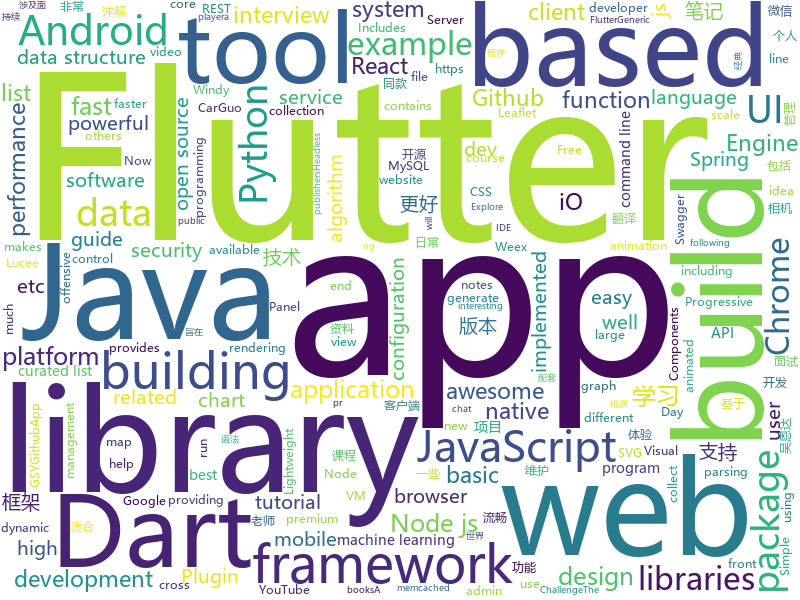

# 2018-08-03
See what the GitHub community is most excited about today.

## python
* [pyxel](https://github.com/kitao/pyxel)(**1,374 stars today**): A retro game development environment in Python
* [100-Days-Of-ML-Code](https://github.com/Avik-Jain/100-Days-Of-ML-Code)(**573 stars today**): 100 Days of ML Coding
* [system-design-primer](https://github.com/donnemartin/system-design-primer)(**313 stars today**): Learn how to design large-scale systems. Prep for the system design interview. Includes Anki flashcards.
* [faust](https://github.com/robinhood/faust)(**317 stars today**): Python Stream Processing
* [autokeras](https://github.com/jhfjhfj1/autokeras)(**203 stars today**): This is a automated machine learning (AutoML) package based on Keras.
* [models](https://github.com/tensorflow/models)(**85 stars today**): Models and examples built with TensorFlow
* [FeelUOwn](https://github.com/cosven/FeelUOwn)(**79 stars today**): trying to be a user-friendly and hackable music player
* [termgraph](https://github.com/mkaz/termgraph)(**70 stars today**): a python command-line tool which draws basic graphs in the terminal
* [awesome-python](https://github.com/vinta/awesome-python)(**62 stars today**): A curated list of awesome Python frameworks, libraries, software and resources
* [cheat.sh](https://github.com/chubin/cheat.sh)(**62 stars today**): the only cheat sheet you need
* [cleverhans](https://github.com/tensorflow/cleverhans)(**58 stars today**): An adversarial example library for constructing attacks, building defenses, and benchmarking both
* [Photon](https://github.com/s0md3v/Photon)(**58 stars today**): Crawler which is incredibly fast and extracts urls, emails, files, website accounts and much more.
* [Raccoon](https://github.com/evyatarmeged/Raccoon)(**57 stars today**): A high performance offensive security tool for reconnaissance and vulnerability scanning
* [keras](https://github.com/keras-team/keras)(**40 stars today**): Deep Learning for humans
* [byob](https://github.com/colental/byob)(**45 stars today**): BYOB (Build Your Own Botnet)
* [glances](https://github.com/nicolargo/glances)(**44 stars today**): Glances an Eye on your system. A top/htop alternative.
* [django](https://github.com/django/django)(**35 stars today**): The Web framework for perfectionists with deadlines.
* [flask](https://github.com/pallets/flask)(**37 stars today**): The Python micro framework for building web applications.
* [studyFiles](https://github.com/threerocks/studyFiles)(**37 stars today**): 一些经典且高质量的电子书分享
* [scikit-learn](https://github.com/scikit-learn/scikit-learn)(**34 stars today**): scikit-learn: machine learning in Python
* [youtube-dl](https://github.com/rg3/youtube-dl)(**38 stars today**): Command-line program to download videos from YouTube.com and other video sites
* [dbt](https://github.com/fishtown-analytics/dbt)(**40 stars today**): dbt (data build tool) is a command line tool that enables data analysts and engineers to transform data in their warehouse more effectively.
* [pythia](https://github.com/facebookresearch/pythia)(**38 stars today**): A software suite for Visual Question Answering
* [pandas](https://github.com/pandas-dev/pandas)(**29 stars today**): Flexible and powerful data analysis / manipulation library for Python, providing labeled data structures similar to R data.frame objects, statistical functions, and much more
* [public-apis](https://github.com/toddmotto/public-apis)(****): A collective list of public JSON APIs for use in web development.

## java
* [Java-Interview](https://github.com/crossoverJie/Java-Interview)(**198 stars today**): 👨‍🎓Java related : basic, concurrent, algorithm
* [Java-Guide](https://github.com/Snailclimb/Java-Guide)(**134 stars today**): 📖Java面试通关手册（Java学习指南）Java Interview Customs Manual (Java Study Guide)
* [Sentinel](https://github.com/alibaba/Sentinel)(**71 stars today**): A lightweight flow-control library providing high-available protection and monitoring (高可用防护的流量管理框架)
* [proxyee-down](https://github.com/proxyee-down-org/proxyee-down)(**63 stars today**): http下载工具，基于http代理，支持多连接分块下载
* [weixin-java-tools](https://github.com/Wechat-Group/weixin-java-tools)(**61 stars today**): 全能微信Java开发工具包，支持包括微信支付、开放平台、小程序、企业号和公众号等的开发
* [spring-boot](https://github.com/spring-projects/spring-boot)(**55 stars today**): Spring Boot
* [java-design-patterns](https://github.com/iluwatar/java-design-patterns)(**53 stars today**): Design patterns implemented in Java
* [Lucee](https://github.com/lucee/Lucee)(**56 stars today**): Lucee Server is a dynamic, Java based (JSR-223), tag and scripting language used for rapid web application development. Lucee simplifies technologies like webservices (REST, SOAP, HTTP), ORM (Hibernate), searching (Lucene), datasources (MSSQL, Oracle, MySQL and others), caching (infinispan, ehcache, and memcached) and many more. Lucee provides a…
* [AndroidUtilCode](https://github.com/Blankj/AndroidUtilCode)(**50 stars today**): 🔥Android developers should collect the following utils(updating).
* [DogCamera](https://github.com/windrunnerlihuan/DogCamera)(**47 stars today**): 狗头相机，抖音相机功能app
* [elasticsearch](https://github.com/elastic/elasticsearch)(**34 stars today**): Open Source, Distributed, RESTful Search Engine
* [GradientDrawableTuner](https://github.com/duanhong169/GradientDrawableTuner)(**38 stars today**): 🕹️See how the properties of Android's "shape" affect the Drawable's appearance, intuitively.
* [incubator-dubbo](https://github.com/apache/incubator-dubbo)(**31 stars today**): Apache Dubbo (incubating) is a high-performance, java based, open source RPC framework.
* [spring-framework](https://github.com/spring-projects/spring-framework)(**34 stars today**): Spring Framework
* [vjtools](https://github.com/vipshop/vjtools)(**31 stars today**): The vip.com's java coding standard, libraries and tools
* [Java](https://github.com/TheAlgorithms/Java)(**32 stars today**): All Algorithms implemented in Java
* [guava](https://github.com/google/guava)(**29 stars today**): Google core libraries for Java
* [java-tron](https://github.com/tronprotocol/java-tron)(**31 stars today**): Java implementation of the Tron whitepaper
* [tutorials](https://github.com/eugenp/tutorials)(**15 stars today**): The "REST With Spring" Course:
* [Z3SBarcodeScanner](https://github.com/AnonimowiAnalitycy/Z3SBarcodeScanner)(**23 stars today**): ZXing ("Zebra Crossing") barcode scanning library for Java, Android
* [plaid](https://github.com/nickbutcher/plaid)(**25 stars today**): An Android app which provides design news & inspiration as well as being an example of implementing material design.
* [MPAndroidChart](https://github.com/PhilJay/MPAndroidChart)(**23 stars today**): A powerful🚀Android chart view / graph view library, supporting line- bar- pie- radar- bubble- and candlestick charts as well as scaling, dragging and animations.
* [RxJava](https://github.com/ReactiveX/RxJava)(**22 stars today**): RxJava – Reactive Extensions for the JVM – a library for composing asynchronous and event-based programs using observable sequences for the Java VM.
* [nacos](https://github.com/alibaba/nacos)(**19 stars today**): an easy-to-use dynamic service discovery, configuration and service management platform for building cloud native applications
* [graal](https://github.com/oracle/graal)(**21 stars today**): GraalVM: Run Programs Faster Anywhere🚀

## unknown
* [InterviewMap](https://github.com/InterviewMap/InterviewMap)(**279 stars today**): Build the best interview map. The current content includes JS, network, browser related, performance optimization, security, framework, Git, data structure, algorithm, etc.
* [Front-End-Performance-Checklist](https://github.com/thedaviddias/Front-End-Performance-Checklist)(**210 stars today**): 🎮The only Front-End Performance Checklist that runs faster than the others
* [Interview-Notebook](https://github.com/CyC2018/Interview-Notebook)(**156 stars today**): 📝准备秋招学习笔记
* [awesome](https://github.com/sindresorhus/awesome)(**105 stars today**): 😎Curated list of awesome lists
* [You-Dont-Know-JS](https://github.com/getify/You-Dont-Know-JS)(**73 stars today**): A book series on JavaScript. @YDKJS on twitter.
* [rockstar](https://github.com/dylanbeattie/rockstar)(**76 stars today**): The Rockstar programming language specification
* [free-programming-books](https://github.com/EbookFoundation/free-programming-books)(**65 stars today**): 📚Freely available programming books
* [gitignore](https://github.com/github/gitignore)(**50 stars today**): A collection of useful .gitignore templates
* [dev.to](https://github.com/thepracticaldev/dev.to)(**65 stars today**): Where programmers share ideas and help each other grow
* [russian-troll-tweets](https://github.com/fivethirtyeight/russian-troll-tweets)(**58 stars today**): 
* [awesome-vue](https://github.com/vuejs/awesome-vue)(**53 stars today**): 🎉A curated list of awesome things related to Vue.js
* [project-based-learning](https://github.com/tuvtran/project-based-learning)(**45 stars today**): Curated list of project-based tutorials
* [iCSS](https://github.com/chokcoco/iCSS)(**45 stars today**): 谈谈一些有趣的 CSS 话题
* [architect-awesome](https://github.com/xingshaocheng/architect-awesome)(**39 stars today**): 后端架构师技术图谱
* [nodebestpractices](https://github.com/i0natan/nodebestpractices)(**39 stars today**): The largest Node.JS best practices list (July 2018)
* [Machine_Learning_Journey](https://github.com/llSourcell/Machine_Learning_Journey)(**34 stars today**): This is the Curriculum for "Machine Learning Journey" By Siraj Raval on Youtube
* [build-your-own-x](https://github.com/danistefanovic/build-your-own-x)(**38 stars today**): 🤓Build your own (insert technology here)
* [EuroPython-2018-Conference-Talk-Videos](https://github.com/sploitable/EuroPython-2018-Conference-Talk-Videos)(**31 stars today**): Jump straight to a specific talk!
* [gold-miner](https://github.com/xitu/gold-miner)(**28 stars today**): 🥇掘金翻译计划，可能是世界最大最好的英译中技术社区，最懂读者和译者的翻译平台：
* [awesome-flutter](https://github.com/Solido/awesome-flutter)(**27 stars today**): An awesome list that curates the best Flutter libraries, tools, tutorials, articles and more.
* [get-out](https://github.com/gnijuohz/get-out)(**29 stars today**): A guide
* [awesome-nodejs](https://github.com/sindresorhus/awesome-nodejs)(**27 stars today**): ⚡️Delightful Node.js packages and resources
* [my-arsenal-of-aws-security-tools](https://github.com/toniblyx/my-arsenal-of-aws-security-tools)(**27 stars today**): List of open source tools for AWS security: defensive, offensive, auditing, DFIR, etc.
* [IMDb-Face](https://github.com/fwang91/IMDb-Face)(**24 stars today**): A new large-scale noise-controlled face recognition dataset.
* [dotnetbook](https://github.com/sidristij/dotnetbook)(**24 stars today**): 

## javascript
* [taskbook](https://github.com/klauscfhq/taskbook)(**664 stars today**): 📓Tasks, boards & notes for the command-line habitat
* [javascript-algorithms](https://github.com/trekhleb/javascript-algorithms)(**334 stars today**): Algorithms and data structures implemented in JavaScript with explanations and links to further readings
* [apexcharts.js](https://github.com/apexcharts/apexcharts.js)(**340 stars today**): A JavaScript Chart Library
* [terminalizer](https://github.com/faressoft/terminalizer)(**295 stars today**): 🦄Record your terminal and generate animated gif images
* [fusion-core](https://github.com/fusionjs/fusion-core)(**162 stars today**): Core FusionJS package
* [vue](https://github.com/vuejs/vue)(**131 stars today**): 🖖A progressive, incrementally-adoptable JavaScript framework for building UI on the web.
* [mdx-deck](https://github.com/jxnblk/mdx-deck)(**135 stars today**): MDX-based presentation decks
* [react-particle-effect-button](https://github.com/transitive-bullshit/react-particle-effect-button)(**126 stars today**): Bursting particle effect buttons for React🎉
* [ndb](https://github.com/GoogleChromeLabs/ndb)(**118 stars today**): ndb is an improved debugging experience for Node.js, enabled by Chrome DevTools
* [fusion-react](https://github.com/fusionjs/fusion-react)(**111 stars today**): Fusion.js for React
* [react](https://github.com/facebook/react)(**98 stars today**): A declarative, efficient, and flexible JavaScript library for building user interfaces.
* [now-mobile](https://github.com/rdev/now-mobile)(**94 stars today**): Mobile client for Zeit's Now platform
* [anime](https://github.com/juliangarnier/anime)(**90 stars today**): JavaScript Animation Engine
* [inmap](https://github.com/TalkingData/inmap)(**80 stars today**): 大数据地理可视化
* [axios](https://github.com/axios/axios)(**74 stars today**): Promise based HTTP client for the browser and node.js
* [three.js](https://github.com/mrdoob/three.js)(**64 stars today**): JavaScript 3D library.
* [create-react-app](https://github.com/facebook/create-react-app)(**59 stars today**): Create React apps with no build configuration.
* [fiora](https://github.com/yinxin630/fiora)(**61 stars today**): An interesting chat application power by socket.io, koa, mongodb and react
* [Ghost](https://github.com/TryGhost/Ghost)(**62 stars today**): The platform for professional publishers
* [puppeteer](https://github.com/GoogleChrome/puppeteer)(**58 stars today**): Headless Chrome Node API
* [react-native](https://github.com/facebook/react-native)(**53 stars today**): A framework for building native apps with React.
* [between.js](https://github.com/sasha240100/between.js)(**57 stars today**): Lightweight JavaScript (ES6) tweening engine
* [mocs](https://github.com/akhenakh/mocs)(**56 stars today**): My Own Car System, a Go & Qt application for your car
* [zii](https://github.com/staltz/zii)(**53 stars today**): Chain function calls using a prototype function z
* [parcel](https://github.com/parcel-bundler/parcel)(**47 stars today**): 📦🚀Blazing fast, zero configuration web application bundler

## html
* [styleguide](https://github.com/google/styleguide)(**30 stars today**): Style guides for Google-originated open-source projects
* [AdminLTE](https://github.com/almasaeed2010/AdminLTE)(**24 stars today**): AdminLTE - Free Premium Admin control Panel Theme Based On Bootstrap 3.x
* [awesome-mac](https://github.com/jaywcjlove/awesome-mac)(**24 stars today**):  Now we have become very big, Different from the original idea. Collect premium software in various categories.
* [fastText](https://github.com/facebookresearch/fastText)(**21 stars today**): Library for fast text representation and classification.
* [Coursera-ML-AndrewNg-Notes](https://github.com/fengdu78/Coursera-ML-AndrewNg-Notes)(**16 stars today**): 吴恩达老师的机器学习课程个人笔记
* [JavaScript30](https://github.com/wesbos/JavaScript30)(**9 stars today**): 30 Day Vanilla JS Challenge
* [workshop-sf18](https://github.com/yyx990803/workshop-sf18)(**14 stars today**): 
* [EIPs](https://github.com/ethereum/EIPs)(**13 stars today**): The Ethereum Improvement Proposal repository
* [portainer](https://github.com/portainer/portainer)(**12 stars today**): Simple management UI for Docker
* [Spoon-Knife](https://github.com/octocat/Spoon-Knife)(****): This repo is for demonstration purposes only.
* [capacitor](https://github.com/ionic-team/capacitor)(**12 stars today**): Build cross-platform Native Progressive Web Apps for iOS, Android, and the web⚡️
* [swagger-codegen](https://github.com/swagger-api/swagger-codegen)(**11 stars today**): swagger-codegen contains a template-driven engine to generate documentation, API clients and server stubs in different languages by parsing your OpenAPI / Swagger definition.
* [API](https://github.com/windycom/API)(**11 stars today**): 🏄Windy API, or Windy Leaflet Plugin, let you put animated weather map into your website and enjoy rich ecosystem of Leaflet library.
* [primeng](https://github.com/primefaces/primeng)(**10 stars today**): UI Components for Angular
* [PHP-Interview](https://github.com/xianyunyh/PHP-Interview)(**10 stars today**): PHP面试整理的资料。包括PHP、MySQL、Linux、计算机网络等资料,欢迎提交pr，如果错误，请指出，谢谢
* [node-interview](https://github.com/ElemeFE/node-interview)(**10 stars today**): How to pass the Node.js interview of ElemeFE.
* [deeplearning_ai_books](https://github.com/fengdu78/deeplearning_ai_books)(**9 stars today**): deeplearning.ai（吴恩达老师的深度学习课程笔记及资源）
* [simple-icons](https://github.com/simple-icons/simple-icons)(**9 stars today**): SVG icons for popular brands
* [cs231n.github.io](https://github.com/cs231n/cs231n.github.io)(**8 stars today**): Public facing notes page
* [react-from-zero](https://github.com/kay-is/react-from-zero)(**9 stars today**): A simple (99% ES2015 less) tutorial for React
* [BrailleR](https://github.com/ajrgodfrey/BrailleR)(**9 stars today**): An add-on package for R primarily aimed at improving access to R for blind users. The package contains tools and functions that will help get a student through their first year statistics course, and probably well beyond it.
* [electron-api-demos](https://github.com/electron/electron-api-demos)(**8 stars today**): Explore the Electron APIs
* [core](https://github.com/stackblitz/core)(**8 stars today**): Online IDE powered by Visual Studio Code⚡️
* [ng-alain](https://github.com/cipchk/ng-alain)(**7 stars today**): ng-zorro-antd admin panel front-end framework
* [material-design-lite](https://github.com/google/material-design-lite)(****): Material Design Components in HTML/CSS/JS

## dart
* [flutter](https://github.com/flutter/flutter)(**121 stars today**): Flutter makes it easy and fast to build beautiful mobile apps.
* [dio](https://github.com/flutterchina/dio)(**43 stars today**): A powerful Http client for Dart, which supports Interceptors, FormData, Request Cancellation, File Downloading, Timeout etc.
* [flutter_ui_challenge_flight_search](https://github.com/MarcinusX/flutter_ui_challenge_flight_search)(**22 stars today**): 
* [plugins](https://github.com/flutter/plugins)(**16 stars today**): Plugins for Flutter, including FlutterFire, maintained by the Flutter team
* [flutter_study](https://github.com/luhenchang/flutter_study)(**17 stars today**): 三天学会Flutter
* [OneSignal-Flutter-SDK](https://github.com/OneSignal/OneSignal-Flutter-SDK)(**15 stars today**): OneSignal is a free push notification service for mobile apps. This plugin makes it easy to integrate your flutter app with OneSignal
* [GSYGithubAppFlutter](https://github.com/CarGuo/GSYGithubAppFlutter)(**14 stars today**): 超完整的Flutter项目，功能丰富，适合学习和日常使用。GSYGithubApp系列的优势：我们目前已经拥有Flutter、Weex、ReactNative三个版本。 功能齐全，项目框架内技术涉及面广，完成度高，持续维护，配套文章，适合全面学习，跨框架对比参考。跨平台的开源Github客户端App，更好的体验，更丰富的功能，旨在更好的日常管理和维护个人Github，提供更好更方便的驾车体验～～Σ(￣。￣ﾉ)ﾉ。同款Weex版本 ： https://github.com/CarGuo/GSYGithubAppWeex 、同款React Native版本 ： https://github.com/CarGuo/GSYGithubApp
* [Flutter-learning](https://github.com/AweiLoveAndroid/Flutter-learning)(**11 stars today**): 🔥👍🌟⭐️⭐️⭐️Flutter从配置安装到填坑指南详解，Flutter相关Demo解读，项目实例，Dart语法详解
* [Flutter-UI-Kit](https://github.com/iampawan/Flutter-UI-Kit)(**8 stars today**): Flutter app for collection of UI in a UIKit
* [sdk](https://github.com/dart-lang/sdk)(**6 stars today**): The Dart SDK, including the VM, dart2js, core libraries, and more.
* [flutter_svg](https://github.com/dnfield/flutter_svg)(**7 stars today**): SVG parsing, rendering, and widget library for Flutter
* [flutter_cache_manager](https://github.com/renefloor/flutter_cache_manager)(****): Generic cache manager for flutter
* [node-interop](https://github.com/pulyaevskiy/node-interop)(****): Interop library for writing Node.js apps and modules in Dart.
* [linter](https://github.com/dart-lang/linter)(****): Linter for Dart.
* [topaz](https://github.com/fuchsia-mirror/topaz)(****): 
* [chromedeveditor](https://github.com/googlearchive/chromedeveditor)(****): Chrome Dev Editor is a developer tool for building apps on the Chrome platform - Chrome Apps and Web Apps, in JavaScript or Dart. (NO LONGER IN ACTIVE DEVELOPMENT)
* [hauberk](https://github.com/munificent/hauberk)(****): A web-based roguelike written in Dart.
* [inKino](https://github.com/roughike/inKino)(****): inKino - A cross platform movie and showtime browser for Finnkino cinemas, made with Flutter.
* [flutter-examples](https://github.com/nisrulz/flutter-examples)(****): [Examples] Simple basic isolated apps, for budding flutter devs.
* [flutter-osc](https://github.com/yubo725/flutter-osc)(****): 基于Google Flutter的开源中国客户端，支持Android和iOS。
* [flutter_architecture_samples](https://github.com/brianegan/flutter_architecture_samples)(****): TodoMVC for Flutter
* [angular](https://github.com/dart-lang/angular)(****): Fast and productive web framework provided by Dart
* [StageXL](https://github.com/bp74/StageXL)(****): A fast and universal 2D rendering engine for HTML5 and Dart.
* [FlutterExampleApps](https://github.com/iampawan/FlutterExampleApps)(****): [Example APPS] Basic Flutter apps, for flutter devs.
* [zhihu-flutter](https://github.com/HackSoul/zhihu-flutter)(****): Flutter 高仿知乎 UI，非常漂亮，也非常流畅，flutter build apk 或 flutter build ios 之后更流畅

## WordCloud

