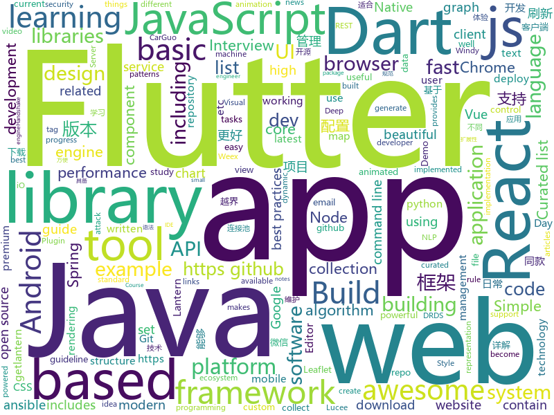

# 2018-08-04
See what the GitHub community is most excited about today.

## python
* [autokeras](https://github.com/jhfjhfj1/autokeras)(**780 stars today**): This is an automated machine learning (AutoML) package.
* [pyxel](https://github.com/kitao/pyxel)(**679 stars today**): A retro game development environment in Python
* [system-design-primer](https://github.com/donnemartin/system-design-primer)(**446 stars today**): Learn how to design large-scale systems. Prep for the system design interview. Includes Anki flashcards.
* [100-Days-Of-ML-Code](https://github.com/Avik-Jain/100-Days-Of-ML-Code)(**404 stars today**): 100 Days of ML Coding
* [FeelUOwn](https://github.com/cosven/FeelUOwn)(**186 stars today**): trying to be a user-friendly and hackable music player
* [faust](https://github.com/robinhood/faust)(**143 stars today**): Python Stream Processing
* [cheat.sh](https://github.com/chubin/cheat.sh)(**107 stars today**): the only cheat sheet you need
* [models](https://github.com/tensorflow/models)(**61 stars today**): Models and examples built with TensorFlow
* [awesome-python](https://github.com/vinta/awesome-python)(**53 stars today**): A curated list of awesome Python frameworks, libraries, software and resources
* [pythia](https://github.com/facebookresearch/pythia)(**54 stars today**): A software suite for Visual Question Answering
* [cleverhans](https://github.com/tensorflow/cleverhans)(**52 stars today**): An adversarial example library for constructing attacks, building defenses, and benchmarking both
* [Photon](https://github.com/s0md3v/Photon)(**51 stars today**): Crawler which is incredibly fast and extracts urls, emails, files, website accounts and much more.
* [public-apis](https://github.com/toddmotto/public-apis)(**49 stars today**): A collective list of public JSON APIs for use in web development.
* [byob](https://github.com/colental/byob)(**45 stars today**): BYOB (Build Your Own Botnet)
* [keras](https://github.com/keras-team/keras)(**38 stars today**): Deep Learning for humans
* [reinforcement-learning-algorithms](https://github.com/TianhongDai/reinforcement-learning-algorithms)(**48 stars today**): This repository contains most of classic deep reinforcement learning algorithms, including - DQN, DDPG, A3C, PPO, TRPO. (More algorithms are still in progress)
* [torchbearer](https://github.com/ecs-vlc/torchbearer)(**44 stars today**): torchbearer: A model fitting library for PyTorch
* [django](https://github.com/django/django)(**38 stars today**): The Web framework for perfectionists with deadlines.
* [Raccoon](https://github.com/evyatarmeged/Raccoon)(**45 stars today**): A high performance offensive security tool for reconnaissance and vulnerability scanning
* [termgraph](https://github.com/mkaz/termgraph)(**45 stars today**): a python command-line tool which draws basic graphs in the terminal
* [glances](https://github.com/nicolargo/glances)(**43 stars today**): Glances an Eye on your system. A top/htop alternative.
* [ansible](https://github.com/ansible/ansible)(**32 stars today**): Ansible is a radically simple IT automation platform that makes your applications and systems easier to deploy. Avoid writing scripts or custom code to deploy and update your applications — automate in a language that approaches plain English, using SSH, with no agents to install on remote systems. https://docs.ansible.com/ansible/
* [youtube-dl](https://github.com/rg3/youtube-dl)(**33 stars today**): Command-line program to download videos from YouTube.com and other video sites
* [wikipedia2vec](https://github.com/wikipedia2vec/wikipedia2vec)(**35 stars today**): A tool for learning vector representations of words and entities from Wikipedia
* [scikit-learn](https://github.com/scikit-learn/scikit-learn)(**27 stars today**): scikit-learn: machine learning in Python

## java
* [Sentinel](https://github.com/alibaba/Sentinel)(**314 stars today**): A lightweight flow-control library providing high-available protection and monitoring (高可用防护的流量管理框架)
* [hugegraph](https://github.com/hugegraph/hugegraph)(**182 stars today**): HugeGraph Database core component, including graph engine, API, and built-in backends
* [Java-Interview](https://github.com/crossoverJie/Java-Interview)(**150 stars today**): 👨‍🎓Java related : basic, concurrent, algorithm
* [Java-Guide](https://github.com/Snailclimb/Java-Guide)(**139 stars today**): 📖Java面试通关手册（Java学习指南）Java Interview Customs Manual (Java Study Guide)
* [java-design-patterns](https://github.com/iluwatar/java-design-patterns)(**74 stars today**): Design patterns implemented in Java
* [weixin-java-tools](https://github.com/Wechat-Group/weixin-java-tools)(**61 stars today**): 全能微信Java开发工具包，支持包括微信支付、开放平台、小程序、企业号和公众号等的开发
* [spring-boot](https://github.com/spring-projects/spring-boot)(**47 stars today**): Spring Boot
* [proxyee-down](https://github.com/proxyee-down-org/proxyee-down)(**52 stars today**): http下载工具，基于http代理，支持多连接分块下载
* [incubator-dubbo](https://github.com/apache/incubator-dubbo)(**42 stars today**): Apache Dubbo (incubating) is a high-performance, java based, open source RPC framework.
* [AndroidUtilCode](https://github.com/Blankj/AndroidUtilCode)(**42 stars today**): 🔥Android developers should collect the following utils(updating).
* [elasticsearch](https://github.com/elastic/elasticsearch)(**41 stars today**): Open Source, Distributed, RESTful Search Engine
* [spring-boot-admin](https://github.com/codecentric/spring-boot-admin)(**32 stars today**): Admin UI for administration of spring boot applications
* [apollo](https://github.com/ctripcorp/apollo)(**31 stars today**): Apollo（阿波罗）是携程框架部门研发的分布式配置中心，能够集中化管理应用不同环境、不同集群的配置，配置修改后能够实时推送到应用端，并且具备规范的权限、流程治理等特性，适用于微服务配置管理场景。
* [spring-framework](https://github.com/spring-projects/spring-framework)(**26 stars today**): Spring Framework
* [GradientDrawableTuner](https://github.com/duanhong169/GradientDrawableTuner)(**32 stars today**): 🕹️See how the properties of Android's "shape" affect the Drawable's appearance, intuitively.
* [tutorials](https://github.com/eugenp/tutorials)(**16 stars today**): The "REST With Spring" Course:
* [guava](https://github.com/google/guava)(**29 stars today**): Google core libraries for Java
* [nacos](https://github.com/alibaba/nacos)(**29 stars today**): an easy-to-use dynamic service discovery, configuration and service management platform for building cloud native applications
* [vjtools](https://github.com/vipshop/vjtools)(**29 stars today**): The vip.com's java coding standard, libraries and tools
* [java-tron](https://github.com/tronprotocol/java-tron)(**29 stars today**): Java implementation of the Tron whitepaper
* [druid](https://github.com/alibaba/druid)(**28 stars today**): ♨️为监控而生的数据库连接池！阿里云DRDS(https://www.aliyun.com/product/drds )、阿里巴巴TDDL 连接池powered by Druid
* [Lucee](https://github.com/lucee/Lucee)(**25 stars today**): Lucee Server is a dynamic, Java based (JSR-223), tag and scripting language used for rapid web application development. Lucee simplifies technologies like webservices (REST, SOAP, HTTP), ORM (Hibernate), searching (Lucene), datasources (MSSQL, Oracle, MySQL and others), caching (infinispan, ehcache, and memcached) and many more. Lucee provides a…
* [MPAndroidChart](https://github.com/PhilJay/MPAndroidChart)(**24 stars today**): A powerful🚀Android chart view / graph view library, supporting line- bar- pie- radar- bubble- and candlestick charts as well as scaling, dragging and animations.
* [plaid](https://github.com/nickbutcher/plaid)(**24 stars today**): An Android app which provides design news & inspiration as well as being an example of implementing material design.
* [SmartRefreshLayout](https://github.com/scwang90/SmartRefreshLayout)(**24 stars today**): 🔥下拉刷新、上拉加载、二级刷新、淘宝二楼、RefreshLayout、OverScroll，Android智能下拉刷新框架，支持越界回弹、越界拖动，具有极强的扩展性，集成了几十种炫酷的Header和 Footer。

## unknown
* [InterviewMap](https://github.com/InterviewMap/InterviewMap)(**243 stars today**): Build the best interview map. The current content includes JS, network, browser related, performance optimization, security, framework, Git, data structure, algorithm, etc.
* [Interview-Notebook](https://github.com/CyC2018/Interview-Notebook)(**146 stars today**): 💡Basic Knowledge of Technical Interview
* [Front-End-Performance-Checklist](https://github.com/thedaviddias/Front-End-Performance-Checklist)(**147 stars today**): 🎮The only Front-End Performance Checklist that runs faster than the others
* [dev.to](https://github.com/thepracticaldev/dev.to)(**100 stars today**): Where programmers share ideas and help each other grow
* [awesome](https://github.com/sindresorhus/awesome)(**77 stars today**): 😎Curated list of awesome lists
* [gitignore](https://github.com/github/gitignore)(**52 stars today**): A collection of useful .gitignore templates
* [You-Dont-Know-JS](https://github.com/getify/You-Dont-Know-JS)(**64 stars today**): A book series on JavaScript. @YDKJS on twitter.
* [rockstar](https://github.com/dylanbeattie/rockstar)(**67 stars today**): The Rockstar programming language specification
* [free-programming-books](https://github.com/EbookFoundation/free-programming-books)(**53 stars today**): 📚Freely available programming books
* [nodebestpractices](https://github.com/i0natan/nodebestpractices)(**56 stars today**): The largest Node.JS best practices list (July 2018)
* [build-your-own-x](https://github.com/danistefanovic/build-your-own-x)(**49 stars today**): 🤓Build your own (insert technology here)
* [iride2020-iRide-Token-](https://github.com/dnkume/iride2020-iRide-Token-)(**50 stars today**): 
* [project-based-learning](https://github.com/tuvtran/project-based-learning)(**44 stars today**): Curated list of project-based tutorials
* [awesome-flutter](https://github.com/Solido/awesome-flutter)(**41 stars today**): An awesome list that curates the best Flutter libraries, tools, tutorials, articles and more.
* [awesome-vue](https://github.com/vuejs/awesome-vue)(**42 stars today**): 🎉A curated list of awesome things related to Vue.js
* [architect-awesome](https://github.com/xingshaocheng/architect-awesome)(**39 stars today**): 后端架构师技术图谱
* [auditd-attack](https://github.com/bfuzzy/auditd-attack)(**40 stars today**): A Linux Auditd rule set mapped to MITRE's Attack Framework
* [React-Redux-Styleguide](https://github.com/iraycd/React-Redux-Styleguide)(**40 stars today**): This is a working set of guidelines for developing React applications. We say "guideline" because there are no hard-and-fast rules; best practices, patterns and technology change over time, so we consider this a living set of style guides.
* [coding-interview-university](https://github.com/jwasham/coding-interview-university)(**32 stars today**): A complete computer science study plan to become a software engineer.
* [iCSS](https://github.com/chokcoco/iCSS)(**34 stars today**): 谈谈一些有趣的 CSS 话题
* [fe9-library](https://github.com/frontend9/fe9-library)(**34 stars today**): 九部知识库
* [awesome-react](https://github.com/enaqx/awesome-react)(**26 stars today**): A collection of awesome things regarding React ecosystem.
* [awesome-code-review](https://github.com/joho/awesome-code-review)(**24 stars today**): An "Awesome" list of code review resources - articles, papers, tools, etc
* [blog](https://github.com/yinxin630/blog)(**23 stars today**): my blog
* [download](https://github.com/getlantern/download)(**24 stars today**): 🔴蓝灯最新版本下载 https://github.com/getlantern/download🔴Lantern Latest Download https://github.com/getlantern/lantern/releases/tag/latest🔴

## javascript
* [taskbook](https://github.com/klauscfhq/taskbook)(**455 stars today**): 📓Tasks, boards & notes for the command-line habitat
* [javascript-algorithms](https://github.com/trekhleb/javascript-algorithms)(**284 stars today**): Algorithms and data structures implemented in JavaScript with explanations and links to further readings
* [terminalizer](https://github.com/faressoft/terminalizer)(**255 stars today**): 🦄Record your terminal and generate animated gif images
* [react-particle-effect-button](https://github.com/transitive-bullshit/react-particle-effect-button)(**240 stars today**): Bursting particle effect buttons for React🎉
* [apexcharts.js](https://github.com/apexcharts/apexcharts.js)(**231 stars today**): A JavaScript Chart Library
* [vue](https://github.com/vuejs/vue)(**222 stars today**): 🖖A progressive, incrementally-adoptable JavaScript framework for building UI on the web.
* [react](https://github.com/facebook/react)(**155 stars today**): A declarative, efficient, and flexible JavaScript library for building user interfaces.
* [fiora](https://github.com/yinxin630/fiora)(**135 stars today**): An interesting chat application power by socket.io, koa, mongodb and react
* [ice](https://github.com/alibaba/ice)(**143 stars today**): 🚀飞冰 - 让前端开发简单而友好
* [mdx-deck](https://github.com/jxnblk/mdx-deck)(**94 stars today**): MDX-based presentation decks
* [anime](https://github.com/juliangarnier/anime)(**77 stars today**): JavaScript Animation Engine
* [fusion-react](https://github.com/fusionjs/fusion-react)(**79 stars today**): Fusion.js for React
* [ndb](https://github.com/GoogleChromeLabs/ndb)(**79 stars today**): ndb is an improved debugging experience for Node.js, enabled by Chrome DevTools
* [vialer-js](https://github.com/vialer/vialer-js)(**75 stars today**): Pluggable WebRTC communication platform.
* [fusion-core](https://github.com/fusionjs/fusion-core)(**71 stars today**): Core FusionJS package
* [puppeteer](https://github.com/GoogleChrome/puppeteer)(**63 stars today**): Headless Chrome Node API
* [three.js](https://github.com/mrdoob/three.js)(**51 stars today**): JavaScript 3D library.
* [storybook](https://github.com/storybooks/storybook)(**56 stars today**): Interactive UI component dev & test: React, React Native, Vue, Angular
* [axios](https://github.com/axios/axios)(**54 stars today**): Promise based HTTP client for the browser and node.js
* [upash](https://github.com/simonepri/upash)(**54 stars today**): 🔒Unified API for password hashing algorithms
* [between.js](https://github.com/sasha240100/between.js)(**55 stars today**): Lightweight JavaScript (ES6) tweening engine
* [hsd](https://github.com/handshake-org/hsd)(**50 stars today**): Handshake Daemon & Full Node
* [Ghost](https://github.com/TryGhost/Ghost)(**48 stars today**): The platform for professional publishers
* [vue-cli](https://github.com/vuejs/vue-cli)(**44 stars today**): 🛠️Standard Tooling for Vue.js Development
* [browsh](https://github.com/browsh-org/browsh)(**47 stars today**): A fully-modern text-based browser, rendering to TTY and browsers

## html
* [Get](https://github.com/hxco/Get)(**47 stars today**): 😎Everything can be downloaded via HXCO Get!
* [styleguide](https://github.com/google/styleguide)(**34 stars today**): Style guides for Google-originated open-source projects
* [AdminLTE](https://github.com/almasaeed2010/AdminLTE)(**28 stars today**): AdminLTE - Free Premium Admin control Panel Theme Based On Bootstrap 3.x
* [NLP-progress](https://github.com/sebastianruder/NLP-progress)(**30 stars today**): Repository to track the progress in Natural Language Processing (NLP), including the datasets and the current state-of-the-art for the most common NLP tasks.
* [JavaScript30](https://github.com/wesbos/JavaScript30)(**14 stars today**): 30 Day Vanilla JS Challenge
* [awesome-mac](https://github.com/jaywcjlove/awesome-mac)(**17 stars today**):  Now we have become very big, Different from the original idea. Collect premium software in various categories.
* [basicengine-firmware](https://github.com/uli/basicengine-firmware)(**14 stars today**): BASIC Engine Firmware
* [itty-bitty](https://github.com/alcor/itty-bitty)(**13 stars today**): Itty.bitty is a tool to create links that contain small sites
* [swagger-codegen](https://github.com/swagger-api/swagger-codegen)(**10 stars today**): swagger-codegen contains a template-driven engine to generate documentation, API clients and server stubs in different languages by parsing your OpenAPI / Swagger definition.
* [portainer](https://github.com/portainer/portainer)(**11 stars today**): Simple management UI for Docker
* [beautiful-jekyll](https://github.com/daattali/beautiful-jekyll)(**5 stars today**): ✨Build a beautiful and simple website in literally minutes. Demo at http://deanattali.com/beautiful-jekyll
* [polymer](https://github.com/Polymer/polymer)(**10 stars today**): Build modern apps using web components
* [twofactorauth](https://github.com/2factorauth/twofactorauth)(**7 stars today**): List of sites with two factor auth support which includes SMS, email, phone calls, hardware, and software.
* [react-app-rewired](https://github.com/timarney/react-app-rewired)(**9 stars today**): Override create-react-app webpack configs without ejecting
* [EIPs](https://github.com/ethereum/EIPs)(**7 stars today**): The Ethereum Improvement Proposal repository
* [patchwork](https://github.com/jlord/patchwork)(****): All the Git-it Workshop completers!
* [30-seconds-of-css](https://github.com/atomiks/30-seconds-of-css)(**8 stars today**): A curated collection of useful CSS snippets.
* [WebFundamentals](https://github.com/google/WebFundamentals)(**8 stars today**): Best practices for modern web development
* [csswg-drafts](https://github.com/w3c/csswg-drafts)(**8 stars today**): CSS Working Group Editor Drafts
* [primeng](https://github.com/primefaces/primeng)(**7 stars today**): UI Components for Angular
* [learning-area](https://github.com/mdn/learning-area)(**5 stars today**): Github repo for the MDN Learning Area.
* [Spoon-Knife](https://github.com/octocat/Spoon-Knife)(****): This repo is for demonstration purposes only.
* [API](https://github.com/windycom/API)(**7 stars today**): 🏄Windy API, or Windy Leaflet Plugin, let you put animated weather map into your website and enjoy rich ecosystem of Leaflet library.
* [core](https://github.com/stackblitz/core)(**7 stars today**): Online IDE powered by Visual Studio Code⚡️
* [fastText](https://github.com/facebookresearch/fastText)(**6 stars today**): Library for fast text representation and classification.

## dart
* [flutter](https://github.com/flutter/flutter)(**89 stars today**): Flutter makes it easy and fast to build beautiful mobile apps.
* [GSYGithubAppFlutter](https://github.com/CarGuo/GSYGithubAppFlutter)(**39 stars today**): 超完整的Flutter项目，功能丰富，适合学习和日常使用。GSYGithubApp系列的优势：我们目前已经拥有Flutter、Weex、ReactNative三个版本。 功能齐全，项目框架内技术涉及面广，完成度高，持续维护，配套文章，适合全面学习，跨框架对比参考。跨平台的开源Github客户端App，更好的体验，更丰富的功能，旨在更好的日常管理和维护个人Github，提供更好更方便的驾车体验～～Σ(￣。￣ﾉ)ﾉ。同款Weex版本 ： https://github.com/CarGuo/GSYGithubAppWeex 、同款React Native版本 ： https://github.com/CarGuo/GSYGithubApp
* [figma-to-flutter](https://github.com/aloisdeniel/figma-to-flutter)(**35 stars today**): A Dart code generator that converts Figma components to Flutter widgets.
* [flutter-osc](https://github.com/yubo725/flutter-osc)(**29 stars today**): 基于Google Flutter的开源中国客户端，支持Android和iOS。
* [Flutter-learning](https://github.com/AweiLoveAndroid/Flutter-learning)(**16 stars today**): 🔥👍🌟⭐️⭐️⭐️Flutter从配置安装到填坑指南详解，Flutter相关Demo解读，项目实例，Dart语法详解
* [plugins](https://github.com/flutter/plugins)(**15 stars today**): Plugins for Flutter, including FlutterFire, maintained by the Flutter team
* [dio](https://github.com/flutterchina/dio)(**15 stars today**): A powerful Http client for Dart, which supports Interceptors, FormData, Request Cancellation, File Downloading, Timeout etc.
* [flutter_jobs_app](https://github.com/Rahiche/flutter_jobs_app)(**12 stars today**): Flutter jobs borad app created using flutter
* [flutter_ui_challenge_flight_search](https://github.com/MarcinusX/flutter_ui_challenge_flight_search)(**10 stars today**): 
* [Flutter-UI-Kit](https://github.com/iampawan/Flutter-UI-Kit)(**8 stars today**): Flutter app for collection of UI in a UIKit
* [flutter_study](https://github.com/luhenchang/flutter_study)(**5 stars today**): 三天学会Flutter
* [sdk](https://github.com/dart-lang/sdk)(**6 stars today**): The Dart SDK, including the VM, dart2js, core libraries, and more.
* [state_experiments](https://github.com/filiph/state_experiments)(**5 stars today**): Companion repository to the "Build reactive mobile apps in Flutter" talk
* [dart-sass](https://github.com/sass/dart-sass)(****): A Dart implementation of Sass.
* [flews](https://github.com/jbarr21/flews)(****): A multi-service news app written in Flutter
* [dadjokes](https://github.com/timsneath/dadjokes)(****): Awful dad jokes, curated for your pleasure
* [firebase-dart](https://github.com/firebase/firebase-dart)(****): Dart wrapper for Firebase
* [chromedeveditor](https://github.com/googlearchive/chromedeveditor)(****): Chrome Dev Editor is a developer tool for building apps on the Chrome platform - Chrome Apps and Web Apps, in JavaScript or Dart. (NO LONGER IN ACTIVE DEVELOPMENT)
* [hauberk](https://github.com/munificent/hauberk)(****): A web-based roguelike written in Dart.
* [inKino](https://github.com/roughike/inKino)(****): inKino - A cross platform movie and showtime browser for Finnkino cinemas, made with Flutter.
* [flutter-examples](https://github.com/nisrulz/flutter-examples)(****): [Examples] Simple basic isolated apps, for budding flutter devs.
* [flutter_architecture_samples](https://github.com/brianegan/flutter_architecture_samples)(****): TodoMVC for Flutter
* [angular](https://github.com/dart-lang/angular)(****): Fast and productive web framework provided by Dart
* [StageXL](https://github.com/bp74/StageXL)(****): A fast and universal 2D rendering engine for HTML5 and Dart.
* [FlutterExampleApps](https://github.com/iampawan/FlutterExampleApps)(****): [Example APPS] Basic Flutter apps, for flutter devs.

## WordCloud

