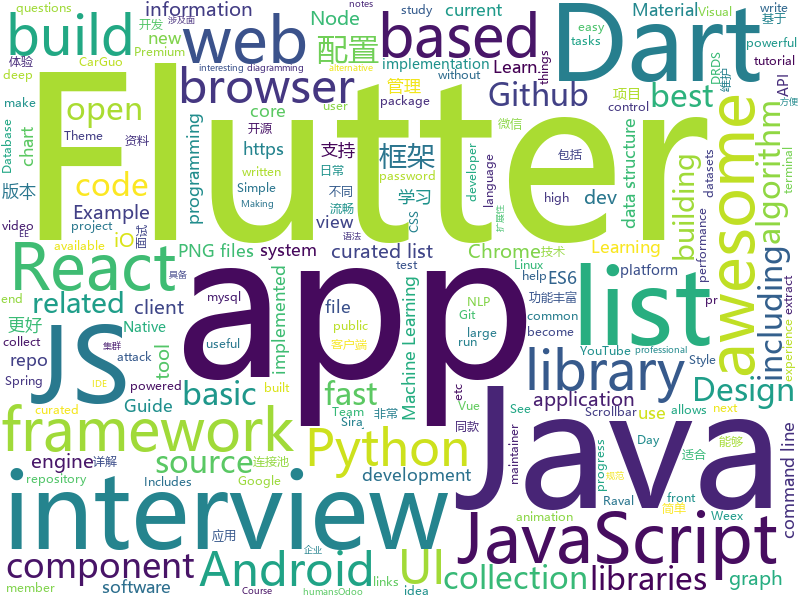

# 2018-08-05
See what the GitHub community is most excited about today.

## python
* [autokeras](https://github.com/jhfjhfj1/autokeras)(**249 stars today**): This is an automated machine learning (AutoML) package.
* [system-design-primer](https://github.com/donnemartin/system-design-primer)(**202 stars today**): Learn how to design large-scale systems. Prep for the system design interview. Includes Anki flashcards.
* [pyxel](https://github.com/kitao/pyxel)(**180 stars today**): A retro game development environment in Python
* [mysqlsmom](https://github.com/m358807551/mysqlsmom)(**84 stars today**): 同步mysql数据到elasticsearch的工具，功能丰富，用法简单，配置灵活，扩展性强；
* [faust](https://github.com/robinhood/faust)(**66 stars today**): Python Stream Processing
* [models](https://github.com/tensorflow/models)(**43 stars today**): Models and examples built with TensorFlow
* [byob](https://github.com/colental/byob)(**48 stars today**): BYOB (Build Your Own Botnet)
* [cheat.sh](https://github.com/chubin/cheat.sh)(**44 stars today**): the only cheat sheet you need
* [smart_open](https://github.com/RaRe-Technologies/smart_open)(**41 stars today**): Utils for streaming large files (S3, HDFS, gzip, bz2...)
* [awesome-python](https://github.com/vinta/awesome-python)(**38 stars today**): A curated list of awesome Python frameworks, libraries, software and resources
* [cleverhans](https://github.com/tensorflow/cleverhans)(**38 stars today**): An adversarial example library for constructing attacks, building defenses, and benchmarking both
* [NALU](https://github.com/kgrm/NALU)(**36 stars today**): Keras Implementation of: "Neural Arithmetic Logic Units", Trask et al., ArXiV, 2018
* [reinforcement-learning-algorithms](https://github.com/TianhongDai/reinforcement-learning-algorithms)(**35 stars today**): This repository contains most of classic deep reinforcement learning algorithms, including - DQN, DDPG, A3C, PPO, TRPO. (More algorithms are still in progress)
* [Remote-Desktop-Caching-](https://github.com/Viralmaniar/Remote-Desktop-Caching-)(**33 stars today**): This tool allows one to recover old RDP (mstsc) session information in the form of broken PNG files. These PNG files allows Red Team member to extract juicy information such as LAPS passwords or any sensitive information on the screen. Blue Team member can reconstruct PNG files to see what an attacker did on a compromised host. It is extremely u…
* [public-apis](https://github.com/toddmotto/public-apis)(**31 stars today**): A collective list of public JSON APIs for use in web development.
* [keras](https://github.com/keras-team/keras)(**26 stars today**): Deep Learning for humans
* [odoo](https://github.com/odoo/odoo)(**28 stars today**): Odoo. Open Source Apps To Grow Your Business.
* [youtube-dl](https://github.com/rg3/youtube-dl)(**28 stars today**): Command-line program to download videos from YouTube.com and other video sites
* [Photon](https://github.com/s0md3v/Photon)(**28 stars today**): Crawler which is incredibly fast and extracts urls, emails, files, website accounts and much more.
* [cpython](https://github.com/python/cpython)(**20 stars today**): The Python programming language
* [glances](https://github.com/nicolargo/glances)(**27 stars today**): Glances an Eye on your system. A top/htop alternative.
* [FeelUOwn](https://github.com/cosven/FeelUOwn)(**24 stars today**): trying to be a user-friendly and hackable music player
* [django](https://github.com/django/django)(**19 stars today**): The Web framework for perfectionists with deadlines.
* [Node_JS_Machine_Learning](https://github.com/llSourcell/Node_JS_Machine_Learning)(**23 stars today**): This is the code for "Node JS Machine Learning" By Siraj Raval on Youtube
* [termgraph](https://github.com/mkaz/termgraph)(**22 stars today**): a python command-line tool which draws basic graphs in the terminal

## java
* [hugegraph](https://github.com/hugegraph/hugegraph)(**107 stars today**): HugeGraph Database core component, including graph engine, API, and built-in backends
* [Sentinel](https://github.com/alibaba/Sentinel)(**84 stars today**): A lightweight flow-control library providing high-available protection and monitoring (高可用防护的流量管理框架)
* [effective-java-3e-source-code](https://github.com/jbloch/effective-java-3e-source-code)(**80 stars today**): The source code from the third edition of Effective Java, with minor additions as necessary to make it runnable.
* [Java-Guide](https://github.com/Snailclimb/Java-Guide)(**61 stars today**): 📖Java面试通关手册（Java学习指南）Java Interview Customs Manual (Java Study Guide)
* [Java-Interview](https://github.com/crossoverJie/Java-Interview)(**41 stars today**): 👨‍🎓Java related : basic, concurrent, algorithm
* [proxyee-down](https://github.com/proxyee-down-org/proxyee-down)(**42 stars today**): http下载工具，基于http代理，支持多连接分块下载
* [java-design-patterns](https://github.com/iluwatar/java-design-patterns)(**32 stars today**): Design patterns implemented in Java
* [spring-boot](https://github.com/spring-projects/spring-boot)(**20 stars today**): Spring Boot
* [AndroidUtilCode](https://github.com/Blankj/AndroidUtilCode)(**21 stars today**): 🔥Android developers should collect the following utils(updating).
* [java-tron](https://github.com/tronprotocol/java-tron)(**20 stars today**): Java implementation of the Tron whitepaper
* [elasticsearch](https://github.com/elastic/elasticsearch)(**18 stars today**): Open Source, Distributed, RESTful Search Engine
* [weixin-java-tools](https://github.com/Wechat-Group/weixin-java-tools)(**16 stars today**): 全能微信Java开发工具包，支持包括微信支付、开放平台、小程序、企业号和公众号等的开发
* [okhttp](https://github.com/square/okhttp)(**16 stars today**): An HTTP+HTTP/2 client for Android and Java applications.
* [Java](https://github.com/TheAlgorithms/Java)(**13 stars today**): All Algorithms implemented in Java
* [guava](https://github.com/google/guava)(**16 stars today**): Google core libraries for Java
* [MPAndroidChart](https://github.com/PhilJay/MPAndroidChart)(**14 stars today**): A powerful🚀Android chart view / graph view library, supporting line- bar- pie- radar- bubble- and candlestick charts as well as scaling, dragging and animations.
* [spring-framework](https://github.com/spring-projects/spring-framework)(**11 stars today**): Spring Framework
* [material-components-android](https://github.com/material-components/material-components-android)(**14 stars today**): Modular and customizable Material Design UI components for Android
* [apollo](https://github.com/ctripcorp/apollo)(**13 stars today**): Apollo（阿波罗）是携程框架部门研发的分布式配置中心，能够集中化管理应用不同环境、不同集群的配置，配置修改后能够实时推送到应用端，并且具备规范的权限、流程治理等特性，适用于微服务配置管理场景。
* [GradientDrawableTuner](https://github.com/duanhong169/GradientDrawableTuner)(**14 stars today**): 🕹️See how the properties of Android's "shape" affect the Drawable's appearance, intuitively.
* [tutorials](https://github.com/eugenp/tutorials)(**8 stars today**): The "REST With Spring" Course:
* [unity-native-toolkit](https://github.com/ryanw3bb/unity-native-toolkit)(**14 stars today**): Integrate native iOS & Android functionality into Unity
* [selenium](https://github.com/SeleniumHQ/selenium)(**12 stars today**): A browser automation framework and ecosystem.
* [druid](https://github.com/alibaba/druid)(**11 stars today**): ♨️为监控而生的数据库连接池！阿里云DRDS(https://www.aliyun.com/product/drds )、阿里巴巴TDDL 连接池powered by Druid
* [jakartaee-examples](https://github.com/manorrock/jakartaee-examples)(**11 stars today**): Jakarta EE Examples

## unknown
* [100-Days-Of-ML-Code](https://github.com/Avik-Jain/100-Days-Of-ML-Code)(**211 stars today**): 100 Days of ML Coding
* [awesome-react-framer-x](https://github.com/davo/awesome-react-framer-x)(**103 stars today**): A collection of awesome links to learn React, ES6 & Framer X
* [auditd-attack](https://github.com/bfuzzy/auditd-attack)(**87 stars today**): A Linux Auditd rule set mapped to MITRE's Attack Framework
* [InterviewMap](https://github.com/InterviewMap/InterviewMap)(**80 stars today**): Build the best interview map. The current content includes JS, network, browser related, performance optimization, security, framework, Git, data structure, algorithm, etc.
* [Interview-Notebook](https://github.com/CyC2018/Interview-Notebook)(**64 stars today**): 💡Basic Knowledge of Technical Interview
* [Front-End-Performance-Checklist](https://github.com/thedaviddias/Front-End-Performance-Checklist)(**67 stars today**): 🎮The only Front-End Performance Checklist that runs faster than the others
* [gitignore](https://github.com/github/gitignore)(**39 stars today**): A collection of useful .gitignore templates
* [awesome](https://github.com/sindresorhus/awesome)(**48 stars today**): 😎Curated list of awesome lists
* [awesome-vue](https://github.com/vuejs/awesome-vue)(**39 stars today**): 🎉A curated list of awesome things related to Vue.js
* [free-programming-books](https://github.com/EbookFoundation/free-programming-books)(**39 stars today**): 📚Freely available programming books
* [project-based-learning](https://github.com/tuvtran/project-based-learning)(**32 stars today**): Curated list of project-based tutorials
* [awesome-maintainers](https://github.com/nayafia/awesome-maintainers)(**34 stars today**): Talks, blog posts, and interviews about the experience of being an open source maintainer
* [build-your-own-x](https://github.com/danistefanovic/build-your-own-x)(**30 stars today**): 🤓Build your own (insert technology here)
* [coding-interview-university](https://github.com/jwasham/coding-interview-university)(**28 stars today**): A complete computer science study plan to become a software engineer.
* [architect-awesome](https://github.com/xingshaocheng/architect-awesome)(**27 stars today**): 后端架构师技术图谱
* [dev.to](https://github.com/thepracticaldev/dev.to)(**26 stars today**): Where programmers share ideas and help each other grow
* [iride2020-iRide-Token-](https://github.com/dnkume/iride2020-iRide-Token-)(**26 stars today**): 
* [rockstar](https://github.com/dylanbeattie/rockstar)(**23 stars today**): The Rockstar programming language specification
* [nodebestpractices](https://github.com/i0natan/nodebestpractices)(**22 stars today**): The largest Node.JS best practices list (July 2018)
* [nocode](https://github.com/kelseyhightower/nocode)(**19 stars today**): The best way to write secure and reliable applications. Write nothing; deploy nowhere.
* [awesome-public-datasets](https://github.com/awesomedata/awesome-public-datasets)(**18 stars today**): A topic-centric list of high-quality open datasets in public domains. Propose NEW data ☛☛☛PR☛☛☛
* [awesome-cpp](https://github.com/fffaraz/awesome-cpp)(**16 stars today**): A curated list of awesome C++ (or C) frameworks, libraries, resources, and shiny things. Inspired by awesome-... stuff.
* [Front-end-Developer-Interview-Questions](https://github.com/h5bp/Front-end-Developer-Interview-Questions)(**16 stars today**): A list of helpful front-end related questions you can use to interview potential candidates, test yourself or completely ignore.
* [awesome-flutter](https://github.com/Solido/awesome-flutter)(**16 stars today**): An awesome list that curates the best Flutter libraries, tools, tutorials, articles and more.
* [Learn_Machine_Learning_in_3_Months](https://github.com/llSourcell/Learn_Machine_Learning_in_3_Months)(**14 stars today**): This is the code for "Learn Machine Learning in 3 Months" by Siraj Raval on Youtube

## javascript
* [taskbook](https://github.com/klauscfhq/taskbook)(**237 stars today**): 📓Tasks, boards & notes for the command-line habitat
* [apexcharts.js](https://github.com/apexcharts/apexcharts.js)(**140 stars today**): A JavaScript Chart Library
* [terminalizer](https://github.com/faressoft/terminalizer)(**135 stars today**): 🦄Record your terminal and generate animated gif images
* [react-particle-effect-button](https://github.com/transitive-bullshit/react-particle-effect-button)(**125 stars today**): Bursting particle effect buttons for React🎉
* [javascript-algorithms](https://github.com/trekhleb/javascript-algorithms)(**118 stars today**): Algorithms and data structures implemented in JavaScript with explanations and links to further readings
* [ice](https://github.com/alibaba/ice)(**123 stars today**): 🚀飞冰 - 让前端开发简单而友好
* [mdx-deck](https://github.com/jxnblk/mdx-deck)(**90 stars today**): MDX-based presentation decks
* [vue](https://github.com/vuejs/vue)(**79 stars today**): 🖖A progressive, incrementally-adoptable JavaScript framework for building UI on the web.
* [badgen-service](https://github.com/amio/badgen-service)(**84 stars today**): Fast svg badge generating service
* [fiora](https://github.com/yinxin630/fiora)(**63 stars today**): An interesting chat application power by socket.io, koa, mongodb and react
* [30-seconds-of-interviews](https://github.com/fejes713/30-seconds-of-interviews)(**62 stars today**): A curated collection of common interview questions to help you prepare for your next interview.
* [react](https://github.com/facebook/react)(**51 stars today**): A declarative, efficient, and flexible JavaScript library for building user interfaces.
* [ndb](https://github.com/GoogleChromeLabs/ndb)(**55 stars today**): ndb is an improved debugging experience for Node.js, enabled by Chrome DevTools
* [between.js](https://github.com/sasha240100/between.js)(**52 stars today**): Lightweight JavaScript (ES6) tweening engine
* [create-react-app](https://github.com/facebook/create-react-app)(**44 stars today**): Create React apps with no build configuration.
* [fusion-react](https://github.com/fusionjs/fusion-react)(**48 stars today**): Fusion.js for React
* [anime](https://github.com/juliangarnier/anime)(**40 stars today**): JavaScript Animation Engine
* [Ghost](https://github.com/TryGhost/Ghost)(**40 stars today**): The platform for professional publishers
* [storybook](https://github.com/storybooks/storybook)(**39 stars today**): Interactive UI component dev & test: React, React Native, Vue, Angular
* [fusion-core](https://github.com/fusionjs/fusion-core)(**40 stars today**): Core FusionJS package
* [upash](https://github.com/simonepri/upash)(**37 stars today**): 🔒Unified API for password hashing algorithms
* [axios](https://github.com/axios/axios)(**32 stars today**): Promise based HTTP client for the browser and node.js
* [gun](https://github.com/amark/gun)(**32 stars today**): A realtime, decentralized, offline-first, graph database engine.
* [styled-components](https://github.com/styled-components/styled-components)(**30 stars today**): Visual primitives for the component age. Use the best bits of ES6 and CSS to style your apps without stress💅
* [gdbgui](https://github.com/cs01/gdbgui)(**31 stars today**): Browser-based frontend to gdb (gnu debugger). Add breakpoints, view the stack, visualize data structures, and more in C, C++, Go, Rust, and Fortran. Run gdbgui from the terminal and a new tab will open in your browser.

## html
* [NLP-progress](https://github.com/sebastianruder/NLP-progress)(**16 stars today**): Repository to track the progress in Natural Language Processing (NLP), including the datasets and the current state-of-the-art for the most common NLP tasks.
* [styleguide](https://github.com/google/styleguide)(**16 stars today**): Style guides for Google-originated open-source projects
* [awesome-mac](https://github.com/jaywcjlove/awesome-mac)(**14 stars today**):  Now we have become very big, Different from the original idea. Collect premium software in various categories.
* [Get](https://github.com/hxco/Get)(**12 stars today**): 😎Everything can be downloaded via HXCO Get!
* [JavaScript30](https://github.com/wesbos/JavaScript30)(**6 stars today**): 30 Day Vanilla JS Challenge
* [EIPs](https://github.com/ethereum/EIPs)(**8 stars today**): The Ethereum Improvement Proposal repository
* [react-app-rewired](https://github.com/timarney/react-app-rewired)(**9 stars today**): Override create-react-app webpack configs without ejecting
* [Spoon-Knife](https://github.com/octocat/Spoon-Knife)(****): This repo is for demonstration purposes only.
* [AdminLTE](https://github.com/almasaeed2010/AdminLTE)(**7 stars today**): AdminLTE - Free Premium Admin control Panel Theme Based On Bootstrap 3.x
* [electron-api-demos](https://github.com/electron/electron-api-demos)(**8 stars today**): Explore the Electron APIs
* [mxgraph](https://github.com/jgraph/mxgraph)(**6 stars today**): mxGraph is a fully client side JavaScript diagramming library
* [30-seconds-of-css](https://github.com/atomiks/30-seconds-of-css)(**7 stars today**): A curated collection of useful CSS snippets.
* [react-from-zero](https://github.com/kay-is/react-from-zero)(**7 stars today**): A simple (99% ES2015 less) tutorial for React
* [PHP-Interview](https://github.com/xianyunyh/PHP-Interview)(**5 stars today**): PHP面试整理的资料。包括PHP、MySQL、Linux、计算机网络等资料,欢迎提交pr，如果错误，请指出，谢谢
* [core](https://github.com/stackblitz/core)(**6 stars today**): Online IDE powered by Visual Studio Code⚡️
* [fastText](https://github.com/facebookresearch/fastText)(**6 stars today**): Library for fast text representation and classification.
* [javascript-tutorial-en](https://github.com/iliakan/javascript-tutorial-en)(**5 stars today**): Modern JavaScript Tutorial
* [portainer](https://github.com/portainer/portainer)(**5 stars today**): Simple management UI for Docker
* [railsgirls.github.io](https://github.com/railsgirls/railsgirls.github.io)(**5 stars today**): Rails Girls Guides
* [game-of-life](https://github.com/wakaleo/game-of-life)(****): Demo application for the 'Jenkins: The Definitive Guide' book
* [nodejs-ex](https://github.com/sclorg/nodejs-ex)(****): node.js example
* [patchwork](https://github.com/jlord/patchwork)(****): All the Git-it Workshop completers!
* [learning-area](https://github.com/mdn/learning-area)(****): Github repo for the MDN Learning Area.
* [jekyll-material-theme](https://github.com/jameshamann/jekyll-material-theme)(****): A Jekyll Theme based on Material Design using Materialize.
* [pyarweb](https://github.com/PyAr/pyarweb)(****): El sitio web de Python Argentina

## dart
* [flutter](https://github.com/flutter/flutter)(**59 stars today**): Flutter makes it easy and fast to build beautiful mobile apps.
* [Flutter-learning](https://github.com/AweiLoveAndroid/Flutter-learning)(**32 stars today**): 🔥👍🌟⭐️⭐️⭐️Flutter从配置安装到填坑指南详解，Flutter相关Demo解读，项目实例，Dart语法详解
* [flutter_ui_challenge_flight_search](https://github.com/MarcinusX/flutter_ui_challenge_flight_search)(**20 stars today**): 
* [plugins](https://github.com/flutter/plugins)(**10 stars today**): Plugins for Flutter, including FlutterFire, maintained by the Flutter team
* [figma-to-flutter](https://github.com/aloisdeniel/figma-to-flutter)(**10 stars today**): A Dart code generator that converts Figma components to Flutter widgets.
* [flutter-osc](https://github.com/yubo725/flutter-osc)(**8 stars today**): 基于Google Flutter的开源中国客户端，支持Android和iOS。
* [GSYGithubAppFlutter](https://github.com/CarGuo/GSYGithubAppFlutter)(**6 stars today**): 超完整的Flutter项目，功能丰富，适合学习和日常使用。GSYGithubApp系列的优势：我们目前已经拥有Flutter、Weex、ReactNative三个版本。 功能齐全，项目框架内技术涉及面广，完成度高，持续维护，配套文章，适合全面学习，跨框架对比参考。跨平台的开源Github客户端App，更好的体验，更丰富的功能，旨在更好的日常管理和维护个人Github，提供更好更方便的驾车体验～～Σ(￣。￣ﾉ)ﾉ。同款Weex版本 ： https://github.com/CarGuo/GSYGithubAppWeex 、同款React Native版本 ： https://github.com/CarGuo/GSYGithubApp
* [Flutter-UI-Kit](https://github.com/iampawan/Flutter-UI-Kit)(**5 stars today**): Flutter app for collection of UI in a UIKit
* [dio](https://github.com/flutterchina/dio)(**5 stars today**): A powerful Http client for Dart, which supports Interceptors, FormData, Request Cancellation, File Downloading, Timeout etc.
* [flutter-draggable-scrollbar](https://github.com/fluttercommunity/flutter-draggable-scrollbar)(****): Draggable Scrollbar - A scrollbar that can be dragged for quickly navigation through a vertical list. Additional option is showing label next to scrollthumb with information about current item. Maintainer: @marica27
* [material-components-flutter-codelabs](https://github.com/material-components/material-components-flutter-codelabs)(****): Codelabs for Material Components for Flutter (MDC-Flutter)
* [flews](https://github.com/jbarr21/flews)(****): A multi-service news app written in Flutter
* [flutter_study](https://github.com/zhujian1989/flutter_study)(****): flutter知识点学习与实战，问题解决方案记录
* [chromedeveditor](https://github.com/googlearchive/chromedeveditor)(****): Chrome Dev Editor is a developer tool for building apps on the Chrome platform - Chrome Apps and Web Apps, in JavaScript or Dart. (NO LONGER IN ACTIVE DEVELOPMENT)
* [sdk](https://github.com/dart-lang/sdk)(****): The Dart SDK, including the VM, dart2js, core libraries, and more.
* [hauberk](https://github.com/munificent/hauberk)(****): A web-based roguelike written in Dart.
* [inKino](https://github.com/roughike/inKino)(****): inKino - A cross platform movie and showtime browser for Finnkino cinemas, made with Flutter.
* [flutter-examples](https://github.com/nisrulz/flutter-examples)(****): [Examples] Simple basic isolated apps, for budding flutter devs.
* [flutter_architecture_samples](https://github.com/brianegan/flutter_architecture_samples)(****): TodoMVC for Flutter
* [angular](https://github.com/dart-lang/angular)(****): Fast and productive web framework provided by Dart
* [StageXL](https://github.com/bp74/StageXL)(****): A fast and universal 2D rendering engine for HTML5 and Dart.
* [FlutterExampleApps](https://github.com/iampawan/FlutterExampleApps)(****): [Example APPS] Basic Flutter apps, for flutter devs.
* [zhihu-flutter](https://github.com/HackSoul/zhihu-flutter)(****): Flutter 高仿知乎 UI，非常漂亮，也非常流畅，flutter build apk 或 flutter build ios 之后更流畅
* [dart-sass](https://github.com/sass/dart-sass)(****): A Dart implementation of Sass.
* [github-issue-mover](https://github.com/google/github-issue-mover)(****): Making it easy to migrate issues between repos.

## WordCloud

