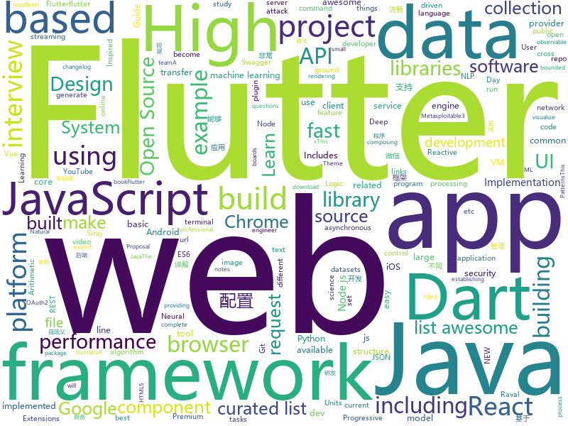

# 2018-08-06
See what the GitHub community is most excited about today.

## python
* [autokeras](https://github.com/jhfjhfj1/autokeras)(**174 stars today**): This is an automated machine learning (AutoML) package.
* [system-design-primer](https://github.com/donnemartin/system-design-primer)(**153 stars today**): Learn how to design large-scale systems. Prep for the system design interview. Includes Anki flashcards.
* [proxy_requests](https://github.com/rootVIII/proxy_requests)(**113 stars today**): a class that uses scraped proxies to make an http GET request (Python requests)
* [pyxel](https://github.com/kitao/pyxel)(**110 stars today**): A retro game development environment in Python
* [pygmy](https://github.com/amitt001/pygmy)(**94 stars today**): Open-source, feature rich & extensible url shortener + Analytics🍪
* [harry_potter_universe](https://github.com/zotroneneis/harry_potter_universe)(**91 stars today**): Awesome Python features explained using the world of Harry Potter
* [smart_open](https://github.com/RaRe-Technologies/smart_open)(**79 stars today**): Utils for streaming large files (S3, HDFS, gzip, bz2...)
* [cleverhans](https://github.com/tensorflow/cleverhans)(**53 stars today**): An adversarial example library for constructing attacks, building defenses, and benchmarking both
* [algo](https://github.com/trailofbits/algo)(**47 stars today**): Set up a personal IPSEC VPN in the cloud
* [cheat.sh](https://github.com/chubin/cheat.sh)(**47 stars today**): the only cheat sheet you need
* [NALU-pytorch](https://github.com/kevinzakka/NALU-pytorch)(**39 stars today**): A PyTorch Implementation of "Neural Arithmetic Logic Units"
* [models](https://github.com/tensorflow/models)(**29 stars today**): Models and examples built with TensorFlow
* [faust](https://github.com/robinhood/faust)(**39 stars today**): Python Stream Processing
* [NALU](https://github.com/kgrm/NALU)(**36 stars today**): Keras Implementation of: "Neural Arithmetic Logic Units", Trask et al., ArXiV, 2018
* [awesome-python](https://github.com/vinta/awesome-python)(**33 stars today**): A curated list of awesome Python frameworks, libraries, software and resources
* [byob](https://github.com/colental/byob)(**33 stars today**): BYOB (Build Your Own Botnet)
* [ml_board](https://github.com/bbli/ml_board)(**34 stars today**): a machine learning dashboard that displays hyperparameter settings alongside visualizations, and logs the scientist's thoughts throughout the training process
* [public-apis](https://github.com/toddmotto/public-apis)(**27 stars today**): A collective list of public JSON APIs for use in web development.
* [Photon](https://github.com/s0md3v/Photon)(**29 stars today**): Incredibly fast crawler which extracts urls, emails, files, website accounts and much more.
* [keras](https://github.com/keras-team/keras)(**22 stars today**): Deep Learning for humans
* [Raccoon](https://github.com/evyatarmeged/Raccoon)(**25 stars today**): A high performance offensive security tool for reconnaissance and vulnerability scanning
* [youtube-dl](https://github.com/rg3/youtube-dl)(**25 stars today**): Command-line program to download videos from YouTube.com and other video sites
* [odoo](https://github.com/odoo/odoo)(**23 stars today**): Odoo. Open Source Apps To Grow Your Business.
* [django](https://github.com/django/django)(**20 stars today**): The Web framework for perfectionists with deadlines.
* [heaphopper](https://github.com/angr/heaphopper)(**25 stars today**): HeapHopper is a bounded model checking framework for Heap-implementations

## java
* [effective-java-3e-source-code](https://github.com/jbloch/effective-java-3e-source-code)(**65 stars today**): The source code from the third edition of Effective Java, with minor additions as necessary to make it runnable.
* [java-design-patterns](https://github.com/iluwatar/java-design-patterns)(**44 stars today**): Design patterns implemented in Java
* [proxyee-down](https://github.com/proxyee-down-org/proxyee-down)(**38 stars today**): http下载工具，基于http代理，支持多连接分块下载
* [Java-Guide](https://github.com/Snailclimb/Java-Guide)(**39 stars today**): 📖Java面试通关手册（Java学习指南）Java Interview Customs Manual (Java Study Guide)
* [Java-Interview](https://github.com/crossoverJie/Java-Interview)(**31 stars today**): 👨‍🎓Java related : basic, concurrent, algorithm
* [spring-boot](https://github.com/spring-projects/spring-boot)(**28 stars today**): Spring Boot
* [tutorials](https://github.com/eugenp/tutorials)(**17 stars today**): The "REST With Spring" Course:
* [Sentinel](https://github.com/alibaba/Sentinel)(**26 stars today**): A lightweight flow-control library providing high-available protection and monitoring (高可用防护的流量管理框架)
* [java-tron](https://github.com/tronprotocol/java-tron)(**26 stars today**): Java implementation of the Tron whitepaper
* [IDCardCamera](https://github.com/wildma/IDCardCamera)(**24 stars today**): Android自定义相机实现身份证拍照，并加入自动对焦与图片不规则裁剪
* [hugegraph](https://github.com/hugegraph/hugegraph)(**23 stars today**): HugeGraph Database core component, including graph engine, API, and built-in backends
* [guava](https://github.com/google/guava)(**18 stars today**): Google core libraries for Java
* [spring-framework](https://github.com/spring-projects/spring-framework)(**16 stars today**): Spring Framework
* [elasticsearch](https://github.com/elastic/elasticsearch)(**17 stars today**): Open Source, Distributed, RESTful Search Engine
* [incubator-dubbo](https://github.com/apache/incubator-dubbo)(**13 stars today**): Apache Dubbo (incubating) is a high-performance, java based, open source RPC framework.
* [Java](https://github.com/TheAlgorithms/Java)(**12 stars today**): All Algorithms implemented in Java
* [vjtools](https://github.com/vipshop/vjtools)(**13 stars today**): The vip.com's java coding standard, libraries and tools
* [fastjson](https://github.com/alibaba/fastjson)(**14 stars today**): 🚄A fast JSON parser/generator for Java
* [apollo](https://github.com/ctripcorp/apollo)(**11 stars today**): Apollo（阿波罗）是携程框架部门研发的分布式配置中心，能够集中化管理应用不同环境、不同集群的配置，配置修改后能够实时推送到应用端，并且具备规范的权限、流程治理等特性，适用于微服务配置管理场景。
* [Magisk](https://github.com/topjohnwu/Magisk)(**12 stars today**): A Magic Mask to Alter Android System Systemless-ly
* [netty](https://github.com/netty/netty)(**9 stars today**): Netty project - an event-driven asynchronous network application framework
* [RxJava](https://github.com/ReactiveX/RxJava)(**10 stars today**): RxJava – Reactive Extensions for the JVM – a library for composing asynchronous and event-based programs using observable sequences for the Java VM.
* [material-components-android](https://github.com/material-components/material-components-android)(**10 stars today**): Modular and customizable Material Design UI components for Android
* [data-transfer-project](https://github.com/google/data-transfer-project)(**10 stars today**): The Data Transfer Project makes it easy for people to transfer their data between online service providers. We are establishing a common framework, including data models and protocols, to enable direct transfer of data both into and out of participating online service providers.
* [weixin-java-tools](https://github.com/Wechat-Group/weixin-java-tools)(**9 stars today**): 全能微信Java开发工具包，支持包括微信支付、开放平台、小程序、企业号和公众号等的开发

## unknown
* [100-Days-Of-ML-Code](https://github.com/Avik-Jain/100-Days-Of-ML-Code)(**789 stars today**): 100 Days of ML Coding
* [InterviewMap](https://github.com/InterviewMap/InterviewMap)(**147 stars today**): Build the best interview map. The current content includes JS, network, browser related, performance optimization, security, framework, Git, data structure, algorithm, etc.
* [Interview-Notebook](https://github.com/CyC2018/Interview-Notebook)(**54 stars today**): 💡准备秋招学习笔记
* [awesome](https://github.com/sindresorhus/awesome)(**50 stars today**): 😎Curated list of awesome lists
* [Learn_Machine_Learning_in_3_Months](https://github.com/llSourcell/Learn_Machine_Learning_in_3_Months)(**43 stars today**): This is the code for "Learn Machine Learning in 3 Months" by Siraj Raval on Youtube
* [free-programming-books](https://github.com/EbookFoundation/free-programming-books)(**40 stars today**): 📚Freely available programming books
* [project-based-learning](https://github.com/tuvtran/project-based-learning)(**40 stars today**): Curated list of project-based tutorials
* [Front-End-Performance-Checklist](https://github.com/thedaviddias/Front-End-Performance-Checklist)(**42 stars today**): 🎮The only Front-End Performance Checklist that runs faster than the others
* [awesome-vue](https://github.com/vuejs/awesome-vue)(**37 stars today**): 🎉A curated list of awesome things related to Vue.js
* [gitignore](https://github.com/github/gitignore)(**30 stars today**): A collection of useful .gitignore templates
* [awesome-react-framer-x](https://github.com/davo/awesome-react-framer-x)(**36 stars today**): A collection of awesome links to learn React, ES6 & Framer X
* [coding-interview-university](https://github.com/jwasham/coding-interview-university)(**26 stars today**): A complete computer science study plan to become a software engineer.
* [auditd-attack](https://github.com/bfuzzy/auditd-attack)(**35 stars today**): A Linux Auditd rule set mapped to MITRE's Attack Framework
* [kubernetes-the-hard-way](https://github.com/kelseyhightower/kubernetes-the-hard-way)(**31 stars today**): Bootstrap Kubernetes the hard way on Google Cloud Platform. No scripts.
* [architect-awesome](https://github.com/xingshaocheng/architect-awesome)(**24 stars today**): 后端架构师技术图谱
* [R-text-data](https://github.com/EmilHvitfeldt/R-text-data)(**24 stars today**): List of textural data sources to be used for text mining in R
* [nodebestpractices](https://github.com/i0natan/nodebestpractices)(**22 stars today**): The largest Node.JS best practices list (August 2018)
* [awesome-public-datasets](https://github.com/awesomedata/awesome-public-datasets)(**22 stars today**): A topic-centric list of high-quality open datasets in public domains. Propose NEW data ☛☛☛PR☛☛☛
* [react-developer-roadmap](https://github.com/adam-golab/react-developer-roadmap)(**21 stars today**): Roadmap to becoming a React developer in 2018
* [build-your-own-x](https://github.com/danistefanovic/build-your-own-x)(**20 stars today**): 🤓Build your own (insert technology here)
* [open-source-ideas](https://github.com/open-source-ideas/open-source-ideas)(**21 stars today**): 👐Ever had a cool idea to an Open Source project but didn't have the time to implement yourself? Let someone else give it a try!
* [awesome-scalability](https://github.com/binhnguyennus/awesome-scalability)(**16 stars today**): High Scalability, High Availability, High Stability, High Performance, and High Intelligence System Design Patterns
* [Learn_Deep_Learning_in_6_Weeks](https://github.com/llSourcell/Learn_Deep_Learning_in_6_Weeks)(**15 stars today**): This is the Curriculum for "Learn Deep Learning in 6 Weeks" by Siraj Raval on Youtube
* [go](https://github.com/datasciencemasters/go)(**15 stars today**): The Open Source Data Science Masters
* [awesome-cpp](https://github.com/fffaraz/awesome-cpp)(**16 stars today**): A curated list of awesome C++ (or C) frameworks, libraries, resources, and shiny things. Inspired by awesome-... stuff.

## javascript
* [apple-music-js](https://github.com/tvillarete/apple-music-js)(**404 stars today**): A music streaming service created from the ground up using ReactJS & Redux
* [taskbook](https://github.com/klauscfhq/taskbook)(**204 stars today**): 📓Tasks, boards & notes for the command-line habitat
* [apexcharts.js](https://github.com/apexcharts/apexcharts.js)(**147 stars today**): A JavaScript Chart Library
* [javascript-algorithms](https://github.com/trekhleb/javascript-algorithms)(**111 stars today**): Algorithms and data structures implemented in JavaScript with explanations and links to further readings
* [terminalizer](https://github.com/faressoft/terminalizer)(**106 stars today**): 🦄Record your terminal and generate animated gif images
* [badgen-service](https://github.com/amio/badgen-service)(**94 stars today**): Fast svg badge generating service
* [30-seconds-of-interviews](https://github.com/fejes713/30-seconds-of-interviews)(**87 stars today**): A curated collection of common interview questions to help you prepare for your next interview.
* [react](https://github.com/facebook/react)(**74 stars today**): A declarative, efficient, and flexible JavaScript library for building user interfaces.
* [Imagvue](https://github.com/runkids/Imagvue)(**76 stars today**): 🎑Imagvue is a image processing component for Vue.js
* [mdx-deck](https://github.com/jxnblk/mdx-deck)(**75 stars today**): MDX-based presentation decks
* [vue](https://github.com/vuejs/vue)(**69 stars today**): 🖖A progressive, incrementally-adoptable JavaScript framework for building UI on the web.
* [gdbgui](https://github.com/cs01/gdbgui)(**65 stars today**): Browser-based frontend to gdb (gnu debugger). Add breakpoints, view the stack, visualize data structures, and more in C, C++, Go, Rust, and Fortran. Run gdbgui from the terminal and a new tab will open in your browser.
* [ice](https://github.com/alibaba/ice)(**65 stars today**): 🚀飞冰 - 让前端开发简单而友好
* [create-react-app](https://github.com/facebook/create-react-app)(**46 stars today**): Create React apps with no build configuration.
* [ndb](https://github.com/GoogleChromeLabs/ndb)(**48 stars today**): ndb is an improved debugging experience for Node.js, enabled by Chrome DevTools
* [Ghost](https://github.com/TryGhost/Ghost)(**46 stars today**): The platform for professional publishers
* [upash](https://github.com/simonepri/upash)(**46 stars today**): 🔒Unified API for password hashing algorithms
* [fusion-react](https://github.com/fusionjs/fusion-react)(**45 stars today**): Fusion.js for React
* [axios](https://github.com/axios/axios)(**42 stars today**): Promise based HTTP client for the browser and node.js
* [between.js](https://github.com/sasha240100/between.js)(**42 stars today**): Lightweight JavaScript (ES6) tweening engine
* [javascript](https://github.com/airbnb/javascript)(**33 stars today**): JavaScript Style Guide
* [puppeteer](https://github.com/GoogleChrome/puppeteer)(**36 stars today**): Headless Chrome Node API
* [react-particle-effect-button](https://github.com/transitive-bullshit/react-particle-effect-button)(**38 stars today**): Bursting particle effect buttons for React🎉
* [pushbar.js](https://github.com/oncebot/pushbar.js)(**36 stars today**): Tiny javascript plugin for creating sliding drawers in web apps
* [re-jok](https://github.com/tranbathanhtung/re-jok)(**35 stars today**): A React UI Component library built with styled-components

## html
* [NLP-progress](https://github.com/sebastianruder/NLP-progress)(**15 stars today**): Repository to track the progress in Natural Language Processing (NLP), including the datasets and the current state-of-the-art for the most common NLP tasks.
* [awesome-mac](https://github.com/jaywcjlove/awesome-mac)(**13 stars today**):  Now we have become very big, Different from the original idea. Collect premium software in various categories.
* [JavaScript30](https://github.com/wesbos/JavaScript30)(**8 stars today**): 30 Day Vanilla JS Challenge
* [styleguide](https://github.com/google/styleguide)(**10 stars today**): Style guides for Google-originated open-source projects
* [AdminLTE](https://github.com/almasaeed2010/AdminLTE)(**7 stars today**): AdminLTE - Free Premium Admin control Panel Theme Based On Bootstrap 3.x
* [Spoon-Knife](https://github.com/octocat/Spoon-Knife)(****): This repo is for demonstration purposes only.
* [ecma262](https://github.com/tc39/ecma262)(**9 stars today**): Status, process, and documents for ECMA262
* [capacitor](https://github.com/ionic-team/capacitor)(**8 stars today**): Build cross-platform Native Progressive Web Apps for iOS, Android, and the web⚡️
* [swagger-codegen](https://github.com/swagger-api/swagger-codegen)(**7 stars today**): swagger-codegen contains a template-driven engine to generate documentation, API clients and server stubs in different languages by parsing your OpenAPI / Swagger definition.
* [pure](https://github.com/pure-css/pure)(**7 stars today**): A set of small, responsive CSS modules that you can use in every web project.
* [zenbot](https://github.com/DeviaVir/zenbot)(**7 stars today**): Zenbot is a command-line cryptocurrency trading bot using Node.js and MongoDB.
* [EIPs](https://github.com/ethereum/EIPs)(**6 stars today**): The Ethereum Improvement Proposal repository
* [fonts](https://github.com/google/fonts)(**6 stars today**): Font files available from Google Fonts
* [polymer](https://github.com/Polymer/polymer)(**6 stars today**): Build modern apps using web components
* [electron-api-demos](https://github.com/electron/electron-api-demos)(**5 stars today**): Explore the Electron APIs
* [now-github-starter](https://github.com/zeit/now-github-starter)(****): Starter project to demonstrate a project whose pull requests get automatically deployed
* [patchwork](https://github.com/jlord/patchwork)(****): All the Git-it Workshop completers!
* [javascript-tutorial-en](https://github.com/iliakan/javascript-tutorial-en)(**5 stars today**): Modern JavaScript Tutorial
* [fastText](https://github.com/facebookresearch/fastText)(**5 stars today**): Library for fast text representation and classification.
* [railsgirls.github.io](https://github.com/railsgirls/railsgirls.github.io)(**5 stars today**): Rails Girls Guides
* [keep-a-changelog](https://github.com/olivierlacan/keep-a-changelog)(**5 stars today**): If you build software, keep a changelog.
* [metasploitable3](https://github.com/rapid7/metasploitable3)(**5 stars today**): Metasploitable3 is a VM that is built from the ground up with a large amount of security vulnerabilities.
* [nodejs-ex](https://github.com/sclorg/nodejs-ex)(****): node.js example
* [home-assistant.io](https://github.com/home-assistant/home-assistant.io)(****): 📘Home Assistant User documentation
* [game-of-life](https://github.com/wakaleo/game-of-life)(****): Demo application for the 'Jenkins: The Definitive Guide' book

## dart
* [flutter](https://github.com/flutter/flutter)(**54 stars today**): Flutter makes it easy and fast to build beautiful mobile apps.
* [Flutter-learning](https://github.com/AweiLoveAndroid/Flutter-learning)(**16 stars today**): 🔥👍🌟⭐️⭐️⭐️Flutter从配置安装到填坑指南详解，Flutter相关Demo解读，项目实例，Dart语法详解
* [flutter_ui_challenge_flight_search](https://github.com/MarcinusX/flutter_ui_challenge_flight_search)(**7 stars today**): 
* [sdk](https://github.com/dart-lang/sdk)(**6 stars today**): The Dart SDK, including the VM, dart2js, core libraries, and more.
* [flutter_study](https://github.com/luhenchang/flutter_study)(**5 stars today**): 三天学会Flutter
* [flutter_advanced_networkimage](https://github.com/mchome/flutter_advanced_networkimage)(****): flutter advanced image provider
* [site-www](https://github.com/dart-lang/site-www)(****): Source for Dart website
* [chromedeveditor](https://github.com/googlearchive/chromedeveditor)(****): Chrome Dev Editor is a developer tool for building apps on the Chrome platform - Chrome Apps and Web Apps, in JavaScript or Dart. (NO LONGER IN ACTIVE DEVELOPMENT)
* [plugins](https://github.com/flutter/plugins)(****): Plugins for Flutter, including FlutterFire, maintained by the Flutter team
* [hauberk](https://github.com/munificent/hauberk)(****): A web-based roguelike written in Dart.
* [inKino](https://github.com/roughike/inKino)(****): inKino - A cross platform movie and showtime browser for Finnkino cinemas, made with Flutter.
* [flutter-examples](https://github.com/nisrulz/flutter-examples)(****): [Examples] Simple basic isolated apps, for budding flutter devs.
* [flutter-osc](https://github.com/yubo725/flutter-osc)(****): 基于Google Flutter的开源中国客户端，支持Android和iOS。
* [flutter_architecture_samples](https://github.com/brianegan/flutter_architecture_samples)(****): TodoMVC for Flutter
* [Flutter-UI-Kit](https://github.com/iampawan/Flutter-UI-Kit)(****): Flutter app for collection of UI in a UIKit
* [angular](https://github.com/dart-lang/angular)(****): Fast and productive web framework provided by Dart
* [StageXL](https://github.com/bp74/StageXL)(****): A fast and universal 2D rendering engine for HTML5 and Dart.
* [FlutterExampleApps](https://github.com/iampawan/FlutterExampleApps)(****): [Example APPS] Basic Flutter apps, for flutter devs.
* [zhihu-flutter](https://github.com/HackSoul/zhihu-flutter)(****): Flutter 高仿知乎 UI，非常漂亮，也非常流畅，flutter build apk 或 flutter build ios 之后更流畅
* [dio](https://github.com/flutterchina/dio)(****): A powerful Http client for Dart, which supports Interceptors, FormData, Request Cancellation, File Downloading, Timeout etc.
* [dart-sass](https://github.com/sass/dart-sass)(****): A Dart implementation of Sass.
* [github-issue-mover](https://github.com/google/github-issue-mover)(****): Making it easy to migrate issues between repos.
* [rxdart](https://github.com/ReactiveX/rxdart)(****): The Reactive Extensions for Dart
* [aqueduct](https://github.com/stablekernel/aqueduct)(****): Dart HTTP server framework for building REST APIs. Includes PostgreSQL ORM and OAuth2 provider.
* [start](https://github.com/lvivski/start)(****): Sinatra inspired web development framework for Dart

## WordCloud

