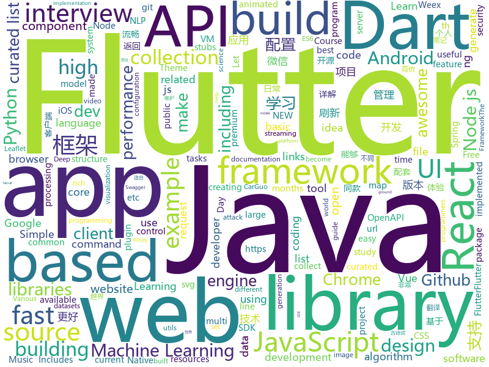

# 2018-08-07
See what the GitHub community is most excited about today.

## python
* [system-design-primer](https://github.com/donnemartin/system-design-primer)(**265 stars today**): Learn how to design large-scale systems. Prep for the system design interview. Includes Anki flashcards.
* [autokeras](https://github.com/jhfjhfj1/autokeras)(**208 stars today**): This is an automated machine learning (AutoML) package.
* [pyxel](https://github.com/kitao/pyxel)(**177 stars today**): A retro game development environment in Python
* [harry_potter_universe](https://github.com/zotroneneis/harry_potter_universe)(**146 stars today**): Awesome Python features explained using the world of Harry Potter
* [pygmy](https://github.com/amitt001/pygmy)(**97 stars today**): Open-source, feature rich & extensible url shortener + Analytics🍪
* [smart_open](https://github.com/RaRe-Technologies/smart_open)(**79 stars today**): Utils for streaming large files (S3, HDFS, gzip, bz2...)
* [models](https://github.com/tensorflow/models)(**54 stars today**): Models and examples built with TensorFlow
* [cheat.sh](https://github.com/chubin/cheat.sh)(**73 stars today**): the only cheat sheet you need
* [faust](https://github.com/robinhood/faust)(**65 stars today**): Python Stream Processing
* [CornerNet](https://github.com/umich-vl/CornerNet)(**59 stars today**): 
* [awesome-python](https://github.com/vinta/awesome-python)(**50 stars today**): A curated list of awesome Python frameworks, libraries, software and resources
* [proxy_requests](https://github.com/rootVIII/proxy_requests)(**52 stars today**): a class that uses scraped proxies to make an http GET/POST request (Python requests)
* [public-apis](https://github.com/toddmotto/public-apis)(**49 stars today**): A collective list of public JSON APIs for use in web development.
* [keras](https://github.com/keras-team/keras)(**38 stars today**): Deep Learning for humans
* [cleverhans](https://github.com/tensorflow/cleverhans)(**41 stars today**): An adversarial example library for constructing attacks, building defenses, and benchmarking both
* [truffleHog](https://github.com/dxa4481/truffleHog)(**43 stars today**): Searches through git repositories for high entropy strings and secrets, digging deep into commit history
* [Raccoon](https://github.com/evyatarmeged/Raccoon)(**40 stars today**): A high performance offensive security tool for reconnaissance and vulnerability scanning
* [face_recognition](https://github.com/ageitgey/face_recognition)(**35 stars today**): The world's simplest facial recognition api for Python and the command line
* [flask](https://github.com/pallets/flask)(**37 stars today**): The Python micro framework for building web applications.
* [youtube-dl](https://github.com/rg3/youtube-dl)(**33 stars today**): Command-line program to download videos from YouTube.com and other video sites
* [gym](https://github.com/openai/gym)(**32 stars today**): A toolkit for developing and comparing reinforcement learning algorithms.
* [heaphopper](https://github.com/angr/heaphopper)(**34 stars today**): HeapHopper is a bounded model checking framework for Heap-implementations
* [Photon](https://github.com/s0md3v/Photon)(**31 stars today**): Incredibly fast crawler which extracts urls, emails, files, website accounts and much more.
* [byob](https://github.com/colental/byob)(**30 stars today**): BYOB (Build Your Own Botnet)
* [ml_board](https://github.com/bbli/ml_board)(**30 stars today**): a machine learning dashboard that displays hyperparameter settings alongside visualizations, and logs the scientist's thoughts throughout the training process

## java
* [Java-Guide](https://github.com/Snailclimb/Java-Guide)(**110 stars today**): 📖Java面试通关手册（Java学习指南）Java Interview Customs Manual (Java Study Guide)
* [Java-Interview](https://github.com/crossoverJie/Java-Interview)(**89 stars today**): 👨‍🎓Java related : basic, concurrent, algorithm
* [ImageWatcher](https://github.com/iielse/ImageWatcher)(**79 stars today**): 高仿微信可拖拽返回
* [IDCardCamera](https://github.com/wildma/IDCardCamera)(**72 stars today**): Android自定义相机实现身份证拍照，并加入自动对焦与图片不规则裁剪
* [java-design-patterns](https://github.com/iluwatar/java-design-patterns)(**60 stars today**): Design patterns implemented in Java
* [Sentinel](https://github.com/alibaba/Sentinel)(**62 stars today**): A lightweight flow-control library providing high-available protection and monitoring (高可用防护的流量管理框架)
* [proxyee-down](https://github.com/proxyee-down-org/proxyee-down)(**59 stars today**): http下载工具，基于http代理，支持多连接分块下载
* [XXPermissions](https://github.com/getActivity/XXPermissions)(**50 stars today**): 
* [effective-java-3e-source-code](https://github.com/jbloch/effective-java-3e-source-code)(**50 stars today**): The source code from the third edition of Effective Java, with minor additions as necessary to make it runnable.
* [spring-boot](https://github.com/spring-projects/spring-boot)(**41 stars today**): Spring Boot
* [incubator-dubbo](https://github.com/apache/incubator-dubbo)(**29 stars today**): Apache Dubbo (incubating) is a high-performance, java based, open source RPC framework.
* [hugegraph](https://github.com/hugegraph/hugegraph)(**39 stars today**): HugeGraph Database core component, including graph engine, API, and built-in backends
* [elasticsearch](https://github.com/elastic/elasticsearch)(**29 stars today**): Open Source, Distributed, RESTful Search Engine
* [AndroidUtilCode](https://github.com/Blankj/AndroidUtilCode)(**30 stars today**): 🔥Android developers should collect the following utils(updating).
* [java-tron](https://github.com/tronprotocol/java-tron)(**35 stars today**): Java implementation of the Tron whitepaper
* [spring-framework](https://github.com/spring-projects/spring-framework)(**26 stars today**): Spring Framework
* [tutorials](https://github.com/eugenp/tutorials)(**21 stars today**): The "REST With Spring" Course:
* [guava](https://github.com/google/guava)(**32 stars today**): Google core libraries for Java
* [SmartRefreshLayout](https://github.com/scwang90/SmartRefreshLayout)(**30 stars today**): 🔥下拉刷新、上拉加载、二级刷新、淘宝二楼、RefreshLayout、OverScroll，Android智能下拉刷新框架，支持越界回弹、越界拖动，具有极强的扩展性，集成了几十种炫酷的Header和 Footer。
* [RxJava](https://github.com/ReactiveX/RxJava)(**31 stars today**): RxJava – Reactive Extensions for the JVM – a library for composing asynchronous and event-based programs using observable sequences for the Java VM.
* [apollo](https://github.com/ctripcorp/apollo)(**26 stars today**): Apollo（阿波罗）是携程框架部门研发的分布式配置中心，能够集中化管理应用不同环境、不同集群的配置，配置修改后能够实时推送到应用端，并且具备规范的权限、流程治理等特性，适用于微服务配置管理场景。
* [vjtools](https://github.com/vipshop/vjtools)(**26 stars today**): The vip.com's java coding standard, libraries and tools
* [weixin-java-tools](https://github.com/Wechat-Group/weixin-java-tools)(**26 stars today**): 全能微信Java开发工具包，支持包括微信支付、开放平台、小程序、企业号和公众号等的开发
* [gushici](https://github.com/xenv/gushici)(**28 stars today**): 一言·古诗词 API (Hitokoto API)，随机返回一条古诗词名句。采用 Vert.x + Redis 全异步开发，毫秒级稳定响应。
* [plaid](https://github.com/nickbutcher/plaid)(**27 stars today**): An Android app which provides design news & inspiration as well as being an example of implementing material design.

## unknown
* [100-Days-Of-ML-Code](https://github.com/Avik-Jain/100-Days-Of-ML-Code)(**839 stars today**): 100 Days of ML Coding
* [open-source-ideas](https://github.com/open-source-ideas/open-source-ideas)(**336 stars today**): 👐Ever had a cool idea to an Open Source project but didn't have the time to implement yourself? Let someone else give it a try!
* [InterviewMap](https://github.com/InterviewMap/InterviewMap)(**206 stars today**): Build the best interview map. The current content includes JS, network, browser related, performance optimization, security, framework, Git, data structure, algorithm, etc.
* [Interview-Notebook](https://github.com/CyC2018/Interview-Notebook)(**116 stars today**): 💡准备秋招学习笔记
* [dev.to](https://github.com/thepracticaldev/dev.to)(**124 stars today**): Where programmers share ideas and help each other grow
* [gitignore](https://github.com/github/gitignore)(**79 stars today**): A collection of useful .gitignore templates
* [react-developer-roadmap](https://github.com/adam-golab/react-developer-roadmap)(**83 stars today**): Roadmap to becoming a React developer in 2018
* [Front-End-Performance-Checklist](https://github.com/thedaviddias/Front-End-Performance-Checklist)(**80 stars today**): 🎮The only Front-End Performance Checklist that runs faster than the others
* [learn-machine-learning-in-two-months](https://github.com/bangoc123/learn-machine-learning-in-two-months)(**68 stars today**): Những kiến thức cần thiết để học tốt Machine Learning trong vòng 2 tháng. Essential Knowledge for learning Machine Learning in two months.
* [awesome](https://github.com/sindresorhus/awesome)(**66 stars today**): 😎Curated list of awesome lists
* [nodebestpractices](https://github.com/i0natan/nodebestpractices)(**63 stars today**): The largest Node.JS best practices list (August 2018)
* [awesome-vue](https://github.com/vuejs/awesome-vue)(**60 stars today**): 🎉A curated list of awesome things related to Vue.js
* [code-blue](https://github.com/sujan-s/code-blue)(**62 stars today**): A carefully concocted dark theme made of subtle blues and bright hues that’s easy on the eyes for focused coding.
* [architect-awesome](https://github.com/xingshaocheng/architect-awesome)(**50 stars today**): 后端架构师技术图谱
* [free-programming-books](https://github.com/EbookFoundation/free-programming-books)(**46 stars today**): 📚Freely available programming books
* [coding-interview-university](https://github.com/jwasham/coding-interview-university)(**35 stars today**): A complete computer science study plan to become a software engineer.
* [awesome-mpc](https://github.com/rdragos/awesome-mpc)(**41 stars today**): A curated list of multi party computation resources and links.
* [awesome-nodejs](https://github.com/sindresorhus/awesome-nodejs)(**38 stars today**): ⚡️Delightful Node.js packages and resources
* [build-your-own-x](https://github.com/danistefanovic/build-your-own-x)(**38 stars today**): 🤓Build your own (insert technology here)
* [Learn_Machine_Learning_in_3_Months](https://github.com/llSourcell/Learn_Machine_Learning_in_3_Months)(**32 stars today**): This is the code for "Learn Machine Learning in 3 Months" by Siraj Raval on Youtube
* [auditd-attack](https://github.com/bfuzzy/auditd-attack)(**34 stars today**): A Linux Auditd rule set mapped to MITRE's Attack Framework
* [rockstar](https://github.com/dylanbeattie/rockstar)(**35 stars today**): The Rockstar programming language specification
* [awesome-react-framer-x](https://github.com/davo/awesome-react-framer-x)(**34 stars today**): A collection of awesome links to learn React, ES6 & Framer X
* [gold-miner](https://github.com/xitu/gold-miner)(**30 stars today**): 🥇掘金翻译计划，可能是世界最大最好的英译中技术社区，最懂读者和译者的翻译平台：
* [awesome-public-datasets](https://github.com/awesomedata/awesome-public-datasets)(**30 stars today**): A topic-centric list of high-quality open datasets in public domains. Propose NEW data ☛☛☛PR☛☛☛

## javascript
* [rc-bmap](https://github.com/JserWang/rc-bmap)(**448 stars today**): React BaiduMap
* [apple-music-js](https://github.com/tvillarete/apple-music-js)(**376 stars today**): A music streaming service created from the ground up using ReactJS & Redux
* [taskbook](https://github.com/klauscfhq/taskbook)(**289 stars today**): 📓Tasks, boards & notes for the command-line habitat
* [apexcharts.js](https://github.com/apexcharts/apexcharts.js)(**246 stars today**): Clean and Modern SVG Charts
* [javascript-algorithms](https://github.com/trekhleb/javascript-algorithms)(**222 stars today**): Algorithms and data structures implemented in JavaScript with explanations and links to further readings
* [vue](https://github.com/vuejs/vue)(**149 stars today**): 🖖A progressive, incrementally-adoptable JavaScript framework for building UI on the web.
* [terminalizer](https://github.com/faressoft/terminalizer)(**159 stars today**): 🦄Record your terminal and generate animated gif images
* [30-seconds-of-interviews](https://github.com/fejes713/30-seconds-of-interviews)(**157 stars today**): A curated collection of common interview questions to help you prepare for your next interview.
* [mdx-deck](https://github.com/jxnblk/mdx-deck)(**142 stars today**): MDX-based presentation decks
* [react](https://github.com/facebook/react)(**111 stars today**): A declarative, efficient, and flexible JavaScript library for building user interfaces.
* [ice](https://github.com/alibaba/ice)(**104 stars today**): 🚀飞冰 - 让前端开发简单而友好，海量可复用物料，配套桌面工具极速构建前端应用，效率提升 100%
* [badgen-service](https://github.com/amio/badgen-service)(**105 stars today**): Fast svg badge generating service
* [zeu](https://github.com/shzlw/zeu)(**98 stars today**): A JavaScript library for real-time visualization
* [Imagvue](https://github.com/runkids/Imagvue)(**90 stars today**): 🎑Imagvue is a image processing component for Vue.js
* [axios](https://github.com/axios/axios)(**71 stars today**): Promise based HTTP client for the browser and node.js
* [ndb](https://github.com/GoogleChromeLabs/ndb)(**75 stars today**): ndb is an improved debugging experience for Node.js, enabled by Chrome DevTools
* [between.js](https://github.com/sasha240100/between.js)(**75 stars today**): Lightweight JavaScript (ES6) tweening engine
* [dumper.js](https://github.com/zeeshanu/dumper.js)(**74 stars today**): A better and pretty variable inspector for your Node.js applications
* [create-react-app](https://github.com/facebook/create-react-app)(**62 stars today**): Create React apps with no build configuration.
* [fusion-react](https://github.com/fusionjs/fusion-react)(**71 stars today**): Fusion.js for React
* [puppeteer](https://github.com/GoogleChrome/puppeteer)(**62 stars today**): Headless Chrome Node API
* [pushbar.js](https://github.com/oncebot/pushbar.js)(**54 stars today**): Tiny javascript plugin for creating sliding drawers in web apps
* [fast-average-color](https://github.com/fast-average-color/fast-average-color)(**53 stars today**): Fast Average Color
* [mdx](https://github.com/mdx-js/mdx)(**52 stars today**): JSX in Markdown for ambitious projects
* [storybook](https://github.com/storybooks/storybook)(**52 stars today**): Interactive UI component dev & test: React, React Native, Vue, Angular

## html
* [styleguide](https://github.com/google/styleguide)(**25 stars today**): Style guides for Google-originated open-source projects
* [AdminLTE](https://github.com/almasaeed2010/AdminLTE)(**26 stars today**): AdminLTE - Free Premium Admin control Panel Theme Based On Bootstrap 3.x
* [awesome-mac](https://github.com/jaywcjlove/awesome-mac)(**25 stars today**):  Now we have become very big, Different from the original idea. Collect premium software in various categories.
* [NLP-progress](https://github.com/sebastianruder/NLP-progress)(**22 stars today**): Repository to track the progress in Natural Language Processing (NLP), including the datasets and the current state-of-the-art for the most common NLP tasks.
* [Coursera-ML-AndrewNg-Notes](https://github.com/fengdu78/Coursera-ML-AndrewNg-Notes)(**19 stars today**): 吴恩达老师的机器学习课程个人笔记
* [Spoon-Knife](https://github.com/octocat/Spoon-Knife)(****): This repo is for demonstration purposes only.
* [JavaScript30](https://github.com/wesbos/JavaScript30)(**11 stars today**): 30 Day Vanilla JS Challenge
* [fastText](https://github.com/facebookresearch/fastText)(**16 stars today**): Library for fast text representation and classification.
* [portainer](https://github.com/portainer/portainer)(**15 stars today**): Simple management UI for Docker
* [openapi-generator](https://github.com/OpenAPITools/openapi-generator)(**13 stars today**): OpenAPI Generator allows generation of API client libraries (SDK generation), server stubs, documentation and configuration automatically given an OpenAPI Spec (v2, v3)
* [swagger-codegen](https://github.com/swagger-api/swagger-codegen)(**11 stars today**): swagger-codegen contains a template-driven engine to generate documentation, API clients and server stubs in different languages by parsing your OpenAPI / Swagger definition.
* [a11y_styled_form_controls](https://github.com/scottaohara/a11y_styled_form_controls)(**11 stars today**): Various styled accessible form controls
* [blog](https://github.com/MuYunyun/blog)(**10 stars today**): knowledge from action📔
* [electron-api-demos](https://github.com/electron/electron-api-demos)(**9 stars today**): Explore the Electron APIs
* [datascience-box](https://github.com/rstudio-education/datascience-box)(**8 stars today**): Data Science Course in a Box
* [primeng](https://github.com/primefaces/primeng)(**7 stars today**): UI Components for Angular
* [API](https://github.com/windycom/API)(**8 stars today**): 🏄Windy API, or Windy Leaflet Plugin, let you put animated weather map into your website and enjoy rich ecosystem of Leaflet library.
* [node-interview](https://github.com/ElemeFE/node-interview)(**8 stars today**): How to pass the Node.js interview of ElemeFE.
* [pure](https://github.com/pure-css/pure)(**8 stars today**): A set of small, responsive CSS modules that you can use in every web project.
* [30-seconds-of-css](https://github.com/atomiks/30-seconds-of-css)(**8 stars today**): A curated collection of useful CSS snippets.
* [web-starter-kit](https://github.com/google/web-starter-kit)(**7 stars today**): Web Starter Kit - a workflow for multi-device websites
* [elasticsearch-definitive-guide](https://github.com/elasticsearch-cn/elasticsearch-definitive-guide)(**7 stars today**): 欢迎加QQ群：109764489，贡献力量！
* [core](https://github.com/stackblitz/core)(**7 stars today**): Online IDE powered by Visual Studio Code⚡️
* [railsgirls.github.io](https://github.com/railsgirls/railsgirls.github.io)(**7 stars today**): Rails Girls Guides
* [Publii](https://github.com/GetPublii/Publii)(**7 stars today**): Publii is a desktop-based CMS for Windows and Mac that makes creating static websites fast and hassle-free, even for beginners.

## dart
* [flutter](https://github.com/flutter/flutter)(**88 stars today**): Flutter makes it easy and fast to build beautiful mobile apps.
* [Flutter-learning](https://github.com/AweiLoveAndroid/Flutter-learning)(**41 stars today**): 🔥👍🌟⭐️⭐️⭐️Flutter从配置安装到填坑指南详解，Flutter相关Demo解读，项目实例，Dart语法详解
* [flutter-osc](https://github.com/yubo725/flutter-osc)(**31 stars today**): 基于Google Flutter的开源中国客户端，支持Android和iOS。
* [fancy_on_boarding](https://github.com/xsahil03x/fancy_on_boarding)(**23 stars today**): Fancy OnBoarding Screen Library
* [GSYGithubAppFlutter](https://github.com/CarGuo/GSYGithubAppFlutter)(**20 stars today**): 超完整的Flutter项目，功能丰富，适合学习和日常使用。GSYGithubApp系列的优势：我们目前已经拥有Flutter、Weex、ReactNative三个版本。 功能齐全，项目框架内技术涉及面广，完成度高，持续维护，配套文章，适合全面学习，跨框架对比参考。跨平台的开源Github客户端App，更好的体验，更丰富的功能，旨在更好的日常管理和维护个人Github，提供更好更方便的驾车体验～～Σ(￣。￣ﾉ)ﾉ。同款Weex版本 ： https://github.com/CarGuo/GSYGithubAppWeex 、同款React Native版本 ： https://github.com/CarGuo/GSYGithubApp
* [dio](https://github.com/flutterchina/dio)(**21 stars today**): A powerful Http client for Dart, which supports Interceptors, FormData, Request Cancellation, File Downloading, Timeout etc.
* [flutter_ui_challenge_flight_search](https://github.com/MarcinusX/flutter_ui_challenge_flight_search)(**13 stars today**): 
* [flutter_study](https://github.com/luhenchang/flutter_study)(**10 stars today**): 三天学会Flutter
* [plugins](https://github.com/flutter/plugins)(**8 stars today**): Plugins for Flutter, including FlutterFire, maintained by the Flutter team
* [flutter-examples](https://github.com/nisrulz/flutter-examples)(**7 stars today**): [Examples] Simple basic isolated apps, for budding flutter devs.
* [dart-uuid](https://github.com/Daegalus/dart-uuid)(****): Generate RFC4122(v1,v4,v5) UUIDs
* [photo_view](https://github.com/renancaraujo/photo_view)(****): A simple zoomable image widget for Flutter
* [flutter_ui_challenge_music_player](https://github.com/matthew-carroll/flutter_ui_challenge_music_player)(****): Flutter UI Challenge: Music Player
* [pointycastle](https://github.com/PointyCastle/pointycastle)(****): Cryptography library for Dart programmers mainly based on Bouncy Castle Java library
* [chromedeveditor](https://github.com/googlearchive/chromedeveditor)(****): Chrome Dev Editor is a developer tool for building apps on the Chrome platform - Chrome Apps and Web Apps, in JavaScript or Dart. (NO LONGER IN ACTIVE DEVELOPMENT)
* [sdk](https://github.com/dart-lang/sdk)(****): The Dart SDK, including the VM, dart2js, core libraries, and more.
* [hauberk](https://github.com/munificent/hauberk)(****): A web-based roguelike written in Dart.
* [inKino](https://github.com/roughike/inKino)(****): inKino - A cross platform movie and showtime browser for Finnkino cinemas, made with Flutter.
* [flutter_architecture_samples](https://github.com/brianegan/flutter_architecture_samples)(****): TodoMVC for Flutter
* [Flutter-UI-Kit](https://github.com/iampawan/Flutter-UI-Kit)(****): Flutter app for collection of UI in a UIKit
* [angular](https://github.com/dart-lang/angular)(****): Fast and productive web framework provided by Dart
* [StageXL](https://github.com/bp74/StageXL)(****): A fast and universal 2D rendering engine for HTML5 and Dart.
* [FlutterExampleApps](https://github.com/iampawan/FlutterExampleApps)(****): [Example APPS] Basic Flutter apps, for flutter devs.
* [zhihu-flutter](https://github.com/HackSoul/zhihu-flutter)(****): Flutter 高仿知乎 UI，非常漂亮，也非常流畅，flutter build apk 或 flutter build ios 之后更流畅
* [dart-sass](https://github.com/sass/dart-sass)(****): A Dart implementation of Sass.

## WordCloud

