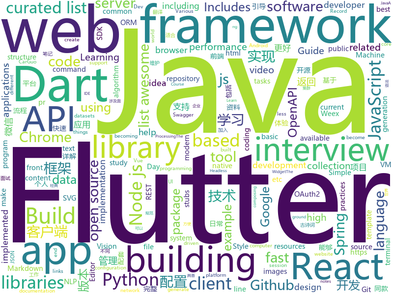

# 2018-08-08
See what the GitHub community is most excited about today.

## python
* [system-design-primer](https://github.com/donnemartin/system-design-primer)(**249 stars today**): Learn how to design large-scale systems. Prep for the system design interview. Includes Anki flashcards.
* [stt-benchmark](https://github.com/Picovoice/stt-benchmark)(**204 stars today**): speech-to-text benchmark framework
* [autokeras](https://github.com/jhfjhfj1/autokeras)(**128 stars today**): This is an automated machine learning (AutoML) package.
* [pyxel](https://github.com/kitao/pyxel)(**124 stars today**): A retro game development environment in Python
* [Readers](https://github.com/jiaruncao/Readers)(**107 stars today**): Neural Network Readers
* [models](https://github.com/tensorflow/models)(**61 stars today**): Models and examples built with TensorFlow
* [awesome-python](https://github.com/vinta/awesome-python)(**63 stars today**): A curated list of awesome Python frameworks, libraries, software and resources
* [public-apis](https://github.com/toddmotto/public-apis)(**64 stars today**): A collective list of public JSON APIs for use in web development.
* [cheat.sh](https://github.com/chubin/cheat.sh)(**64 stars today**): the only cheat sheet you need
* [keras](https://github.com/keras-team/keras)(**54 stars today**): Deep Learning for humans
* [harry_potter_universe](https://github.com/zotroneneis/harry_potter_universe)(**55 stars today**): Awesome Python features explained using the world of Harry Potter
* [cleverhans](https://github.com/tensorflow/cleverhans)(**42 stars today**): An adversarial example library for constructing attacks, building defenses, and benchmarking both
* [animatplot](https://github.com/t-makaro/animatplot)(**43 stars today**): A python package for animating plots build on matplotlib.
* [you-get](https://github.com/soimort/you-get)(**34 stars today**): ⏬Dumb downloader that scrapes the web
* [youtube-dl](https://github.com/rg3/youtube-dl)(**38 stars today**): Command-line program to download videos from YouTube.com and other video sites
* [Photon](https://github.com/s0md3v/Photon)(**38 stars today**): Incredibly fast crawler which extracts urls, emails, files, website accounts and much more.
* [xiblint](https://github.com/lyft/xiblint)(**40 stars today**): A tool for linting storyboard and xib files
* [CornerNet](https://github.com/umich-vl/CornerNet)(**37 stars today**): 
* [django](https://github.com/django/django)(**33 stars today**): The Web framework for perfectionists with deadlines.
* [faust](https://github.com/robinhood/faust)(**38 stars today**): Python Stream Processing
* [flask](https://github.com/pallets/flask)(**33 stars today**): The Python micro framework for building web applications.
* [termtosvg](https://github.com/nbedos/termtosvg)(**35 stars today**): Record terminal sessions as SVG animations
* [face_recognition](https://github.com/ageitgey/face_recognition)(**30 stars today**): The world's simplest facial recognition api for Python and the command line
* [awesome-machine-learning](https://github.com/josephmisiti/awesome-machine-learning)(**30 stars today**): A curated list of awesome Machine Learning frameworks, libraries and software.
* [studyFiles](https://github.com/threerocks/studyFiles)(**27 stars today**): 一些经典且高质量的电子书分享

## java
* [ImageWatcher](https://github.com/iielse/ImageWatcher)(**132 stars today**): 高仿微信可拖拽返回
* [Java-Guide](https://github.com/Snailclimb/Java-Guide)(**101 stars today**): 📖Java面试通关手册（Java学习指南）Java Interview Customs Manual (Java Study Guide)
* [proxyee-down](https://github.com/proxyee-down-org/proxyee-down)(**89 stars today**): http下载工具，基于http代理，支持多连接分块下载
* [paascloud-master](https://github.com/paascloud/paascloud-master)(**77 stars today**): spring cloud + vue 全家桶实战，模拟商城，完整的购物流程、后端运营平台，可以实现快速搭建企业级微服务项目
* [Java-Interview](https://github.com/crossoverJie/Java-Interview)(**70 stars today**): 👨‍🎓Java related : basic, concurrent, algorithm
* [java-design-patterns](https://github.com/iluwatar/java-design-patterns)(**64 stars today**): Design patterns implemented in Java
* [spring-boot](https://github.com/spring-projects/spring-boot)(**60 stars today**): Spring Boot
* [NewbieGuide](https://github.com/huburt-Hu/NewbieGuide)(**58 stars today**): Android 快速实现新手引导层的库，通过简洁链式调用，一行代码实现引导层的显示
* [APIJSON](https://github.com/TommyLemon/APIJSON)(**57 stars today**): 🚀后端接口和文档自动化，前端(客户端) 定制返回JSON的数据和结构！
* [elasticsearch](https://github.com/elastic/elasticsearch)(**50 stars today**): Open Source, Distributed, RESTful Search Engine
* [IDCardCamera](https://github.com/wildma/IDCardCamera)(**46 stars today**): Android自定义相机实现身份证拍照，并加入自动对焦与图片不规则裁剪
* [gushici](https://github.com/xenv/gushici)(**42 stars today**): 一言·古诗词 API (Hitokoto API)，随机返回一条古诗词名句。采用 Vert.x + Redis 全异步开发，毫秒级稳定响应。
* [incubator-dubbo](https://github.com/apache/incubator-dubbo)(**29 stars today**): Apache Dubbo (incubating) is a high-performance, java based, open source RPC framework.
* [tutorials](https://github.com/eugenp/tutorials)(**23 stars today**): The "REST With Spring" Course:
* [weixin-java-tools](https://github.com/Wechat-Group/weixin-java-tools)(**30 stars today**): 全能微信Java开发工具包，支持包括微信支付、开放平台、小程序、企业号和公众号等的开发
* [guava](https://github.com/google/guava)(**30 stars today**): Google core libraries for Java
* [Sentinel](https://github.com/alibaba/Sentinel)(**28 stars today**): A lightweight flow-control library providing high-available protection and monitoring (高可用防护的流量管理框架)
* [effective-java-3e-source-code](https://github.com/jbloch/effective-java-3e-source-code)(**31 stars today**): The source code from the third edition of Effective Java, with minor additions as necessary to make it runnable.
* [java-tron](https://github.com/tronprotocol/java-tron)(**31 stars today**): Java implementation of the Tron whitepaper
* [jib](https://github.com/GoogleContainerTools/jib)(**28 stars today**): ⛵️Build container images for your Java applications.
* [apollo](https://github.com/ctripcorp/apollo)(**26 stars today**): Apollo（阿波罗）是携程框架部门研发的分布式配置中心，能够集中化管理应用不同环境、不同集群的配置，配置修改后能够实时推送到应用端，并且具备规范的权限、流程治理等特性，适用于微服务配置管理场景。
* [RxJava](https://github.com/ReactiveX/RxJava)(**26 stars today**): RxJava – Reactive Extensions for the JVM – a library for composing asynchronous and event-based programs using observable sequences for the Java VM.
* [vjtools](https://github.com/vipshop/vjtools)(**27 stars today**): The vip.com's java coding standard, libraries and tools
* [spring-framework](https://github.com/spring-projects/spring-framework)(**19 stars today**): Spring Framework
* [okhttp](https://github.com/square/okhttp)(**22 stars today**): An HTTP+HTTP/2 client for Android and Java applications.

## unknown
* [100-Days-Of-ML-Code](https://github.com/Avik-Jain/100-Days-Of-ML-Code)(**787 stars today**): 100 Days of ML Coding
* [open-source-ideas](https://github.com/open-source-ideas/open-source-ideas)(**748 stars today**): 💡Ever had a cool idea to an Open Source project but didn't have the time to implement yourself? Let someone else give it a try!
* [dev.to](https://github.com/thepracticaldev/dev.to)(**369 stars today**): Where programmers share ideas and help each other grow
* [Interview-Notebook](https://github.com/CyC2018/Interview-Notebook)(**143 stars today**): 💡准备秋招学习笔记
* [InterviewMap](https://github.com/InterviewMap/InterviewMap)(**143 stars today**): Build the best interview map. The current content includes JS, network, browser related, performance optimization, security, framework, Git, data structure, algorithm, etc.
* [developer-roadmap](https://github.com/kamranahmedse/developer-roadmap)(**131 stars today**): Roadmap to becoming a web developer in 2018
* [gitignore](https://github.com/github/gitignore)(**73 stars today**): A collection of useful .gitignore templates
* [awesome](https://github.com/sindresorhus/awesome)(**68 stars today**): 😎Curated list of awesome lists
* [Front-End-Performance-Checklist](https://github.com/thedaviddias/Front-End-Performance-Checklist)(**70 stars today**): 🎮The only Front-End Performance Checklist that runs faster than the others
* [awesome-vue](https://github.com/vuejs/awesome-vue)(**60 stars today**): 🎉A curated list of awesome things related to Vue.js
* [bugcrowd_university](https://github.com/bugcrowd/bugcrowd_university)(**56 stars today**): Open source education content for the researcher community
* [react-developer-roadmap](https://github.com/adam-golab/react-developer-roadmap)(**50 stars today**): Roadmap to becoming a React developer in 2018
* [architect-awesome](https://github.com/xingshaocheng/architect-awesome)(**43 stars today**): 后端架构师技术图谱
* [free-programming-books](https://github.com/EbookFoundation/free-programming-books)(**45 stars today**): 📚Freely available programming books
* [awesome-public-datasets](https://github.com/awesomedata/awesome-public-datasets)(**42 stars today**): A topic-centric list of high-quality open datasets in public domains. Propose NEW data ☛☛☛PR☛☛☛
* [coding-interview-university](https://github.com/jwasham/coding-interview-university)(**42 stars today**): A complete computer science study plan to become a software engineer.
* [build-your-own-x](https://github.com/danistefanovic/build-your-own-x)(**39 stars today**): 🤓Build your own (insert technology here)
* [programmer-job-blacklist](https://github.com/shengxinjing/programmer-job-blacklist)(**41 stars today**): 🙈程序员找工作黑名单，换工作和当技术合伙人需谨慎啊
* [nodebestpractices](https://github.com/i0natan/nodebestpractices)(**38 stars today**): The largest Node.JS best practices list (August 2018)
* [rockstar](https://github.com/dylanbeattie/rockstar)(**39 stars today**): The Rockstar programming language specification
* [awesome-nodejs](https://github.com/sindresorhus/awesome-nodejs)(**36 stars today**): ⚡️Delightful Node.js packages and resources
* [gold-miner](https://github.com/xitu/gold-miner)(**34 stars today**): 🥇掘金翻译计划，可能是世界最大最好的英译中技术社区，最懂读者和译者的翻译平台：
* [awesome-react](https://github.com/enaqx/awesome-react)(**30 stars today**): A collection of awesome things regarding React ecosystem.
* [awesome-spring-cloud](https://github.com/ityouknow/awesome-spring-cloud)(**26 stars today**): Spring Cood 资源大全
* [awesome-mpc](https://github.com/rdragos/awesome-mpc)(**30 stars today**): A curated list of multi party computation resources and links.

## javascript
* [taskbook](https://github.com/klauscfhq/taskbook)(**186 stars today**): 📓Tasks, boards & notes for the command-line habitat
* [apexcharts.js](https://github.com/apexcharts/apexcharts.js)(**169 stars today**): 📊Interactive and Modern SVG Charts
* [vue](https://github.com/vuejs/vue)(**151 stars today**): 🖖A progressive, incrementally-adoptable JavaScript framework for building UI on the web.
* [javascript-algorithms](https://github.com/trekhleb/javascript-algorithms)(**153 stars today**): Algorithms and data structures implemented in JavaScript with explanations and links to further readings
* [apple-music-js](https://github.com/tvillarete/apple-music-js)(**150 stars today**): A music streaming service created from the ground up using ReactJS & Redux
* [mauerwerk](https://github.com/drcmda/mauerwerk)(**152 stars today**): ⚒A react-spring driven masonry-like grid with enter/exit and shared element transitions
* [mdx-deck](https://github.com/jxnblk/mdx-deck)(**148 stars today**): MDX-based presentation decks
* [terminalizer](https://github.com/faressoft/terminalizer)(**112 stars today**): 🦄Record your terminal and generate animated gif images
* [30-seconds-of-interviews](https://github.com/fejes713/30-seconds-of-interviews)(**103 stars today**): A curated collection of common interview questions to help you prepare for your next interview.
* [react](https://github.com/facebook/react)(**98 stars today**): A declarative, efficient, and flexible JavaScript library for building user interfaces.
* [ice](https://github.com/alibaba/ice)(**84 stars today**): 🚀飞冰 - 让前端开发简单而友好，海量可复用物料，配套桌面工具极速构建前端应用，效率提升 100%
* [create-react-app](https://github.com/facebook/create-react-app)(**68 stars today**): Create React apps with no build configuration.
* [mdx](https://github.com/mdx-js/mdx)(**78 stars today**): JSX in Markdown for ambitious projects
* [cvat](https://github.com/opencv/cvat)(**73 stars today**): Computer Vision Annotation Tool (CVAT) is a web-based tool which helps to annotate video and images for Computer Vision algorithms
* [axios](https://github.com/axios/axios)(**70 stars today**): Promise based HTTP client for the browser and node.js
* [rc-bmap](https://github.com/JserWang/rc-bmap)(**73 stars today**): 当百度地图遇上React，会产生怎样的火花🔥🎉欢迎您的加入🎉
* [puppeteer](https://github.com/GoogleChrome/puppeteer)(**64 stars today**): Headless Chrome Node API
* [fast-average-color](https://github.com/fast-average-color/fast-average-color)(**64 stars today**): Fast Average Color
* [ndb](https://github.com/GoogleChromeLabs/ndb)(**62 stars today**): ndb is an improved debugging experience for Node.js, enabled by Chrome DevTools
* [dumper.js](https://github.com/zeeshanu/dumper.js)(**61 stars today**): A better and pretty variable inspector for your Node.js applications
* [react-native](https://github.com/facebook/react-native)(**52 stars today**): A framework for building native apps with React.
* [got](https://github.com/sindresorhus/got)(**55 stars today**): Simplified HTTP requests
* [node](https://github.com/nodejs/node)(**48 stars today**): Node.js JavaScript runtime✨🐢🚀✨
* [router](https://github.com/reach/router)(**50 stars today**): 
* [javascript](https://github.com/airbnb/javascript)(**46 stars today**): JavaScript Style Guide

## html
* [awesome-mac](https://github.com/jaywcjlove/awesome-mac)(**29 stars today**):  Now we have become very big, Different from the original idea. Collect premium software in various categories.
* [NLP-progress](https://github.com/sebastianruder/NLP-progress)(**29 stars today**): Repository to track the progress in Natural Language Processing (NLP), including the datasets and the current state-of-the-art for the most common NLP tasks.
* [styleguide](https://github.com/google/styleguide)(**25 stars today**): Style guides for Google-originated open-source projects
* [TinyEditor](https://github.com/umpox/TinyEditor)(**26 stars today**): A functional HTML/CSS/JS editor in less than 400 bytes
* [Spoon-Knife](https://github.com/octocat/Spoon-Knife)(****): This repo is for demonstration purposes only.
* [exchangeratesapi](https://github.com/madisvain/exchangeratesapi)(**20 stars today**): Exchange Rates API
* [patchwork](https://github.com/jlord/patchwork)(****): All the Git-it Workshop completers!
* [JavaScript30](https://github.com/wesbos/JavaScript30)(**9 stars today**): 30 Day Vanilla JS Challenge
* [Coursera-ML-AndrewNg-Notes](https://github.com/fengdu78/Coursera-ML-AndrewNg-Notes)(**13 stars today**): 吴恩达老师的机器学习课程个人笔记
* [fastText](https://github.com/facebookresearch/fastText)(**13 stars today**): Library for fast text representation and classification.
* [swagger-codegen](https://github.com/swagger-api/swagger-codegen)(**12 stars today**): swagger-codegen contains a template-driven engine to generate documentation, API clients and server stubs in different languages by parsing your OpenAPI / Swagger definition.
* [navicat-keygen](https://github.com/DoubleLabyrinth/navicat-keygen)(**12 stars today**): A keygen for Navicat Premium
* [node-interview](https://github.com/ElemeFE/node-interview)(**11 stars today**): How to pass the Node.js interview of ElemeFE.
* [openapi-generator](https://github.com/OpenAPITools/openapi-generator)(**10 stars today**): OpenAPI Generator allows generation of API client libraries (SDK generation), server stubs, documentation and configuration automatically given an OpenAPI Spec (v2, v3)
* [core](https://github.com/stackblitz/core)(**10 stars today**): Online IDE powered by Visual Studio Code⚡️
* [a11y_styled_form_controls](https://github.com/scottaohara/a11y_styled_form_controls)(**11 stars today**): Various styled accessible form controls
* [PHP-Interview](https://github.com/xianyunyh/PHP-Interview)(**9 stars today**): PHP面试整理的资料。包括PHP、MySQL、Linux、计算机网络等资料,欢迎提交pr，如果错误，请指出，谢谢
* [ng-alain](https://github.com/cipchk/ng-alain)(**8 stars today**): ng-zorro-antd admin panel front-end framework
* [react-app-rewired](https://github.com/timarney/react-app-rewired)(**10 stars today**): Override create-react-app webpack configs without ejecting
* [Iosevka](https://github.com/be5invis/Iosevka)(**9 stars today**): Slender typeface for code, from code.
* [react-from-zero](https://github.com/kay-is/react-from-zero)(**9 stars today**): A simple (99% ES2015 less) tutorial for React
* [EIPs](https://github.com/ethereum/EIPs)(**7 stars today**): The Ethereum Improvement Proposal repository
* [WebFundamentals](https://github.com/google/WebFundamentals)(**8 stars today**): Best practices for modern web development
* [website-copy](https://github.com/exercism/website-copy)(**7 stars today**): A repository for exercism's website's copy
* [simple-icons](https://github.com/simple-icons/simple-icons)(**7 stars today**): SVG icons for popular brands

## dart
* [flutter](https://github.com/flutter/flutter)(**119 stars today**): Flutter makes it easy and fast to build beautiful mobile apps.
* [Flutter-learning](https://github.com/AweiLoveAndroid/Flutter-learning)(**36 stars today**): 🔥👍🌟⭐️⭐️⭐️Flutter从配置安装到填坑指南详解，Flutter相关Demo解读，项目实例，Dart语法详解
* [flutter-osc](https://github.com/yubo725/flutter-osc)(**20 stars today**): 基于Google Flutter的开源中国客户端，支持Android和iOS。
* [dio](https://github.com/flutterchina/dio)(**19 stars today**): A powerful Http client for Dart, which supports Interceptors, FormData, Request Cancellation, File Downloading, Timeout etc.
* [fancy_on_boarding](https://github.com/xsahil03x/fancy_on_boarding)(**14 stars today**): Fancy OnBoarding Screen Library
* [sdk](https://github.com/dart-lang/sdk)(**14 stars today**): The Dart SDK, including the VM, dart2js, core libraries, and more.
* [GSYGithubAppFlutter](https://github.com/CarGuo/GSYGithubAppFlutter)(**11 stars today**): 超完整的Flutter项目，功能丰富，适合学习和日常使用。GSYGithubApp系列的优势：我们目前已经拥有Flutter、Weex、ReactNative三个版本。 功能齐全，项目框架内技术涉及面广，完成度高，持续维护，配套文章，适合全面学习，跨框架对比参考。跨平台的开源Github客户端App，更好的体验，更丰富的功能，旨在更好的日常管理和维护个人Github，提供更好更方便的驾车体验～～Σ(￣。￣ﾉ)ﾉ。同款Weex版本 ： https://github.com/CarGuo/GSYGithubAppWeex 、同款React Native版本 ： https://github.com/CarGuo/GSYGithubApp
* [plugins](https://github.com/flutter/plugins)(**9 stars today**): Plugins for Flutter, including FlutterFire, maintained by the Flutter team
* [flutter_gank](https://github.com/pknan520/flutter_gank)(**7 stars today**): Flutter版的Gank客户端
* [flutter_ui_challenge_flight_search](https://github.com/MarcinusX/flutter_ui_challenge_flight_search)(**6 stars today**): An advanced UI design implemented in Flutter
* [aqueduct](https://github.com/stablekernel/aqueduct)(**6 stars today**): Dart HTTP server framework for building REST APIs. Includes PostgreSQL ORM and OAuth2 provider.
* [flutter_slidable](https://github.com/letsar/flutter_slidable)(**5 stars today**): A Flutter implementation of slidable list item with directional slide actions.
* [angular](https://github.com/dart-lang/angular)(**5 stars today**): Fast and productive web framework provided by Dart
* [validator.dart](https://github.com/karan/validator.dart)(****): 🐢String validation and sanitization for Dart.
* [FlutterHtmlView](https://github.com/PonnamKarthik/FlutterHtmlView)(****): Flutter Plugin to render html as a Widget
* [grpc-dart](https://github.com/grpc/grpc-dart)(****): The Dart language implementation of gRPC.
* [flutter_markdown](https://github.com/flutter/flutter_markdown)(****): A markdown renderer for Flutter.
* [jaguar](https://github.com/Jaguar-dart/jaguar)(****): Jaguar, a server framework built for speed, simplicity and extensible. ORM, Session, Authentication & Authorization, OAuth
* [dart-dnd](https://github.com/marcojakob/dart-dnd)(****): Drag and Drop for Dart web apps with mouse and touch support.
* [oauth2](https://github.com/dart-lang/oauth2)(****): An OAuth2 client library for Dart.
* [flutter_cache_manager](https://github.com/renefloor/flutter_cache_manager)(****): Generic cache manager for flutter
* [chromedeveditor](https://github.com/googlearchive/chromedeveditor)(****): Chrome Dev Editor is a developer tool for building apps on the Chrome platform - Chrome Apps and Web Apps, in JavaScript or Dart. (NO LONGER IN ACTIVE DEVELOPMENT)
* [hauberk](https://github.com/munificent/hauberk)(****): A web-based roguelike written in Dart.
* [inKino](https://github.com/roughike/inKino)(****): inKino - A cross platform movie and showtime browser for Finnkino cinemas, made with Flutter.
* [flutter-examples](https://github.com/nisrulz/flutter-examples)(****): [Examples] Simple basic isolated apps, for budding flutter devs.

## WordCloud

