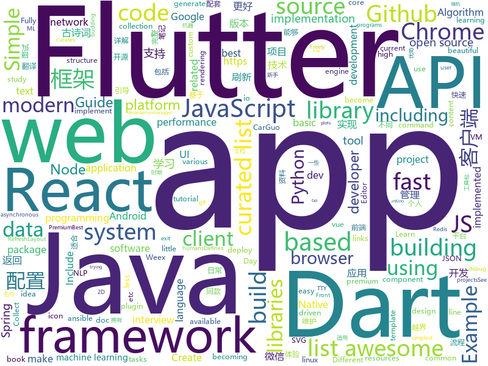

# 2018-08-09
See what the GitHub community is most excited about today.

## python
* [sclack](https://github.com/haskellcamargo/sclack)(**515 stars today**): The best CLI client for Slack, because everything is terrible!
* [system-design-primer](https://github.com/donnemartin/system-design-primer)(**233 stars today**): Learn how to design large-scale systems. Prep for the system design interview. Includes Anki flashcards.
* [autokeras](https://github.com/jhfjhfj1/autokeras)(**120 stars today**): This is an automated machine learning (AutoML) package.
* [models](https://github.com/tensorflow/models)(**80 stars today**): Models and examples built with TensorFlow
* [notifiers](https://github.com/notifiers/notifiers)(**118 stars today**): The easy way to send notifications
* [chinese-poetry](https://github.com/chinese-poetry/chinese-poetry)(**99 stars today**): 最全中华古诗词数据库, 唐宋两朝近一万四千古诗人, 接近5.5万首唐诗加26万宋诗. 两宋时期1564位词人，21050首词。
* [pyxel](https://github.com/kitao/pyxel)(**92 stars today**): A retro game development environment in Python
* [cheat.sh](https://github.com/chubin/cheat.sh)(**89 stars today**): the only cheat sheet you need
* [animatplot](https://github.com/t-makaro/animatplot)(**69 stars today**): A python package for animating plots build on matplotlib.
* [social_mapper](https://github.com/SpiderLabs/social_mapper)(**62 stars today**): A Social Media Enumeration & Correlation Tool by Jacob Wilkin(Greenwolf)
* [linux-insides](https://github.com/0xAX/linux-insides)(**59 stars today**): A little bit about a linux kernel
* [awesome-python](https://github.com/vinta/awesome-python)(**49 stars today**): A curated list of awesome Python frameworks, libraries, software and resources
* [faust](https://github.com/robinhood/faust)(**49 stars today**): Python Stream Processing
* [cleverhans](https://github.com/tensorflow/cleverhans)(**47 stars today**): An adversarial example library for constructing attacks, building defenses, and benchmarking both
* [stt-benchmark](https://github.com/Picovoice/stt-benchmark)(**46 stars today**): speech-to-text benchmark framework
* [keras](https://github.com/keras-team/keras)(**39 stars today**): Deep Learning for humans
* [scikit-learn](https://github.com/scikit-learn/scikit-learn)(**40 stars today**): scikit-learn: machine learning in Python
* [public-apis](https://github.com/toddmotto/public-apis)(**41 stars today**): A collective list of public JSON APIs for use in web development.
* [BurpExtension-WhatsApp-Decryption-CheckPoint](https://github.com/romanzaikin/BurpExtension-WhatsApp-Decryption-CheckPoint)(**38 stars today**): 
* [cpython](https://github.com/python/cpython)(**30 stars today**): The Python programming language
* [ansible](https://github.com/ansible/ansible)(**29 stars today**): Ansible is a radically simple IT automation platform that makes your applications and systems easier to deploy. Avoid writing scripts or custom code to deploy and update your applications — automate in a language that approaches plain English, using SSH, with no agents to install on remote systems. https://docs.ansible.com/ansible/
* [Kaggle](https://github.com/jianhaod/Kaggle)(**37 stars today**): Kaggle Project In Action (Include implement source code/training data/testing data and describe doc)
* [face_recognition](https://github.com/ageitgey/face_recognition)(**31 stars today**): The world's simplest facial recognition api for Python and the command line
* [studyFiles](https://github.com/threerocks/studyFiles)(**31 stars today**): 一些经典且高质量的电子书分享
* [FCN-pytorch-easiest](https://github.com/yunlongdong/FCN-pytorch-easiest)(**34 stars today**): trying to be the most easiest and just get-to-use pytorch implementation of FCN (Fully Convolutional Networks)

## java
* [Java-Guide](https://github.com/Snailclimb/Java-Guide)(**109 stars today**): 📖Java面试通关手册（Java学习指南）Java Interview Customs Manual (Java Study Guide)
* [ImageWatcher](https://github.com/iielse/ImageWatcher)(**110 stars today**): 高仿微信可拖拽返回
* [paascloud-master](https://github.com/paascloud/paascloud-master)(**79 stars today**): spring cloud + vue 全家桶实战，模拟商城，完整的购物流程、后端运营平台，可以实现快速搭建企业级微服务项目
* [proxyee-down](https://github.com/proxyee-down-org/proxyee-down)(**80 stars today**): http下载工具，基于http代理，支持多连接分块下载
* [Java-Interview](https://github.com/crossoverJie/Java-Interview)(**69 stars today**): 👨‍🎓Java related : basic, concurrent, algorithm
* [java-design-patterns](https://github.com/iluwatar/java-design-patterns)(**56 stars today**): Design patterns implemented in Java
* [gushici](https://github.com/xenv/gushici)(**63 stars today**): 一言·古诗词 API (Hitokoto API)，随机返回一条古诗词名句。采用 Vert.x + Redis 全异步开发，毫秒级稳定响应。
* [spring-boot](https://github.com/spring-projects/spring-boot)(**46 stars today**): Spring Boot
* [MyTikTok](https://github.com/whenSunSet/MyTikTok)(**49 stars today**): 我的抖音APP
* [APIJSON](https://github.com/TommyLemon/APIJSON)(**48 stars today**): 🚀后端接口和文档自动化，前端(客户端) 定制返回JSON的数据和结构！
* [guava](https://github.com/google/guava)(**40 stars today**): Google core libraries for Java
* [elasticsearch](https://github.com/elastic/elasticsearch)(**39 stars today**): Open Source, Distributed, RESTful Search Engine
* [spring-framework](https://github.com/spring-projects/spring-framework)(**34 stars today**): Spring Framework
* [NewbieGuide](https://github.com/huburt-Hu/NewbieGuide)(**40 stars today**): Android 快速实现新手引导层的库，通过简洁链式调用，一行代码实现引导层的显示
* [tutorials](https://github.com/eugenp/tutorials)(**23 stars today**): The "REST With Spring" Course:
* [Sentinel](https://github.com/alibaba/Sentinel)(**35 stars today**): A lightweight flow-control library providing high-available protection and monitoring (高可用防护的流量管理框架)
* [weixin-java-tools](https://github.com/Wechat-Group/weixin-java-tools)(**35 stars today**): 全能微信Java开发工具包，支持包括微信支付、开放平台、小程序、企业号和公众号等的开发
* [apollo](https://github.com/ctripcorp/apollo)(**27 stars today**): Apollo（阿波罗）是携程框架部门研发的分布式配置中心，能够集中化管理应用不同环境、不同集群的配置，配置修改后能够实时推送到应用端，并且具备规范的权限、流程治理等特性，适用于微服务配置管理场景。
* [RxJava](https://github.com/ReactiveX/RxJava)(**30 stars today**): RxJava – Reactive Extensions for the JVM – a library for composing asynchronous and event-based programs using observable sequences for the Java VM.
* [AndroidUtilCode](https://github.com/Blankj/AndroidUtilCode)(**23 stars today**): 🔥Android developers should collect the following utils(updating).
* [java-tron](https://github.com/tronprotocol/java-tron)(**29 stars today**): Java implementation of the Tron whitepaper
* [incubator-dubbo](https://github.com/apache/incubator-dubbo)(**23 stars today**): Apache Dubbo (incubating) is a high-performance, java based, open source RPC framework.
* [Java](https://github.com/TheAlgorithms/Java)(**26 stars today**): All Algorithms implemented in Java
* [effective-java-3e-source-code](https://github.com/jbloch/effective-java-3e-source-code)(**25 stars today**): The source code from the third edition of Effective Java, with minor additions as necessary to make it runnable.
* [SmartRefreshLayout](https://github.com/scwang90/SmartRefreshLayout)(**23 stars today**): 🔥下拉刷新、上拉加载、二级刷新、淘宝二楼、RefreshLayout、OverScroll，Android智能下拉刷新框架，支持越界回弹、越界拖动，具有极强的扩展性，集成了几十种炫酷的Header和 Footer。

## unknown
* [100-Days-Of-ML-Code](https://github.com/Avik-Jain/100-Days-Of-ML-Code)(**554 stars today**): 100 Days of ML Coding
* [open-source-ideas](https://github.com/open-source-ideas/open-source-ideas)(**508 stars today**): 💡Ever had a cool idea to an Open Source project but didn't have the time to implement yourself? Let someone else give it a try!
* [Interview-Notebook](https://github.com/CyC2018/Interview-Notebook)(**165 stars today**): 💡准备秋招学习笔记
* [developer-roadmap](https://github.com/kamranahmedse/developer-roadmap)(**108 stars today**): Roadmap to becoming a web developer in 2018
* [InterviewMap](https://github.com/InterviewMap/InterviewMap)(**106 stars today**): Build the best interview map. The current content includes JS, network, browser related, performance optimization, security, framework, Git, data structure, algorithm, etc.
* [bugcrowd_university](https://github.com/bugcrowd/bugcrowd_university)(**81 stars today**): Open source education content for the researcher community
* [awesome](https://github.com/sindresorhus/awesome)(**71 stars today**): 😎Curated list of awesome lists
* [gitignore](https://github.com/github/gitignore)(**62 stars today**): A collection of useful .gitignore templates
* [architect-awesome](https://github.com/xingshaocheng/architect-awesome)(**56 stars today**): 后端架构师技术图谱
* [free-programming-books](https://github.com/EbookFoundation/free-programming-books)(**56 stars today**): 📚Freely available programming books
* [awesome-vue](https://github.com/vuejs/awesome-vue)(**55 stars today**): 🎉A curated list of awesome things related to Vue.js
* [awesome-machine-learning-interpretability](https://github.com/jphall663/awesome-machine-learning-interpretability)(**51 stars today**): A curated list of awesome machine learning interpretability resources.
* [Front-End-Performance-Checklist](https://github.com/thedaviddias/Front-End-Performance-Checklist)(**52 stars today**): 🎮The only Front-End Performance Checklist that runs faster than the others
* [react-developer-roadmap](https://github.com/adam-golab/react-developer-roadmap)(**48 stars today**): Roadmap to becoming a React developer in 2018
* [build-your-own-x](https://github.com/danistefanovic/build-your-own-x)(**47 stars today**): 🤓Build your own (insert technology here)
* [coding-interview-university](https://github.com/jwasham/coding-interview-university)(**39 stars today**): A complete computer science study plan to become a software engineer.
* [awesome-flutter](https://github.com/Solido/awesome-flutter)(**34 stars today**): An awesome list that curates the best Flutter libraries, tools, tutorials, articles and more.
* [boost-asio-network-programming-little-book](https://github.com/NanXiao/boost-asio-network-programming-little-book)(**34 stars today**): Boost.Asio network programming little book
* [gold-miner](https://github.com/xitu/gold-miner)(**32 stars today**): 🥇掘金翻译计划，可能是世界最大最好的英译中技术社区，最懂读者和译者的翻译平台：
* [awesome-nodejs](https://github.com/sindresorhus/awesome-nodejs)(**29 stars today**): ⚡️Delightful Node.js packages and resources
* [og-equity-compensation](https://github.com/jlevy/og-equity-compensation)(**30 stars today**): Stock options, RSUs, taxes — a guide for humans
* [debug-adapter-protocol](https://github.com/Microsoft/debug-adapter-protocol)(**30 stars today**): Defines a common protocol for debug adapters.
* [awesome-symbolic-execution](https://github.com/ksluckow/awesome-symbolic-execution)(**27 stars today**): A curated list of awesome symbolic execution resources including essential research papers, lectures, videos, and tools.
* [learning](https://github.com/pseweryn/learning)(**28 stars today**): A repository of links to various tech learning resources
* [react-native-bootcamp](https://github.com/dabit3/react-native-bootcamp)(**25 stars today**): React Native Bootcamp Materials for TylerMcginnis.com

## javascript
* [apexcharts.js](https://github.com/apexcharts/apexcharts.js)(**185 stars today**): 📊Interactive and Modern SVG Charts
* [vue](https://github.com/vuejs/vue)(**162 stars today**): 🖖A progressive, incrementally-adoptable JavaScript framework for building UI on the web.
* [javascript-algorithms](https://github.com/trekhleb/javascript-algorithms)(**155 stars today**): Algorithms and data structures implemented in JavaScript with explanations and links to further readings
* [taskbook](https://github.com/klauscfhq/taskbook)(**137 stars today**): 📓Tasks, boards & notes for the command-line habitat
* [react](https://github.com/facebook/react)(**99 stars today**): A declarative, efficient, and flexible JavaScript library for building user interfaces.
* [mauerwerk](https://github.com/drcmda/mauerwerk)(**101 stars today**): ⚒A react-spring driven masonry-like grid with enter/exit and shared element transitions
* [terminalizer](https://github.com/faressoft/terminalizer)(**84 stars today**): 🦄Record your terminal and generate animated gif images
* [axios](https://github.com/axios/axios)(**68 stars today**): Promise based HTTP client for the browser and node.js
* [mdx-deck](https://github.com/jxnblk/mdx-deck)(**68 stars today**): MDX-based presentation decks
* [react-color](https://github.com/casesandberg/react-color)(**68 stars today**): 🎨Color Pickers from Sketch, Photoshop, Chrome, Github, Twitter & more
* [ice](https://github.com/alibaba/ice)(**64 stars today**): 🚀飞冰 - 让前端开发简单而友好，海量可复用物料，配套桌面工具极速构建前端应用，效率提升 100%
* [create-react-app](https://github.com/facebook/create-react-app)(**58 stars today**): Create React apps with no build configuration.
* [apple-music-js](https://github.com/tvillarete/apple-music-js)(**65 stars today**): A music streaming service created from the ground up using ReactJS & Redux
* [nes](https://github.com/fredericcambon/nes)(**65 stars today**): A Javascript NES Emulator
* [puppeteer](https://github.com/GoogleChrome/puppeteer)(**60 stars today**): Headless Chrome Node API
* [carbon](https://github.com/dawnlabs/carbon)(**59 stars today**): 🎨Create and share beautiful images of your source code
* [got](https://github.com/sindresorhus/got)(**55 stars today**): Simplified HTTP requests
* [javascript](https://github.com/airbnb/javascript)(**49 stars today**): JavaScript Style Guide
* [gatsby](https://github.com/gatsbyjs/gatsby)(**46 stars today**): ⚛️📄🚀Blazing fast site generator for React
* [react-native](https://github.com/facebook/react-native)(**45 stars today**): A framework for building native apps with React.
* [node](https://github.com/nodejs/node)(**44 stars today**): Node.js JavaScript runtime✨🐢🚀✨
* [mdx](https://github.com/mdx-js/mdx)(**47 stars today**): JSX in Markdown for ambitious projects
* [react-loadable](https://github.com/jamiebuilds/react-loadable)(**46 stars today**): ⏳A higher order component for loading components with promises.
* [browsh](https://github.com/browsh-org/browsh)(**44 stars today**): A fully-modern text-based browser, rendering to TTY and browsers
* [Ghost](https://github.com/TryGhost/Ghost)(**41 stars today**): The platform for professional publishers

## html
* [TinyEditor](https://github.com/umpox/TinyEditor)(**103 stars today**): A functional HTML/CSS/JS editor in less than 400 bytes
* [styleguide](https://github.com/google/styleguide)(**33 stars today**): Style guides for Google-originated open-source projects
* [pymk-inspector](https://github.com/GMG-Special-Projects-Desk/pymk-inspector)(**33 stars today**): See the people Facebook thinks you know
* [NLP-progress](https://github.com/sebastianruder/NLP-progress)(**29 stars today**): Repository to track the progress in Natural Language Processing (NLP), including the datasets and the current state-of-the-art for the most common NLP tasks.
* [awesome-mac](https://github.com/jaywcjlove/awesome-mac)(**21 stars today**):  Now we have become very big, Different from the original idea. Collect premium software in various categories.
* [fastText](https://github.com/facebookresearch/fastText)(**13 stars today**): Library for fast text representation and classification.
* [JavaScript30](https://github.com/wesbos/JavaScript30)(**11 stars today**): 30 Day Vanilla JS Challenge
* [Spoon-Knife](https://github.com/octocat/Spoon-Knife)(****): This repo is for demonstration purposes only.
* [gopl-zh](https://github.com/golang-china/gopl-zh)(**16 stars today**): 📚Go语言圣经中文版
* [Coursera-ML-AndrewNg-Notes](https://github.com/fengdu78/Coursera-ML-AndrewNg-Notes)(**11 stars today**): 吴恩达老师的机器学习课程个人笔记
* [portainer](https://github.com/portainer/portainer)(**14 stars today**): Simple management UI for Docker
* [navicat-keygen](https://github.com/DoubleLabyrinth/navicat-keygen)(**9 stars today**): A keygen for Navicat Premium
* [WebFundamentals](https://github.com/google/WebFundamentals)(**10 stars today**): Best practices for modern web development
* [swagger-codegen](https://github.com/swagger-api/swagger-codegen)(**10 stars today**): swagger-codegen contains a template-driven engine to generate documentation, API clients and server stubs in different languages by parsing your OpenAPI / Swagger definition.
* [simple-icons](https://github.com/simple-icons/simple-icons)(**9 stars today**): SVG icons for popular brands
* [exchangeratesapi](https://github.com/madisvain/exchangeratesapi)(**9 stars today**): Exchange Rates API
* [polymer](https://github.com/Polymer/polymer)(**8 stars today**): Build modern apps using web components
* [ionicons](https://github.com/ionic-team/ionicons)(**7 stars today**): The premium icon font for Ionic
* [electron-api-demos](https://github.com/electron/electron-api-demos)(**7 stars today**): Explore the Electron APIs
* [react-app-rewired](https://github.com/timarney/react-app-rewired)(**8 stars today**): Override create-react-app webpack configs without ejecting
* [proposal-optional-chaining](https://github.com/tc39/proposal-optional-chaining)(**8 stars today**): 
* [PHP-Interview](https://github.com/xianyunyh/PHP-Interview)(**7 stars today**): PHP面试整理的资料。包括PHP、MySQL、Linux、计算机网络等资料,欢迎提交pr，如果错误，请指出，谢谢
* [awesome-resume](https://github.com/resumejob/awesome-resume)(**7 stars today**): 包含简历常用例句
* [Iosevka](https://github.com/be5invis/Iosevka)(**6 stars today**): Slender typeface for code, from code.
* [react-from-zero](https://github.com/kay-is/react-from-zero)(**6 stars today**): A simple (99% ES2015 less) tutorial for React

## dart
* [flutter](https://github.com/flutter/flutter)(**96 stars today**): Flutter makes it easy and fast to build beautiful mobile apps.
* [sdk](https://github.com/dart-lang/sdk)(**30 stars today**): The Dart SDK, including the VM, dart2js, core libraries, and more.
* [Flutter-learning](https://github.com/AweiLoveAndroid/Flutter-learning)(**27 stars today**): 🔥👍🌟⭐️⭐️⭐️Flutter从配置安装到填坑指南详解，Flutter相关Demo解读，项目实例，Dart语法详解
* [plugins](https://github.com/flutter/plugins)(**13 stars today**): Plugins for Flutter, including FlutterFire, maintained by the Flutter team
* [GSYGithubAppFlutter](https://github.com/CarGuo/GSYGithubAppFlutter)(**12 stars today**): 超完整的Flutter项目，功能丰富，适合学习和日常使用。GSYGithubApp系列的优势：我们目前已经拥有Flutter、Weex、ReactNative三个版本。 功能齐全，项目框架内技术涉及面广，完成度高，持续维护，配套文章，适合全面学习，跨框架对比参考。跨平台的开源Github客户端App，更好的体验，更丰富的功能，旨在更好的日常管理和维护个人Github，提供更好更方便的驾车体验～～Σ(￣。￣ﾉ)ﾉ。同款Weex版本 ： https://github.com/CarGuo/GSYGithubAppWeex 、同款React Native版本 ： https://github.com/CarGuo/GSYGithubApp
* [dio](https://github.com/flutterchina/dio)(**13 stars today**): A powerful Http client for Dart, which supports Interceptors, FormData, Request Cancellation, File Downloading, Timeout etc.
* [flutter_gank](https://github.com/pknan520/flutter_gank)(**10 stars today**): Flutter版的Gank客户端
* [v2x](https://github.com/ali322/v2x)(**10 stars today**): Yet another v2ex Flutter App
* [flutter-examples](https://github.com/nisrulz/flutter-examples)(**8 stars today**): [Examples] Simple basic isolated apps, for budding flutter devs.
* [angular](https://github.com/dart-lang/angular)(**8 stars today**): Fast and productive web framework provided by Dart
* [build](https://github.com/dart-lang/build)(**6 stars today**): A build system for Dart
* [flutter-osc](https://github.com/yubo725/flutter-osc)(**6 stars today**): 基于Google Flutter的开源中国客户端，支持Android和iOS。
* [flutter_study](https://github.com/luhenchang/flutter_study)(**5 stars today**): 三天学会Flutter
* [dart-sass](https://github.com/sass/dart-sass)(**6 stars today**): A Dart implementation of Sass.
* [site-www](https://github.com/dart-lang/site-www)(**5 stars today**): Source for Dart website
* [dart-protoc-plugin](https://github.com/dart-lang/dart-protoc-plugin)(****): Dart plugin for protobuf compiler (protoc)
* [toh-6](https://github.com/angular-examples/toh-6)(****): Companion application for the Tour of Heroes Part 6 angular.io chapter.
* [http2](https://github.com/dart-lang/http2)(****): A HTTP/2 implementation for dart.
* [chromedeveditor](https://github.com/googlearchive/chromedeveditor)(****): Chrome Dev Editor is a developer tool for building apps on the Chrome platform - Chrome Apps and Web Apps, in JavaScript or Dart. (NO LONGER IN ACTIVE DEVELOPMENT)
* [hauberk](https://github.com/munificent/hauberk)(****): A web-based roguelike written in Dart.
* [inKino](https://github.com/roughike/inKino)(****): inKino - A cross platform movie and showtime browser for Finnkino cinemas, made with Flutter.
* [flutter_architecture_samples](https://github.com/brianegan/flutter_architecture_samples)(****): TodoMVC for Flutter
* [Flutter-UI-Kit](https://github.com/iampawan/Flutter-UI-Kit)(****): Flutter app for collection of UI in a UIKit
* [StageXL](https://github.com/bp74/StageXL)(****): A fast and universal 2D rendering engine for HTML5 and Dart.
* [FlutterExampleApps](https://github.com/iampawan/FlutterExampleApps)(****): [Example APPS] Basic Flutter apps, for flutter devs.

## WordCloud

