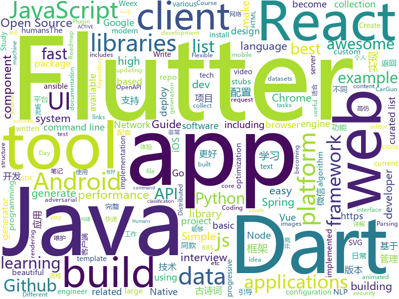

# 2018-08-10
See what the GitHub community is most excited about today.

## python
* [social_mapper](https://github.com/SpiderLabs/social_mapper)(**351 stars today**): A Social Media Enumeration & Correlation Tool by Jacob Wilkin(Greenwolf)
* [sclack](https://github.com/haskellcamargo/sclack)(**216 stars today**): The best CLI client for Slack, because everything is terrible!
* [system-design-primer](https://github.com/donnemartin/system-design-primer)(**202 stars today**): Learn how to design large-scale systems. Prep for the system design interview. Includes Anki flashcards.
* [Readers](https://github.com/jiaruncao/Readers)(**90 stars today**): Neural Network Readers
* [autokeras](https://github.com/jhfjhfj1/autokeras)(**104 stars today**): This is an automated machine learning (AutoML) package.
* [BurpExtension-WhatsApp-Decryption-CheckPoint](https://github.com/romanzaikin/BurpExtension-WhatsApp-Decryption-CheckPoint)(**83 stars today**): 
* [dancenet](https://github.com/jsn5/dancenet)(**80 stars today**): DanceNet - Dance generator using Autoencoder, LSTM and Mixture Density Network. (Keras)
* [cheat.sh](https://github.com/chubin/cheat.sh)(**64 stars today**): the only cheat sheet you need
* [chinese-poetry](https://github.com/chinese-poetry/chinese-poetry)(**64 stars today**): 最全中华古诗词数据库, 唐宋两朝近一万四千古诗人, 接近5.5万首唐诗加26万宋诗. 两宋时期1564位词人，21050首词。
* [awesome-python](https://github.com/vinta/awesome-python)(**56 stars today**): A curated list of awesome Python frameworks, libraries, software and resources
* [models](https://github.com/tensorflow/models)(**45 stars today**): Models and examples built with TensorFlow
* [pyxel](https://github.com/kitao/pyxel)(**61 stars today**): A retro game development environment in Python
* [cleverhans](https://github.com/tensorflow/cleverhans)(**50 stars today**): An adversarial example library for constructing attacks, building defenses, and benchmarking both
* [keras](https://github.com/keras-team/keras)(**43 stars today**): Deep Learning for humans
* [notifiers](https://github.com/notifiers/notifiers)(**46 stars today**): The easy way to send notifications
* [ansible](https://github.com/ansible/ansible)(**28 stars today**): Ansible is a radically simple IT automation platform that makes your applications and systems easier to deploy. Avoid writing scripts or custom code to deploy and update your applications — automate in a language that approaches plain English, using SSH, with no agents to install on remote systems. https://docs.ansible.com/ansible/
* [youtube-dl](https://github.com/rg3/youtube-dl)(**33 stars today**): Command-line program to download videos from YouTube.com and other video sites
* [django](https://github.com/django/django)(**30 stars today**): The Web framework for perfectionists with deadlines.
* [artificial-adversary](https://github.com/airbnb/artificial-adversary)(**37 stars today**): 🗣️Tool to generate adversarial text examples and test machine learning models against them
* [Raccoon](https://github.com/evyatarmeged/Raccoon)(**33 stars today**): A high performance offensive security tool for reconnaissance and vulnerability scanning
* [face_recognition](https://github.com/ageitgey/face_recognition)(**30 stars today**): The world's simplest facial recognition api for Python and the command line
* [odoo](https://github.com/odoo/odoo)(**27 stars today**): Odoo. Open Source Apps To Grow Your Business.
* [animatplot](https://github.com/t-makaro/animatplot)(**30 stars today**): A python package for animating plots build on matplotlib.
* [cpython](https://github.com/python/cpython)(**23 stars today**): The Python programming language
* [incubator-mxnet](https://github.com/apache/incubator-mxnet)(**28 stars today**): Lightweight, Portable, Flexible Distributed/Mobile Deep Learning with Dynamic, Mutation-aware Dataflow Dep Scheduler; for Python, R, Julia, Scala, Go, Javascript and more

## java
* [Java-Interview](https://github.com/crossoverJie/Java-Interview)(**156 stars today**): 👨‍🎓Java related : basic, concurrent, algorithm
* [Java-Guide](https://github.com/Snailclimb/Java-Guide)(**108 stars today**): 📖Java面试通关手册（Java学习指南）Java Interview Customs Manual (Java Study Guide)
* [proxyee-down](https://github.com/proxyee-down-org/proxyee-down)(**107 stars today**): http下载工具，基于http代理，支持多连接分块下载
* [gushici](https://github.com/xenv/gushici)(**111 stars today**): 一言·古诗词 API (Hitokoto API)，随机返回一条古诗词名句。采用 Vert.x + Redis 全异步开发，毫秒级稳定响应。
* [java-design-patterns](https://github.com/iluwatar/java-design-patterns)(**77 stars today**): Design patterns implemented in Java
* [tutorials](https://github.com/eugenp/tutorials)(**58 stars today**): The "REST With Spring" Course:
* [spring-boot](https://github.com/spring-projects/spring-boot)(**47 stars today**): Spring Boot
* [weixin-java-tools](https://github.com/Wechat-Group/weixin-java-tools)(**50 stars today**): 全能微信Java开发工具包，支持包括微信支付、开放平台、小程序、企业号和公众号等的开发
* [paascloud-master](https://github.com/paascloud/paascloud-master)(**45 stars today**): spring cloud + vue 全家桶实战，模拟商城，完整的购物流程、后端运营平台，可以实现快速搭建企业级微服务项目
* [Sentinel](https://github.com/alibaba/Sentinel)(**46 stars today**): A lightweight flow-control library providing high-available protection and monitoring (高可用防护的流量管理框架)
* [elasticsearch](https://github.com/elastic/elasticsearch)(**43 stars today**): Open Source, Distributed, RESTful Search Engine
* [ImageWatcher](https://github.com/iielse/ImageWatcher)(**42 stars today**): 高仿微信可拖拽返回
* [vjtools](https://github.com/vipshop/vjtools)(**36 stars today**): The vip.com's java coding standard, libraries and tools
* [MyTikTok](https://github.com/whenSunSet/MyTikTok)(**39 stars today**): 我的抖音APP
* [guava](https://github.com/google/guava)(**38 stars today**): Google core libraries for Java
* [incubator-dubbo](https://github.com/apache/incubator-dubbo)(**29 stars today**): Apache Dubbo (incubating) is a high-performance, java based, open source RPC framework.
* [spring-framework](https://github.com/spring-projects/spring-framework)(**31 stars today**): Spring Framework
* [apollo](https://github.com/ctripcorp/apollo)(**30 stars today**): Apollo（阿波罗）是携程框架部门研发的分布式配置中心，能够集中化管理应用不同环境、不同集群的配置，配置修改后能够实时推送到应用端，并且具备规范的权限、流程治理等特性，适用于微服务配置管理场景。
* [java-tron](https://github.com/tronprotocol/java-tron)(**33 stars today**): Java implementation of the Tron whitepaper
* [symphony](https://github.com/b3log/symphony)(**31 stars today**): 🎶A modern community (forum/BBS/SNS/blog) platform written in Java. 一个用 Java 实现的现代化社区（论坛/BBS/社交网络/博客）平台。
* [AndroidUtilCode](https://github.com/Blankj/AndroidUtilCode)(**27 stars today**): 🔥Android developers should collect the following utils(updating).
* [jib](https://github.com/GoogleContainerTools/jib)(**29 stars today**): ⛵️Build container images for your Java applications.
* [NewbieGuide](https://github.com/huburt-Hu/NewbieGuide)(**27 stars today**): Android 快速实现新手引导层的库，通过简洁链式调用，一行代码实现引导层的显示
* [XHttp2](https://github.com/xuexiangjys/XHttp2)(**27 stars today**): 一个功能强悍的网络请求库，使用RxJava2 + Retrofit2 + OKHttp组合进行封装。
* [okhttp](https://github.com/square/okhttp)(**23 stars today**): An HTTP+HTTP/2 client for Android and Java applications.

## unknown
* [100-Days-Of-ML-Code](https://github.com/Avik-Jain/100-Days-Of-ML-Code)(**308 stars today**): 100 Days of ML Coding
* [open-source-ideas](https://github.com/open-source-ideas/open-source-ideas)(**270 stars today**): 💡Ever had a cool idea to an Open Source project but didn't have the time to implement yourself? Let someone else give it a try!
* [Interview-Notebook](https://github.com/CyC2018/Interview-Notebook)(**121 stars today**): 💡准备秋招学习笔记
* [developer-roadmap](https://github.com/kamranahmedse/developer-roadmap)(**81 stars today**): Roadmap to becoming a web developer in 2018
* [InterviewMap](https://github.com/InterviewMap/InterviewMap)(**69 stars today**): Build the best interview map. The current content includes JS, network, browser related, performance optimization, security, framework, Git, data structure, algorithm, etc.
* [gitignore](https://github.com/github/gitignore)(**47 stars today**): A collection of useful .gitignore templates
* [awesome](https://github.com/sindresorhus/awesome)(**60 stars today**): 😎Curated list of awesome lists
* [architect-awesome](https://github.com/xingshaocheng/architect-awesome)(**51 stars today**): 后端架构师技术图谱
* [free-programming-books](https://github.com/EbookFoundation/free-programming-books)(**54 stars today**): 📚Freely available programming books
* [awesome-vue](https://github.com/vuejs/awesome-vue)(**57 stars today**): 🎉A curated list of awesome things related to Vue.js
* [build-your-own-x](https://github.com/danistefanovic/build-your-own-x)(**47 stars today**): 🤓Build your own (insert technology here)
* [Front-End-Performance-Checklist](https://github.com/thedaviddias/Front-End-Performance-Checklist)(**47 stars today**): 🎮The only Front-End Performance Checklist that runs faster than the others
* [coding-interview-university](https://github.com/jwasham/coding-interview-university)(**37 stars today**): A complete computer science study plan to become a software engineer.
* [programmer-job-blacklist](https://github.com/shengxinjing/programmer-job-blacklist)(**44 stars today**): 🙈程序员找工作黑名单，换工作和当技术合伙人需谨慎啊
* [react-developer-roadmap](https://github.com/adam-golab/react-developer-roadmap)(**32 stars today**): Roadmap to becoming a React developer in 2018
* [learning](https://github.com/pseweryn/learning)(**32 stars today**): A repository of links to various tech learning resources
* [bugcrowd_university](https://github.com/bugcrowd/bugcrowd_university)(**30 stars today**): Open source education content for the researcher community
* [toronto-tech-scene](https://github.com/toriagibbs/toronto-tech-scene)(**28 stars today**): A list of tech employers located in Toronto or who hire remotely in Ontario
* [awesome-flutter](https://github.com/Solido/awesome-flutter)(**28 stars today**): An awesome list that curates the best Flutter libraries, tools, tutorials, articles and more.
* [awesome-public-datasets](https://github.com/awesomedata/awesome-public-datasets)(**26 stars today**): A topic-centric list of high-quality open datasets in public domains. Propose NEW data ☛☛☛PR☛☛☛
* [Front-End-Performance-Checklist](https://github.com/ParkSB/Front-End-Performance-Checklist)(**25 stars today**): 🎮더 빠르게 작동하는 프론트엔드 성능 체크리스트
* [go-perfbook](https://github.com/dgryski/go-perfbook)(**26 stars today**): Thoughts on Go performance optimization
* [Awesome-Android-Interview](https://github.com/JsonChao/Awesome-Android-Interview)(**23 stars today**): 🔥A awesome android expert interview questions and answers（continuous updating ...）
* [og-equity-compensation](https://github.com/jlevy/og-equity-compensation)(**25 stars today**): Stock options, RSUs, taxes — a guide for humans
* [nocode](https://github.com/kelseyhightower/nocode)(**24 stars today**): The best way to write secure and reliable applications. Write nothing; deploy nowhere.

## javascript
* [react-window](https://github.com/bvaughn/react-window)(**350 stars today**): React components for efficiently rendering large lists and tabular data
* [javascript-algorithms](https://github.com/trekhleb/javascript-algorithms)(**244 stars today**): Algorithms and data structures implemented in JavaScript with explanations and links to further readings
* [carbon](https://github.com/dawnlabs/carbon)(**183 stars today**): 🎨Create and share beautiful images of your source code
* [dumper.js](https://github.com/zeeshanu/dumper.js)(**171 stars today**): A better and pretty variable inspector for your Node.js applications
* [got](https://github.com/sindresorhus/got)(**148 stars today**): Simplified HTTP requests
* [vue](https://github.com/vuejs/vue)(**130 stars today**): 🖖A progressive, incrementally-adoptable JavaScript framework for building UI on the web.
* [apexcharts.js](https://github.com/apexcharts/apexcharts.js)(**141 stars today**): 📊Interactive and Modern SVG Charts
* [react](https://github.com/facebook/react)(**104 stars today**): A declarative, efficient, and flexible JavaScript library for building user interfaces.
* [ims](https://github.com/mafintosh/ims)(**94 stars today**): Install My Stuff - an opinionated npm module installer
* [ice](https://github.com/alibaba/ice)(**87 stars today**): 🚀飞冰 - 让前端开发简单而友好，海量可复用物料，配套桌面工具极速构建前端应用，效率提升 100%
* [taskbook](https://github.com/klauscfhq/taskbook)(**86 stars today**): 📓Tasks, boards & notes for the command-line habitat
* [vue-design](https://github.com/HcySunYang/vue-design)(**81 stars today**): 📖逐行级别的源码分析
* [noform](https://github.com/alibaba/noform)(**79 stars today**): Easy to make form for everyone
* [axios](https://github.com/axios/axios)(**68 stars today**): Promise based HTTP client for the browser and node.js
* [create-react-app](https://github.com/facebook/create-react-app)(**63 stars today**): Create React apps with no build configuration.
* [javascript](https://github.com/airbnb/javascript)(**60 stars today**): JavaScript Style Guide
* [react-spring](https://github.com/drcmda/react-spring)(**66 stars today**): 🙌Helping react-motion and animated to become best friends
* [alexa-sign-language-translator](https://github.com/shekit/alexa-sign-language-translator)(**57 stars today**): A project to make Amazon Echo respond to sign language using your webcam
* [refined-github](https://github.com/sindresorhus/refined-github)(**59 stars today**): Browser extension that simplifies the GitHub interface and adds useful features
* [Ghost](https://github.com/TryGhost/Ghost)(**57 stars today**): The platform for professional publishers
* [terminalizer](https://github.com/faressoft/terminalizer)(**57 stars today**): 🦄Record your terminal and generate animated gif images
* [storybook](https://github.com/storybooks/storybook)(**55 stars today**): Interactive UI component dev & test: React, React Native, Vue, Angular
* [react-loadable](https://github.com/jamiebuilds/react-loadable)(**55 stars today**): ⏳A higher order component for loading components with promises.
* [gatsby](https://github.com/gatsbyjs/gatsby)(**47 stars today**): ⚛️📄🚀Blazing fast site generator for React
* [ndb](https://github.com/GoogleChromeLabs/ndb)(**50 stars today**): ndb is an improved debugging experience for Node.js, enabled by Chrome DevTools

## html
* [TinyEditor](https://github.com/umpox/TinyEditor)(**39 stars today**): A functional HTML/CSS/JS editor in less than 400 bytes
* [styleguide](https://github.com/google/styleguide)(**25 stars today**): Style guides for Google-originated open-source projects
* [gopl-zh](https://github.com/golang-china/gopl-zh)(**25 stars today**): 📚Go语言圣经中文版
* [NLP-progress](https://github.com/sebastianruder/NLP-progress)(**21 stars today**): Repository to track the progress in Natural Language Processing (NLP), including the datasets and the current state-of-the-art for the most common NLP tasks.
* [awesome-mac](https://github.com/jaywcjlove/awesome-mac)(**21 stars today**):  Now we have become very big, Different from the original idea. Collect premium software in various categories.
* [Coursera-ML-AndrewNg-Notes](https://github.com/fengdu78/Coursera-ML-AndrewNg-Notes)(**18 stars today**): 吴恩达老师的机器学习课程个人笔记
* [laravel-report-generator](https://github.com/Jimmy-JS/laravel-report-generator)(**17 stars today**): Rapidly Generate Simple Pdf, CSV, & Excel Report Package on Laravel
* [Spoon-Knife](https://github.com/octocat/Spoon-Knife)(****): This repo is for demonstration purposes only.
* [react-app-rewired](https://github.com/timarney/react-app-rewired)(**13 stars today**): Override create-react-app webpack configs without ejecting
* [fastText](https://github.com/facebookresearch/fastText)(**10 stars today**): Library for fast text representation and classification.
* [navicat-keygen](https://github.com/DoubleLabyrinth/navicat-keygen)(**12 stars today**): A keygen for Navicat Premium
* [primeng](https://github.com/primefaces/primeng)(**10 stars today**): UI Components for Angular
* [JavaScript30](https://github.com/wesbos/JavaScript30)(**9 stars today**): 30 Day Vanilla JS Challenge
* [proposal-optional-chaining](https://github.com/tc39/proposal-optional-chaining)(**11 stars today**): 
* [greensock-course](https://github.com/willianjusten/greensock-course)(**11 stars today**): Files to my course about Greensock on Udemy
* [swagger-codegen](https://github.com/swagger-api/swagger-codegen)(**10 stars today**): swagger-codegen contains a template-driven engine to generate documentation, API clients and server stubs in different languages by parsing your OpenAPI / Swagger definition.
* [ecma262](https://github.com/tc39/ecma262)(**9 stars today**): Status, process, and documents for ECMA262
* [requests-html](https://github.com/kennethreitz/requests-html)(**9 stars today**): Pythonic HTML Parsing for Humans™
* [simple-icons](https://github.com/simple-icons/simple-icons)(**8 stars today**): SVG icons for popular brands
* [pymk-inspector](https://github.com/GMG-Special-Projects-Desk/pymk-inspector)(**9 stars today**): See the people Facebook thinks you know
* [openapi-generator](https://github.com/OpenAPITools/openapi-generator)(**8 stars today**): OpenAPI Generator allows generation of API client libraries (SDK generation), server stubs, documentation and configuration automatically given an OpenAPI Spec (v2, v3)
* [fonts](https://github.com/google/fonts)(**8 stars today**): Font files available from Google Fonts
* [capacitor](https://github.com/ionic-team/capacitor)(**8 stars today**): Build cross-platform Native Progressive Web Apps for iOS, Android, and the web⚡️
* [dbt](https://github.com/fishtown-analytics/dbt)(**8 stars today**): dbt (data build tool) is a command line tool that enables data analysts and engineers to transform data in their warehouse more effectively.
* [portainer](https://github.com/portainer/portainer)(**7 stars today**): Simple management UI for Docker

## dart
* [flutter](https://github.com/flutter/flutter)(**104 stars today**): Flutter makes it easy and fast to build beautiful mobile apps.
* [FlutterScreens](https://github.com/samarthagarwal/FlutterScreens)(**43 stars today**): A collection of Screens with attractive UIs built with Flutter ready to be used in your applications.
* [GSYGithubAppFlutter](https://github.com/CarGuo/GSYGithubAppFlutter)(**41 stars today**): 超完整的Flutter项目，功能丰富，适合学习和日常使用。GSYGithubApp系列的优势：我们目前已经拥有Flutter、Weex、ReactNative三个版本。 功能齐全，项目框架内技术涉及面广，完成度高，持续维护，配套文章，适合全面学习，跨框架对比参考。跨平台的开源Github客户端App，更好的体验，更丰富的功能，旨在更好的日常管理和维护个人Github，提供更好更方便的驾车体验～～Σ(￣。￣ﾉ)ﾉ。同款Weex版本 ： https://github.com/CarGuo/GSYGithubAppWeex 、同款React Native版本 ： https://github.com/CarGuo/GSYGithubApp
* [Flutter-review-page-interaction](https://github.com/Mindinventory/Flutter-review-page-interaction)(**15 stars today**): Implementation of this review page interaction with Flutter
* [flutter_study](https://github.com/luhenchang/flutter_study)(**13 stars today**): 三天学会Flutter
* [flutter-osc](https://github.com/yubo725/flutter-osc)(**12 stars today**): 基于Google Flutter的开源中国客户端，支持Android和iOS。
* [Flutter-learning](https://github.com/AweiLoveAndroid/Flutter-learning)(**12 stars today**): 🔥👍🌟⭐️⭐️⭐️Flutter从配置安装到填坑指南详解，Flutter相关Demo解读，项目实例，Dart语法详解
* [dio](https://github.com/flutterchina/dio)(**10 stars today**): A powerful Http client for Dart, which supports Interceptors, FormData, Request Cancellation, File Downloading, Timeout etc.
* [angular](https://github.com/dart-lang/angular)(**9 stars today**): Fast and productive web framework provided by Dart
* [flutter-tetris](https://github.com/yubo725/flutter-tetris)(**9 stars today**): 基于Flutter的俄罗斯方块小游戏
* [sdk](https://github.com/dart-lang/sdk)(**8 stars today**): The Dart SDK, including the VM, dart2js, core libraries, and more.
* [flutter-examples](https://github.com/nisrulz/flutter-examples)(**7 stars today**): [Examples] Simple basic isolated apps, for budding flutter devs.
* [plugins](https://github.com/flutter/plugins)(**7 stars today**): Plugins for Flutter, including FlutterFire, maintained by the Flutter team
* [flutter_inapp_purchase](https://github.com/dooboolab/flutter_inapp_purchase)(**5 stars today**): In App Purchase plugin for Flutter.
* [oauth2](https://github.com/dart-lang/oauth2)(****): An OAuth2 client library for Dart.
* [chromedeveditor](https://github.com/googlearchive/chromedeveditor)(****): Chrome Dev Editor is a developer tool for building apps on the Chrome platform - Chrome Apps and Web Apps, in JavaScript or Dart. (NO LONGER IN ACTIVE DEVELOPMENT)
* [hauberk](https://github.com/munificent/hauberk)(****): A web-based roguelike written in Dart.
* [inKino](https://github.com/roughike/inKino)(****): inKino - A cross platform movie and showtime browser for Finnkino cinemas, made with Flutter.
* [flutter_architecture_samples](https://github.com/brianegan/flutter_architecture_samples)(****): TodoMVC for Flutter
* [Flutter-UI-Kit](https://github.com/iampawan/Flutter-UI-Kit)(****): Flutter app for collection of UI in a UIKit
* [StageXL](https://github.com/bp74/StageXL)(****): A fast and universal 2D rendering engine for HTML5 and Dart.
* [FlutterExampleApps](https://github.com/iampawan/FlutterExampleApps)(****): [Example APPS] Basic Flutter apps, for flutter devs.
* [zhihu-flutter](https://github.com/HackSoul/zhihu-flutter)(****): Flutter 高仿知乎 UI，非常漂亮，也非常流畅，flutter build apk 或 flutter build ios 之后更流畅
* [dart-sass](https://github.com/sass/dart-sass)(****): A Dart implementation of Sass.
* [github-issue-mover](https://github.com/google/github-issue-mover)(****): Making it easy to migrate issues between repos.

## WordCloud

