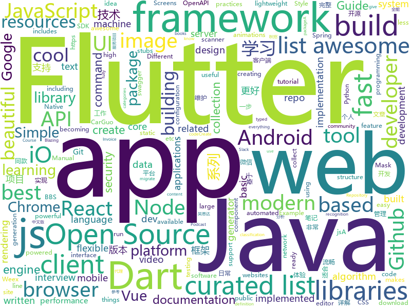

# 2018-08-12
See what the GitHub community is most excited about today.

## python
* [social_mapper](https://github.com/SpiderLabs/social_mapper)(**118 stars today**): A Social Media Enumeration & Correlation Tool by Jacob Wilkin(Greenwolf)
* [system-design-primer](https://github.com/donnemartin/system-design-primer)(**96 stars today**): Learn how to design large-scale systems. Prep for the system design interview. Includes Anki flashcards.
* [kefir](https://github.com/yogurt-cultures/kefir)(**85 stars today**): Kefir is a natural language processing kit for Turkic languages
* [Mask-RCNN](https://github.com/wannabeOG/Mask-RCNN)(**60 stars today**): A PyTorch implementation of the architecture of Mask RCNN, serves as an introduction to working with PyTorch
* [sclack](https://github.com/haskellcamargo/sclack)(**49 stars today**): The best CLI client for Slack, because everything is terrible!
* [autokeras](https://github.com/jhfjhfj1/autokeras)(**46 stars today**): This is an automated machine learning (AutoML) package.
* [featuretools](https://github.com/Featuretools/featuretools)(**38 stars today**): automated feature engineering
* [public-apis](https://github.com/toddmotto/public-apis)(**39 stars today**): A collective list of public JSON APIs for use in web development.
* [awesome-python](https://github.com/vinta/awesome-python)(**35 stars today**): A curated list of awesome Python frameworks, libraries, software and resources
* [google-images-download](https://github.com/hardikvasa/google-images-download)(**37 stars today**): Python Script to download hundreds of images from 'Google Images'. It is a ready-to-run code!
* [xiblint](https://github.com/lyft/xiblint)(**37 stars today**): A tool for linting storyboard and xib files
* [PySimpleGUI](https://github.com/MikeTheWatchGuy/PySimpleGUI)(**36 stars today**): Super-simple GUI to grasp... Powerfully customizable.... all on tkinter
* [cheat.sh](https://github.com/chubin/cheat.sh)(**35 stars today**): the only cheat sheet you need
* [youtube-dl](https://github.com/rg3/youtube-dl)(**35 stars today**): Command-line program to download videos from YouTube.com and other video sites
* [python-jvm-interpreter](https://github.com/gkbrk/python-jvm-interpreter)(**29 stars today**): Java Virtual Machine implementation in Python
* [face_recognition](https://github.com/ageitgey/face_recognition)(**27 stars today**): The world's simplest facial recognition api for Python and the command line
* [keras](https://github.com/keras-team/keras)(**24 stars today**): Deep Learning for humans
* [CornerNet](https://github.com/umich-vl/CornerNet)(**26 stars today**): 
* [haproxy-wi](https://github.com/Aidaho12/haproxy-wi)(**26 stars today**): Web interface for managing Haproxy servers
* [dancenet](https://github.com/jsn5/dancenet)(**24 stars today**): DanceNet -💃💃Dance generator using Autoencoder, LSTM and Mixture Density Network. (Keras)
* [img_term](https://github.com/JonnoFTW/img_term)(**26 stars today**): Display image and video camera in your ANSI terminal!
* [hall-of-fame](https://github.com/sourcerer-io/hall-of-fame)(**26 stars today**): 🏆Show some love to your repo contributors.
* [astropy](https://github.com/astropy/astropy)(**25 stars today**): Repository for the Astropy core package
* [gluon-reid](https://github.com/xiaolai-sqlai/gluon-reid)(**24 stars today**): A code gallery for person re-identification with mxnet-gluon, and I will reproduce many STOA algorithm.
* [commcare-hq](https://github.com/dimagi/commcare-hq)(**23 stars today**): A server-side tool to help manage community health workers, written in Django

## java
* [BitcoinWallet](https://github.com/terryjiao/BitcoinWallet)(**138 stars today**): 
* [proxyee-down](https://github.com/proxyee-down-org/proxyee-down)(**62 stars today**): http下载工具，基于http代理，支持多连接分块下载
* [ballerina-lang](https://github.com/ballerina-platform/ballerina-lang)(**38 stars today**): Ballerina is a compiled, transactional, statically and strongly typed programming language with textual and graphical syntaxes.
* [Java-Interview](https://github.com/crossoverJie/Java-Interview)(**34 stars today**): 👨‍🎓Java related : basic, concurrent, algorithm
* [spring-boot](https://github.com/spring-projects/spring-boot)(**25 stars today**): Spring Boot
* [java-design-patterns](https://github.com/iluwatar/java-design-patterns)(**26 stars today**): Design patterns implemented in Java
* [Java-Guide](https://github.com/Snailclimb/Java-Guide)(**28 stars today**): 📖Java面试通关手册（Java学习指南）Java Interview Customs Manual (Java Study Guide)
* [tutorials](https://github.com/eugenp/tutorials)(**20 stars today**): The "REST With Spring" Course:
* [paascloud-master](https://github.com/paascloud/paascloud-master)(**23 stars today**): spring cloud + vue 全家桶实战，模拟商城，完整的购物流程、后端运营平台，可以实现快速搭建企业级微服务项目
* [Sentinel](https://github.com/alibaba/Sentinel)(**22 stars today**): A lightweight flow-control library providing high-available protection and monitoring (高可用防护的流量管理框架)
* [incubator-dubbo](https://github.com/apache/incubator-dubbo)(**17 stars today**): Apache Dubbo (incubating) is a high-performance, java based, open source RPC framework.
* [guava](https://github.com/google/guava)(**18 stars today**): Google core libraries for Java
* [interviews](https://github.com/kdn251/interviews)(**17 stars today**): Everything you need to know to get the job.
* [elasticsearch](https://github.com/elastic/elasticsearch)(**15 stars today**): Open Source, Distributed, RESTful Search Engine
* [symphony](https://github.com/b3log/symphony)(**18 stars today**): 🎶A modern community (forum/BBS/SNS/blog) platform written in Java. 一个用 Java 实现的现代化社区（论坛/BBS/社交网络/博客）平台。
* [AndroidUtilCode](https://github.com/Blankj/AndroidUtilCode)(**18 stars today**): 🔥Android developers should collect the following utils(updating).
* [Java](https://github.com/TheAlgorithms/Java)(**16 stars today**): All Algorithms implemented in Java
* [spring-framework](https://github.com/spring-projects/spring-framework)(**15 stars today**): Spring Framework
* [jib](https://github.com/GoogleContainerTools/jib)(**16 stars today**): ⛵️Build container images for your Java applications.
* [classgraph](https://github.com/classgraph/classgraph)(**14 stars today**): An uber-fast, ultra-lightweight Java classpath scanner, module scanner, and annotation processor.
* [param-miner](https://github.com/PortSwigger/param-miner)(**12 stars today**): 
* [Magisk](https://github.com/topjohnwu/Magisk)(**11 stars today**): A Magic Mask to Alter Android System Systemless-ly
* [weixin-java-tools](https://github.com/Wechat-Group/weixin-java-tools)(**11 stars today**): 全能微信Java开发工具包，支持包括微信支付、开放平台、小程序、企业号和公众号等的开发
* [zxing](https://github.com/zxing/zxing)(**11 stars today**): ZXing ("Zebra Crossing") barcode scanning library for Java, Android
* [retrofit](https://github.com/square/retrofit)(**11 stars today**): Type-safe HTTP client for Android and Java by Square, Inc.

## unknown
* [100-Days-Of-ML-Code](https://github.com/Avik-Jain/100-Days-Of-ML-Code)(**265 stars today**): 100 Days of ML Coding
* [open-source-ideas](https://github.com/open-source-ideas/open-source-ideas)(**152 stars today**): 💡Ever had a cool idea to an Open Source project but didn't have the time to implement yourself? Let someone else give it a try!
* [programmer-job-blacklist](https://github.com/shengxinjing/programmer-job-blacklist)(**99 stars today**): 🙈程序员找工作黑名单，换工作和当技术合伙人需谨慎啊
* [free-programming-books](https://github.com/EbookFoundation/free-programming-books)(**59 stars today**): 📚Freely available programming books
* [awesome](https://github.com/sindresorhus/awesome)(**52 stars today**): 😎Curated list of awesome lists
* [Interview-Notebook](https://github.com/CyC2018/Interview-Notebook)(**48 stars today**): 💡准备秋招学习笔记
* [nodebestpractices](https://github.com/i0natan/nodebestpractices)(**44 stars today**): The largest Node.JS best practices list (August 2018)
* [gitignore](https://github.com/github/gitignore)(**32 stars today**): A collection of useful .gitignore templates
* [developer-roadmap](https://github.com/kamranahmedse/developer-roadmap)(**29 stars today**): Roadmap to becoming a web developer in 2018
* [awesome-vue](https://github.com/vuejs/awesome-vue)(**27 stars today**): 🎉A curated list of awesome things related to Vue.js
* [github-cheat-sheet](https://github.com/tiimgreen/github-cheat-sheet)(**27 stars today**): A list of cool features of Git and GitHub.
* [InterviewMap](https://github.com/InterviewMap/InterviewMap)(**27 stars today**): Build the best interview map. The current content includes JS, network, browser related, performance optimization, security, framework, Git, data structure, algorithm, etc.
* [architect-awesome](https://github.com/xingshaocheng/architect-awesome)(**19 stars today**): 后端架构师技术图谱
* [awesome-cpp](https://github.com/fffaraz/awesome-cpp)(**23 stars today**): A curated list of awesome C++ (or C) frameworks, libraries, resources, and shiny things. Inspired by awesome-... stuff.
* [awesome-flutter](https://github.com/Solido/awesome-flutter)(**23 stars today**): An awesome list that curates the best Flutter libraries, tools, tutorials, articles and more.
* [build-your-own-x](https://github.com/danistefanovic/build-your-own-x)(**22 stars today**): 🤓Build your own (insert technology here)
* [laravel-best-practices](https://github.com/alexeymezenin/laravel-best-practices)(**18 stars today**): Laravel best practices
* [react-developer-roadmap](https://github.com/adam-golab/react-developer-roadmap)(**18 stars today**): Roadmap to becoming a React developer in 2018
* [awesome-nodejs](https://github.com/sindresorhus/awesome-nodejs)(**19 stars today**): ⚡️Delightful Node.js packages and resources
* [iCSS](https://github.com/chokcoco/iCSS)(**19 stars today**): 谈谈一些有趣的 CSS 话题
* [Front-End-Performance-Checklist](https://github.com/thedaviddias/Front-End-Performance-Checklist)(**18 stars today**): 🎮The only Front-End Performance Checklist that runs faster than the others
* [trackerslist](https://github.com/ngosang/trackerslist)(**16 stars today**): An updated list of public BitTorrent trackers
* [awesome-puppeteer](https://github.com/transitive-bullshit/awesome-puppeteer)(**16 stars today**): A curated list of awesome puppeteer resources.
* [Best-websites-a-programmer-should-visit](https://github.com/sdmg15/Best-websites-a-programmer-should-visit)(**15 stars today**): 🔗Some useful websites for programmers.
* [go](https://github.com/datasciencemasters/go)(**14 stars today**): The Open Source Data Science Masters

## javascript
* [graphqurl](https://github.com/hasura/graphqurl)(**249 stars today**): curl for GraphQL with autocomplete, subscriptions and GraphiQL. Also a JS library
* [dumper.js](https://github.com/zeeshanu/dumper.js)(**156 stars today**): A better and pretty variable inspector for your Node.js applications
* [electro-grammar](https://github.com/monostable/electro-grammar)(**87 stars today**): ⚡️A parser for electronic component descriptions
* [javascript-algorithms](https://github.com/trekhleb/javascript-algorithms)(**79 stars today**): Algorithms and data structures implemented in JavaScript with explanations and links to further readings
* [got](https://github.com/sindresorhus/got)(**82 stars today**): Simplified HTTP requests
* [react](https://github.com/facebook/react)(**63 stars today**): A declarative, efficient, and flexible JavaScript library for building user interfaces.
* [vue](https://github.com/vuejs/vue)(**60 stars today**): 🖖A progressive, incrementally-adoptable JavaScript framework for building UI on the web.
* [vue-cli](https://github.com/vuejs/vue-cli)(**59 stars today**): 🛠️Standard Tooling for Vue.js Development
* [ember.js](https://github.com/emberjs/ember.js)(**56 stars today**): Ember.js - A JavaScript framework for creating ambitious web applications
* [Netron](https://github.com/lutzroeder/Netron)(**57 stars today**): Visualizer for deep learning and machine learning models
* [erxes](https://github.com/erxes/erxes)(**47 stars today**): erxes is an AI meets open source messaging platform for sales, marketing and support
* [carbon](https://github.com/dawnlabs/carbon)(**46 stars today**): 🎨Create and share beautiful images of your source code
* [create-react-app](https://github.com/facebook/create-react-app)(**42 stars today**): Create React apps with no build configuration.
* [react-day-picker](https://github.com/gpbl/react-day-picker)(**43 stars today**): Flexible date picker for React
* [javascript](https://github.com/airbnb/javascript)(**36 stars today**): JavaScript Style Guide
* [react-native](https://github.com/facebook/react-native)(**38 stars today**): A framework for building native apps with React.
* [vuepress](https://github.com/vuejs/vuepress)(**39 stars today**): 📝Minimalistic Vue-powered static site generator
* [react-window](https://github.com/bvaughn/react-window)(**39 stars today**): React components for efficiently rendering large lists and tabular data
* [SuperSlide.js](https://github.com/osrec/SuperSlide.js)(**38 stars today**): A flexible, smooth, GPU accelerated sliding menu for your next PWA
* [axios](https://github.com/axios/axios)(**33 stars today**): Promise based HTTP client for the browser and node.js
* [browsh](https://github.com/browsh-org/browsh)(**36 stars today**): A fully-modern text-based browser, rendering to TTY and browsers
* [gatsby](https://github.com/gatsbyjs/gatsby)(**30 stars today**): ⚛️📄🚀Blazing fast site generator for React
* [puppeteer](https://github.com/GoogleChrome/puppeteer)(**31 stars today**): Headless Chrome Node API
* [taskbook](https://github.com/klauscfhq/taskbook)(**30 stars today**): 📓Tasks, boards & notes for the command-line habitat
* [vue-design](https://github.com/HcySunYang/vue-design)(**26 stars today**): 📖逐行级别的源码分析

## html
* [TinyEditor](https://github.com/umpox/TinyEditor)(**261 stars today**): A functional HTML/CSS/JS editor in less than 400 bytes
* [Publii](https://github.com/GetPublii/Publii)(**187 stars today**): Publii is a desktop-based CMS for Windows and Mac that makes creating static websites fast and hassle-free, even for beginners.
* [styleguide](https://github.com/google/styleguide)(**25 stars today**): Style guides for Google-originated open-source projects
* [WebFundamentals](https://github.com/google/WebFundamentals)(**16 stars today**): Best practices for modern web development
* [awesome-mac](https://github.com/jaywcjlove/awesome-mac)(**15 stars today**):  Now we have become very big, Different from the original idea. Collect premium software in various categories.
* [fastText](https://github.com/facebookresearch/fastText)(**13 stars today**): Library for fast text representation and classification.
* [Coursera-ML-AndrewNg-Notes](https://github.com/fengdu78/Coursera-ML-AndrewNg-Notes)(**7 stars today**): 吴恩达老师的机器学习课程个人笔记
* [Spoon-Knife](https://github.com/octocat/Spoon-Knife)(****): This repo is for demonstration purposes only.
* [MyArticles](https://github.com/zhengmin1989/MyArticles)(**8 stars today**): 蒸米的文章（iOS冰与火之歌系列，一步一步学ROP系列，安卓动态调试七种武器系列等）
* [swagger-codegen](https://github.com/swagger-api/swagger-codegen)(**7 stars today**): swagger-codegen contains a template-driven engine to generate documentation, API clients and server stubs in different languages by parsing your OpenAPI / Swagger definition.
* [swiftdoc.org](https://github.com/SwiftDocOrg/swiftdoc.org)(**7 stars today**): Auto-generated documentation for Swift. Command-click no more.
* [react-app-rewired](https://github.com/timarney/react-app-rewired)(**7 stars today**): Override create-react-app webpack configs without ejecting
* [openapi-generator](https://github.com/OpenAPITools/openapi-generator)(**7 stars today**): OpenAPI Generator allows generation of API client libraries (SDK generation), server stubs, documentation and configuration automatically given an OpenAPI Spec (v2, v3)
* [gopl-zh](https://github.com/golang-china/gopl-zh)(**6 stars today**): 📚Go语言圣经中文版
* [Winds](https://github.com/GetStream/Winds)(**6 stars today**): A Beautiful Open Source RSS & Podcast App Powered by Getstream.io
* [awesome-angular](https://github.com/gdi2290/awesome-angular)(**6 stars today**): 📄A curated list of awesome Angular resources by @tipeio
* [react-from-zero](https://github.com/kay-is/react-from-zero)(**6 stars today**): A simple (99% ES2015 less) tutorial for React
* [patchwork](https://github.com/jlord/patchwork)(****): All the Git-it Workshop completers!
* [portainer](https://github.com/portainer/portainer)(**5 stars today**): Simple management UI for Docker
* [polymer](https://github.com/Polymer/polymer)(**5 stars today**): Build modern apps using web components
* [simple-icons](https://github.com/simple-icons/simple-icons)(**5 stars today**): SVG icons for popular brands
* [owasp-mstg](https://github.com/OWASP/owasp-mstg)(**5 stars today**): The Mobile Security Testing Guide (MSTG) is a comprehensive manual for mobile app security testing and reverse engineering.
* [devdocs](https://github.com/magento/devdocs)(****): Magento Developer Documentation
* [istio.github.io](https://github.com/istio/istio.github.io)(****): Source for the istio.io site
* [nodejs-ex](https://github.com/sclorg/nodejs-ex)(****): node.js example

## dart
* [flutter](https://github.com/flutter/flutter)(**44 stars today**): Flutter makes it easy and fast to build beautiful mobile apps.
* [Animated-Text-Kit](https://github.com/aagarwal1012/Animated-Text-Kit)(**29 stars today**): 🔔A flutter package to create cool and beautiful text animations.
* [plugins](https://github.com/flutter/plugins)(**11 stars today**): Plugins for Flutter, including FlutterFire, maintained by the Flutter team
* [trace](https://github.com/trentpiercy/trace)(**11 stars today**): Full-featured, Modern and Powerful Crypto Portfolio & Market Explorer. Built with Flutter
* [flutter_study](https://github.com/luhenchang/flutter_study)(**9 stars today**): 三天学会Flutter
* [GSYGithubAppFlutter](https://github.com/CarGuo/GSYGithubAppFlutter)(**9 stars today**): 超完整的Flutter项目，功能丰富，适合学习和日常使用。GSYGithubApp系列的优势：我们目前已经拥有Flutter、Weex、ReactNative三个版本。 功能齐全，项目框架内技术涉及面广，完成度高，持续维护，配套文章，适合全面学习，跨框架对比参考。跨平台的开源Github客户端App，更好的体验，更丰富的功能，旨在更好的日常管理和维护个人Github，提供更好更方便的驾车体验～～Σ(￣。￣ﾉ)ﾉ。同款Weex版本 ： https://github.com/CarGuo/GSYGithubAppWeex 、同款React Native版本 ： https://github.com/CarGuo/GSYGithubApp
* [sdk](https://github.com/dart-lang/sdk)(**8 stars today**): The Dart SDK, including the VM, dart2js, core libraries, and more.
* [flutter-mobile](https://github.com/invoiceninja/flutter-mobile)(**6 stars today**): iOS/Android apps for Invoice Ninja built with Flutter
* [FlutterScreens](https://github.com/samarthagarwal/FlutterScreens)(**6 stars today**): A collection of Screens with attractive UIs built with Flutter ready to be used in your applications.
* [IntroViews-Flutter](https://github.com/aagarwal1012/IntroViews-Flutter)(****): ☀️A Flutter package for some material design app intro screens with some cool animations.
* [chromedeveditor](https://github.com/googlearchive/chromedeveditor)(****): Chrome Dev Editor is a developer tool for building apps on the Chrome platform - Chrome Apps and Web Apps, in JavaScript or Dart. (NO LONGER IN ACTIVE DEVELOPMENT)
* [flutter-osc](https://github.com/yubo725/flutter-osc)(****): 基于Google Flutter的开源中国客户端，支持Android和iOS。
* [hauberk](https://github.com/munificent/hauberk)(****): A web-based roguelike written in Dart.
* [inKino](https://github.com/roughike/inKino)(****): inKino - A cross platform movie and showtime browser for Finnkino cinemas, made with Flutter.
* [flutter-examples](https://github.com/nisrulz/flutter-examples)(****): [Examples] Simple basic isolated apps, for budding flutter devs.
* [flutter_architecture_samples](https://github.com/brianegan/flutter_architecture_samples)(****): TodoMVC for Flutter
* [Flutter-UI-Kit](https://github.com/iampawan/Flutter-UI-Kit)(****): Flutter app for collection of UI in a UIKit
* [angular](https://github.com/dart-lang/angular)(****): Fast and productive web framework provided by Dart
* [FlutterExampleApps](https://github.com/iampawan/FlutterExampleApps)(****): [Example APPS] Basic Flutter apps, for flutter devs.
* [StageXL](https://github.com/bp74/StageXL)(****): A fast and universal 2D rendering engine for HTML5 and Dart.
* [dio](https://github.com/flutterchina/dio)(****): A powerful Http client for Dart, which supports Interceptors, FormData, Request Cancellation, File Downloading, Timeout etc.
* [zhihu-flutter](https://github.com/HackSoul/zhihu-flutter)(****): Flutter 高仿知乎 UI，非常漂亮，也非常流畅，flutter build apk 或 flutter build ios 之后更流畅
* [Flutter-learning](https://github.com/AweiLoveAndroid/Flutter-learning)(****): 🔥👍🌟⭐️⭐️⭐️Flutter从配置安装到填坑指南详解，Flutter相关Demo解读，项目实例，Dart语法详解
* [dart-sass](https://github.com/sass/dart-sass)(****): A Dart implementation of Sass.
* [github-issue-mover](https://github.com/google/github-issue-mover)(****): Making it easy to migrate issues between repos.

## WordCloud

