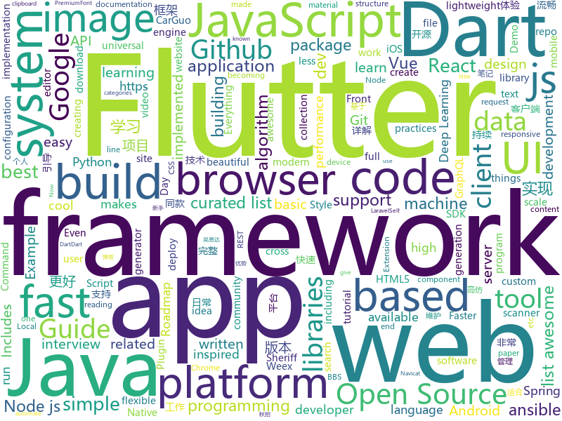

# 2018-08-13
See what the GitHub community is most excited about today.

## python
* [social_mapper](https://github.com/SpiderLabs/social_mapper)(**102 stars today**): A Social Media Enumeration & Correlation Tool by Jacob Wilkin(Greenwolf)
* [system-design-primer](https://github.com/donnemartin/system-design-primer)(**99 stars today**): Learn how to design large-scale systems. Prep for the system design interview. Includes Anki flashcards.
* [kefir](https://github.com/yogurt-cultures/kefir)(**66 stars today**): Kefir is a natural language processing kit for Turkic languages
* [autokeras](https://github.com/jhfjhfj1/autokeras)(**45 stars today**): This is an automated machine learning (AutoML) package.
* [Deep-Learning-Papers-Reading-Roadmap](https://github.com/floodsung/Deep-Learning-Papers-Reading-Roadmap)(**43 stars today**): Deep Learning papers reading roadmap for anyone who are eager to learn this amazing tech!
* [cheat.sh](https://github.com/chubin/cheat.sh)(**38 stars today**): the only cheat sheet you need
* [public-apis](https://github.com/toddmotto/public-apis)(**34 stars today**): A collective list of public JSON APIs for use in web development.
* [keras](https://github.com/keras-team/keras)(**29 stars today**): Deep Learning for humans
* [btlejack](https://github.com/virtualabs/btlejack)(**36 stars today**): Bluetooth Low Energy Swiss-army knife
* [google-images-download](https://github.com/hardikvasa/google-images-download)(**34 stars today**): Python Script to download hundreds of images from 'Google Images'. It is a ready-to-run code!
* [sclack](https://github.com/haskellcamargo/sclack)(**32 stars today**): The best CLI client for Slack, because everything is terrible!
* [youtube-dl](https://github.com/rg3/youtube-dl)(**31 stars today**): Command-line program to download videos from YouTube.com and other video sites
* [awesome-python](https://github.com/vinta/awesome-python)(**26 stars today**): A curated list of awesome Python frameworks, libraries, software and resources
* [BurpExtension-WhatsApp-Decryption-CheckPoint](https://github.com/romanzaikin/BurpExtension-WhatsApp-Decryption-CheckPoint)(**25 stars today**): 
* [python-jvm-interpreter](https://github.com/gkbrk/python-jvm-interpreter)(**27 stars today**): Java Virtual Machine implementation in Python
* [scrapy](https://github.com/scrapy/scrapy)(**22 stars today**): Scrapy, a fast high-level web crawling & scraping framework for Python.
* [glances](https://github.com/nicolargo/glances)(**22 stars today**): Glances an Eye on your system. A top/htop alternative.
* [you-get](https://github.com/soimort/you-get)(**20 stars today**): ⏬Dumb downloader that scrapes the web
* [commcare-hq](https://github.com/dimagi/commcare-hq)(**20 stars today**): A server-side tool to help manage community health workers, written in Django
* [scikit-learn](https://github.com/scikit-learn/scikit-learn)(**19 stars today**): scikit-learn: machine learning in Python
* [charmpy](https://github.com/UIUC-PPL/charmpy)(**20 stars today**): Parallel Programming with Python
* [gluon-reid](https://github.com/xiaolai-sqlai/gluon-reid)(**20 stars today**): A code gallery for person re-identification with mxnet-gluon, and I will reproduce many STOA algorithm.
* [ansible](https://github.com/ansible/ansible)(**17 stars today**): Ansible is a radically simple IT automation platform that makes your applications and systems easier to deploy. Avoid writing scripts or custom code to deploy and update your applications — automate in a language that approaches plain English, using SSH, with no agents to install on remote systems. https://docs.ansible.com/ansible/
* [CornerNet](https://github.com/umich-vl/CornerNet)(**19 stars today**): 
* [cpython](https://github.com/python/cpython)(**15 stars today**): The Python programming language

## java
* [proxyee-down](https://github.com/proxyee-down-org/proxyee-down)(**53 stars today**): http下载工具，基于http代理，支持多连接分块下载
* [ballerina-lang](https://github.com/ballerina-platform/ballerina-lang)(**43 stars today**): Ballerina is a compiled, transactional, statically and strongly typed programming language with textual and graphical syntaxes.
* [Java-Guide](https://github.com/Snailclimb/Java-Guide)(**30 stars today**): 📖Java面试通关手册（Java学习指南）Java Interview Customs Manual (Java Study Guide)
* [Java-Interview](https://github.com/crossoverJie/Java-Interview)(**27 stars today**): 👨‍🎓Java related : basic, concurrent, algorithm
* [BigImageViewer](https://github.com/Piasy/BigImageViewer)(**31 stars today**): Big image viewer supporting pan and zoom, with very little memory usage and full featured image loading choices. Powered by Subsampling Scale Image View, Fresco, Glide, and Picasso. Even with gif and webp support!🍻
* [spring-boot](https://github.com/spring-projects/spring-boot)(**25 stars today**): Spring Boot
* [java-design-patterns](https://github.com/iluwatar/java-design-patterns)(**21 stars today**): Design patterns implemented in Java
* [tutorials](https://github.com/eugenp/tutorials)(**15 stars today**): The "REST With Spring" Course:
* [paascloud-master](https://github.com/paascloud/paascloud-master)(**19 stars today**): spring cloud + vue 全家桶实战，模拟商城，完整的购物流程、后端运营平台，可以实现快速搭建企业级微服务项目
* [interviews](https://github.com/kdn251/interviews)(**18 stars today**): Everything you need to know to get the job.
* [symphony](https://github.com/b3log/symphony)(**19 stars today**): 🎶A modern community (forum/BBS/SNS/blog) platform written in Java. 一个用 Java 实现的现代化社区（论坛/BBS/社交网络/博客）平台。
* [incubator-dubbo](https://github.com/apache/incubator-dubbo)(**14 stars today**): Apache Dubbo (incubating) is a high-performance, java based, open source RPC framework.
* [elasticsearch](https://github.com/elastic/elasticsearch)(**15 stars today**): Open Source, Distributed, RESTful Search Engine
* [folding-cell-android](https://github.com/Ramotion/folding-cell-android)(**17 stars today**): 📃FoldingCell is a material design expanding content cell inspired by folding paper material made by @Ramotion
* [spring-framework](https://github.com/spring-projects/spring-framework)(**14 stars today**): Spring Framework
* [graal](https://github.com/oracle/graal)(**15 stars today**): GraalVM: Run Programs Faster Anywhere🚀
* [Magisk](https://github.com/topjohnwu/Magisk)(**13 stars today**): A Magic Mask to Alter Android System Systemless-ly
* [BitcoinWallet](https://github.com/terryjiao/BitcoinWallet)(**14 stars today**): Bitcoin and ETH wallet
* [classgraph](https://github.com/classgraph/classgraph)(**14 stars today**): An uber-fast, ultra-lightweight Java classpath scanner, module scanner, and annotation processor.
* [Java](https://github.com/TheAlgorithms/Java)(**12 stars today**): All Algorithms implemented in Java
* [Sentinel](https://github.com/alibaba/Sentinel)(**11 stars today**): A lightweight flow-control library providing high-available protection and monitoring (高可用防护的流量管理框架)
* [NewbieGuide](https://github.com/huburt-Hu/NewbieGuide)(**12 stars today**): Android 快速实现新手引导层的库，通过简洁链式调用，一行代码实现引导层的显示
* [Launcher3](https://github.com/amirzaidi/Launcher3)(**11 stars today**): The Launcher3 fork known as "Rootless Pixel Launcher"
* [jib](https://github.com/GoogleContainerTools/jib)(**11 stars today**): ⛵️Build container images for your Java applications.
* [ImageWatcher](https://github.com/iielse/ImageWatcher)(**10 stars today**): 高仿微信可拖拽返回

## unknown
* [Ansible-VIM-IDE](https://github.com/Hello-Linux/Ansible-VIM-IDE)(**520 stars today**): A very beautifule VIM-IDE Base On Ansible!!
* [100-Days-Of-ML-Code](https://github.com/Avik-Jain/100-Days-Of-ML-Code)(**182 stars today**): 100 Days of ML Coding
* [open-source-ideas](https://github.com/open-source-ideas/open-source-ideas)(**174 stars today**): 💡Ever had a cool idea to an Open Source project but didn't have the time to implement yourself? Let someone else give it a try!
* [free-programming-books](https://github.com/EbookFoundation/free-programming-books)(**92 stars today**): 📚Freely available programming books
* [You-Dont-Know-JS](https://github.com/getify/You-Dont-Know-JS)(**81 stars today**): A book series on JavaScript. @YDKJS on twitter.
* [awesome](https://github.com/sindresorhus/awesome)(**55 stars today**): 😎Curated list of awesome lists
* [Interview-Notebook](https://github.com/CyC2018/Interview-Notebook)(**39 stars today**): 💡准备秋招学习笔记
* [developer-roadmap](https://github.com/kamranahmedse/developer-roadmap)(**40 stars today**): Roadmap to becoming a web developer in 2018
* [InterviewMap](https://github.com/InterviewMap/InterviewMap)(**35 stars today**): Build the best interview map. The current content includes JS, network, browser related, performance optimization, security, framework, Git, data structure, algorithm, etc.
* [resources](https://github.com/BestDingSheng/resources)(**37 stars today**): 知名互联网企业内推资料整理 持续更新ing
* [gitignore](https://github.com/github/gitignore)(**26 stars today**): A collection of useful .gitignore templates
* [Front-End-Performance-Checklist](https://github.com/thedaviddias/Front-End-Performance-Checklist)(**35 stars today**): 🎮The only Front-End Performance Checklist that runs faster than the others
* [nodebestpractices](https://github.com/i0natan/nodebestpractices)(**35 stars today**): The largest Node.JS best practices list (August 2018)
* [programmer-job-blacklist](https://github.com/shengxinjing/programmer-job-blacklist)(**33 stars today**): 🙈程序员找工作黑名单，换工作和当技术合伙人需谨慎啊
* [awesome-flutter](https://github.com/Solido/awesome-flutter)(**24 stars today**): An awesome list that curates the best Flutter libraries, tools, tutorials, articles and more.
* [react-developer-roadmap](https://github.com/adam-golab/react-developer-roadmap)(**24 stars today**): Roadmap to becoming a React developer in 2018
* [datasharing](https://github.com/jtleek/datasharing)(****): The Leek group guide to data sharing
* [gfwlist](https://github.com/gfwlist/gfwlist)(**24 stars today**): The one and only one gfwlist here
* [github-cheat-sheet](https://github.com/tiimgreen/github-cheat-sheet)(**23 stars today**): A list of cool features of Git and GitHub.
* [build-your-own-x](https://github.com/danistefanovic/build-your-own-x)(**22 stars today**): 🤓Build your own (insert technology here)
* [awesome-cpp](https://github.com/fffaraz/awesome-cpp)(**22 stars today**): A curated list of awesome C++ (or C) frameworks, libraries, resources, and shiny things. Inspired by awesome-... stuff.
* [awesome-vue](https://github.com/vuejs/awesome-vue)(**19 stars today**): 🎉A curated list of awesome things related to Vue.js
* [iCSS](https://github.com/chokcoco/iCSS)(**18 stars today**): 谈谈一些有趣的 CSS 话题
* [awesome-nodejs](https://github.com/sindresorhus/awesome-nodejs)(**17 stars today**): ⚡️Delightful Node.js packages and resources
* [go](https://github.com/datasciencemasters/go)(**15 stars today**): The Open Source Data Science Masters

## javascript
* [dumper.js](https://github.com/zeeshanu/dumper.js)(**142 stars today**): A better and pretty variable inspector for your Node.js applications
* [graphqurl](https://github.com/hasura/graphqurl)(**129 stars today**): curl for GraphQL with autocomplete, subscriptions and GraphiQL. Also a dead-simple universal javascript GraphQL client.
* [javascript-algorithms](https://github.com/trekhleb/javascript-algorithms)(**78 stars today**): Algorithms and data structures implemented in JavaScript with explanations and links to further readings
* [electro-grammar](https://github.com/monostable/electro-grammar)(**79 stars today**): ⚡️A parser for electronic component descriptions
* [got](https://github.com/sindresorhus/got)(**72 stars today**): Simplified HTTP requests
* [vue](https://github.com/vuejs/vue)(**65 stars today**): 🖖A progressive, incrementally-adoptable JavaScript framework for building UI on the web.
* [Memex](https://github.com/WorldBrain/Memex)(**56 stars today**): Browser Extension to full-text search your browsing history & bookmarks.
* [ember.js](https://github.com/emberjs/ember.js)(**52 stars today**): Ember.js - A JavaScript framework for creating ambitious web applications
* [react](https://github.com/facebook/react)(**43 stars today**): A declarative, efficient, and flexible JavaScript library for building user interfaces.
* [mdx-deck](https://github.com/jxnblk/mdx-deck)(**45 stars today**): MDX-based presentation decks
* [monaco-editor](https://github.com/Microsoft/monaco-editor)(**44 stars today**): A browser based code editor
* [create-react-app](https://github.com/facebook/create-react-app)(**36 stars today**): Create React apps with no build configuration.
* [axios](https://github.com/axios/axios)(**42 stars today**): Promise based HTTP client for the browser and node.js
* [local-sheriff](https://github.com/cliqz-oss/local-sheriff)(**43 stars today**): Think of Local sheriff as a recon tool in your browser (WebExtension). While you normally browse the internet, Local Sheriff works in the background to empower you in identifying what data points (PII) are being shared / leaked to which all third-parties.
* [erxes](https://github.com/erxes/erxes)(**40 stars today**): erxes is an AI meets open source messaging platform for sales, marketing and support
* [gatsby](https://github.com/gatsbyjs/gatsby)(**30 stars today**): ⚛️📄🚀Blazing fast site generator for React
* [http2-wrapper](https://github.com/szmarczak/http2-wrapper)(**34 stars today**): Use HTTP2 the same way like HTTP1
* [clipmir-desktop](https://github.com/tiagovtristao/clipmir-desktop)(**34 stars today**): A cross platform Electron app for mirroring the clipboard between all synced devices in the same network
* [SuperSlide.js](https://github.com/osrec/SuperSlide.js)(**33 stars today**): A flexible, smooth, GPU accelerated sliding menu for your next PWA
* [javascript](https://github.com/airbnb/javascript)(**27 stars today**): JavaScript Style Guide
* [vue-cli](https://github.com/vuejs/vue-cli)(**28 stars today**): 🛠️Standard Tooling for Vue.js Development
* [storybook](https://github.com/storybooks/storybook)(**27 stars today**): Interactive UI component dev & test: React, React Native, Vue, Angular
* [svelte](https://github.com/sveltejs/svelte)(**27 stars today**): The magical disappearing UI framework
* [Netron](https://github.com/lutzroeder/Netron)(**27 stars today**): Visualizer for deep learning and machine learning models
* [taskbook](https://github.com/klauscfhq/taskbook)(**26 stars today**): 📓Tasks, boards & notes for the command-line habitat

## html
* [TinyEditor](https://github.com/umpox/TinyEditor)(**446 stars today**): A functional HTML/CSS/JS editor in less than 400 bytes
* [Publii](https://github.com/GetPublii/Publii)(**108 stars today**): Publii is a desktop-based CMS for Windows and Mac that makes creating static websites fast and hassle-free, even for beginners.
* [styleguide](https://github.com/google/styleguide)(**13 stars today**): Style guides for Google-originated open-source projects
* [JavaScript30](https://github.com/wesbos/JavaScript30)(**9 stars today**): 30 Day Vanilla JS Challenge
* [Coursera-ML-AndrewNg-Notes](https://github.com/fengdu78/Coursera-ML-AndrewNg-Notes)(**12 stars today**): 吴恩达老师的机器学习课程个人笔记
* [awesome-mac](https://github.com/jaywcjlove/awesome-mac)(**11 stars today**):  Now we have become very big, Different from the original idea. Collect premium software in various categories.
* [WebFundamentals](https://github.com/google/WebFundamentals)(**10 stars today**): Best practices for modern web development
* [portainer](https://github.com/portainer/portainer)(**9 stars today**): Simple management UI for Docker
* [navicat-keygen](https://github.com/DoubleLabyrinth/navicat-keygen)(**7 stars today**): A keygen for Navicat Premium
* [fonts](https://github.com/google/fonts)(**8 stars today**): Font files available from Google Fonts
* [laravel-report-generator](https://github.com/Jimmy-JS/laravel-report-generator)(**7 stars today**): Rapidly Generate Simple Pdf, CSV, & Excel Report Package on Laravel
* [speedtest](https://github.com/adolfintel/speedtest)(**6 stars today**): Self-hosted HTML5 Speedtest. Easy setup, examples, configurable, responsive and mobile friendly. Supports PHP, Node, and more.
* [react-from-zero](https://github.com/kay-is/react-from-zero)(**6 stars today**): A simple (99% ES2015 less) tutorial for React
* [readability](https://github.com/mozilla/readability)(**6 stars today**): A standalone version of the readability lib
* [foundation-sites](https://github.com/zurb/foundation-sites)(**5 stars today**): The most advanced responsive front-end framework in the world. Quickly create prototypes and production code for sites that work on any kind of device.
* [website-copy](https://github.com/exercism/website-copy)(****): A repository for exercism's website's copy
* [Spoon-Knife](https://github.com/octocat/Spoon-Knife)(****): This repo is for demonstration purposes only.
* [Iosevka](https://github.com/be5invis/Iosevka)(**5 stars today**): Slender typeface for code, from code.
* [EIPs](https://github.com/ethereum/EIPs)(**5 stars today**): The Ethereum Improvement Proposal repository
* [openapi-generator](https://github.com/OpenAPITools/openapi-generator)(**5 stars today**): OpenAPI Generator allows generation of API client libraries (SDK generation), server stubs, documentation and configuration automatically given an OpenAPI Spec (v2, v3)
* [nodejs-ex](https://github.com/sclorg/nodejs-ex)(****): node.js example
* [patchwork](https://github.com/jlord/patchwork)(****): All the Git-it Workshop completers!
* [game-of-life](https://github.com/wakaleo/game-of-life)(****): Demo application for the 'Jenkins: The Definitive Guide' book
* [docs](https://github.com/auth0/docs)(****): Auth0 documentation
* [home-assistant.io](https://github.com/home-assistant/home-assistant.io)(****): 📘Home Assistant User documentation

## dart
* [flutter](https://github.com/flutter/flutter)(**52 stars today**): Flutter makes it easy and fast to build beautiful mobile apps.
* [Animated-Text-Kit](https://github.com/aagarwal1012/Animated-Text-Kit)(**22 stars today**): 🔔A flutter package to create cool and beautiful text animations.
* [GSYGithubAppFlutter](https://github.com/CarGuo/GSYGithubAppFlutter)(**17 stars today**): 超完整的Flutter项目，功能丰富，适合学习和日常使用。GSYGithubApp系列的优势：我们目前已经拥有Flutter、Weex、ReactNative三个版本。 功能齐全，项目框架内技术涉及面广，完成度高，持续维护，配套文章，适合全面学习，跨框架对比参考。跨平台的开源Github客户端App，更好的体验，更丰富的功能，旨在更好的日常管理和维护个人Github，提供更好更方便的驾车体验～～Σ(￣。￣ﾉ)ﾉ。同款Weex版本 ： https://github.com/CarGuo/GSYGithubAppWeex 、同款React Native版本 ： https://github.com/CarGuo/GSYGithubApp
* [dio](https://github.com/flutterchina/dio)(**7 stars today**): A powerful Http client for Dart, which supports Interceptors, FormData, Request Cancellation, File Downloading, Timeout etc.
* [plugins](https://github.com/flutter/plugins)(**5 stars today**): Plugins for Flutter, including FlutterFire, maintained by the Flutter team
* [flutter-examples](https://github.com/nisrulz/flutter-examples)(**5 stars today**): [Examples] Simple basic isolated apps, for budding flutter devs.
* [build](https://github.com/dart-lang/build)(****): A build system for Dart
* [flutter_google_map_view](https://github.com/apptreesoftware/flutter_google_map_view)(****): A flutter plugin for Google Maps
* [chromedeveditor](https://github.com/googlearchive/chromedeveditor)(****): Chrome Dev Editor is a developer tool for building apps on the Chrome platform - Chrome Apps and Web Apps, in JavaScript or Dart. (NO LONGER IN ACTIVE DEVELOPMENT)
* [sdk](https://github.com/dart-lang/sdk)(****): The Dart SDK, including the VM, dart2js, core libraries, and more.
* [flutter-osc](https://github.com/yubo725/flutter-osc)(****): 基于Google Flutter的开源中国客户端，支持Android和iOS。
* [inKino](https://github.com/roughike/inKino)(****): inKino - A cross platform movie and showtime browser for Finnkino cinemas, made with Flutter.
* [hauberk](https://github.com/munificent/hauberk)(****): A web-based roguelike written in Dart.
* [flutter_architecture_samples](https://github.com/brianegan/flutter_architecture_samples)(****): TodoMVC for Flutter
* [Flutter-UI-Kit](https://github.com/iampawan/Flutter-UI-Kit)(****): Flutter app for collection of UI in a UIKit
* [angular](https://github.com/dart-lang/angular)(****): Fast and productive web framework provided by Dart
* [FlutterExampleApps](https://github.com/iampawan/FlutterExampleApps)(****): [Example APPS] Basic Flutter apps, for flutter devs.
* [StageXL](https://github.com/bp74/StageXL)(****): A fast and universal 2D rendering engine for HTML5 and Dart.
* [Flutter-learning](https://github.com/AweiLoveAndroid/Flutter-learning)(****): 🔥👍🌟⭐️⭐️⭐️Flutter从配置安装到填坑指南详解，Flutter相关Demo解读，项目实例，Dart语法详解
* [zhihu-flutter](https://github.com/HackSoul/zhihu-flutter)(****): Flutter 高仿知乎 UI，非常漂亮，也非常流畅，flutter build apk 或 flutter build ios 之后更流畅
* [dart-sass](https://github.com/sass/dart-sass)(****): A Dart implementation of Sass.
* [github-issue-mover](https://github.com/google/github-issue-mover)(****): Making it easy to migrate issues between repos.
* [rxdart](https://github.com/ReactiveX/rxdart)(****): The Reactive Extensions for Dart
* [aqueduct](https://github.com/stablekernel/aqueduct)(****): Dart HTTP server framework for building REST APIs. Includes PostgreSQL ORM and OAuth2 provider.
* [start](https://github.com/lvivski/start)(****): Sinatra inspired web development framework for Dart

## WordCloud

