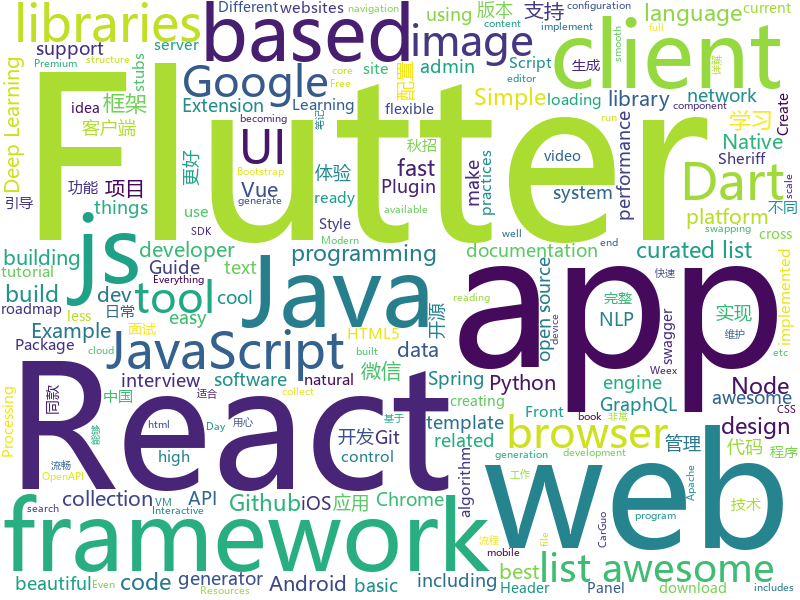

# 2018-08-14
See what the GitHub community is most excited about today.

## python
* [Deep-Learning-World](https://github.com/astorfi/Deep-Learning-World)(**305 stars today**): 📡Organized Resources for Deep Learning Researchers and Developers
* [Interview_Notes-Chinese](https://github.com/imhuay/Interview_Notes-Chinese)(**235 stars today**): 2018/2019/校招/春招/秋招/自然语言处理(NLP)/深度学习(Deep Learning)/机器学习(Machine Learning)/C/C++/Python/面试笔记
* [trackerjacker](https://github.com/calebmadrigal/trackerjacker)(**203 stars today**): Like nmap for mapping wifi networks you're not connected to, plus device tracking
* [btlejack](https://github.com/virtualabs/btlejack)(**158 stars today**): Bluetooth Low Energy Swiss-army knife
* [system-design-primer](https://github.com/donnemartin/system-design-primer)(**152 stars today**): Learn how to design large-scale systems. Prep for the system design interview. Includes Anki flashcards.
* [social_mapper](https://github.com/SpiderLabs/social_mapper)(**129 stars today**): A Social Media Enumeration & Correlation Tool by Jacob Wilkin(Greenwolf)
* [models](https://github.com/tensorflow/models)(**48 stars today**): Models and examples built with TensorFlow
* [autokeras](https://github.com/jhfjhfj1/autokeras)(**69 stars today**): accessible AutoML for deep learning.
* [chinese-poetry](https://github.com/chinese-poetry/chinese-poetry)(**62 stars today**): 最全中华古诗词数据库, 唐宋两朝近一万四千古诗人, 接近5.5万首唐诗加26万宋诗. 两宋时期1564位词人，21050首词。
* [cheat.sh](https://github.com/chubin/cheat.sh)(**56 stars today**): the only cheat sheet you need
* [SMBetray](https://github.com/quickbreach/SMBetray)(**55 stars today**): SMB MiTM tool with a focus on attacking clients through file content swapping, lnk swapping, as well as compromising any data passed over the wire in cleartext.
* [charmpy](https://github.com/UIUC-PPL/charmpy)(**55 stars today**): Parallel Programming with Python
* [kefir](https://github.com/yogurt-cultures/kefir)(**53 stars today**): Kefir is a natural language processing kit for Turkic languages
* [densenet-sdr](https://github.com/noahfl/densenet-sdr)(**50 stars today**): repo that holds code for improving on dropout using Stochastic Delta Rule
* [sclack](https://github.com/haskellcamargo/sclack)(**49 stars today**): The best CLI client for Slack, because everything is terrible!
* [google-images-download](https://github.com/hardikvasa/google-images-download)(**45 stars today**): Python Script to download hundreds of images from 'Google Images'. It is a ready-to-run code!
* [awesome-python](https://github.com/vinta/awesome-python)(**41 stars today**): A curated list of awesome Python frameworks, libraries, software and resources
* [dancenet](https://github.com/jsn5/dancenet)(**44 stars today**): DanceNet -💃💃Dance generator using Autoencoder, LSTM and Mixture Density Network. (Keras)
* [xiblint](https://github.com/lyft/xiblint)(**44 stars today**): A tool for linting storyboard and xib files
* [glances](https://github.com/nicolargo/glances)(**41 stars today**): Glances an Eye on your system. A top/htop alternative.
* [public-apis](https://github.com/toddmotto/public-apis)(**38 stars today**): A collective list of public JSON APIs for use in web development.
* [Deep-Learning-Papers-Reading-Roadmap](https://github.com/floodsung/Deep-Learning-Papers-Reading-Roadmap)(**35 stars today**): Deep Learning papers reading roadmap for anyone who are eager to learn this amazing tech!
* [cpython](https://github.com/python/cpython)(**31 stars today**): The Python programming language
* [keras](https://github.com/keras-team/keras)(**31 stars today**): Deep Learning for humans
* [youtube-dl](https://github.com/rg3/youtube-dl)(**36 stars today**): Command-line program to download videos from YouTube.com and other video sites

## java
* [Java-Interview](https://github.com/crossoverJie/Java-Interview)(**187 stars today**): 👨‍🎓Java related : basic, concurrent, algorithm
* [BigImageViewer](https://github.com/Piasy/BigImageViewer)(**167 stars today**): Big image viewer supporting pan and zoom, with very little memory usage and full featured image loading choices. Powered by Subsampling Scale Image View, Fresco, Glide, and Picasso. Even with gif and webp support!🍻
* [Java-Guide](https://github.com/Snailclimb/Java-Guide)(**69 stars today**): 📖Java面试通关手册（Java学习指南）Java Interview Customs Manual (Java Study Guide)
* [java-design-patterns](https://github.com/iluwatar/java-design-patterns)(**58 stars today**): Design patterns implemented in Java
* [incubator-dubbo](https://github.com/apache/incubator-dubbo)(**41 stars today**): Apache Dubbo (incubating) is a high-performance, java based, open source RPC framework.
* [Sentinel](https://github.com/alibaba/Sentinel)(**60 stars today**): A lightweight flow-control library providing high-available protection and monitoring (高可用防护的流量管理框架)
* [wj-todo-wanandroid](https://github.com/wjwang0914/wj-todo-wanandroid)(**59 stars today**): 用心打造一款极致体验的TODO开源客户端，数据接口来自鸿神的玩Android，不放过每一个细节，用心写代码
* [proxyee-down](https://github.com/proxyee-down-org/proxyee-down)(**52 stars today**): http下载工具，基于http代理，支持多连接分块下载
* [tutorials](https://github.com/eugenp/tutorials)(**31 stars today**): The "REST With Spring" Course:
* [spring-boot](https://github.com/spring-projects/spring-boot)(**43 stars today**): Spring Boot
* [elasticsearch](https://github.com/elastic/elasticsearch)(**39 stars today**): Open Source, Distributed, RESTful Search Engine
* [AndroidUtilCode](https://github.com/Blankj/AndroidUtilCode)(**39 stars today**): 🔥Android developers should collect the following utils(updating).
* [interviews](https://github.com/kdn251/interviews)(**35 stars today**): Everything you need to know to get the job.
* [weixin-java-tools](https://github.com/Wechat-Group/weixin-java-tools)(**33 stars today**): 全能微信Java开发工具包，支持包括微信支付、开放平台、小程序、企业号和公众号等的开发
* [ZXingLite](https://github.com/jenly1314/ZXingLite)(**33 stars today**): ZXing的精简版，优化扫码和生成二维码/条形码功能，让集成更简单。
* [spring-framework](https://github.com/spring-projects/spring-framework)(**27 stars today**): Spring Framework
* [paascloud-master](https://github.com/paascloud/paascloud-master)(**27 stars today**): spring cloud + vue 全家桶实战，模拟商城，完整的购物流程、后端运营平台，可以实现快速搭建企业级微服务项目
* [apollo](https://github.com/ctripcorp/apollo)(**27 stars today**): Apollo（阿波罗）是携程框架部门研发的分布式配置中心，能够集中化管理应用不同环境、不同集群的配置，配置修改后能够实时推送到应用端，并且具备规范的权限、流程治理等特性，适用于微服务配置管理场景。
* [RxJava](https://github.com/ReactiveX/RxJava)(**27 stars today**): RxJava – Reactive Extensions for the JVM – a library for composing asynchronous and event-based programs using observable sequences for the Java VM.
* [guava](https://github.com/google/guava)(**28 stars today**): Google core libraries for Java
* [rocketmq](https://github.com/apache/rocketmq)(**22 stars today**): Mirror of Apache RocketMQ
* [ImageWatcher](https://github.com/iielse/ImageWatcher)(**25 stars today**): 高仿微信可拖拽返回
* [glide](https://github.com/bumptech/glide)(**25 stars today**): An image loading and caching library for Android focused on smooth scrolling
* [NewbieGuide](https://github.com/huburt-Hu/NewbieGuide)(**21 stars today**): Android 快速实现新手引导层的库，通过简洁链式调用，一行代码实现引导层的显示
* [kafka](https://github.com/apache/kafka)(**17 stars today**): Mirror of Apache Kafka

## unknown
* [100-Days-Of-ML-Code](https://github.com/Avik-Jain/100-Days-Of-ML-Code)(**345 stars today**): 100 Days of ML Coding
* [open-source-ideas](https://github.com/open-source-ideas/open-source-ideas)(**292 stars today**): 💡Ever had a cool idea to an Open Source project but didn't have the time to implement yourself? Let someone else give it a try!
* [free-programming-books](https://github.com/EbookFoundation/free-programming-books)(**177 stars today**): 📚Freely available programming books
* [Interview-Notebook](https://github.com/CyC2018/Interview-Notebook)(**141 stars today**): 💡准备秋招学习笔记
* [You-Dont-Know-JS](https://github.com/getify/You-Dont-Know-JS)(**137 stars today**): A book series on JavaScript. @YDKJS on twitter.
* [Ansible-VIM-IDE](https://github.com/Hello-Linux/Ansible-VIM-IDE)(**111 stars today**): A beautiful VIM-IDE based on Ansible
* [developer-roadmap](https://github.com/kamranahmedse/developer-roadmap)(**77 stars today**): Roadmap to becoming a web developer in 2018
* [awesome](https://github.com/sindresorhus/awesome)(**72 stars today**): 😎Curated list of awesome lists
* [nodebestpractices](https://github.com/i0natan/nodebestpractices)(**71 stars today**): The largest Node.JS best practices list (August 2018)
* [gitignore](https://github.com/github/gitignore)(**52 stars today**): A collection of useful .gitignore templates
* [programmer-job-blacklist](https://github.com/shengxinjing/programmer-job-blacklist)(**67 stars today**): 🙈程序员找工作黑名单，换工作和当技术合伙人需谨慎啊
* [Front-End-Performance-Checklist](https://github.com/thedaviddias/Front-End-Performance-Checklist)(**58 stars today**): 🎮The only Front-End Performance Checklist that runs faster than the others
* [InterviewMap](https://github.com/InterviewMap/InterviewMap)(**48 stars today**): Build the best interview map. The current content includes JS, network, browser related, performance optimization, security, framework, Git, data structure, algorithm, etc.
* [awesome-vue](https://github.com/vuejs/awesome-vue)(**47 stars today**): 🎉A curated list of awesome things related to Vue.js
* [build-your-own-x](https://github.com/danistefanovic/build-your-own-x)(**38 stars today**): 🤓Build your own (insert technology here)
* [react-developer-roadmap](https://github.com/adam-golab/react-developer-roadmap)(**35 stars today**): Roadmap to becoming a React developer in 2018
* [iCSS](https://github.com/chokcoco/iCSS)(**36 stars today**): 谈谈一些有趣的 CSS 话题
* [awesome-flutter](https://github.com/Solido/awesome-flutter)(**29 stars today**): An awesome list that curates the best Flutter libraries, tools, tutorials, articles and more.
* [awesome-react](https://github.com/enaqx/awesome-react)(**25 stars today**): A collection of awesome things regarding React ecosystem.
* [chinese-independent-developer](https://github.com/1c7/chinese-independent-developer)(**24 stars today**): 👩🏿‍💻👨🏾‍💻👩🏼‍💻👨🏽‍💻👩🏻‍💻中国独立开发者项目列表 -- 分享大家都在做什么
* [awesome-cpp](https://github.com/fffaraz/awesome-cpp)(**23 stars today**): A curated list of awesome C++ (or C) frameworks, libraries, resources, and shiny things. Inspired by awesome-... stuff.
* [github-cheat-sheet](https://github.com/tiimgreen/github-cheat-sheet)(**23 stars today**): A list of cool features of Git and GitHub.
* [kubernetes-the-hard-way](https://github.com/kelseyhightower/kubernetes-the-hard-way)(**20 stars today**): Bootstrap Kubernetes the hard way on Google Cloud Platform. No scripts.
* [awesome-java](https://github.com/akullpp/awesome-java)(**21 stars today**): A curated list of awesome frameworks, libraries and software for the Java programming language.
* [rockstar](https://github.com/dylanbeattie/rockstar)(**20 stars today**): The Rockstar programming language specification

## javascript
* [dumper.js](https://github.com/zeeshanu/dumper.js)(**318 stars today**): A better and pretty variable inspector for your Node.js applications
* [graphqurl](https://github.com/hasura/graphqurl)(**180 stars today**): curl for GraphQL with autocomplete, subscriptions and GraphiQL. Also a dead-simple universal javascript GraphQL client.
* [javascript-algorithms](https://github.com/trekhleb/javascript-algorithms)(**137 stars today**): Algorithms and data structures implemented in JavaScript with explanations and links to further readings
* [vue](https://github.com/vuejs/vue)(**131 stars today**): 🖖A progressive, incrementally-adoptable JavaScript framework for building UI on the web.
* [got](https://github.com/sindresorhus/got)(**111 stars today**): Simplified HTTP requests
* [react](https://github.com/facebook/react)(**89 stars today**): A declarative, efficient, and flexible JavaScript library for building user interfaces.
* [vue-cli](https://github.com/vuejs/vue-cli)(**93 stars today**): 🛠️Standard Tooling for Vue.js Development
* [SuperSlide.js](https://github.com/osrec/SuperSlide.js)(**82 stars today**): A flexible, smooth, GPU accelerated sliding menu for your next PWA
* [axios](https://github.com/axios/axios)(**68 stars today**): Promise based HTTP client for the browser and node.js
* [ember.js](https://github.com/emberjs/ember.js)(**66 stars today**): Ember.js - A JavaScript framework for creating ambitious web applications
* [local-sheriff](https://github.com/cliqz-oss/local-sheriff)(**66 stars today**): Think of Local sheriff as a recon tool in your browser (WebExtension). While you normally browse the internet, Local Sheriff works in the background to empower you in identifying what data points (PII) are being shared / leaked to which all third-parties.
* [create-react-app](https://github.com/facebook/create-react-app)(**54 stars today**): Create React apps with no build configuration.
* [check-links](https://github.com/transitive-bullshit/check-links)(**65 stars today**): Robustly checks an array of URLs for liveness.
* [monaco-editor](https://github.com/Microsoft/monaco-editor)(**60 stars today**): A browser based code editor
* [react-navigation-collapsible](https://github.com/benevbright/react-navigation-collapsible)(**61 stars today**): React Navigation Extension for Collapsible Header. Make your header of react-navigation collapsible.
* [gatsby](https://github.com/gatsbyjs/gatsby)(**52 stars today**): ⚛️📄🚀Blazing fast site generator for React
* [puppeteer](https://github.com/GoogleChrome/puppeteer)(**55 stars today**): Headless Chrome Node API
* [javascript](https://github.com/airbnb/javascript)(**51 stars today**): JavaScript Style Guide
* [apexcharts.js](https://github.com/apexcharts/apexcharts.js)(**56 stars today**): 📊Interactive and Modern SVG Charts
* [clipmir-desktop](https://github.com/tiagovtristao/clipmir-desktop)(**54 stars today**): A cross platform Electron app for mirroring the clipboard between all synced devices in the same network
* [react-native](https://github.com/facebook/react-native)(**47 stars today**): A framework for building native apps with React.
* [material-ui](https://github.com/mui-org/material-ui)(**47 stars today**): React components that implement Google's Material Design.
* [Memex](https://github.com/WorldBrain/Memex)(**50 stars today**): Browser Extension to full-text search your browsing history & bookmarks.
* [storybook](https://github.com/storybooks/storybook)(**48 stars today**): Interactive UI component dev & test: React, React Native, Vue, Angular
* [taro](https://github.com/NervJS/taro)(**45 stars today**): 多端统一开发框架，支持用 React 的开发方式编写一次代码，生成能运行在微信小程序、H5、React Native 等的应用。

## html
* [TinyEditor](https://github.com/umpox/TinyEditor)(**381 stars today**): A functional HTML/CSS/JS editor in less than 400 bytes
* [Publii](https://github.com/GetPublii/Publii)(**125 stars today**): Publii is a desktop-based CMS for Windows and Mac that makes creating static websites fast and hassle-free, even for beginners.
* [styleguide](https://github.com/google/styleguide)(**23 stars today**): Style guides for Google-originated open-source projects
* [AdminLTE](https://github.com/almasaeed2010/AdminLTE)(**16 stars today**): AdminLTE - Free Premium Admin control Panel Theme Based On Bootstrap 3.x
* [NLP-progress](https://github.com/sebastianruder/NLP-progress)(**18 stars today**): Repository to track the progress in Natural Language Processing (NLP), including the datasets and the current state-of-the-art for the most common NLP tasks.
* [JavaScript30](https://github.com/wesbos/JavaScript30)(**13 stars today**): 30 Day Vanilla JS Challenge
* [WebFundamentals](https://github.com/google/WebFundamentals)(**15 stars today**): Best practices for modern web development
* [EIPs](https://github.com/ethereum/EIPs)(**14 stars today**): The Ethereum Improvement Proposal repository
* [Iosevka](https://github.com/be5invis/Iosevka)(**13 stars today**): Slender typeface for code, from code.
* [readability](https://github.com/mozilla/readability)(**13 stars today**): A standalone version of the readability lib
* [awesome-mac](https://github.com/jaywcjlove/awesome-mac)(**12 stars today**):  Now we have become very big, Different from the original idea. Collect premium software in various categories.
* [portainer](https://github.com/portainer/portainer)(**11 stars today**): Simple management UI for Docker
* [navicat-keygen](https://github.com/DoubleLabyrinth/navicat-keygen)(**10 stars today**): A keygen for Navicat Premium
* [Spoon-Knife](https://github.com/octocat/Spoon-Knife)(****): This repo is for demonstration purposes only.
* [patchwork](https://github.com/jlord/patchwork)(****): All the Git-it Workshop completers!
* [swagger-codegen](https://github.com/swagger-api/swagger-codegen)(**10 stars today**): swagger-codegen contains a template-driven engine to generate documentation, API clients and server stubs in different languages by parsing your OpenAPI / Swagger definition.
* [Adminator-admin-dashboard](https://github.com/puikinsh/Adminator-admin-dashboard)(**7 stars today**): Adminator is a easy to use and well design admin dashboard template for web apps, websites, services and more
* [fastText](https://github.com/facebookresearch/fastText)(**8 stars today**): Library for fast text representation and classification.
* [ng-alain](https://github.com/cipchk/ng-alain)(**8 stars today**): ng-zorro-antd admin panel front-end framework
* [react-from-zero](https://github.com/kay-is/react-from-zero)(**9 stars today**): A simple (99% ES2015 less) tutorial for React
* [laravel-report-generator](https://github.com/Jimmy-JS/laravel-report-generator)(**9 stars today**): Rapidly Generate Simple Pdf, CSV, & Excel Report Package on Laravel
* [openapi-generator](https://github.com/OpenAPITools/openapi-generator)(**8 stars today**): OpenAPI Generator allows generation of API client libraries (SDK generation), server stubs, documentation and configuration automatically given an OpenAPI Spec (v2, v3)
* [gopl-zh](https://github.com/golang-china/gopl-zh)(**8 stars today**): 📚Go语言圣经中文版
* [swiftdoc.org](https://github.com/SwiftDocOrg/swiftdoc.org)(**8 stars today**): Auto-generated documentation for Swift. Command-click no more.
* [speedtest](https://github.com/adolfintel/speedtest)(**7 stars today**): Self-hosted HTML5 Speedtest. Easy setup, examples, configurable, responsive and mobile friendly. Supports PHP, Node, and more.

## dart
* [flutter](https://github.com/flutter/flutter)(**84 stars today**): Flutter makes it easy and fast to build beautiful mobile apps.
* [GSYGithubAppFlutter](https://github.com/CarGuo/GSYGithubAppFlutter)(**47 stars today**): 超完整的Flutter项目，功能丰富，适合学习和日常使用。GSYGithubApp系列的优势：我们目前已经拥有Flutter、Weex、ReactNative三个版本。 功能齐全，项目框架内技术涉及面广，完成度高，持续维护，配套文章，适合全面学习，跨框架对比参考。跨平台的开源Github客户端App，更好的体验，更丰富的功能，旨在更好的日常管理和维护个人Github，提供更好更方便的驾车体验～～Σ(￣。￣ﾉ)ﾉ。同款Weex版本 ： https://github.com/CarGuo/GSYGithubAppWeex 、同款React Native版本 ： https://github.com/CarGuo/GSYGithubApp
* [FlutterScreens](https://github.com/samarthagarwal/FlutterScreens)(**26 stars today**): A collection of Screens with attractive UIs built with Flutter ready to be used in your applications.
* [dio](https://github.com/flutterchina/dio)(**16 stars today**): A powerful Http client for Dart, which supports Interceptors, FormData, Request Cancellation, File Downloading, Timeout etc.
* [flutter_study](https://github.com/luhenchang/flutter_study)(**13 stars today**): 三天学会Flutter
* [sdk](https://github.com/dart-lang/sdk)(**9 stars today**): The Dart SDK, including the VM, dart2js, core libraries, and more.
* [plugins](https://github.com/flutter/plugins)(**6 stars today**): Plugins for Flutter, including FlutterFire, maintained by the Flutter team
* [Animated-Text-Kit](https://github.com/aagarwal1012/Animated-Text-Kit)(**6 stars today**): 🔔A flutter package to create cool and beautiful text animations.
* [flutter_slidable](https://github.com/letsar/flutter_slidable)(**6 stars today**): A Flutter implementation of slidable list item with directional slide actions.
* [graphql-flutter](https://github.com/zino-app/graphql-flutter)(****): A GraphQL client for Flutter
* [built_value.dart](https://github.com/google/built_value.dart)(****): Immutable value types, enum classes, and serialization.
* [FlutterHtmlView](https://github.com/PonnamKarthik/FlutterHtmlView)(****): Flutter Plugin to render html as a Widget
* [flutter-geolocator](https://github.com/BaseflowIT/flutter-geolocator)(****): Android and iOS Geolocation plugin for Flutter
* [chromedeveditor](https://github.com/googlearchive/chromedeveditor)(****): Chrome Dev Editor is a developer tool for building apps on the Chrome platform - Chrome Apps and Web Apps, in JavaScript or Dart. (NO LONGER IN ACTIVE DEVELOPMENT)
* [flutter-osc](https://github.com/yubo725/flutter-osc)(****): 基于Google Flutter的开源中国客户端，支持Android和iOS。
* [inKino](https://github.com/roughike/inKino)(****): inKino - A cross platform movie and showtime browser for Finnkino cinemas, made with Flutter.
* [hauberk](https://github.com/munificent/hauberk)(****): A web-based roguelike written in Dart.
* [flutter-examples](https://github.com/nisrulz/flutter-examples)(****): [Examples] Simple basic isolated apps, for budding flutter devs.
* [flutter_architecture_samples](https://github.com/brianegan/flutter_architecture_samples)(****): TodoMVC for Flutter
* [Flutter-UI-Kit](https://github.com/iampawan/Flutter-UI-Kit)(****): Flutter app for collection of UI in a UIKit
* [angular](https://github.com/dart-lang/angular)(****): Fast and productive web framework provided by Dart
* [FlutterExampleApps](https://github.com/iampawan/FlutterExampleApps)(****): [Example APPS] Basic Flutter apps, for flutter devs.
* [StageXL](https://github.com/bp74/StageXL)(****): A fast and universal 2D rendering engine for HTML5 and Dart.
* [Flutter-learning](https://github.com/AweiLoveAndroid/Flutter-learning)(****): 🔥👍🌟⭐️⭐️⭐️Flutter从配置安装到填坑指南详解，Flutter相关Demo解读，项目实例，Dart语法详解
* [zhihu-flutter](https://github.com/HackSoul/zhihu-flutter)(****): Flutter 高仿知乎 UI，非常漂亮，也非常流畅，flutter build apk 或 flutter build ios 之后更流畅

## WordCloud

