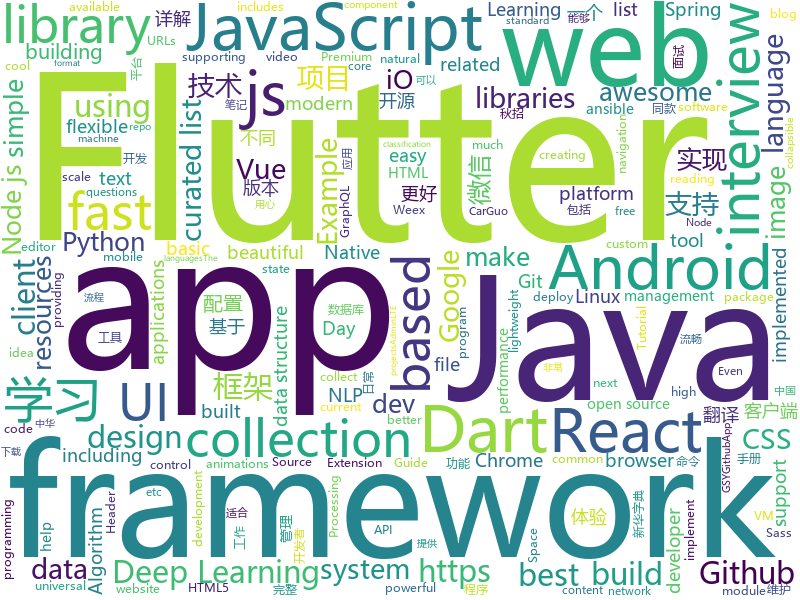

# 2018-08-15
See what the GitHub community is most excited about today.

## python
* [Deep-Learning-World](https://github.com/astorfi/Deep-Learning-World)(**800 stars today**): 📡Organized Resources for Deep Learning Researchers and Developers
* [trackerjacker](https://github.com/calebmadrigal/trackerjacker)(**639 stars today**): Like nmap for mapping wifi networks you're not connected to, plus device tracking
* [Interview_Notes-Chinese](https://github.com/imhuay/Interview_Notes-Chinese)(**371 stars today**): 2018/2019/校招/春招/秋招/自然语言处理(NLP)/深度学习(Deep Learning)/机器学习(Machine Learning)/C/C++/Python/面试笔记
* [social_mapper](https://github.com/SpiderLabs/social_mapper)(**160 stars today**): A Social Media Enumeration & Correlation Tool by Jacob Wilkin(Greenwolf)
* [chinese-poetry](https://github.com/chinese-poetry/chinese-poetry)(**149 stars today**): 最全中华古诗词数据库, 唐宋两朝近一万四千古诗人, 接近5.5万首唐诗加26万宋诗. 两宋时期1564位词人，21050首词。
* [btlejack](https://github.com/virtualabs/btlejack)(**155 stars today**): Bluetooth Low Energy Swiss-army knife
* [system-design-primer](https://github.com/donnemartin/system-design-primer)(**134 stars today**): Learn how to design large-scale systems. Prep for the system design interview. Includes Anki flashcards.
* [chinese-xinhua](https://github.com/pwxcoo/chinese-xinhua)(**88 stars today**): 中华新华字典数据库。包括歇后语，成语，词语，汉字。提供新华字典API。
* [models](https://github.com/tensorflow/models)(**69 stars today**): Models and examples built with TensorFlow
* [awesome-python](https://github.com/vinta/awesome-python)(**59 stars today**): A curated list of awesome Python frameworks, libraries, software and resources
* [autokeras](https://github.com/jhfjhfj1/autokeras)(**50 stars today**): accessible AutoML for deep learning.
* [keras](https://github.com/keras-team/keras)(**43 stars today**): Deep Learning for humans
* [Deep-Learning-Papers-Reading-Roadmap](https://github.com/floodsung/Deep-Learning-Papers-Reading-Roadmap)(**46 stars today**): Deep Learning papers reading roadmap for anyone who are eager to learn this amazing tech!
* [kefir](https://github.com/yogurt-cultures/kefir)(**48 stars today**): Kefir is a natural language processing kit for Turkic languages
* [sclack](https://github.com/haskellcamargo/sclack)(**47 stars today**): The best CLI client for Slack, because everything is terrible!
* [PaperTTY](https://github.com/joukos/PaperTTY)(**42 stars today**): PaperTTY - Python module to render a TTY on e-ink
* [densenet-sdr](https://github.com/noahfl/densenet-sdr)(**38 stars today**): repo that holds code for improving on dropout using Stochastic Delta Rule
* [youtube-dl](https://github.com/rg3/youtube-dl)(**35 stars today**): Command-line program to download videos from YouTube.com and other video sites
* [cheat.sh](https://github.com/chubin/cheat.sh)(**38 stars today**): the only cheat sheet you need
* [django](https://github.com/django/django)(**25 stars today**): The Web framework for perfectionists with deadlines.
* [meshroom](https://github.com/alicevision/meshroom)(**33 stars today**): 3D Reconstruction Software
* [public-apis](https://github.com/toddmotto/public-apis)(**29 stars today**): A collective list of public JSON APIs for use in web development.
* [Photon](https://github.com/s0md3v/Photon)(**32 stars today**): Incredibly fast crawler which extracts urls, emails, files, website accounts and much more.
* [ansible](https://github.com/ansible/ansible)(**25 stars today**): Ansible is a radically simple IT automation platform that makes your applications and systems easier to deploy. Avoid writing scripts or custom code to deploy and update your applications — automate in a language that approaches plain English, using SSH, with no agents to install on remote systems. https://docs.ansible.com/ansible/
* [pandas](https://github.com/pandas-dev/pandas)(**19 stars today**): Flexible and powerful data analysis / manipulation library for Python, providing labeled data structures similar to R data.frame objects, statistical functions, and much more

## java
* [Java-Interview](https://github.com/crossoverJie/Java-Interview)(**185 stars today**): 👨‍🎓Java related : basic, concurrent, algorithm
* [BigImageViewer](https://github.com/Piasy/BigImageViewer)(**139 stars today**): Big image viewer supporting pan and zoom, with very little memory usage and full featured image loading choices. Powered by Subsampling Scale Image View, Fresco, Glide, and Picasso. Even with gif and webp support!🍻
* [ZXingLite](https://github.com/jenly1314/ZXingLite)(**67 stars today**): ZXing的精简版，优化扫码和生成二维码/条形码功能，让集成更简单。
* [proxyee-down](https://github.com/proxyee-down-org/proxyee-down)(**61 stars today**): http下载工具，基于http代理，支持多连接分块下载
* [java-design-patterns](https://github.com/iluwatar/java-design-patterns)(**53 stars today**): Design patterns implemented in Java
* [Java-Guide](https://github.com/Snailclimb/Java-Guide)(**49 stars today**): 📖Java面试通关手册（Java学习指南）Java Interview Customs Manual (Java Study Guide)
* [spring-boot](https://github.com/spring-projects/spring-boot)(**38 stars today**): Spring Boot
* [tutorials](https://github.com/eugenp/tutorials)(**30 stars today**): The "REST With Spring" Course:
* [weixin-java-tools](https://github.com/Wechat-Group/weixin-java-tools)(**45 stars today**): 全能微信Java开发工具包，支持包括微信支付、开放平台、小程序、企业号和公众号等的开发
* [incubator-dubbo](https://github.com/apache/incubator-dubbo)(**30 stars today**): Apache Dubbo (incubating) is a high-performance, java based, open source RPC framework.
* [spring-framework](https://github.com/spring-projects/spring-framework)(**34 stars today**): Spring Framework
* [Sentinel](https://github.com/alibaba/Sentinel)(**37 stars today**): A lightweight flow-control library providing high-available protection and monitoring (高可用防护的流量管理框架)
* [AndroidUtilCode](https://github.com/Blankj/AndroidUtilCode)(**36 stars today**): 🔥Android developers should collect the following utils(updating).
* [guava](https://github.com/google/guava)(**36 stars today**): Google core libraries for Java
* [interviews](https://github.com/kdn251/interviews)(**37 stars today**): Everything you need to know to get the job.
* [ARouter](https://github.com/alibaba/ARouter)(**36 stars today**): 💪A framework for assisting in the renovation of Android componentization
* [elasticsearch](https://github.com/elastic/elasticsearch)(**35 stars today**): Open Source, Distributed, RESTful Search Engine
* [paascloud-master](https://github.com/paascloud/paascloud-master)(**28 stars today**): spring cloud + vue 全家桶实战，模拟商城，完整的购物流程、后端运营平台，可以实现快速搭建企业级微服务项目
* [Java](https://github.com/TheAlgorithms/Java)(**28 stars today**): All Algorithms implemented in Java
* [apollo](https://github.com/ctripcorp/apollo)(**25 stars today**): Apollo（阿波罗）是携程框架部门研发的分布式配置中心，能够集中化管理应用不同环境、不同集群的配置，配置修改后能够实时推送到应用端，并且具备规范的权限、流程治理等特性，适用于微服务配置管理场景。
* [retrofit](https://github.com/square/retrofit)(**28 stars today**): Type-safe HTTP client for Android and Java by Square, Inc.
* [EasyRouter](https://github.com/Xiasm/EasyRouter)(**24 stars today**): 如何一步步实现一个类似ARouter的Android路由框架，实现不同module的相互跳转，跟着我来实现就可以了。
* [wj-todo-wanandroid](https://github.com/wjwang0914/wj-todo-wanandroid)(**26 stars today**): 用心打造一款极致体验的TODO开源客户端，数据接口来自鸿神的玩Android，不放过每一个细节，用心写代码
* [AVdownloader-Face](https://github.com/KirieHaruna/AVdownloader-Face)(**23 stars today**): 一个基于java的av人脸识别自动下载器
* [RxJava](https://github.com/ReactiveX/RxJava)(**24 stars today**): RxJava – Reactive Extensions for the JVM – a library for composing asynchronous and event-based programs using observable sequences for the Java VM.

## unknown
* [100-Days-Of-ML-Code](https://github.com/Avik-Jain/100-Days-Of-ML-Code)(**279 stars today**): 100 Days of ML Coding
* [open-source-ideas](https://github.com/open-source-ideas/open-source-ideas)(**190 stars today**): 💡Ever had a cool idea to an Open Source project but didn't have the time to implement yourself? Let someone else give it a try!
* [Interview-Notebook](https://github.com/CyC2018/Interview-Notebook)(**139 stars today**): 💡准备秋招学习笔记
* [free-programming-books](https://github.com/EbookFoundation/free-programming-books)(**134 stars today**): 📚Freely available programming books
* [nodebestpractices](https://github.com/i0natan/nodebestpractices)(**119 stars today**): The largest Node.JS best practices list (August 2018)
* [sysadmin-interview-questions](https://github.com/trimstray/sysadmin-interview-questions)(**105 stars today**): A collection of Sysadmin Interview Questions and Answers (2018 Edition).
* [awesome](https://github.com/sindresorhus/awesome)(**91 stars today**): 😎Curated list of awesome lists
* [gitignore](https://github.com/github/gitignore)(**69 stars today**): A collection of useful .gitignore templates
* [http-state-tokens](https://github.com/mikewest/http-state-tokens)(**75 stars today**): Incrementally better HTTP state management.
* [architect-awesome](https://github.com/xingshaocheng/architect-awesome)(**65 stars today**): 后端架构师技术图谱
* [You-Dont-Know-JS](https://github.com/getify/You-Dont-Know-JS)(**61 stars today**): A book series on JavaScript. @YDKJS on twitter.
* [awesome-vue](https://github.com/vuejs/awesome-vue)(**62 stars today**): 🎉A curated list of awesome things related to Vue.js
* [InterviewMap](https://github.com/InterviewMap/InterviewMap)(**57 stars today**): Build the best interview map. The current content includes JS, network, browser related, performance optimization, security, framework, Git, data structure, algorithm, etc.
* [data-oriented-design](https://github.com/dbartolini/data-oriented-design)(**45 stars today**): A curated list of data oriented design resources.
* [programmer-job-blacklist](https://github.com/shengxinjing/programmer-job-blacklist)(**43 stars today**): 🙈程序员找工作黑名单，换工作和当技术合伙人需谨慎啊
* [gold-miner](https://github.com/xitu/gold-miner)(**40 stars today**): 🥇掘金翻译计划，可能是世界最大最好的英译中技术社区，最懂读者和译者的翻译平台：
* [space-grotesk](https://github.com/floriankarsten/space-grotesk)(**41 stars today**): Space Grotesk: Sans-serif typeface derived from Space Mono
* [Front-End-Performance-Checklist](https://github.com/thedaviddias/Front-End-Performance-Checklist)(**41 stars today**): 🎮The only Front-End Performance Checklist that runs faster than the others
* [rockstar](https://github.com/dylanbeattie/rockstar)(**28 stars today**): The Rockstar programming language specification
* [iCSS](https://github.com/chokcoco/iCSS)(**27 stars today**): 谈谈一些有趣的 CSS 话题
* [awesome-flutter](https://github.com/Solido/awesome-flutter)(**25 stars today**): An awesome list that curates the best Flutter libraries, tools, tutorials, articles and more.
* [chinese-independent-developer](https://github.com/1c7/chinese-independent-developer)(**23 stars today**): 👩🏿‍💻👨🏾‍💻👩🏼‍💻👨🏽‍💻👩🏻‍💻中国独立开发者项目列表 -- 分享大家都在做什么
* [The-Flask-Mega-Tutorial-zh](https://github.com/luhuisicnu/The-Flask-Mega-Tutorial-zh)(**21 stars today**): 翻译自Miguel Grinberg的blog https://blog.miguelgrinberg.com 的2017年新版The Flask Mega-Tutorial教程
* [awesome-nodejs](https://github.com/sindresorhus/awesome-nodejs)(**21 stars today**): ⚡️Delightful Node.js packages and resources
* [build-your-own-x](https://github.com/danistefanovic/build-your-own-x)(**23 stars today**): 🤓Build your own (insert technology here)

## javascript
* [dayjs](https://github.com/iamkun/dayjs)(**183 stars today**): ⏰Day.js 2KB immutable date library alternative to Moment.js with the same modern API
* [dumper.js](https://github.com/zeeshanu/dumper.js)(**147 stars today**): A better and pretty variable inspector for your Node.js applications
* [react-move](https://github.com/react-tools/react-move)(**142 stars today**): React Move🌀Beautiful, data-driven animations for React
* [vue](https://github.com/vuejs/vue)(**123 stars today**): 🖖A progressive, incrementally-adoptable JavaScript framework for building UI on the web.
* [javascript-algorithms](https://github.com/trekhleb/javascript-algorithms)(**109 stars today**): Algorithms and data structures implemented in JavaScript with explanations and links to further readings
* [react](https://github.com/facebook/react)(**107 stars today**): A declarative, efficient, and flexible JavaScript library for building user interfaces.
* [vue-cli](https://github.com/vuejs/vue-cli)(**86 stars today**): 🛠️Standard Tooling for Vue.js Development
* [SuperSlide.js](https://github.com/osrec/SuperSlide.js)(**82 stars today**): A flexible, smooth, GPU accelerated sliding menu for your next PWA
* [graphqurl](https://github.com/hasura/graphqurl)(**83 stars today**): curl for GraphQL with autocomplete, subscriptions and GraphiQL. Also a dead-simple universal javascript GraphQL client.
* [ember.js](https://github.com/emberjs/ember.js)(**63 stars today**): Ember.js - A JavaScript framework for creating ambitious web applications
* [Netron](https://github.com/lutzroeder/Netron)(**63 stars today**): Visualizer for deep learning and machine learning models
* [create-react-app](https://github.com/facebook/create-react-app)(**55 stars today**): Create React apps with no build configuration.
* [30-seconds-of-interviews](https://github.com/fejes713/30-seconds-of-interviews)(**68 stars today**): A curated collection of common interview questions to help you prepare for your next interview.
* [javascript](https://github.com/airbnb/javascript)(**57 stars today**): JavaScript Style Guide
* [puppeteer](https://github.com/GoogleChrome/puppeteer)(**57 stars today**): Headless Chrome Node API
* [axios](https://github.com/axios/axios)(**57 stars today**): Promise based HTTP client for the browser and node.js
* [apexcharts.js](https://github.com/apexcharts/apexcharts.js)(**56 stars today**): 📊Interactive and Modern SVG Charts
* [storybook](https://github.com/storybooks/storybook)(**52 stars today**): Interactive UI component dev & test: React, React Native, Vue, Angular
* [unicode-style](https://github.com/ekmartin/unicode-style)(**52 stars today**): Format text using unicode characters
* [react-navigation-collapsible](https://github.com/benevbright/react-navigation-collapsible)(**50 stars today**): React Navigation Extension for Collapsible Header. Make your header of react-navigation collapsible.
* [check-links](https://github.com/transitive-bullshit/check-links)(**49 stars today**): Robustly checks an array of URLs for liveness.
* [gatsby](https://github.com/gatsbyjs/gatsby)(**43 stars today**): ⚛️📄🚀Blazing fast site generator for React
* [react-native](https://github.com/facebook/react-native)(**39 stars today**): A framework for building native apps with React.
* [templite](https://github.com/lukeed/templite)(**46 stars today**): Lightweight templating in 150 bytes
* [material-ui](https://github.com/mui-org/material-ui)(**37 stars today**): React components that implement Google's Material Design.

## html
* [TinyEditor](https://github.com/umpox/TinyEditor)(**286 stars today**): A functional HTML/CSS/JS editor in less than 400 bytes
* [styleguide](https://github.com/google/styleguide)(**28 stars today**): Style guides for Google-originated open-source projects
* [AdminLTE](https://github.com/almasaeed2010/AdminLTE)(**25 stars today**): AdminLTE - Free Premium Admin control Panel Theme Based On Bootstrap 3.x
* [awesome-mac](https://github.com/jaywcjlove/awesome-mac)(**28 stars today**):  Now we have become very big, Different from the original idea. Collect premium software in various categories.
* [polar-bookshelf](https://github.com/burtonator/polar-bookshelf)(**28 stars today**): A PDF, web content, and eBook manager supporting incremental reading.
* [fastText](https://github.com/facebookresearch/fastText)(**18 stars today**): Library for fast text representation and classification.
* [JavaScript30](https://github.com/wesbos/JavaScript30)(**15 stars today**): 30 Day Vanilla JS Challenge
* [alphabet.file](https://github.com/samuelbetio/alphabet.file)(**15 stars today**): A-Z index folders help you organize your files..
* [OpenMetrics](https://github.com/OpenObservability/OpenMetrics)(**19 stars today**): Evolving Prometheus exposition format into a standard.
* [uikit-ecommerce-template](https://github.com/chekromul/uikit-ecommerce-template)(**17 stars today**): E-commerce template built with UIKIt
* [Spoon-Knife](https://github.com/octocat/Spoon-Knife)(****): This repo is for demonstration purposes only.
* [Publii](https://github.com/GetPublii/Publii)(**17 stars today**): Publii is a desktop-based CMS for Windows and Mac that makes creating static websites fast and hassle-free, even for beginners.
* [html](https://github.com/whatwg/html)(**15 stars today**): HTML Standard
* [archerysec](https://github.com/archerysec/archerysec)(**11 stars today**): Open Source Vulnerability Assessment and Management helps developers and pentesters to perform scans and manage vulnerabilities.
* [NLP-progress](https://github.com/sebastianruder/NLP-progress)(**11 stars today**): Repository to track the progress in Natural Language Processing (NLP), including the datasets and the current state-of-the-art for the most common NLP tasks.
* [github-markdown-css](https://github.com/sindresorhus/github-markdown-css)(**10 stars today**): The minimal amount of CSS to replicate the GitHub Markdown style
* [patchwork](https://github.com/jlord/patchwork)(****): All the Git-it Workshop completers!
* [wechat_web_devtools](https://github.com/cytle/wechat_web_devtools)(**9 stars today**): 微信开发者工具(微信小程序)linux完美支持
* [linux-command](https://github.com/jaywcjlove/linux-command)(**9 stars today**): Linux命令大全搜索工具，内容包含Linux命令手册、详解、学习、搜集。https://git.io/linux
* [polymer](https://github.com/Polymer/polymer)(**9 stars today**): Build modern apps using web components
* [crowds](https://github.com/ncase/crowds)(**9 stars today**): The Wisdom and/or Madness of the Crowds
* [portainer](https://github.com/portainer/portainer)(**9 stars today**): Simple management UI for Docker
* [gopl-zh](https://github.com/golang-china/gopl-zh)(**9 stars today**): 📚Go语言圣经中文版
* [speedtest](https://github.com/adolfintel/speedtest)(**9 stars today**): Self-hosted HTML5 Speedtest. Easy setup, examples, configurable, responsive and mobile friendly. Supports PHP, Node, and more.
* [requests-html](https://github.com/kennethreitz/requests-html)(**8 stars today**): Pythonic HTML Parsing for Humans™

## dart
* [flutter](https://github.com/flutter/flutter)(**82 stars today**): Flutter makes it easy and fast to build beautiful mobile apps.
* [GSYGithubAppFlutter](https://github.com/CarGuo/GSYGithubAppFlutter)(**26 stars today**): 超完整的Flutter项目，功能丰富，适合学习和日常使用。GSYGithubApp系列的优势：我们目前已经拥有Flutter、Weex、ReactNative三个版本。 功能齐全，项目框架内技术涉及面广，完成度高，持续维护，配套文章，适合全面学习，跨框架对比参考。跨平台的开源Github客户端App，更好的体验，更丰富的功能，旨在更好的日常管理和维护个人Github，提供更好更方便的驾车体验～～Σ(￣。￣ﾉ)ﾉ。同款Weex版本 ： https://github.com/CarGuo/GSYGithubAppWeex 、同款React Native版本 ： https://github.com/CarGuo/GSYGithubApp
* [Flutter-learning](https://github.com/AweiLoveAndroid/Flutter-learning)(**17 stars today**): 🔥👍🌟⭐️⭐️⭐️Flutter从配置安装到填坑指南详解，Flutter相关Demo解读，项目实例，Dart语法详解
* [plugins](https://github.com/flutter/plugins)(**12 stars today**): Plugins for Flutter, including FlutterFire, maintained by the Flutter team
* [FlutterScreens](https://github.com/samarthagarwal/FlutterScreens)(**9 stars today**): A collection of Screens with attractive UIs built with Flutter ready to be used in your applications.
* [sdk](https://github.com/dart-lang/sdk)(**8 stars today**): The Dart SDK, including the VM, dart2js, core libraries, and more.
* [flutter_study](https://github.com/luhenchang/flutter_study)(**5 stars today**): 三天学会Flutter
* [Animated-Text-Kit](https://github.com/aagarwal1012/Animated-Text-Kit)(**6 stars today**): 🔔A flutter package to create cool and beautiful text animations.
* [flutter_swiper](https://github.com/best-flutter/flutter_swiper)(**6 stars today**): The best swiper for flutter , with multiple layouts, infinite loop. Compatible with Android & iOS.
* [dart-scissors](https://github.com/google/dart-scissors)(****): sCiSSors: smarter resources for Angular(1,2) apps: CSS pruner & bidirectionalizer, Sass runner, image optimizer, locale permutations
* [flutter-by-example](https://github.com/mjohnsullivan/flutter-by-example)(****): A collection of simple, bare-bones Flutter apps that each demonstrate a concept
* [chromedeveditor](https://github.com/googlearchive/chromedeveditor)(****): Chrome Dev Editor is a developer tool for building apps on the Chrome platform - Chrome Apps and Web Apps, in JavaScript or Dart. (NO LONGER IN ACTIVE DEVELOPMENT)
* [flutter-osc](https://github.com/yubo725/flutter-osc)(****): 基于Google Flutter的开源中国客户端，支持Android和iOS。
* [inKino](https://github.com/roughike/inKino)(****): inKino - A cross platform movie and showtime browser for Finnkino cinemas, made with Flutter.
* [hauberk](https://github.com/munificent/hauberk)(****): A web-based roguelike written in Dart.
* [flutter-examples](https://github.com/nisrulz/flutter-examples)(****): [Examples] Simple basic isolated apps, for budding flutter devs.
* [flutter_architecture_samples](https://github.com/brianegan/flutter_architecture_samples)(****): TodoMVC for Flutter
* [Flutter-UI-Kit](https://github.com/iampawan/Flutter-UI-Kit)(****): Flutter app for collection of UI in a UIKit
* [angular](https://github.com/dart-lang/angular)(****): Fast and productive web framework provided by Dart
* [FlutterExampleApps](https://github.com/iampawan/FlutterExampleApps)(****): [Example APPS] Basic Flutter apps, for flutter devs.
* [StageXL](https://github.com/bp74/StageXL)(****): A fast and universal 2D rendering engine for HTML5 and Dart.
* [dio](https://github.com/flutterchina/dio)(****): A powerful Http client for Dart, which supports Interceptors, FormData, Request Cancellation, File Downloading, Timeout etc.
* [zhihu-flutter](https://github.com/HackSoul/zhihu-flutter)(****): Flutter 高仿知乎 UI，非常漂亮，也非常流畅，flutter build apk 或 flutter build ios 之后更流畅
* [dart-sass](https://github.com/sass/dart-sass)(****): A Dart implementation of Sass.
* [github-issue-mover](https://github.com/google/github-issue-mover)(****): Making it easy to migrate issues between repos.

## WordCloud

