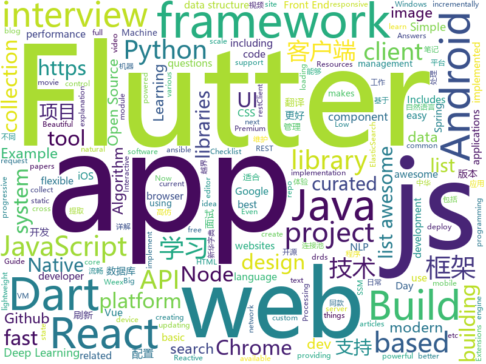

# 2018-08-16
See what the GitHub community is most excited about today.

## python
* [Deep-Learning-World](https://github.com/astorfi/Deep-Learning-World)(**462 stars today**): 📡Organized Resources for Deep Learning Researchers and Developers
* [btlejack](https://github.com/virtualabs/btlejack)(**374 stars today**): Bluetooth Low Energy Swiss-army knife
* [trackerjacker](https://github.com/calebmadrigal/trackerjacker)(**324 stars today**): Like nmap for mapping wifi networks you're not connected to, plus device tracking
* [Interview_Notes-Chinese](https://github.com/imhuay/Interview_Notes-Chinese)(**235 stars today**): 2018/2019/校招/春招/秋招/自然语言处理(NLP)/深度学习(Deep Learning)/机器学习(Machine Learning)/C/C++/Python/面试笔记
* [chinese-poetry](https://github.com/chinese-poetry/chinese-poetry)(**213 stars today**): 最全中华古诗词数据库, 唐宋两朝近一万四千古诗人, 接近5.5万首唐诗加26万宋诗. 两宋时期1564位词人，21050首词。
* [UnsupervisedMT](https://github.com/facebookresearch/UnsupervisedMT)(**112 stars today**): Phrase-Based & Neural Unsupervised Machine Translation
* [system-design-primer](https://github.com/donnemartin/system-design-primer)(**97 stars today**): Learn how to design large-scale systems. Prep for the system design interview. Includes Anki flashcards.
* [models](https://github.com/tensorflow/models)(**69 stars today**): Models and examples built with TensorFlow
* [Crypton](https://github.com/ashutosh1206/Crypton)(**78 stars today**): Library consisting of explanation and implementation of all the existing attacks on various Encryption Systems, Digital Signatures, Hashing Algorithms along with example challenges from CTFs
* [social_mapper](https://github.com/SpiderLabs/social_mapper)(**68 stars today**): A Social Media Enumeration & Correlation Tool by Jacob Wilkin(Greenwolf)
* [chinese-xinhua](https://github.com/pwxcoo/chinese-xinhua)(**62 stars today**): 中华新华字典数据库。包括歇后语，成语，词语，汉字。提供新华字典API。
* [awesome-python](https://github.com/vinta/awesome-python)(**58 stars today**): A curated list of awesome Python frameworks, libraries, software and resources
* [autokeras](https://github.com/jhfjhfj1/autokeras)(**50 stars today**): accessible AutoML for deep learning.
* [keras](https://github.com/keras-team/keras)(**43 stars today**): Deep Learning for humans
* [unyt](https://github.com/yt-project/unyt)(**46 stars today**): Handle, manipulate, and convert data with units in Python
* [public-apis](https://github.com/toddmotto/public-apis)(**43 stars today**): A collective list of public JSON APIs for use in web development.
* [pandas](https://github.com/pandas-dev/pandas)(**36 stars today**): Flexible and powerful data analysis / manipulation library for Python, providing labeled data structures similar to R data.frame objects, statistical functions, and much more
* [ansible](https://github.com/ansible/ansible)(**31 stars today**): Ansible is a radically simple IT automation platform that makes your applications and systems easier to deploy. Avoid writing scripts or custom code to deploy and update your applications — automate in a language that approaches plain English, using SSH, with no agents to install on remote systems. https://docs.ansible.com/ansible/
* [PaperTTY](https://github.com/joukos/PaperTTY)(**42 stars today**): PaperTTY - Python module to render a TTY on e-ink
* [Deep-Learning-Papers-Reading-Roadmap](https://github.com/floodsung/Deep-Learning-Papers-Reading-Roadmap)(**35 stars today**): Deep Learning papers reading roadmap for anyone who are eager to learn this amazing tech!
* [scikit-learn](https://github.com/scikit-learn/scikit-learn)(**30 stars today**): scikit-learn: machine learning in Python
* [you-get](https://github.com/soimort/you-get)(**34 stars today**): ⏬Dumb downloader that scrapes the web
* [cpython](https://github.com/python/cpython)(**29 stars today**): The Python programming language
* [kefir](https://github.com/yogurt-cultures/kefir)(**33 stars today**): Kefir is a natural language processing kit for Turkic languages
* [MachineLearning](https://github.com/apachecn/MachineLearning)(**29 stars today**): Machine Learning in Action（机器学习实战-笔记）

## java
* [Java-Interview](https://github.com/crossoverJie/Java-Interview)(**128 stars today**): 👨‍🎓Java related : basic, concurrent, algorithm
* [motif](https://github.com/uber/motif)(**109 stars today**): A simple DI API for Android / Java
* [proxyee-down](https://github.com/proxyee-down-org/proxyee-down)(**81 stars today**): http下载工具，基于http代理，支持多连接分块下载
* [BigImageViewer](https://github.com/Piasy/BigImageViewer)(**66 stars today**): Big image viewer supporting pan and zoom, with very little memory usage and full featured image loading choices. Powered by Subsampling Scale Image View, Fresco, Glide, and Picasso. Even with gif and webp support!🍻
* [Sentinel](https://github.com/alibaba/Sentinel)(**59 stars today**): A lightweight flow-control library providing high-available protection and monitoring (高可用防护的流量管理框架)
* [java-design-patterns](https://github.com/iluwatar/java-design-patterns)(**45 stars today**): Design patterns implemented in Java
* [tutorials](https://github.com/eugenp/tutorials)(**39 stars today**): The "REST With Spring" Course:
* [Java-Guide](https://github.com/Snailclimb/Java-Guide)(**47 stars today**): 📖Java面试通关手册（Java学习指南）Java Interview Customs Manual (Java Study Guide)
* [incubator-dubbo](https://github.com/apache/incubator-dubbo)(**39 stars today**): Apache Dubbo (incubating) is a high-performance, java based, open source RPC framework.
* [weixin-java-tools](https://github.com/Wechat-Group/weixin-java-tools)(**39 stars today**): 全能微信Java开发工具包，支持包括微信支付、开放平台、小程序、企业号和公众号等的开发
* [Java](https://github.com/TheAlgorithms/Java)(**35 stars today**): All Algorithms implemented in Java
* [fvip](https://github.com/CrazyDudo/fvip)(**41 stars today**): 【Android版】一个可以观看国内主流视频平台所有视频的客户端（Mac、Windows、Linux） A client that can watch video of domestic(China) mainstream video platform
* [HanLP](https://github.com/hankcs/HanLP)(**35 stars today**): 自然语言处理 中文分词 词性标注 命名实体识别 依存句法分析 关键词提取 新词发现 短语提取 自动摘要 文本分类 拼音简繁
* [xfsearch](https://github.com/RAOE/xfsearch)(**37 stars today**): 搜搜影库是一款由SSM架构结合全文搜索引擎ElasticSearch的电影搜索项目.封装了低版本的restClient客户端🎖Search Image Library is a movie search project with SSM architecture combined with full-text search engine ElasticSearch. It encapsulates a low-level version of the restClient client.
* [spring-boot](https://github.com/spring-projects/spring-boot)(**27 stars today**): Spring Boot
* [elasticsearch](https://github.com/elastic/elasticsearch)(**31 stars today**): Open Source, Distributed, RESTful Search Engine
* [guava](https://github.com/google/guava)(**31 stars today**): Google core libraries for Java
* [interviews](https://github.com/kdn251/interviews)(**31 stars today**): Everything you need to know to get the job.
* [AndroidUtilCode](https://github.com/Blankj/AndroidUtilCode)(**26 stars today**): 🔥Android developers should collect the following utils(updating).
* [druid](https://github.com/alibaba/druid)(**26 stars today**): ♨️为监控而生的数据库连接池！阿里云DRDS(https://www.aliyun.com/product/drds )、阿里巴巴TDDL 连接池powered by Druid
* [apollo](https://github.com/ctripcorp/apollo)(**24 stars today**): Apollo（阿波罗）是携程框架部门研发的分布式配置中心，能够集中化管理应用不同环境、不同集群的配置，配置修改后能够实时推送到应用端，并且具备规范的权限、流程治理等特性，适用于微服务配置管理场景。
* [spring-framework](https://github.com/spring-projects/spring-framework)(**25 stars today**): Spring Framework
* [RxJava](https://github.com/ReactiveX/RxJava)(**26 stars today**): RxJava – Reactive Extensions for the JVM – a library for composing asynchronous and event-based programs using observable sequences for the Java VM.
* [SmartRefreshLayout](https://github.com/scwang90/SmartRefreshLayout)(**24 stars today**): 🔥下拉刷新、上拉加载、二级刷新、淘宝二楼、RefreshLayout、OverScroll，Android智能下拉刷新框架，支持越界回弹、越界拖动，具有极强的扩展性，集成了几十种炫酷的Header和 Footer。
* [ARouter](https://github.com/alibaba/ARouter)(**25 stars today**): 💪A framework for assisting in the renovation of Android componentization

## unknown
* [100-Days-Of-ML-Code](https://github.com/Avik-Jain/100-Days-Of-ML-Code)(**438 stars today**): 100 Days of ML Coding
* [iCSS](https://github.com/chokcoco/iCSS)(**180 stars today**): 谈谈一些有趣的 CSS 话题
* [nodebestpractices](https://github.com/i0natan/nodebestpractices)(**173 stars today**): The largest Node.JS best practices list (August 2018)
* [Interview-Notebook](https://github.com/CyC2018/Interview-Notebook)(**132 stars today**): 📚技术面试需要掌握的基础知识整理
* [sysadmin-interview-questions](https://github.com/trimstray/sysadmin-interview-questions)(**126 stars today**): A collection of Sysadmin Interview/Exam Questions and Answers (2018 Edition).
* [free-programming-books](https://github.com/EbookFoundation/free-programming-books)(**113 stars today**): 📚Freely available programming books
* [2018-BlackHat-Tools-List](https://github.com/1522402210/2018-BlackHat-Tools-List)(**93 stars today**): 2018 BlackHat Tools List
* [Awesome-Android-Interview](https://github.com/JsonChao/Awesome-Android-Interview)(**87 stars today**): 🔥A awesome android expert interview questions and answers（continuous updating ...）
* [Front-End-Performance-Checklist](https://github.com/thedaviddias/Front-End-Performance-Checklist)(**79 stars today**): 🎮The only Front-End Performance Checklist that runs faster than the others
* [open-source-ideas](https://github.com/open-source-ideas/open-source-ideas)(**78 stars today**): 💡Ever had a cool idea to an Open Source project but didn't have the time to implement yourself? Let someone else give it a try!
* [awesome](https://github.com/sindresorhus/awesome)(**73 stars today**): 😎Curated list of awesome lists
* [gitignore](https://github.com/github/gitignore)(**52 stars today**): A collection of useful .gitignore templates
* [You-Dont-Know-JS](https://github.com/getify/You-Dont-Know-JS)(**58 stars today**): A book series on JavaScript. @YDKJS on twitter.
* [awesome-vue](https://github.com/vuejs/awesome-vue)(**58 stars today**): 🎉A curated list of awesome things related to Vue.js
* [architect-awesome](https://github.com/xingshaocheng/architect-awesome)(**44 stars today**): 后端架构师技术图谱
* [http-state-tokens](https://github.com/mikewest/http-state-tokens)(**51 stars today**): Incrementally better HTTP state management.
* [InterviewMap](https://github.com/InterviewMap/InterviewMap)(**37 stars today**): Build the best interview map. The current content includes JS, network, browser related, performance optimization, security, framework, Git, data structure, algorithm, etc.
* [programmer-job-blacklist](https://github.com/shengxinjing/programmer-job-blacklist)(**35 stars today**): 🙈程序员找工作黑名单，换工作和当技术合伙人需谨慎啊
* [awesome-flutter](https://github.com/Solido/awesome-flutter)(**30 stars today**): An awesome list that curates the best Flutter libraries, tools, tutorials, articles and more.
* [large-scale-curiosity](https://github.com/openai/large-scale-curiosity)(**30 stars today**): 
* [awesome-code-review](https://github.com/joho/awesome-code-review)(**31 stars today**): An "Awesome" list of code review resources - articles, papers, tools, etc
* [awesome-react](https://github.com/enaqx/awesome-react)(**28 stars today**): A collection of awesome things regarding React ecosystem.
* [The-Flask-Mega-Tutorial-zh](https://github.com/luhuisicnu/The-Flask-Mega-Tutorial-zh)(**29 stars today**): 翻译自Miguel Grinberg的blog https://blog.miguelgrinberg.com 的2017年新版The Flask Mega-Tutorial教程
* [gold-miner](https://github.com/xitu/gold-miner)(**25 stars today**): 🥇掘金翻译计划，可能是世界最大最好的英译中技术社区，最懂读者和译者的翻译平台：
* [build-your-own-x](https://github.com/danistefanovic/build-your-own-x)(**24 stars today**): 🤓Build your own (insert technology here)

## javascript
* [react-move](https://github.com/react-tools/react-move)(**549 stars today**): React Move🌀Beautiful, data-driven animations for React
* [dayjs](https://github.com/iamkun/dayjs)(**251 stars today**): ⏰Day.js 2KB immutable date library alternative to Moment.js with the same modern API
* [vue](https://github.com/vuejs/vue)(**140 stars today**): 🖖A progressive, incrementally-adoptable JavaScript framework for building UI on the web.
* [Front-End-Checklist](https://github.com/thedaviddias/Front-End-Checklist)(**121 stars today**): 🗂The perfect Front-End Checklist for modern websites and meticulous developers
* [dumper.js](https://github.com/zeeshanu/dumper.js)(**100 stars today**): A better and pretty variable inspector for your Node.js applications
* [react](https://github.com/facebook/react)(**83 stars today**): A declarative, efficient, and flexible JavaScript library for building user interfaces.
* [javascript-algorithms](https://github.com/trekhleb/javascript-algorithms)(**84 stars today**): Algorithms and data structures implemented in JavaScript with explanations and links to further readings
* [ember.js](https://github.com/emberjs/ember.js)(**67 stars today**): Ember.js - A JavaScript framework for creating ambitious web applications
* [axios](https://github.com/axios/axios)(**60 stars today**): Promise based HTTP client for the browser and node.js
* [create-react-app](https://github.com/facebook/create-react-app)(**49 stars today**): Create React apps with no build configuration.
* [vue-cli](https://github.com/vuejs/vue-cli)(**55 stars today**): 🛠️Standard Tooling for Vue.js Development
* [gatsby](https://github.com/gatsbyjs/gatsby)(**52 stars today**): ⚛️📄🚀Blazing fast site generator for React
* [javascript](https://github.com/airbnb/javascript)(**51 stars today**): JavaScript Style Guide
* [puppeteer](https://github.com/GoogleChrome/puppeteer)(**52 stars today**): Headless Chrome Node API
* [SuperSlide.js](https://github.com/osrec/SuperSlide.js)(**54 stars today**): A flexible, smooth, GPU accelerated sliding menu for your next PWA
* [now-examples](https://github.com/zeit/now-examples)(**51 stars today**): Examples of Now deployments you can use
* [next.js](https://github.com/zeit/next.js)(**48 stars today**): Next.js is a lightweight framework for static and server‑rendered applications.
* [storybook](https://github.com/storybooks/storybook)(**48 stars today**): Interactive UI component dev & test: React, React Native, Vue, Angular
* [material-ui](https://github.com/mui-org/material-ui)(**43 stars today**): React components that implement Google's Material Design.
* [react-native](https://github.com/facebook/react-native)(**41 stars today**): A framework for building native apps with React.
* [wepy](https://github.com/Tencent/wepy)(**39 stars today**): 小程序组件化开发框架
* [react-loadable](https://github.com/jamiebuilds/react-loadable)(**42 stars today**): ⏳A higher order component for loading components with promises.
* [30-seconds-of-interviews](https://github.com/fejes713/30-seconds-of-interviews)(**42 stars today**): A curated collection of common interview questions to help you prepare for your next interview.
* [mdx](https://github.com/mdx-js/mdx)(**42 stars today**): JSX in Markdown for ambitious projects
* [apexcharts.js](https://github.com/apexcharts/apexcharts.js)(**42 stars today**): 📊Interactive and Modern SVG Charts

## html
* [TinyEditor](https://github.com/umpox/TinyEditor)(**103 stars today**): A functional HTML/CSS/JS editor in less than 400 bytes
* [styleguide](https://github.com/google/styleguide)(**24 stars today**): Style guides for Google-originated open-source projects
* [awesome-mac](https://github.com/jaywcjlove/awesome-mac)(**21 stars today**):  Now we have become very big, Different from the original idea. Collect premium software in various categories.
* [JavaScript30](https://github.com/wesbos/JavaScript30)(**8 stars today**): 30 Day Vanilla JS Challenge
* [AdminLTE](https://github.com/almasaeed2010/AdminLTE)(**15 stars today**): AdminLTE - Free Premium Admin control Panel Theme Based On Bootstrap 3.x
* [fastText](https://github.com/facebookresearch/fastText)(**13 stars today**): Library for fast text representation and classification.
* [portainer](https://github.com/portainer/portainer)(**14 stars today**): Simple management UI for Docker
* [Spoon-Knife](https://github.com/octocat/Spoon-Knife)(****): This repo is for demonstration purposes only.
* [NLP-progress](https://github.com/sebastianruder/NLP-progress)(**11 stars today**): Repository to track the progress in Natural Language Processing (NLP), including the datasets and the current state-of-the-art for the most common NLP tasks.
* [pure](https://github.com/pure-css/pure)(**12 stars today**): A set of small, responsive CSS modules that you can use in every web project.
* [requests-html](https://github.com/kennethreitz/requests-html)(**12 stars today**): Pythonic HTML Parsing for Humans™
* [Adminator-admin-dashboard](https://github.com/puikinsh/Adminator-admin-dashboard)(**11 stars today**): Adminator is a easy to use and well design admin dashboard template for web apps, websites, services and more
* [node-interview](https://github.com/ElemeFE/node-interview)(**10 stars today**): How to pass the Node.js interview of ElemeFE.
* [archerysec](https://github.com/archerysec/archerysec)(**9 stars today**): Open Source Vulnerability Assessment and Management helps developers and pentesters to perform scans and manage vulnerabilities.
* [gopl-zh](https://github.com/golang-china/gopl-zh)(**10 stars today**): 📚Go语言圣经中文版
* [pseudo-localization](https://github.com/tryggvigy/pseudo-localization)(**10 stars today**): Dynamic pseudo-localization in the browser
* [react-app-rewired](https://github.com/timarney/react-app-rewired)(**9 stars today**): Override create-react-app webpack configs without ejecting
* [ecma262](https://github.com/tc39/ecma262)(**9 stars today**): Status, process, and documents for ECMA262
* [now-github-starter](https://github.com/zeit/now-github-starter)(****): Starter project to demonstrate a project whose pull requests get automatically deployed
* [html](https://github.com/whatwg/html)(**9 stars today**): HTML Standard
* [mxgraph](https://github.com/jgraph/mxgraph)(**8 stars today**): mxGraph is a fully client side JavaScript diagramming library
* [foundation-sites](https://github.com/zurb/foundation-sites)(**8 stars today**): The most advanced responsive front-end framework in the world. Quickly create prototypes and production code for sites that work on any kind of device.
* [capacitor](https://github.com/ionic-team/capacitor)(**8 stars today**): Build cross-platform Native Progressive Web Apps for iOS, Android, and the web⚡️
* [Publii](https://github.com/GetPublii/Publii)(**8 stars today**): Publii is a desktop-based CMS for Windows and Mac that makes creating static websites fast and hassle-free, even for beginners.
* [polymer](https://github.com/Polymer/polymer)(**7 stars today**): Build modern apps using web components

## dart
* [flutter](https://github.com/flutter/flutter)(**83 stars today**): Flutter makes it easy and fast to build beautiful mobile apps.
* [GSYGithubAppFlutter](https://github.com/CarGuo/GSYGithubAppFlutter)(**32 stars today**): 超完整的Flutter项目，功能丰富，适合学习和日常使用。GSYGithubApp系列的优势：我们目前已经拥有Flutter、Weex、ReactNative三个版本。 功能齐全，项目框架内技术涉及面广，完成度高，持续维护，配套文章，适合全面学习，跨框架对比参考。跨平台的开源Github客户端App，更好的体验，更丰富的功能，旨在更好的日常管理和维护个人Github，提供更好更方便的驾车体验～～Σ(￣。￣ﾉ)ﾉ。同款Weex版本 ： https://github.com/CarGuo/GSYGithubAppWeex 、同款React Native版本 ： https://github.com/CarGuo/GSYGithubApp
* [plugins](https://github.com/flutter/plugins)(**18 stars today**): Plugins for Flutter, including FlutterFire, maintained by the Flutter team
* [Flutter-learning](https://github.com/AweiLoveAndroid/Flutter-learning)(**16 stars today**): 🔥👍🌟⭐️⭐️⭐️Flutter从配置安装到填坑指南详解，Flutter相关Demo解读，项目实例，Dart语法详解
* [linter](https://github.com/dart-lang/linter)(****): Linter for Dart.
* [chrome.dart](https://github.com/dart-gde/chrome.dart)(****): Provide Dart interop with chrome.* APIs for Chrome Packaged Apps
* [WanAndroid-Flutter](https://github.com/canhuah/WanAndroid-Flutter)(****): Flutter 高仿WanAndroid客户端 适合Flutter入门学习
* [mobile](https://github.com/GetBallot/mobile)(****): A mobile app for busy voters
* [chromedeveditor](https://github.com/googlearchive/chromedeveditor)(****): Chrome Dev Editor is a developer tool for building apps on the Chrome platform - Chrome Apps and Web Apps, in JavaScript or Dart. (NO LONGER IN ACTIVE DEVELOPMENT)
* [sdk](https://github.com/dart-lang/sdk)(****): The Dart SDK, including the VM, dart2js, core libraries, and more.
* [flutter-osc](https://github.com/yubo725/flutter-osc)(****): 基于Google Flutter的开源中国客户端，支持Android和iOS。
* [inKino](https://github.com/roughike/inKino)(****): inKino - A cross platform movie and showtime browser for Finnkino cinemas, made with Flutter.
* [hauberk](https://github.com/munificent/hauberk)(****): A web-based roguelike written in Dart.
* [flutter-examples](https://github.com/nisrulz/flutter-examples)(****): [Examples] Simple basic isolated apps, for budding flutter devs.
* [flutter_architecture_samples](https://github.com/brianegan/flutter_architecture_samples)(****): TodoMVC for Flutter
* [Flutter-UI-Kit](https://github.com/iampawan/Flutter-UI-Kit)(****): Flutter app for collection of UI in a UIKit
* [angular](https://github.com/dart-lang/angular)(****): Fast and productive web framework provided by Dart
* [FlutterExampleApps](https://github.com/iampawan/FlutterExampleApps)(****): [Example APPS] Basic Flutter apps, for flutter devs.
* [StageXL](https://github.com/bp74/StageXL)(****): A fast and universal 2D rendering engine for HTML5 and Dart.
* [dio](https://github.com/flutterchina/dio)(****): A powerful Http client for Dart, which supports Interceptors, FormData, Request Cancellation, File Downloading, Timeout etc.
* [zhihu-flutter](https://github.com/HackSoul/zhihu-flutter)(****): Flutter 高仿知乎 UI，非常漂亮，也非常流畅，flutter build apk 或 flutter build ios 之后更流畅
* [dart-sass](https://github.com/sass/dart-sass)(****): A Dart implementation of Sass.
* [github-issue-mover](https://github.com/google/github-issue-mover)(****): Making it easy to migrate issues between repos.
* [rxdart](https://github.com/ReactiveX/rxdart)(****): The Reactive Extensions for Dart
* [aqueduct](https://github.com/stablekernel/aqueduct)(****): Dart HTTP server framework for building REST APIs. Includes PostgreSQL ORM and OAuth2 provider.

## WordCloud

