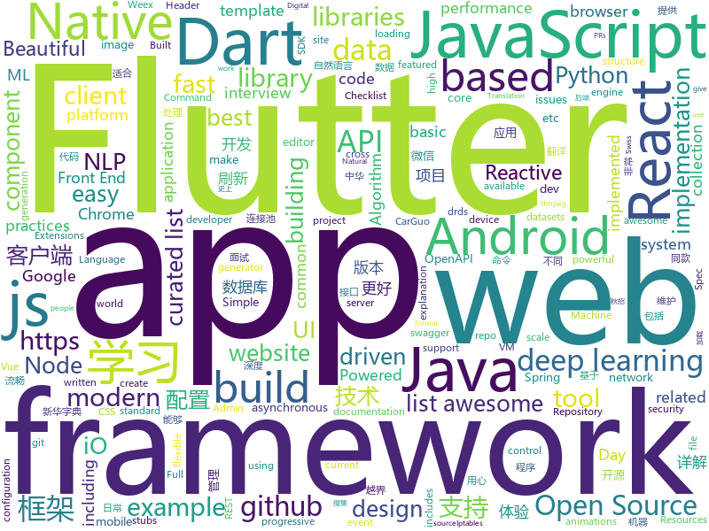

# 2018-08-17
See what the GitHub community is most excited about today.

## python
* [rescuekerala](https://github.com/IEEEKeralaSection/rescuekerala)(**155 stars today**): Website for coordinating rehabilitation of people affected in the 2018 Kerala Floods
* [UnsupervisedMT](https://github.com/facebookresearch/UnsupervisedMT)(**222 stars today**): Phrase-Based & Neural Unsupervised Machine Translation
* [Deep-Learning-World](https://github.com/astorfi/Deep-Learning-World)(**216 stars today**): 📡Organized Resources for Deep Learning Researchers and Developers
* [trackerjacker](https://github.com/calebmadrigal/trackerjacker)(**216 stars today**): Like nmap for mapping wifi networks you're not connected to, plus device tracking
* [chinese-poetry](https://github.com/chinese-poetry/chinese-poetry)(**150 stars today**): 最全中华古诗词数据库, 唐宋两朝近一万四千古诗人, 接近5.5万首唐诗加26万宋诗. 两宋时期1564位词人，21050首词。
* [system-design-primer](https://github.com/donnemartin/system-design-primer)(**117 stars today**): Learn how to design large-scale systems. Prep for the system design interview. Includes Anki flashcards.
* [redash](https://github.com/getredash/redash)(**111 stars today**): Make Your Company Data Driven. Connect to any data source, easily visualize and share your data.
* [Interview_Notes-Chinese](https://github.com/imhuay/Interview_Notes-Chinese)(**104 stars today**): 2018/2019/校招/春招/秋招/自然语言处理(NLP)/深度学习(Deep Learning)/机器学习(Machine Learning)/C/C++/Python/面试笔记
* [btlejack](https://github.com/virtualabs/btlejack)(**80 stars today**): Bluetooth Low Energy Swiss-army knife
* [Crypton](https://github.com/ashutosh1206/Crypton)(**70 stars today**): Library consisting of explanation and implementation of all the existing attacks on various Encryption Systems, Digital Signatures, Hashing Algorithms along with example challenges from CTFs
* [models](https://github.com/tensorflow/models)(**49 stars today**): Models and examples built with TensorFlow
* [autokeras](https://github.com/jhfjhfj1/autokeras)(**71 stars today**): accessible AutoML for deep learning.
* [awesome-python](https://github.com/vinta/awesome-python)(**56 stars today**): A curated list of awesome Python frameworks, libraries, software and resources
* [rescuekerala](https://github.com/biswaz/rescuekerala)(**38 stars today**): Send PRs and issues to https://github.com/IEEEKeralaSection/rescuekerala/. Recreate your issues pls
* [AiLearning](https://github.com/apachecn/AiLearning)(**44 stars today**): AiLearning: 机器学习 - MachineLearning - ML、深度学习 - DeepLearning - DL、自然语言处理 NLP
* [chinese-xinhua](https://github.com/pwxcoo/chinese-xinhua)(**41 stars today**): 中华新华字典数据库。包括歇后语，成语，词语，汉字。提供新华字典API。
* [Photon](https://github.com/s0md3v/Photon)(**44 stars today**): Incredibly fast crawler which extracts urls, emails, files, website accounts and much more.
* [tensor2tensor](https://github.com/tensorflow/tensor2tensor)(**39 stars today**): Library of deep learning models and datasets designed to make deep learning more accessible and accelerate ML research.
* [social_mapper](https://github.com/SpiderLabs/social_mapper)(**37 stars today**): A Social Media Enumeration & Correlation Tool by Jacob Wilkin(Greenwolf)
* [keras](https://github.com/keras-team/keras)(**33 stars today**): Deep Learning for humans
* [vibora](https://github.com/vibora-io/vibora)(**41 stars today**): Fast, asynchronous and elegant Python web framework.
* [django](https://github.com/django/django)(**32 stars today**): The Web framework for perfectionists with deadlines.
* [face_recognition](https://github.com/ageitgey/face_recognition)(**37 stars today**): The world's simplest facial recognition api for Python and the command line
* [kube-hunter](https://github.com/aquasecurity/kube-hunter)(**40 stars today**): Hunt for security weaknesses in Kubernetes clusters
* [termtosvg](https://github.com/nbedos/termtosvg)(**39 stars today**): Record terminal sessions as SVG animations

## java
* [JCSprout](https://github.com/crossoverJie/JCSprout)(**237 stars today**): 👨‍🎓Java related : basic, concurrent, algorithm
* [proxyee-down](https://github.com/proxyee-down-org/proxyee-down)(**68 stars today**): http下载工具，基于http代理，支持多连接分块下载
* [java-guide](https://github.com/Snailclimb/java-guide)(**54 stars today**): 📖Java Guide
* [spring-boot](https://github.com/spring-projects/spring-boot)(**52 stars today**): Spring Boot
* [motif](https://github.com/uber/motif)(**58 stars today**): A simple DI API for Android / Java
* [wj-todo-wanandroid](https://github.com/wjwang0914/wj-todo-wanandroid)(**48 stars today**): 用心打造一款极致体验的TODO开源客户端，数据接口来自鸿神的玩Android，不放过每一个细节，用心写代码
* [java-design-patterns](https://github.com/iluwatar/java-design-patterns)(**45 stars today**): Design patterns implemented in Java
* [SpringCloudLearning](https://github.com/forezp/SpringCloudLearning)(**37 stars today**): 《史上最简单的Spring Cloud教程源码》
* [Sentinel](https://github.com/alibaba/Sentinel)(**38 stars today**): A lightweight flow-control library providing high-available protection and monitoring (高可用防护的流量管理框架)
* [elasticsearch](https://github.com/elastic/elasticsearch)(**31 stars today**): Open Source, Distributed, RESTful Search Engine
* [BigImageViewer](https://github.com/Piasy/BigImageViewer)(**38 stars today**): Big image viewer supporting pan and zoom, with very little memory usage and full featured image loading choices. Powered by Subsampling Scale Image View, Fresco, Glide, and Picasso. Even with gif and webp support!🍻
* [tutorials](https://github.com/eugenp/tutorials)(**26 stars today**): The "REST With Spring" Course:
* [Java](https://github.com/TheAlgorithms/Java)(**31 stars today**): All Algorithms implemented in Java
* [interviews](https://github.com/kdn251/interviews)(**34 stars today**): Everything you need to know to get the job.
* [incubator-dubbo](https://github.com/apache/incubator-dubbo)(**29 stars today**): Apache Dubbo (incubating) is a high-performance, java based, open source RPC framework.
* [netty](https://github.com/netty/netty)(**26 stars today**): Netty project - an event-driven asynchronous network application framework
* [druid](https://github.com/alibaba/druid)(**24 stars today**): ♨️为监控而生的数据库连接池！阿里云DRDS(https://www.aliyun.com/product/drds )、阿里巴巴TDDL 连接池powered by Druid
* [apollo](https://github.com/ctripcorp/apollo)(**23 stars today**): Apollo（阿波罗）是携程框架部门研发的分布式配置中心，能够集中化管理应用不同环境、不同集群的配置，配置修改后能够实时推送到应用端，并且具备规范的权限、流程治理等特性，适用于微服务配置管理场景。
* [RxJava](https://github.com/ReactiveX/RxJava)(**26 stars today**): RxJava – Reactive Extensions for the JVM – a library for composing asynchronous and event-based programs using observable sequences for the Java VM.
* [SmartRefreshLayout](https://github.com/scwang90/SmartRefreshLayout)(**25 stars today**): 🔥下拉刷新、上拉加载、二级刷新、淘宝二楼、RefreshLayout、OverScroll，Android智能下拉刷新框架，支持越界回弹、越界拖动，具有极强的扩展性，集成了几十种炫酷的Header和 Footer。
* [guava](https://github.com/google/guava)(**24 stars today**): Google core libraries for Java
* [APIJSON](https://github.com/TommyLemon/APIJSON)(**25 stars today**): 🚀后端接口和文档自动化，前端(客户端) 定制返回JSON的数据和结构！
* [weixin-java-tools](https://github.com/Wechat-Group/weixin-java-tools)(**21 stars today**): 全能微信Java开发工具包，支持包括微信支付、开放平台、小程序、企业号和公众号等的开发
* [okhttp](https://github.com/square/okhttp)(**23 stars today**): An HTTP+HTTP/2 client for Android and Java applications.
* [spring-framework](https://github.com/spring-projects/spring-framework)(**18 stars today**): Spring Framework

## unknown
* [100-Days-Of-ML-Code](https://github.com/Avik-Jain/100-Days-Of-ML-Code)(**535 stars today**): 100 Days of ML Coding
* [Awesome-Android-Interview](https://github.com/JsonChao/Awesome-Android-Interview)(**307 stars today**): 🔥A awesome android expert interview questions and answers（continuous updating ...）
* [iCSS](https://github.com/chokcoco/iCSS)(**196 stars today**): 谈谈一些有趣的 CSS 话题
* [Interview-Notebook](https://github.com/CyC2018/Interview-Notebook)(**150 stars today**): 📚技术面试需要掌握的基础知识整理
* [nodebestpractices](https://github.com/i0natan/nodebestpractices)(**145 stars today**): The largest Node.JS best practices list (August 2018)
* [polyrnn-pp-pytorch](https://github.com/fidler-lab/polyrnn-pp-pytorch)(**102 stars today**): PyTorch training/tool code for Polygon-RNN++ (CVPR 2018)
* [developer-roadmap](https://github.com/kamranahmedse/developer-roadmap)(**95 stars today**): Roadmap to becoming a web developer in 2018
* [Front-End-Performance-Checklist](https://github.com/thedaviddias/Front-End-Performance-Checklist)(**85 stars today**): 🎮The only Front-End Performance Checklist that runs faster than the others
* [awesome](https://github.com/sindresorhus/awesome)(**83 stars today**): 😎Curated list of awesome lists
* [architect-awesome](https://github.com/xingshaocheng/architect-awesome)(**72 stars today**): 后端架构师技术图谱
* [free-programming-books](https://github.com/EbookFoundation/free-programming-books)(**72 stars today**): 📚Freely available programming books
* [You-Dont-Know-JS](https://github.com/getify/You-Dont-Know-JS)(**68 stars today**): A book series on JavaScript. @YDKJS on twitter.
* [awesome-ffmpeg](https://github.com/transitive-bullshit/awesome-ffmpeg)(**71 stars today**): 👻A curated list of awesome ffmpeg resources with a focus on JavaScript.
* [gitignore](https://github.com/github/gitignore)(**37 stars today**): A collection of useful .gitignore templates
* [open-source-ideas](https://github.com/open-source-ideas/open-source-ideas)(**56 stars today**): 💡Ever had a cool idea to an Open Source project but didn't have the time to implement yourself? Let someone else give it a try!
* [awesome-vue](https://github.com/vuejs/awesome-vue)(**50 stars today**): 🎉A curated list of awesome things related to Vue.js
* [InterviewMap](https://github.com/InterviewMap/InterviewMap)(**44 stars today**): Build the best interview map. The current content includes JS, network, browser related, performance optimization, security, framework, Git, data structure, algorithm, etc.
* [2018-BlackHat-Tools-List](https://github.com/1522402210/2018-BlackHat-Tools-List)(**41 stars today**): 2018 BlackHat Tools List
* [large-scale-curiosity](https://github.com/openai/large-scale-curiosity)(**43 stars today**): 
* [chromium](https://github.com/chromium/chromium)(**36 stars today**): The official GitHub mirror of the Chromium source
* [iptables-essentials](https://github.com/trimstray/iptables-essentials)(**38 stars today**): Iptables Essentials: Common Firewall Rules and Commands.
* [laravel-best-practices](https://github.com/alexeymezenin/laravel-best-practices)(**35 stars today**): Laravel best practices
* [build-your-own-x](https://github.com/danistefanovic/build-your-own-x)(**33 stars today**): 🤓Build your own (insert technology here)
* [awesome-flutter](https://github.com/Solido/awesome-flutter)(**31 stars today**): An awesome list that curates the best Flutter libraries, tools, tutorials, articles and more.
* [gold-miner](https://github.com/xitu/gold-miner)(**27 stars today**): 🥇掘金翻译计划，可能是世界最大最好的英译中技术社区，最懂读者和译者的翻译平台：

## javascript
* [SpaceX-API](https://github.com/r-spacex/SpaceX-API)(**516 stars today**): 🚀Open Source REST API for rocket, core, capsule, pad, and launch data
* [react-move](https://github.com/react-tools/react-move)(**358 stars today**): React Move🌀Beautiful, data-driven animations for React
* [rnset](https://github.com/suijunqiang/rnset)(**214 stars today**): rnset is a framework based on the react native & integrated a lot very good RN components to easy for verifying/using/picking in your projects
* [react-async-elements](https://github.com/palmerhq/react-async-elements)(**178 stars today**): Suspense-friendly async React elements for common situations
* [dayjs](https://github.com/iamkun/dayjs)(**147 stars today**): ⏰Day.js 2KB immutable date library alternative to Moment.js with the same modern API
* [javascript-algorithms](https://github.com/trekhleb/javascript-algorithms)(**135 stars today**): Algorithms and data structures implemented in JavaScript with explanations and links to further readings
* [vue](https://github.com/vuejs/vue)(**118 stars today**): 🖖A progressive, incrementally-adoptable JavaScript framework for building UI on the web.
* [Front-End-Checklist](https://github.com/thedaviddias/Front-End-Checklist)(**110 stars today**): 🗂The perfect Front-End Checklist for modern websites and meticulous developers
* [react](https://github.com/facebook/react)(**87 stars today**): A declarative, efficient, and flexible JavaScript library for building user interfaces.
* [puppeteer](https://github.com/GoogleChrome/puppeteer)(**83 stars today**): Headless Chrome Node API
* [ember.js](https://github.com/emberjs/ember.js)(**67 stars today**): Ember.js - A JavaScript framework for creating ambitious web applications
* [vue-cli](https://github.com/vuejs/vue-cli)(**66 stars today**): 🛠️Standard Tooling for Vue.js Development
* [create-react-app](https://github.com/facebook/create-react-app)(**60 stars today**): Create React apps with no build configuration.
* [javascript](https://github.com/airbnb/javascript)(**65 stars today**): JavaScript Style Guide
* [drawio](https://github.com/jgraph/drawio)(**59 stars today**): Source to www.draw.io
* [dumper.js](https://github.com/zeeshanu/dumper.js)(**62 stars today**): A better and pretty variable inspector for your Node.js applications
* [axios](https://github.com/axios/axios)(**54 stars today**): Promise based HTTP client for the browser and node.js
* [SuperSlide.js](https://github.com/osrec/SuperSlide.js)(**56 stars today**): A flexible, smooth, GPU accelerated sliding menu for your next PWA
* [gatsby](https://github.com/gatsbyjs/gatsby)(**49 stars today**): ⚛️📄🚀Blazing fast site generator for React
* [react-native](https://github.com/facebook/react-native)(**49 stars today**): A framework for building native apps with React.
* [taro](https://github.com/NervJS/taro)(**49 stars today**): 多端统一开发框架，支持用 React 的开发方式编写一次代码，生成能运行在微信小程序、H5、React Native 等的应用。
* [react-loadable](https://github.com/jamiebuilds/react-loadable)(**51 stars today**): ⏳A higher order component for loading components with promises.
* [UglifyJS2](https://github.com/mishoo/UglifyJS2)(**49 stars today**): JavaScript parser / mangler / compressor / beautifier toolkit
* [openpgpjs](https://github.com/openpgpjs/openpgpjs)(**48 stars today**): OpenPGP implementation for JavaScript
* [beeshell](https://github.com/meituan/beeshell)(**47 stars today**): React Native 组件库

## html
* [TinyEditor](https://github.com/umpox/TinyEditor)(**69 stars today**): A functional HTML/CSS/JS editor in less than 400 bytes
* [styleguide](https://github.com/google/styleguide)(**28 stars today**): Style guides for Google-originated open-source projects
* [fastText](https://github.com/facebookresearch/fastText)(**23 stars today**): Library for fast text representation and classification.
* [AdminLTE](https://github.com/almasaeed2010/AdminLTE)(**16 stars today**): AdminLTE - Free Premium Admin control Panel Theme Based On Bootstrap 3.x
* [Spoon-Knife](https://github.com/octocat/Spoon-Knife)(****): This repo is for demonstration purposes only.
* [portainer](https://github.com/portainer/portainer)(**18 stars today**): Simple management UI for Docker
* [pdfs](https://github.com/tpn/pdfs)(**15 stars today**): Technically-oriented PDF Collection (Papers, Specs, Decks, Manuals, etc)
* [swagger-codegen](https://github.com/swagger-api/swagger-codegen)(**13 stars today**): swagger-codegen contains a template-driven engine to generate documentation, API clients and server stubs in different languages by parsing your OpenAPI / Swagger definition.
* [Adminator-admin-dashboard](https://github.com/puikinsh/Adminator-admin-dashboard)(**12 stars today**): Adminator is a easy to use and well design admin dashboard template for web apps, websites, services and more
* [JavaScript30](https://github.com/wesbos/JavaScript30)(**6 stars today**): 30 Day Vanilla JS Challenge
* [react-app-rewired](https://github.com/timarney/react-app-rewired)(**13 stars today**): Override create-react-app webpack configs without ejecting
* [pseudo-localization](https://github.com/tryggvigy/pseudo-localization)(**12 stars today**): Dynamic pseudo-localization in the browser
* [foundation-sites](https://github.com/zurb/foundation-sites)(**11 stars today**): The most advanced responsive front-end framework in the world. Quickly create prototypes and production code for sites that work on any kind of device.
* [qiubaiying.github.io](https://github.com/qiubaiying/qiubaiying.github.io)(**5 stars today**): BY Blog ->
* [capacitor](https://github.com/ionic-team/capacitor)(**10 stars today**): Build cross-platform Native Progressive Web Apps for iOS, Android, and the web⚡️
* [NLP-progress](https://github.com/sebastianruder/NLP-progress)(**8 stars today**): Repository to track the progress in Natural Language Processing (NLP), including the datasets and the current state-of-the-art for the most common NLP tasks.
* [openapi-generator](https://github.com/OpenAPITools/openapi-generator)(**9 stars today**): OpenAPI Generator allows generation of API client libraries (SDK generation), server stubs, documentation and configuration automatically given an OpenAPI Spec (v2, v3)
* [OpenMetrics](https://github.com/OpenObservability/OpenMetrics)(**9 stars today**): Evolving Prometheus exposition format into a standard.
* [javascript-tutorial-en](https://github.com/iliakan/javascript-tutorial-en)(**7 stars today**): Modern JavaScript Tutorial
* [WebFundamentals](https://github.com/google/WebFundamentals)(**7 stars today**): Best practices for modern web development
* [primeng](https://github.com/primefaces/primeng)(**8 stars today**): UI Components for Angular
* [quickstart-js](https://github.com/firebase/quickstart-js)(**7 stars today**): Firebase Quickstart Samples for Web
* [Winds](https://github.com/GetStream/Winds)(**8 stars today**): A Beautiful Open Source RSS & Podcast App Powered by Getstream.io
* [linux-command](https://github.com/jaywcjlove/linux-command)(**8 stars today**): Linux命令大全搜索工具，内容包含Linux命令手册、详解、学习、搜集。https://git.io/linux
* [rust-by-example](https://github.com/rust-lang/rust-by-example)(**7 stars today**): Learn Rust with examples (Live code editor included)

## dart
* [flutter](https://github.com/flutter/flutter)(**97 stars today**): Flutter makes it easy and fast to build beautiful mobile apps.
* [GSYGithubAppFlutter](https://github.com/CarGuo/GSYGithubAppFlutter)(**16 stars today**): 超完整的Flutter项目，功能丰富，适合学习和日常使用。GSYGithubApp系列的优势：我们目前已经拥有Flutter、Weex、ReactNative三个版本。 功能齐全，项目框架内技术涉及面广，完成度高，持续维护，配套文章，适合全面学习，跨框架对比参考。跨平台的开源Github客户端App，更好的体验，更丰富的功能，旨在更好的日常管理和维护个人Github，提供更好更方便的驾车体验～～Σ(￣。￣ﾉ)ﾉ。同款Weex版本 ： https://github.com/CarGuo/GSYGithubAppWeex 、同款React Native版本 ： https://github.com/CarGuo/GSYGithubApp
* [plugins](https://github.com/flutter/plugins)(**12 stars today**): Plugins for Flutter, including FlutterFire, maintained by the Flutter team
* [Flutter-learning](https://github.com/AweiLoveAndroid/Flutter-learning)(**14 stars today**): 🔥👍🌟⭐️⭐️⭐️Flutter从配置安装到填坑指南详解，Flutter相关Demo解读，项目实例，Dart语法详解
* [trace](https://github.com/trentpiercy/trace)(**8 stars today**): Full-featured, Modern and Powerful Crypto Portfolio & Market Explorer. Built with Flutter
* [state_experiments](https://github.com/filiph/state_experiments)(**5 stars today**): Companion repository to the "Build reactive mobile apps in Flutter" talk
* [udacity-course](https://github.com/flutter/udacity-course)(****): Build native mobile apps with Flutter
* [sticky_header_list](https://github.com/itsJoKr/sticky_header_list)(****): Sticky Headers List for Flutter
* [built_redux](https://github.com/davidmarne/built_redux)(****): an implementation of redux written in dart that enforces immutability
* [chromedeveditor](https://github.com/googlearchive/chromedeveditor)(****): Chrome Dev Editor is a developer tool for building apps on the Chrome platform - Chrome Apps and Web Apps, in JavaScript or Dart. (NO LONGER IN ACTIVE DEVELOPMENT)
* [sdk](https://github.com/dart-lang/sdk)(****): The Dart SDK, including the VM, dart2js, core libraries, and more.
* [flutter-osc](https://github.com/yubo725/flutter-osc)(****): 基于Google Flutter的开源中国客户端，支持Android和iOS。
* [inKino](https://github.com/roughike/inKino)(****): inKino - A cross platform movie and showtime browser for Finnkino cinemas, made with Flutter.
* [flutter-examples](https://github.com/nisrulz/flutter-examples)(****): [Examples] Simple basic isolated apps, for budding flutter devs.
* [hauberk](https://github.com/munificent/hauberk)(****): A web-based roguelike written in Dart.
* [flutter_architecture_samples](https://github.com/brianegan/flutter_architecture_samples)(****): TodoMVC for Flutter
* [Flutter-UI-Kit](https://github.com/iampawan/Flutter-UI-Kit)(****): Flutter app for collection of UI in a UIKit
* [angular](https://github.com/dart-lang/angular)(****): Fast and productive web framework provided by Dart
* [FlutterExampleApps](https://github.com/iampawan/FlutterExampleApps)(****): [Example APPS] Basic Flutter apps, for flutter devs.
* [dio](https://github.com/flutterchina/dio)(****): A powerful Http client for Dart, which supports Interceptors, FormData, Request Cancellation, File Downloading, Timeout etc.
* [StageXL](https://github.com/bp74/StageXL)(****): A fast and universal 2D rendering engine for HTML5 and Dart.
* [zhihu-flutter](https://github.com/HackSoul/zhihu-flutter)(****): Flutter 高仿知乎 UI，非常漂亮，也非常流畅，flutter build apk 或 flutter build ios 之后更流畅
* [dart-sass](https://github.com/sass/dart-sass)(****): A Dart implementation of Sass.
* [github-issue-mover](https://github.com/google/github-issue-mover)(****): Making it easy to migrate issues between repos.
* [rxdart](https://github.com/ReactiveX/rxdart)(****): The Reactive Extensions for Dart

## WordCloud

