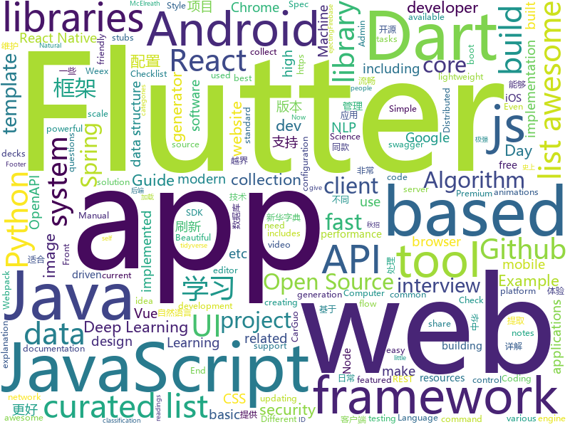

# 2018-08-18
See what the GitHub community is most excited about today.

## python
* [chinese-xinhua](https://github.com/pwxcoo/chinese-xinhua)(**281 stars today**): 中华新华字典数据库。包括歇后语，成语，词语，汉字。提供新华字典API。
* [Interview_Notes-Chinese](https://github.com/imhuay/Interview_Notes-Chinese)(**262 stars today**): 2018/2019/校招/春招/秋招/自然语言处理(NLP)/深度学习(Deep Learning)/机器学习(Machine Learning)/C/C++/Python/面试笔记
* [rescuekerala](https://github.com/IEEEKeralaSection/rescuekerala)(**146 stars today**): Website for coordinating rehabilitation of people affected in the 2018 Kerala Floods
* [Deep-Learning-World](https://github.com/astorfi/Deep-Learning-World)(**155 stars today**): 📡Organized Resources for Deep Learning Researchers and Developers
* [chinese-poetry](https://github.com/chinese-poetry/chinese-poetry)(**121 stars today**): 最全中华古诗词数据库, 唐宋两朝近一万四千古诗人, 接近5.5万首唐诗加26万宋诗. 两宋时期1564位词人，21050首词。
* [Pext](https://github.com/Pext/Pext)(**119 stars today**): Python-based extendable tool
* [system-design-primer](https://github.com/donnemartin/system-design-primer)(**97 stars today**): Learn how to design large-scale systems. Prep for the system design interview. Includes Anki flashcards.
* [trackerjacker](https://github.com/calebmadrigal/trackerjacker)(**95 stars today**): Like nmap for mapping wifi networks you're not connected to, plus device tracking
* [Crypton](https://github.com/ashutosh1206/Crypton)(**91 stars today**): Library consisting of explanation and implementation of all the existing attacks on various Encryption Systems, Digital Signatures, Hashing Algorithms along with example challenges from CTFs
* [UnsupervisedMT](https://github.com/facebookresearch/UnsupervisedMT)(**85 stars today**): Phrase-Based & Neural Unsupervised Machine Translation
* [awesome-python](https://github.com/vinta/awesome-python)(**70 stars today**): A curated list of awesome Python frameworks, libraries, software and resources
* [models](https://github.com/tensorflow/models)(**50 stars today**): Models and examples built with TensorFlow
* [autokeras](https://github.com/jhfjhfj1/autokeras)(**54 stars today**): accessible AutoML for deep learning.
* [face_recognition](https://github.com/ageitgey/face_recognition)(**50 stars today**): The world's simplest facial recognition api for Python and the command line
* [kube-hunter](https://github.com/aquasecurity/kube-hunter)(**52 stars today**): Hunt for security weaknesses in Kubernetes clusters
* [cheat.sh](https://github.com/chubin/cheat.sh)(**49 stars today**): the only cheat sheet you need
* [vid2vid](https://github.com/NVIDIA/vid2vid)(**46 stars today**): Pytorch implementation of our method for high-resolution (e.g. 2048x1024) photorealistic video-to-video translation.
* [redash](https://github.com/getredash/redash)(**39 stars today**): Make Your Company Data Driven. Connect to any data source, easily visualize and share your data.
* [django](https://github.com/django/django)(**30 stars today**): The Web framework for perfectionists with deadlines.
* [public-apis](https://github.com/toddmotto/public-apis)(**35 stars today**): A collective list of public JSON APIs for use in web development.
* [keras](https://github.com/keras-team/keras)(**31 stars today**): Deep Learning for humans
* [social_mapper](https://github.com/SpiderLabs/social_mapper)(**31 stars today**): A Social Media Enumeration & Correlation Tool by Jacob Wilkin(Greenwolf)
* [awesome-machine-learning](https://github.com/josephmisiti/awesome-machine-learning)(**31 stars today**): A curated list of awesome Machine Learning frameworks, libraries and software.
* [ApkVulCheck](https://github.com/zsdlove/ApkVulCheck)(**27 stars today**): This is a tool to help androidcoder to check the flaws in their projects.
* [pylava](https://github.com/pyfocus/pylava)(**29 stars today**): Code audit tool for python (a fork of klen/pylama that works with Python 3.7)

## java
* [JCSprout](https://github.com/crossoverJie/JCSprout)(**563 stars today**): 👨‍🎓Java Core Sprout : basic, concurrent, algorithm
* [vjtools](https://github.com/vipshop/vjtools)(**129 stars today**): The vip.com's java coding standard, libraries and tools
* [Java-Guide](https://github.com/Snailclimb/Java-Guide)(**56 stars today**): 📖Java Guide ： A core knowledge that most Java programmers need to master
* [java-design-patterns](https://github.com/iluwatar/java-design-patterns)(**49 stars today**): Design patterns implemented in Java
* [spring-boot-starter-swagger](https://github.com/SpringForAll/spring-boot-starter-swagger)(**47 stars today**): 自制spring boot starter for swagger 2.x，来试试吧，很好用哦~
* [proxyee-down](https://github.com/proxyee-down-org/proxyee-down)(**47 stars today**): http下载工具，基于http代理，支持多连接分块下载
* [spring-boot](https://github.com/spring-projects/spring-boot)(**40 stars today**): Spring Boot
* [SpringCloudLearning](https://github.com/forezp/SpringCloudLearning)(**35 stars today**): 《史上最简单的Spring Cloud教程源码》
* [tutorials](https://github.com/eugenp/tutorials)(**22 stars today**): The "REST With Spring" Course:
* [guava](https://github.com/google/guava)(**33 stars today**): Google core libraries for Java
* [incubator-dubbo](https://github.com/apache/incubator-dubbo)(**26 stars today**): Apache Dubbo (incubating) is a high-performance, java based, open source RPC framework.
* [SmartRefreshLayout](https://github.com/scwang90/SmartRefreshLayout)(**31 stars today**): 🔥下拉刷新、上拉加载、二级刷新、淘宝二楼、RefreshLayout、OverScroll，Android智能下拉刷新框架，支持越界回弹、越界拖动，具有极强的扩展性，集成了几十种炫酷的Header和 Footer。
* [spring-framework](https://github.com/spring-projects/spring-framework)(**25 stars today**): Spring Framework
* [BigImageViewer](https://github.com/Piasy/BigImageViewer)(**31 stars today**): Big image viewer supporting pan and zoom, with very little memory usage and full featured image loading choices. Powered by Subsampling Scale Image View, Fresco, Glide, and Picasso. Even with gif and webp support!🍻
* [elasticsearch](https://github.com/elastic/elasticsearch)(**29 stars today**): Open Source, Distributed, RESTful Search Engine
* [apollo](https://github.com/ctripcorp/apollo)(**26 stars today**): Apollo（阿波罗）是携程框架部门研发的分布式配置中心，能够集中化管理应用不同环境、不同集群的配置，配置修改后能够实时推送到应用端，并且具备规范的权限、流程治理等特性，适用于微服务配置管理场景。
* [motif](https://github.com/uber/motif)(**30 stars today**): A simple DI API for Android / Java
* [AndroidUtilCode](https://github.com/Blankj/AndroidUtilCode)(**25 stars today**): 🔥Android developers should collect the following utils(updating).
* [Sentinel](https://github.com/alibaba/Sentinel)(**26 stars today**): A lightweight flow-control library providing high-available protection and monitoring (高可用防护的流量管理框架)
* [Java](https://github.com/TheAlgorithms/Java)(**25 stars today**): All Algorithms implemented in Java
* [interviews](https://github.com/kdn251/interviews)(**24 stars today**): Everything you need to know to get the job.
* [jib](https://github.com/GoogleContainerTools/jib)(**22 stars today**): ⛵️Build container images for your Java applications.
* [lottie-android](https://github.com/airbnb/lottie-android)(**21 stars today**): Render After Effects animations natively on Android and iOS, Web, and React Native
* [HanLP](https://github.com/hankcs/HanLP)(**19 stars today**): 自然语言处理 中文分词 词性标注 命名实体识别 依存句法分析 关键词提取 新词发现 短语提取 自动摘要 文本分类 拼音简繁
* [retrofit](https://github.com/square/retrofit)(**19 stars today**): Type-safe HTTP client for Android and Java by Square, Inc.

## unknown
* [unmaintainable-code](https://github.com/Droogans/unmaintainable-code)(**454 stars today**): A more maintainable, easier to share version of the infamous http://mindprod.com/jgloss/unmain.html
* [100-Days-Of-ML-Code](https://github.com/Avik-Jain/100-Days-Of-ML-Code)(**259 stars today**): 100 Days of ML Coding
* [CS-Notes](https://github.com/CyC2018/CS-Notes)(**147 stars today**): 📚Computer Science Learning Notes
* [iCSS](https://github.com/chokcoco/iCSS)(**90 stars today**): 谈谈一些有趣的 CSS 话题
* [Awesome-Android-Interview](https://github.com/JsonChao/Awesome-Android-Interview)(**86 stars today**): 🔥A awesome android expert interview questions and answers（continuous updating ...）
* [awesome](https://github.com/sindresorhus/awesome)(**77 stars today**): 😎Curated list of awesome lists
* [free-programming-books](https://github.com/EbookFoundation/free-programming-books)(**71 stars today**): 📚Freely available programming books
* [gitignore](https://github.com/github/gitignore)(**55 stars today**): A collection of useful .gitignore templates
* [Front-End-Performance-Checklist](https://github.com/thedaviddias/Front-End-Performance-Checklist)(**62 stars today**): 🎮The only Front-End Performance Checklist that runs faster than the others
* [developer-roadmap](https://github.com/kamranahmedse/developer-roadmap)(**53 stars today**): Roadmap to becoming a web developer in 2018
* [nodebestpractices](https://github.com/i0natan/nodebestpractices)(**58 stars today**): The largest Node.JS best practices list (August 2018)
* [polyrnn-pp-pytorch](https://github.com/fidler-lab/polyrnn-pp-pytorch)(**56 stars today**): PyTorch training/tool code for Polygon-RNN++ (CVPR 2018)
* [awesome-distributed-systems](https://github.com/gojektech/awesome-distributed-systems)(**55 stars today**): Awesome list of distributed systems resources
* [You-Dont-Know-JS](https://github.com/getify/You-Dont-Know-JS)(**48 stars today**): A book series on JavaScript. @YDKJS on twitter.
* [architect-awesome](https://github.com/xingshaocheng/architect-awesome)(**41 stars today**): 后端架构师技术图谱
* [Useful_links](https://github.com/ydlan/Useful_links)(**45 stars today**): 👼用这个库来存放一些有用的链接
* [chromium](https://github.com/chromium/chromium)(**38 stars today**): The official GitHub mirror of the Chromium source
* [awesome-ffmpeg](https://github.com/transitive-bullshit/awesome-ffmpeg)(**42 stars today**): 👻A curated list of awesome FFmpeg resources.
* [project-based-learning](https://github.com/tuvtran/project-based-learning)(**32 stars today**): Curated list of project-based tutorials
* [open-source-ideas](https://github.com/open-source-ideas/open-source-ideas)(**37 stars today**): 💡Ever had a cool idea to an Open Source project but didn't have the time to implement yourself? Let someone else give it a try!
* [awesome-vue](https://github.com/vuejs/awesome-vue)(**33 stars today**): 🎉A curated list of awesome things related to Vue.js
* [InterviewMap](https://github.com/InterviewMap/InterviewMap)(**32 stars today**): Build the best interview map. The current content includes JS, network, browser related, performance optimization, security, framework, Git, data structure, algorithm, etc.
* [computer-science](https://github.com/ossu/computer-science)(**29 stars today**): 🎓Path to a free self-taught education in Computer Science!
* [learning-article](https://github.com/webproblem/learning-article)(**26 stars today**): 学习资源汇总
* [build-your-own-x](https://github.com/danistefanovic/build-your-own-x)(**25 stars today**): 🤓Build your own (insert technology here)

## javascript
* [SpaceX-API](https://github.com/r-spacex/SpaceX-API)(**444 stars today**): 🚀Open Source REST API for rocket, core, capsule, pad, and launch data
* [react-move](https://github.com/react-tools/react-move)(**213 stars today**): React Move🌀Beautiful, data-driven animations for React
* [react-async-elements](https://github.com/palmerhq/react-async-elements)(**153 stars today**): Suspense-friendly async React elements for common situations
* [javascript-algorithms](https://github.com/trekhleb/javascript-algorithms)(**135 stars today**): Algorithms and data structures implemented in JavaScript with explanations and links to further readings
* [vue](https://github.com/vuejs/vue)(**109 stars today**): 🖖A progressive, incrementally-adoptable JavaScript framework for building UI on the web.
* [login-with](https://github.com/lipp/login-with)(**102 stars today**): Stateless login-with microservice for OAuth
* [nanoid](https://github.com/ai/nanoid)(**94 stars today**): A tiny (145 bytes), secure, URL-friendly, unique string ID generator for JavaScript.
* [react](https://github.com/facebook/react)(**84 stars today**): A declarative, efficient, and flexible JavaScript library for building user interfaces.
* [mdx-deck](https://github.com/jxnblk/mdx-deck)(**92 stars today**): MDX-based presentation decks
* [taskbook](https://github.com/klauscfhq/taskbook)(**83 stars today**): 📓Tasks, boards & notes for the command-line habitat
* [react-toast-notifications](https://github.com/jossmac/react-toast-notifications)(**81 stars today**): 🍞A toast notification system for react
* [puppeteer](https://github.com/GoogleChrome/puppeteer)(**68 stars today**): Headless Chrome Node API
* [js-lingui](https://github.com/lingui/js-lingui)(**70 stars today**): Readable, automated and lightweight internationalization for JavaScript and React
* [dayjs](https://github.com/iamkun/dayjs)(**65 stars today**): ⏰Day.js 2KB immutable date library alternative to Moment.js with the same modern API
* [UglifyJS2](https://github.com/mishoo/UglifyJS2)(**65 stars today**): JavaScript parser / mangler / compressor / beautifier toolkit
* [iguazu](https://github.com/americanexpress/iguazu)(**62 stars today**): An asynchronous data flow solution for React/Redux applications
* [create-react-app](https://github.com/facebook/create-react-app)(**49 stars today**): Create React apps with no build configuration.
* [ember.js](https://github.com/emberjs/ember.js)(**53 stars today**): Ember.js - A JavaScript framework for creating ambitious web applications
* [Front-End-Checklist](https://github.com/thedaviddias/Front-End-Checklist)(**55 stars today**): 🗂The perfect Front-End Checklist for modern websites and meticulous developers
* [javascript](https://github.com/airbnb/javascript)(**50 stars today**): JavaScript Style Guide
* [vue-cli](https://github.com/vuejs/vue-cli)(**52 stars today**): 🛠️Standard Tooling for Vue.js Development
* [algorithms-javascript](https://github.com/IamManchanda/algorithms-javascript)(**52 stars today**): Preparing for a JavaScript Interview? Check these Algorithms & Data Structures! [WIP] More questions are getting added!
* [axios](https://github.com/axios/axios)(**49 stars today**): Promise based HTTP client for the browser and node.js
* [storybook](https://github.com/storybooks/storybook)(**49 stars today**): Interactive UI component dev & test: React, React Native, Vue, Angular
* [gatsby](https://github.com/gatsbyjs/gatsby)(**42 stars today**): ⚛️📄🚀Blazing fast site generator for React

## html
* [blackeye](https://github.com/thelinuxchoice/blackeye)(**44 stars today**): The most complete Phishing Tool, with 32 templates +1 customizable
* [TinyEditor](https://github.com/umpox/TinyEditor)(**43 stars today**): A functional HTML/CSS/JS editor in less than 400 bytes
* [Publii](https://github.com/GetPublii/Publii)(**35 stars today**): Publii is a desktop-based CMS for Windows and Mac that makes creating static websites fast and hassle-free, even for beginners.
* [awesome-mac](https://github.com/jaywcjlove/awesome-mac)(**29 stars today**):  Now we have become very big, Different from the original idea. Collect premium software in various categories.
* [fastText](https://github.com/facebookresearch/fastText)(**28 stars today**): Library for fast text representation and classification.
* [AdminLTE](https://github.com/almasaeed2010/AdminLTE)(**20 stars today**): AdminLTE - Free Premium Admin control Panel Theme Based On Bootstrap 3.x
* [styleguide](https://github.com/google/styleguide)(**16 stars today**): Style guides for Google-originated open-source projects
* [portainer](https://github.com/portainer/portainer)(**17 stars today**): Simple management UI for Docker
* [Spoon-Knife](https://github.com/octocat/Spoon-Knife)(****): This repo is for demonstration purposes only.
* [EIPs](https://github.com/ethereum/EIPs)(**16 stars today**): The Ethereum Improvement Proposal repository
* [pdfs](https://github.com/tpn/pdfs)(**14 stars today**): Technically-oriented PDF Collection (Papers, Specs, Decks, Manuals, etc)
* [JavaScript30](https://github.com/wesbos/JavaScript30)(**11 stars today**): 30 Day Vanilla JS Challenge
* [swagger-codegen](https://github.com/swagger-api/swagger-codegen)(**12 stars today**): swagger-codegen contains a template-driven engine to generate documentation, API clients and server stubs in different languages by parsing your OpenAPI / Swagger definition.
* [Adminator-admin-dashboard](https://github.com/puikinsh/Adminator-admin-dashboard)(**11 stars today**): Adminator is a easy to use and well design admin dashboard template for web apps, websites, services and more
* [owasp-mstg](https://github.com/OWASP/owasp-mstg)(**9 stars today**): The Mobile Security Testing Guide (MSTG) is a comprehensive manual for mobile app security testing and reverse engineering.
* [NLP-progress](https://github.com/sebastianruder/NLP-progress)(**10 stars today**): Repository to track the progress in Natural Language Processing (NLP), including the datasets and the current state-of-the-art for the most common NLP tasks.
* [react-app-rewired](https://github.com/timarney/react-app-rewired)(**10 stars today**): Override create-react-app webpack configs without ejecting
* [quickstart-js](https://github.com/firebase/quickstart-js)(**9 stars today**): Firebase Quickstart Samples for Web
* [MATRIX_Etherscan](https://github.com/MatrixAINetwork/MATRIX_Etherscan)(**7 stars today**): This is a crawler used to visit Ehterscan and obtain smartcontract related info
* [typedoc](https://github.com/TypeStrong/typedoc)(**8 stars today**): Documentation generator for TypeScript projects.
* [openapi-generator](https://github.com/OpenAPITools/openapi-generator)(**8 stars today**): OpenAPI Generator allows generation of API client libraries (SDK generation), server stubs, documentation and configuration automatically given an OpenAPI Spec (v2, v3)
* [CLRS](https://github.com/walkccc/CLRS)(**8 stars today**): Solutions to Introduction to Algorithms Third Edition
* [awesome-webpack](https://github.com/webpack-contrib/awesome-webpack)(**8 stars today**): A curated list of awesome Webpack resources, libraries and tools
* [Statistical_Rethinking_with_brms_ggplot2_and_the_tidyverse](https://github.com/ASKurz/Statistical_Rethinking_with_brms_ggplot2_and_the_tidyverse)(**7 stars today**): Reexpress McElreath’s "Statistical Rethinking" (2015) by fitting the models in brms, plotting with ggplot2, and data wrangling with tidyverse-style syntax.
* [pure](https://github.com/pure-css/pure)(**7 stars today**): A set of small, responsive CSS modules that you can use in every web project.

## dart
* [flutter](https://github.com/flutter/flutter)(**92 stars today**): Flutter makes it easy and fast to build beautiful mobile apps.
* [GSYGithubAppFlutter](https://github.com/CarGuo/GSYGithubAppFlutter)(**20 stars today**): 超完整的Flutter项目，功能丰富，适合学习和日常使用。GSYGithubApp系列的优势：我们目前已经拥有Flutter、Weex、ReactNative三个版本。 功能齐全，项目框架内技术涉及面广，完成度高，持续维护，配套文章，适合全面学习，跨框架对比参考。跨平台的开源Github客户端App，更好的体验，更丰富的功能，旨在更好的日常管理和维护个人Github，提供更好更方便的驾车体验～～Σ(￣。￣ﾉ)ﾉ。同款Weex版本 ： https://github.com/CarGuo/GSYGithubAppWeex 、同款React Native版本 ： https://github.com/CarGuo/GSYGithubApp
* [30-days-of-flutter](https://github.com/jianggaocheng/30-days-of-flutter)(**16 stars today**): 30 days of Flutter demos
* [trace](https://github.com/trentpiercy/trace)(**9 stars today**): Full-featured, Modern and Powerful Crypto Portfolio & Market Explorer. Built with Flutter
* [plugins](https://github.com/flutter/plugins)(**6 stars today**): Plugins for Flutter, including FlutterFire, maintained by the Flutter team
* [inKino](https://github.com/roughike/inKino)(**6 stars today**): inKino - A cross platform movie and showtime browser for Finnkino cinemas, made with Flutter.
* [Flutter-learning](https://github.com/AweiLoveAndroid/Flutter-learning)(**5 stars today**): 🔥👍🌟⭐️⭐️⭐️Flutter从配置安装到填坑指南详解，Flutter相关Demo解读，项目实例，Dart语法详解
* [sdk](https://github.com/dart-lang/sdk)(**5 stars today**): The Dart SDK, including the VM, dart2js, core libraries, and more.
* [FlutterScreens](https://github.com/samarthagarwal/FlutterScreens)(**5 stars today**): A collection of Screens with attractive UIs built with Flutter ready to be used in your applications.
* [flutter_cache_manager](https://github.com/renefloor/flutter_cache_manager)(****): Generic cache manager for flutter
* [NumberPicker](https://github.com/MarcinusX/NumberPicker)(****): 
* [dart-protoc-plugin](https://github.com/dart-lang/dart-protoc-plugin)(****): Dart plugin for protobuf compiler (protoc)
* [protobuf](https://github.com/dart-lang/protobuf)(****): Runtime library for Dart protobufs
* [chromedeveditor](https://github.com/googlearchive/chromedeveditor)(****): Chrome Dev Editor is a developer tool for building apps on the Chrome platform - Chrome Apps and Web Apps, in JavaScript or Dart. (NO LONGER IN ACTIVE DEVELOPMENT)
* [flutter-osc](https://github.com/yubo725/flutter-osc)(****): 基于Google Flutter的开源中国客户端，支持Android和iOS。
* [flutter-examples](https://github.com/nisrulz/flutter-examples)(****): [Examples] Simple basic isolated apps, for budding flutter devs.
* [hauberk](https://github.com/munificent/hauberk)(****): A web-based roguelike written in Dart.
* [flutter_architecture_samples](https://github.com/brianegan/flutter_architecture_samples)(****): TodoMVC for Flutter
* [Flutter-UI-Kit](https://github.com/iampawan/Flutter-UI-Kit)(****): Flutter app for collection of UI in a UIKit
* [angular](https://github.com/dart-lang/angular)(****): Fast and productive web framework provided by Dart
* [FlutterExampleApps](https://github.com/iampawan/FlutterExampleApps)(****): [Example APPS] Basic Flutter apps, for flutter devs.
* [dio](https://github.com/flutterchina/dio)(****): A powerful Http client for Dart, which supports Interceptors, FormData, Request Cancellation, File Downloading, Timeout etc.
* [StageXL](https://github.com/bp74/StageXL)(****): A fast and universal 2D rendering engine for HTML5 and Dart.
* [zhihu-flutter](https://github.com/HackSoul/zhihu-flutter)(****): Flutter 高仿知乎 UI，非常漂亮，也非常流畅，flutter build apk 或 flutter build ios 之后更流畅
* [dart-sass](https://github.com/sass/dart-sass)(****): A Dart implementation of Sass.

## WordCloud

