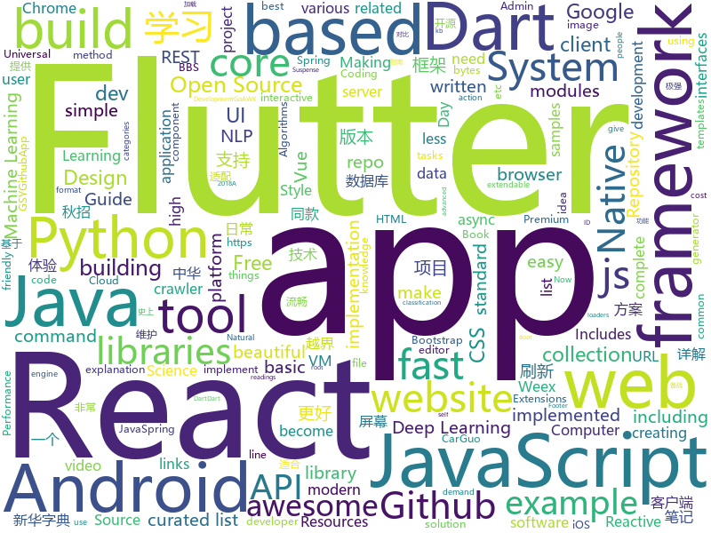

# 2018-08-19
See what the GitHub community is most excited about today.

## python
* [python-fire](https://github.com/google/python-fire)(**552 stars today**): Python Fire is a library for automatically generating command line interfaces (CLIs) from absolutely any Python object.
* [chinese-xinhua](https://github.com/pwxcoo/chinese-xinhua)(**198 stars today**): 中华新华字典数据库。包括歇后语，成语，词语，汉字。提供新华字典API。
* [rescuekerala](https://github.com/IEEEKeralaSection/rescuekerala)(**90 stars today**): Website for coordinating rehabilitation of people affected in the 2018 Kerala Floods
* [Interview_Notes-Chinese](https://github.com/imhuay/Interview_Notes-Chinese)(**123 stars today**): 2018/2019/校招/春招/秋招/自然语言处理(NLP)/深度学习(Deep Learning)/机器学习(Machine Learning)/C/C++/Python/面试笔记
* [Deep-Learning-World](https://github.com/astorfi/Deep-Learning-World)(**101 stars today**): 📡Organized Resources for Deep Learning Researchers and Developers
* [system-design-primer](https://github.com/donnemartin/system-design-primer)(**52 stars today**): Learn how to design large-scale systems. Prep for the system design interview. Includes Anki flashcards.
* [models](https://github.com/tensorflow/models)(**36 stars today**): Models and examples built with TensorFlow
* [vid2vid](https://github.com/NVIDIA/vid2vid)(**44 stars today**): Pytorch implementation of our method for high-resolution (e.g. 2048x1024) photorealistic video-to-video translation.
* [GitMiner](https://github.com/UnkL4b/GitMiner)(**43 stars today**): Tool for advanced mining for content on Github
* [awesome-python](https://github.com/vinta/awesome-python)(**39 stars today**): A curated list of awesome Python frameworks, libraries, software and resources
* [trackerjacker](https://github.com/calebmadrigal/trackerjacker)(**39 stars today**): Like nmap for mapping wifi networks you're not connected to, plus device tracking
* [chinese-poetry](https://github.com/chinese-poetry/chinese-poetry)(**35 stars today**): 最全中华古诗词数据库, 唐宋两朝近一万四千古诗人, 接近5.5万首唐诗加26万宋诗. 两宋时期1564位词人，21050首词。
* [Photon](https://github.com/s0md3v/Photon)(**33 stars today**): Incredibly fast crawler which extracts urls, emails, files, website accounts and much more.
* [autokeras](https://github.com/jhfjhfj1/autokeras)(**33 stars today**): accessible AutoML for deep learning.
* [Inception](https://github.com/two06/Inception)(**29 stars today**): Provides In-memory compilation and reflective loading of C# apps for AV evasion.
* [Pext](https://github.com/Pext/Pext)(**30 stars today**): Python-based extendable tool
* [django](https://github.com/django/django)(**17 stars today**): The Web framework for perfectionists with deadlines.
* [cheat.sh](https://github.com/chubin/cheat.sh)(**22 stars today**): the only cheat sheet you need
* [scikit-learn](https://github.com/scikit-learn/scikit-learn)(**19 stars today**): scikit-learn: machine learning in Python
* [face_recognition](https://github.com/ageitgey/face_recognition)(**18 stars today**): The world's simplest facial recognition api for Python and the command line
* [kube-hunter](https://github.com/aquasecurity/kube-hunter)(**21 stars today**): Hunt for security weaknesses in Kubernetes clusters
* [Crypton](https://github.com/ashutosh1206/Crypton)(**21 stars today**): Library consisting of explanation and implementation of all the existing attacks on various Encryption Systems, Digital Signatures, Hashing Algorithms along with example challenges from CTFs
* [pylava](https://github.com/pyfocus/pylava)(**21 stars today**): Code audit tool for python (a fork of klen/pylama that works with Python 3.7)
* [astropy](https://github.com/astropy/astropy)(**20 stars today**): Repository for the Astropy core package
* [keras](https://github.com/keras-team/keras)(**16 stars today**): Deep Learning for humans

## java
* [JCSprout](https://github.com/crossoverJie/JCSprout)(**126 stars today**): 👨‍🎓Java Core Sprout : basic, concurrent, algorithm
* [vjtools](https://github.com/vipshop/vjtools)(**54 stars today**): The vip.com's java coding standard, libraries and tools
* [proxyee-down](https://github.com/proxyee-down-org/proxyee-down)(**53 stars today**): http下载工具，基于http代理，支持多连接分块下载
* [AndroidAutoSize](https://github.com/JessYanCoding/AndroidAutoSize)(**37 stars today**): A low-cost Android screen adaptation solution (今日头条屏幕适配方案终极版，一个极低成本的 Android 屏幕适配方案).
* [java-design-patterns](https://github.com/iluwatar/java-design-patterns)(**30 stars today**): Design patterns implemented in Java
* [spring-boot](https://github.com/spring-projects/spring-boot)(**23 stars today**): Spring Boot
* [SpringCloudLearning](https://github.com/forezp/SpringCloudLearning)(**23 stars today**): 《史上最简单的Spring Cloud教程源码》
* [tutorials](https://github.com/eugenp/tutorials)(**13 stars today**): The "REST With Spring" Course:
* [interviews](https://github.com/kdn251/interviews)(**18 stars today**): Everything you need to know to get the job.
* [symphony](https://github.com/b3log/symphony)(**20 stars today**): 🎶A modern community (forum/BBS/SNS/blog) platform written in Java. 一个用 Java 实现的现代化社区（论坛/BBS/社交网络/博客）平台。
* [Java](https://github.com/TheAlgorithms/Java)(**16 stars today**): All Algorithms implemented in Java
* [spring-framework](https://github.com/spring-projects/spring-framework)(**14 stars today**): Spring Framework
* [RxJava](https://github.com/ReactiveX/RxJava)(**15 stars today**): RxJava – Reactive Extensions for the JVM – a library for composing asynchronous and event-based programs using observable sequences for the Java VM.
* [Java-Guide](https://github.com/Snailclimb/Java-Guide)(**14 stars today**): 📖Java Guide ： A core knowledge that most Java programmers need to master
* [elasticsearch](https://github.com/elastic/elasticsearch)(**13 stars today**): Open Source, Distributed, RESTful Search Engine
* [retrofit](https://github.com/square/retrofit)(**12 stars today**): Type-safe HTTP client for Android and Java by Square, Inc.
* [Magisk](https://github.com/topjohnwu/Magisk)(**14 stars today**): A Magic Mask to Alter Android System Systemless-ly
* [VirtualXposed](https://github.com/android-hacker/VirtualXposed)(**14 stars today**): A simple app to use Xposed without root, unlock the bootloader or modify system image, etc.
* [guava](https://github.com/google/guava)(**12 stars today**): Google core libraries for Java
* [incubator-dubbo](https://github.com/apache/incubator-dubbo)(**11 stars today**): Apache Dubbo (incubating) is a high-performance, java based, open source RPC framework.
* [motif](https://github.com/uber/motif)(**13 stars today**): A simple DI API for Android / Java
* [okhttp](https://github.com/square/okhttp)(**11 stars today**): An HTTP+HTTP/2 client for Android and Java applications.
* [react-native-navigation](https://github.com/wix/react-native-navigation)(**10 stars today**): A complete native navigation solution for React Native
* [SmartRefreshLayout](https://github.com/scwang90/SmartRefreshLayout)(**11 stars today**): 🔥下拉刷新、上拉加载、二级刷新、淘宝二楼、RefreshLayout、OverScroll，Android智能下拉刷新框架，支持越界回弹、越界拖动，具有极强的扩展性，集成了几十种炫酷的Header和 Footer。
* [butterknife](https://github.com/JakeWharton/butterknife)(**9 stars today**): Bind Android views and callbacks to fields and methods.

## unknown
* [unmaintainable-code](https://github.com/Droogans/unmaintainable-code)(**277 stars today**): A more maintainable, easier to share version of the infamous http://mindprod.com/jgloss/unmain.html
* [100-Days-Of-ML-Code](https://github.com/Avik-Jain/100-Days-Of-ML-Code)(**184 stars today**): 100 Days of ML Coding
* [CS-Notes](https://github.com/CyC2018/CS-Notes)(**45 stars today**): 📚Computer Science Learning Notes
* [You-Dont-Know-JS](https://github.com/getify/You-Dont-Know-JS)(**46 stars today**): A book series on JavaScript. @YDKJS on twitter.
* [free-programming-books](https://github.com/EbookFoundation/free-programming-books)(**47 stars today**): 📚Freely available programming books
* [developer-roadmap](https://github.com/kamranahmedse/developer-roadmap)(**45 stars today**): Roadmap to becoming a web developer in 2018
* [gitignore](https://github.com/github/gitignore)(**36 stars today**): A collection of useful .gitignore templates
* [awesome](https://github.com/sindresorhus/awesome)(**40 stars today**): 😎Curated list of awesome lists
* [project-based-learning](https://github.com/tuvtran/project-based-learning)(**35 stars today**): Curated list of project-based tutorials
* [jetbrains-agent](https://github.com/pengzhile/jetbrains-agent)(**37 stars today**): Jetbrains License Server Crack
* [cloud-gpus](https://github.com/binga/cloud-gpus)(**35 stars today**): This repository contains information about Cloud GPU offerings for Machine Learning practitioners.
* [open-source-ideas](https://github.com/open-source-ideas/open-source-ideas)(**31 stars today**): 💡Ever had a cool idea to an Open Source project but didn't have the time to implement yourself? Let someone else give it a try!
* [fresh-async-react](https://github.com/sw-yx/fresh-async-react)(**29 stars today**): Fresh🍅links about the coming async react revolution!!
* [architect-awesome](https://github.com/xingshaocheng/architect-awesome)(**26 stars today**): 后端架构师技术图谱
* [Awesome-Hacking-Resources](https://github.com/vitalysim/Awesome-Hacking-Resources)(**25 stars today**): A collection of hacking / penetration testing resources to make you better!
* [2019_campus_apply](https://github.com/frank-lam/2019_campus_apply)(**25 stars today**): 🚀备战秋招，CS学习笔记。一起造火箭吧！ from zero to hero.
* [Front-End-Performance-Checklist](https://github.com/thedaviddias/Front-End-Performance-Checklist)(**23 stars today**): 🎮The only Front-End Performance Checklist that runs faster than the others
* [polyrnn-pp-pytorch](https://github.com/fidler-lab/polyrnn-pp-pytorch)(**21 stars today**): PyTorch training/tool code for Polygon-RNN++ (CVPR 2018)
* [awesome-vue](https://github.com/vuejs/awesome-vue)(**21 stars today**): 🎉A curated list of awesome things related to Vue.js
* [iCSS](https://github.com/chokcoco/iCSS)(**21 stars today**): 谈谈一些有趣的 CSS 话题
* [awesome-flutter](https://github.com/Solido/awesome-flutter)(**17 stars today**): An awesome list that curates the best Flutter libraries, tools, tutorials, articles and more.
* [awesome-react](https://github.com/enaqx/awesome-react)(**18 stars today**): A collection of awesome things regarding React ecosystem.
* [kimurai](https://github.com/vfreefly/kimurai)(**17 stars today**): Repository was removed
* [build-your-own-x](https://github.com/danistefanovic/build-your-own-x)(**16 stars today**): 🤓Build your own (insert technology here)
* [computer-science](https://github.com/ossu/computer-science)(**15 stars today**): 🎓Path to a free self-taught education in Computer Science!

## javascript
* [SpaceX-API](https://github.com/r-spacex/SpaceX-API)(**127 stars today**): 🚀Open Source REST API for rocket, core, capsule, pad, and launch data
* [javascript-algorithms](https://github.com/trekhleb/javascript-algorithms)(**117 stars today**): Algorithms and data structures implemented in JavaScript with explanations and links to further readings
* [vue](https://github.com/vuejs/vue)(**93 stars today**): 🖖A progressive, incrementally-adoptable JavaScript framework for building UI on the web.
* [react](https://github.com/facebook/react)(**68 stars today**): A declarative, efficient, and flexible JavaScript library for building user interfaces.
* [react-async-elements](https://github.com/palmerhq/react-async-elements)(**74 stars today**): Suspense-friendly async React elements for common situations
* [ember.js](https://github.com/emberjs/ember.js)(**56 stars today**): Ember.js - A JavaScript framework for creating ambitious web applications
* [nanoid](https://github.com/ai/nanoid)(**56 stars today**): A tiny (145 bytes), secure, URL-friendly, unique string ID generator for JavaScript.
* [javascript](https://github.com/airbnb/javascript)(**46 stars today**): JavaScript Style Guide
* [js-lingui](https://github.com/lingui/js-lingui)(**43 stars today**): 🌍📖A readable, automated, and optimized (5 kb) internationalization for JavaScript and React
* [create-react-app](https://github.com/facebook/create-react-app)(**35 stars today**): Create React apps with no build configuration.
* [axios](https://github.com/axios/axios)(**38 stars today**): Promise based HTTP client for the browser and node.js
* [node](https://github.com/nodejs/node)(**36 stars today**): Node.js JavaScript runtime✨🐢🚀✨
* [mdx-deck](https://github.com/jxnblk/mdx-deck)(**37 stars today**): MDX-based presentation decks
* [login-with](https://github.com/lipp/login-with)(**38 stars today**): Stateless login-with microservice for OAuth
* [d3](https://github.com/d3/d3)(**32 stars today**): Bring data to life with SVG, Canvas and HTML.📊📈🎉
* [react-spring](https://github.com/drcmda/react-spring)(**35 stars today**): 🙌Helping react-motion and animated to become best friends
* [react-native](https://github.com/facebook/react-native)(**32 stars today**): A framework for building native apps with React.
* [Tone.js](https://github.com/Tonejs/Tone.js)(**34 stars today**): A Web Audio framework for making interactive music in the browser.
* [webpack](https://github.com/webpack/webpack)(**33 stars today**): A bundler for javascript and friends. Packs many modules into a few bundled assets. Code Splitting allows to load parts for the application on demand. Through "loaders," modules can be CommonJs, AMD, ES6 modules, CSS, Images, JSON, Coffeescript, LESS, ... and your custom stuff.
* [material-ui](https://github.com/mui-org/material-ui)(**30 stars today**): React components that implement Google's Material Design.
* [storybook](https://github.com/storybooks/storybook)(**30 stars today**): Interactive UI component dev & test: React, React Native, Vue, Angular
* [gatsby](https://github.com/gatsbyjs/gatsby)(**27 stars today**): ⚛️📄🚀Blazing fast site generator for React
* [Universal-React-Apollo-Registration](https://github.com/simpletut/Universal-React-Apollo-Registration)(**27 stars today**): Open Source Universal User Registration System – NodeJS React Apollo GraphQL JWT MongoDB
* [taskbook](https://github.com/klauscfhq/taskbook)(**26 stars today**): 📓Tasks, boards & notes for the command-line habitat
* [vue-cli](https://github.com/vuejs/vue-cli)(**25 stars today**): 🛠️Standard Tooling for Vue.js Development

## html
* [goawk](https://github.com/benhoyt/goawk)(**165 stars today**): GoAWK: an AWK interpreter written in Go
* [TinyEditor](https://github.com/umpox/TinyEditor)(**29 stars today**): A functional HTML/CSS/JS editor in less than 400 bytes
* [awesome-mac](https://github.com/jaywcjlove/awesome-mac)(**19 stars today**):  Now we have become very big, Different from the original idea. Collect premium software in various categories.
* [styleguide](https://github.com/google/styleguide)(**14 stars today**): Style guides for Google-originated open-source projects
* [Publii](https://github.com/GetPublii/Publii)(**17 stars today**): Publii is a desktop-based CMS for Windows and Mac that makes creating static websites fast and hassle-free, even for beginners.
* [blackeye](https://github.com/thelinuxchoice/blackeye)(**15 stars today**): The most complete Phishing Tool, with 32 templates +1 customizable
* [AdminLTE](https://github.com/almasaeed2010/AdminLTE)(**12 stars today**): AdminLTE - Free Premium Admin control Panel Theme Based On Bootstrap 3.x
* [JavaScript30](https://github.com/wesbos/JavaScript30)(**9 stars today**): 30 Day Vanilla JS Challenge
* [CTF-notes](https://github.com/Shiva108/CTF-notes)(**9 stars today**): Everything needed for doing CTFs
* [NLP-progress](https://github.com/sebastianruder/NLP-progress)(**8 stars today**): Repository to track the progress in Natural Language Processing (NLP), including the datasets and the current state-of-the-art for the most common NLP tasks.
* [blog](https://github.com/MuYunyun/blog)(**8 stars today**): knowledge from action📔
* [gentelella](https://github.com/puikinsh/gentelella)(**5 stars today**): Free Bootstrap 3 Admin Template
* [EIPs](https://github.com/ethereum/EIPs)(**6 stars today**): The Ethereum Improvement Proposal repository
* [Winds](https://github.com/GetStream/Winds)(**7 stars today**): A Beautiful Open Source RSS & Podcast App Powered by Getstream.io
* [github-markdown-css](https://github.com/sindresorhus/github-markdown-css)(**7 stars today**): The minimal amount of CSS to replicate the GitHub Markdown style
* [MATRIX_Etherscan](https://github.com/MatrixAINetwork/MATRIX_Etherscan)(**6 stars today**): This is a crawler used to visit Ehterscan and obtain smartcontract related info
* [fastText](https://github.com/facebookresearch/fastText)(**6 stars today**): Library for fast text representation and classification.
* [Spoon-Knife](https://github.com/octocat/Spoon-Knife)(****): This repo is for demonstration purposes only.
* [hugo-academic](https://github.com/gcushen/hugo-academic)(**5 stars today**): The website designer for Hugo. Build and deploy a beautiful website in minutes🚀
* [code_snippets](https://github.com/CoreyMSchafer/code_snippets)(**5 stars today**): 
* [OpenMetrics](https://github.com/OpenObservability/OpenMetrics)(**6 stars today**): Evolving Prometheus exposition format into a standard.
* [polymer](https://github.com/Polymer/polymer)(**5 stars today**): Build modern apps using web components
* [quickstart-js](https://github.com/firebase/quickstart-js)(**5 stars today**): Firebase Quickstart Samples for Web
* [coloring-book](https://github.com/aberke/coloring-book)(**5 stars today**): This is a Coloring Book about Group Theory
* [website](https://github.com/kubernetes/website)(****): Kubernetes website and documentation repo:

## dart
* [flutter](https://github.com/flutter/flutter)(**46 stars today**): Flutter makes it easy and fast to build beautiful mobile apps.
* [sdk](https://github.com/dart-lang/sdk)(**10 stars today**): The Dart SDK, including the VM, dart2js, core libraries, and more.
* [GSYGithubAppFlutter](https://github.com/CarGuo/GSYGithubAppFlutter)(**10 stars today**): 超完整的Flutter项目，功能丰富，适合学习和日常使用。GSYGithubApp系列的优势：我们目前已经拥有Flutter、Weex、ReactNative三个版本。 功能齐全，项目框架内技术涉及面广，完成度高，持续维护，配套文章，适合全面学习，跨框架对比参考。跨平台的开源Github客户端App，更好的体验，更丰富的功能，旨在更好的日常管理和维护个人Github，提供更好更方便的驾车体验～～Σ(￣。￣ﾉ)ﾉ。同款Weex版本 ： https://github.com/CarGuo/GSYGithubAppWeex 、同款React Native版本 ： https://github.com/CarGuo/GSYGithubApp
* [Flutter-learning](https://github.com/AweiLoveAndroid/Flutter-learning)(**6 stars today**): 🔥👍🌟⭐️⭐️⭐️Flutter从配置安装到填坑指南详解，Flutter相关Demo解读，项目实例，Dart语法详解
* [flutter_cache_manager](https://github.com/renefloor/flutter_cache_manager)(****): Generic cache manager for flutter
* [Worker](https://github.com/Dreckr/Worker)(****): Utility for easy concurrency with isolates
* [chromedeveditor](https://github.com/googlearchive/chromedeveditor)(****): Chrome Dev Editor is a developer tool for building apps on the Chrome platform - Chrome Apps and Web Apps, in JavaScript or Dart. (NO LONGER IN ACTIVE DEVELOPMENT)
* [plugins](https://github.com/flutter/plugins)(****): Plugins for Flutter, including FlutterFire, maintained by the Flutter team
* [flutter-osc](https://github.com/yubo725/flutter-osc)(****): 基于Google Flutter的开源中国客户端，支持Android和iOS。
* [inKino](https://github.com/roughike/inKino)(****): inKino - A cross platform movie and showtime browser for Finnkino cinemas, made with Flutter.
* [flutter-examples](https://github.com/nisrulz/flutter-examples)(****): [Examples] Simple basic isolated apps, for budding flutter devs.
* [hauberk](https://github.com/munificent/hauberk)(****): A web-based roguelike written in Dart.
* [flutter_architecture_samples](https://github.com/brianegan/flutter_architecture_samples)(****): TodoMVC for Flutter
* [Flutter-UI-Kit](https://github.com/iampawan/Flutter-UI-Kit)(****): Flutter app for collection of UI in a UIKit
* [angular](https://github.com/dart-lang/angular)(****): Fast and productive web framework provided by Dart
* [FlutterExampleApps](https://github.com/iampawan/FlutterExampleApps)(****): [Example APPS] Basic Flutter apps, for flutter devs.
* [dio](https://github.com/flutterchina/dio)(****): A powerful Http client for Dart, which supports Interceptors, FormData, Request Cancellation, File Downloading, Timeout etc.
* [StageXL](https://github.com/bp74/StageXL)(****): A fast and universal 2D rendering engine for HTML5 and Dart.
* [zhihu-flutter](https://github.com/HackSoul/zhihu-flutter)(****): Flutter 高仿知乎 UI，非常漂亮，也非常流畅，flutter build apk 或 flutter build ios 之后更流畅
* [dart-sass](https://github.com/sass/dart-sass)(****): A Dart implementation of Sass.
* [github-issue-mover](https://github.com/google/github-issue-mover)(****): Making it easy to migrate issues between repos.
* [rxdart](https://github.com/ReactiveX/rxdart)(****): The Reactive Extensions for Dart
* [aqueduct](https://github.com/stablekernel/aqueduct)(****): Dart HTTP server framework for building REST APIs. Includes PostgreSQL ORM and OAuth2 provider.
* [start](https://github.com/lvivski/start)(****): Sinatra inspired web development framework for Dart
* [dart-samples](https://github.com/dart-lang/dart-samples)(****): Various samples and examples in Dart

## WordCloud

