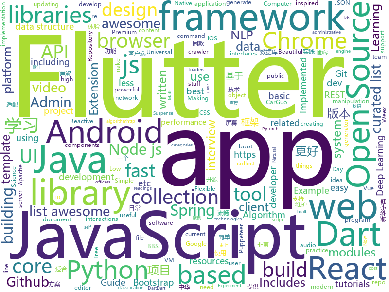

# 2018-08-20
See what the GitHub community is most excited about today.

## python
* [vid2vid](https://github.com/NVIDIA/vid2vid)(**257 stars today**): Pytorch implementation of our method for high-resolution (e.g. 2048x1024) photorealistic video-to-video translation.
* [chinese-xinhua](https://github.com/pwxcoo/chinese-xinhua)(**236 stars today**): 中华新华字典数据库。包括歇后语，成语，词语，汉字。提供新华字典API。
* [python-fire](https://github.com/google/python-fire)(**249 stars today**): Python Fire is a library for automatically generating command line interfaces (CLIs) from absolutely any Python object.
* [system-design-primer](https://github.com/donnemartin/system-design-primer)(**98 stars today**): Learn how to design large-scale systems. Prep for the system design interview. Includes Anki flashcards.
* [Interview_Notes-Chinese](https://github.com/imhuay/Interview_Notes-Chinese)(**86 stars today**): 2018/2019/校招/春招/秋招/自然语言处理(NLP)/深度学习(Deep Learning)/机器学习(Machine Learning)/C/C++/Python/面试笔记
* [Deep-Learning-World](https://github.com/astorfi/Deep-Learning-World)(**87 stars today**): 📡Organized Resources for Deep Learning Researchers and Developers
* [rescuekerala](https://github.com/IEEEKeralaSection/rescuekerala)(**56 stars today**): Website for coordinating rehabilitation of people affected in the 2018 Kerala Floods
* [models](https://github.com/tensorflow/models)(**52 stars today**): Models and examples built with TensorFlow
* [docker_practice](https://github.com/yeasy/docker_practice)(**37 stars today**): Learn and understand Docker technologies, with real DevOps practice!
* [trackerjacker](https://github.com/calebmadrigal/trackerjacker)(**34 stars today**): Like nmap for mapping wifi networks you're not connected to, plus device tracking
* [awesome-python](https://github.com/vinta/awesome-python)(**33 stars today**): A curated list of awesome Python frameworks, libraries, software and resources
* [GitMiner](https://github.com/UnkL4b/GitMiner)(**32 stars today**): Tool for advanced mining for content on Github
* [youtube-dl](https://github.com/rg3/youtube-dl)(**29 stars today**): Command-line program to download videos from YouTube.com and other video sites
* [keras](https://github.com/keras-team/keras)(**23 stars today**): Deep Learning for humans
* [papermill](https://github.com/nteract/papermill)(**24 stars today**): 📚Parameterize, execute, and analyze notebooks
* [Photon](https://github.com/s0md3v/Photon)(**26 stars today**): Incredibly fast crawler designed for reconnaissance.
* [autokeras](https://github.com/jhfjhfj1/autokeras)(**26 stars today**): accessible AutoML for deep learning.
* [public-apis](https://github.com/toddmotto/public-apis)(**24 stars today**): A collective list of public JSON APIs for use in web development.
* [django](https://github.com/django/django)(**22 stars today**): The Web framework for perfectionists with deadlines.
* [face_recognition](https://github.com/ageitgey/face_recognition)(**22 stars today**): The world's simplest facial recognition api for Python and the command line
* [cheat.sh](https://github.com/chubin/cheat.sh)(**23 stars today**): the only cheat sheet you need
* [social_mapper](https://github.com/SpiderLabs/social_mapper)(**22 stars today**): A Social Media Enumeration & Correlation Tool by Jacob Wilkin(Greenwolf)
* [pandas](https://github.com/pandas-dev/pandas)(**19 stars today**): Flexible and powerful data analysis / manipulation library for Python, providing labeled data structures similar to R data.frame objects, statistical functions, and much more
* [chinese-poetry](https://github.com/chinese-poetry/chinese-poetry)(**17 stars today**): 最全中华古诗词数据库, 唐宋两朝近一万四千古诗人, 接近5.5万首唐诗加26万宋诗. 两宋时期1564位词人，21050首词。
* [astropy](https://github.com/astropy/astropy)(**19 stars today**): Repository for the Astropy core package

## java
* [JCSprout](https://github.com/crossoverJie/JCSprout)(**75 stars today**): 👨‍🎓Java Core Sprout : basic, concurrent, algorithm
* [proxyee-down](https://github.com/proxyee-down-org/proxyee-down)(**43 stars today**): http下载工具，基于http代理，支持多连接分块下载
* [java-design-patterns](https://github.com/iluwatar/java-design-patterns)(**34 stars today**): Design patterns implemented in Java
* [interviews](https://github.com/kdn251/interviews)(**26 stars today**): Everything you need to know to get the job.
* [AndroidAutoSize](https://github.com/JessYanCoding/AndroidAutoSize)(**22 stars today**): A low-cost Android screen adaptation solution (今日头条屏幕适配方案终极版，一个极低成本的 Android 屏幕适配方案).
* [spring-boot](https://github.com/spring-projects/spring-boot)(**14 stars today**): Spring Boot
* [spring-framework](https://github.com/spring-projects/spring-framework)(**15 stars today**): Spring Framework
* [tutorials](https://github.com/eugenp/tutorials)(**12 stars today**): The "REST With Spring" Course:
* [RxAndroidBle](https://github.com/Polidea/RxAndroidBle)(**19 stars today**): An Android library for Bluetooth Low Energy (BLE) interactions backed with RxJava2 (yet, we still support RxJava1)
* [elasticsearch](https://github.com/elastic/elasticsearch)(**17 stars today**): Open Source, Distributed, RESTful Search Engine
* [vjtools](https://github.com/vipshop/vjtools)(**16 stars today**): The vip.com's java coding standard, libraries and tools
* [rocketmq](https://github.com/apache/rocketmq)(**14 stars today**): Mirror of Apache RocketMQ
* [SpringCloudLearning](https://github.com/forezp/SpringCloudLearning)(**13 stars today**): 《史上最简单的Spring Cloud教程源码》
* [Java](https://github.com/TheAlgorithms/Java)(**11 stars today**): All Algorithms implemented in Java
* [symphony](https://github.com/b3log/symphony)(**13 stars today**): 🎶A modern community (forum/BBS/SNS/blog) platform written in Java. 一个用 Java 实现的现代化社区（论坛/BBS/社交网络/博客）平台。https://hacpai.com
* [WMRouter](https://github.com/meituan/WMRouter)(**13 stars today**): WMRouter是一款Android路由框架，基于组件化的设计思路，有功能灵活强大、使用简单的特点。
* [Java-Guide](https://github.com/Snailclimb/Java-Guide)(**11 stars today**): 📖Java Guide ： A core knowledge that most Java programmers need to master
* [guava](https://github.com/google/guava)(**12 stars today**): Google core libraries for Java
* [RxJava](https://github.com/ReactiveX/RxJava)(**11 stars today**): RxJava – Reactive Extensions for the JVM – a library for composing asynchronous and event-based programs using observable sequences for the Java VM.
* [retrofit](https://github.com/square/retrofit)(**12 stars today**): Type-safe HTTP client for Android and Java by Square, Inc.
* [AndroidUtilCode](https://github.com/Blankj/AndroidUtilCode)(**9 stars today**): 🔥Android developers should collect the following utils(updating).
* [material-components-android](https://github.com/material-components/material-components-android)(**11 stars today**): Modular and customizable Material Design UI components for Android
* [halo](https://github.com/ruibaby/halo)(**11 stars today**): Halo可能是最好的Java博客系统😉
* [springboot-learning-example](https://github.com/JeffLi1993/springboot-learning-example)(**8 stars today**): spring boot 实践学习案例，是 spring boot 初学者及核心技术巩固的最佳实践。
* [incubator-dubbo](https://github.com/apache/incubator-dubbo)(**8 stars today**): Apache Dubbo (incubating) is a high-performance, java based, open source RPC framework.

## unknown
* [unmaintainable-code](https://github.com/Droogans/unmaintainable-code)(**303 stars today**): A more maintainable, easier to share version of the infamous http://mindprod.com/jgloss/unmain.html
* [100-Days-Of-ML-Code](https://github.com/Avik-Jain/100-Days-Of-ML-Code)(**161 stars today**): 100 Days of ML Coding
* [dadsresume](https://github.com/runvnc/dadsresume)(**137 stars today**): My dad's resume and skills from 1980
* [Red-Teaming-Toolkit](https://github.com/infosecn1nja/Red-Teaming-Toolkit)(**68 stars today**): A collection of open source and commercial tools that aid in red team operations.
* [developer-roadmap](https://github.com/kamranahmedse/developer-roadmap)(**66 stars today**): Roadmap to becoming a web developer in 2018
* [CS-Notes](https://github.com/CyC2018/CS-Notes)(**53 stars today**): 📚Computer Science Learning Notes
* [You-Dont-Know-JS](https://github.com/getify/You-Dont-Know-JS)(**39 stars today**): A book series on JavaScript. @YDKJS on twitter.
* [free-programming-books](https://github.com/EbookFoundation/free-programming-books)(**44 stars today**): 📚Freely available programming books
* [project-based-learning](https://github.com/tuvtran/project-based-learning)(**40 stars today**): Curated list of project-based tutorials
* [awesome](https://github.com/sindresorhus/awesome)(**40 stars today**): 😎Curated list of awesome lists
* [gitignore](https://github.com/github/gitignore)(**30 stars today**): A collection of useful .gitignore templates
* [Awesome-Hacking-Resources](https://github.com/vitalysim/Awesome-Hacking-Resources)(**35 stars today**): A collection of hacking / penetration testing resources to make you better!
* [jetbrains-agent](https://github.com/pengzhile/jetbrains-agent)(**30 stars today**): Jetbrains License Server Crack
* [Front-End-Performance-Checklist](https://github.com/thedaviddias/Front-End-Performance-Checklist)(**32 stars today**): 🎮The only Front-End Performance Checklist that runs faster than the others
* [replacing-bash-scripting-with-python](https://github.com/ninjaaron/replacing-bash-scripting-with-python)(**30 stars today**): Guide on using using python for administrative scripting
* [awesome-vue](https://github.com/vuejs/awesome-vue)(**26 stars today**): 🎉A curated list of awesome things related to Vue.js
* [open-source-ideas](https://github.com/open-source-ideas/open-source-ideas)(**26 stars today**): 💡Ever had a cool idea to an Open Source project but didn't have the time to implement yourself? Let someone else give it a try!
* [computer-science](https://github.com/ossu/computer-science)(**24 stars today**): 🎓Path to a free self-taught education in Computer Science!
* [architect-awesome](https://github.com/xingshaocheng/architect-awesome)(**23 stars today**): 后端架构师技术图谱
* [awesome-flutter](https://github.com/Solido/awesome-flutter)(**19 stars today**): An awesome list that curates the best Flutter libraries, tools, tutorials, articles and more.
* [nodebestpractices](https://github.com/i0natan/nodebestpractices)(**21 stars today**): The largest Node.JS best practices list (August 2018)
* [InterviewMap](https://github.com/InterviewMap/InterviewMap)(**19 stars today**): Build the best interview map. The current content includes JS, network, browser related, performance optimization, security, framework, Git, data structure, algorithm, etc.
* [awesome-cpp](https://github.com/fffaraz/awesome-cpp)(**18 stars today**): A curated list of awesome C++ (or C) frameworks, libraries, resources, and shiny things. Inspired by awesome-... stuff.
* [build-your-own-x](https://github.com/danistefanovic/build-your-own-x)(**18 stars today**): 🤓Build your own (insert technology here)
* [Awesome-Android-Interview](https://github.com/JsonChao/Awesome-Android-Interview)(**16 stars today**): 🔥A awesome android expert interview questions and answers（continuous updating ...）

## javascript
* [rc-bmap](https://github.com/jser-club/rc-bmap)(**151 stars today**): 当百度地图遇上React，会产生怎样的火花🔥🎉欢迎您的加入🎉
* [javascript-algorithms](https://github.com/trekhleb/javascript-algorithms)(**115 stars today**): Algorithms and data structures implemented in JavaScript with explanations and links to further readings
* [umbrella](https://github.com/franciscop/umbrella)(**104 stars today**): ☔️Lightweight javascript library for DOM manipulation and events
* [nanoid](https://github.com/ai/nanoid)(**102 stars today**): A tiny (145 bytes), secure, URL-friendly, unique string ID generator for JavaScript.
* [vue](https://github.com/vuejs/vue)(**87 stars today**): 🖖A progressive, incrementally-adoptable JavaScript framework for building UI on the web.
* [puppeteer-recorder](https://github.com/checkly/puppeteer-recorder)(**91 stars today**): Puppeteer recorder is a Chrome extension that records your browser interactions and generates a Puppeteer script.
* [Universal-React-Apollo-Registration](https://github.com/simpletut/Universal-React-Apollo-Registration)(**84 stars today**): Open Source Universal User Registration System – NodeJS React Apollo GraphQL JWT MongoDB
* [TheoremJS](https://github.com/arguiot/TheoremJS)(**72 stars today**): A Math library for computation in JavaScript
* [react](https://github.com/facebook/react)(**67 stars today**): A declarative, efficient, and flexible JavaScript library for building user interfaces.
* [mdx-docs](https://github.com/jxnblk/mdx-docs)(**59 stars today**): 📝Document and develop React components with MDX and Next.js
* [SpaceX-API](https://github.com/r-spacex/SpaceX-API)(**57 stars today**): 🚀Open Source REST API for rocket, core, capsule, pad, and launch data
* [ember.js](https://github.com/emberjs/ember.js)(**50 stars today**): Ember.js - A JavaScript framework for creating ambitious web applications
* [create-react-app](https://github.com/facebook/create-react-app)(**43 stars today**): Create React apps with no build configuration.
* [node](https://github.com/nodejs/node)(**44 stars today**): Node.js JavaScript runtime✨🐢🚀✨
* [axios](https://github.com/axios/axios)(**43 stars today**): Promise based HTTP client for the browser and node.js
* [js-lingui](https://github.com/lingui/js-lingui)(**43 stars today**): 🌍📖A readable, automated, and optimized (5 kb) internationalization for JavaScript and React
* [git-tutor](https://github.com/R1ZZU/git-tutor)(**39 stars today**): +md=❤️Awesome tutorials from your git log
* [javascript](https://github.com/airbnb/javascript)(**35 stars today**): JavaScript Style Guide
* [gatsby](https://github.com/gatsbyjs/gatsby)(**33 stars today**): ⚛️📄🚀Blazing fast site generator for React
* [Tone.js](https://github.com/Tonejs/Tone.js)(**35 stars today**): A Web Audio framework for making interactive music in the browser.
* [react-suspense-starter](https://github.com/palmerhq/react-suspense-starter)(**32 stars today**): Experiment with React Suspense right meow.
* [react-native](https://github.com/facebook/react-native)(**29 stars today**): A framework for building native apps with React.
* [puppeteer](https://github.com/GoogleChrome/puppeteer)(**28 stars today**): Headless Chrome Node API
* [ndb](https://github.com/GoogleChromeLabs/ndb)(**29 stars today**): ndb is an improved debugging experience for Node.js, enabled by Chrome DevTools
* [webpack](https://github.com/webpack/webpack)(**26 stars today**): A bundler for javascript and friends. Packs many modules into a few bundled assets. Code Splitting allows to load parts for the application on demand. Through "loaders," modules can be CommonJs, AMD, ES6 modules, CSS, Images, JSON, Coffeescript, LESS, ... and your custom stuff.

## html
* [goawk](https://github.com/benhoyt/goawk)(**77 stars today**): GoAWK: an AWK interpreter written in Go
* [TinyEditor](https://github.com/umpox/TinyEditor)(**24 stars today**): A functional HTML/CSS/JS editor in less than 400 bytes
* [AdminLTE](https://github.com/almasaeed2010/AdminLTE)(**16 stars today**): AdminLTE - Free Premium Admin control Panel Theme Based On Bootstrap 3.x
* [styleguide](https://github.com/google/styleguide)(**12 stars today**): Style guides for Google-originated open-source projects
* [awesome-mac](https://github.com/jaywcjlove/awesome-mac)(**12 stars today**):  Now we have become very big, Different from the original idea. Collect premium software in various categories.
* [fastText](https://github.com/facebookresearch/fastText)(**11 stars today**): Library for fast text representation and classification.
* [NLP-progress](https://github.com/sebastianruder/NLP-progress)(**12 stars today**): Repository to track the progress in Natural Language Processing (NLP), including the datasets and the current state-of-the-art for the most common NLP tasks.
* [portainer](https://github.com/portainer/portainer)(**10 stars today**): Simple management UI for Docker
* [blackeye](https://github.com/thelinuxchoice/blackeye)(**10 stars today**): The most complete Phishing Tool, with 32 templates +1 customizable
* [JavaScript30](https://github.com/wesbos/JavaScript30)(**6 stars today**): 30 Day Vanilla JS Challenge
* [gentelella](https://github.com/puikinsh/gentelella)(**7 stars today**): Free Bootstrap 3 Admin Template
* [DocumentosUniversitarios](https://github.com/sgermosen/DocumentosUniversitarios)(**7 stars today**): 
* [MATRIX_Etherscan](https://github.com/MatrixAINetwork/MATRIX_Etherscan)(**6 stars today**): This is a crawler used to visit Ehterscan and obtain smartcontract related info
* [Adminator-admin-dashboard](https://github.com/puikinsh/Adminator-admin-dashboard)(**6 stars today**): Adminator is a easy to use and well design admin dashboard template for web apps, websites, services and more
* [CoPilot](https://github.com/misterGF/CoPilot)(**6 stars today**): Responsive Bootstrap 3 Admin Template based on AdminLTE with vue.js
* [Spoon-Knife](https://github.com/octocat/Spoon-Knife)(****): This repo is for demonstration purposes only.
* [pdfs](https://github.com/tpn/pdfs)(**6 stars today**): Technically-oriented PDF Collection (Papers, Specs, Decks, Manuals, etc)
* [fluxion](https://github.com/FluxionNetwork/fluxion)(**5 stars today**): Fluxion is a remake of linset by vk496 with less bugs and enhanced functionality.
* [Winds](https://github.com/GetStream/Winds)(**5 stars today**): A Beautiful Open Source RSS & Podcast App Powered by Getstream.io
* [zepto](https://github.com/madrobby/zepto)(**5 stars today**): Zepto.js is a minimalist JavaScript library for modern browsers, with a jQuery-compatible API
* [ecma262](https://github.com/tc39/ecma262)(**5 stars today**): Status, process, and documents for ECMA262
* [go-on-rails](https://github.com/railstack/go-on-rails)(**5 stars today**): 🚄Use Rails to Develop or Generate a Golang Application.
* [chicago-police-data](https://github.com/invinst/chicago-police-data)(**5 stars today**): a collection of public data re: CPD officers involved in police encounters
* [patchwork](https://github.com/jlord/patchwork)(****): All the Git-it Workshop completers!
* [nodejs-ex](https://github.com/sclorg/nodejs-ex)(****): node.js example

## dart
* [flutter](https://github.com/flutter/flutter)(**50 stars today**): Flutter makes it easy and fast to build beautiful mobile apps.
* [GSYGithubAppFlutter](https://github.com/CarGuo/GSYGithubAppFlutter)(**11 stars today**): 超完整的Flutter项目，功能丰富，适合学习和日常使用。GSYGithubApp系列的优势：我们目前已经拥有Flutter、Weex、ReactNative三个版本。 功能齐全，项目框架内技术涉及面广，完成度高，持续维护，配套文章，适合全面学习，跨框架对比参考。跨平台的开源Github客户端App，更好的体验，更丰富的功能，旨在更好的日常管理和维护个人Github，提供更好更方便的驾车体验～～Σ(￣。￣ﾉ)ﾉ。同款Weex版本 ： https://github.com/CarGuo/GSYGithubAppWeex 、同款React Native版本 ： https://github.com/CarGuo/GSYGithubApp
* [plugins](https://github.com/flutter/plugins)(**5 stars today**): Plugins for Flutter, including FlutterFire, maintained by the Flutter team
* [flutter_study](https://github.com/luhenchang/flutter_study)(**5 stars today**): 三天学会Flutter
* [timeago.dart](https://github.com/andresaraujo/timeago.dart)(****): A library useful for creating fuzzy timestamps. (e.g. "5 minutes ago")
* [audioplayer](https://github.com/rxlabz/audioplayer)(****): A flutter plugin to play audio files ( ObjC/Java )
* [chromedeveditor](https://github.com/googlearchive/chromedeveditor)(****): Chrome Dev Editor is a developer tool for building apps on the Chrome platform - Chrome Apps and Web Apps, in JavaScript or Dart. (NO LONGER IN ACTIVE DEVELOPMENT)
* [sdk](https://github.com/dart-lang/sdk)(****): The Dart SDK, including the VM, dart2js, core libraries, and more.
* [flutter-osc](https://github.com/yubo725/flutter-osc)(****): 基于Google Flutter的开源中国客户端，支持Android和iOS。
* [inKino](https://github.com/roughike/inKino)(****): inKino - A cross platform movie and showtime browser for Finnkino cinemas, made with Flutter.
* [flutter-examples](https://github.com/nisrulz/flutter-examples)(****): [Examples] Simple basic isolated apps, for budding flutter devs.
* [hauberk](https://github.com/munificent/hauberk)(****): A web-based roguelike written in Dart.
* [flutter_architecture_samples](https://github.com/brianegan/flutter_architecture_samples)(****): TodoMVC for Flutter
* [Flutter-UI-Kit](https://github.com/iampawan/Flutter-UI-Kit)(****): Flutter app for collection of UI in a UIKit
* [angular](https://github.com/dart-lang/angular)(****): Fast and productive web framework provided by Dart
* [FlutterExampleApps](https://github.com/iampawan/FlutterExampleApps)(****): [Example APPS] Basic Flutter apps, for flutter devs.
* [dio](https://github.com/flutterchina/dio)(****): A powerful Http client for Dart, which supports Interceptors, FormData, Request Cancellation, File Downloading, Timeout etc.
* [Flutter-learning](https://github.com/AweiLoveAndroid/Flutter-learning)(****): 🔥👍🌟⭐️⭐️⭐️Flutter从配置安装到填坑指南详解，Flutter相关Demo解读，项目实例，Dart语法详解
* [StageXL](https://github.com/bp74/StageXL)(****): A fast and universal 2D rendering engine for HTML5 and Dart.
* [zhihu-flutter](https://github.com/HackSoul/zhihu-flutter)(****): Flutter 高仿知乎 UI，非常漂亮，也非常流畅，flutter build apk 或 flutter build ios 之后更流畅
* [dart-sass](https://github.com/sass/dart-sass)(****): A Dart implementation of Sass.
* [github-issue-mover](https://github.com/google/github-issue-mover)(****): Making it easy to migrate issues between repos.
* [rxdart](https://github.com/ReactiveX/rxdart)(****): The Reactive Extensions for Dart
* [aqueduct](https://github.com/stablekernel/aqueduct)(****): Dart HTTP server framework for building REST APIs. Includes PostgreSQL ORM and OAuth2 provider.
* [start](https://github.com/lvivski/start)(****): Sinatra inspired web development framework for Dart

## WordCloud

