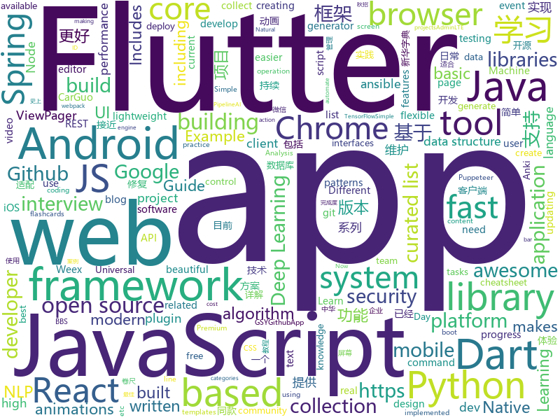

# 2018-08-21
See what the GitHub community is most excited about today.

## python
* [vid2vid](https://github.com/NVIDIA/vid2vid)(**574 stars today**): Pytorch implementation of our method for high-resolution (e.g. 2048x1024) photorealistic video-to-video translation.
* [chinese-xinhua](https://github.com/pwxcoo/chinese-xinhua)(**477 stars today**): 中华新华字典数据库。包括歇后语，成语，词语，汉字。提供新华字典API。
* [python-fire](https://github.com/google/python-fire)(**352 stars today**): Python Fire is a library for automatically generating command line interfaces (CLIs) from absolutely any Python object.
* [system-design-primer](https://github.com/donnemartin/system-design-primer)(**285 stars today**): Learn how to design large-scale systems. Prep for the system design interview. Includes Anki flashcards.
* [Interview_Notes-Chinese](https://github.com/imhuay/Interview_Notes-Chinese)(**160 stars today**): 2018/2019/校招/春招/秋招/自然语言处理(NLP)/深度学习(Deep Learning)/机器学习(Machine Learning)/C/C++/Python/面试笔记
* [Deep-Learning-World](https://github.com/astorfi/Deep-Learning-World)(**153 stars today**): 📡Organized Resources for Deep Learning Researchers and Developers
* [cheat.sh](https://github.com/chubin/cheat.sh)(**97 stars today**): the only cheat sheet you need
* [models](https://github.com/tensorflow/models)(**47 stars today**): Models and examples built with TensorFlow
* [fast_progress](https://github.com/fastai/fast_progress)(**52 stars today**): Simple and flexible progress bar for Jupyter Notebook and console
* [tldr](https://github.com/tldr-pages/tldr)(**51 stars today**): 📚Simplified and community-driven man pages
* [interactive-coding-challenges](https://github.com/donnemartin/interactive-coding-challenges)(**49 stars today**): Interactive Python coding interview challenges (algorithms and data structures). Includes Anki flashcards.
* [keras](https://github.com/keras-team/keras)(**39 stars today**): Deep Learning for humans
* [rescuekerala](https://github.com/IEEEKeralaSection/rescuekerala)(**33 stars today**): Website for coordinating rehabilitation of people affected in the 2018 Kerala Floods
* [kube-hunter](https://github.com/aquasecurity/kube-hunter)(**49 stars today**): Hunt for security weaknesses in Kubernetes clusters
* [autokeras](https://github.com/jhfjhfj1/autokeras)(**42 stars today**): accessible AutoML for deep learning.
* [awesome-python](https://github.com/vinta/awesome-python)(**43 stars today**): A curated list of awesome Python frameworks, libraries, software and resources
* [django](https://github.com/django/django)(**32 stars today**): The Web framework for perfectionists with deadlines.
* [chinese-poetry](https://github.com/chinese-poetry/chinese-poetry)(**35 stars today**): 最全中华古诗词数据库, 唐宋两朝近一万四千古诗人, 接近5.5万首唐诗加26万宋诗. 两宋时期1564位词人，21050首词。
* [papermill](https://github.com/nteract/papermill)(**36 stars today**): 📚Parameterize, execute, and analyze notebooks
* [flask](https://github.com/pallets/flask)(**33 stars today**): The Python micro framework for building web applications.
* [docker_practice](https://github.com/yeasy/docker_practice)(**34 stars today**): Learn and understand Docker technologies, with real DevOps practice!
* [Yolo-pytorch](https://github.com/1991viet/Yolo-pytorch)(**36 stars today**): 
* [Photon](https://github.com/s0md3v/Photon)(**34 stars today**): Incredibly fast crawler designed for reconnaissance.
* [ansible](https://github.com/ansible/ansible)(**28 stars today**): Ansible is a radically simple IT automation platform that makes your applications and systems easier to deploy. Avoid writing scripts or custom code to deploy and update your applications — automate in a language that approaches plain English, using SSH, with no agents to install on remote systems. https://docs.ansible.com/ansible/
* [GitMiner](https://github.com/UnkL4b/GitMiner)(**29 stars today**): Tool for advanced mining for content on Github

## java
* [AndroidAutoSize](https://github.com/JessYanCoding/AndroidAutoSize)(**295 stars today**): A low-cost Android screen adaptation solution (今日头条屏幕适配方案终极版，一个极低成本的 Android 屏幕适配方案).
* [Android-Animation-Set](https://github.com/OCNYang/Android-Animation-Set)(**198 stars today**): 🦄Android 所有动画系列详尽教程。 Explain all animations in Android.
* [JCSprout](https://github.com/crossoverJie/JCSprout)(**155 stars today**): 👨‍🎓Java Core Sprout : basic, concurrent, algorithm
* [GraceViewPager](https://github.com/wurensen/GraceViewPager)(**74 stars today**): 1.支持ViewPager按需添加、删除视图，以及局部刷新； 2.修复多场景下ViewPager.PageTransformer返回的position错误，让开发者专注于动画实现； 3.修复ViewPager的width、paddingLeft、paddingRight、pageMargin动态改变导致当前page定位异常的问题； 4.提供自定义GraceViewPager，可快速实现一屏显示多Page的功能。
* [proxyee-down](https://github.com/proxyee-down-org/proxyee-down)(**66 stars today**): http下载工具，基于http代理，支持多连接分块下载
* [spring-boot](https://github.com/spring-projects/spring-boot)(**53 stars today**): Spring Boot
* [java-design-patterns](https://github.com/iluwatar/java-design-patterns)(**61 stars today**): Design patterns implemented in Java
* [WMRouter](https://github.com/meituan/WMRouter)(**63 stars today**): WMRouter是一款Android路由框架，基于组件化的设计思路，有功能灵活强大、使用简单的特点。
* [GlobalWarming](https://github.com/nsporillo/GlobalWarming)(**64 stars today**): Spigot plugin that adds game changing global warming mechanics
* [RuleView](https://github.com/zjun615/RuleView)(**59 stars today**): 卷尺系列控件，包含：普通卷尺（如：体重）、金额尺、时间尺
* [Sentinel](https://github.com/alibaba/Sentinel)(**38 stars today**): A lightweight flow-control library providing high-available protection and monitoring (高可用防护的流量管理框架)
* [symphony](https://github.com/b3log/symphony)(**42 stars today**): 🎶A modern community (forum/BBS/SNS/blog) platform written in Java. 一个用 Java 实现的现代化社区（论坛/BBS/社交网络/博客）平台。https://hacpai.com
* [lottie-android](https://github.com/airbnb/lottie-android)(**43 stars today**): Render After Effects animations natively on Android and iOS, Web, and React Native
* [Java-Guide](https://github.com/Snailclimb/Java-Guide)(**38 stars today**): 📖Java Guide ： A core knowledge that most Java programmers need to master
* [SpringCloudLearning](https://github.com/forezp/SpringCloudLearning)(**36 stars today**): 《史上最简单的Spring Cloud教程源码》
* [spring-framework](https://github.com/spring-projects/spring-framework)(**27 stars today**): Spring Framework
* [interviews](https://github.com/kdn251/interviews)(**35 stars today**): Everything you need to know to get the job.
* [tutorials](https://github.com/eugenp/tutorials)(**20 stars today**): The "REST With Spring" Course:
* [guava](https://github.com/google/guava)(**31 stars today**): Google core libraries for Java
* [weixin-java-tools](https://github.com/Wechat-Group/weixin-java-tools)(**30 stars today**): 全能微信Java开发工具包，支持包括微信支付、开放平台、小程序、企业号和公众号等的开发
* [AndroidUtilCode](https://github.com/Blankj/AndroidUtilCode)(**28 stars today**): 🔥Android developers should collect the following utils(updating).
* [elasticsearch](https://github.com/elastic/elasticsearch)(**28 stars today**): Open Source, Distributed, RESTful Search Engine
* [vjtools](https://github.com/vipshop/vjtools)(**31 stars today**): The vip.com's java coding standard, libraries and tools
* [springboot-learning-example](https://github.com/JeffLi1993/springboot-learning-example)(**24 stars today**): spring boot 实践学习案例，是 spring boot 初学者及核心技术巩固的最佳实践。
* [incubator-dubbo](https://github.com/apache/incubator-dubbo)(**18 stars today**): Apache Dubbo (incubating) is a high-performance, java based, open source RPC framework.

## unknown
* [100-Days-Of-ML-Code](https://github.com/Avik-Jain/100-Days-Of-ML-Code)(**266 stars today**): 100 Days of ML Coding
* [unmaintainable-code](https://github.com/Droogans/unmaintainable-code)(**284 stars today**): A more maintainable, easier to share version of the infamous http://mindprod.com/jgloss/unmain.html
* [Red-Teaming-Toolkit](https://github.com/infosecn1nja/Red-Teaming-Toolkit)(**213 stars today**): A collection of open source and commercial tools that aid in red team operations.
* [CS-Notes](https://github.com/CyC2018/CS-Notes)(**168 stars today**): 📚Computer Science Learning Notes
* [dadsresume](https://github.com/runvnc/dadsresume)(**131 stars today**): My dad's resume and skills from 1980
* [InterviewMap](https://github.com/InterviewMap/InterviewMap)(**107 stars today**): Build the best interview map. The current content includes JS, network, browser related, performance optimization, security, framework, Git, data structure, algorithm, etc.
* [You-Dont-Know-JS](https://github.com/getify/You-Dont-Know-JS)(**92 stars today**): A book series on JavaScript. @YDKJS on twitter.
* [Front-End-Performance-Checklist](https://github.com/thedaviddias/Front-End-Performance-Checklist)(**96 stars today**): 🎮The only Front-End Performance Checklist that runs faster than the others
* [developer-roadmap](https://github.com/kamranahmedse/developer-roadmap)(**70 stars today**): Roadmap to becoming a web developer in 2018
* [jetbrains-agent](https://github.com/pengzhile/jetbrains-agent)(**68 stars today**): Jetbrains License Server Crack
* [architect-awesome](https://github.com/xingshaocheng/architect-awesome)(**64 stars today**): 后端架构师技术图谱
* [gitignore](https://github.com/github/gitignore)(**51 stars today**): A collection of useful .gitignore templates
* [free-programming-books](https://github.com/EbookFoundation/free-programming-books)(**53 stars today**): 📚Freely available programming books
* [stanford-cs-229-machine-learning](https://github.com/afshinea/stanford-cs-229-machine-learning)(**49 stars today**): VIP cheatsheets for Stanford's CS 229 Machine Learning
* [awesome-vue](https://github.com/vuejs/awesome-vue)(**46 stars today**): 🎉A curated list of awesome things related to Vue.js
* [Awesome-Android-Interview](https://github.com/JsonChao/Awesome-Android-Interview)(**46 stars today**): 🔥A awesome android expert interview questions and answers（continuous updating ...）
* [project-based-learning](https://github.com/tuvtran/project-based-learning)(**42 stars today**): Curated list of project-based tutorials
* [awesome](https://github.com/sindresorhus/awesome)(**42 stars today**): 😎Curated list of awesome lists
* [modern-cpp-features](https://github.com/AnthonyCalandra/modern-cpp-features)(**42 stars today**): A cheatsheet of modern C++ language and library features.
* [nodebestpractices](https://github.com/i0natan/nodebestpractices)(**37 stars today**): The largest Node.JS best practices list (August 2018)
* [UhttBarcodeReference](https://github.com/papyrussolution/UhttBarcodeReference)(**40 stars today**): Universe-HTT barcode reference
* [iCSS](https://github.com/chokcoco/iCSS)(**33 stars today**): 谈谈一些有趣的 CSS 话题
* [android-architecture](https://github.com/googlesamples/android-architecture)(**30 stars today**): A collection of samples to discuss and showcase different architectural tools and patterns for Android apps.
* [kimurai](https://github.com/vfreefly/kimurai)(**31 stars today**): Repository was removed
* [build-your-own-x](https://github.com/danistefanovic/build-your-own-x)(**27 stars today**): 🤓Build your own (insert technology here)

## javascript
* [puppeteer-recorder](https://github.com/checkly/puppeteer-recorder)(**450 stars today**): Puppeteer recorder is a Chrome extension that records your browser interactions and generates a Puppeteer script.
* [nanoid](https://github.com/ai/nanoid)(**396 stars today**): A tiny (145 bytes), secure, URL-friendly, unique string ID generator for JavaScript.
* [resources](https://github.com/BestDingSheng/resources)(**330 stars today**): 知名互联网企业内推资料整理 持续更新ing 。 目前已经维护四个微信群接近2000人，欢迎你的加入！
* [TheoremJS](https://github.com/arguiot/TheoremJS)(**220 stars today**): A Math library for computation in JavaScript
* [umbrella](https://github.com/franciscop/umbrella)(**187 stars today**): ☔️Lightweight javascript library for DOM manipulation and events
* [vue](https://github.com/vuejs/vue)(**141 stars today**): 🖖A progressive, incrementally-adoptable JavaScript framework for building UI on the web.
* [javascript-algorithms](https://github.com/trekhleb/javascript-algorithms)(**143 stars today**): Algorithms and data structures implemented in JavaScript with explanations and links to further readings
* [Tone.js](https://github.com/Tonejs/Tone.js)(**105 stars today**): A Web Audio framework for making interactive music in the browser.
* [react](https://github.com/facebook/react)(**94 stars today**): A declarative, efficient, and flexible JavaScript library for building user interfaces.
* [js-lingui](https://github.com/lingui/js-lingui)(**97 stars today**): 🌍📖A readable, automated, and optimized (5 kb) internationalization for JavaScript and React
* [puppeteer](https://github.com/GoogleChrome/puppeteer)(**80 stars today**): Headless Chrome Node API
* [Universal-React-Apollo-Registration](https://github.com/simpletut/Universal-React-Apollo-Registration)(**78 stars today**): Open Source Universal User Registration System – NodeJS React Apollo GraphQL JWT MongoDB
* [axios](https://github.com/axios/axios)(**77 stars today**): Promise based HTTP client for the browser and node.js
* [mdx-deck](https://github.com/jxnblk/mdx-deck)(**77 stars today**): MDX-based presentation decks
* [create-react-app](https://github.com/facebook/create-react-app)(**66 stars today**): Create React apps with no build configuration.
* [ember.js](https://github.com/emberjs/ember.js)(**63 stars today**): Ember.js - A JavaScript framework for creating ambitious web applications
* [vue-smooth-reflow](https://github.com/guanzo/vue-smooth-reflow)(**66 stars today**): Transition an elements reflow when the data changes.
* [mithril.js](https://github.com/MithrilJS/mithril.js)(**62 stars today**): A Javascript Framework for Building Brilliant Applications
* [CommitTasks](https://github.com/ZeroX-DG/CommitTasks)(**59 stars today**): A combination between git commit & todo list🎉
* [SpaceX-API](https://github.com/r-spacex/SpaceX-API)(**58 stars today**): 🚀Open Source REST API for rocket, core, capsule, pad, and launch data
* [mdx-docs](https://github.com/jxnblk/mdx-docs)(**56 stars today**): 📝Document and develop React components with MDX and Next.js
* [proxy-web](https://github.com/yincongcyincong/proxy-web)(**51 stars today**): proxy-web是用go语言写的，基于snail007/goproxy完成的可视化网页应用
* [taskbook](https://github.com/klauscfhq/taskbook)(**54 stars today**): 📓Tasks, boards & notes for the command-line habitat
* [javascript](https://github.com/airbnb/javascript)(**48 stars today**): JavaScript Style Guide
* [node](https://github.com/nodejs/node)(**45 stars today**): Node.js JavaScript runtime✨🐢🚀✨

## html
* [model-analysis](https://github.com/tensorflow/model-analysis)(**47 stars today**): Model analysis tools for TensorFlow
* [goawk](https://github.com/benhoyt/goawk)(**42 stars today**): GoAWK: an AWK interpreter written in Go
* [TinyEditor](https://github.com/umpox/TinyEditor)(**27 stars today**): A functional HTML/CSS/JS editor in less than 400 bytes
* [styleguide](https://github.com/google/styleguide)(**23 stars today**): Style guides for Google-originated open-source projects
* [AdminLTE](https://github.com/almasaeed2010/AdminLTE)(**17 stars today**): AdminLTE - Free Premium Admin control Panel Theme Based On Bootstrap 3.x
* [fastText](https://github.com/facebookresearch/fastText)(**21 stars today**): Library for fast text representation and classification.
* [blackeye](https://github.com/thelinuxchoice/blackeye)(**19 stars today**): The most complete Phishing Tool, with 32 templates +1 customizable
* [NLP-progress](https://github.com/sebastianruder/NLP-progress)(**20 stars today**): Repository to track the progress in Natural Language Processing (NLP), including the datasets and the current state-of-the-art for the most common NLP tasks.
* [awesome-mac](https://github.com/jaywcjlove/awesome-mac)(**16 stars today**):  Now we have become very big, Different from the original idea. Collect premium software in various categories.
* [EIPs](https://github.com/ethereum/EIPs)(**13 stars today**): The Ethereum Improvement Proposal repository
* [Spoon-Knife](https://github.com/octocat/Spoon-Knife)(****): This repo is for demonstration purposes only.
* [qiubaiying.github.io](https://github.com/qiubaiying/qiubaiying.github.io)(**5 stars today**): BY Blog ->
* [Publii](https://github.com/GetPublii/Publii)(**14 stars today**): Publii is a desktop-based CMS for Windows and Mac that makes creating static websites fast and hassle-free, even for beginners.
* [annotation-abuse](https://github.com/zmitchell/annotation-abuse)(**13 stars today**): Rust-like macros in Python by abusing type annotations
* [portainer](https://github.com/portainer/portainer)(**12 stars today**): Simple management UI for Docker
* [react-app-rewired](https://github.com/timarney/react-app-rewired)(**11 stars today**): Override create-react-app webpack configs without ejecting
* [JavaScript30](https://github.com/wesbos/JavaScript30)(**6 stars today**): 30 Day Vanilla JS Challenge
* [chilipie-kiosk](https://github.com/futurice/chilipie-kiosk)(**10 stars today**): Easy-to-use Raspberry Pi image for booting directly into full-screen Chrome, with built-in convenience features for unattended operation. Perfect for dashboards and build monitors.
* [blog](https://github.com/MuYunyun/blog)(**10 stars today**): knowledge from action📔
* [go-on-rails](https://github.com/railstack/go-on-rails)(**10 stars today**): 🚄Use Rails to Develop or Generate a Golang Application.
* [pipeline](https://github.com/PipelineAI/pipeline)(**9 stars today**): PipelineAI: Real-Time Enterprise AI Platform
* [google-udacity-scholars18.github.io](https://github.com/google-udacity-scholars18/google-udacity-scholars18.github.io)(**9 stars today**): Showcase of student project built for 2018 Google Developer Scholarship
* [polymer](https://github.com/Polymer/polymer)(**9 stars today**): Build modern apps using web components
* [typedoc](https://github.com/TypeStrong/typedoc)(**9 stars today**): Documentation generator for TypeScript projects.
* [owasp-mstg](https://github.com/OWASP/owasp-mstg)(**8 stars today**): The Mobile Security Testing Guide (MSTG) is a comprehensive manual for mobile app security testing and reverse engineering.

## dart
* [flutter](https://github.com/flutter/flutter)(**100 stars today**): Flutter makes it easy and fast to build beautiful mobile apps.
* [GSYGithubAppFlutter](https://github.com/CarGuo/GSYGithubAppFlutter)(**18 stars today**): 超完整的Flutter项目，功能丰富，适合学习和日常使用。GSYGithubApp系列的优势：我们目前已经拥有Flutter、Weex、ReactNative三个版本。 功能齐全，项目框架内技术涉及面广，完成度高，持续维护，配套文章，适合全面学习，跨框架对比参考。跨平台的开源Github客户端App，更好的体验，更丰富的功能，旨在更好的日常管理和维护个人Github，提供更好更方便的驾车体验～～Σ(￣。￣ﾉ)ﾉ。同款Weex版本 ： https://github.com/CarGuo/GSYGithubAppWeex 、同款React Native版本 ： https://github.com/CarGuo/GSYGithubApp
* [flutter-examples](https://github.com/nisrulz/flutter-examples)(**11 stars today**): [Examples] Simple basic isolated apps, for budding flutter devs.
* [plugins](https://github.com/flutter/plugins)(**9 stars today**): Plugins for Flutter, including FlutterFire, maintained by the Flutter team
* [flutter_study](https://github.com/luhenchang/flutter_study)(**9 stars today**): 三天学会Flutter
* [Flutter-learning](https://github.com/AweiLoveAndroid/Flutter-learning)(**9 stars today**): 🔥👍🌟⭐️⭐️⭐️Flutter从配置安装到填坑指南详解，Flutter相关Demo解读，项目实例，Dart语法详解
* [dio](https://github.com/flutterchina/dio)(**7 stars today**): A powerful Http client for Dart, which supports Interceptors, FormData, Request Cancellation, File Downloading, Timeout etc.
* [Animated-Text-Kit](https://github.com/aagarwal1012/Animated-Text-Kit)(**6 stars today**): 🔔A flutter package to create cool and beautiful text animations.
* [flutter_inapp_purchase](https://github.com/dooboolab/flutter_inapp_purchase)(**6 stars today**): Flutter plugin for In App Purchase.
* [flutter_cache_manager](https://github.com/renefloor/flutter_cache_manager)(****): Generic cache manager for flutter
* [udacity-course](https://github.com/flutter/udacity-course)(****): Build native mobile apps with Flutter
* [angular_analyzer_plugin](https://github.com/dart-lang/angular_analyzer_plugin)(****): AngularDart integration for Dart Analysis Server
* [site-www](https://github.com/dart-lang/site-www)(****): Source for Dart website
* [rx_command](https://github.com/fluttercommunity/rx_command)(****): Reactive event handler wrapper class inspired by ReactiveUI. Maintainer @escamoteur
* [github.dart](https://github.com/DirectMyFile/github.dart)(****): GitHub Client Library for Dart
* [chromedeveditor](https://github.com/googlearchive/chromedeveditor)(****): Chrome Dev Editor is a developer tool for building apps on the Chrome platform - Chrome Apps and Web Apps, in JavaScript or Dart. (NO LONGER IN ACTIVE DEVELOPMENT)
* [sdk](https://github.com/dart-lang/sdk)(****): The Dart SDK, including the VM, dart2js, core libraries, and more.
* [flutter-osc](https://github.com/yubo725/flutter-osc)(****): 基于Google Flutter的开源中国客户端，支持Android和iOS。
* [inKino](https://github.com/roughike/inKino)(****): inKino - A cross platform movie and showtime browser for Finnkino cinemas, made with Flutter.
* [hauberk](https://github.com/munificent/hauberk)(****): A web-based roguelike written in Dart.
* [flutter_architecture_samples](https://github.com/brianegan/flutter_architecture_samples)(****): TodoMVC for Flutter
* [Flutter-UI-Kit](https://github.com/iampawan/Flutter-UI-Kit)(****): Flutter app for collection of UI in a UIKit
* [angular](https://github.com/dart-lang/angular)(****): Fast and productive web framework provided by Dart
* [FlutterExampleApps](https://github.com/iampawan/FlutterExampleApps)(****): [Example APPS] Basic Flutter apps, for flutter devs.
* [StageXL](https://github.com/bp74/StageXL)(****): A fast and universal 2D rendering engine for HTML5 and Dart.

## WordCloud

