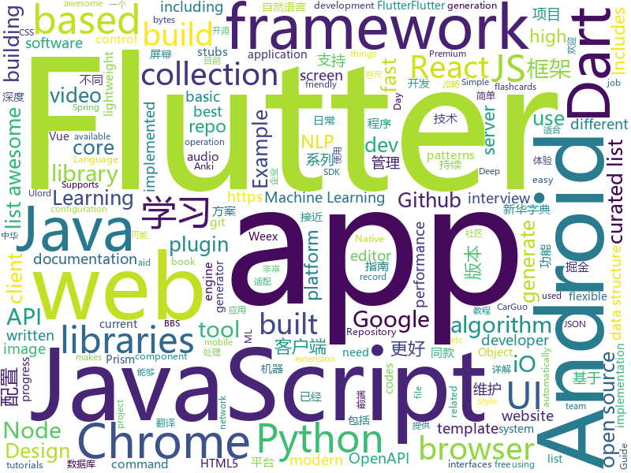

# 2018-08-22
See what the GitHub community is most excited about today.

## python
* [chinese-xinhua](https://github.com/pwxcoo/chinese-xinhua)(**770 stars today**): 中华新华字典数据库。包括歇后语，成语，词语，汉字。提供新华字典API。
* [vid2vid](https://github.com/NVIDIA/vid2vid)(**773 stars today**): Pytorch implementation of our method for high-resolution (e.g. 2048x1024) photorealistic video-to-video translation.
* [system-design-primer](https://github.com/donnemartin/system-design-primer)(**508 stars today**): Learn how to design large-scale systems. Prep for the system design interview. Includes Anki flashcards.
* [python-fire](https://github.com/google/python-fire)(**290 stars today**): Python Fire is a library for automatically generating command line interfaces (CLIs) from absolutely any Python object.
* [cheat.sh](https://github.com/chubin/cheat.sh)(**260 stars today**): the only cheat sheet you need
* [interactive-coding-challenges](https://github.com/donnemartin/interactive-coding-challenges)(**176 stars today**): Interactive Python coding interview challenges (algorithms and data structures). Includes Anki flashcards.
* [hall-of-fame](https://github.com/sourcerer-io/hall-of-fame)(**123 stars today**): 🏆Show some love to your repo contributors on README. Refreshes every hour.
* [Deep-Learning-World](https://github.com/astorfi/Deep-Learning-World)(**112 stars today**): 📡Organized Resources for Deep Learning Researchers and Developers
* [DaSiamRPN](https://github.com/foolwood/DaSiamRPN)(**104 stars today**): Distractor-aware Siamese Networks for Visual Object Tracking (ECCV2018)
* [fast_progress](https://github.com/fastai/fast_progress)(**98 stars today**): Simple and flexible progress bar for Jupyter Notebook and console
* [models](https://github.com/tensorflow/models)(**70 stars today**): Models and examples built with TensorFlow
* [Interview_Notes-Chinese](https://github.com/imhuay/Interview_Notes-Chinese)(**85 stars today**): 2018/2019/校招/春招/秋招/自然语言处理(NLP)/深度学习(Deep Learning)/机器学习(Machine Learning)/C/C++/Python/面试笔记
* [chinese-poetry](https://github.com/chinese-poetry/chinese-poetry)(**68 stars today**): 最全中华古诗词数据库, 唐宋两朝近一万四千古诗人, 接近5.5万首唐诗加26万宋诗. 两宋时期1564位词人，21050首词。
* [awesome-python](https://github.com/vinta/awesome-python)(**55 stars today**): A curated list of awesome Python frameworks, libraries, software and resources
* [face_recognition](https://github.com/ageitgey/face_recognition)(**50 stars today**): The world's simplest facial recognition api for Python and the command line
* [keras](https://github.com/keras-team/keras)(**48 stars today**): Deep Learning for humans
* [public-apis](https://github.com/toddmotto/public-apis)(**48 stars today**): A collective list of public JSON APIs for use in web development.
* [Tencent_Ads_Algo_2018](https://github.com/DiligentPanda/Tencent_Ads_Algo_2018)(**36 stars today**): This repository maintains codes for tencent advertisement algorithm competition 2018. Our codes ranked the 3rd place in the final round.
* [Python-100-Days](https://github.com/jackfrued/Python-100-Days)(**33 stars today**): Python - 100天从新手到大师
* [Yolo-pytorch](https://github.com/1991viet/Yolo-pytorch)(**41 stars today**): 
* [awesome-machine-learning](https://github.com/josephmisiti/awesome-machine-learning)(**34 stars today**): A curated list of awesome Machine Learning frameworks, libraries and software.
* [django](https://github.com/django/django)(**29 stars today**): The Web framework for perfectionists with deadlines.
* [rescuekerala](https://github.com/IEEEKeralaSection/rescuekerala)(**24 stars today**): Website for coordinating rehabilitation of people affected in the 2018 Kerala Floods
* [AiLearning](https://github.com/apachecn/AiLearning)(**29 stars today**): AiLearning: 机器学习 - MachineLearning - ML、深度学习 - DeepLearning - DL、自然语言处理 NLP
* [youtube-dl](https://github.com/rg3/youtube-dl)(**33 stars today**): Command-line program to download videos from YouTube.com and other video sites

## java
* [AndroidAutoSize](https://github.com/JessYanCoding/AndroidAutoSize)(**286 stars today**): A low-cost Android screen adaptation solution (今日头条屏幕适配方案终极版，一个极低成本的 Android 屏幕适配方案).
* [GlobalWarming](https://github.com/nsporillo/GlobalWarming)(**260 stars today**): Spigot plugin that adds game changing global warming mechanics
* [Android-Animation-Set](https://github.com/OCNYang/Android-Animation-Set)(**167 stars today**): 🦄Android 所有动画系列详尽教程。 Explain all animations in Android.
* [JCSprout](https://github.com/crossoverJie/JCSprout)(**112 stars today**): 👨‍🎓Java Core Sprout : basic, concurrent, algorithm
* [RuleView](https://github.com/zjun615/RuleView)(**94 stars today**): 卷尺系列控件，包含：普通卷尺（如：体重）、金额尺、时间尺
* [java-design-patterns](https://github.com/iluwatar/java-design-patterns)(**74 stars today**): Design patterns implemented in Java
* [APIJSON](https://github.com/TommyLemon/APIJSON)(**77 stars today**): 🚀后端接口和文档自动化，前端(客户端) 定制返回JSON的数据和结构！
* [proxyee-down](https://github.com/proxyee-down-org/proxyee-down)(**68 stars today**): http下载工具，基于http代理，支持多连接分块下载
* [jetbrains-agent](https://github.com/pengzhile/jetbrains-agent)(**63 stars today**): Jetbrains License Server Crack
* [spring-boot](https://github.com/spring-projects/spring-boot)(**39 stars today**): Spring Boot
* [tutorials](https://github.com/eugenp/tutorials)(**23 stars today**): The "REST With Spring" Course:
* [elasticsearch](https://github.com/elastic/elasticsearch)(**41 stars today**): Open Source, Distributed, RESTful Search Engine
* [spring-framework](https://github.com/spring-projects/spring-framework)(**32 stars today**): Spring Framework
* [SpringCloudLearning](https://github.com/forezp/SpringCloudLearning)(**36 stars today**): 《史上最简单的Spring Cloud教程源码》
* [interviews](https://github.com/kdn251/interviews)(**40 stars today**): Everything you need to know to get the job.
* [incubator-dubbo](https://github.com/apache/incubator-dubbo)(**32 stars today**): Apache Dubbo (incubating) is a high-performance, java based, open source RPC framework.
* [Java-Guide](https://github.com/Snailclimb/Java-Guide)(**34 stars today**): 📖Java Guide ： A core knowledge that most Java programmers need to master
* [usc-utils-api](https://github.com/UlordChain/usc-utils-api)(**36 stars today**): 
* [symphony](https://github.com/b3log/symphony)(**32 stars today**): 🎶A modern community (forum/BBS/SNS/blog) platform written in Java. 一个用 Java 实现的现代化社区（论坛/BBS/社交网络/博客）平台。https://hacpai.com
* [Sentinel](https://github.com/alibaba/Sentinel)(**32 stars today**): A lightweight flow-control library providing high-available protection and monitoring (高可用防护的流量管理框架)
* [Ulord-Sidechain](https://github.com/UlordChain/Ulord-Sidechain)(**33 stars today**): Ulord-Sidechain is a Secondary chain for Ulord implemented in Java, uses USC protocol
* [weixin-java-tools](https://github.com/Wechat-Group/weixin-java-tools)(**27 stars today**): 全能微信Java开发工具包，支持包括微信支付、开放平台、小程序、企业号和公众号等的开发
* [apollo](https://github.com/ctripcorp/apollo)(**23 stars today**): Apollo（阿波罗）是携程框架部门研发的分布式配置中心，能够集中化管理应用不同环境、不同集群的配置，配置修改后能够实时推送到应用端，并且具备规范的权限、流程治理等特性，适用于微服务配置管理场景。
* [guava](https://github.com/google/guava)(**25 stars today**): Google core libraries for Java
* [WMRouter](https://github.com/meituan/WMRouter)(**29 stars today**): WMRouter是一款Android路由框架，基于组件化的设计思路，有功能灵活强大、使用简单的特点。

## unknown
* [100-Days-Of-ML-Code](https://github.com/Avik-Jain/100-Days-Of-ML-Code)(**283 stars today**): 100 Days of ML Coding
* [stanford-cs-229-machine-learning](https://github.com/afshinea/stanford-cs-229-machine-learning)(**261 stars today**): VIP cheatsheets for Stanford's CS 229 Machine Learning
* [CS-Notes](https://github.com/CyC2018/CS-Notes)(**234 stars today**): 📚Computer Science Learning Notes
* [InterviewMap](https://github.com/InterviewMap/InterviewMap)(**226 stars today**): Build the best interview map. The current content includes JS, network, browser related, performance optimization, security, framework, Git, data structure, algorithm, etc.
* [UhttBarcodeReference](https://github.com/papyrussolution/UhttBarcodeReference)(**203 stars today**): Universe-HTT barcode reference
* [unmaintainable-code](https://github.com/Droogans/unmaintainable-code)(**200 stars today**): A more maintainable, easier to share version of the infamous http://mindprod.com/jgloss/unmain.html
* [Red-Teaming-Toolkit](https://github.com/infosecn1nja/Red-Teaming-Toolkit)(**131 stars today**): A collection of open source and commercial tools that aid in red team operations.
* [You-Dont-Know-JS](https://github.com/getify/You-Dont-Know-JS)(**81 stars today**): A book series on JavaScript. @YDKJS on twitter.
* [developer-roadmap](https://github.com/kamranahmedse/developer-roadmap)(**76 stars today**): Roadmap to becoming a web developer in 2018
* [gitignore](https://github.com/github/gitignore)(**54 stars today**): A collection of useful .gitignore templates
* [Front-End-Performance-Checklist](https://github.com/thedaviddias/Front-End-Performance-Checklist)(**67 stars today**): 🎮The only Front-End Performance Checklist that runs faster than the others
* [awesome](https://github.com/sindresorhus/awesome)(**65 stars today**): 😎Curated list of awesome lists
* [free-programming-books](https://github.com/EbookFoundation/free-programming-books)(**61 stars today**): 📚Freely available programming books
* [awesome-vue](https://github.com/vuejs/awesome-vue)(**54 stars today**): 🎉A curated list of awesome things related to Vue.js
* [project-based-learning](https://github.com/tuvtran/project-based-learning)(**40 stars today**): Curated list of project-based tutorials
* [English-level-up-tips-for-Chinese](https://github.com/byoungd/English-level-up-tips-for-Chinese)(**39 stars today**): 可能是让你受益匪浅的英语进阶指南
* [job-model](https://github.com/xudafeng/job-model)(**35 stars today**): 蚂蚁金服 - 国际事业群 - 前端 招聘
* [awesome-flutter](https://github.com/Solido/awesome-flutter)(**34 stars today**): An awesome list that curates the best Flutter libraries, tools, tutorials, articles and more.
* [iCSS](https://github.com/chokcoco/iCSS)(**34 stars today**): 谈谈一些有趣的 CSS 话题
* [awesome-react](https://github.com/enaqx/awesome-react)(**33 stars today**): A collection of awesome things regarding React ecosystem.
* [build-your-own-x](https://github.com/danistefanovic/build-your-own-x)(**29 stars today**): 🤓Build your own (insert technology here)
* [Video-Engine](https://github.com/UlordChain/Video-Engine)(**32 stars today**): 
* [nodebestpractices](https://github.com/i0natan/nodebestpractices)(**29 stars today**): The largest Node.JS best practices list (August 2018)
* [gold-miner](https://github.com/xitu/gold-miner)(**29 stars today**): 🥇掘金翻译计划，可能是世界最大最好的英译中技术社区，最懂读者和译者的翻译平台：
* [android-architecture](https://github.com/googlesamples/android-architecture)(**24 stars today**): A collection of samples to discuss and showcase different architectural tools and patterns for Android apps.

## javascript
* [puppeteer-recorder](https://github.com/checkly/puppeteer-recorder)(**545 stars today**): Puppeteer recorder is a Chrome extension that records your browser interactions and generates a Puppeteer script.
* [resources](https://github.com/BestDingSheng/resources)(**323 stars today**): 知名互联网企业内推资料整理 持续更新ing 。 目前已经维护四个微信群接近2000人，欢迎你的加入！
* [nanoid](https://github.com/ai/nanoid)(**273 stars today**): A tiny (145 bytes), secure, URL-friendly, unique string ID generator for JavaScript.
* [javascript-algorithms](https://github.com/trekhleb/javascript-algorithms)(**192 stars today**): Algorithms and data structures implemented in JavaScript with explanations and links to further readings
* [TheoremJS](https://github.com/arguiot/TheoremJS)(**162 stars today**): A Math library for computation in JavaScript
* [juejin](https://github.com/myvin/juejin)(**135 stars today**): 😄掘金小程序
* [vue](https://github.com/vuejs/vue)(**111 stars today**): 🖖A progressive, incrementally-adoptable JavaScript framework for building UI on the web.
* [react](https://github.com/facebook/react)(**106 stars today**): A declarative, efficient, and flexible JavaScript library for building user interfaces.
* [puppeteer](https://github.com/GoogleChrome/puppeteer)(**106 stars today**): Headless Chrome Node API
* [mdx-deck](https://github.com/jxnblk/mdx-deck)(**107 stars today**): MDX-based presentation decks
* [umbrella](https://github.com/franciscop/umbrella)(**106 stars today**): ☔️Lightweight javascript library for DOM manipulation and events
* [mobiledoc-kit](https://github.com/bustle/mobiledoc-kit)(**96 stars today**): A toolkit for building WYSIWYG editors with Mobiledoc
* [prism-react-renderer](https://github.com/FormidableLabs/prism-react-renderer)(**94 stars today**): 🖌️Renders highlighted Prism output to React (+ theming & vendored Prism)
* [navaid](https://github.com/lukeed/navaid)(**90 stars today**): A navigation aid (aka, router) for the browser in 850 bytes~!
* [Tone.js](https://github.com/Tonejs/Tone.js)(**87 stars today**): A Web Audio framework for making interactive music in the browser.
* [agadoo](https://github.com/Rich-Harris/agadoo)(**76 stars today**): Check whether a package is tree-shakeable
* [axios](https://github.com/axios/axios)(**73 stars today**): Promise based HTTP client for the browser and node.js
* [storybook](https://github.com/storybooks/storybook)(**69 stars today**): Interactive UI component dev & test: React, React Native, Vue, Angular
* [terminalizer](https://github.com/faressoft/terminalizer)(**72 stars today**): 🦄Record your terminal and generate animated gif images
* [free-programming-books-zh_CN](https://github.com/justjavac/free-programming-books-zh_CN)(**62 stars today**): 📚免费的计算机编程类中文书籍，欢迎投稿
* [create-react-app](https://github.com/facebook/create-react-app)(**62 stars today**): Create React apps with no build configuration.
* [ndb](https://github.com/GoogleChromeLabs/ndb)(**69 stars today**): ndb is an improved debugging experience for Node.js, enabled by Chrome DevTools
* [node](https://github.com/nodejs/node)(**55 stars today**): Node.js JavaScript runtime✨🐢🚀✨
* [javascript](https://github.com/airbnb/javascript)(**59 stars today**): JavaScript Style Guide
* [CommitTasks](https://github.com/ZeroX-DG/CommitTasks)(**62 stars today**): A combination between git commit & todo list🎉

## html
* [go-on-rails](https://github.com/railstack/go-on-rails)(**27 stars today**): 🚄Use Rails to Develop or Generate a Golang Application.
* [styleguide](https://github.com/google/styleguide)(**19 stars today**): Style guides for Google-originated open-source projects
* [TinyEditor](https://github.com/umpox/TinyEditor)(**21 stars today**): A functional HTML/CSS/JS editor in less than 400 bytes
* [fastText](https://github.com/facebookresearch/fastText)(**16 stars today**): Library for fast text representation and classification.
* [JavaScript30](https://github.com/wesbos/JavaScript30)(**10 stars today**): 30 Day Vanilla JS Challenge
* [AdminLTE](https://github.com/almasaeed2010/AdminLTE)(**7 stars today**): AdminLTE - Free Premium Admin control Panel Theme Based On Bootstrap 3.x
* [awesome-mac](https://github.com/jaywcjlove/awesome-mac)(**13 stars today**):  Now we have become very big, Different from the original idea. Collect premium software in various categories.
* [NLP-progress](https://github.com/sebastianruder/NLP-progress)(**12 stars today**): Repository to track the progress in Natural Language Processing (NLP), including the datasets and the current state-of-the-art for the most common NLP tasks.
* [blackeye](https://github.com/thelinuxchoice/blackeye)(**13 stars today**): The most complete Phishing Tool, with 32 templates +1 customizable
* [polymer](https://github.com/Polymer/polymer)(**13 stars today**): Build modern apps using web components
* [EIPs](https://github.com/ethereum/EIPs)(**11 stars today**): The Ethereum Improvement Proposal repository
* [Spoon-Knife](https://github.com/octocat/Spoon-Knife)(****): This repo is for demonstration purposes only.
* [website](https://github.com/kubernetes/website)(**5 stars today**): Kubernetes website and documentation repo:
* [electron-api-demos](https://github.com/electron/electron-api-demos)(**11 stars today**): Explore the Electron APIs
* [portainer](https://github.com/portainer/portainer)(**11 stars today**): Simple management UI for Docker
* [speedtest](https://github.com/adolfintel/speedtest)(**11 stars today**): Self-hosted HTML5 Speedtest. Easy setup, examples, configurable, responsive and mobile friendly. Supports PHP, Node, and more.
* [openapi-generator](https://github.com/OpenAPITools/openapi-generator)(**10 stars today**): OpenAPI Generator allows generation of API client libraries (SDK generation), server stubs, documentation and configuration automatically given an OpenAPI Spec (v2, v3)
* [Publii](https://github.com/GetPublii/Publii)(**10 stars today**): Publii is a desktop-based CMS for Windows and Mac that makes creating static websites fast and hassle-free, even for beginners.
* [javascript-tutorial-en](https://github.com/iliakan/javascript-tutorial-en)(**9 stars today**): Modern JavaScript Tutorial
* [google-udacity-scholars18.github.io](https://github.com/google-udacity-scholars18/google-udacity-scholars18.github.io)(**7 stars today**): Showcase of student project built for 2018 Google Developer Scholarship
* [chilipie-kiosk](https://github.com/futurice/chilipie-kiosk)(**10 stars today**): Easy-to-use Raspberry Pi image for booting directly into full-screen Chrome, with built-in convenience features for unattended operation. Perfect for dashboards and build monitors.
* [istio.github.io](https://github.com/istio/istio.github.io)(**7 stars today**): Source for the istio.io site
* [swagger-codegen](https://github.com/swagger-api/swagger-codegen)(**7 stars today**): swagger-codegen contains a template-driven engine to generate documentation, API clients and server stubs in different languages by parsing your OpenAPI / Swagger definition.
* [goawk](https://github.com/benhoyt/goawk)(**9 stars today**): GoAWK: an AWK interpreter written in Go
* [pipeline](https://github.com/PipelineAI/pipeline)(**8 stars today**): PipelineAI: Real-Time Enterprise AI Platform

## dart
* [flutter](https://github.com/flutter/flutter)(**86 stars today**): Flutter makes it easy and fast to build beautiful mobile apps.
* [FlutterScreens](https://github.com/samarthagarwal/FlutterScreens)(**17 stars today**): A collection of Screens with attractive UIs built with Flutter ready to be used in your applications.
* [GSYGithubAppFlutter](https://github.com/CarGuo/GSYGithubAppFlutter)(**16 stars today**): 超完整的Flutter项目，功能丰富，适合学习和日常使用。GSYGithubApp系列的优势：我们目前已经拥有Flutter、Weex、ReactNative三个版本。 功能齐全，项目框架内技术涉及面广，完成度高，持续维护，配套文章，适合全面学习，跨框架对比参考。跨平台的开源Github客户端App，更好的体验，更丰富的功能，旨在更好的日常管理和维护个人Github，提供更好更方便的驾车体验～～Σ(￣。￣ﾉ)ﾉ。同款Weex版本 ： https://github.com/CarGuo/GSYGithubAppWeex 、同款React Native版本 ： https://github.com/CarGuo/GSYGithubApp
* [Flutter-learning](https://github.com/AweiLoveAndroid/Flutter-learning)(**12 stars today**): 🔥👍🌟⭐️⭐️⭐️Flutter从配置安装到填坑指南详解，Flutter相关Demo解读，项目实例，Dart语法详解
* [dio](https://github.com/flutterchina/dio)(**11 stars today**): A powerful Http client for Dart, which supports Interceptors, FormData, Request Cancellation, File Downloading, Timeout etc.
* [plugins](https://github.com/flutter/plugins)(**7 stars today**): Plugins for Flutter, including FlutterFire, maintained by the Flutter team
* [flutter-examples](https://github.com/nisrulz/flutter-examples)(**8 stars today**): [Examples] Simple basic isolated apps, for budding flutter devs.
* [rxdart](https://github.com/ReactiveX/rxdart)(**5 stars today**): The Reactive Extensions for Dart
* [angular_components](https://github.com/dart-lang/angular_components)(****): The official Material Design components for AngularDart. Used at Google in production apps.
* [flutter-mobile](https://github.com/invoiceninja/flutter-mobile)(****): iOS/Android apps for Invoice Ninja built with Flutter
* [flutter_jobs_app](https://github.com/Rahiche/flutter_jobs_app)(****): Flutter jobs borad app created using flutter
* [audioplayer](https://github.com/luanpotter/audioplayer)(****): A Flutter plugin to play multiple audio files simultaneously (Android/iOS)
* [flutter_zoomable_image](https://github.com/perlatus/flutter_zoomable_image)(****): A plugin for panning and zooming images by touch.
* [chromedeveditor](https://github.com/googlearchive/chromedeveditor)(****): Chrome Dev Editor is a developer tool for building apps on the Chrome platform - Chrome Apps and Web Apps, in JavaScript or Dart. (NO LONGER IN ACTIVE DEVELOPMENT)
* [sdk](https://github.com/dart-lang/sdk)(****): The Dart SDK, including the VM, dart2js, core libraries, and more.
* [flutter-osc](https://github.com/yubo725/flutter-osc)(****): 基于Google Flutter的开源中国客户端，支持Android和iOS。
* [inKino](https://github.com/roughike/inKino)(****): inKino - A cross platform movie and showtime browser for Finnkino cinemas, made with Flutter.
* [hauberk](https://github.com/munificent/hauberk)(****): A web-based roguelike written in Dart.
* [flutter_architecture_samples](https://github.com/brianegan/flutter_architecture_samples)(****): TodoMVC for Flutter
* [Flutter-UI-Kit](https://github.com/iampawan/Flutter-UI-Kit)(****): Flutter app for collection of UI in a UIKit
* [angular](https://github.com/dart-lang/angular)(****): Fast and productive web framework provided by Dart
* [FlutterExampleApps](https://github.com/iampawan/FlutterExampleApps)(****): [Example APPS] Basic Flutter apps, for flutter devs.
* [StageXL](https://github.com/bp74/StageXL)(****): A fast and universal 2D rendering engine for HTML5 and Dart.
* [zhihu-flutter](https://github.com/HackSoul/zhihu-flutter)(****): Flutter 高仿知乎 UI，非常漂亮，也非常流畅，flutter build apk 或 flutter build ios 之后更流畅
* [dart-sass](https://github.com/sass/dart-sass)(****): A Dart implementation of Sass.

## WordCloud

