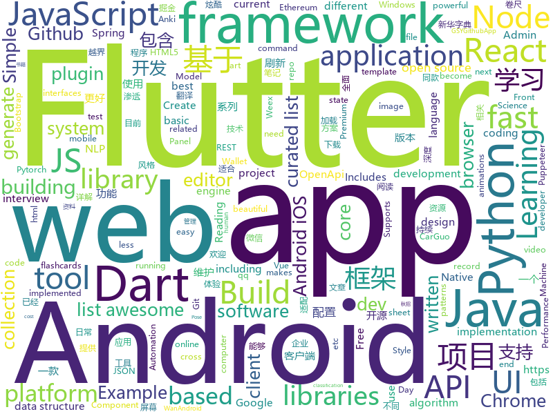

# 2018-08-24
See what the GitHub community is most excited about today.

## python
* [chinese-xinhua](https://github.com/pwxcoo/chinese-xinhua)(**258 stars today**): 中华新华字典数据库。包括歇后语，成语，词语，汉字。提供新华字典API。
* [vid2vid](https://github.com/NVIDIA/vid2vid)(**252 stars today**): Pytorch implementation of our method for high-resolution (e.g. 2048x1024) photorealistic video-to-video translation.
* [interactive-coding-challenges](https://github.com/donnemartin/interactive-coding-challenges)(**242 stars today**): Interactive Python coding interview challenges (algorithms and data structures). Includes Anki flashcards.
* [system-design-primer](https://github.com/donnemartin/system-design-primer)(**185 stars today**): Learn how to design large-scale systems. Prep for the system design interview. Includes Anki flashcards.
* [algo](https://github.com/trailofbits/algo)(**184 stars today**): Set up a personal IPSEC VPN in the cloud
* [home-assistant](https://github.com/home-assistant/home-assistant)(**116 stars today**): 🏡Open-source home automation platform running on Python 3
* [python-fire](https://github.com/google/python-fire)(**107 stars today**): Python Fire is a library for automatically generating command line interfaces (CLIs) from absolutely any Python object.
* [human-pose-estimation.pytorch](https://github.com/Microsoft/human-pose-estimation.pytorch)(**93 stars today**): The project is official implement of our ECCV2018 paper "Simple Baselines for Human Pose Estimation and Tracking(https://arxiv.org/abs/1804.06208)"
* [Photon](https://github.com/s0md3v/Photon)(**92 stars today**): Incredibly fast crawler designed for reconnaissance.
* [models](https://github.com/tensorflow/models)(**65 stars today**): Models and examples built with TensorFlow
* [cheat.sh](https://github.com/chubin/cheat.sh)(**74 stars today**): the only cheat sheet you need
* [awesome-python](https://github.com/vinta/awesome-python)(**59 stars today**): A curated list of awesome Python frameworks, libraries, software and resources
* [Algorithm_Interview_Notes-Chinese](https://github.com/imhuay/Algorithm_Interview_Notes-Chinese)(**54 stars today**): 2018/2019/校招/春招/秋招/自然语言处理(NLP)/深度学习(Deep Learning)/机器学习(Machine Learning)/C/C++/Python/面试笔记
* [face_recognition](https://github.com/ageitgey/face_recognition)(**52 stars today**): The world's simplest facial recognition api for Python and the command line
* [keras](https://github.com/keras-team/keras)(**41 stars today**): Deep Learning for humans
* [penetration](https://github.com/w1109790800/penetration)(**50 stars today**): 渗透 超全面的渗透资料💯包含：0day，xss，sql注入，提权……
* [umap](https://github.com/lmcinnes/umap)(**50 stars today**): Uniform Manifold Approximation and Projection
* [asciify](https://github.com/RameshAditya/asciify)(**50 stars today**): Convert any image into ASCII Art.✨
* [papermill](https://github.com/nteract/papermill)(**42 stars today**): 📚Parameterize, execute, and analyze notebooks
* [CVE-2018-15473-Exploit](https://github.com/Rhynorater/CVE-2018-15473-Exploit)(**37 stars today**): Exploit written in Python for CVE-2018-15473 with threading and export formats
* [InstaPy](https://github.com/timgrossmann/InstaPy)(**36 stars today**): 📷Instagram Bot - Like/Comment/Follow Automation Script
* [cocoapods-size](https://github.com/google/cocoapods-size)(**40 stars today**): 
* [django](https://github.com/django/django)(**33 stars today**): The Web framework for perfectionists with deadlines.
* [flask](https://github.com/pallets/flask)(**36 stars today**): The Python micro framework for building web applications.
* [public-apis](https://github.com/toddmotto/public-apis)(**35 stars today**): A collective list of public JSON APIs for use in web development.

## java
* [AndroidAutoSize](https://github.com/JessYanCoding/AndroidAutoSize)(**242 stars today**): A low-cost Android screen adaptation solution (今日头条屏幕适配方案终极版，一个极低成本的 Android 屏幕适配方案).
* [Java-Guide](https://github.com/Snailclimb/Java-Guide)(**156 stars today**): A core knowledge that most Java programmers need to master
* [X2C](https://github.com/iReaderAndroid/X2C)(**137 stars today**): 提升布局加载速度200%
* [JCSprout](https://github.com/crossoverJie/JCSprout)(**95 stars today**): 👨‍🎓Java Core Sprout : basic, concurrent, algorithm
* [WMRouter](https://github.com/meituan/WMRouter)(**101 stars today**): WMRouter是一款Android路由框架，基于组件化的设计思路，有功能灵活、使用简单的特点。
* [java-design-patterns](https://github.com/iluwatar/java-design-patterns)(**79 stars today**): Design patterns implemented in Java
* [RulerView](https://github.com/zjun615/RulerView)(**82 stars today**): 卷尺系列控件，包含：普通卷尺（如：体重）、金额尺、时间尺
* [Android-Animation-Set](https://github.com/OCNYang/Android-Animation-Set)(**77 stars today**): 🦄Android 所有动画系列详尽教程。 Explain all animations in Android.
* [spring-boot](https://github.com/spring-projects/spring-boot)(**47 stars today**): Spring Boot
* [proxyee-down](https://github.com/proxyee-down-org/proxyee-down)(**54 stars today**): http下载工具，基于http代理，支持多连接分块下载
* [Reading](https://github.com/Hankkin/Reading)(**52 stars today**): Reading是一款基于WanAndroid OpenApi开发的阅读类工具，如果你是一个热衷于Android开发者，那么这款软件能帮助你阅读精品Android文章。 同时Reading中还包含"英文单词"、"账号本子"、"天气"、"查单词"、"快递查询"等小工具。项目基于"Kotlin+MVP"架构开发，风格大概也许属于Material Desgin原质化风格，包含主题颜色切换、百变Logo、 等功能。在此感谢WanAndroid的OpenApi,以及其它开源项目的贡献。
* [spring-framework](https://github.com/spring-projects/spring-framework)(**36 stars today**): Spring Framework
* [APIJSON](https://github.com/TommyLemon/APIJSON)(**41 stars today**): 🚀后端接口和文档自动化，前端(客户端) 定制返回JSON的数据和结构！
* [weixin-java-tools](https://github.com/Wechat-Group/weixin-java-tools)(**38 stars today**): 全能微信Java开发工具包，支持包括微信支付、开放平台、小程序、企业号和公众号等的开发
* [tutorials](https://github.com/eugenp/tutorials)(**24 stars today**): The "REST With Spring" Course:
* [SmartRefreshLayout](https://github.com/scwang90/SmartRefreshLayout)(**36 stars today**): 🔥下拉刷新、上拉加载、二级刷新、淘宝二楼、RefreshLayout、OverScroll，Android智能下拉刷新框架，支持越界回弹、越界拖动，具有极强的扩展性，集成了几十种炫酷的Header和 Footer。
* [elasticsearch](https://github.com/elastic/elasticsearch)(**36 stars today**): Open Source, Distributed, RESTful Search Engine
* [solo](https://github.com/b3log/solo)(**37 stars today**): 🎸A small and beautiful blogging system written in Java. 一款小而美的 Java 博客系统。
* [AVdownloader-Face](https://github.com/KirieHaruna/AVdownloader-Face)(**25 stars today**): 一个基于java的av人脸识别自动下载器
* [guava](https://github.com/google/guava)(**28 stars today**): Google core libraries for Java
* [okhttp](https://github.com/square/okhttp)(**29 stars today**): An HTTP+HTTP/2 client for Android and Java applications.
* [jib](https://github.com/GoogleContainerTools/jib)(**30 stars today**): ⛵️Build container images for your Java applications.
* [apollo](https://github.com/ctripcorp/apollo)(**27 stars today**): Apollo（阿波罗）是携程框架部门研发的分布式配置中心，能够集中化管理应用不同环境、不同集群的配置，配置修改后能够实时推送到应用端，并且具备规范的权限、流程治理等特性，适用于微服务配置管理场景。
* [lottie-android](https://github.com/airbnb/lottie-android)(**27 stars today**): Render After Effects animations natively on Android and iOS, Web, and React Native
* [interviews](https://github.com/kdn251/interviews)(**26 stars today**): Everything you need to know to get the job.

## unknown
* [CS-Interview-Knowledge-Map](https://github.com/InterviewMap/CS-Interview-Knowledge-Map)(**944 stars today**): Build the best interview map. The current content includes JS, network, browser related, performance optimization, security, framework, Git, data structure, algorithm, etc.
* [stanford-cs-229-machine-learning](https://github.com/afshinea/stanford-cs-229-machine-learning)(**458 stars today**): VIP cheatsheets for Stanford's CS 229 Machine Learning
* [100-Days-Of-ML-Code](https://github.com/Avik-Jain/100-Days-Of-ML-Code)(**333 stars today**): 100 Days of ML Coding
* [CS-Notes](https://github.com/CyC2018/CS-Notes)(**105 stars today**): 📚Computer Science Learning Notes
* [You-Dont-Know-JS](https://github.com/getify/You-Dont-Know-JS)(**104 stars today**): A book series on JavaScript. @YDKJS on twitter.
* [developer-roadmap](https://github.com/kamranahmedse/developer-roadmap)(**78 stars today**): Roadmap to becoming a web developer in 2018
* [unmaintainable-code](https://github.com/Droogans/unmaintainable-code)(**80 stars today**): A more maintainable, easier to share version of the infamous http://mindprod.com/jgloss/unmain.html
* [awesome](https://github.com/sindresorhus/awesome)(**68 stars today**): 😎Curated list of awesome lists
* [project-based-learning](https://github.com/tuvtran/project-based-learning)(**58 stars today**): Curated list of project-based tutorials
* [gitignore](https://github.com/github/gitignore)(**43 stars today**): A collection of useful .gitignore templates
* [awesome-laravel-nova](https://github.com/its-awesome/awesome-laravel-nova)(**57 stars today**): Curated list of Laravel Nova resources
* [awesome-vue](https://github.com/vuejs/awesome-vue)(**48 stars today**): 🎉A curated list of awesome things related to Vue.js
* [Front-End-Performance-Checklist](https://github.com/thedaviddias/Front-End-Performance-Checklist)(**47 stars today**): 🎮The only Front-End Performance Checklist that runs faster than the others
* [coding-interview-university](https://github.com/jwasham/coding-interview-university)(**36 stars today**): A complete computer science study plan to become a software engineer.
* [dadsresume](https://github.com/runvnc/dadsresume)(**41 stars today**): My dad's resume and skills from 1980
* [build-your-own-x](https://github.com/danistefanovic/build-your-own-x)(**37 stars today**): 🤓Build your own (insert technology here)
* [awesome-flutter](https://github.com/Solido/awesome-flutter)(**34 stars today**): An awesome list that curates the best Flutter libraries, tools, tutorials, articles and more.
* [nodebestpractices](https://github.com/i0natan/nodebestpractices)(**31 stars today**): The largest Node.JS best practices list (August 2018)
* [android-architecture](https://github.com/googlesamples/android-architecture)(**27 stars today**): A collection of samples to discuss and showcase different architectural tools and patterns for Android apps.
* [awesome-wasm-zh](https://github.com/chai2010/awesome-wasm-zh)(**27 stars today**): WebAssembly(wasm)资源精选 - 中文版
* [polyrnn-pp-pytorch](https://github.com/fidler-lab/polyrnn-pp-pytorch)(**25 stars today**): PyTorch training/tool code for Polygon-RNN++ (CVPR 2018)
* [awesome-c](https://github.com/uhub/awesome-c)(**25 stars today**): A curated list of awesome C frameworks, libraries and software.
* [gold-miner](https://github.com/xitu/gold-miner)(**23 stars today**): 🥇掘金翻译计划，可能是世界最大最好的英译中技术社区，最懂读者和译者的翻译平台：
* [awesome-nodejs](https://github.com/sindresorhus/awesome-nodejs)(**22 stars today**): ⚡️Delightful Node.js packages and resources
* [Red-Teaming-Toolkit](https://github.com/infosecn1nja/Red-Teaming-Toolkit)(**22 stars today**): A collection of open source and commercial tools that aid in red team operations.

## javascript
* [resources](https://github.com/BestDingSheng/resources)(**254 stars today**): 知名互联网企业内推资料整理 持续更新ing 。 目前已经维护四个微信群接近2000人，欢迎你的加入！
* [puppeteer-recorder](https://github.com/checkly/puppeteer-recorder)(**184 stars today**): Puppeteer recorder is a Chrome extension that records your browser interactions and generates a Puppeteer script.
* [svg-3d-builder](https://github.com/captainwz/svg-3d-builder)(**163 stars today**): an elaborate tool to create 3d model with svg
* [vue](https://github.com/vuejs/vue)(**141 stars today**): 🖖A progressive, incrementally-adoptable JavaScript framework for building UI on the web.
* [react](https://github.com/facebook/react)(**117 stars today**): A declarative, efficient, and flexible JavaScript library for building user interfaces.
* [javascript-algorithms](https://github.com/trekhleb/javascript-algorithms)(**109 stars today**): Algorithms and data structures implemented in JavaScript with explanations and links to further readings
* [free-programming-books-zh_CN](https://github.com/justjavac/free-programming-books-zh_CN)(**81 stars today**): 📚免费的计算机编程类中文书籍，欢迎投稿
* [spectrum](https://github.com/withspectrum/spectrum)(**91 stars today**): Simple, powerful online communities.
* [puppeteer](https://github.com/GoogleChrome/puppeteer)(**80 stars today**): Headless Chrome Node API
* [axios](https://github.com/axios/axios)(**76 stars today**): Promise based HTTP client for the browser and node.js
* [json-server](https://github.com/typicode/json-server)(**71 stars today**): Get a full fake REST API with zero coding in less than 30 seconds (seriously)
* [create-react-app](https://github.com/facebook/create-react-app)(**58 stars today**): Create React apps with no build configuration.
* [immer](https://github.com/mweststrate/immer)(**71 stars today**): Create the next immutable state by mutating the current one
* [terminalizer](https://github.com/faressoft/terminalizer)(**64 stars today**): 🦄Record your terminal and generate animated gif images
* [javascript](https://github.com/airbnb/javascript)(**58 stars today**): JavaScript Style Guide
* [golden-wallet-react-native](https://github.com/goldennetwork/golden-wallet-react-native)(**43 stars today**): Golden Wallet - Ethereum Wallet & ERC20 Tokens
* [react-native](https://github.com/facebook/react-native)(**54 stars today**): A framework for building native apps with React.
* [insomnia](https://github.com/getinsomnia/insomnia)(**58 stars today**): Cross-platform HTTP and GraphQL Client
* [storybook](https://github.com/storybooks/storybook)(**56 stars today**): Interactive UI component dev & test: React, React Native, Vue, Angular
* [evergreen](https://github.com/segmentio/evergreen)(**56 stars today**): 🌲Evergreen React UI Framework by Segment
* [marktext](https://github.com/marktext/marktext)(**56 stars today**): 📝Next generation markdown editor, running on platforms of MacOS Windows and Linux.
* [TheoremJS](https://github.com/arguiot/TheoremJS)(**54 stars today**): A Math library for computation in JavaScript📕
* [juejin](https://github.com/myvin/juejin)(**46 stars today**): 😄掘金小程序
* [codesandbox-client](https://github.com/CompuIves/codesandbox-client)(**50 stars today**): An online code editor tailored for web application development🏖️
* [node](https://github.com/nodejs/node)(**43 stars today**): Node.js JavaScript runtime✨🐢🚀✨

## html
* [styleguide](https://github.com/google/styleguide)(**31 stars today**): Style guides for Google-originated open-source projects
* [awesome-mac](https://github.com/jaywcjlove/awesome-mac)(**33 stars today**):  Now we have become very big, Different from the original idea. Collect premium software in various categories.
* [AdminLTE](https://github.com/almasaeed2010/AdminLTE)(**28 stars today**): AdminLTE - Free Premium Admin control Panel Theme Based On Bootstrap 3.x
* [JavaScript30](https://github.com/wesbos/JavaScript30)(**14 stars today**): 30 Day Vanilla JS Challenge
* [Spoon-Knife](https://github.com/octocat/Spoon-Knife)(****): This repo is for demonstration purposes only.
* [fastText](https://github.com/facebookresearch/fastText)(**17 stars today**): Library for fast text representation and classification.
* [TinyEditor](https://github.com/umpox/TinyEditor)(**18 stars today**): A functional HTML/CSS/JS editor in less than 400 bytes
* [speedtest](https://github.com/adolfintel/speedtest)(**15 stars today**): Self-hosted HTML5 Speedtest. Easy setup, examples, configurable, responsive and mobile friendly. Supports PHP, Node, and more.
* [NLP-progress](https://github.com/sebastianruder/NLP-progress)(**15 stars today**): Repository to track the progress in Natural Language Processing (NLP), including the datasets and the current state-of-the-art for the most common NLP tasks.
* [goawk](https://github.com/benhoyt/goawk)(**15 stars today**): GoAWK: an AWK interpreter written in Go
* [roll20-character-sheets](https://github.com/Roll20/roll20-character-sheets)(**11 stars today**): Character sheet templates created by the community for use in Roll20.
* [primeng](https://github.com/primefaces/primeng)(**11 stars today**): UI Components for Angular
* [Publii](https://github.com/GetPublii/Publii)(**12 stars today**): Publii is a desktop-based CMS for Windows and Mac that makes creating static websites fast and hassle-free, even for beginners.
* [singularity](https://github.com/nccgroup/singularity)(**10 stars today**): A DNS rebinding attack framework
* [patchwork](https://github.com/jlord/patchwork)(****): All the Git-it Workshop completers!
* [electron-api-demos](https://github.com/electron/electron-api-demos)(**9 stars today**): Explore the Electron APIs
* [deeplearning_ai_books](https://github.com/fengdu78/deeplearning_ai_books)(**9 stars today**): deeplearning.ai（吴恩达老师的深度学习课程笔记及资源）
* [go-on-rails](https://github.com/railstack/go-on-rails)(**10 stars today**): 🚄Use Rails to Develop or Generate a Golang Application.
* [portainer](https://github.com/portainer/portainer)(**8 stars today**): Simple management UI for Docker
* [EIPs](https://github.com/ethereum/EIPs)(**8 stars today**): The Ethereum Improvement Proposal repository
* [learning-area](https://github.com/mdn/learning-area)(**5 stars today**): Github repo for the MDN Learning Area.
* [gentelella](https://github.com/puikinsh/gentelella)(**8 stars today**): Free Bootstrap 3 Admin Template
* [swagger-codegen](https://github.com/swagger-api/swagger-codegen)(**8 stars today**): swagger-codegen contains a template-driven engine to generate documentation, API clients and server stubs in different languages by parsing your OpenAPI / Swagger definition.
* [OI-wiki](https://github.com/24OI/OI-wiki)(**7 stars today**): 🌟Wiki for OI / ACM-ICPC. （某大型游戏线上攻略，内含炫酷算术魔法）
* [ng-alain](https://github.com/cipchk/ng-alain)(**7 stars today**): ng-zorro-antd admin panel front-end framework

## dart
* [flutter](https://github.com/flutter/flutter)(**78 stars today**): Flutter makes it easy and fast to build beautiful mobile apps.
* [PullToRefresh](https://github.com/baoolong/PullToRefresh)(**25 stars today**): Flutter相关的项目QQ:277155832 Email:277155832@qq.com
* [GSYGithubAppFlutter](https://github.com/CarGuo/GSYGithubAppFlutter)(**16 stars today**): 超完整的Flutter项目，功能丰富，适合学习和日常使用。GSYGithubApp系列的优势：我们目前已经拥有Flutter、Weex、ReactNative三个版本。 功能齐全，项目框架内技术涉及面广，完成度高，持续维护，配套文章，适合全面学习，跨框架对比参考。跨平台的开源Github客户端App，更好的体验，更丰富的功能，旨在更好的日常管理和维护个人Github，提供更好更方便的驾车体验～～Σ(￣。￣ﾉ)ﾉ。同款Weex版本 ： https://github.com/CarGuo/GSYGithubAppWeex 、同款React Native版本 ： https://github.com/CarGuo/GSYGithubApp
* [wan_android_flutter](https://github.com/ywp0919/wan_android_flutter)(**16 stars today**): 使用Wan Android api 开始练习写第一个Flutter App.
* [Flutter-learning](https://github.com/AweiLoveAndroid/Flutter-learning)(**15 stars today**): 🔥👍🌟⭐️⭐️⭐️Flutter从配置安装到填坑指南详解，Flutter相关Demo解读，项目实例，Dart语法详解
* [plugins](https://github.com/flutter/plugins)(**11 stars today**): Plugins for Flutter, including FlutterFire, maintained by the Flutter team
* [dio](https://github.com/flutterchina/dio)(**10 stars today**): A powerful Http client for Dart, which supports Interceptors, FormData, Request Cancellation, File Downloading, Timeout etc.
* [fluwx](https://github.com/JarvanMo/fluwx)(**8 stars today**): A wechat plugin for flutter.
* [flutter-examples](https://github.com/nisrulz/flutter-examples)(**6 stars today**): [Examples] Simple basic isolated apps, for budding flutter devs.
* [sdk](https://github.com/dart-lang/sdk)(**6 stars today**): The Dart SDK, including the VM, dart2js, core libraries, and more.
* [audioplayer](https://github.com/luanpotter/audioplayer)(****): A Flutter plugin to play multiple audio files simultaneously (Android/iOS)
* [build](https://github.com/dart-lang/build)(****): A build system for Dart
* [grpc-dart](https://github.com/grpc/grpc-dart)(****): The Dart language implementation of gRPC.
* [flutter-geolocator](https://github.com/BaseflowIT/flutter-geolocator)(****): Android and iOS Geolocation plugin for Flutter
* [test](https://github.com/dart-lang/test)(****): A library for writing unit tests in Dart.
* [flutter_list_drag_and_drop](https://github.com/Norbert515/flutter_list_drag_and_drop)(****): An implementation of drag and drop for lists
* [chromedeveditor](https://github.com/googlearchive/chromedeveditor)(****): Chrome Dev Editor is a developer tool for building apps on the Chrome platform - Chrome Apps and Web Apps, in JavaScript or Dart. (NO LONGER IN ACTIVE DEVELOPMENT)
* [flutter-osc](https://github.com/yubo725/flutter-osc)(****): 基于Google Flutter的开源中国客户端，支持Android和iOS。
* [inKino](https://github.com/roughike/inKino)(****): inKino - A cross platform movie and showtime browser for Finnkino cinemas, made with Flutter.
* [hauberk](https://github.com/munificent/hauberk)(****): A web-based roguelike written in Dart.
* [flutter_architecture_samples](https://github.com/brianegan/flutter_architecture_samples)(****): TodoMVC for Flutter
* [Flutter-UI-Kit](https://github.com/iampawan/Flutter-UI-Kit)(****): Flutter app for collection of UI in a UIKit
* [FlutterExampleApps](https://github.com/iampawan/FlutterExampleApps)(****): [Example APPS] Basic Flutter apps, for flutter devs.
* [angular](https://github.com/dart-lang/angular)(****): Fast and productive web framework provided by Dart
* [StageXL](https://github.com/bp74/StageXL)(****): A fast and universal 2D rendering engine for HTML5 and Dart.

## WordCloud

