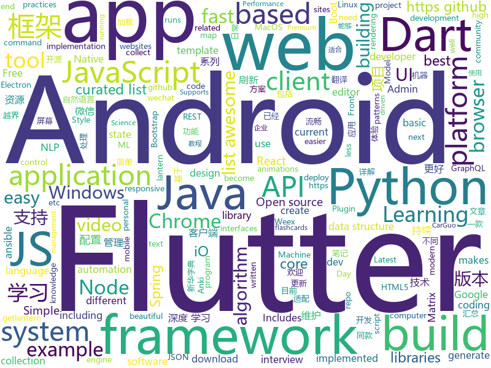

# 2018-08-25
See what the GitHub community is most excited about today.

## python
* [system-design-primer](https://github.com/donnemartin/system-design-primer)(**609 stars today**): Learn how to design large-scale systems. Prep for the system design interview. Includes Anki flashcards.
* [cheat.sh](https://github.com/chubin/cheat.sh)(**319 stars today**): the only cheat sheet you need
* [pyodide](https://github.com/iodide-project/pyodide)(**223 stars today**): The Python scientific stack, compiled to WebAssembly
* [vid2vid](https://github.com/NVIDIA/vid2vid)(**211 stars today**): Pytorch implementation of our method for high-resolution (e.g. 2048x1024) photorealistic video-to-video translation.
* [chinese-xinhua](https://github.com/pwxcoo/chinese-xinhua)(**165 stars today**): 中华新华字典数据库。包括歇后语，成语，词语，汉字。提供新华字典API。
* [interactive-coding-challenges](https://github.com/donnemartin/interactive-coding-challenges)(**165 stars today**): Interactive Python coding interview challenges (algorithms and data structures). Includes Anki flashcards.
* [home-assistant](https://github.com/home-assistant/home-assistant)(**137 stars today**): 🏡Open-source home automation platform running on Python 3
* [algo](https://github.com/trailofbits/algo)(**97 stars today**): Set up a personal IPSEC VPN in the cloud
* [models](https://github.com/tensorflow/models)(**67 stars today**): Models and examples built with TensorFlow
* [human-pose-estimation.pytorch](https://github.com/Microsoft/human-pose-estimation.pytorch)(**71 stars today**): The project is official implement of our ECCV2018 paper "Simple Baselines for Human Pose Estimation and Tracking(https://arxiv.org/abs/1804.06208)"
* [papermill](https://github.com/nteract/papermill)(**70 stars today**): 📚Parameterize, execute, and analyze notebooks
* [keras](https://github.com/keras-team/keras)(**49 stars today**): Deep Learning for humans
* [python-fire](https://github.com/google/python-fire)(**55 stars today**): Python Fire is a library for automatically generating command line interfaces (CLIs) from absolutely any Python object.
* [pygmy](https://github.com/amitt001/pygmy)(**53 stars today**): Open-source, feature rich & extensible url shortener + Analytics🍪
* [awesome-python](https://github.com/vinta/awesome-python)(**42 stars today**): A curated list of awesome Python frameworks, libraries, software and resources
* [face_recognition](https://github.com/ageitgey/face_recognition)(**36 stars today**): The world's simplest facial recognition api for Python and the command line
* [youtube-dl](https://github.com/rg3/youtube-dl)(**38 stars today**): Command-line program to download videos from YouTube.com and other video sites
* [django](https://github.com/django/django)(**29 stars today**): The Web framework for perfectionists with deadlines.
* [ansible](https://github.com/ansible/ansible)(**30 stars today**): Ansible is a radically simple IT automation platform that makes your applications and systems easier to deploy. Avoid writing scripts or custom code to deploy and update your applications — automate in a language that approaches plain English, using SSH, with no agents to install on remote systems. https://docs.ansible.com/ansible/
* [Algorithm_Interview_Notes-Chinese](https://github.com/imhuay/Algorithm_Interview_Notes-Chinese)(**32 stars today**): 2018/2019/校招/春招/秋招/自然语言处理(NLP)/深度学习(Deep Learning)/机器学习(Machine Learning)/C/C++/Python/面试笔记
* [InstaPy](https://github.com/timgrossmann/InstaPy)(**33 stars today**): 📷Instagram Bot - Like/Comment/Follow Automation Script
* [public-apis](https://github.com/toddmotto/public-apis)(**28 stars today**): A collective list of public JSON APIs for use in web development.
* [tldr](https://github.com/tldr-pages/tldr)(**31 stars today**): 📚Simplified and community-driven man pages
* [AiLearning](https://github.com/apachecn/AiLearning)(**26 stars today**): AiLearning: 机器学习 - MachineLearning - ML、深度学习 - DeepLearning - DL、自然语言处理 NLP
* [flask](https://github.com/pallets/flask)(**26 stars today**): The Python micro framework for building web applications.

## java
* [WMRouter](https://github.com/meituan/WMRouter)(**197 stars today**): WMRouter是一款Android路由框架，基于组件化的设计思路，有功能灵活、使用简单的特点。
* [Java-Guide](https://github.com/Snailclimb/Java-Guide)(**168 stars today**): A core knowledge that most Java programmers need to master
* [AndroidAutoSize](https://github.com/JessYanCoding/AndroidAutoSize)(**137 stars today**): A low-cost Android screen adaptation solution (今日头条屏幕适配方案终极版，一个极低成本的 Android 屏幕适配方案).
* [X2C](https://github.com/iReaderAndroid/X2C)(**131 stars today**): 提升布局加载速度200%
* [JCSprout](https://github.com/crossoverJie/JCSprout)(**70 stars today**): 👨‍🎓Java Core Sprout : basic, concurrent, algorithm
* [java-design-patterns](https://github.com/iluwatar/java-design-patterns)(**66 stars today**): Design patterns implemented in Java
* [spring-boot](https://github.com/spring-projects/spring-boot)(**57 stars today**): Spring Boot
* [RulerView](https://github.com/zjun615/RulerView)(**47 stars today**): 卷尺系列控件，包含：普通卷尺（如：体重）、金额尺、时间尺
* [elasticsearch](https://github.com/elastic/elasticsearch)(**38 stars today**): Open Source, Distributed, RESTful Search Engine
* [apollo](https://github.com/ctripcorp/apollo)(**38 stars today**): Apollo（阿波罗）是携程框架部门研发的分布式配置中心，能够集中化管理应用不同环境、不同集群的配置，配置修改后能够实时推送到应用端，并且具备规范的权限、流程治理等特性，适用于微服务配置管理场景。
* [Android-Animation-Set](https://github.com/OCNYang/Android-Animation-Set)(**40 stars today**): 🦄Android 所有动画系列详尽教程。 Explain all animations in Android.
* [spring-framework](https://github.com/spring-projects/spring-framework)(**31 stars today**): Spring Framework
* [interviews](https://github.com/kdn251/interviews)(**33 stars today**): Everything you need to know to get the job.
* [SmartRefreshLayout](https://github.com/scwang90/SmartRefreshLayout)(**32 stars today**): 🔥下拉刷新、上拉加载、二级刷新、淘宝二楼、RefreshLayout、OverScroll，Android智能下拉刷新框架，支持越界回弹、越界拖动，具有极强的扩展性，集成了几十种炫酷的Header和 Footer。
* [tutorials](https://github.com/eugenp/tutorials)(**14 stars today**): The "REST With Spring" Course:
* [APIJSON](https://github.com/TommyLemon/APIJSON)(**28 stars today**): 🚀后端接口和文档自动化，前端(客户端) 定制返回JSON的数据和结构！
* [guava](https://github.com/google/guava)(**27 stars today**): Google core libraries for Java
* [spring-boot-examples](https://github.com/ityouknow/spring-boot-examples)(**23 stars today**): about learning Spring Boot via examples. Spring Boot 技术栈示例代码，快速简单上手教程。
* [weixin-java-tools](https://github.com/Wechat-Group/weixin-java-tools)(**25 stars today**): 全能微信Java开发工具包，支持包括微信支付、开放平台、小程序、企业号和公众号等的开发
* [solo](https://github.com/b3log/solo)(**24 stars today**): 🎸A small and beautiful blogging system written in Java. 一款小而美的 Java 博客系统。
* [okhttp](https://github.com/square/okhttp)(**22 stars today**): An HTTP+HTTP/2 client for Android and Java applications.
* [AndroidUtilCode](https://github.com/Blankj/AndroidUtilCode)(**20 stars today**): 🔥Android developers should collect the following utils(updating).
* [Java](https://github.com/TheAlgorithms/Java)(**20 stars today**): All Algorithms implemented in Java
* [Sentinel](https://github.com/alibaba/Sentinel)(**20 stars today**): A lightweight flow-control library providing high-available protection and monitoring (高可用防护的流量管理框架)
* [jib](https://github.com/GoogleContainerTools/jib)(**22 stars today**): ⛵️Build container images for your Java applications.

## unknown
* [CS-Interview-Knowledge-Map](https://github.com/InterviewMap/CS-Interview-Knowledge-Map)(**500 stars today**): Build the best interview map. The current content includes JS, network, browser related, performance optimization, security, framework, Git, data structure, algorithm, etc.
* [CS-Notes](https://github.com/CyC2018/CS-Notes)(**431 stars today**): 📚Computer Science Learning Notes
* [stanford-cs-229-machine-learning](https://github.com/afshinea/stanford-cs-229-machine-learning)(**241 stars today**): VIP cheatsheets for Stanford's CS 229 Machine Learning
* [100-Days-Of-ML-Code](https://github.com/Avik-Jain/100-Days-Of-ML-Code)(**237 stars today**): 100 Days of ML Coding
* [InterviewMap](https://github.com/KieSun/InterviewMap)(**171 stars today**): 该项目是 fork 的，如果你觉得不错，可以前往主仓库支持一下。
* [developer-roadmap](https://github.com/kamranahmedse/developer-roadmap)(**71 stars today**): Roadmap to becoming a web developer in 2018
* [You-Dont-Know-JS](https://github.com/getify/You-Dont-Know-JS)(**75 stars today**): A book series on JavaScript. @YDKJS on twitter.
* [gitignore](https://github.com/github/gitignore)(**53 stars today**): A collection of useful .gitignore templates
* [awesome](https://github.com/sindresorhus/awesome)(**55 stars today**): 😎Curated list of awesome lists
* [AndroidArchitectureArticle](https://github.com/gonghuiyuan516/AndroidArchitectureArticle)(**59 stars today**): 🔥Android架构文章大全
* [awesome-vue](https://github.com/vuejs/awesome-vue)(**47 stars today**): 🎉A curated list of awesome things related to Vue.js
* [Front-End-Performance-Checklist](https://github.com/thedaviddias/Front-End-Performance-Checklist)(**48 stars today**): 🎮The only Front-End Performance Checklist that runs faster than the others
* [unmaintainable-code](https://github.com/Droogans/unmaintainable-code)(**46 stars today**): A more maintainable, easier to share version of the infamous http://mindprod.com/jgloss/unmain.html
* [dadsresume](https://github.com/runvnc/dadsresume)(**42 stars today**): My dad's resume and skills from 1980
* [coding-interview-university](https://github.com/jwasham/coding-interview-university)(**34 stars today**): A complete computer science study plan to become a software engineer.
* [learning-article](https://github.com/webproblem/learning-article)(**35 stars today**): 学习资源汇总，持续更新
* [MATRIX_Diary](https://github.com/MatrixAINetwork/MATRIX_Diary)(**25 stars today**): Matrix Trendings as well as Digests
* [awesome-flutter](https://github.com/Solido/awesome-flutter)(**31 stars today**): An awesome list that curates the best Flutter libraries, tools, tutorials, articles and more.
* [nodebestpractices](https://github.com/i0natan/nodebestpractices)(**34 stars today**): The largest Node.JS best practices list (August 2018)
* [MATRIX_WEEKLY-Q-As](https://github.com/MatrixAINetwork/MATRIX_WEEKLY-Q-As)(**24 stars today**): questions from Matrix community and answers from Matrix experts
* [build-your-own-x](https://github.com/danistefanovic/build-your-own-x)(**32 stars today**): 🤓Build your own (insert technology here)
* [KnowledgeMap](https://github.com/WechatMiniProgramKnowledgeMap/KnowledgeMap)(**32 stars today**): wechat mini program knowledge map
* [gold-miner](https://github.com/xitu/gold-miner)(**26 stars today**): 🥇掘金翻译计划，可能是世界最大最好的英译中技术社区，最懂读者和译者的翻译平台：
* [download](https://github.com/getlantern/download)(**25 stars today**): 🔴蓝灯最新版本下载 https://github.com/getlantern/download🔴Lantern Latest Download https://github.com/getlantern/lantern/releases/tag/latest🔴
* [android-architecture](https://github.com/googlesamples/android-architecture)(**23 stars today**): A collection of samples to discuss and showcase different architectural tools and patterns for Android apps.

## javascript
* [windows95](https://github.com/felixrieseberg/windows95)(**3,900 stars today**): 💩🚀Windows 95 in Electron. Runs on macOS, Linux, and Windows.
* [javascript-algorithms](https://github.com/trekhleb/javascript-algorithms)(**246 stars today**): Algorithms and data structures implemented in JavaScript with explanations and links to further readings
* [puppeteer-recorder](https://github.com/checkly/puppeteer-recorder)(**180 stars today**): Puppeteer recorder is a Chrome extension that records your browser interactions and generates a Puppeteer script.
* [resources](https://github.com/BestDingSheng/resources)(**160 stars today**): 知名互联网企业内推资料整理 持续更新ing 。 目前已经维护五个微信群接近3000人，欢迎你的加入！
* [vue](https://github.com/vuejs/vue)(**128 stars today**): 🖖A progressive, incrementally-adoptable JavaScript framework for building UI on the web.
* [json-server](https://github.com/typicode/json-server)(**110 stars today**): Get a full fake REST API with zero coding in less than 30 seconds (seriously)
* [ndb](https://github.com/GoogleChromeLabs/ndb)(**102 stars today**): ndb is an improved debugging experience for Node.js, enabled by Chrome DevTools
* [react](https://github.com/facebook/react)(**89 stars today**): A declarative, efficient, and flexible JavaScript library for building user interfaces.
* [ReactStateMuseum](https://github.com/GantMan/ReactStateMuseum)(**87 stars today**): A whirlwind tour of React state management systems by example
* [browsh](https://github.com/browsh-org/browsh)(**84 stars today**): A fully-modern text-based browser, rendering to TTY and browsers
* [immer](https://github.com/mweststrate/immer)(**80 stars today**): Create the next immutable state by mutating the current one
* [mdx-deck](https://github.com/jxnblk/mdx-deck)(**78 stars today**): MDX-based presentation decks
* [lottie-web](https://github.com/airbnb/lottie-web)(**71 stars today**): Render After Effects animations natively on Web, Android and iOS, and React Native. http://airbnb.io/lottie/
* [puppeteer](https://github.com/GoogleChrome/puppeteer)(**71 stars today**): Headless Chrome Node API
* [free-programming-books-zh_CN](https://github.com/justjavac/free-programming-books-zh_CN)(**62 stars today**): 📚免费的计算机编程类中文书籍，欢迎投稿
* [axios](https://github.com/axios/axios)(**62 stars today**): Promise based HTTP client for the browser and node.js
* [johnny-five](https://github.com/rwaldron/johnny-five)(**62 stars today**): JavaScript Robotics and IoT programming framework, developed at Bocoup.
* [awesome-wechat-weapp](https://github.com/justjavac/awesome-wechat-weapp)(**53 stars today**): 微信小程序开发资源汇总💯
* [marktext](https://github.com/marktext/marktext)(**53 stars today**): 📝Next generation markdown editor, running on platforms of MacOS Windows and Linux.
* [create-react-app](https://github.com/facebook/create-react-app)(**43 stars today**): Create React apps with no build configuration.
* [callapp-lib](https://github.com/suanmei/callapp-lib)(**50 stars today**): call native webview from webpage
* [javascript](https://github.com/airbnb/javascript)(**48 stars today**): JavaScript Style Guide
* [insomnia](https://github.com/getinsomnia/insomnia)(**52 stars today**): Cross-platform HTTP and GraphQL Client
* [svg-3d-builder](https://github.com/captainwz/svg-3d-builder)(**51 stars today**): an elaborate tool to create 3d model with svg
* [node](https://github.com/nodejs/node)(**44 stars today**): Node.js JavaScript runtime✨🐢🚀✨

## html
* [styleguide](https://github.com/google/styleguide)(**23 stars today**): Style guides for Google-originated open-source projects
* [awesome-mac](https://github.com/jaywcjlove/awesome-mac)(**25 stars today**):  Now we have become very big, Different from the original idea. Collect premium software in various categories.
* [AdminLTE](https://github.com/almasaeed2010/AdminLTE)(**22 stars today**): AdminLTE - Free Premium Admin control Panel Theme Based On Bootstrap 3.x
* [fastText](https://github.com/facebookresearch/fastText)(**22 stars today**): Library for fast text representation and classification.
* [JavaScript30](https://github.com/wesbos/JavaScript30)(**10 stars today**): 30 Day Vanilla JS Challenge
* [Spoon-Knife](https://github.com/octocat/Spoon-Knife)(****): This repo is for demonstration purposes only.
* [personalsit.es](https://github.com/hankchizljaw/personalsit.es)(**13 stars today**): A little directory of people's personal sites
* [go-on-rails](https://github.com/railstack/go-on-rails)(**15 stars today**): 🚄Use Rails to Develop or Generate a Golang Application.
* [gentelella](https://github.com/puikinsh/gentelella)(**11 stars today**): Free Bootstrap 3 Admin Template
* [Publii](https://github.com/GetPublii/Publii)(**12 stars today**): Publii is a desktop-based CMS for Windows and Mac that makes creating static websites fast and hassle-free, even for beginners.
* [portainer](https://github.com/portainer/portainer)(**11 stars today**): Simple management UI for Docker
* [NLP-progress](https://github.com/sebastianruder/NLP-progress)(**10 stars today**): Repository to track the progress in Natural Language Processing (NLP), including the datasets and the current state-of-the-art for the most common NLP tasks.
* [EIPs](https://github.com/ethereum/EIPs)(**10 stars today**): The Ethereum Improvement Proposal repository
* [speedtest](https://github.com/adolfintel/speedtest)(**8 stars today**): Self-hosted HTML5 Speedtest. Easy setup, examples, configurable, responsive and mobile friendly. Supports PHP, Node, and more.
* [WebFundamentals](https://github.com/google/WebFundamentals)(**9 stars today**): Best practices for modern web development
* [Adminator-admin-dashboard](https://github.com/puikinsh/Adminator-admin-dashboard)(**8 stars today**): Adminator is a easy to use and well design admin dashboard template for web apps, websites, services and more
* [electron-api-demos](https://github.com/electron/electron-api-demos)(**7 stars today**): Explore the Electron APIs
* [TinyEditor](https://github.com/umpox/TinyEditor)(**9 stars today**): A functional HTML/CSS/JS editor in less than 400 bytes
* [deeplearning_ai_books](https://github.com/fengdu78/deeplearning_ai_books)(**8 stars today**): deeplearning.ai（吴恩达老师的深度学习课程笔记及资源）
* [ecma262](https://github.com/tc39/ecma262)(**8 stars today**): Status, process, and documents for ECMA262
* [swagger-codegen](https://github.com/swagger-api/swagger-codegen)(**6 stars today**): swagger-codegen contains a template-driven engine to generate documentation, API clients and server stubs in different languages by parsing your OpenAPI / Swagger definition.
* [code_snippets](https://github.com/CoreyMSchafer/code_snippets)(**5 stars today**): 
* [awesome-angular](https://github.com/gdi2290/awesome-angular)(**7 stars today**): 📄A curated list of awesome Angular resources by @tipeio
* [foundation-sites](https://github.com/zurb/foundation-sites)(**7 stars today**): The most advanced responsive front-end framework in the world. Quickly create prototypes and production code for sites that work on any kind of device.
* [model-analysis](https://github.com/tensorflow/model-analysis)(**7 stars today**): Model analysis tools for TensorFlow

## dart
* [flutter](https://github.com/flutter/flutter)(**72 stars today**): Flutter makes it easy and fast to build beautiful mobile apps.
* [plugins](https://github.com/flutter/plugins)(**15 stars today**): Plugins for Flutter, including FlutterFire, maintained by the Flutter team
* [Flutter-learning](https://github.com/AweiLoveAndroid/Flutter-learning)(**12 stars today**): 🔥👍🌟⭐️⭐️⭐️Flutter从配置安装到填坑指南详解，Flutter相关Demo解读，项目实例，Dart语法详解
* [card_ui_kit](https://github.com/illukinati/card_ui_kit)(**9 stars today**): 
* [fluwx](https://github.com/OpenFlutter/fluwx)(**10 stars today**): A wechat plugin for flutter.Flutter版微信SDK
* [sdk](https://github.com/dart-lang/sdk)(**8 stars today**): The Dart SDK, including the VM, dart2js, core libraries, and more.
* [GSYGithubAppFlutter](https://github.com/CarGuo/GSYGithubAppFlutter)(**7 stars today**): 超完整的Flutter项目，功能丰富，适合学习和日常使用。GSYGithubApp系列的优势：我们目前已经拥有Flutter、Weex、ReactNative三个版本。 功能齐全，项目框架内技术涉及面广，完成度高，持续维护，配套文章，适合全面学习，跨框架对比参考。跨平台的开源Github客户端App，更好的体验，更丰富的功能，旨在更好的日常管理和维护个人Github，提供更好更方便的驾车体验～～Σ(￣。￣ﾉ)ﾉ。同款Weex版本 ： https://github.com/CarGuo/GSYGithubAppWeex 、同款React Native版本 ： https://github.com/CarGuo/GSYGithubApp
* [graphql-flutter](https://github.com/zino-app/graphql-flutter)(**7 stars today**): A GraphQL client for Flutter
* [wan_android_flutter](https://github.com/ywp0919/wan_android_flutter)(**7 stars today**): wanandroid flutter app
* [dio](https://github.com/flutterchina/dio)(**5 stars today**): A powerful Http client for Dart, which supports Interceptors, FormData, Request Cancellation, File Downloading, Timeout etc.
* [flutter_cache_manager](https://github.com/renefloor/flutter_cache_manager)(****): Generic cache manager for flutter
* [memechat](https://github.com/efortuna/memechat)(****): playing with flutter
* [chromedeveditor](https://github.com/googlearchive/chromedeveditor)(****): Chrome Dev Editor is a developer tool for building apps on the Chrome platform - Chrome Apps and Web Apps, in JavaScript or Dart. (NO LONGER IN ACTIVE DEVELOPMENT)
* [flutter-osc](https://github.com/yubo725/flutter-osc)(****): 基于Google Flutter的开源中国客户端，支持Android和iOS。
* [flutter-examples](https://github.com/nisrulz/flutter-examples)(****): [Examples] Simple basic isolated apps, for budding flutter devs.
* [inKino](https://github.com/roughike/inKino)(****): inKino - A cross platform movie and showtime browser for Finnkino cinemas, made with Flutter.
* [hauberk](https://github.com/munificent/hauberk)(****): A web-based roguelike written in Dart.
* [flutter_architecture_samples](https://github.com/brianegan/flutter_architecture_samples)(****): TodoMVC for Flutter
* [Flutter-UI-Kit](https://github.com/iampawan/Flutter-UI-Kit)(****): Flutter app for collection of UI in a UIKit
* [FlutterExampleApps](https://github.com/iampawan/FlutterExampleApps)(****): [Example APPS] Basic Flutter apps, for flutter devs.
* [angular](https://github.com/dart-lang/angular)(****): Fast and productive web framework provided by Dart
* [StageXL](https://github.com/bp74/StageXL)(****): A fast and universal 2D rendering engine for HTML5 and Dart.
* [zhihu-flutter](https://github.com/HackSoul/zhihu-flutter)(****): Flutter 高仿知乎 UI，非常漂亮，也非常流畅，flutter build apk 或 flutter build ios 之后更流畅
* [dart-sass](https://github.com/sass/dart-sass)(****): A Dart implementation of Sass.
* [github-issue-mover](https://github.com/google/github-issue-mover)(****): Making it easy to migrate issues between repos.

## WordCloud

