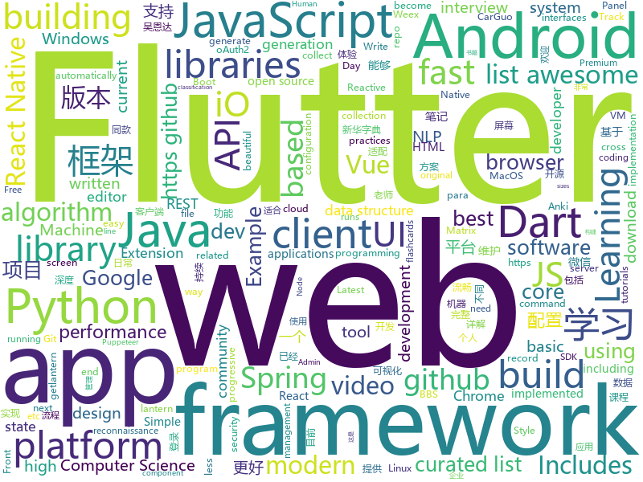

# 2018-08-26
See what the GitHub community is most excited about today.

## python
* [system-design-primer](https://github.com/donnemartin/system-design-primer)(**167 stars today**): Learn how to design large-scale systems. Prep for the system design interview. Includes Anki flashcards.
* [pyodide](https://github.com/iodide-project/pyodide)(**130 stars today**): The Python scientific stack, compiled to WebAssembly
* [papermill](https://github.com/nteract/papermill)(**116 stars today**): 📚Parameterize, execute, and analyze notebooks
* [home-assistant](https://github.com/home-assistant/home-assistant)(**96 stars today**): 🏡Open-source home automation platform running on Python 3
* [vid2vid](https://github.com/NVIDIA/vid2vid)(**88 stars today**): Pytorch implementation of our method for high-resolution (e.g. 2048x1024) photorealistic video-to-video translation.
* [cheat.sh](https://github.com/chubin/cheat.sh)(**76 stars today**): the only cheat sheet you need
* [chinese-xinhua](https://github.com/pwxcoo/chinese-xinhua)(**69 stars today**): 中华新华字典数据库。包括歇后语，成语，词语，汉字。提供新华字典API。
* [interactive-coding-challenges](https://github.com/donnemartin/interactive-coding-challenges)(**49 stars today**): Interactive Python coding interview challenges (algorithms and data structures). Includes Anki flashcards.
* [models](https://github.com/tensorflow/models)(**38 stars today**): Models and examples built with TensorFlow
* [keras](https://github.com/keras-team/keras)(**35 stars today**): Deep Learning for humans
* [python-fire](https://github.com/google/python-fire)(**36 stars today**): Python Fire is a library for automatically generating command line interfaces (CLIs) from absolutely any Python object.
* [awesome-python](https://github.com/vinta/awesome-python)(**31 stars today**): A curated list of awesome Python frameworks, libraries, software and resources
* [youtube-dl](https://github.com/rg3/youtube-dl)(**30 stars today**): Command-line program to download videos from YouTube.com and other video sites
* [Photon](https://github.com/s0md3v/Photon)(**30 stars today**): Incredibly fast crawler designed for reconnaissance.
* [algo](https://github.com/trailofbits/algo)(**30 stars today**): Set up a personal IPSEC VPN in the cloud
* [face_recognition](https://github.com/ageitgey/face_recognition)(**26 stars today**): The world's simplest facial recognition api for Python and the command line
* [Algorithm_Interview_Notes-Chinese](https://github.com/imhuay/Algorithm_Interview_Notes-Chinese)(**27 stars today**): 2018/2019/校招/春招/秋招/自然语言处理(NLP)/深度学习(Deep Learning)/机器学习(Machine Learning)/C/C++/Python/面试笔记
* [flask](https://github.com/pallets/flask)(**24 stars today**): The Python micro framework for building web applications.
* [human-pose-estimation.pytorch](https://github.com/Microsoft/human-pose-estimation.pytorch)(**26 stars today**): The project is official implement of our ECCV2018 paper "Simple Baselines for Human Pose Estimation and Tracking(https://arxiv.org/abs/1804.06208)"
* [Raccoon](https://github.com/evyatarmeged/Raccoon)(**24 stars today**): A high performance offensive security tool for reconnaissance and vulnerability scanning
* [pyxel](https://github.com/kitao/pyxel)(**23 stars today**): A retro game development environment in Python
* [awesome-machine-learning](https://github.com/josephmisiti/awesome-machine-learning)(**21 stars today**): A curated list of awesome Machine Learning frameworks, libraries and software.
* [tldr](https://github.com/tldr-pages/tldr)(**23 stars today**): 📚Simplified and community-driven man pages
* [django](https://github.com/django/django)(**17 stars today**): The Web framework for perfectionists with deadlines.
* [cpython](https://github.com/python/cpython)(**16 stars today**): The Python programming language

## java
* [Java-Guide](https://github.com/Snailclimb/Java-Guide)(**72 stars today**): A core knowledge that most Java programmers need to master
* [WMRouter](https://github.com/meituan/WMRouter)(**40 stars today**): WMRouter是一款Android路由框架，基于组件化的设计思路，有功能灵活、使用简单的特点。
* [java-design-patterns](https://github.com/iluwatar/java-design-patterns)(**35 stars today**): Design patterns implemented in Java
* [AndroidAutoSize](https://github.com/JessYanCoding/AndroidAutoSize)(**36 stars today**): A low-cost Android screen adaptation solution (今日头条屏幕适配方案终极版，一个极低成本的 Android 屏幕适配方案).
* [spring-boot](https://github.com/spring-projects/spring-boot)(**23 stars today**): Spring Boot
* [JCSprout](https://github.com/crossoverJie/JCSprout)(**24 stars today**): 👨‍🎓Java Core Sprout : basic, concurrent, algorithm
* [UETool](https://github.com/eleme/UETool)(**24 stars today**): Show/edit any view's attributions on the screen.
* [Java](https://github.com/TheAlgorithms/Java)(**21 stars today**): All Algorithms implemented in Java
* [X2C](https://github.com/iReaderAndroid/X2C)(**22 stars today**): 提升布局加载速度200%
* [guava](https://github.com/google/guava)(**20 stars today**): Google core libraries for Java
* [elasticsearch](https://github.com/elastic/elasticsearch)(**18 stars today**): Open Source, Distributed, RESTful Search Engine
* [spring-framework](https://github.com/spring-projects/spring-framework)(**18 stars today**): Spring Framework
* [PiggyMetrics](https://github.com/sqshq/PiggyMetrics)(**16 stars today**): Microservice Architecture with Spring Boot, Spring Cloud and Docker
* [okhttp](https://github.com/square/okhttp)(**17 stars today**): An HTTP+HTTP/2 client for Android and Java applications.
* [AndroidUtilCode](https://github.com/Blankj/AndroidUtilCode)(**17 stars today**): 🔥Android developers should collect the following utils(updating).
* [incubator-dubbo](https://github.com/apache/incubator-dubbo)(**11 stars today**): Apache Dubbo (incubating) is a high-performance, java based, open source RPC framework.
* [RxJava](https://github.com/ReactiveX/RxJava)(**14 stars today**): RxJava – Reactive Extensions for the JVM – a library for composing asynchronous and event-based programs using observable sequences for the Java VM.
* [tutorials](https://github.com/eugenp/tutorials)(**9 stars today**): The "REST With Spring" Course:
* [symphony](https://github.com/b3log/symphony)(**15 stars today**): 🎶A modern community (forum/BBS/SNS/blog) platform written in Java. 一个用 Java 实现的现代化社区（论坛/BBS/社交网络/博客）平台。https://hacpai.com
* [MyTikTok](https://github.com/whenSunSet/MyTikTok)(**14 stars today**): 我的抖音APP
* [retrofit](https://github.com/square/retrofit)(**14 stars today**): Type-safe HTTP client for Android and Java by Square, Inc.
* [weixin-java-tools](https://github.com/Wechat-Group/weixin-java-tools)(**12 stars today**): 全能微信Java开发工具包，支持包括微信支付、开放平台、小程序、企业号和公众号等的开发
* [paascloud-master](https://github.com/paascloud/paascloud-master)(**13 stars today**): spring cloud + vue + oAuth2.0全家桶实战，前后端分离模拟商城，完整的购物流程、后端运营平台，可以实现快速搭建企业级微服务项目。支持微信登录等三方登录。
* [FastHub](https://github.com/k0shk0sh/FastHub)(**13 stars today**): FastHub the ultimate GitHub client for Android.
* [apollo](https://github.com/ctripcorp/apollo)(**10 stars today**): Apollo（阿波罗）是携程框架部门研发的分布式配置中心，能够集中化管理应用不同环境、不同集群的配置，配置修改后能够实时推送到应用端，并且具备规范的权限、流程治理等特性，适用于微服务配置管理场景。

## unknown
* [dctb-utfpr](https://github.com/diogocezar/dctb-utfpr)(**204 stars today**): Lista dos materiais elaborados por mim para as aulas ministradas na UTFPR.
* [build-your-own-x](https://github.com/danistefanovic/build-your-own-x)(**154 stars today**): 🤓Build your own (insert technology here)
* [CS-Interview-Knowledge-Map](https://github.com/InterviewMap/CS-Interview-Knowledge-Map)(**115 stars today**): Build the best interview map. The current content includes JS, network, browser related, performance optimization, security, framework, Git, data structure, algorithm, etc.
* [CS-Notes](https://github.com/CyC2018/CS-Notes)(**97 stars today**): 📚Computer Science Learning Notes
* [100-Days-Of-ML-Code](https://github.com/Avik-Jain/100-Days-Of-ML-Code)(**95 stars today**): 100 Days of ML Coding
* [stanford-cs-229-machine-learning](https://github.com/afshinea/stanford-cs-229-machine-learning)(**92 stars today**): VIP cheatsheets for Stanford's CS 229 Machine Learning
* [SMARTCONTRACT](https://github.com/MatrixAINetwork/SMARTCONTRACT)(**50 stars today**): Both reference and original sol files
* [gitignore](https://github.com/github/gitignore)(**38 stars today**): A collection of useful .gitignore templates
* [You-Dont-Know-JS](https://github.com/getify/You-Dont-Know-JS)(**43 stars today**): A book series on JavaScript. @YDKJS on twitter.
* [developer-roadmap](https://github.com/kamranahmedse/developer-roadmap)(**40 stars today**): Roadmap to becoming a web developer in 2018
* [awesome](https://github.com/sindresorhus/awesome)(**38 stars today**): 😎Curated list of awesome lists
* [replacing-bash-scripting-with-python](https://github.com/ninjaaron/replacing-bash-scripting-with-python)(**38 stars today**): Guide on using using python for administrative scripting
* [awesome-vue](https://github.com/vuejs/awesome-vue)(**35 stars today**): 🎉A curated list of awesome things related to Vue.js
* [MATRIX_Diary](https://github.com/MatrixAINetwork/MATRIX_Diary)(**26 stars today**): Matrix Trendings as well as Digests
* [coding-interview-university](https://github.com/jwasham/coding-interview-university)(**29 stars today**): A complete computer science study plan to become a software engineer.
* [dadsresume](https://github.com/runvnc/dadsresume)(**30 stars today**): My dad's resume and skills from 1980
* [MATRIX_WEEKLY-Q-As](https://github.com/MatrixAINetwork/MATRIX_WEEKLY-Q-As)(**22 stars today**): questions from Matrix community and answers from Matrix experts
* [Front-End-Performance-Checklist](https://github.com/thedaviddias/Front-End-Performance-Checklist)(**26 stars today**): 🎮The only Front-End Performance Checklist that runs faster than the others
* [nodebestpractices](https://github.com/i0natan/nodebestpractices)(**19 stars today**): The largest Node.JS best practices list (August 2018)
* [nocode](https://github.com/kelseyhightower/nocode)(**19 stars today**): The best way to write secure and reliable applications. Write nothing; deploy nowhere.
* [awesome-flutter](https://github.com/Solido/awesome-flutter)(**19 stars today**): An awesome list that curates the best Flutter libraries, tools, tutorials, articles and more.
* [unmaintainable-code](https://github.com/Droogans/unmaintainable-code)(**19 stars today**): A more maintainable, easier to share version of the infamous http://mindprod.com/jgloss/unmain.html
* [download](https://github.com/getlantern/download)(**16 stars today**): 🔴蓝灯最新版本下载 https://github.com/getlantern/download🔴Lantern Latest Download https://github.com/getlantern/lantern/releases/tag/latest🔴
* [awesome-spider](https://github.com/facert/awesome-spider)(**15 stars today**): 爬虫集合
* [computer-science](https://github.com/ossu/computer-science)(**14 stars today**): 🎓Path to a free self-taught education in Computer Science!

## javascript
* [windows95](https://github.com/felixrieseberg/windows95)(**1,266 stars today**): 💩🚀Windows 95 in Electron. Runs on macOS, Linux, and Windows.
* [size-plugin](https://github.com/GoogleChromeLabs/size-plugin)(**222 stars today**): Track compressed Webpack asset sizes over time.
* [puppeteer-recorder](https://github.com/checkly/puppeteer-recorder)(**141 stars today**): Puppeteer recorder is a Chrome extension that records your browser interactions and generates a Puppeteer script.
* [Historical-ranking-data-visualization-based-on-d3.js](https://github.com/Jannchie/Historical-ranking-data-visualization-based-on-d3.js)(**111 stars today**): 这是一个数据可视化项目，能够将历史数据排名转化为动态柱状图图表
* [javascript-algorithms](https://github.com/trekhleb/javascript-algorithms)(**98 stars today**): Algorithms and data structures implemented in JavaScript with explanations and links to further readings
* [vue](https://github.com/vuejs/vue)(**60 stars today**): 🖖A progressive, incrementally-adoptable JavaScript framework for building UI on the web.
* [metro](https://github.com/facebook/metro)(**64 stars today**): 🚇The JavaScript bundler for React Native.
* [react](https://github.com/facebook/react)(**51 stars today**): A declarative, efficient, and flexible JavaScript library for building user interfaces.
* [ReactStateMuseum](https://github.com/GantMan/ReactStateMuseum)(**46 stars today**): A whirlwind tour of React state management systems by example
* [create-react-app](https://github.com/facebook/create-react-app)(**42 stars today**): Create React apps with no build configuration.
* [immer](https://github.com/mweststrate/immer)(**43 stars today**): Create the next immutable state by mutating the current one
* [axios](https://github.com/axios/axios)(**37 stars today**): Promise based HTTP client for the browser and node.js
* [date-fns](https://github.com/date-fns/date-fns)(**37 stars today**): ⏳Modern JavaScript date utility library⌛️
* [json-server](https://github.com/typicode/json-server)(**35 stars today**): Get a full fake REST API with zero coding in less than 30 seconds (seriously)
* [javascript](https://github.com/airbnb/javascript)(**33 stars today**): JavaScript Style Guide
* [callapp-lib](https://github.com/suanmei/callapp-lib)(**35 stars today**): call native webview from webpage
* [resources](https://github.com/BestDingSheng/resources)(**35 stars today**): 知名互联网企业内推资料整理 持续更新ing 。 目前已经维护五个微信群接近3000人，欢迎你的加入！
* [lottie-web](https://github.com/airbnb/lottie-web)(**35 stars today**): Render After Effects animations natively on Web, Android and iOS, and React Native. http://airbnb.io/lottie/
* [free-programming-books-zh_CN](https://github.com/justjavac/free-programming-books-zh_CN)(**32 stars today**): 📚免费的计算机编程类中文书籍，欢迎投稿
* [johnny-five](https://github.com/rwaldron/johnny-five)(**33 stars today**): JavaScript Robotics and IoT programming framework, developed at Bocoup.
* [http-timer](https://github.com/szmarczak/http-timer)(**32 stars today**): Timings for HTTP requests
* [storybook](https://github.com/storybooks/storybook)(**30 stars today**): Interactive UI component dev & test: React, React Native, Vue, Angular
* [terminalizer](https://github.com/faressoft/terminalizer)(**31 stars today**): 🦄Record your terminal and generate animated gif images
* [marktext](https://github.com/marktext/marktext)(**31 stars today**): 📝Next generation markdown editor, running on platforms of MacOS Windows and Linux.
* [web-worker-proxy](https://github.com/satya164/web-worker-proxy)(**31 stars today**): A better way of working with web workers (Experimental)

## html
* [GitDataV](https://github.com/HongqingCao/GitDataV)(**42 stars today**): 基于Vue框架构建的github数据可视化平台
* [styleguide](https://github.com/google/styleguide)(**15 stars today**): Style guides for Google-originated open-source projects
* [Minicurso-de-git-e-Github](https://github.com/allythy/Minicurso-de-git-e-Github)(**10 stars today**): Site para os participantes do minicurso de Git e GitHub contribuirem
* [Coursera-ML-AndrewNg-Notes](https://github.com/fengdu78/Coursera-ML-AndrewNg-Notes)(**14 stars today**): 吴恩达老师的机器学习课程个人笔记
* [RainCloudPlots](https://github.com/RainCloudPlots/RainCloudPlots)(**11 stars today**): Code and tutorials to visualise your data that is both beautiful *and* statistically valid
* [JavaScript30](https://github.com/wesbos/JavaScript30)(**7 stars today**): 30 Day Vanilla JS Challenge
* [TinyEditor](https://github.com/umpox/TinyEditor)(**10 stars today**): A functional HTML/CSS/JS editor in less than 400 bytes
* [deeplearning_ai_books](https://github.com/fengdu78/deeplearning_ai_books)(**9 stars today**): deeplearning.ai（吴恩达老师的深度学习课程笔记及资源）
* [portainer](https://github.com/portainer/portainer)(**9 stars today**): Simple management UI for Docker
* [AdminLTE](https://github.com/almasaeed2010/AdminLTE)(**7 stars today**): AdminLTE - Free Premium Admin control Panel Theme Based On Bootstrap 3.x
* [NLP-progress](https://github.com/sebastianruder/NLP-progress)(**8 stars today**): Repository to track the progress in Natural Language Processing (NLP), including the datasets and the current state-of-the-art for the most common NLP tasks.
* [fastText](https://github.com/facebookresearch/fastText)(**7 stars today**): Library for fast text representation and classification.
* [fonts](https://github.com/google/fonts)(**7 stars today**): Font files available from Google Fonts
* [polymer](https://github.com/Polymer/polymer)(**6 stars today**): Build modern apps using web components
* [awesome-mac](https://github.com/jaywcjlove/awesome-mac)(**6 stars today**):  Now we have become very big, Different from the original idea. Collect premium software in various categories.
* [Spoon-Knife](https://github.com/octocat/Spoon-Knife)(****): This repo is for demonstration purposes only.
* [ng-alain](https://github.com/cipchk/ng-alain)(**5 stars today**): ng-zorro-antd admin panel front-end framework
* [WebFundamentals](https://github.com/google/WebFundamentals)(**5 stars today**): Best practices for modern web development
* [openapi-generator](https://github.com/OpenAPITools/openapi-generator)(**5 stars today**): OpenAPI Generator allows generation of API client libraries (SDK generation), server stubs, documentation and configuration automatically given an OpenAPI Spec (v2, v3)
* [goawk](https://github.com/benhoyt/goawk)(**5 stars today**): GoAWK: an AWK interpreter written in Go
* [requests-html](https://github.com/kennethreitz/requests-html)(**5 stars today**): Pythonic HTML Parsing for Humans™
* [ecma262](https://github.com/tc39/ecma262)(**5 stars today**): Status, process, and documents for ECMA262
* [simple-icons](https://github.com/simple-icons/simple-icons)(**5 stars today**): SVG icons for popular brands
* [javascript-tutorial-en](https://github.com/iliakan/javascript-tutorial-en)(**5 stars today**): Modern JavaScript Tutorial
* [capacitor](https://github.com/ionic-team/capacitor)(**5 stars today**): Build cross-platform Native Progressive Web Apps for iOS, Android, and the web⚡️

## dart
* [flutter](https://github.com/flutter/flutter)(**31 stars today**): Flutter makes it easy and fast to build beautiful mobile apps.
* [plugins](https://github.com/flutter/plugins)(**7 stars today**): Plugins for Flutter, including FlutterFire, maintained by the Flutter team
* [graphql-flutter](https://github.com/zino-app/graphql-flutter)(**5 stars today**): A GraphQL client for Flutter
* [FlutterCardSwipe](https://github.com/geekruchika/FlutterCardSwipe)(****): 
* [chromedeveditor](https://github.com/googlearchive/chromedeveditor)(****): Chrome Dev Editor is a developer tool for building apps on the Chrome platform - Chrome Apps and Web Apps, in JavaScript or Dart. (NO LONGER IN ACTIVE DEVELOPMENT)
* [sdk](https://github.com/dart-lang/sdk)(****): The Dart SDK, including the VM, dart2js, core libraries, and more.
* [flutter-osc](https://github.com/yubo725/flutter-osc)(****): 基于Google Flutter的开源中国客户端，支持Android和iOS。
* [flutter-examples](https://github.com/nisrulz/flutter-examples)(****): [Examples] Simple basic isolated apps, for budding flutter devs.
* [inKino](https://github.com/roughike/inKino)(****): inKino - A cross platform movie and showtime browser for Finnkino cinemas, made with Flutter.
* [hauberk](https://github.com/munificent/hauberk)(****): A web-based roguelike written in Dart.
* [flutter_architecture_samples](https://github.com/brianegan/flutter_architecture_samples)(****): TodoMVC for Flutter
* [Flutter-UI-Kit](https://github.com/iampawan/Flutter-UI-Kit)(****): Flutter app for collection of UI in a UIKit
* [FlutterExampleApps](https://github.com/iampawan/FlutterExampleApps)(****): [Example APPS] Basic Flutter apps, for flutter devs.
* [dio](https://github.com/flutterchina/dio)(****): A powerful Http client for Dart, which supports Interceptors, FormData, Request Cancellation, File Downloading, Timeout etc.
* [Flutter-learning](https://github.com/AweiLoveAndroid/Flutter-learning)(****): 🔥👍🌟⭐️⭐️⭐️Flutter从配置安装到填坑指南详解，Flutter相关Demo解读，项目实例，Dart语法详解
* [angular](https://github.com/dart-lang/angular)(****): Fast and productive web framework provided by Dart
* [StageXL](https://github.com/bp74/StageXL)(****): A fast and universal 2D rendering engine for HTML5 and Dart.
* [zhihu-flutter](https://github.com/HackSoul/zhihu-flutter)(****): Flutter 高仿知乎 UI，非常漂亮，也非常流畅，flutter build apk 或 flutter build ios 之后更流畅
* [GSYGithubAppFlutter](https://github.com/CarGuo/GSYGithubAppFlutter)(****): 超完整的Flutter项目，功能丰富，适合学习和日常使用。GSYGithubApp系列的优势：我们目前已经拥有Flutter、Weex、ReactNative三个版本。 功能齐全，项目框架内技术涉及面广，完成度高，持续维护，配套文章，适合全面学习，跨框架对比参考。跨平台的开源Github客户端App，更好的体验，更丰富的功能，旨在更好的日常管理和维护个人Github，提供更好更方便的驾车体验～～Σ(￣。￣ﾉ)ﾉ。同款Weex版本 ： https://github.com/CarGuo/GSYGithubAppWeex 、同款React Native版本 ： https://github.com/CarGuo/GSYGithubApp
* [dart-sass](https://github.com/sass/dart-sass)(****): A Dart implementation of Sass.
* [github-issue-mover](https://github.com/google/github-issue-mover)(****): Making it easy to migrate issues between repos.
* [rxdart](https://github.com/ReactiveX/rxdart)(****): The Reactive Extensions for Dart
* [aqueduct](https://github.com/stablekernel/aqueduct)(****): Dart HTTP server framework for building REST APIs. Includes PostgreSQL ORM and OAuth2 provider.
* [start](https://github.com/lvivski/start)(****): Sinatra inspired web development framework for Dart
* [dart-samples](https://github.com/dart-lang/dart-samples)(****): Various samples and examples in Dart

## WordCloud

