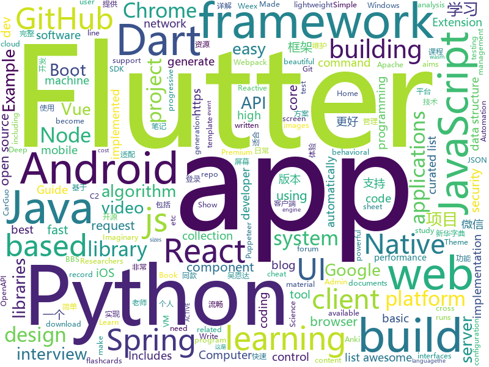

# 2018-08-27
See what the GitHub community is most excited about today.

## python
* [system-design-primer](https://github.com/donnemartin/system-design-primer)(**134 stars today**): Learn how to design large-scale systems. Prep for the system design interview. Includes Anki flashcards.
* [vid2vid](https://github.com/NVIDIA/vid2vid)(**83 stars today**): Pytorch implementation of our method for high-resolution (e.g. 2048x1024) photorealistic video-to-video translation.
* [home-assistant](https://github.com/home-assistant/home-assistant)(**75 stars today**): 🏡Open-source home automation platform running on Python 3
* [papermill](https://github.com/nteract/papermill)(**71 stars today**): 📚Parameterize, execute, and analyze notebooks
* [struts-pwn_CVE-2018-11776](https://github.com/mazen160/struts-pwn_CVE-2018-11776)(**61 stars today**): An exploit for Apache Struts CVE-2018-11776
* [chinese-xinhua](https://github.com/pwxcoo/chinese-xinhua)(**51 stars today**): 中华新华字典数据库。包括歇后语，成语，词语，汉字。提供新华字典API。
* [imaginaryC2](https://github.com/felixweyne/imaginaryC2)(**50 stars today**): Imaginary C2 is a python tool which aims to help in the behavioral (network) analysis of malware. Imaginary C2 hosts a HTTP server which captures HTTP requests towards selectively chosen domains/IPs. Additionally, the tool aims to make it easy to replay captured Command-and-Control responses/served payloads.
* [pyodide](https://github.com/iodide-project/pyodide)(**46 stars today**): The Python scientific stack, compiled to WebAssembly
* [models](https://github.com/tensorflow/models)(**35 stars today**): Models and examples built with TensorFlow
* [InstaPy](https://github.com/timgrossmann/InstaPy)(**46 stars today**): 📷Instagram Bot - Like/Comment/Follow Automation Script
* [youtube-dl](https://github.com/rg3/youtube-dl)(**41 stars today**): Command-line program to download videos from YouTube.com and other video sites
* [interactive-coding-challenges](https://github.com/donnemartin/interactive-coding-challenges)(**39 stars today**): Interactive Python coding interview challenges (algorithms and data structures). Includes Anki flashcards.
* [Deep-Learning-World](https://github.com/astorfi/Deep-Learning-World)(**32 stars today**): 📡Organized Resources for Deep Learning Researchers and Developers
* [keras](https://github.com/keras-team/keras)(**31 stars today**): Deep Learning for humans
* [cpython](https://github.com/python/cpython)(**31 stars today**): The Python programming language
* [cheat.sh](https://github.com/chubin/cheat.sh)(**33 stars today**): the only cheat sheet you need
* [python-fire](https://github.com/google/python-fire)(**33 stars today**): Python Fire is a library for automatically generating command line interfaces (CLIs) from absolutely any Python object.
* [Vba2Graph](https://github.com/MalwareCantFly/Vba2Graph)(**31 stars today**): Vba2Graph - Generate call graphs from VBA code, for easier analysis of malicious documents.
* [kube-hunter](https://github.com/aquasecurity/kube-hunter)(**32 stars today**): Hunt for security weaknesses in Kubernetes clusters
* [awesome-python](https://github.com/vinta/awesome-python)(**30 stars today**): A curated list of awesome Python frameworks, libraries, software and resources
* [flask](https://github.com/pallets/flask)(**27 stars today**): The Python micro framework for building web applications.
* [algo](https://github.com/trailofbits/algo)(**24 stars today**): Set up a personal IPSEC VPN in the cloud
* [scikit-learn](https://github.com/scikit-learn/scikit-learn)(**23 stars today**): scikit-learn: machine learning in Python
* [face_recognition](https://github.com/ageitgey/face_recognition)(**22 stars today**): The world's simplest facial recognition api for Python and the command line
* [Photon](https://github.com/s0md3v/Photon)(**23 stars today**): Incredibly fast crawler designed for reconnaissance.

## java
* [Java-Guide](https://github.com/Snailclimb/Java-Guide)(**53 stars today**): A core knowledge that most Java programmers need to master
* [FastHub](https://github.com/k0shk0sh/FastHub)(**45 stars today**): FastHub the ultimate GitHub client for Android.
* [java-design-patterns](https://github.com/iluwatar/java-design-patterns)(**34 stars today**): Design patterns implemented in Java
* [PiggyMetrics](https://github.com/sqshq/PiggyMetrics)(**27 stars today**): Microservice Architecture with Spring Boot, Spring Cloud and Docker
* [spring-boot](https://github.com/spring-projects/spring-boot)(**24 stars today**): Spring Boot
* [JCSprout](https://github.com/crossoverJie/JCSprout)(**24 stars today**): 👨‍🎓Java Core Sprout : basic, concurrent, algorithm
* [tutorials](https://github.com/eugenp/tutorials)(**18 stars today**): The "REST With Spring" Course:
* [symphony](https://github.com/b3log/symphony)(**22 stars today**): 🎶A modern community (forum/BBS/SNS/blog) platform written in Java. 一个用 Java 实现的现代化社区（论坛/BBS/社交网络/博客）平台。https://hacpai.com
* [elasticsearch](https://github.com/elastic/elasticsearch)(**17 stars today**): Open Source, Distributed, RESTful Search Engine
* [spring-framework](https://github.com/spring-projects/spring-framework)(**17 stars today**): Spring Framework
* [jib](https://github.com/GoogleContainerTools/jib)(**19 stars today**): ⛵️Build container images for your Java applications.
* [AndroidAutoSize](https://github.com/JessYanCoding/AndroidAutoSize)(**20 stars today**): A low-cost Android screen adaptation solution (今日头条屏幕适配方案终极版，一个极低成本的 Android 屏幕适配方案).
* [Java](https://github.com/TheAlgorithms/Java)(**18 stars today**): All Algorithms implemented in Java
* [Sentinel](https://github.com/alibaba/Sentinel)(**15 stars today**): A lightweight flow-control library providing high-available protection and monitoring (高可用防护的流量管理框架)
* [incubator-dubbo](https://github.com/apache/incubator-dubbo)(**12 stars today**): Apache Dubbo (incubating) is a high-performance, java based, open source RPC framework.
* [RxJava](https://github.com/ReactiveX/RxJava)(**14 stars today**): RxJava – Reactive Extensions for the JVM – a library for composing asynchronous and event-based programs using observable sequences for the Java VM.
* [Magisk](https://github.com/topjohnwu/Magisk)(**14 stars today**): A Magic Mask to Alter Android System Systemless-ly
* [okhttp](https://github.com/square/okhttp)(**12 stars today**): An HTTP+HTTP/2 client for Android and Java applications.
* [interviews](https://github.com/kdn251/interviews)(**12 stars today**): Everything you need to know to get the job.
* [paascloud-master](https://github.com/paascloud/paascloud-master)(**13 stars today**): spring cloud + vue + oAuth2.0全家桶实战，前后端分离模拟商城，完整的购物流程、后端运营平台，可以实现快速搭建企业级微服务项目。支持微信登录等三方登录。
* [UETool](https://github.com/eleme/UETool)(**11 stars today**): Show/edit any view's attributions on the screen.
* [WMRouter](https://github.com/meituan/WMRouter)(**11 stars today**): WMRouter是一款Android路由框架，基于组件化的设计思路，有功能灵活、使用简单的特点。
* [weixin-java-tools](https://github.com/Wechat-Group/weixin-java-tools)(**10 stars today**): 全能微信Java开发工具包，支持包括微信支付、开放平台、小程序、企业号和公众号等的开发
* [guava](https://github.com/google/guava)(**9 stars today**): Google core libraries for Java
* [spring-boot-examples](https://github.com/ityouknow/spring-boot-examples)(**8 stars today**): about learning Spring Boot via examples. Spring Boot 技术栈示例代码，快速简单上手教程。

## unknown
* [build-your-own-x](https://github.com/danistefanovic/build-your-own-x)(**315 stars today**): 🤓Build your own (insert technology here)
* [dctb-utfpr](https://github.com/diogocezar/dctb-utfpr)(**119 stars today**): Lista dos materiais elaborados por mim para as aulas ministradas na UTFPR.
* [CS-Interview-Knowledge-Map](https://github.com/InterviewMap/CS-Interview-Knowledge-Map)(**115 stars today**): Build the best interview map. The current content includes JS, network, browser related, performance optimization, security, framework, Git, data structure, algorithm, etc.
* [stanford-cs-229-machine-learning](https://github.com/afshinea/stanford-cs-229-machine-learning)(**106 stars today**): VIP cheatsheets for Stanford's CS 229 Machine Learning
* [book-computer-networks](https://github.com/ruanyf/book-computer-networks)(**92 stars today**): Free E-Book: Computer Networks - A Systems Approach
* [survivingtheappstore](https://github.com/amirrajan/survivingtheappstore)(**87 stars today**): My book on getting to the #1 Spot in the App Store. Buy my games to support me.
* [100-Days-Of-ML-Code](https://github.com/Avik-Jain/100-Days-Of-ML-Code)(**85 stars today**): 100 Days of ML Coding
* [CS-Notes](https://github.com/CyC2018/CS-Notes)(**62 stars today**): 📚Computer Science Learning Notes
* [awesome](https://github.com/sindresorhus/awesome)(**49 stars today**): 😎Curated list of awesome lists
* [developer-roadmap](https://github.com/kamranahmedse/developer-roadmap)(**42 stars today**): Roadmap to becoming a web developer in 2018
* [gitignore](https://github.com/github/gitignore)(**32 stars today**): A collection of useful .gitignore templates
* [free-programming-books](https://github.com/EbookFoundation/free-programming-books)(**34 stars today**): 📚Freely available programming books
* [test-your-sysadmin-skills](https://github.com/trimstray/test-your-sysadmin-skills)(**40 stars today**): A collection of *nix Sysadmin Test Questions with Answers for Interview/Exam (2018 Edition).
* [coding-interview-university](https://github.com/jwasham/coding-interview-university)(**33 stars today**): A complete computer science study plan to become a software engineer.
* [replacing-bash-scripting-with-python](https://github.com/ninjaaron/replacing-bash-scripting-with-python)(**32 stars today**): Guide on using using python for administrative scripting
* [awesome-vue](https://github.com/vuejs/awesome-vue)(**29 stars today**): 🎉A curated list of awesome things related to Vue.js
* [nocode](https://github.com/kelseyhightower/nocode)(**27 stars today**): The best way to write secure and reliable applications. Write nothing; deploy nowhere.
* [dadsresume](https://github.com/runvnc/dadsresume)(**23 stars today**): My dad's resume and skills from 1980
* [nodebestpractices](https://github.com/i0natan/nodebestpractices)(**20 stars today**): The largest Node.JS best practices list (August 2018)
* [Front-End-Performance-Checklist](https://github.com/thedaviddias/Front-End-Performance-Checklist)(**20 stars today**): 🎮The only Front-End Performance Checklist that runs faster than the others
* [awesome-wasm-zh](https://github.com/chai2010/awesome-wasm-zh)(**18 stars today**): WebAssembly(wasm)资源精选 - 中文版
* [emacs.dz](https://github.com/caisah/emacs.dz)(**18 stars today**): Awesome emacs config files
* [cheatsheets-ai](https://github.com/kailashahirwar/cheatsheets-ai)(**14 stars today**): Essential Cheat Sheets for deep learning and machine learning researchers
* [awesome-nodejs](https://github.com/sindresorhus/awesome-nodejs)(**16 stars today**): ⚡️Delightful Node.js packages and resources
* [webpack-libs-optimizations](https://github.com/GoogleChromeLabs/webpack-libs-optimizations)(**16 stars today**): Using a library in your webpack project? Here’s how to optimize it

## javascript
* [windows95](https://github.com/felixrieseberg/windows95)(**768 stars today**): 💩🚀Windows 95 in Electron. Runs on macOS, Linux, and Windows.
* [size-plugin](https://github.com/GoogleChromeLabs/size-plugin)(**223 stars today**): Track compressed Webpack asset sizes over time.
* [code-surfer](https://github.com/pomber/code-surfer)(**154 stars today**): React component for scrolling, zooming and highlighting code <🏄/>
* [puppeteer-recorder](https://github.com/checkly/puppeteer-recorder)(**128 stars today**): Puppeteer recorder is a Chrome extension that records your browser interactions and generates a Puppeteer script.
* [turbo-json-parse](https://github.com/mafintosh/turbo-json-parse)(**94 stars today**): Turbocharged JSON.parse for type stable JSON data
* [javascript-algorithms](https://github.com/trekhleb/javascript-algorithms)(**82 stars today**): Algorithms and data structures implemented in JavaScript with explanations and links to further readings
* [vue](https://github.com/vuejs/vue)(**62 stars today**): 🖖A progressive, incrementally-adoptable JavaScript framework for building UI on the web.
* [react](https://github.com/facebook/react)(**62 stars today**): A declarative, efficient, and flexible JavaScript library for building user interfaces.
* [Historical-ranking-data-visualization-based-on-d3.js](https://github.com/Jannchie/Historical-ranking-data-visualization-based-on-d3.js)(**48 stars today**): 这是一个数据可视化项目，能够将历史数据排名转化为动态柱状图图表
* [mdx-deck](https://github.com/jxnblk/mdx-deck)(**50 stars today**): ♠️MDX-based presentation decks
* [create-react-app](https://github.com/facebook/create-react-app)(**39 stars today**): Create React apps with no build configuration.
* [node](https://github.com/nodejs/node)(**33 stars today**): Node.js JavaScript runtime✨🐢🚀✨
* [puppeteer](https://github.com/GoogleChrome/puppeteer)(**39 stars today**): Headless Chrome Node API
* [terminalizer](https://github.com/faressoft/terminalizer)(**37 stars today**): 🦄Record your terminal and generate animated gif images
* [storybook](https://github.com/storybooks/storybook)(**35 stars today**): Interactive UI component dev & test: React, React Native, Vue, Angular
* [react-native](https://github.com/facebook/react-native)(**34 stars today**): A framework for building native apps with React.
* [axios](https://github.com/axios/axios)(**31 stars today**): Promise based HTTP client for the browser and node.js
* [http-timer](https://github.com/szmarczak/http-timer)(**33 stars today**): Timings for HTTP requests
* [metro](https://github.com/facebook/metro)(**32 stars today**): 🚇The JavaScript bundler for React Native.
* [tech-interview-handbook](https://github.com/yangshun/tech-interview-handbook)(**30 stars today**): 💯Algorithms study materials, behavioral content and tips for rocking your coding interview
* [next.js](https://github.com/zeit/next.js)(**32 stars today**): Next.js is a lightweight framework for static and server‑rendered applications.
* [free-programming-books-zh_CN](https://github.com/justjavac/free-programming-books-zh_CN)(**31 stars today**): 📚免费的计算机编程类中文书籍，欢迎投稿
* [javascript](https://github.com/airbnb/javascript)(**27 stars today**): JavaScript Style Guide
* [johnny-five](https://github.com/rwaldron/johnny-five)(**28 stars today**): JavaScript Robotics and IoT programming framework, developed at Bocoup.
* [vue-cli](https://github.com/vuejs/vue-cli)(**26 stars today**): 🛠️Standard Tooling for Vue.js Development

## html
* [styleguide](https://github.com/google/styleguide)(**18 stars today**): Style guides for Google-originated open-source projects
* [awesome-mac](https://github.com/jaywcjlove/awesome-mac)(**15 stars today**):  Now we have become very big, Different from the original idea. Collect premium software in various categories.
* [RainCloudPlots](https://github.com/RainCloudPlots/RainCloudPlots)(**14 stars today**): Code and tutorials to visualise your data that is both beautiful *and* statistically valid
* [AdminLTE](https://github.com/almasaeed2010/AdminLTE)(**10 stars today**): AdminLTE - Free Premium Admin control Panel Theme Based On Bootstrap 3.x
* [Spoon-Knife](https://github.com/octocat/Spoon-Knife)(****): This repo is for demonstration purposes only.
* [qiubaiying.github.io](https://github.com/qiubaiying/qiubaiying.github.io)(**5 stars today**): BY Blog ->
* [deeplearning_ai_books](https://github.com/fengdu78/deeplearning_ai_books)(**8 stars today**): deeplearning.ai（吴恩达老师的深度学习课程笔记及资源）
* [patchwork](https://github.com/jlord/patchwork)(****): All the Git-it Workshop completers!
* [Coursera-ML-AndrewNg-Notes](https://github.com/fengdu78/Coursera-ML-AndrewNg-Notes)(**7 stars today**): 吴恩达老师的机器学习课程个人笔记
* [Adminator-admin-dashboard](https://github.com/puikinsh/Adminator-admin-dashboard)(**7 stars today**): Adminator is a easy to use and well design admin dashboard template for web apps, websites, services and more
* [OI-wiki](https://github.com/24OI/OI-wiki)(**5 stars today**): 🌟Wiki for OI / ACM-ICPC. （某大型游戏线上攻略，内含炫酷算术魔法）
* [capacitor](https://github.com/ionic-team/capacitor)(**7 stars today**): Build cross-platform Native Progressive Web Apps for iOS, Android, and the web⚡️
* [openapi-generator](https://github.com/OpenAPITools/openapi-generator)(**7 stars today**): OpenAPI Generator allows generation of API client libraries (SDK generation), server stubs, documentation and configuration automatically given an OpenAPI Spec (v2, v3)
* [owasp-mstg](https://github.com/OWASP/owasp-mstg)(**6 stars today**): The Mobile Security Testing Guide (MSTG) is a comprehensive manual for mobile app security testing and reverse engineering.
* [hugo-coder](https://github.com/luizdepra/hugo-coder)(**5 stars today**): A very minimalist developer blog theme for hugo.
* [ecma262](https://github.com/tc39/ecma262)(**5 stars today**): Status, process, and documents for ECMA262
* [portainer](https://github.com/portainer/portainer)(**5 stars today**): Simple management UI for Docker
* [github-markdown-css](https://github.com/sindresorhus/github-markdown-css)(**5 stars today**): The minimal amount of CSS to replicate the GitHub Markdown style
* [simple-icons](https://github.com/simple-icons/simple-icons)(**5 stars today**): SVG icons for popular brands
* [openusm](https://github.com/openusm/openusm)(**5 stars today**): OpenUSM - Server Management & Insight Log Analytics Made Simple using Docker, Redfish & ELK Stack
* [now-github-starter](https://github.com/zeit/now-github-starter)(****): Starter project to demonstrate a project whose pull requests get automatically deployed
* [home-assistant.io](https://github.com/home-assistant/home-assistant.io)(****): 📘Home Assistant User documentation
* [nodejs-ex](https://github.com/sclorg/nodejs-ex)(****): node.js example
* [larabbs](https://github.com/summerblue/larabbs)(****): A forum project base on Laravel 5.5.
* [primeng](https://github.com/primefaces/primeng)(****): UI Components for Angular

## dart
* [flutter](https://github.com/flutter/flutter)(**47 stars today**): Flutter makes it easy and fast to build beautiful mobile apps.
* [plugins](https://github.com/flutter/plugins)(**5 stars today**): Plugins for Flutter, including FlutterFire, maintained by the Flutter team
* [spacex-go](https://github.com/jesusrp98/spacex-go)(**6 stars today**): Simple yet powerful, open-source SpaceX launch tracker.
* [flutter_architecture_samples](https://github.com/brianegan/flutter_architecture_samples)(**5 stars today**): TodoMVC for Flutter
* [Flutter-learning](https://github.com/AweiLoveAndroid/Flutter-learning)(**5 stars today**): 🔥👍🌟⭐️⭐️⭐️Flutter从配置安装到填坑指南详解，Flutter相关Demo解读，项目实例，Dart语法详解
* [flutter_cached_network_image](https://github.com/renefloor/flutter_cached_network_image)(****): Download, cache and show images in a flutter app
* [build](https://github.com/dart-lang/build)(****): A build system for Dart
* [flutter_sticky_header](https://github.com/letsar/flutter_sticky_header)(****): Flutter implementation of sticky headers for sliver
* [angular_components](https://github.com/dart-lang/angular_components)(****): The official Material Design components for AngularDart. Used at Google in production apps.
* [chromedeveditor](https://github.com/googlearchive/chromedeveditor)(****): Chrome Dev Editor is a developer tool for building apps on the Chrome platform - Chrome Apps and Web Apps, in JavaScript or Dart. (NO LONGER IN ACTIVE DEVELOPMENT)
* [sdk](https://github.com/dart-lang/sdk)(****): The Dart SDK, including the VM, dart2js, core libraries, and more.
* [flutter-osc](https://github.com/yubo725/flutter-osc)(****): 基于Google Flutter的开源中国客户端，支持Android和iOS。
* [flutter-examples](https://github.com/nisrulz/flutter-examples)(****): [Examples] Simple basic isolated apps, for budding flutter devs.
* [inKino](https://github.com/roughike/inKino)(****): inKino - A cross platform movie and showtime browser for Finnkino cinemas, made with Flutter.
* [hauberk](https://github.com/munificent/hauberk)(****): A web-based roguelike written in Dart.
* [Flutter-UI-Kit](https://github.com/iampawan/Flutter-UI-Kit)(****): Flutter app for collection of UI in a UIKit
* [FlutterExampleApps](https://github.com/iampawan/FlutterExampleApps)(****): [Example APPS] Basic Flutter apps, for flutter devs.
* [dio](https://github.com/flutterchina/dio)(****): A powerful Http client for Dart, which supports Interceptors, FormData, Request Cancellation, File Downloading, Timeout etc.
* [angular](https://github.com/dart-lang/angular)(****): Fast and productive web framework provided by Dart
* [StageXL](https://github.com/bp74/StageXL)(****): A fast and universal 2D rendering engine for HTML5 and Dart.
* [zhihu-flutter](https://github.com/HackSoul/zhihu-flutter)(****): Flutter 高仿知乎 UI，非常漂亮，也非常流畅，flutter build apk 或 flutter build ios 之后更流畅
* [GSYGithubAppFlutter](https://github.com/CarGuo/GSYGithubAppFlutter)(****): 超完整的Flutter项目，功能丰富，适合学习和日常使用。GSYGithubApp系列的优势：我们目前已经拥有Flutter、Weex、ReactNative三个版本。 功能齐全，项目框架内技术涉及面广，完成度高，持续维护，配套文章，适合全面学习，跨框架对比参考。跨平台的开源Github客户端App，更好的体验，更丰富的功能，旨在更好的日常管理和维护个人Github，提供更好更方便的驾车体验～～Σ(￣。￣ﾉ)ﾉ。同款Weex版本 ： https://github.com/CarGuo/GSYGithubAppWeex 、同款React Native版本 ： https://github.com/CarGuo/GSYGithubApp
* [dart-sass](https://github.com/sass/dart-sass)(****): A Dart implementation of Sass.
* [github-issue-mover](https://github.com/google/github-issue-mover)(****): Making it easy to migrate issues between repos.
* [rxdart](https://github.com/ReactiveX/rxdart)(****): The Reactive Extensions for Dart

## WordCloud

