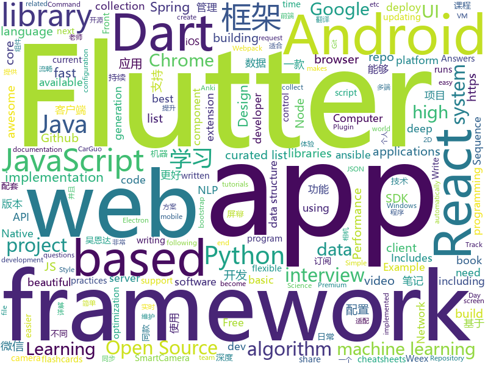

# 2018-08-29
See what the GitHub community is most excited about today.

## python
* [system-design-primer](https://github.com/donnemartin/system-design-primer)(**419 stars today**): Learn how to design large-scale systems. Prep for the system design interview. Includes Anki flashcards.
* [ML-From-Scratch](https://github.com/eriklindernoren/ML-From-Scratch)(**210 stars today**): Machine Learning From Scratch. Bare bones Python implementations of machine learning models and algorithms with a focus on accessibility. Aims to cover everything from data mining to deep learning.
* [databot](https://github.com/kkyon/databot)(**178 stars today**): High Performance Python Data driven programming framework for Web Crawler,ETL,Data pipeline work
* [yolov3](https://github.com/ultralytics/yolov3)(**107 stars today**): YOLOv3: Training and inference in PyTorch
* [adversarial-autoencoders-tf](https://github.com/conan7882/adversarial-autoencoders-tf)(**97 stars today**): Tensorflow implementation of Adversarial Autoencoders
* [vid2vid](https://github.com/NVIDIA/vid2vid)(**88 stars today**): Pytorch implementation of our method for high-resolution (e.g. 2048x1024) photorealistic video-to-video translation.
* [Apache-Struts-v3](https://github.com/s1kr10s/Apache-Struts-v3)(**75 stars today**): 
* [cheat.sh](https://github.com/chubin/cheat.sh)(**80 stars today**): the only cheat sheet you need
* [models](https://github.com/tensorflow/models)(**61 stars today**): Models and examples built with TensorFlow
* [hyperparameter_hunter](https://github.com/HunterMcGushion/hyperparameter_hunter)(**56 stars today**): Easy hyperparameter optimization and automatic result saving across machine learning algorithms and libraries
* [awesome-python](https://github.com/vinta/awesome-python)(**52 stars today**): A curated list of awesome Python frameworks, libraries, software and resources
* [autokeras](https://github.com/jhfjhfj1/autokeras)(**49 stars today**): accessible AutoML for deep learning.
* [django](https://github.com/django/django)(**40 stars today**): The Web framework for perfectionists with deadlines.
* [youtube-dl](https://github.com/rg3/youtube-dl)(**44 stars today**): Command-line program to download videos from YouTube.com and other video sites
* [interactive-coding-challenges](https://github.com/donnemartin/interactive-coding-challenges)(**44 stars today**): Interactive Python coding interview challenges (algorithms and data structures). Includes Anki flashcards.
* [meshroom](https://github.com/alicevision/meshroom)(**46 stars today**): 3D Reconstruction Software
* [Algorithm_Interview_Notes-Chinese](https://github.com/imhuay/Algorithm_Interview_Notes-Chinese)(**41 stars today**): 2018/2019/校招/春招/秋招/自然语言处理(NLP)/深度学习(Deep Learning)/机器学习(Machine Learning)/C/C++/Python/面试笔记
* [face_recognition](https://github.com/ageitgey/face_recognition)(**37 stars today**): The world's simplest facial recognition api for Python and the command line
* [keras](https://github.com/keras-team/keras)(**35 stars today**): Deep Learning for humans
* [struts-pwn_CVE-2018-11776](https://github.com/mazen160/struts-pwn_CVE-2018-11776)(**31 stars today**): An exploit for Apache Struts CVE-2018-11776
* [scrapy](https://github.com/scrapy/scrapy)(**32 stars today**): Scrapy, a fast high-level web crawling & scraping framework for Python.
* [odoo](https://github.com/odoo/odoo)(**29 stars today**): Odoo. Open Source Apps To Grow Your Business.
* [public-apis](https://github.com/toddmotto/public-apis)(**31 stars today**): A collective list of public JSON APIs for use in web development.
* [ansible](https://github.com/ansible/ansible)(**25 stars today**): Ansible is a radically simple IT automation platform that makes your applications and systems easier to deploy. Avoid writing scripts or custom code to deploy and update your applications — automate in a language that approaches plain English, using SSH, with no agents to install on remote systems. https://docs.ansible.com/ansible/
* [attn2d](https://github.com/elbayadm/attn2d)(**30 stars today**): Pervasive Attention: 2D Convolutional Networks for Sequence-to-Sequence Prediction

## java
* [Java-Guide](https://github.com/Snailclimb/Java-Guide)(**277 stars today**): A core knowledge that most Java programmers need to master
* [X2C](https://github.com/iReaderAndroid/X2C)(**217 stars today**): 提升布局加载速度200%
* [JCSprout](https://github.com/crossoverJie/JCSprout)(**136 stars today**): 👨‍🎓Java Core Sprout : basic, concurrent, algorithm
* [SmartCamera](https://github.com/pqpo/SmartCamera)(**131 stars today**): 📷SmartCamera 是一个 Android 相机拓展库，能够实时采集并且识别相机内物体边框是否吻合指定区域。SmartCamera is an Android camera extension library，provides a scanning module that can recognizes whether the object's border inside the camera matches the area in real time.
* [AndroidAutoSize](https://github.com/JessYanCoding/AndroidAutoSize)(**125 stars today**): A low-cost Android screen adaptation solution (今日头条屏幕适配方案终极版，一个极低成本的 Android 屏幕适配方案).
* [java-design-patterns](https://github.com/iluwatar/java-design-patterns)(**71 stars today**): Design patterns implemented in Java
* [UETool](https://github.com/eleme/UETool)(**66 stars today**): Show/edit any view's attributions on the screen.
* [WMRouter](https://github.com/meituan/WMRouter)(**60 stars today**): WMRouter是一款Android路由框架，基于组件化的设计思路，有功能灵活、使用简单的特点。
* [spring-boot](https://github.com/spring-projects/spring-boot)(**48 stars today**): Spring Boot
* [interviews](https://github.com/kdn251/interviews)(**50 stars today**): Everything you need to know to get the job.
* [weixin-java-tools](https://github.com/Wechat-Group/weixin-java-tools)(**46 stars today**): 全能微信Java开发工具包，支持包括微信支付、开放平台、小程序、企业号和公众号等的开发
* [elasticsearch](https://github.com/elastic/elasticsearch)(**39 stars today**): Open Source, Distributed, RESTful Search Engine
* [incubator-dubbo](https://github.com/apache/incubator-dubbo)(**31 stars today**): Apache Dubbo (incubating) is a high-performance, java based, open source RPC framework.
* [AndroidUtilCode](https://github.com/Blankj/AndroidUtilCode)(**36 stars today**): 🔥Android developers should collect the following utils(updating).
* [Sentinel](https://github.com/alibaba/Sentinel)(**37 stars today**): A lightweight flow-control library providing high-available protection and monitoring (高可用防护的流量管理框架)
* [guava](https://github.com/google/guava)(**38 stars today**): Google core libraries for Java
* [spring-cloud-code](https://github.com/SpringCloud/spring-cloud-code)(**36 stars today**): 《重新定义Spring Cloud实战》实体书对应源码
* [tutorials](https://github.com/eugenp/tutorials)(**25 stars today**): The "REST With Spring" Course (price changes permanently next Friday):
* [okhttp](https://github.com/square/okhttp)(**34 stars today**): An HTTP+HTTP/2 client for Android and Java applications.
* [porter](https://github.com/sxfad/porter)(**32 stars today**): Porter是一款数据同步中间件，主要用于解决同构/异构数据库之间的表级别数据同步问题。
* [apollo](https://github.com/ctripcorp/apollo)(**27 stars today**): Apollo（阿波罗）是携程框架部门研发的分布式配置中心，能够集中化管理应用不同环境、不同集群的配置，配置修改后能够实时推送到应用端，并且具备规范的权限、流程治理等特性，适用于微服务配置管理场景。
* [SocialSdkLibrary](https://github.com/chendongMarch/SocialSdkLibrary)(**30 stars today**): 提供微博、微信、QQ、钉钉的登陆分享功能支持，使用原生 SDK 接入，持续优化中
* [spring-framework](https://github.com/spring-projects/spring-framework)(**22 stars today**): Spring Framework
* [APIJSON](https://github.com/TommyLemon/APIJSON)(**29 stars today**): 🚀后端接口和文档自动化，前端(客户端) 定制返回JSON的数据和结构！
* [RxJava](https://github.com/ReactiveX/RxJava)(**23 stars today**): RxJava – Reactive Extensions for the JVM – a library for composing asynchronous and event-based programs using observable sequences for the Java VM.

## unknown
* [test-your-sysadmin-skills](https://github.com/trimstray/test-your-sysadmin-skills)(**813 stars today**): A collection of *nix Sysadmin Test Questions and Answers for Interview/Exam (2018 Edition).
* [randomrepo](https://github.com/SandboxEscaper/randomrepo)(**223 stars today**): Repo for random stuff
* [survivingtheappstore](https://github.com/amirrajan/survivingtheappstore)(**163 stars today**): My book on getting to the #1 Spot in the App Store. Buy my games to support me.
* [stanford-cs-229-machine-learning](https://github.com/afshinea/stanford-cs-229-machine-learning)(**150 stars today**): VIP cheatsheets for Stanford's CS 229 Machine Learning
* [100-Days-Of-ML-Code](https://github.com/Avik-Jain/100-Days-Of-ML-Code)(**136 stars today**): 100 Days of ML Coding
* [CS-Interview-Knowledge-Map](https://github.com/InterviewMap/CS-Interview-Knowledge-Map)(**137 stars today**): Build the best interview map. The current content includes JS, network, browser related, performance optimization, security, framework, Git, data structure, algorithm, etc.
* [CS-Notes](https://github.com/CyC2018/CS-Notes)(**88 stars today**): 📚Computer Science Learning Notes
* [Front-End-Performance-Checklist](https://github.com/thedaviddias/Front-End-Performance-Checklist)(**92 stars today**): 🎮The only Front-End Performance Checklist that runs faster than the others
* [developer-roadmap](https://github.com/kamranahmedse/developer-roadmap)(**75 stars today**): Roadmap to becoming a web developer in 2018
* [You-Dont-Know-JS](https://github.com/getify/You-Dont-Know-JS)(**73 stars today**): A book series on JavaScript. @YDKJS on twitter.
* [gitignore](https://github.com/github/gitignore)(**53 stars today**): A collection of useful .gitignore templates
* [awesome](https://github.com/sindresorhus/awesome)(**70 stars today**): 😎Curated list of awesome lists
* [coding-interview-university](https://github.com/jwasham/coding-interview-university)(**60 stars today**): A complete computer science study plan to become a software engineer.
* [free-programming-books](https://github.com/EbookFoundation/free-programming-books)(**55 stars today**): 📚Freely available programming books
* [Complete-CheatSheets](https://github.com/ShivamPanchal/Complete-CheatSheets)(**47 stars today**): This repo contains all the cheatsheets you need to keep handy, I will add more soon.
* [project-based-learning](https://github.com/tuvtran/project-based-learning)(**49 stars today**): Curated list of project-based tutorials
* [Awesome-Android-Interview](https://github.com/JsonChao/Awesome-Android-Interview)(**47 stars today**): 🔥A awesome android expert interview questions and answers（continuous updating ...）
* [awesome-vue](https://github.com/vuejs/awesome-vue)(**45 stars today**): 🎉A curated list of awesome things related to Vue.js
* [awesome-humane-tech](https://github.com/engagingspaces/awesome-humane-tech)(**43 stars today**): Improve society using this list of humane tech projects. Ethics, transparency, privacy, health (https://humanetech.com)
* [book-computer-networks](https://github.com/ruanyf/book-computer-networks)(**37 stars today**): Free E-Book: Computer Networks - A Systems Approach
* [gold-miner](https://github.com/xitu/gold-miner)(**36 stars today**): 🥇掘金翻译计划，可能是世界最大最好的英译中技术社区，最懂读者和译者的翻译平台：
* [nocode](https://github.com/kelseyhightower/nocode)(**35 stars today**): The best way to write secure and reliable applications. Write nothing; deploy nowhere.
* [unmaintainable-code](https://github.com/Droogans/unmaintainable-code)(**36 stars today**): A more maintainable, easier to share version of the infamous http://mindprod.com/jgloss/unmain.html
* [nodebestpractices](https://github.com/i0natan/nodebestpractices)(**34 stars today**): The largest Node.JS best practices list (August 2018)
* [arXivTimes](https://github.com/arXivTimes/arXivTimes)(**32 stars today**): repository to research & share the machine learning articles

## javascript
* [f2](https://github.com/antvis/f2)(**1,358 stars today**): 📱📈An elegant, interactive and flexible charting library for mobile.
* [windows95](https://github.com/felixrieseberg/windows95)(**969 stars today**): 💩🚀Windows 95 in Electron. Runs on macOS, Linux, and Windows.
* [BizCharts](https://github.com/alibaba/BizCharts)(**458 stars today**): data visualization library based G2 and React
* [code-surfer](https://github.com/pomber/code-surfer)(**438 stars today**): React component for scrolling, zooming and highlighting code <🏄/>
* [Enterprise](https://github.com/joaomilho/Enterprise)(**246 stars today**): The Enterprise™ programming language
* [ice](https://github.com/alibaba/ice)(**241 stars today**): 🚀飞冰 - 让前端开发简单而友好，海量可复用物料，配套桌面工具极速构建前端应用，效率提升 100%
* [taro-ui](https://github.com/NervJS/taro-ui)(**236 stars today**): 一款基于 Taro 框架开发的多端 UI 组件库
* [RSSHub](https://github.com/DIYgod/RSSHub)(**216 stars today**): 🍰万物皆可 RSS
* [reach-ui](https://github.com/reach/reach-ui)(**206 stars today**): The Accessible Foundation for React DOM Apps and Design Systems.
* [puppeteer-recorder](https://github.com/checkly/puppeteer-recorder)(**185 stars today**): Puppeteer recorder is a Chrome extension that records your browser interactions and generates a Puppeteer script.
* [mdx-deck](https://github.com/jxnblk/mdx-deck)(**162 stars today**): ♠️MDX-based presentation decks
* [vue](https://github.com/vuejs/vue)(**123 stars today**): 🖖A progressive, incrementally-adoptable JavaScript framework for building UI on the web.
* [javascript-algorithms](https://github.com/trekhleb/javascript-algorithms)(**110 stars today**): Algorithms and data structures implemented in JavaScript with explanations and links to further readings
* [create-react-app](https://github.com/facebook/create-react-app)(**97 stars today**): Create React apps with no build configuration.
* [react](https://github.com/facebook/react)(**95 stars today**): A declarative, efficient, and flexible JavaScript library for building user interfaces.
* [taro](https://github.com/NervJS/taro)(**97 stars today**): 多端统一开发框架，支持用 React 的开发方式编写一次代码，生成能运行在微信小程序、H5、React Native 等的应用。
* [babel](https://github.com/babel/babel)(**89 stars today**): 🐠Babel is a compiler for writing next generation JavaScript.
* [size-plugin](https://github.com/GoogleChromeLabs/size-plugin)(**75 stars today**): Track compressed Webpack asset sizes over time.
* [javascript](https://github.com/airbnb/javascript)(**66 stars today**): JavaScript Style Guide
* [axios](https://github.com/axios/axios)(**67 stars today**): Promise based HTTP client for the browser and node.js
* [react-motion](https://github.com/chenglou/react-motion)(**66 stars today**): A spring that solves your animation problems.
* [material-ui](https://github.com/mui-org/material-ui)(**53 stars today**): React components that implement Google's Material Design.
* [react-native](https://github.com/facebook/react-native)(**56 stars today**): A framework for building native apps with React.
* [puppeteer](https://github.com/GoogleChrome/puppeteer)(**58 stars today**): Headless Chrome Node API
* [Docusaurus](https://github.com/facebook/Docusaurus)(**56 stars today**): Easy to maintain open source documentation websites.

## html
* [awesome-mac](https://github.com/jaywcjlove/awesome-mac)(**30 stars today**):  Now we have become very big, Different from the original idea. Collect premium software in various categories.
* [styleguide](https://github.com/google/styleguide)(**21 stars today**): Style guides for Google-originated open-source projects
* [OI-wiki](https://github.com/24OI/OI-wiki)(**16 stars today**): 🌟Wiki for OI / ACM-ICPC. （某大型游戏线上攻略，内含炫酷算术魔法）
* [fastText](https://github.com/facebookresearch/fastText)(**20 stars today**): Library for fast text representation and classification.
* [goawk](https://github.com/benhoyt/goawk)(**20 stars today**): GoAWK: an AWK interpreter written in Go
* [react-app-rewired](https://github.com/timarney/react-app-rewired)(**19 stars today**): Override create-react-app webpack configs without ejecting
* [Spoon-Knife](https://github.com/octocat/Spoon-Knife)(****): This repo is for demonstration purposes only.
* [AdminLTE](https://github.com/almasaeed2010/AdminLTE)(**14 stars today**): AdminLTE - Free Premium Admin control Panel Theme Based On Bootstrap 3.x
* [irreader](https://github.com/fateleak/irreader)(**15 stars today**): irreader 网空万能阅读器，订阅你的订阅。
* [JavaScript30](https://github.com/wesbos/JavaScript30)(**10 stars today**): 30 Day Vanilla JS Challenge
* [deeplearning_ai_books](https://github.com/fengdu78/deeplearning_ai_books)(**12 stars today**): deeplearning.ai（吴恩达老师的深度学习课程笔记及资源）
* [patchwork](https://github.com/jlord/patchwork)(****): All the Git-it Workshop completers!
* [Coursera-ML-AndrewNg-Notes](https://github.com/fengdu78/Coursera-ML-AndrewNg-Notes)(**13 stars today**): 吴恩达老师的机器学习课程个人笔记
* [primeng](https://github.com/primefaces/primeng)(**11 stars today**): UI Components for Angular
* [node-interview](https://github.com/ElemeFE/node-interview)(**10 stars today**): How to pass the Node.js interview of ElemeFE.
* [electron-api-demos](https://github.com/electron/electron-api-demos)(**10 stars today**): Explore the Electron APIs
* [coreui-free-bootstrap-admin-template](https://github.com/coreui/coreui-free-bootstrap-admin-template)(**9 stars today**): CoreUI is free bootstrap admin template
* [openapi-generator](https://github.com/OpenAPITools/openapi-generator)(**9 stars today**): OpenAPI Generator allows generation of API client libraries (SDK generation), server stubs, documentation and configuration automatically given an OpenAPI Spec (v2, v3)
* [foundation-sites](https://github.com/zurb/foundation-sites)(**8 stars today**): The most advanced responsive front-end framework in the world. Quickly create prototypes and production code for sites that work on any kind of device.
* [NLP-progress](https://github.com/sebastianruder/NLP-progress)(**8 stars today**): Repository to track the progress in Natural Language Processing (NLP), including the datasets and the current state-of-the-art for the most common NLP tasks.
* [now-github-starter](https://github.com/zeit/now-github-starter)(****): Starter project to demonstrate a project whose pull requests get automatically deployed
* [fonts](https://github.com/google/fonts)(**8 stars today**): Font files available from Google Fonts
* [WebFundamentals](https://github.com/google/WebFundamentals)(**7 stars today**): Best practices for modern web development
* [RainCloudPlots](https://github.com/RainCloudPlots/RainCloudPlots)(**8 stars today**): Code and tutorials to visualise your data that is both beautiful *and* statistically valid
* [Winds](https://github.com/GetStream/Winds)(**8 stars today**): A Beautiful Open Source RSS & Podcast App Powered by Getstream.io

## dart
* [flutter](https://github.com/flutter/flutter)(**89 stars today**): Flutter makes it easy and fast to build beautiful mobile apps.
* [fluwx](https://github.com/OpenFlutter/fluwx)(**10 stars today**): A wechat plugin for flutter.Flutter版微信SDK
* [GSYGithubAppFlutter](https://github.com/CarGuo/GSYGithubAppFlutter)(**9 stars today**): 超完整的Flutter项目，功能丰富，适合学习和日常使用。GSYGithubApp系列的优势：我们目前已经拥有Flutter、Weex、ReactNative三个版本。 功能齐全，项目框架内技术涉及面广，完成度高，持续维护，配套文章，适合全面学习，跨框架对比参考。跨平台的开源Github客户端App，更好的体验，更丰富的功能，旨在更好的日常管理和维护个人Github，提供更好更方便的驾车体验～～Σ(￣。￣ﾉ)ﾉ。同款Weex版本 ： https://github.com/CarGuo/GSYGithubAppWeex 、同款React Native版本 ： https://github.com/CarGuo/GSYGithubApp
* [card_ui_kit](https://github.com/illukinati/card_ui_kit)(**7 stars today**): 
* [sdk](https://github.com/dart-lang/sdk)(**5 stars today**): The Dart SDK, including the VM, dart2js, core libraries, and more.
* [flutter_slidable](https://github.com/letsar/flutter_slidable)(**5 stars today**): A Flutter implementation of slidable list item with directional slide actions.
* [dart_language_server](https://github.com/natebosch/dart_language_server)(****): A shim on the analysis server following the language server protocol. This is not an official project from the Dart team.
* [flutter_built_redux](https://github.com/davidmarne/flutter_built_redux)(****): Built_redux provider for Flutter.
* [audio_recorder](https://github.com/ZaraclaJ/audio_recorder)(****): 
* [chromedeveditor](https://github.com/googlearchive/chromedeveditor)(****): Chrome Dev Editor is a developer tool for building apps on the Chrome platform - Chrome Apps and Web Apps, in JavaScript or Dart. (NO LONGER IN ACTIVE DEVELOPMENT)
* [plugins](https://github.com/flutter/plugins)(****): Plugins for Flutter, including FlutterFire, maintained by the Flutter team
* [flutter-osc](https://github.com/yubo725/flutter-osc)(****): 基于Google Flutter的开源中国客户端，支持Android和iOS。
* [flutter-examples](https://github.com/nisrulz/flutter-examples)(****): [Examples] Simple basic isolated apps, for budding flutter devs.
* [inKino](https://github.com/roughike/inKino)(****): inKino - A cross platform movie and showtime browser for Finnkino cinemas, made with Flutter.
* [hauberk](https://github.com/munificent/hauberk)(****): A web-based roguelike written in Dart.
* [flutter_architecture_samples](https://github.com/brianegan/flutter_architecture_samples)(****): TodoMVC for Flutter
* [Flutter-UI-Kit](https://github.com/iampawan/Flutter-UI-Kit)(****): Flutter app for collection of UI in a UIKit
* [Flutter-learning](https://github.com/AweiLoveAndroid/Flutter-learning)(****): 🔥👍🌟⭐️⭐️⭐️Flutter从配置安装到填坑指南详解，Flutter相关Demo解读，项目实例，Dart语法详解
* [FlutterExampleApps](https://github.com/iampawan/FlutterExampleApps)(****): [Example APPS] Basic Flutter apps, for flutter devs.
* [dio](https://github.com/flutterchina/dio)(****): A powerful Http client for Dart, which supports Interceptors, FormData, Request Cancellation, File Downloading, Timeout etc.
* [angular](https://github.com/dart-lang/angular)(****): Fast and productive web framework provided by Dart
* [StageXL](https://github.com/bp74/StageXL)(****): A fast and universal 2D rendering engine for HTML5 and Dart.
* [zhihu-flutter](https://github.com/HackSoul/zhihu-flutter)(****): Flutter 高仿知乎 UI，非常漂亮，也非常流畅，flutter build apk 或 flutter build ios 之后更流畅
* [dart-sass](https://github.com/sass/dart-sass)(****): A Dart implementation of Sass.
* [github-issue-mover](https://github.com/google/github-issue-mover)(****): Making it easy to migrate issues between repos.

## WordCloud

