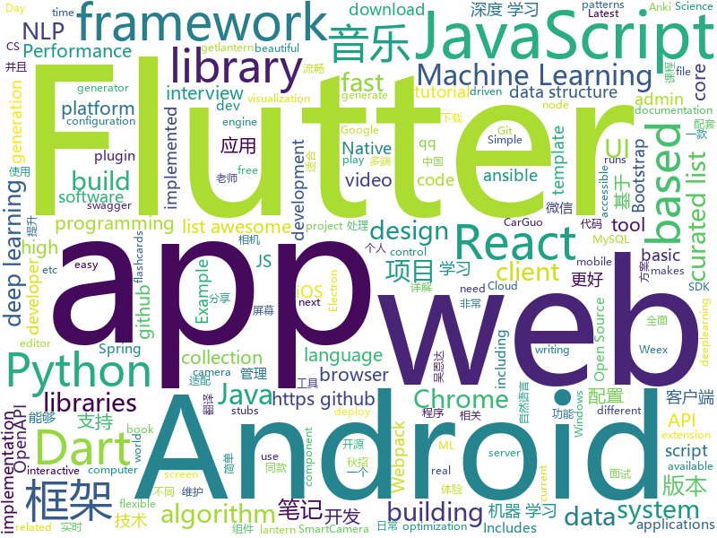

# 2018-08-30
See what the GitHub community is most excited about today.

## python
* [ML-From-Scratch](https://github.com/eriklindernoren/ML-From-Scratch)(**388 stars today**): Machine Learning From Scratch. Bare bones Python implementations of machine learning models and algorithms with a focus on accessibility. Aims to cover everything from data mining to deep learning.
* [system-design-primer](https://github.com/donnemartin/system-design-primer)(**277 stars today**): Learn how to design large-scale systems. Prep for the system design interview. Includes Anki flashcards.
* [databot](https://github.com/kkyon/databot)(**89 stars today**): High Performance Python Data driven programming framework for Web Crawler,ETL,Data pipeline work
* [models](https://github.com/tensorflow/models)(**52 stars today**): Models and examples built with TensorFlow
* [cheat.sh](https://github.com/chubin/cheat.sh)(**71 stars today**): the only cheat sheet you need
* [vid2vid](https://github.com/NVIDIA/vid2vid)(**65 stars today**): Pytorch implementation of our method for high-resolution (e.g. 2048x1024) photorealistic video-to-video translation.
* [awesome-python](https://github.com/vinta/awesome-python)(**57 stars today**): A curated list of awesome Python frameworks, libraries, software and resources
* [yolov3](https://github.com/ultralytics/yolov3)(**59 stars today**): YOLOv3: Training and inference in PyTorch
* [hyperparameter_hunter](https://github.com/HunterMcGushion/hyperparameter_hunter)(**54 stars today**): Easy hyperparameter optimization and automatic result saving across machine learning algorithms and libraries
* [Algorithm_Interview_Notes-Chinese](https://github.com/imhuay/Algorithm_Interview_Notes-Chinese)(**45 stars today**): 2018/2019/校招/春招/秋招/自然语言处理(NLP)/深度学习(Deep Learning)/机器学习(Machine Learning)/C/C++/Python/面试笔记
* [django](https://github.com/django/django)(**42 stars today**): The Web framework for perfectionists with deadlines.
* [odoo](https://github.com/odoo/odoo)(**37 stars today**): Odoo. Open Source Apps To Grow Your Business.
* [GSIL](https://github.com/FeeiCN/GSIL)(**44 stars today**): GitHub Sensitive Information Leakage（GitHub敏感信息泄露）
* [keras](https://github.com/keras-team/keras)(**38 stars today**): Deep Learning for humans
* [youtube-dl](https://github.com/rg3/youtube-dl)(**40 stars today**): Command-line program to download videos from YouTube.com and other video sites
* [face_recognition](https://github.com/ageitgey/face_recognition)(**36 stars today**): The world's simplest facial recognition api for Python and the command line
* [public-apis](https://github.com/toddmotto/public-apis)(**39 stars today**): A collective list of public JSON APIs for use in web development.
* [ansible](https://github.com/ansible/ansible)(**31 stars today**): Ansible is a radically simple IT automation platform that makes your applications and systems easier to deploy. Avoid writing scripts or custom code to deploy and update your applications — automate in a language that approaches plain English, using SSH, with no agents to install on remote systems. https://docs.ansible.com/ansible/
* [autokeras](https://github.com/jhfjhfj1/autokeras)(**37 stars today**): accessible AutoML for deep learning.
* [meshroom](https://github.com/alicevision/meshroom)(**36 stars today**): 3D Reconstruction Software
* [cpython](https://github.com/python/cpython)(**32 stars today**): The Python programming language
* [algo](https://github.com/trailofbits/algo)(**36 stars today**): Set up a personal IPSEC VPN in the cloud
* [awesome-machine-learning](https://github.com/josephmisiti/awesome-machine-learning)(**31 stars today**): A curated list of awesome Machine Learning frameworks, libraries and software.
* [interactive-coding-challenges](https://github.com/donnemartin/interactive-coding-challenges)(**32 stars today**): Interactive Python coding interview challenges (algorithms and data structures). Includes Anki flashcards.
* [AiLearning](https://github.com/apachecn/AiLearning)(**26 stars today**): AiLearning: 机器学习 - MachineLearning - ML、深度学习 - DeepLearning - DL、自然语言处理 NLP

## java
* [JCSprout](https://github.com/crossoverJie/JCSprout)(**272 stars today**): 👨‍🎓Java Core Sprout : basic, concurrent, algorithm
* [Java-Guide](https://github.com/Snailclimb/Java-Guide)(**205 stars today**): A core knowledge that most Java programmers need to master
* [AndroidAutoSize](https://github.com/JessYanCoding/AndroidAutoSize)(**140 stars today**): A low-cost Android screen adaptation solution (今日头条屏幕适配方案终极版，一个极低成本的 Android 屏幕适配方案).
* [MusicLake](https://github.com/caiyonglong/MusicLake)(**140 stars today**): 音乐播放器，可播放本地音乐，百度音乐，qq音乐，虾米音乐，网易云音乐
* [X2C](https://github.com/iReaderAndroid/X2C)(**119 stars today**): 提升布局加载速度200%
* [java-design-patterns](https://github.com/iluwatar/java-design-patterns)(**81 stars today**): Design patterns implemented in Java
* [spring-boot](https://github.com/spring-projects/spring-boot)(**59 stars today**): Spring Boot
* [interviews](https://github.com/kdn251/interviews)(**62 stars today**): Everything you need to know to get the job.
* [incubator-dubbo](https://github.com/apache/incubator-dubbo)(**46 stars today**): Apache Dubbo (incubating) is a high-performance, java based, open source RPC framework.
* [weixin-java-tools](https://github.com/Wechat-Group/weixin-java-tools)(**53 stars today**): 全能微信Java开发工具包，支持包括微信支付、开放平台、小程序、企业号和公众号等的开发
* [SmartCamera](https://github.com/pqpo/SmartCamera)(**55 stars today**): 📷SmartCamera 是一个 Android 相机拓展库，能够实时采集并且识别相机内物体边框是否吻合指定区域。SmartCamera is an Android camera extension library，provides a scanning module that can recognizes whether the object's border inside the camera matches the area in real time.
* [proxyee-down](https://github.com/proxyee-down-org/proxyee-down)(**49 stars today**): http下载工具，基于http代理，支持多连接分块下载
* [elasticsearch](https://github.com/elastic/elasticsearch)(**46 stars today**): Open Source, Distributed, RESTful Search Engine
* [guava](https://github.com/google/guava)(**44 stars today**): Google core libraries for Java
* [tutorials](https://github.com/eugenp/tutorials)(**30 stars today**): The "REST With Spring" Course (price changes permanently next Friday):
* [AndroidUtilCode](https://github.com/Blankj/AndroidUtilCode)(**37 stars today**): 🔥Android developers should collect the following utils(updating).
* [mybatis-plus](https://github.com/baomidou/mybatis-plus)(**40 stars today**): An enhanced toolkit of Mybatis to simplify development
* [apollo](https://github.com/ctripcorp/apollo)(**33 stars today**): Apollo（阿波罗）是携程框架部门研发的分布式配置中心，能够集中化管理应用不同环境、不同集群的配置，配置修改后能够实时推送到应用端，并且具备规范的权限、流程治理等特性，适用于微服务配置管理场景。
* [epoxy](https://github.com/airbnb/epoxy)(**37 stars today**): Epoxy is an Android library for building complex screens in a RecyclerView
* [Java](https://github.com/TheAlgorithms/Java)(**29 stars today**): All Algorithms implemented in Java
* [spring-cloud-code](https://github.com/SpringCloud/spring-cloud-code)(**29 stars today**): 《重新定义Spring Cloud实战》实体书对应源码
* [Sentinel](https://github.com/alibaba/Sentinel)(**29 stars today**): A lightweight flow-control library providing high-available protection and monitoring (高可用防护的流量管理框架)
* [spring-framework](https://github.com/spring-projects/spring-framework)(**23 stars today**): Spring Framework
* [WMRouter](https://github.com/meituan/WMRouter)(**29 stars today**): WMRouter是一款Android路由框架，基于组件化的设计思路，有功能灵活、使用简单的特点。
* [okhttp](https://github.com/square/okhttp)(**25 stars today**): An HTTP+HTTP/2 client for Android and Java applications.

## unknown
* [test-your-sysadmin-skills](https://github.com/trimstray/test-your-sysadmin-skills)(**821 stars today**): A collection of *nix Sysadmin Test Questions and Answers for Interview/Exam (2018 Edition).
* [Front-End-Performance-Checklist](https://github.com/thedaviddias/Front-End-Performance-Checklist)(**422 stars today**): 🎮The only Front-End Performance Checklist that runs faster than the others
* [randomrepo](https://github.com/SandboxEscaper/randomrepo)(**186 stars today**): Repo for random stuff
* [CS-Notes](https://github.com/CyC2018/CS-Notes)(**128 stars today**): 📚Computer Science Learning Notes
* [CS-Interview-Knowledge-Map](https://github.com/InterviewMap/CS-Interview-Knowledge-Map)(**119 stars today**): Build the best interview map. The current content includes JS, network, browser related, performance optimization, security, framework, Git, data structure, algorithm, etc.
* [100-Days-Of-ML-Code](https://github.com/Avik-Jain/100-Days-Of-ML-Code)(**100 stars today**): 100 Days of ML Coding
* [developer-roadmap](https://github.com/kamranahmedse/developer-roadmap)(**79 stars today**): Roadmap to becoming a web developer in 2018
* [awesome](https://github.com/sindresorhus/awesome)(**77 stars today**): 😎Curated list of awesome lists
* [You-Dont-Know-JS](https://github.com/getify/You-Dont-Know-JS)(**68 stars today**): A book series on JavaScript. @YDKJS on twitter.
* [free-programming-books](https://github.com/EbookFoundation/free-programming-books)(**70 stars today**): 📚Freely available programming books
* [stanford-cs-229-machine-learning](https://github.com/afshinea/stanford-cs-229-machine-learning)(**69 stars today**): VIP cheatsheets for Stanford's CS 229 Machine Learning
* [gitignore](https://github.com/github/gitignore)(**55 stars today**): A collection of useful .gitignore templates
* [2019_campus_apply](https://github.com/frank-lam/2019_campus_apply)(**63 stars today**): 🚀备战秋招/面试，CS学习笔记。金九银十你准备好了吗？from zero to hero.
* [architect-awesome](https://github.com/xingshaocheng/architect-awesome)(**57 stars today**): 后端架构师技术图谱
* [project-based-learning](https://github.com/tuvtran/project-based-learning)(**56 stars today**): Curated list of project-based tutorials
* [awesome-vue](https://github.com/vuejs/awesome-vue)(**52 stars today**): 🎉A curated list of awesome things related to Vue.js
* [coding-interview-university](https://github.com/jwasham/coding-interview-university)(**44 stars today**): A complete computer science study plan to become a software engineer.
* [build-your-own-x](https://github.com/danistefanovic/build-your-own-x)(**46 stars today**): 🤓Build your own (insert technology here)
* [download](https://github.com/getlantern/download)(**43 stars today**): 🔴蓝灯最新版本下载 https://github.com/getlantern/download🔴Lantern Latest Download https://github.com/getlantern/lantern/releases/tag/latest🔴
* [mysql-tutorial](https://github.com/jaywcjlove/mysql-tutorial)(**39 stars today**): MySQL入门教程（MySQL tutorial book）
* [gold-miner](https://github.com/xitu/gold-miner)(**38 stars today**): 🥇掘金翻译计划，可能是世界最大最好的英译中技术社区，最懂读者和译者的翻译平台：
* [android-architecture](https://github.com/googlesamples/android-architecture)(**31 stars today**): A collection of samples to discuss and showcase different architectural tools and patterns for Android apps.
* [kubernetes-the-hard-way](https://github.com/kelseyhightower/kubernetes-the-hard-way)(**36 stars today**): Bootstrap Kubernetes the hard way on Google Cloud Platform. No scripts.
* [interview](https://github.com/jiajunhuang/interview)(**36 stars today**): 面经分享
* [chinese-independent-developer](https://github.com/1c7/chinese-independent-developer)(**32 stars today**): 👩🏿‍💻👨🏾‍💻👩🏼‍💻👨🏽‍💻👩🏻‍💻中国独立开发者项目列表 -- 分享大家都在做什么

## javascript
* [f2](https://github.com/antvis/f2)(**867 stars today**): 📱📈An elegant, interactive and flexible charting library for mobile.
* [windows95](https://github.com/felixrieseberg/windows95)(**567 stars today**): 💩🚀Windows 95 in Electron. Runs on macOS, Linux, and Windows.
* [reach-ui](https://github.com/reach/reach-ui)(**404 stars today**): The Accessible Foundation for React DOM Apps and Design Systems.
* [CivJS](https://github.com/Venerons/CivJS)(**269 stars today**): A JavaScript 4X Game
* [code-surfer](https://github.com/pomber/code-surfer)(**241 stars today**): React component for scrolling, zooming and highlighting code <🏄/>
* [BizCharts](https://github.com/alibaba/BizCharts)(**214 stars today**): data visualization library based G2 and React
* [puppeteer-recorder](https://github.com/checkly/puppeteer-recorder)(**197 stars today**): Puppeteer recorder is a Chrome extension that records your browser interactions and generates a Puppeteer script.
* [RSSHub](https://github.com/DIYgod/RSSHub)(**191 stars today**): 🍰万物皆可 RSS
* [taro-ui](https://github.com/NervJS/taro-ui)(**181 stars today**): 一款基于 Taro 框架开发的多端 UI 组件库
* [ice](https://github.com/alibaba/ice)(**151 stars today**): 🚀飞冰 - 让前端开发简单而友好，海量可复用物料，配套桌面工具极速构建前端应用，效率提升 100%
* [vue](https://github.com/vuejs/vue)(**122 stars today**): 🖖A progressive, incrementally-adoptable JavaScript framework for building UI on the web.
* [zeu](https://github.com/shzlw/zeu)(**125 stars today**): A JavaScript library for real-time visualization
* [lerna](https://github.com/lerna/lerna)(**109 stars today**): 🐉A tool for managing JavaScript projects with multiple packages.
* [Enterprise](https://github.com/joaomilho/Enterprise)(**110 stars today**): 🦄The Enterprise™ programming language
* [mdx-deck](https://github.com/jxnblk/mdx-deck)(**107 stars today**): ♠️MDX-based presentation decks
* [javascript-algorithms](https://github.com/trekhleb/javascript-algorithms)(**94 stars today**): Algorithms and data structures implemented in JavaScript with explanations and links to further readings
* [react](https://github.com/facebook/react)(**86 stars today**): A declarative, efficient, and flexible JavaScript library for building user interfaces.
* [taro](https://github.com/NervJS/taro)(**91 stars today**): 多端统一开发框架，支持用 React 的开发方式编写一次代码，生成能运行在微信小程序、H5、React Native 等的应用。
* [babel](https://github.com/babel/babel)(**86 stars today**): 🐠Babel is a compiler for writing next generation JavaScript.
* [axios](https://github.com/axios/axios)(**75 stars today**): Promise based HTTP client for the browser and node.js
* [puppeteer](https://github.com/GoogleChrome/puppeteer)(**72 stars today**): Headless Chrome Node API
* [create-react-app](https://github.com/facebook/create-react-app)(**62 stars today**): Create React apps with no build configuration.
* [react-native](https://github.com/facebook/react-native)(**65 stars today**): A framework for building native apps with React.
* [gatsby](https://github.com/gatsbyjs/gatsby)(**55 stars today**): ⚛️📄🚀Blazing fast site generator for React
* [react-color-extractor](https://github.com/nitin42/react-color-extractor)(**57 stars today**): A React component which extracts colors from an image

## html
* [quantum_machine_learning](https://github.com/llSourcell/quantum_machine_learning)(**49 stars today**): This is the code for "Quantum Machine Learning" By Siraj Raval on Youtube
* [magic-instruments](https://github.com/SaraVieira/magic-instruments)(**39 stars today**): Magic Instruments .- Play music with the world
* [OI-wiki](https://github.com/24OI/OI-wiki)(**26 stars today**): 🌟Wiki for OI / ACM-ICPC. （某大型游戏线上攻略，内含炫酷算术魔法）
* [AdminLTE](https://github.com/almasaeed2010/AdminLTE)(**29 stars today**): AdminLTE - Free Premium Admin control Panel Theme Based On Bootstrap 3.x
* [Coursera-ML-AndrewNg-Notes](https://github.com/fengdu78/Coursera-ML-AndrewNg-Notes)(**17 stars today**): 吴恩达老师的机器学习课程个人笔记
* [NLP-progress](https://github.com/sebastianruder/NLP-progress)(**16 stars today**): Repository to track the progress in Natural Language Processing (NLP), including the datasets and the current state-of-the-art for the most common NLP tasks.
* [Spoon-Knife](https://github.com/octocat/Spoon-Knife)(****): This repo is for demonstration purposes only.
* [patchwork](https://github.com/jlord/patchwork)(****): All the Git-it Workshop completers!
* [react-app-rewired](https://github.com/timarney/react-app-rewired)(**14 stars today**): Override create-react-app webpack configs without ejecting
* [fastText](https://github.com/facebookresearch/fastText)(**12 stars today**): Library for fast text representation and classification.
* [electron-api-demos](https://github.com/electron/electron-api-demos)(**10 stars today**): Explore the Electron APIs
* [portainer](https://github.com/portainer/portainer)(**10 stars today**): Simple management UI for Docker
* [WebFundamentals](https://github.com/google/WebFundamentals)(**10 stars today**): Best practices for modern web development
* [JavaScript30](https://github.com/wesbos/JavaScript30)(**5 stars today**): 30 Day Vanilla JS Challenge
* [TinyEditor](https://github.com/umpox/TinyEditor)(**10 stars today**): A functional HTML/CSS/JS editor in less than 400 bytes
* [walle-web](https://github.com/meolu/walle-web)(**8 stars today**): A Web Deployment Tool (web代码部署工具)
* [swagger-codegen](https://github.com/swagger-api/swagger-codegen)(**8 stars today**): swagger-codegen contains a template-driven engine to generate documentation, API clients and server stubs in different languages by parsing your OpenAPI / Swagger definition.
* [openapi-generator](https://github.com/OpenAPITools/openapi-generator)(**9 stars today**): OpenAPI Generator allows generation of API client libraries (SDK generation), server stubs, documentation and configuration automatically given an OpenAPI Spec (v2, v3)
* [deeplearning_ai_books](https://github.com/fengdu78/deeplearning_ai_books)(**9 stars today**): deeplearning.ai（吴恩达老师的深度学习课程笔记及资源）
* [ecma262](https://github.com/tc39/ecma262)(**9 stars today**): Status, process, and documents for ECMA262
* [Adminator-admin-dashboard](https://github.com/puikinsh/Adminator-admin-dashboard)(**8 stars today**): Adminator is a easy to use and well design admin dashboard template for web apps, websites, services and more
* [coreui-free-bootstrap-admin-template](https://github.com/coreui/coreui-free-bootstrap-admin-template)(**7 stars today**): CoreUI is free bootstrap admin template
* [RainCloudPlots](https://github.com/RainCloudPlots/RainCloudPlots)(**8 stars today**): Code and tutorials to visualise your data that is both beautiful *and* statistically valid
* [dive-into-webpack](https://github.com/gwuhaolin/dive-into-webpack)(**8 stars today**): 全面的Webpack教程《深入浅出Webpack》电子书
* [EIPs](https://github.com/ethereum/EIPs)(**6 stars today**): The Ethereum Improvement Proposal repository

## dart
* [flutter](https://github.com/flutter/flutter)(**87 stars today**): Flutter makes it easy and fast to build beautiful mobile apps.
* [plugins](https://github.com/flutter/plugins)(**17 stars today**): Plugins for Flutter, including FlutterFire, maintained by the Flutter team
* [GankFlutter](https://github.com/ZQ330093887/GankFlutter)(**19 stars today**): 干货集中营 客户端 flutter版
* [GSYGithubAppFlutter](https://github.com/CarGuo/GSYGithubAppFlutter)(**14 stars today**): 超完整的Flutter项目，功能丰富，适合学习和日常使用。GSYGithubApp系列的优势：我们目前已经拥有Flutter、Weex、ReactNative三个版本。 功能齐全，项目框架内技术涉及面广，完成度高，持续维护，配套文章，适合全面学习，跨框架对比参考。跨平台的开源Github客户端App，更好的体验，更丰富的功能，旨在更好的日常管理和维护个人Github，提供更好更方便的驾车体验～～Σ(￣。￣ﾉ)ﾉ。同款Weex版本 ： https://github.com/CarGuo/GSYGithubAppWeex 、同款React Native版本 ： https://github.com/CarGuo/GSYGithubApp
* [Flutter-UI-Kit](https://github.com/iampawan/Flutter-UI-Kit)(**9 stars today**): Flutter app for collection of UI in a UIKit
* [PullToRefresh](https://github.com/baoolong/PullToRefresh)(**7 stars today**): Flutter相关的项目QQ:277155832 Email:277155832@qq.com
* [fluwx](https://github.com/OpenFlutter/fluwx)(**6 stars today**): A wechat plugin for flutter.Flutter版微信SDK
* [sdk](https://github.com/dart-lang/sdk)(**5 stars today**): The Dart SDK, including the VM, dart2js, core libraries, and more.
* [flutter_cache_manager](https://github.com/renefloor/flutter_cache_manager)(****): Generic cache manager for flutter
* [audioplayer](https://github.com/luanpotter/audioplayer)(****): A Flutter plugin to play multiple audio files simultaneously (Android/iOS)
* [dart-sass](https://github.com/sass/dart-sass)(****): A Dart implementation of Sass.
* [webdev](https://github.com/dart-lang/webdev)(****): A CLI for Dart web development.
* [flutter_google_places_autocomplete](https://github.com/lejard-h/flutter_google_places_autocomplete)(****): 
* [chromedeveditor](https://github.com/googlearchive/chromedeveditor)(****): Chrome Dev Editor is a developer tool for building apps on the Chrome platform - Chrome Apps and Web Apps, in JavaScript or Dart. (NO LONGER IN ACTIVE DEVELOPMENT)
* [flutter-osc](https://github.com/yubo725/flutter-osc)(****): 基于Google Flutter的开源中国客户端，支持Android和iOS。
* [flutter-examples](https://github.com/nisrulz/flutter-examples)(****): [Examples] Simple basic isolated apps, for budding flutter devs.
* [inKino](https://github.com/roughike/inKino)(****): inKino - A cross platform movie and showtime browser for Finnkino cinemas, made with Flutter.
* [hauberk](https://github.com/munificent/hauberk)(****): A web-based roguelike written in Dart.
* [flutter_architecture_samples](https://github.com/brianegan/flutter_architecture_samples)(****): TodoMVC for Flutter
* [Flutter-learning](https://github.com/AweiLoveAndroid/Flutter-learning)(****): 🔥👍🌟⭐️⭐️⭐️Flutter从配置安装到填坑指南详解，Flutter相关Demo解读，项目实例，Dart语法详解
* [FlutterExampleApps](https://github.com/iampawan/FlutterExampleApps)(****): [Example APPS] Basic Flutter apps, for flutter devs.
* [dio](https://github.com/flutterchina/dio)(****): A powerful Http client for Dart, which supports Interceptors, FormData, Request Cancellation, File Downloading, Timeout etc.
* [angular](https://github.com/dart-lang/angular)(****): Fast and productive web framework provided by Dart
* [StageXL](https://github.com/bp74/StageXL)(****): A fast and universal 2D rendering engine for HTML5 and Dart.
* [zhihu-flutter](https://github.com/HackSoul/zhihu-flutter)(****): Flutter 高仿知乎 UI，非常漂亮，也非常流畅，flutter build apk 或 flutter build ios 之后更流畅

## WordCloud

