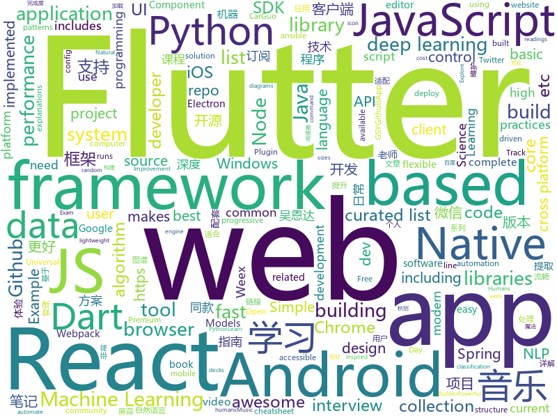

# 2018-09-01
See what the GitHub community is most excited about today.

## python
* [learn-python](https://github.com/trekhleb/learn-python)(**333 stars today**): 📚Playground and cheatsheet for learning Python
* [system-design-primer](https://github.com/donnemartin/system-design-primer)(**153 stars today**): Learn how to design large-scale systems. Prep for the system design interview. Includes Anki flashcards.
* [ML-From-Scratch](https://github.com/eriklindernoren/ML-From-Scratch)(**132 stars today**): Machine Learning From Scratch. Bare bones Python implementations of machine learning models and algorithms with a focus on accessibility. Aims to cover everything from data mining to deep learning.
* [awesome-python](https://github.com/vinta/awesome-python)(**65 stars today**): A curated list of awesome Python frameworks, libraries, software and resources
* [tldr](https://github.com/tldr-pages/tldr)(**68 stars today**): 📚Simplified and community-driven man pages
* [databot](https://github.com/kkyon/databot)(**59 stars today**): High Performance Python Data driven programming framework for Data pipeline work( Web Crawler,ETL,Machine Learning.etc)
* [Bowler](https://github.com/facebookincubator/Bowler)(**58 stars today**): Safe code refactoring for modern Python.
* [models](https://github.com/tensorflow/models)(**47 stars today**): Models and examples built with TensorFlow
* [Algorithm_Interview_Notes-Chinese](https://github.com/imhuay/Algorithm_Interview_Notes-Chinese)(**53 stars today**): 2018/2019/校招/春招/秋招/自然语言处理(NLP)/深度学习(Deep Learning)/机器学习(Machine Learning)/C/C++/Python/面试笔记
* [keras](https://github.com/keras-team/keras)(**39 stars today**): Deep Learning for humans
* [pytheory](https://github.com/kennethreitz/pytheory)(**45 stars today**): Music Theory for Humans.
* [cheat.sh](https://github.com/chubin/cheat.sh)(**40 stars today**): the only cheat sheet you need
* [youtube-dl](https://github.com/rg3/youtube-dl)(**39 stars today**): Command-line program to download videos from YouTube.com and other video sites
* [flask](https://github.com/pallets/flask)(**39 stars today**): The Python micro framework for building web applications.
* [home-assistant](https://github.com/home-assistant/home-assistant)(**35 stars today**): 🏡Open source home automation that puts local control and privacy first
* [face_recognition](https://github.com/ageitgey/face_recognition)(**37 stars today**): The world's simplest facial recognition api for Python and the command line
* [blockchain](https://github.com/OpensourceBooks/blockchain)(**33 stars today**): 开源教程：从零开始写区块链
* [django](https://github.com/django/django)(**29 stars today**): The Web framework for perfectionists with deadlines.
* [public-apis](https://github.com/toddmotto/public-apis)(**32 stars today**): A collective list of public JSON APIs for use in web development.
* [autokeras](https://github.com/jhfjhfj1/autokeras)(**27 stars today**): accessible AutoML for deep learning.
* [scikit-learn](https://github.com/scikit-learn/scikit-learn)(**23 stars today**): scikit-learn: machine learning in Python
* [ansible](https://github.com/ansible/ansible)(**19 stars today**): Ansible is a radically simple IT automation platform that makes your applications and systems easier to deploy. Avoid writing scripts or custom code to deploy and update your applications — automate in a language that approaches plain English, using SSH, with no agents to install on remote systems. https://docs.ansible.com/ansible/
* [XX-Net](https://github.com/XX-net/XX-Net)(**25 stars today**): a web proxy tool
* [DeepLabCut](https://github.com/AlexEMG/DeepLabCut)(**27 stars today**): Markerless tracking of user-defined features with deep learning
* [papermill](https://github.com/nteract/papermill)(**27 stars today**): 📚Parameterize, execute, and analyze notebooks

## java
* [tink](https://github.com/google/tink)(**567 stars today**): Tink is a multi-language, cross-platform library that provides cryptographic APIs that are secure, easy to use correctly, and hard(er) to misuse.
* [Java-Guide](https://github.com/Snailclimb/Java-Guide)(**135 stars today**): A core knowledge that most Java programmers need to master
* [proxyee-down](https://github.com/proxyee-down-org/proxyee-down)(**121 stars today**): http下载工具，基于http代理，支持多连接分块下载
* [JCSprout](https://github.com/crossoverJie/JCSprout)(**89 stars today**): 👨‍🎓Java Core Sprout : basic, concurrent, algorithm
* [java-design-patterns](https://github.com/iluwatar/java-design-patterns)(**69 stars today**): Design patterns implemented in Java
* [AwesomeDrawer](https://github.com/Android500/AwesomeDrawer)(**77 stars today**): materail awsome anim
* [interviews](https://github.com/kdn251/interviews)(**71 stars today**): Everything you need to know to get the job.
* [AndroidAutoSize](https://github.com/JessYanCoding/AndroidAutoSize)(**60 stars today**): A low-cost Android screen adaptation solution (今日头条屏幕适配方案终极版，一个极低成本的 Android 屏幕适配方案).
* [MusicLake](https://github.com/caiyonglong/MusicLake)(**55 stars today**): 音乐播放器，可播放本地音乐，百度音乐，qq音乐，虾米音乐，网易云音乐
* [spring-boot](https://github.com/spring-projects/spring-boot)(**39 stars today**): Spring Boot
* [elasticsearch](https://github.com/elastic/elasticsearch)(**42 stars today**): Open Source, Distributed, RESTful Search Engine
* [incubator-dubbo](https://github.com/apache/incubator-dubbo)(**38 stars today**): Apache Dubbo (incubating) is a high-performance, java based, open source RPC framework.
* [X2C](https://github.com/iReaderAndroid/X2C)(**45 stars today**): 提升布局加载速度200%
* [blog](https://github.com/pkwenda/blog)(**45 stars today**): 全栈方向的系列文章
* [react-native-navigation](https://github.com/wix/react-native-navigation)(**42 stars today**): A complete native navigation solution for React Native
* [weixin-java-tools](https://github.com/Wechat-Group/weixin-java-tools)(**37 stars today**): 全能微信Java开发工具包，支持包括微信支付、开放平台、小程序、企业号和公众号等的开发
* [spring-framework](https://github.com/spring-projects/spring-framework)(**32 stars today**): Spring Framework
* [tutorials](https://github.com/eugenp/tutorials)(**25 stars today**): The "REST With Spring" Course (price changes permanently next Friday):
* [guava](https://github.com/google/guava)(**29 stars today**): Google core libraries for Java
* [AndroidUtilCode](https://github.com/Blankj/AndroidUtilCode)(**26 stars today**): 🔥Android developers should collect the following utils(updating).
* [ExpandableTextView](https://github.com/MZCretin/ExpandableTextView)(**31 stars today**): 实现类似微博内容，@用户，链接高亮，@用户和链接可点击跳转，可展开和收回的TextView
* [Sentinel](https://github.com/alibaba/Sentinel)(**28 stars today**): A lightweight flow-control library providing high-available protection and monitoring (高可用防护的流量管理框架)
* [Java](https://github.com/TheAlgorithms/Java)(**24 stars today**): All Algorithms implemented in Java
* [okhttp](https://github.com/square/okhttp)(**25 stars today**): An HTTP+HTTP/2 client for Android and Java applications.
* [HanLP](https://github.com/hankcs/HanLP)(**25 stars today**): 自然语言处理 中文分词 词性标注 命名实体识别 依存句法分析 关键词提取 新词发现 短语提取 自动摘要 文本分类 拼音简繁

## unknown
* [test-your-sysadmin-skills](https://github.com/trimstray/test-your-sysadmin-skills)(**366 stars today**): A collection of *nix Sysadmin Test Questions and Answers for Interview/Exam (2018 Edition).
* [Front-End-Performance-Checklist](https://github.com/thedaviddias/Front-End-Performance-Checklist)(**202 stars today**): 🎮The only Front-End Performance Checklist that runs faster than the others
* [nodebestpractices](https://github.com/i0natan/nodebestpractices)(**180 stars today**): The largest Node.JS best practices list (August 2018)
* [node-in-debugging](https://github.com/nswbmw/node-in-debugging)(**100 stars today**): 《Node.js 调试指南》
* [CS-Notes](https://github.com/CyC2018/CS-Notes)(**79 stars today**): 📚Computer Science Learning Notes
* [Move_37_Syllabus](https://github.com/llSourcell/Move_37_Syllabus)(**81 stars today**): work in progress
* [100-Days-Of-ML-Code](https://github.com/Avik-Jain/100-Days-Of-ML-Code)(**76 stars today**): 100 Days of ML Coding
* [coding-interview-university](https://github.com/jwasham/coding-interview-university)(**75 stars today**): A complete computer science study plan to become a software engineer.
* [developer-roadmap](https://github.com/kamranahmedse/developer-roadmap)(**73 stars today**): Roadmap to becoming a web developer in 2018
* [awesome](https://github.com/sindresorhus/awesome)(**67 stars today**): 😎Curated list of awesome lists
* [free-programming-books](https://github.com/EbookFoundation/free-programming-books)(**59 stars today**): 📚Freely available programming books
* [build-your-own-x](https://github.com/danistefanovic/build-your-own-x)(**60 stars today**): 🤓Build your own (insert technology here)
* [You-Dont-Know-JS](https://github.com/getify/You-Dont-Know-JS)(**52 stars today**): A book series on JavaScript. @YDKJS on twitter.
* [CS-Interview-Knowledge-Map](https://github.com/InterviewMap/CS-Interview-Knowledge-Map)(**46 stars today**): Build the best interview map. The current content includes JS, network, browser related, performance optimization, security, framework, Git, data structure, algorithm, etc.
* [gitignore](https://github.com/github/gitignore)(**41 stars today**): A collection of useful .gitignore templates
* [react-advanced-patterns](https://github.com/manjula91/react-advanced-patterns)(**48 stars today**): Advanced React Component Patterns
* [architect-awesome](https://github.com/xingshaocheng/architect-awesome)(**40 stars today**): 后端架构师技术图谱
* [randomrepo](https://github.com/SandboxEscaper/randomrepo)(**33 stars today**): Repo for random stuff
* [awesome-vue](https://github.com/vuejs/awesome-vue)(**40 stars today**): 🎉A curated list of awesome things related to Vue.js
* [FreeProGuard](https://github.com/Blankj/FreeProGuard)(**39 stars today**): 🔰Config proguard for common Android libraries.
* [awesome-flutter](https://github.com/Solido/awesome-flutter)(**33 stars today**): An awesome list that curates the best Flutter libraries, tools, tutorials, articles and more.
* [project-based-learning](https://github.com/tuvtran/project-based-learning)(**33 stars today**): Curated list of project-based tutorials
* [stanford-cs-229-machine-learning](https://github.com/afshinea/stanford-cs-229-machine-learning)(**27 stars today**): VIP cheatsheets for Stanford's CS 229 Machine Learning
* [new-pac](https://github.com/Alvin9999/new-pac)(**26 stars today**): 
* [javascript-visual-explanations](https://github.com/hex13/javascript-visual-explanations)(**30 stars today**): Javascript Visual Explanations - concepts from JS/frontend ecosystem explained visually (pictures, diagrams, animations etc.)

## javascript
* [windows95](https://github.com/felixrieseberg/windows95)(**353 stars today**): 💩🚀Windows 95 in Electron. Runs on macOS, Linux, and Windows.
* [f2](https://github.com/antvis/f2)(**297 stars today**): 📱📈An elegant, interactive and flexible charting library for mobile.
* [proven](https://github.com/dschep/proven)(**227 stars today**): 🔑✅An alternative to Twitter's verified accounts powered by Keybase.
* [v86](https://github.com/copy/v86)(**194 stars today**): x86 virtualization in JavaScript, running in your browser and NodeJS
* [puppeteer-recorder](https://github.com/checkly/puppeteer-recorder)(**165 stars today**): Puppeteer recorder is a Chrome extension that records your browser interactions and generates a Puppeteer script.
* [vue](https://github.com/vuejs/vue)(**147 stars today**): 🖖A progressive, incrementally-adoptable JavaScript framework for building UI on the web.
* [pwa](https://github.com/lukeed/pwa)(**141 stars today**): (WIP) Universal PWA Builder
* [BizCharts](https://github.com/alibaba/BizCharts)(**125 stars today**): Powerful data visualization library based on G2 and React.
* [progressive-tooling](https://github.com/GoogleChromeLabs/progressive-tooling)(**122 stars today**): A list of community-built, third-party tools that can be used to improve page performance
* [lerna](https://github.com/lerna/lerna)(**120 stars today**): 🐉A tool for managing JavaScript projects with multiple packages.
* [react-proto](https://github.com/React-Proto/react-proto)(**121 stars today**): React application prototyping tool for developers and designers.
* [react](https://github.com/facebook/react)(**107 stars today**): A declarative, efficient, and flexible JavaScript library for building user interfaces.
* [puppeteer](https://github.com/GoogleChrome/puppeteer)(**90 stars today**): Headless Chrome Node API
* [code-surfer](https://github.com/pomber/code-surfer)(**91 stars today**): React component for scrolling, zooming and highlighting code <🏄/>
* [javascript-algorithms](https://github.com/trekhleb/javascript-algorithms)(**86 stars today**): Algorithms and data structures implemented in JavaScript with explanations and links to further readings
* [RSSHub](https://github.com/DIYgod/RSSHub)(**82 stars today**): 🍰万物皆可 RSS
* [reach-ui](https://github.com/reach/reach-ui)(**82 stars today**): The Accessible Foundation for React Apps and Design Systems.
* [githunt](https://github.com/kamranahmedse/githunt)(**69 stars today**): Hunt the most starred projects on GitHub
* [mdx-deck](https://github.com/jxnblk/mdx-deck)(**70 stars today**): ♠️MDX-based presentation decks
* [taro](https://github.com/NervJS/taro)(**60 stars today**): 多端统一开发框架，支持用 React 的开发方式编写一次代码，生成能运行在微信小程序、H5、React Native 等的应用。
* [size-plugin](https://github.com/GoogleChromeLabs/size-plugin)(**61 stars today**): Track compressed Webpack asset sizes over time.
* [ice](https://github.com/alibaba/ice)(**58 stars today**): 🚀飞冰 - 让前端开发简单而友好，海量可复用物料，配套桌面工具极速构建前端应用，效率提升 100%
* [axios](https://github.com/axios/axios)(**57 stars today**): Promise based HTTP client for the browser and node.js
* [g2](https://github.com/antvis/g2)(**59 stars today**): G2 (The Grammar of Graphics)
* [react-native](https://github.com/facebook/react-native)(**47 stars today**): A framework for building native apps with React.

## html
* [Publii](https://github.com/GetPublii/Publii)(**59 stars today**): Publii is a desktop-based CMS for Windows and Mac that makes creating static websites fast and hassle-free, even for beginners.
* [TinyEditor](https://github.com/umpox/TinyEditor)(**42 stars today**): A functional HTML/CSS/JS editor in less than 400 bytes
* [WebFundamentals](https://github.com/google/WebFundamentals)(**36 stars today**): Best practices for modern web development
* [AdminLTE](https://github.com/almasaeed2010/AdminLTE)(**16 stars today**): AdminLTE - Free Premium Admin control Panel Theme Based On Bootstrap 3.x
* [fastText](https://github.com/facebookresearch/fastText)(**18 stars today**): Library for fast text representation and classification.
* [portainer](https://github.com/portainer/portainer)(**16 stars today**): Simple management UI for Docker
* [Spoon-Knife](https://github.com/octocat/Spoon-Knife)(****): This repo is for demonstration purposes only.
* [skill-map](https://github.com/TeamStuQ/skill-map)(**16 stars today**): 程序员技能图谱
* [OI-wiki](https://github.com/24OI/OI-wiki)(**14 stars today**): 🌟Wiki for OI / ACM-ICPC. （某大型游戏线上攻略，内含炫酷算术魔法）
* [node-interview](https://github.com/ElemeFE/node-interview)(**14 stars today**): How to pass the Node.js interview of ElemeFE.
* [irreader](https://github.com/fateleak/irreader)(**14 stars today**): irreader 网空阅读器，订阅你的订阅。
* [Coursera-ML-AndrewNg-Notes](https://github.com/fengdu78/Coursera-ML-AndrewNg-Notes)(**11 stars today**): 吴恩达老师的机器学习课程个人笔记
* [ecma262](https://github.com/tc39/ecma262)(**12 stars today**): Status, process, and documents for ECMA262
* [pycharm-kr](https://github.com/traff/pycharm-kr)(**8 stars today**): Korean translation of PyCharm IDE
* [deeplearning_ai_books](https://github.com/fengdu78/deeplearning_ai_books)(**9 stars today**): deeplearning.ai（吴恩达老师的深度学习课程笔记及资源）
* [quantum_machine_learning](https://github.com/llSourcell/quantum_machine_learning)(**11 stars today**): This is the code for "Quantum Machine Learning" By Siraj Raval on Youtube
* [react-app-rewired](https://github.com/timarney/react-app-rewired)(**11 stars today**): Override create-react-app webpack configs without ejecting
* [NLP-progress](https://github.com/sebastianruder/NLP-progress)(**10 stars today**): Repository to track the progress in Natural Language Processing (NLP), including the datasets and the current state-of-the-art for the most common NLP tasks.
* [JavaScript30](https://github.com/wesbos/JavaScript30)(**5 stars today**): 30 Day Vanilla JS Challenge
* [website](https://github.com/kubernetes/website)(**5 stars today**): Kubernetes website and documentation repo:
* [electron-api-demos](https://github.com/electron/electron-api-demos)(**9 stars today**): Explore the Electron APIs
* [capacitor](https://github.com/ionic-team/capacitor)(**9 stars today**): Build cross-platform Native Progressive Web Apps for iOS, Android, and the web⚡️
* [tradingAPP](https://github.com/LiangJingxuan/tradingAPP)(**8 stars today**): 
* [EIPs](https://github.com/ethereum/EIPs)(**6 stars today**): The Ethereum Improvement Proposal repository
* [ionicons](https://github.com/ionic-team/ionicons)(**7 stars today**): The premium icon font for Ionic

## dart
* [flutter](https://github.com/flutter/flutter)(**90 stars today**): Flutter makes it easy and fast to build beautiful mobile apps.
* [GSYGithubAppFlutter](https://github.com/CarGuo/GSYGithubAppFlutter)(**22 stars today**): 超完整的Flutter项目，功能丰富，适合学习和日常使用。GSYGithubApp系列的优势：我们目前已经拥有Flutter、Weex、ReactNative三个版本。 功能齐全，项目框架内技术涉及面广，完成度高，持续维护，配套文章，适合全面学习，跨框架对比参考。跨平台的开源Github客户端App，更好的体验，更丰富的功能，旨在更好的日常管理和维护个人Github，提供更好更方便的驾车体验～～Σ(￣。￣ﾉ)ﾉ。同款Weex版本 ： https://github.com/CarGuo/GSYGithubAppWeex 、同款React Native版本 ： https://github.com/CarGuo/GSYGithubApp
* [GankFlutter](https://github.com/ZQ330093887/GankFlutter)(**8 stars today**): 干货集中营 客户端 flutter版
* [Flutter-UI-Kit](https://github.com/iampawan/Flutter-UI-Kit)(**7 stars today**): Flutter app for collection of UI in a UIKit
* [fluwx](https://github.com/OpenFlutter/fluwx)(**7 stars today**): Flutter版微信SDK.WeChat SDK for flutter.
* [plugins](https://github.com/flutter/plugins)(**6 stars today**): Plugins for Flutter, including FlutterFire, maintained by the Flutter team
* [flutter_architecture_samples](https://github.com/brianegan/flutter_architecture_samples)(**6 stars today**): TodoMVC for Flutter
* [sdk](https://github.com/dart-lang/sdk)(**6 stars today**): The Dart SDK, including the VM, dart2js, core libraries, and more.
* [flutter_study](https://github.com/luhenchang/flutter_study)(**6 stars today**): 三天学会Flutter
* [flutter_spinkit](https://github.com/jogboms/flutter_spinkit)(**5 stars today**): ✨A collection of loading indicators animated with flutter. Heavily Inspired by http://tobiasahlin.com/spinkit.
* [uri.dart](https://github.com/google/uri.dart)(****): Utilities for working with URIs in Dart
* [flutter_cache_manager](https://github.com/renefloor/flutter_cache_manager)(****): Generic cache manager for flutter
* [flutter_twitter_login](https://github.com/roughike/flutter_twitter_login)(****): A Flutter plugin for authenticating users by using the native TwitterKit SDKs on Android & iOS.
* [website](https://github.com/flutter/website)(****): Flutter web site
* [chromedeveditor](https://github.com/googlearchive/chromedeveditor)(****): Chrome Dev Editor is a developer tool for building apps on the Chrome platform - Chrome Apps and Web Apps, in JavaScript or Dart. (NO LONGER IN ACTIVE DEVELOPMENT)
* [flutter-osc](https://github.com/yubo725/flutter-osc)(****): 基于Google Flutter的开源中国客户端，支持Android和iOS。
* [flutter-examples](https://github.com/nisrulz/flutter-examples)(****): [Examples] Simple basic isolated apps, for budding flutter devs.
* [inKino](https://github.com/roughike/inKino)(****): inKino - A cross platform movie and showtime browser for Finnkino cinemas, made with Flutter.
* [hauberk](https://github.com/munificent/hauberk)(****): A web-based roguelike written in Dart.
* [Flutter-learning](https://github.com/AweiLoveAndroid/Flutter-learning)(****): 🔥👍🌟⭐️⭐️⭐️Flutter从配置安装到填坑指南详解，Flutter相关Demo解读，项目实例，Dart语法详解
* [FlutterExampleApps](https://github.com/iampawan/FlutterExampleApps)(****): [Example APPS] Basic Flutter apps, for flutter devs.
* [dio](https://github.com/flutterchina/dio)(****): A powerful Http client for Dart, which supports Interceptors, FormData, Request Cancellation, File Downloading, Timeout etc.
* [angular](https://github.com/dart-lang/angular)(****): Fast and productive web framework provided by Dart
* [StageXL](https://github.com/bp74/StageXL)(****): A fast and universal 2D rendering engine for HTML5 and Dart.
* [zhihu-flutter](https://github.com/HackSoul/zhihu-flutter)(****): Flutter 高仿知乎 UI，非常漂亮，也非常流畅，flutter build apk 或 flutter build ios 之后更流畅

## WordCloud

