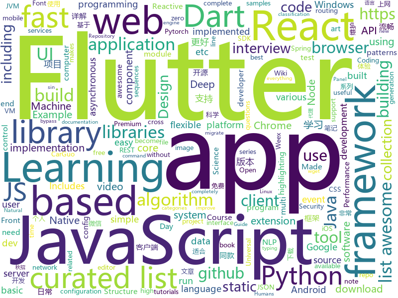

# 2018-09-03
See what the GitHub community is most excited about today.

## python
* [learn-python](https://github.com/trekhleb/learn-python)(**151 stars today**): 📚Playground and cheatsheet for learning Python
* [httpie](https://github.com/jakubroztocil/httpie)(**144 stars today**): Modern command line HTTP client – user-friendly curl alternative with intuitive UI, JSON support, syntax highlighting, wget-like downloads, extensions, etc. https://httpie.org
* [PaperTTY](https://github.com/joukos/PaperTTY)(**135 stars today**): PaperTTY - Python module to render a TTY on e-ink
* [awesome-reactnative-ui](https://github.com/madhavanmalolan/awesome-reactnative-ui)(**102 stars today**): Awesome React Native UI components updated weekly
* [system-design-primer](https://github.com/donnemartin/system-design-primer)(**79 stars today**): Learn how to design large-scale systems. Prep for the system design interview. Includes Anki flashcards.
* [pytorch-flows](https://github.com/ikostrikov/pytorch-flows)(**73 stars today**): PyTorch implementations of algorithms for density estimation
* [ML-From-Scratch](https://github.com/eriklindernoren/ML-From-Scratch)(**55 stars today**): Machine Learning From Scratch. Bare bones Python implementations of machine learning models and algorithms with a focus on accessibility. Aims to cover everything from data mining to deep learning.
* [LSTM-Neural-Network-for-Time-Series-Prediction](https://github.com/jaungiers/LSTM-Neural-Network-for-Time-Series-Prediction)(**42 stars today**): LSTM built using Keras Python package to predict time series steps and sequences. Includes sin wave and stock market data
* [models](https://github.com/tensorflow/models)(**34 stars today**): Models and examples built with TensorFlow
* [youtube-dl](https://github.com/rg3/youtube-dl)(**35 stars today**): Command-line program to download videos from YouTube.com and other video sites
* [awesome-python](https://github.com/vinta/awesome-python)(**34 stars today**): A curated list of awesome Python frameworks, libraries, software and resources
* [pytheory](https://github.com/kennethreitz/pytheory)(**32 stars today**): Music Theory for Humans.
* [keras](https://github.com/keras-team/keras)(**24 stars today**): Deep Learning for humans
* [pylint](https://github.com/PyCQA/pylint)(**28 stars today**): A Python static code analysis tool which looks for programming errors, helps enforcing a coding standard, sniffs for code smells and offers simple refactoring suggestions.
* [soundcloud-dl](https://github.com/sdushantha/soundcloud-dl)(**26 stars today**): 🎵Download SoundCloud music at 128kbps with album art and tags
* [Mk4-Apps](https://github.com/emfcamp/Mk4-Apps)(**9 stars today**): Apps to download and run on the Mk4 badge
* [mypy](https://github.com/python/mypy)(**25 stars today**): Optional static typing for Python 2 and 3 (PEP 484)
* [SSR.Go](https://github.com/leitbogioro/SSR.Go)(**20 stars today**): A new shadowsocksR config manager
* [PayloadsAllTheThings](https://github.com/swisskyrepo/PayloadsAllTheThings)(**22 stars today**): A list of useful payloads and bypass for Web Application Security and Pentest/CTF
* [home-assistant](https://github.com/home-assistant/home-assistant)(**19 stars today**): 🏡Open source home automation that puts local control and privacy first
* [public-apis](https://github.com/toddmotto/public-apis)(**23 stars today**): A collective list of public JSON APIs for use in web development.
* [vid2vid](https://github.com/NVIDIA/vid2vid)(**23 stars today**): Pytorch implementation of our method for high-resolution (e.g. 2048x1024) photorealistic video-to-video translation.
* [UnsupervisedMT](https://github.com/facebookresearch/UnsupervisedMT)(**22 stars today**): Phrase-Based & Neural Unsupervised Machine Translation
* [Photon](https://github.com/s0md3v/Photon)(**22 stars today**): Incredibly fast crawler designed for reconnaissance.
* [awesome-machine-learning](https://github.com/josephmisiti/awesome-machine-learning)(**20 stars today**): A curated list of awesome Machine Learning frameworks, libraries and software.

## java
* [tink](https://github.com/google/tink)(**175 stars today**): Tink is a multi-language, cross-platform library that provides cryptographic APIs that are secure, easy to use correctly, and hard(er) to misuse.
* [WebSiteUseful](https://github.com/loremwalker/WebSiteUseful)(**132 stars today**): 🍅翻墙！科学上网，免费ss帐号分享、ssr订阅源，免费VPN下载，获取及使用教程请看：https://github.com/loremwalker/fq-book
* [Java-Guide](https://github.com/Snailclimb/Java-Guide)(**67 stars today**): A core knowledge that most Java programmers need to master
* [proxyee-down](https://github.com/proxyee-down-org/proxyee-down)(**61 stars today**): http下载工具，基于http代理，支持多连接分块下载
* [java-design-patterns](https://github.com/iluwatar/java-design-patterns)(**35 stars today**): Design patterns implemented in Java
* [interviews](https://github.com/kdn251/interviews)(**37 stars today**): Everything you need to know to get the job.
* [JCSprout](https://github.com/crossoverJie/JCSprout)(**31 stars today**): 👨‍🎓Java Core Sprout : basic, concurrent, algorithm
* [blog](https://github.com/pkwenda/blog)(**33 stars today**): 全栈方向的系列文章
* [spring-boot](https://github.com/spring-projects/spring-boot)(**21 stars today**): Spring Boot
* [spring-framework](https://github.com/spring-projects/spring-framework)(**23 stars today**): Spring Framework
* [elasticsearch](https://github.com/elastic/elasticsearch)(**26 stars today**): Open Source, Distributed, RESTful Search Engine
* [Magisk](https://github.com/topjohnwu/Magisk)(**22 stars today**): A Magic Mask to Alter Android System Systemless-ly
* [tutorials](https://github.com/eugenp/tutorials)(**11 stars today**): The "REST With Spring" Course (price changes permanently next Friday):
* [Java](https://github.com/TheAlgorithms/Java)(**18 stars today**): All Algorithms implemented in Java
* [incubator-dubbo](https://github.com/apache/incubator-dubbo)(**15 stars today**): Apache Dubbo (incubating) is a high-performance, java based, open source RPC framework.
* [RxJava](https://github.com/ReactiveX/RxJava)(**18 stars today**): RxJava – Reactive Extensions for the JVM – a library for composing asynchronous and event-based programs using observable sequences for the Java VM.
* [karate](https://github.com/intuit/karate)(**16 stars today**): Web-Services Testing Made Simple
* [bazel](https://github.com/bazelbuild/bazel)(**15 stars today**): a fast, scalable, multi-language and extensible build system
* [guava](https://github.com/google/guava)(**13 stars today**): Google core libraries for Java
* [react-native-navigation](https://github.com/wix/react-native-navigation)(**13 stars today**): A complete native navigation solution for React Native
* [styx](https://github.com/HotelsDotCom/styx)(**13 stars today**): Programmable, asynchronous, event-based reverse proxy for JVM.
* [weixin-java-tools](https://github.com/Wechat-Group/weixin-java-tools)(**10 stars today**): 全能微信Java开发工具包，支持包括微信支付、开放平台、小程序、企业号和公众号等的开发
* [netty](https://github.com/netty/netty)(**9 stars today**): Netty project - an event-driven asynchronous network application framework
* [VirtualXposed](https://github.com/android-hacker/VirtualXposed)(**12 stars today**): A simple app to use Xposed without root, unlock the bootloader or modify system image, etc.
* [okhttp](https://github.com/square/okhttp)(**10 stars today**): An HTTP+HTTP/2 client for Android and Java applications.

## unknown
* [60_Days_RL_Challenge](https://github.com/andri27-ts/60_Days_RL_Challenge)(**380 stars today**): Learn Deep Reinforcement Learning in depth in 60 days
* [test-your-sysadmin-skills](https://github.com/trimstray/test-your-sysadmin-skills)(**180 stars today**): A collection of *nix Sysadmin Test Questions and Answers for Interview/Exam (2018 Edition).
* [nodebestpractices](https://github.com/i0natan/nodebestpractices)(**118 stars today**): The largest Node.JS best practices list (August 2018)
* [Front-End-Performance-Checklist](https://github.com/thedaviddias/Front-End-Performance-Checklist)(**93 stars today**): 🎮The only Front-End Performance Checklist that runs faster than the others
* [100-Days-Of-ML-Code](https://github.com/Avik-Jain/100-Days-Of-ML-Code)(**59 stars today**): 100 Days of ML Coding
* [awesome](https://github.com/sindresorhus/awesome)(**60 stars today**): 😎Curated list of awesome lists
* [crypto](https://github.com/boazbk/crypto)(**54 stars today**): Lecture notes for a course on cryptography
* [CS-Notes](https://github.com/CyC2018/CS-Notes)(**45 stars today**): 📚Computer Science Learning Notes
* [gitignore](https://github.com/github/gitignore)(**42 stars today**): A collection of useful .gitignore templates
* [You-Dont-Know-JS](https://github.com/getify/You-Dont-Know-JS)(**46 stars today**): A book series on JavaScript. @YDKJS on twitter.
* [coding-interview-university](https://github.com/jwasham/coding-interview-university)(**39 stars today**): A complete computer science study plan to become a software engineer.
* [project-based-learning](https://github.com/tuvtran/project-based-learning)(**28 stars today**): Curated list of project-based tutorials
* [free-programming-books](https://github.com/EbookFoundation/free-programming-books)(**28 stars today**): 📚Freely available programming books
* [awesome-vue](https://github.com/vuejs/awesome-vue)(**26 stars today**): 🎉A curated list of awesome things related to Vue.js
* [build-your-own-x](https://github.com/danistefanovic/build-your-own-x)(**27 stars today**): 🤓Build your own (insert technology here)
* [awesome-console-services](https://github.com/chubin/awesome-console-services)(**27 stars today**): A curated list of awesome console services (reachable via HTTP, HTTPS and other network protocols)
* [fancyss_history_package](https://github.com/hq450/fancyss_history_package)(**24 stars today**): 科学上网插件的离线安装包储存在这里
* [dl_career_faq](https://github.com/Kyubyong/dl_career_faq)(**22 stars today**): Deep Learning Career FAQ
* [replacing-bash-scripting-with-python](https://github.com/ninjaaron/replacing-bash-scripting-with-python)(**21 stars today**): Guide on using using python for administrative scripting
* [2019_campus_apply](https://github.com/frank-lam/2019_campus_apply)(**17 stars today**): 🚀备战秋招/面试，CS学习笔记。金九银十，你准备好了吗？from zero to hero.
* [Front-end-Developer-Interview-Questions](https://github.com/h5bp/Front-end-Developer-Interview-Questions)(**19 stars today**): A list of helpful front-end related questions you can use to interview potential candidates, test yourself or completely ignore.
* [awesome-flutter](https://github.com/Solido/awesome-flutter)(**18 stars today**): An awesome list that curates the best Flutter libraries, tools, tutorials, articles and more.
* [new-pac](https://github.com/Alvin9999/new-pac)(**15 stars today**): 
* [Awesome-Hacking](https://github.com/Hack-with-Github/Awesome-Hacking)(**16 stars today**): A collection of various awesome lists for hackers, pentesters and security researchers
* [react-advanced-patterns](https://github.com/manjula91/react-advanced-patterns)(**16 stars today**): Advanced React Component Patterns

## javascript
* [pwa](https://github.com/lukeed/pwa)(**295 stars today**): (WIP) Universal PWA Builder
* [react-proto](https://github.com/React-Proto/react-proto)(**209 stars today**): 🎨React application prototyping tool for developers and designers.
* [linaria](https://github.com/callstack/linaria)(**163 stars today**): Zero-runtime CSS in JS library
* [f2](https://github.com/antvis/f2)(**146 stars today**): 📱📈An elegant, interactive and flexible charting library for mobile.
* [zeu](https://github.com/shzlw/zeu)(**144 stars today**): A JavaScript library for real-time visualization
* [windows95](https://github.com/felixrieseberg/windows95)(**113 stars today**): 💩🚀Windows 95 in Electron. Runs on macOS, Linux, and Windows.
* [shimport](https://github.com/Rich-Harris/shimport)(**89 stars today**): Use JavaScript modules in all browsers, including dynamic imports
* [trilium](https://github.com/zadam/trilium)(**82 stars today**): Hierarchical note taking application
* [vue](https://github.com/vuejs/vue)(**71 stars today**): 🖖A progressive, incrementally-adoptable JavaScript framework for building UI on the web.
* [react](https://github.com/facebook/react)(**67 stars today**): A declarative, efficient, and flexible JavaScript library for building user interfaces.
* [v86](https://github.com/copy/v86)(**67 stars today**): x86 virtualization in JavaScript, running in your browser and NodeJS
* [puppeteer-recorder](https://github.com/checkly/puppeteer-recorder)(**52 stars today**): Puppeteer recorder is a Chrome extension that records your browser interactions and generates a Puppeteer script.
* [javascript-algorithms](https://github.com/trekhleb/javascript-algorithms)(**42 stars today**): Algorithms and data structures implemented in JavaScript with explanations and links to further readings
* [axios](https://github.com/axios/axios)(**47 stars today**): Promise based HTTP client for the browser and node.js
* [material-ui](https://github.com/mui-org/material-ui)(**35 stars today**): React components that implement Google's Material Design.
* [javascript](https://github.com/airbnb/javascript)(**39 stars today**): JavaScript Style Guide
* [lisk-hub](https://github.com/LiskHQ/lisk-hub)(**40 stars today**): 🖥Lisk graphical user interface for desktop
* [puppeteer](https://github.com/GoogleChrome/puppeteer)(**37 stars today**): Headless Chrome Node API
* [create-react-app](https://github.com/facebook/create-react-app)(**32 stars today**): Create React apps with no build configuration.
* [react-native](https://github.com/facebook/react-native)(**35 stars today**): A framework for building native apps with React.
* [js-lingui](https://github.com/lingui/js-lingui)(**36 stars today**): 🌍📖A readable, automated, and optimized (5 kb) internationalization for JavaScript and React
* [RSSHub](https://github.com/DIYgod/RSSHub)(**33 stars today**): 🍰万物皆可 RSS
* [code-surfer](https://github.com/pomber/code-surfer)(**35 stars today**): React component for scrolling, zooming and highlighting code samples <🏄/>
* [progressive-tooling](https://github.com/GoogleChromeLabs/progressive-tooling)(**34 stars today**): A list of community-built, third-party tools that can be used to improve page performance
* [next.js](https://github.com/zeit/next.js)(**31 stars today**): Next.js is a lightweight framework for static and server‑rendered applications.

## html
* [lazyestload.js](https://github.com/Paul-Browne/lazyestload.js)(**20 stars today**): load images only when they are in (and remain in) the viewport
* [awesome-mac](https://github.com/jaywcjlove/awesome-mac)(**16 stars today**):  Now we have become very big, Different from the original idea. Collect premium software in various categories.
* [JavaScript30](https://github.com/wesbos/JavaScript30)(**12 stars today**): 30 Day Vanilla JS Challenge
* [Coursera-ML-AndrewNg-Notes](https://github.com/fengdu78/Coursera-ML-AndrewNg-Notes)(**12 stars today**): 吴恩达老师的机器学习课程个人笔记
* [fastText](https://github.com/facebookresearch/fastText)(**13 stars today**): Library for fast text representation and classification.
* [TinyEditor](https://github.com/umpox/TinyEditor)(**12 stars today**): A functional HTML/CSS/JS editor in less than 400 bytes
* [skill-map](https://github.com/TeamStuQ/skill-map)(**11 stars today**): 程序员技能图谱
* [AdminLTE](https://github.com/almasaeed2010/AdminLTE)(**9 stars today**): AdminLTE - Free Premium Admin control Panel Theme Based On Bootstrap 3.x
* [awesome-competitive-programming](https://github.com/lnishan/awesome-competitive-programming)(**9 stars today**): 💎A curated list of awesome Competitive Programming, Algorithm and Data Structure resources
* [javascript-tutorial-en](https://github.com/iliakan/javascript-tutorial-en)(**8 stars today**): Modern JavaScript Tutorial
* [Publii](https://github.com/GetPublii/Publii)(**10 stars today**): Publii is a desktop-based CMS for Windows and Mac that makes creating static websites fast and hassle-free, even for beginners.
* [NLP-progress](https://github.com/sebastianruder/NLP-progress)(**7 stars today**): Repository to track the progress in Natural Language Processing (NLP), including the datasets and the current state-of-the-art for the most common NLP tasks.
* [patchwork](https://github.com/jlord/patchwork)(****): All the Git-it Workshop completers!
* [Spoon-Knife](https://github.com/octocat/Spoon-Knife)(****): This repo is for demonstration purposes only.
* [fonts](https://github.com/google/fonts)(**6 stars today**): Font files available from Google Fonts
* [OI-wiki](https://github.com/24OI/OI-wiki)(**5 stars today**): 🌟Wiki for OI / ACM-ICPC. （某大型游戏线上攻略，内含炫酷算术魔法）
* [node-interview](https://github.com/ElemeFE/node-interview)(**7 stars today**): How to pass the Node.js interview of ElemeFE.
* [react-app-rewired](https://github.com/timarney/react-app-rewired)(**7 stars today**): Override create-react-app webpack configs without ejecting
* [component](https://github.com/reactions/component)(**7 stars today**): Declarative version of React.Component
* [quantum_machine_learning](https://github.com/llSourcell/quantum_machine_learning)(**7 stars today**): This is the code for "Quantum Machine Learning" By Siraj Raval on Youtube
* [portainer](https://github.com/portainer/portainer)(**6 stars today**): Simple management UI for Docker
* [ctf-wiki](https://github.com/ctf-wiki/ctf-wiki)(**6 stars today**): CTF Wiki Online
* [frontend](https://github.com/guardian/frontend)(**6 stars today**): Source for theguardian.com
* [openapi-generator](https://github.com/OpenAPITools/openapi-generator)(**6 stars today**): OpenAPI Generator allows generation of API client libraries (SDK generation), server stubs, documentation and configuration automatically given an OpenAPI Spec (v2, v3)
* [trpl-zh-cn](https://github.com/KaiserY/trpl-zh-cn)(**6 stars today**): Rust 程序设计语言（第二版）

## dart
* [flutter](https://github.com/flutter/flutter)(**44 stars today**): Flutter makes it easy and fast to build beautiful mobile apps.
* [GSYGithubAppFlutter](https://github.com/CarGuo/GSYGithubAppFlutter)(**8 stars today**): 超完整的Flutter项目，功能丰富，适合学习和日常使用。GSYGithubApp系列的优势：我们目前已经拥有Flutter、Weex、ReactNative三个版本。 功能齐全，项目框架内技术涉及面广，完成度高，持续维护，配套文章，适合全面学习，跨框架对比参考。跨平台的开源Github客户端App，更好的体验，更丰富的功能，旨在更好的日常管理和维护个人Github，提供更好更方便的驾车体验～～Σ(￣。￣ﾉ)ﾉ。同款Weex版本 ： https://github.com/CarGuo/GSYGithubAppWeex 、同款React Native版本 ： https://github.com/CarGuo/GSYGithubApp
* [plugins](https://github.com/flutter/plugins)(**5 stars today**): Plugins for Flutter, including FlutterFire, maintained by the Flutter team
* [material_search](https://github.com/ianldgs/material_search)(****): 
* [chromedeveditor](https://github.com/googlearchive/chromedeveditor)(****): Chrome Dev Editor is a developer tool for building apps on the Chrome platform - Chrome Apps and Web Apps, in JavaScript or Dart. (NO LONGER IN ACTIVE DEVELOPMENT)
* [sdk](https://github.com/dart-lang/sdk)(****): The Dart SDK, including the VM, dart2js, core libraries, and more.
* [flutter-osc](https://github.com/yubo725/flutter-osc)(****): 基于Google Flutter的开源中国客户端，支持Android和iOS。
* [flutter-examples](https://github.com/nisrulz/flutter-examples)(****): [Examples] Simple basic isolated apps, for budding flutter devs.
* [inKino](https://github.com/roughike/inKino)(****): inKino - A cross platform movie and showtime browser for Finnkino cinemas, made with Flutter.
* [hauberk](https://github.com/munificent/hauberk)(****): A web-based roguelike written in Dart.
* [flutter_architecture_samples](https://github.com/brianegan/flutter_architecture_samples)(****): TodoMVC for Flutter
* [Flutter-UI-Kit](https://github.com/iampawan/Flutter-UI-Kit)(****): Flutter app for collection of UI in a UIKit
* [Flutter-learning](https://github.com/AweiLoveAndroid/Flutter-learning)(****): 🔥👍🌟⭐️⭐️⭐️Flutter从配置安装到填坑指南详解，Flutter相关Demo解读，项目实例，Dart语法详解
* [FlutterExampleApps](https://github.com/iampawan/FlutterExampleApps)(****): [Example APPS] Basic Flutter apps, for flutter devs.
* [dio](https://github.com/flutterchina/dio)(****): A powerful Http client for Dart, which supports Interceptors, FormData, Request Cancellation, File Downloading, Timeout etc.
* [angular](https://github.com/dart-lang/angular)(****): Fast and productive web framework provided by Dart
* [zhihu-flutter](https://github.com/HackSoul/zhihu-flutter)(****): Flutter 高仿知乎 UI，非常漂亮，也非常流畅，flutter build apk 或 flutter build ios 之后更流畅
* [StageXL](https://github.com/bp74/StageXL)(****): A fast and universal 2D rendering engine for HTML5 and Dart.
* [dart-sass](https://github.com/sass/dart-sass)(****): A Dart implementation of Sass.
* [github-issue-mover](https://github.com/google/github-issue-mover)(****): Making it easy to migrate issues between repos.
* [rxdart](https://github.com/ReactiveX/rxdart)(****): The Reactive Extensions for Dart
* [aqueduct](https://github.com/stablekernel/aqueduct)(****): Dart HTTP server framework for building REST APIs. Includes PostgreSQL ORM and OAuth2 provider.
* [start](https://github.com/lvivski/start)(****): Sinatra inspired web development framework for Dart
* [fluro](https://github.com/theyakka/fluro)(****): Fluro is a Flutter routing library that adds flexible routing options like wildcards, named parameters and clear route definitions.
* [dart-samples](https://github.com/dart-lang/dart-samples)(****): Various samples and examples in Dart

## WordCloud

