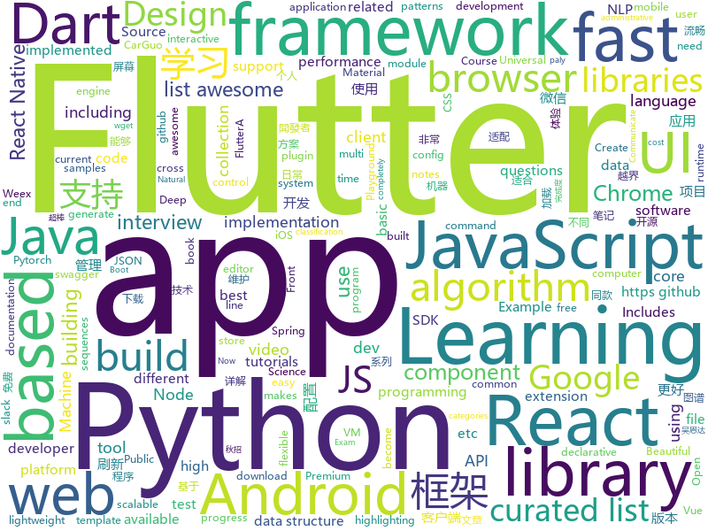

# 2018-09-04
See what the GitHub community is most excited about today.

## python
* [awesome-reactnative-ui](https://github.com/madhavanmalolan/awesome-reactnative-ui)(**291 stars today**): Awesome React Native UI components updated weekly
* [learn-python](https://github.com/trekhleb/learn-python)(**279 stars today**): 📚Playground and cheatsheet for learning Python
* [httpie](https://github.com/jakubroztocil/httpie)(**274 stars today**): Modern command line HTTP client – user-friendly curl alternative with intuitive UI, JSON support, syntax highlighting, wget-like downloads, extensions, etc. https://httpie.org
* [system-design-primer](https://github.com/donnemartin/system-design-primer)(**249 stars today**): Learn how to design large-scale systems. Prep for the system design interview. Includes Anki flashcards.
* [PaperTTY](https://github.com/joukos/PaperTTY)(**117 stars today**): PaperTTY - Python module to render a TTY on e-ink
* [macOS-Security-and-Privacy-Guide](https://github.com/drduh/macOS-Security-and-Privacy-Guide)(**106 stars today**): A practical guide to securing macOS.
* [masonite](https://github.com/MasoniteFramework/masonite)(**79 stars today**): The Modern And Developer Centric Python Web Framework. Be sure to read the documentation and join the Slack channel questions: http://slack.masoniteproject.com
* [models](https://github.com/tensorflow/models)(**54 stars today**): Models and examples built with TensorFlow
* [pytheory](https://github.com/kennethreitz/pytheory)(**68 stars today**): Music Theory for Humans.
* [lazydata](https://github.com/rstojnic/lazydata)(**68 stars today**): lazydata: scalable data dependencies for python projects
* [UnsupervisedMT](https://github.com/facebookresearch/UnsupervisedMT)(**56 stars today**): Phrase-Based & Neural Unsupervised Machine Translation
* [3dpwn](https://github.com/niklasb/3dpwn)(**48 stars today**): VirtualBox 3D exploits & PoCs
* [awesome-python](https://github.com/vinta/awesome-python)(**48 stars today**): A curated list of awesome Python frameworks, libraries, software and resources
* [youtube-dl](https://github.com/rg3/youtube-dl)(**49 stars today**): Command-line program to download videos from YouTube.com and other video sites
* [cheat.sh](https://github.com/chubin/cheat.sh)(**45 stars today**): the only cheat sheet you need
* [ML-From-Scratch](https://github.com/eriklindernoren/ML-From-Scratch)(**38 stars today**): Machine Learning From Scratch. Bare bones Python implementations of machine learning models and algorithms with a focus on accessibility. Aims to cover everything from data mining to deep learning.
* [vid2vid](https://github.com/NVIDIA/vid2vid)(**38 stars today**): Pytorch implementation of our method for high-resolution (e.g. 2048x1024) photorealistic video-to-video translation.
* [face_recognition](https://github.com/ageitgey/face_recognition)(**35 stars today**): The world's simplest facial recognition api for Python and the command line
* [keras](https://github.com/keras-team/keras)(**29 stars today**): Deep Learning for humans
* [Photon](https://github.com/s0md3v/Photon)(**34 stars today**): Incredibly fast crawler designed for reconnaissance.
* [pytorch-flows](https://github.com/ikostrikov/pytorch-flows)(**34 stars today**): PyTorch implementations of algorithms for density estimation
* [public-apis](https://github.com/toddmotto/public-apis)(**29 stars today**): A collective list of public JSON APIs for use in web development.
* [Algorithm_Interview_Notes-Chinese](https://github.com/imhuay/Algorithm_Interview_Notes-Chinese)(**29 stars today**): 2018/2019/校招/春招/秋招/算法/机器学习(Machine Learning)/深度学习(Deep Learning)/自然语言处理(NLP)/C/C++/Python/面试笔记
* [cpython](https://github.com/python/cpython)(**25 stars today**): The Python programming language
* [LSTM-Neural-Network-for-Time-Series-Prediction](https://github.com/jaungiers/LSTM-Neural-Network-for-Time-Series-Prediction)(**29 stars today**): LSTM built using Keras Python package to predict time series steps and sequences. Includes sin wave and stock market data

## java
* [WebSiteUseful](https://github.com/loremwalker/WebSiteUseful)(**496 stars today**): 🍅翻墙！科学上网，免费ss帐号分享、ssr订阅源，免费VPN下载，获取及使用教程请看：https://github.com/loremwalker/fq-book
* [tink](https://github.com/google/tink)(**339 stars today**): Tink is a multi-language, cross-platform library that provides cryptographic APIs that are secure, easy to use correctly, and hard(er) to misuse.
* [Java-Guide](https://github.com/Snailclimb/Java-Guide)(**108 stars today**): A core knowledge that most Java programmers need to master
* [JCSprout](https://github.com/crossoverJie/JCSprout)(**100 stars today**): 👨‍🎓Java Core Sprout : basic, concurrent, algorithm
* [proxyee-down](https://github.com/proxyee-down-org/proxyee-down)(**87 stars today**): http下载工具，基于http代理，支持多连接分块下载
* [java-design-patterns](https://github.com/iluwatar/java-design-patterns)(**67 stars today**): Design patterns implemented in Java
* [interviews](https://github.com/kdn251/interviews)(**69 stars today**): Everything you need to know to get the job.
* [arc-seekbar](https://github.com/GcsSloop/arc-seekbar)(**68 stars today**): Android 圆弧形 SeekBar。
* [AndroidAutoSize](https://github.com/JessYanCoding/AndroidAutoSize)(**61 stars today**): A low-cost Android screen adaptation solution (今日头条屏幕适配方案终极版，一个极低成本的 Android 屏幕适配方案).
* [weixin-java-tools](https://github.com/Wechat-Group/weixin-java-tools)(**47 stars today**): 全能微信Java开发工具包，支持包括微信支付、开放平台、小程序、企业号和公众号等的开发
* [spring-boot](https://github.com/spring-projects/spring-boot)(**38 stars today**): Spring Boot
* [cicada](https://github.com/TogetherOS/cicada)(**50 stars today**): 🚀Fast lightweight HTTP service framework.
* [RxJava](https://github.com/ReactiveX/RxJava)(**45 stars today**): RxJava – Reactive Extensions for the JVM – a library for composing asynchronous and event-based programs using observable sequences for the Java VM.
* [blog](https://github.com/pkwenda/blog)(**45 stars today**): 全栈方向系列文章
* [Java](https://github.com/TheAlgorithms/Java)(**35 stars today**): All Algorithms implemented in Java
* [spring-framework](https://github.com/spring-projects/spring-framework)(**30 stars today**): Spring Framework
* [elasticsearch](https://github.com/elastic/elasticsearch)(**30 stars today**): Open Source, Distributed, RESTful Search Engine
* [apollo](https://github.com/ctripcorp/apollo)(**32 stars today**): Apollo（阿波罗）是携程框架部门研发的分布式配置中心，能够集中化管理应用不同环境、不同集群的配置，配置修改后能够实时推送到应用端，并且具备规范的权限、流程治理等特性，适用于微服务配置管理场景。
* [X2C](https://github.com/iReaderAndroid/X2C)(**35 stars today**): 提升布局加载速度200%
* [tutorials](https://github.com/eugenp/tutorials)(**20 stars today**): The "REST With Spring" Course (price changes permanently next Friday):
* [Sentinel](https://github.com/alibaba/Sentinel)(**30 stars today**): A lightweight flow-control library providing high-available protection and monitoring (高可用防护的流量管理框架)
* [incubator-dubbo](https://github.com/apache/incubator-dubbo)(**27 stars today**): Apache Dubbo (incubating) is a high-performance, java based, open source RPC framework.
* [bazel](https://github.com/bazelbuild/bazel)(**31 stars today**): a fast, scalable, multi-language and extensible build system
* [guava](https://github.com/google/guava)(**31 stars today**): Google core libraries for Java
* [SmartRefreshLayout](https://github.com/scwang90/SmartRefreshLayout)(**27 stars today**): 🔥下拉刷新、上拉加载、二级刷新、淘宝二楼、RefreshLayout、OverScroll，Android智能下拉刷新框架，支持越界回弹、越界拖动，具有极强的扩展性，集成了几十种炫酷的Header和 Footer。

## unknown
* [test-your-sysadmin-skills](https://github.com/trimstray/test-your-sysadmin-skills)(**266 stars today**): A collection of *nix Sysadmin Test Questions and Answers for Interview/Exam (2018 Edition).
* [100-Days-Of-ML-Code](https://github.com/Avik-Jain/100-Days-Of-ML-Code)(**157 stars today**): 100 Days of ML Coding
* [nodebestpractices](https://github.com/i0natan/nodebestpractices)(**171 stars today**): The largest Node.JS best practices list (August 2018)
* [CS-Notes](https://github.com/CyC2018/CS-Notes)(**107 stars today**): 📚Computer Science Learning Notes
* [Operating-Systems-Three-Easy-Pieces-in-japanese](https://github.com/syarochan/Operating-Systems-Three-Easy-Pieces-in-japanese)(**125 stars today**): 
* [CS-Interview-Knowledge-Map](https://github.com/InterviewMap/CS-Interview-Knowledge-Map)(**84 stars today**): Build the best interview map. The current content includes JS, network, browser related, performance optimization, security, framework, Git, data structure, algorithm, etc.
* [coding-interview-university](https://github.com/jwasham/coding-interview-university)(**70 stars today**): A complete computer science study plan to become a software engineer.
* [gitignore](https://github.com/github/gitignore)(**63 stars today**): A collection of useful .gitignore templates
* [Front-End-Performance-Checklist](https://github.com/thedaviddias/Front-End-Performance-Checklist)(**75 stars today**): 🎮The only Front-End Performance Checklist that runs faster than the others
* [awesome](https://github.com/sindresorhus/awesome)(**62 stars today**): 😎Curated list of awesome lists
* [free-programming-books](https://github.com/EbookFoundation/free-programming-books)(**45 stars today**): 📚Freely available programming books
* [architect-awesome](https://github.com/xingshaocheng/architect-awesome)(**48 stars today**): 后端架构师技术图谱
* [awesome-vue](https://github.com/vuejs/awesome-vue)(**47 stars today**): 🎉A curated list of awesome things related to Vue.js
* [replacing-bash-scripting-with-python](https://github.com/ninjaaron/replacing-bash-scripting-with-python)(**49 stars today**): Guide on using using python for administrative scripting
* [fe9-library](https://github.com/frontend9/fe9-library)(**48 stars today**): 九部知识库
* [Front-End-Checklist](https://github.com/EngineLin/Front-End-Checklist)(**46 stars today**): 🗂給現代網站及細膩開發者使用，超棒的前端開發者清單
* [crypto](https://github.com/boazbk/crypto)(**41 stars today**): Lecture notes for a course on cryptography
* [awesome-flutter](https://github.com/Solido/awesome-flutter)(**39 stars today**): An awesome list that curates the best Flutter libraries, tools, tutorials, articles and more.
* [android-architecture](https://github.com/googlesamples/android-architecture)(**31 stars today**): A collection of samples to discuss and showcase different architectural tools and patterns for Android apps.
* [Front-end-Developer-Interview-Questions](https://github.com/h5bp/Front-end-Developer-Interview-Questions)(**28 stars today**): A list of helpful front-end related questions you can use to interview potential candidates, test yourself or completely ignore.
* [build-your-own-x](https://github.com/danistefanovic/build-your-own-x)(**29 stars today**): 🤓Build your own (insert technology here)
* [FreeProGuard](https://github.com/Blankj/FreeProGuard)(**27 stars today**): 🔰Config proguard for common Android libraries.
* [survivingtheappstore](https://github.com/amirrajan/survivingtheappstore)(**24 stars today**): My book on getting to the #1 Spot in the App Store. Buy my games to support me.
* [project-based-learning](https://github.com/tuvtran/project-based-learning)(**21 stars today**): Curated list of project-based tutorials
* [new-pac](https://github.com/Alvin9999/new-pac)(**20 stars today**): 

## javascript
* [pwa](https://github.com/lukeed/pwa)(**437 stars today**): (WIP) Universal PWA Builder
* [react-proto](https://github.com/React-Proto/react-proto)(**327 stars today**): 🎨React application prototyping tool for developers and designers.
* [linaria](https://github.com/callstack/linaria)(**203 stars today**): Zero-runtime CSS in JS library
* [f2](https://github.com/antvis/f2)(**196 stars today**): 📱📈An elegant, interactive and flexible charting library for mobile.
* [zeu](https://github.com/shzlw/zeu)(**178 stars today**): A JavaScript library for real-time visualization
* [ant-design-pro](https://github.com/ant-design/ant-design-pro)(**146 stars today**): 👨🏻‍💻👩🏻‍💻 Use Ant Design like a Pro!
* [umi](https://github.com/umijs/umi)(**123 stars today**): 🌋Pluggable enterprise-level react application framework.
* [vue](https://github.com/vuejs/vue)(**116 stars today**): 🖖A progressive, incrementally-adoptable JavaScript framework for building UI on the web.
* [javascript-algorithms](https://github.com/trekhleb/javascript-algorithms)(**100 stars today**): Algorithms and data structures implemented in JavaScript with explanations and links to further readings
* [react](https://github.com/facebook/react)(**91 stars today**): A declarative, efficient, and flexible JavaScript library for building user interfaces.
* [react-webworker](https://github.com/ghengeveld/react-webworker)(**93 stars today**): ⚙️Communicate with a Web Worker from React
* [ailab](https://github.com/Microsoft/ailab)(**84 stars today**): Experience, Learn and Code the latest breakthrough innovations with Microsoft AI
* [puppeteer-recorder](https://github.com/checkly/puppeteer-recorder)(**84 stars today**): Puppeteer recorder is a Chrome extension that records your browser interactions and generates a Puppeteer script.
* [create-react-app](https://github.com/facebook/create-react-app)(**64 stars today**): Create React apps with no build configuration.
* [v86](https://github.com/copy/v86)(**72 stars today**): x86 virtualization in JavaScript, running in your browser and NodeJS
* [axios](https://github.com/axios/axios)(**62 stars today**): Promise based HTTP client for the browser and node.js
* [shimport](https://github.com/Rich-Harris/shimport)(**63 stars today**): Use JavaScript modules in all browsers, including dynamic imports
* [javascript](https://github.com/airbnb/javascript)(**58 stars today**): JavaScript Style Guide
* [react-native](https://github.com/facebook/react-native)(**54 stars today**): A framework for building native apps with React.
* [material-ui](https://github.com/mui-org/material-ui)(**52 stars today**): React components that implement Google's Material Design.
* [taro](https://github.com/NervJS/taro)(**55 stars today**): 多端统一开发框架，支持用 React 的开发方式编写一次代码，生成能运行在微信小程序、H5、React Native 等的应用。
* [puppeteer](https://github.com/GoogleChrome/puppeteer)(**51 stars today**): Headless Chrome Node API
* [code-surfer](https://github.com/pomber/code-surfer)(**54 stars today**): React component for scrolling, zooming and highlighting code samples <🏄/>
* [node](https://github.com/nodejs/node)(**39 stars today**): Node.js JavaScript runtime✨🐢🚀✨
* [storybook](https://github.com/storybooks/storybook)(**44 stars today**): Interactive UI component dev & test: React, React Native, Vue, Angular

## html
* [frontend](https://github.com/guardian/frontend)(**365 stars today**): Source for theguardian.com
* [reverse-engineering-tutorials](https://github.com/maestron/reverse-engineering-tutorials)(**106 stars today**): Reverse Engineering Tutorials
* [lazyestload.js](https://github.com/Paul-Browne/lazyestload.js)(**102 stars today**): load images only when they are in (and remain in) the viewport
* [hacking-tutorials](https://github.com/maestron/hacking-tutorials)(**33 stars today**): hacking-tutorials
* [awesome-mac](https://github.com/jaywcjlove/awesome-mac)(**26 stars today**):  Now we have become very big, Different from the original idea. Collect premium software in various categories.
* [AdminLTE](https://github.com/almasaeed2010/AdminLTE)(**19 stars today**): AdminLTE - Free Premium Admin control Panel Theme Based On Bootstrap 3.x
* [TinyEditor](https://github.com/umpox/TinyEditor)(**21 stars today**): A functional HTML/CSS/JS editor in less than 400 bytes
* [NLP-progress](https://github.com/sebastianruder/NLP-progress)(**18 stars today**): Repository to track the progress in Natural Language Processing (NLP), including the datasets and the current state-of-the-art for the most common NLP tasks.
* [Coursera-ML-AndrewNg-Notes](https://github.com/fengdu78/Coursera-ML-AndrewNg-Notes)(**15 stars today**): 吴恩达老师的机器学习课程个人笔记
* [Publii](https://github.com/GetPublii/Publii)(**18 stars today**): Publii is a desktop-based CMS for Windows and Mac that makes creating static websites fast and hassle-free, even for beginners.
* [fastText](https://github.com/facebookresearch/fastText)(**16 stars today**): Library for fast text representation and classification.
* [skill-map](https://github.com/TeamStuQ/skill-map)(**16 stars today**): 程序员技能图谱
* [javascript-tutorial-tr](https://github.com/sahinyanlik/javascript-tutorial-tr)(**16 stars today**): 
* [cs231n.github.io](https://github.com/cs231n/cs231n.github.io)(**11 stars today**): Public facing notes page
* [react-app-rewired](https://github.com/timarney/react-app-rewired)(**11 stars today**): Override create-react-app webpack configs without ejecting
* [fonts](https://github.com/google/fonts)(**10 stars today**): Font files available from Google Fonts
* [Spoon-Knife](https://github.com/octocat/Spoon-Knife)(****): This repo is for demonstration purposes only.
* [component](https://github.com/reactions/component)(**10 stars today**): Declarative version of React.Component
* [quantum_machine_learning](https://github.com/llSourcell/quantum_machine_learning)(**10 stars today**): This is the code for "Quantum Machine Learning" By Siraj Raval on Youtube
* [portainer](https://github.com/portainer/portainer)(**8 stars today**): Simple management UI for Docker
* [awesome-competitive-programming](https://github.com/lnishan/awesome-competitive-programming)(**7 stars today**): 💎A curated list of awesome Competitive Programming, Algorithm and Data Structure resources
* [EIPs](https://github.com/ethereum/EIPs)(**5 stars today**): The Ethereum Improvement Proposal repository
* [trpl-zh-cn](https://github.com/KaiserY/trpl-zh-cn)(**7 stars today**): Rust 程序设计语言（第二版）
* [swagger-codegen](https://github.com/swagger-api/swagger-codegen)(**5 stars today**): swagger-codegen contains a template-driven engine to generate documentation, API clients and server stubs in different languages by parsing your OpenAPI / Swagger definition.
* [Winds](https://github.com/GetStream/Winds)(**7 stars today**): A Beautiful Open Source RSS & Podcast App Powered by Getstream.io

## dart
* [flutter](https://github.com/flutter/flutter)(**72 stars today**): Flutter makes it easy and fast to build beautiful mobile apps.
* [flutter_play](https://github.com/naumanahmed19/flutter_play)(**22 stars today**): A google paly store clone (Work in progress)
* [GSYGithubAppFlutter](https://github.com/CarGuo/GSYGithubAppFlutter)(**15 stars today**): 超完整的Flutter项目，功能丰富，适合学习和日常使用。GSYGithubApp系列的优势：我们目前已经拥有Flutter、Weex、ReactNative三个版本。 功能齐全，项目框架内技术涉及面广，完成度高，持续维护，配套文章，适合全面学习，跨框架对比参考。跨平台的开源Github客户端App，更好的体验，更丰富的功能，旨在更好的日常管理和维护个人Github，提供更好更方便的驾车体验～～Σ(￣。￣ﾉ)ﾉ。同款Weex版本 ： https://github.com/CarGuo/GSYGithubAppWeex 、同款React Native版本 ： https://github.com/CarGuo/GSYGithubApp
* [plugins](https://github.com/flutter/plugins)(**13 stars today**): Plugins for Flutter, including FlutterFire, maintained by the Flutter team
* [dio](https://github.com/flutterchina/dio)(**8 stars today**): A powerful Http client for Dart, which supports Interceptors, FormData, Request Cancellation, File Downloading, Timeout etc.
* [flutter_google_map_view](https://github.com/apptreesoftware/flutter_google_map_view)(**5 stars today**): A flutter plugin for Google Maps
* [fluwx](https://github.com/OpenFlutter/fluwx)(**7 stars today**): Flutter版微信SDK.WeChat SDK for flutter.
* [GankFlutter](https://github.com/ZQ330093887/GankFlutter)(**6 stars today**): 干货集中营 客户端 flutter版
* [FlutterPlayground](https://github.com/ibhavikmakwana/FlutterPlayground)(****): Playground app for Flutter
* [audioplayer](https://github.com/rxlabz/audioplayer)(****): A flutter plugin to play audio files ( ObjC/Java )
* [material-components-flutter-codelabs](https://github.com/material-components/material-components-flutter-codelabs)(****): Codelabs for Material Components for Flutter (MDC-Flutter)
* [chromedeveditor](https://github.com/googlearchive/chromedeveditor)(****): Chrome Dev Editor is a developer tool for building apps on the Chrome platform - Chrome Apps and Web Apps, in JavaScript or Dart. (NO LONGER IN ACTIVE DEVELOPMENT)
* [sdk](https://github.com/dart-lang/sdk)(****): The Dart SDK, including the VM, dart2js, core libraries, and more.
* [flutter-osc](https://github.com/yubo725/flutter-osc)(****): 基于Google Flutter的开源中国客户端，支持Android和iOS。
* [flutter-examples](https://github.com/nisrulz/flutter-examples)(****): [Examples] Simple basic isolated apps, for budding flutter devs.
* [inKino](https://github.com/roughike/inKino)(****): inKino - A cross platform movie and showtime browser for Finnkino cinemas, made with Flutter.
* [flutter_architecture_samples](https://github.com/brianegan/flutter_architecture_samples)(****): TodoMVC for Flutter
* [hauberk](https://github.com/munificent/hauberk)(****): A web-based roguelike written in Dart.
* [Flutter-UI-Kit](https://github.com/iampawan/Flutter-UI-Kit)(****): Flutter app for collection of UI in a UIKit
* [Flutter-learning](https://github.com/AweiLoveAndroid/Flutter-learning)(****): 🔥👍🌟⭐️⭐️⭐️Flutter从配置安装到填坑指南详解，Flutter相关Demo解读，项目实例，Dart语法详解
* [FlutterExampleApps](https://github.com/iampawan/FlutterExampleApps)(****): [Example APPS] Basic Flutter apps, for flutter devs.
* [angular](https://github.com/dart-lang/angular)(****): Fast and productive web framework provided by Dart
* [zhihu-flutter](https://github.com/HackSoul/zhihu-flutter)(****): Flutter 高仿知乎 UI，非常漂亮，也非常流畅，flutter build apk 或 flutter build ios 之后更流畅
* [StageXL](https://github.com/bp74/StageXL)(****): A fast and universal 2D rendering engine for HTML5 and Dart.
* [dart-sass](https://github.com/sass/dart-sass)(****): A Dart implementation of Sass.

## WordCloud

